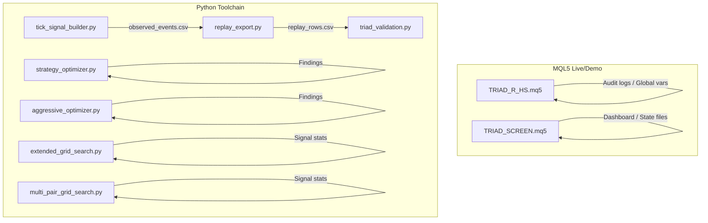
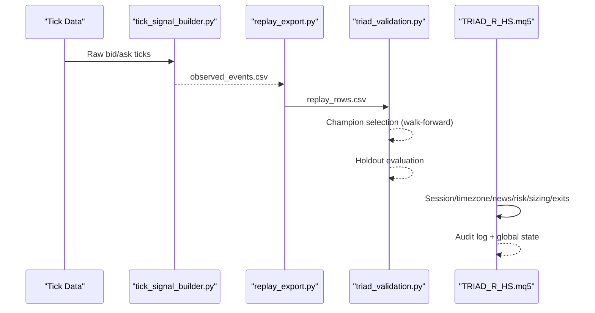
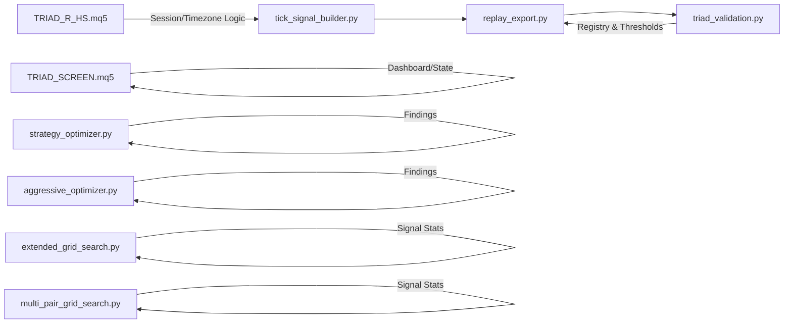
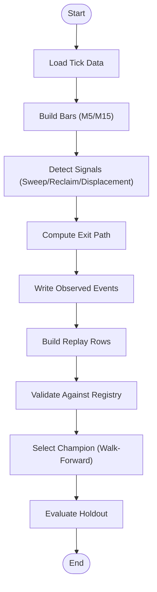

# API Reference

<cite>
**Referenced Files in This Document**
- [TRIAD_R_HS.mq5](file://MQL5/Experts/TRIAD_R_HS/TRIAD_R_HS.mq5)
- [TRIAD_SCREEN.mq5](file://MQL5/Experts/TRIAD_SCREEN/TRIAD_SCREEN.mq5)
- [triad_validation.py](file://tools/triad_validation.py)
- [replay_export.py](file://tools/replay_export.py)
- [tick_signal_builder.py](file://tools/tick_signal_builder.py)
- [strategy_optimizer.py](file://tools/strategy_optimizer.py)
- [aggressive_optimizer.py](file://tools/aggressive_optimizer.py)
- [extended_grid_search.py](file://tools/extended_grid_search.py)
- [multi_pair_grid_search.py](file://tools/multi_pair_grid_search.py)
</cite>

## Table of Contents
1. Introduction
2. Project Structure
3. Core Components
4. Architecture Overview
5. Detailed Component Analysis
6. Dependency Analysis
7. Performance Considerations
8. Troubleshooting Guide
9. Conclusion
10. Appendices

## Introduction
This document provides a comprehensive API reference for the TRIAD-R V2.1 system, covering:
- MQL5 Expert Advisor interfaces and configuration schemas (live/demo EAs)
- Python tooling APIs for signal generation, replay export, validation, and optimization
- Data format specifications for observed events and replay rows
- Integration patterns, data flows, error handling, and best practices
- Guidance for extending APIs and maintaining compatibility across versions

The system is split into two primary runtime components (MQL5 EAs) and a Python research/validation pipeline that consumes replay outputs to select champions and evaluate performance under frozen rules.

## Project Structure
At a high level:
- MQL5 Experts implement live trading logic and demo screening with strict safety gates, session/timezone handling, news blackout enforcement, and state persistence.
- Python tools implement:
  - Tick-to-event conversion for EURUSD London sweep/reclaim signals
  - Replay export conforming to a registry-defined CSV schema
  - Validation against a frozen 160-configuration matrix
  - Strategy optimizers for ORB/volatility strategies
  - Parameter grid searches for signal geometry tuning

**Diagram sources**
- [TRIAD_R_HS.mq5:1-120](file://MQL5/Experts/TRIAD_R_HS/TRIAD_R_HS.mq5#L1-L120)
- [TRIAD_SCREEN.mq5:1-160](file://MQL5/Experts/TRIAD_SCREEN/TRIAD_SCREEN.mq5#L1-L160)
- [tick_signal_builder.py:1-80](file://tools/tick_signal_builder.py#L1-L80)
- [replay_export.py:1-122](file://tools/replay_export.py#L1-L122)
- [triad_validation.py:1-30](file://tools/triad_validation.py#L1-L30)

**Section sources**
- [TRIAD_R_HS.mq5:1-120](file://MQL5/Experts/TRIAD_R_HS/TRIAD_R_HS.mq5#L1-L120)
- [TRIAD_SCREEN.mq5:1-160](file://MQL5/Experts/TRIAD_SCREEN/TRIAD_SCREEN.mq5#L1-L160)
- [triad_validation.py:1-30](file://tools/triad_validation.py#L1-L30)

## Core Components
- MQL5 EAs:
  - TRIAD_R_HS.mq5: Production-grade EA with fail-closed safety, lifecycle locks, account identity checks, news calendar enforcement, session bounds, signal detection, sizing, exits, and audit logging.
  - TRIAD_SCREEN.mq5: Demo-only screening EA mirroring core strategy logic without heavy production safeguards; includes on-chart dashboard and per-combo state files.
- Python tools:
  - tick_signal_builder.py: Converts raw ticks to observed events for EURUSD London using frozen V2.1 geometry.
  - replay_export.py: Builds registry-conformant replay rows from observed events, applying frozen candidate arithmetic and expanding coverage.
  - triad_validation.py: Validates replay data against a frozen registry, selects champion on walk-forward, evaluates holdout, and enforces Section-13 gates.
  - strategy_optimizer.py, aggressive_optimizer.py: ORB/volatility strategy optimizers with grid search and challenge simulation.
  - extended_grid_search.py, multi_pair_grid_search.py: Signal geometry parameter sweeps across sessions/pairs.

**Section sources**
- [TRIAD_R_HS.mq5:16-218](file://MQL5/Experts/TRIAD_R_HS/TRIAD_R_HS.mq5#L16-L218)
- [TRIAD_SCREEN.mq5:39-156](file://MQL5/Experts/TRIAD_SCREEN/TRIAD_SCREEN.mq5#L39-L156)
- [tick_signal_builder.py:60-80](file://tools/tick_signal_builder.py#L60-L80)
- [replay_export.py:51-122](file://tools/replay_export.py#L51-L122)
- [triad_validation.py:49-95](file://tools/triad_validation.py#L49-L95)

## Architecture Overview
End-to-end flow:
1. Raw tick data is processed by tick_signal_builder.py to produce observed events for EURUSD London.
2. replay_export.py converts observed events into registry-conformant replay rows, applying frozen candidate arithmetic and ensuring full calendar coverage.
3. triad_validation.py validates replay rows against a frozen registry, performs champion selection on walk-forward data, and evaluates holdout outcomes.
4. MQL5 EAs implement live/demo execution with identical session/timezone logic, risk controls, and safety mechanisms.

**Diagram sources**
- [tick_signal_builder.py:609-800](file://tools/tick_signal_builder.py#L609-L800)
- [replay_export.py:105-122](file://tools/replay_export.py#L105-L122)
- [triad_validation.py:1879-1905](file://tools/triad_validation.py#L1879-L1905)
- [TRIAD_R_HS.mq5:268-327](file://MQL5/Experts/TRIAD_R_HS/TRIAD_R_HS.mq5#L268-L327)

## Detailed Component Analysis

### MQL5 EA Interfaces: TRIAD_R_HS.mq5
Public inputs (selected):
- InpEnableOrderSubmission: bool — enables order submission when true
- InpValidationReleaseId: string — release identifier required for live mode
- InpStatisticalGatePassed, InpStressGatePassed, InpOperationalGatePassed, InpExternalRulesGatePassed, InpAccountSpecificGatePassed, InpForwardDemoGatePassed, InpCompilationGatePassed, InpExplicitUserApproval: bool — release gates
- InpRequiredProductCode: string — product code check
- InpAuthorizedLogin: long — authorized account login
- InpExpectedAccountServer: string — server name validation
- InpExpectedAccountCurrency: string — currency check
- InpExpectedAccountLeverage: int — leverage check
- InpPhase: enum — phase selection
- InpLifecycleLock: enum — lifecycle lock control
- InpPhaseInitialBalance: double — initial balance for phase logic
- InpDashboardConfirmedDays: int — operator override
- InpUseEstimatedDaysInTester: bool — tester behavior
- InpAuthorizeFreshPhaseState: bool — fresh phase authorization
- InpAuthorizeHaltReset: bool — halt reset authorization
- InpResetTesterStateOnInit: bool — tester state reset
- InpMagic: long — magic number
- InpExpectedServerUtcOffsetHours: int — server UTC offset
- InpNewsBlockMinutes, InpNewsFlatMinutes, InpRolloverFlatMinutes: int — time-based controls
- InpNewsCsvFile: string — news calendar file
- InpRequireNewsCalendar: bool — require calendar
- InpRequiredNewsCoverageHours: int — coverage requirement
- InpMaxQuoteAgeSeconds, InpMaxDeviationPoints: int — quote freshness/deviation
- InpMaxTradeRequestLatencyMs, InpMaxNonEmergencyRequestsDay: int — request throttling
- InpSkipFreshMidSessionStart: bool — skip mid-session start rule
- Instruments and priorities: InpEURUSDSymbol, InpGBPUSDSymbol, InpUSDJPYSymbol, enable flags, priority values, gate flags
- Profile and parameters: InpProfile, range/ATR percentiles, comparable sessions, time stop, breakeven policy, H1 EMA bias
- Entry/risk definitions: sweep ATR min/max, reclaim bars/wick, displacement body min, limit expiry, stop buffer/min/max, cost-to-R, spread median multiplier, commission, slippage reserves, daily/weekly stops, drawdown reduce/shutdown, firm floor reserve
- Logging: InpVerboseLog, InpLogFilePrefix, InpNewsBlockInactivityThreshold

Core behaviors:
- Safety and account context checks (authorized account, instance lock)
- News calendar enforcement and coverage validation
- Session bounds computation with DST-aware civil time conversions
- Signal detection and candidate struct fields for entry/stop/target/R metrics
- Persistent state via terminal globals with signatures and migration support
- Request throttling and emergency safety controls
- Halt mechanism with latch and reason hashing

Error handling:
- Fail-closed design with explicit gates and halts
- Audit logging to CSV with headers and failure tracking
- Instance lock loss leads to halt and cleanup

Performance considerations:
- Minimal repeated indicator handle usage and session caching
- Throttled non-emergency requests per day
- Efficient bar/window processing within session boundaries

Best practices:
- Keep order submission disabled until all gates pass
- Validate server offset and account identity before enabling live mode
- Use news calendar and coverage requirements strictly
- Monitor audit logs and halt latches for operational integrity

**Section sources**
- [TRIAD_R_HS.mq5:16-150](file://MQL5/Experts/TRIAD_R_HS/TRIAD_R_HS.mq5#L16-L150)
- [TRIAD_R_HS.mq5:268-327](file://MQL5/Experts/TRIAD_R_HS/TRIAD_R_HS.mq5#L268-L327)
- [TRIAD_R_HS.mq5:624-779](file://MQL5/Experts/TRIAD_R_HS/TRIAD_R_HS.mq5#L624-L779)
- [TRIAD_R_HS.mq5:2528-2558](file://MQL5/Experts/TRIAD_R_HS/TRIAD_R_HS.mq5#L2528-L2558)
- [TRIAD_R_HS.mq5:3586-3691](file://MQL5/Experts/TRIAD_R_HS/TRIAD_R_HS.mq5#L3586-L3691)

### MQL5 Demo Screening: TRIAD_SCREEN.mq5
Public inputs (selected):
- InpSymbol, InpWindow, InpComboLabel, InpEnableOrderSubmission, InpSkipFreshMidSessionStart, InpMagic, InpExpectedAccountCurrency, InpExpectedServerUtcOffsetHours, InpMaxQuoteAgeSeconds, InpMaxDeviationPoints
- Challenge preset: InpChallengePhase, InpPhaseInitialBalance, target percentages, qualifying days, loss limits, inactivity days, phase reset flag, dashboard confirmed days
- Risk governors: profile, range/ATR percentiles, comparable sessions, time stop, breakeven policy, fixed entry/risk definitions, news calendar settings
- Dashboard: InpDashboardShow, InpDashboardRefreshSeconds, InpStatusFilePrefix

Core behaviors:
- Single symbol/session combo per demo account
- On-chart dashboard showing challenge status, progress, signals/fills/rejects, net R
- State persistence via per-combo CSV files
- Session bounds and range computation similar to canonical EA
- Journaling and summary CSVs for daily summaries

Error handling:
- File open failures logged
- Range availability warnings
- Mid-session start skip behavior documented

Best practices:
- Use for demo screening only; not a substitute for canonical EA
- Ensure news calendar and session bounds match canonical defaults
- Monitor dashboard and daily summaries for mechanical validation

**Section sources**
- [TRIAD_SCREEN.mq5:1-160](file://MQL5/Experts/TRIAD_SCREEN/TRIAD_SCREEN.mq5#L1-L160)
- [TRIAD_SCREEN.mq5:291-354](file://MQL5/Experts/TRIAD_SCREEN/TRIAD_SCREEN.mq5#L291-L354)
- [TRIAD_SCREEN.mq5:456-545](file://MQL5/Experts/TRIAD_SCREEN/TRIAD_SCREEN.mq5#L456-L545)
- [TRIAD_SCREEN.mq5:583-749](file://MQL5/Experts/TRIAD_SCREEN/TRIAD_SCREEN.mq5#L583-L749)

### Python Tooling: Observed Events and Replay Export
Observed event schema (from tick_signal_builder.py and replay_export.py):
- Fields include server_day, sequence, event_id, combination, direction, reference_low/high, sweep_low/high, reclaim open/high/low/close, displacement open/high/low/close, atr_m15, tick_size, tick_value, contract_size, volume_min, volume_step, spread_price, slippage_price, commission_per_lot_round_trip, limit_active, limit_touched, trade_through_ticks, fill_fraction, exit_reason, target_hit_minutes, stop_hit_minutes, breakeven_hit_minutes, price_at_30/45/60/90, price_at_session_end, worst_adverse_price, rule_violation, operational_error

Replay export behavior:
- Validates observed events against EA contract conditions
- Applies frozen candidate arithmetic (entry, stop, cost gate, sizing, cash risk/net cash, target solving, time-stop selection, breakeven policy)
- Expands to full calendar coverage with no-candidate rows for every config/combination/day
- Outputs registry-conformant replay rows consumed by triad_validation.py

Usage examples:
- Schema inspection: python3 tools/replay_export.py schema
- Selftest: python3 tools/replay_export.py selftest --tmpdir /tmp/replay_selftest
- Build replay: python3 tools/replay_export.py build --event-file events.csv --configs validation/triad_v2_1_registry.json --selection-split 2019.01.01 2024.12.31 --holdout-split 2025.01.01 2026.08.31 --output validation/triad_replay_rows.csv

Error handling:
- Strict field validation and allowed combinations
- Fail-closed on invalid directions or missing fields
- Coverage validation ensures complete day sets across splits

Best practices:
- Ensure upstream replay produces honest fill observations
- Maintain consistent server_day keys and event ordering
- Preserve frozen registry and avoid post-hoc split decisions

**Section sources**
- [tick_signal_builder.py:594-606](file://tools/tick_signal_builder.py#L594-L606)
- [replay_export.py:51-122](file://tools/replay_export.py#L51-L122)
- [replay_export.py:152-197](file://tools/replay_export.py#L152-L197)

### Python Tooling: Validation API
Commands:
- preregister: writes frozen 160-config registry
- schema: prints replay CSV header and field contract
- validate: selects champion on walk-forward, evaluates holdout

Key data structures:
- CandidateConfig: config_id, range/ATR percentiles, time_stop_minutes, profile, risk_fraction, target_r, breakeven policy
- FillPolicy: minimum trade-through ticks, minimum fill fraction, stressed miss fraction, stressed spread/slippage multipliers
- ValidationThresholds: minimum fills, expectancy, profit factor, stress thresholds, pass probabilities, drawdown limits
- SimulationSettings: initial balance, targets, qualifying day fraction, drawdown rules, inactivity days, bootstrap samples, familywise alpha, random seed
- ReplayRow: fields matching observed event schema plus split, server_day, sequence, event_id, combination, candidate, activation_ok, limit_touched, trade_through_ticks, fill_fraction, net_r, risk_cash_full/half, net_cash_full/half, mae_cash_full/half, spread_r, slippage_r, commission_r, rule_violation, operational_error

API functions:
- build_registry(): constructs registry payload with hash
- write_registry(path, overwrite=False): persists registry
- load_registry(path): loads and verifies registry
- load_replay_rows(path, registry): parses and validates replay CSV
- validate_replay_coverage(rows, configs): ensures complete coverage
- apply_fill_policy(row, policy, stressed, seed): applies conservative fill assumptions
- metric_report(rows, policy, stressed, seed, config_risk_fractions, initial_balance, qualifying_cash): computes metrics and augmentations
- independently_eligible_combinations(diagnostics, thresholds): filters eligible combinations
- parse_combination_priorities(text): parses router priorities
- _router_key(row, priorities): stable routing key

Error handling:
- ValidationError for invalid registry or replay data
- Strict boolean and numeric parsing
- Coverage validation raises errors for missing days/configs

Best practices:
- Use preregistered registry to lock thresholds and policies
- Provide complete no-candidate rows for all combinations/days
- Respect allowed combinations and splits
- Use combination priorities consistent with EA defaults unless intentionally overridden

**Section sources**
- [triad_validation.py:49-95](file://tools/triad_validation.py#L49-L95)
- [triad_validation.py:98-208](file://tools/triad_validation.py#L98-L208)
- [triad_validation.py:278-331](file://tools/triad_validation.py#L278-L331)
- [triad_validation.py:360-437](file://tools/triad_validation.py#L360-L437)
- [triad_validation.py:440-473](file://tools/triad_validation.py#L440-L473)
- [triad_validation.py:480-497](file://tools/triad_validation.py#L480-L497)
- [triad_validation.py:646-708](file://tools/triad_validation.py#L646-L708)
- [triad_validation.py:720-748](file://tools/triad_validation.py#L720-L748)
- [triad_validation.py:766-794](file://tools/triad_validation.py#L766-L794)
- [triad_validation.py:1879-1905](file://tools/triad_validation.py#L1879-L1905)

### Python Tooling: Strategy Optimizers
strategy_optimizer.py:
- Grid search over ORB strategies with stop modes (range, half_range, atr_fixed), target R, ORB bars, minimum ORP pips
- Loads tick data, builds bars, computes ATR, detects breakouts, simulates exits, calculates P&L in R and cash
- Outputs leaderboard and findings markdown

aggressive_optimizer.py:
- Multi-pair optimizer with strategies orb_atr, orb_half, vola
- Fixed lot sizing based on $2,500 base
- Session definitions for London and New York with DST handling
- Backtest loop with daily floors, phase targets, and equity curve tracking
- Outputs leaderboard, deep dive, and findings markdown

extended_grid_search.py, multi_pair_grid_search.py:
- Parameter sweeps for signal geometry (sweep max, wick min, reclaim bars)
- Multi-pair coverage across EURUSD London, GBPUSD London, USDJPY New York
- Reports signal counts and rejection reasons for parameter selection

Usage examples:
- Run optimizer: python tools/strategy_optimizer.py
- Run aggressive optimizer: python tools/aggressive_optimizer.py
- Run extended grid search: python tools/extended_grid_search.py
- Run multi-pair grid search: python tools/multi_pair_grid_search.py

Error handling:
- Graceful skipping of missing data files
- Validation of bar counts and ATR availability
- Filtering results by viability thresholds

Best practices:
- Use DST-correct session windows
- Validate ATR and minimum range thresholds
- Compare multiple stop modes and target R values
- Review findings for recommended next steps

**Section sources**
- [strategy_optimizer.py:1-80](file://tools/strategy_optimizer.py#L1-L80)
- [strategy_optimizer.py:187-209](file://tools/strategy_optimizer.py#L187-L209)
- [strategy_optimizer.py:244-381](file://tools/strategy_optimizer.py#L244-L381)
- [strategy_optimizer.py:411-485](file://tools/strategy_optimizer.py#L411-L485)
- [strategy_optimizer.py:491-530](file://tools/strategy_optimizer.py#L491-L530)
- [strategy_optimizer.py:577-622](file://tools/strategy_optimizer.py#L577-L622)
- [aggressive_optimizer.py:1-86](file://tools/aggressive_optimizer.py#L1-L86)
- [aggressive_optimizer.py:149-168](file://tools/aggressive_optimizer.py#L149-L168)
- [aggressive_optimizer.py:226-288](file://tools/aggressive_optimizer.py#L226-L288)
- [aggressive_optimizer.py:334-485](file://tools/aggressive_optimizer.py#L334-L485)
- [extended_grid_search.py:1-64](file://tools/extended_grid_search.py#L1-L64)
- [multi_pair_grid_search.py:1-84](file://tools/multi_pair_grid_search.py#L1-L84)

## Dependency Analysis
Component relationships:
- tick_signal_builder.py depends on frozen V2.1 geometry constants and DST helpers
- replay_export.py depends on triad_validation.py for schema, constants, and validation utilities
- triad_validation.py defines frozen registry, thresholds, and selection rules
- MQL5 EAs implement session/timezone logic consistent with Python tools
- Optimizers depend on historical tick data and session definitions

**Diagram sources**
- [tick_signal_builder.py:609-800](file://tools/tick_signal_builder.py#L609-L800)
- [replay_export.py:140-150](file://tools/replay_export.py#L140-L150)
- [triad_validation.py:49-95](file://tools/triad_validation.py#L49-L95)
- [TRIAD_R_HS.mq5:624-779](file://MQL5/Experts/TRIAD_R_HS/TRIAD_R_HS.mq5#L624-L779)

**Section sources**
- [replay_export.py:140-150](file://tools/replay_export.py#L140-L150)
- [triad_validation.py:49-95](file://tools/triad_validation.py#L49-L95)
- [TRIAD_R_HS.mq5:624-779](file://MQL5/Experts/TRIAD_R_HS/TRIAD_R_HS.mq5#L624-L779)

## Performance Considerations
- MQL5 EAs:
  - Limit non-emergency requests per day to prevent overload
  - Cache session bounds and range computations
  - Use efficient bar/window processing within session boundaries
  - Persist state with signatures to avoid inconsistent reads
- Python tools:
  - Prebuild day data to avoid repeated parsing
  - Use rolling ATR and bar caches for efficiency
  - Filter grids by viability thresholds to reduce noise
  - Leverage DST-correct session windows to minimize false signals

[No sources needed since this section provides general guidance]

## Troubleshooting Guide
Common issues and resolutions:
- Order submission disabled: Ensure all release gates pass and InpEnableOrderSubmission is explicitly enabled after validation
- News calendar missing or stale: Verify InpNewsCsvFile and coverage hours; monitor NEWS_BLOCK_INACTIVITY_RISK alerts
- Server offset mismatch: Check InpExpectedServerUtcOffsetHours and ValidateServerOffset logic
- Instance lock conflicts: Ensure single live instance per account; monitor duplicate instance logs
- Audit log failures: Check file permissions and paths; halt may be triggered if logging fails before non-emergency requests
- Replay CSV schema mismatch: Run schema command and ensure headers match exactly
- Missing coverage in replay: Ensure no-candidate rows for all combinations/days; validate coverage function

Error handling patterns:
- Fail-closed design with explicit halts and latches
- Audit logging with structured events and severity levels
- Strict validation of booleans, numerics, and allowed values
- Coverage validation raising errors for incomplete datasets

Best practices:
- Monitor audit logs and halt latches regularly
- Use dashboard and daily summaries for operational visibility
- Validate server offset and account identity before live deployment
- Maintain consistent registry and replay schemas across versions

**Section sources**
- [TRIAD_R_HS.mq5:299-327](file://MQL5/Experts/TRIAD_R_HS/TRIAD_R_HS.mq5#L299-L327)
- [TRIAD_R_HS.mq5:329-350](file://MQL5/Experts/TRIAD_R_HS/TRIAD_R_HS.mq5#L329-L350)
- [TRIAD_R_HS.mq5:494-554](file://MQL5/Experts/TRIAD_R_HS/TRIAD_R_HS.mq5#L494-L554)
- [TRIAD_R_HS.mq5:2528-2558](file://MQL5/Experts/TRIAD_R_HS/TRIAD_R_HS.mq5#L2528-L2558)
- [triad_validation.py:334-350](file://tools/triad_validation.py#L334-L350)
- [triad_validation.py:440-473](file://tools/triad_validation.py#L440-L473)

## Conclusion
The TRIAD-R V2.1 system provides a robust, fail-closed framework for live trading and rigorous offline validation. The MQL5 EAs enforce strict safety, session/timezone correctness, and news blackout compliance, while the Python toolchain ensures reproducible signal generation, registry-conformant replay exports, and validated champion selection under frozen rules. Adhering to the documented APIs, data formats, and best practices will maintain compatibility and reliability across versions.

[No sources needed since this section summarizes without analyzing specific files]

## Appendices

### Configuration Schemas Summary
- MQL5 EA inputs: See TRIAD_R_HS.mq5 and TRIAD_SCREEN.mq5 input sections for detailed parameter types and defaults
- Python registry: See triad_validation.py build_registry() for schema_version, registry_version, configurations, thresholds, simulation settings
- Observed event CSV: See tick_signal_builder.py EVENT_FIELDS and replay_export.py schema documentation
- Replay rows CSV: See triad_validation.py CSV_FIELDS and replay_export.py build usage

### Data Flow Diagrams

**Diagram sources**
- [tick_signal_builder.py:609-800](file://tools/tick_signal_builder.py#L609-L800)
- [replay_export.py:105-122](file://tools/replay_export.py#L105-L122)
- [triad_validation.py:1879-1905](file://tools/triad_validation.py#L1879-L1905)

### Best Practices for Extending APIs
- Maintain frozen registry integrity: Do not modify thresholds or selection rules without rehashing and versioning
- Preserve CSV schemas: Add new fields carefully and ensure backward compatibility
- Align MQL5 and Python logic: Ensure session/timezone and signal geometry remain consistent
- Use strict validation: Enforce allowed values and raise clear errors for invalid inputs
- Document changes: Update README and comments to reflect new parameters or behaviors

[No sources needed since this section provides general guidance]