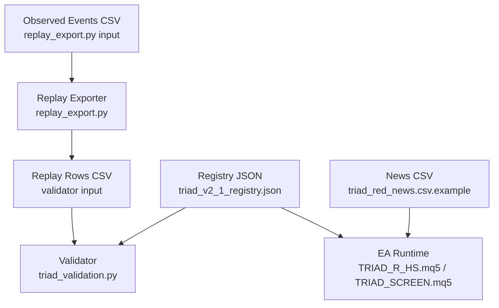
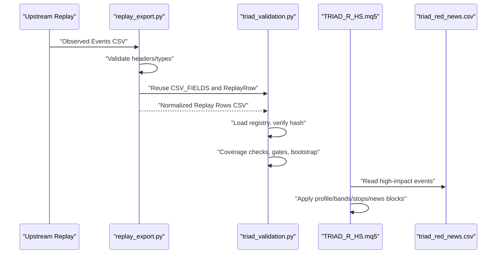
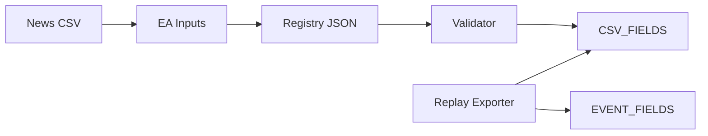

# Data Format Specifications

<cite>
**Referenced Files in This Document**
- [triad_v2_1_registry.json](file://validation/triad_v2_1_registry.json)
- [triad_v2_2_ablation_registry.json](file://validation/triad_v2_2_ablation_registry.json)
- [triad_red_news.csv.example](file://MQL5/Files/triad_red_news.csv.example)
- [triad_validation.py](file://tools/triad_validation.py)
- [replay_export.py](file://tools/replay_export.py)
- [TRIAD_R_HS.mq5](file://MQL5/Experts/TRIAD_R_HS/TRIAD_R_HS.mq5)
- [TRIAD_SCREEN.mq5](file://MQL5/Experts/TRIAD_SCREEN/TRIAD_SCREEN.mq5)
</cite>

## Table of Contents
1. [Introduction](#introduction)
2. [Project Structure](#project-structure)
3. [Core Components](#core-components)
4. [Architecture Overview](#architecture-overview)
5. [Detailed Component Analysis](#detailed-component-analysis)
6. [Dependency Analysis](#dependency-analysis)
7. [Performance Considerations](#performance-considerations)
8. [Troubleshooting Guide](#troubleshooting-guide)
9. [Conclusion](#conclusion)
10. [Appendices](#appendices)

## Introduction
This document specifies all data formats used by the TRIAD-R system: JSON registries, CSV schemas for replay and news, field definitions, types, validation rules, and integration patterns between components. It explains how configuration registries define candidate strategies, how replay exports transform observed events into a canonical format consumed by the validator, and how the MQL5 Expert Advisors consume parameters and news to enforce live trading constraints. It also provides migration guidance and backward compatibility considerations when evolving schemas.

## Project Structure
The data formats are defined and enforced across three layers:
- Registries (JSON): frozen strategy candidates, selection rules, thresholds, and simulation settings.
- Replay pipeline (CSV): observed event inputs and normalized replay rows consumed by the validator.
- Live execution (MQL5): EA parameters and news calendar files that mirror the registry’s intent at runtime.

**Diagram sources**
- [triad_v2_1_registry.json:1-20](file://validation/triad_v2_1_registry.json#L1-L20)
- [triad_validation.py:71-95](file://tools/triad_validation.py#L71-L95)
- [replay_export.py:152-195](file://tools/replay_export.py#L152-L195)
- [triad_red_news.csv.example:1-7](file://MQL5/Files/triad_red_news.csv.example#L1-L7)
- [TRIAD_R_HS.mq5:78-85](file://MQL5/Experts/TRIAD_R_HS/TRIAD_R_HS.mq5#L78-L85)

**Section sources**
- [triad_v2_1_registry.json:1-20](file://validation/triad_v2_1_registry.json#L1-L20)
- [triad_validation.py:71-95](file://tools/triad_validation.py#L71-L95)
- [replay_export.py:152-195](file://tools/replay_export.py#L152-L195)
- [triad_red_news.csv.example:1-7](file://MQL5/Files/triad_red_news.csv.example#L1-L7)
- [TRIAD_R_HS.mq5:78-85](file://MQL5/Experts/TRIAD_R_HS/TRIAD_R_HS.mq5#L78-L85)

## Core Components
- Registry JSON: Defines candidate configurations, selection splits, fill policy, thresholds, simulation settings, and CSV schema expectations. Includes integrity via a payload hash.
- Replay Event CSV: Observed signal sequences with bar-level details, costs, fills, and exit outcomes.
- Replay Row CSV: Canonical per-config, per-day, per-combination rows with computed risk/cash metrics and flags for validation.
- News CSV: High-impact economic events used by the EA to enforce blackout windows.
- EA Parameters: MQL5 inputs mirroring registry profiles, bands, stops, and safety controls.

Key responsibilities:
- Registries freeze strategy variants and evaluation criteria.
- Replay exporter normalizes upstream events into a strict schema.
- Validator enforces coverage, gates, and statistical decisions.
- EA consumes parameters and news to implement the same logic live.

**Section sources**
- [triad_v2_1_registry.json:1-20](file://validation/triad_v2_1_registry.json#L1-L20)
- [triad_validation.py:278-305](file://tools/triad_validation.py#L278-L305)
- [replay_export.py:152-195](file://tools/replay_export.py#L152-L195)
- [triad_red_news.csv.example:1-7](file://MQL5/Files/triad_red_news.csv.example#L1-L7)
- [TRIAD_R_HS.mq5:106-140](file://MQL5/Experts/TRIAD_R_HS/TRIAD_R_HS.mq5#L106-L140)

## Architecture Overview
The data flow is strictly typed and validated at each stage to prevent silent misalignment between research and live systems.

**Diagram sources**
- [replay_export.py:319-434](file://tools/replay_export.py#L319-L434)
- [triad_validation.py:317-331](file://tools/triad_validation.py#L317-L331)
- [triad_validation.py:360-400](file://tools/triad_validation.py#L360-L400)
- [triad_red_news.csv.example:1-7](file://MQL5/Files/triad_red_news.csv.example#L1-L7)
- [TRIAD_R_HS.mq5:78-85](file://MQL5/Experts/TRIAD_R_HS/TRIAD_R_HS.mq5#L78-L85)

## Detailed Component Analysis

### JSON Registry Schema (V2.1 Selection)
Purpose: Freeze candidate configurations, selection/held-out splits, fill policy, thresholds, simulation settings, and CSV schema. Includes a SHA-256 payload hash to detect tampering.

Top-level fields:
- schema_version: string identifier for registry schema version.
- registry_version: string identifier for this specific registry release.
- canonical_strategy: human-readable reference to the canonical specification.
- selection_split: name of the split used for candidate selection.
- holdout_split: name of the holdout split reserved for confirmation.
- selection_rule: ordered list of decision rules applied during selection.
- fill_policy: conservative assumptions about limit fills and stress multipliers.
- thresholds: point-estimate and probability-based gates for qualification.
- simulation: bootstrap samples, block sizes, random seed, and other simulation constants.
- csv_fields: exact column order expected in replay row CSVs.
- configurations: array of 160 candidate configs derived from band combinations, time stops, profiles, and breakeven policies.
- registry_sha256: hash of the payload excluding itself; must match on load.

Candidate configuration fields:
- config_id: unique identifier encoding range bands, ATR bands, time stop, profile, and breakeven policy.
- range_low_percentile, range_high_percentile: percentile bounds defining the intraday range filter.
- atr_low_percentile, atr_high_percentile: percentile bounds for volatility filtering.
- time_stop_minutes: minutes after entry to force exit; zero means session-only.
- profile: one of A/B/C/D mapping to fixed risk_fraction and target_r pairs.
- risk_fraction: fraction of account equity used as risk per trade.
- target_r: target profit measured in R units relative to initial risk.
- move_stop_to_entry_after_confirmed_1r: boolean enabling breakeven move after +1R.

Validation rules:
- Header and type checks on replay CSVs against CSV_FIELDS.
- Allowed values for split and combination enforced.
- Config IDs must exist in the registry.
- Non-negative integers for sequence and trade_through_ticks.
- Finite floats for monetary and ratio fields.
- Boolean fields accept true/false or 1/0.

Example valid configuration snippet path:
- [triad_v2_1_registry.json:4-15](file://validation/triad_v2_1_registry.json#L4-L15)

Schema enforcement path:
- [triad_validation.py:71-95](file://tools/triad_validation.py#L71-L95)
- [triad_validation.py:278-305](file://tools/triad_validation.py#L278-L305)
- [triad_validation.py:317-331](file://tools/triad_validation.py#L317-L331)
- [triad_validation.py:360-400](file://tools/triad_validation.py#L360-L400)

**Section sources**
- [triad_v2_1_registry.json:1-20](file://validation/triad_v2_1_registry.json#L1-L20)
- [triad_v2_1_registry.json:4-15](file://validation/triad_v2_1_registry.json#L4-L15)
- [triad_validation.py:71-95](file://tools/triad_validation.py#L71-L95)
- [triad_validation.py:278-305](file://tools/triad_validation.py#L278-L305)
- [triad_validation.py:317-331](file://tools/triad_validation.py#L317-L331)
- [triad_validation.py:360-400](file://tools/triad_validation.py#L360-L400)

### JSON Registry Schema (Ablation V2.2)
Purpose: Preregistered ablation study comparing entry variants while keeping baseline frozen. Contains ablation-specific fields, decision thresholds, and run definitions.

Top-level fields:
- canonical_strategy: reference to the base strategy revision being ablated.
- csv_fields: columns for ablation replay output.
- decision: thresholds for acceptance, bootstrap, familywise alpha, minimum fills, and simplicity tie rules.
- evaluation: bootstrap method, paired comparison definition, selection and holdout splits.
- fill_policy: minimum fill requirements and stressed cost multipliers.
- fixed_controls: frozen EA-like parameters for ablation runs.
- purpose: description of the ablation question set.
- questions: enumerated research questions mapped to runs.
- registry_sha256: integrity hash of the payload.
- registry_version: version tag for this ablation registry.
- runs: array of variant definitions including changed_element, description, entry_spec, question, simplicity_bonus, and variant_id.
- schema_version: ablation schema version tag.
- splits: date ranges for HOLDOUT and WALK_FORWARD.

Run entry_spec fields:
- displacement_body_min: threshold for displacement body size.
- entry_mode: mode controlling entry behavior (e.g., limit retracement vs immediate quote).
- reclaim_wick_min: minimum wick requirement for reclaim bars.
- require_midpoint: whether midpoint confirmation is required.
- sweep_atr_min, sweep_atr_max: acceptable sweep depth in ATR units.

Example valid run snippet path:
- [triad_v2_2_ablation_registry.json:92-106](file://validation/triad_v2_2_ablation_registry.json#L92-L106)

Schema enforcement path:
- [triad_v2_2_ablation_registry.json:1-27](file://validation/triad_v2_2_ablation_registry.json#L1-L27)
- [triad_v2_2_ablation_registry.json:28-55](file://validation/triad_v2_2_ablation_registry.json#L28-L55)
- [triad_v2_2_ablation_registry.json:56-82](file://validation/triad_v2_2_ablation_registry.json#L56-L82)
- [triad_v2_2_ablation_registry.json:91-182](file://validation/triad_v2_2_ablation_registry.json#L91-L182)

**Section sources**
- [triad_v2_2_ablation_registry.json:1-27](file://validation/triad_v2_2_ablation_registry.json#L1-L27)
- [triad_v2_2_ablation_registry.json:28-55](file://validation/triad_v2_2_ablation_registry.json#L28-L55)
- [triad_v2_2_ablation_registry.json:56-82](file://validation/triad_v2_2_ablation_registry.json#L56-L82)
- [triad_v2_2_ablation_registry.json:91-182](file://validation/triad_v2_2_ablation_registry.json#L91-L182)

### Replay Event CSV Schema (Observed Events)
Purpose: Input to the replay exporter describing completed signal sequences and their outcomes. Must match EVENT_FIELDS exactly.

Columns:
- server_day: ISO date representing broker server day.
- sequence: deterministic ordering within the day; only first event per symbol/session/day may produce an order.
- event_id: unique identifier for the event.
- combination: instrument/session pair (e.g., EURUSD_LONDON).
- direction: long or short.
- reference_low, reference_high: reference range boundaries.
- sweep_low, sweep_high: sweep extremes.
- reclaim_open, reclaim_high, reclaim_low, reclaim_close: reclaim bar OHLC.
- displacement_open, displacement_high, displacement_low, displacement_close: displacement bar OHLC.
- atr_m15: ATR value used for sizing and filters.
- tick_size, tick_value, contract_size, volume_min, volume_step: symbol economics.
- spread_price, slippage_price, commission_per_lot_round_trip: modeled costs.
- limit_active, limit_touched, trade_through_ticks, fill_fraction: fill observations.
- exit_reason: target, stop, breakeven, time, session_end, cancel.
- target_hit_minutes, stop_hit_minutes, breakeven_hit_minutes: minutes from entry to first touch (empty if not hit).
- price_at_30, price_at_45, price_at_60, price_at_90, price_at_session_end: executable prices at horizons.
- worst_adverse_price: most adverse price during holding window.
- rule_violation, operational_error: upstream flags for compliance or state errors.

Validation rules:
- Exact header match required; delimiter auto-detected as comma or semicolon.
- Direction must be long or short.
- Exit reasons must be from allowed set; certain exits require corresponding minute fields.
- Fill-related fields constrained: fill_fraction cannot exceed 1; trade_through_ticks non-negative.
- Duplicate keys (server_day, sequence, event_id, combination) rejected.

Example schema print path:
- [replay_export.py:152-195](file://tools/replay_export.py#L152-L195)
- [replay_export.py:1188-1205](file://tools/replay_export.py#L1188-L1205)

Parsing and validation path:
- [replay_export.py:319-434](file://tools/replay_export.py#L319-L434)

**Section sources**
- [replay_export.py:152-195](file://tools/replay_export.py#L152-L195)
- [replay_export.py:319-434](file://tools/replay_export.py#L319-L434)
- [replay_export.py:1188-1205](file://tools/replay_export.py#L1188-L1205)

### Replay Row CSV Schema (Validator Input)
Purpose: Canonical per-config, per-day, per-combination rows produced by the exporter and consumed by the validator.

Columns:
- config_id: candidate configuration identifier.
- split: TRAIN, WALK_FORWARD, or HOLDOUT.
- server_day: ISO date.
- sequence: event sequence number.
- event_id: event identifier.
- combination: instrument/session pair.
- candidate: whether a candidate was detected for this day/config.
- activation_ok: whether activation conditions were satisfied.
- limit_touched: whether the pending limit was touched.
- trade_through_ticks: ticks beyond limit price required for fill.
- fill_fraction: fraction of intended position filled.
- net_r: realized net return in R units.
- risk_cash_full, risk_cash_half: cash risk under full and half risk scenarios.
- net_cash_full, net_cash_half: net cash under full and half risk scenarios.
- mae_cash_full, mae_cash_half: maximum adverse excursion cash under full and half risk scenarios.
- spread_r, slippage_r, commission_r: cost components in R units.
- rule_violation: upstream compliance violation flag.
- operational_error: upstream operational error flag.

Validation rules:
- Header must match CSV_FIELDS exactly.
- config_id must exist in registry.
- split must be one of allowed values.
- combination must be one of allowed combinations.
- sequence and trade_through_ticks must be non-negative.
- Float fields must be finite; booleans accept true/false or 1/0.

Example schema constant path:
- [triad_validation.py:71-95](file://tools/triad_validation.py#L71-L95)

Parsing and validation path:
- [triad_validation.py:360-400](file://tools/triad_validation.py#L360-L400)

**Section sources**
- [triad_validation.py:71-95](file://tools/triad_validation.py#L71-L95)
- [triad_validation.py:360-400](file://tools/triad_validation.py#L360-L400)

### News CSV Schema (EA Integration)
Purpose: High-impact economic events used by the EA to enforce blackout periods around releases.

Columns:
- utc_time: UTC timestamp of the event.
- currency: affected currency code or ALL for coverage end marker.
- impact: RED indicates high-impact; COVERAGE marks operator-verified coverage end.
- title: human-readable event title.

Validation rules:
- Timestamps must parse to UTC times.
- Currency must be a recognized code or ALL for coverage markers.
- Impact must be RED or COVERAGE.

Example file path:
- [triad_red_news.csv.example:1-7](file://MQL5/Files/triad_red_news.csv.example#L1-L7)

EA usage path:
- [TRIAD_R_HS.mq5:78-85](file://MQL5/Experts/TRIAD_R_HS/TRIAD_R_HS.mq5#L78-L85)

**Section sources**
- [triad_red_news.csv.example:1-7](file://MQL5/Files/triad_red_news.csv.example#L1-L7)
- [TRIAD_R_HS.mq5:78-85](file://MQL5/Experts/TRIAD_R_HS/TRIAD_R_HS.mq5#L78-L85)

### MQL5 Parameter Mapping (Live Execution)
Purpose: EA inputs mirror registry profiles, bands, stops, and safety controls to ensure live behavior matches research.

Key parameter groups:
- Phase and lifecycle controls: phase, lifecycle lock, initial balance, dashboard days, tester estimation flags.
- Server/calendar controls: expected UTC offset, news blackout minutes, flat minutes, rollover flat minutes, news CSV file, require news calendar, required coverage hours, max quote age/deviation/latency, request limits.
- Instruments: symbols and enabled sessions with priorities and gate flags.
- Coarse research candidates: profile, range percentiles, ATR percentiles, comparable sessions, time stop, breakeven policy, optional H1 EMA bias.
- Entry/risk definitions: sweep ATR bounds, reclaim bars/wick, displacement body min, limit expiry, stop buffer/ATR bounds, cost-to-R cap, spread median multiplier, commission per lot, slippage reserves, firm floor reserve, daily/weekly stops, drawdown reduce/shutdown.

Example parameter paths:
- [TRIAD_R_HS.mq5:52-90](file://MQL5/Experts/TRIAD_R_HS/TRIAD_R_HS.mq5#L52-L90)
- [TRIAD_R_HS.mq5:92-140](file://MQL5/Experts/TRIAD_R_HS/TRIAD_R_HS.mq5#L92-L140)
- [TRIAD_SCREEN.mq5:408-432](file://MQL5/Experts/TRIAD_SCREEN/TRIAD_SCREEN.mq5#L408-L432)

**Section sources**
- [TRIAD_R_HS.mq5:52-90](file://MQL5/Experts/TRIAD_R_HS/TRIAD_R_HS.mq5#L52-L90)
- [TRIAD_R_HS.mq5:92-140](file://MQL5/Experts/TRIAD_R_HS/TRIAD_R_HS.mq5#L92-L140)
- [TRIAD_SCREEN.mq5:408-432](file://MQL5/Experts/TRIAD_SCREEN/TRIAD_SCREEN.mq5#L408-L432)

## Dependency Analysis
The system enforces strong coupling between registries and CSV schemas to prevent drift:

- The validator reads CSV_FIELDS from the registry and rejects mismatched replay CSVs.
- The replay exporter reuses CSV_FIELDS and ReplayRow to produce validator-compatible outputs.
- EA inputs are aligned with registry profiles and thresholds to maintain parity.

**Diagram sources**
- [triad_validation.py:71-95](file://tools/triad_validation.py#L71-L95)
- [triad_validation.py:278-305](file://tools/triad_validation.py#L278-L305)
- [replay_export.py:152-195](file://tools/replay_export.py#L152-L195)
- [triad_v2_1_registry.json:1-20](file://validation/triad_v2_1_registry.json#L1-L20)

**Section sources**
- [triad_validation.py:71-95](file://tools/triad_validation.py#L71-L95)
- [triad_validation.py:278-305](file://tools/triad_validation.py#L278-L305)
- [replay_export.py:152-195](file://tools/replay_export.py#L152-L195)
- [triad_v2_1_registry.json:1-20](file://validation/triad_v2_1_registry.json#L1-L20)

## Performance Considerations
- Replay coverage requires every server day in WALK_FORWARD and HOLDOUT to have rows for all configurations and combinations; missing rows can distort results.
- Bootstrap and paired comparisons use block bootstrapping over calendar days; sample sizes and block lengths affect confidence estimates.
- Stressed scenarios apply multipliers to spread and slippage; ensure upstream cost modeling is realistic to avoid misleading stress outcomes.
- EA runtime should minimize unnecessary computations during news blackouts and session cutoffs to reduce latency and risk of missed exits.

[No sources needed since this section provides general guidance]

## Troubleshooting Guide
Common issues and resolutions:
- CSV header mismatch: Ensure replay CSV headers match CSV_FIELDS exactly; regenerate using the exporter schema command.
- Unknown config_id: Verify config_id exists in the registry; do not add ad-hoc identifiers.
- Invalid split or combination: Use only TRAIN, WALK_FORWARD, HOLDOUT for split and allowed combinations like EURUSD_LONDON.
- Duplicate replay rows: Keys (config_id, split, server_day, sequence, event_id) must be unique.
- Invalid boolean fields: Accept only true/false or 1/0.
- Non-finite floats: All numeric fields must be finite; check for NaN or Inf.
- Registry hash mismatch: Do not modify registry payloads; re-register if changes are necessary.

Error handling paths:
- [triad_validation.py:317-331](file://tools/triad_validation.py#L317-L331)
- [triad_validation.py:360-400](file://tools/triad_validation.py#L360-L400)
- [replay_export.py:319-434](file://tools/replay_export.py#L319-L434)

**Section sources**
- [triad_validation.py:317-331](file://tools/triad_validation.py#L317-L331)
- [triad_validation.py:360-400](file://tools/triad_validation.py#L360-L400)
- [replay_export.py:319-434](file://tools/replay_export.py#L319-L434)

## Conclusion
The TRIAD-R system uses rigorously defined JSON registries and CSV schemas to ensure consistency between research, validation, and live execution. Registries freeze strategy variants and evaluation criteria; replay exporters normalize upstream events into canonical rows; validators enforce coverage and statistical gates; and EAs mirror registry parameters and news rules at runtime. Adhering to these specifications maintains data integrity and enables reproducible, auditable strategy development.

[No sources needed since this section summarizes without analyzing specific files]

## Appendices

### Migration Guide for Schema Updates
- When updating registries:
  - Increment schema_version and registry_version.
  - Update csv_fields only if replay row structure changes; ensure exporter and validator both adopt new fields.
  - Recompute registry_sha256 to reflect payload changes.
  - Maintain backward compatibility by preserving existing config_ids where possible; deprecate rather than rename identifiers.
- When updating replay schemas:
  - Extend EVENT_FIELDS and CSV_FIELDS carefully; validate upstream producers to emit required fields.
  - Add default values or null handling for optional fields to avoid breaking older pipelines.
  - Run selftests and round-trip validations before deploying changes.
- When updating EA parameters:
  - Align new inputs with registry profiles and thresholds.
  - Preserve legacy parameter names with deprecated behavior flags to ease transition.
  - Validate runtime identity hashes to detect unintended parameter drift.

[No sources needed since this section provides general guidance]

### Backward Compatibility Considerations
- Registries:
  - Keep old config_ids stable; introduce new ones alongside rather than replacing.
  - Preserve existing selection_rule semantics; extend with additional rules rather than altering existing ones.
- Replay CSVs:
  - Accept both comma and semicolon delimiters where applicable; prefer consistent delimiter in production.
  - Allow optional fields to be empty/null where safe; reject unknown fields to catch drift early.
- EA:
  - Support legacy parameter mappings with warnings; log deprecation notices.
  - Enforce fail-closed behavior on unknown or invalid inputs.

[No sources needed since this section provides general guidance]