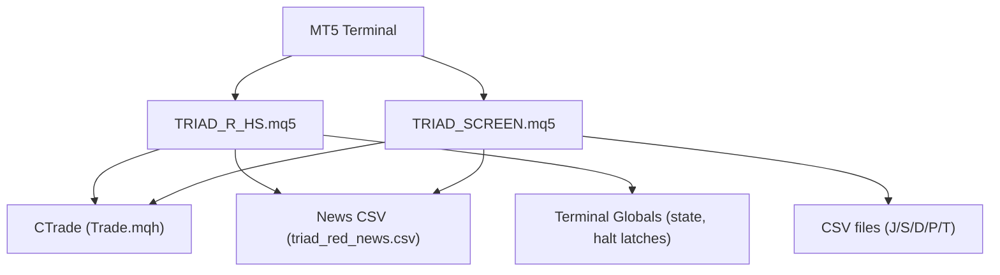
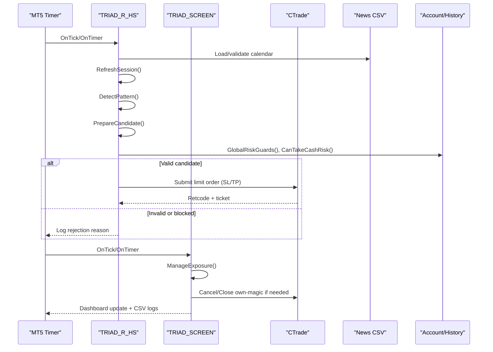
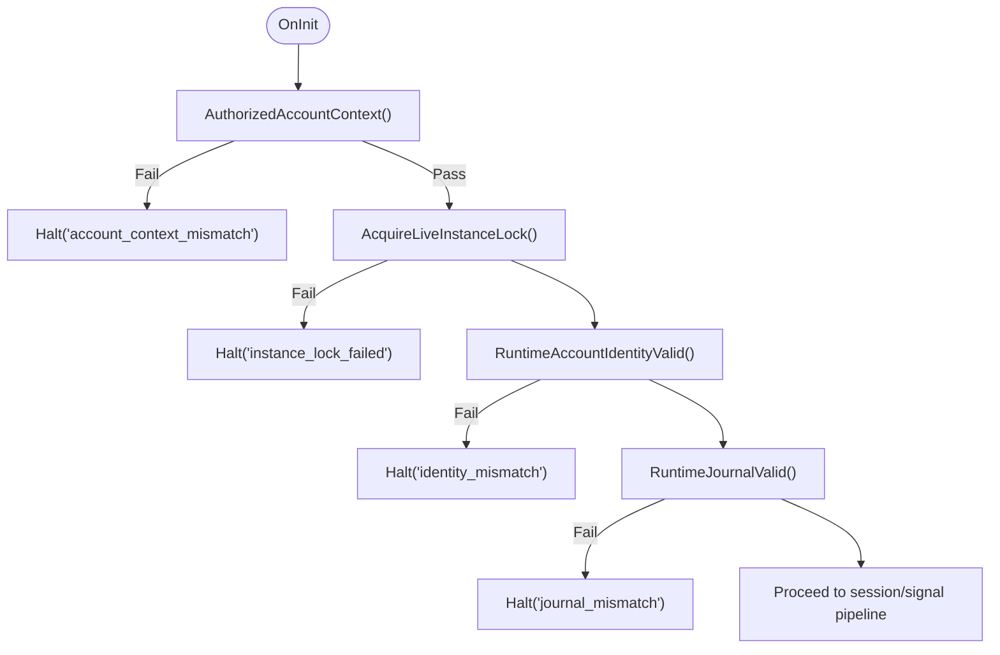
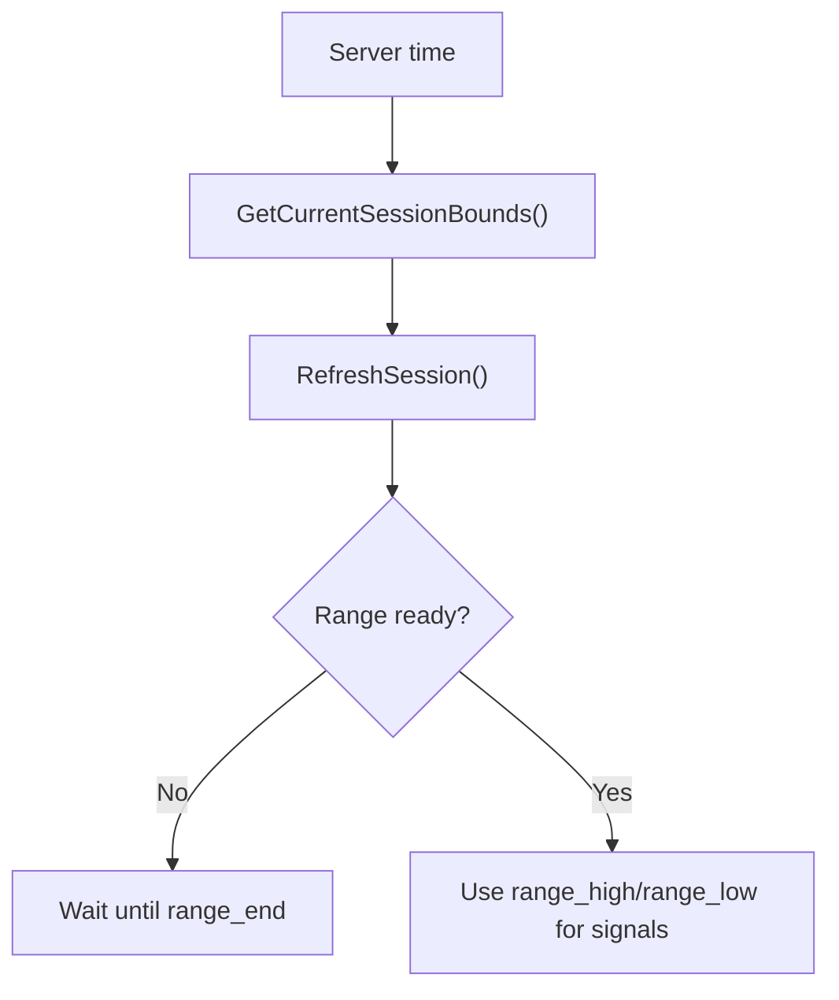
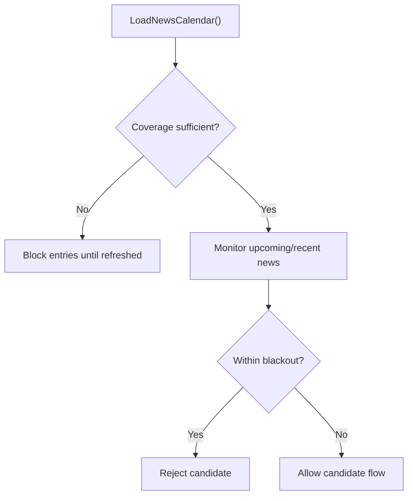
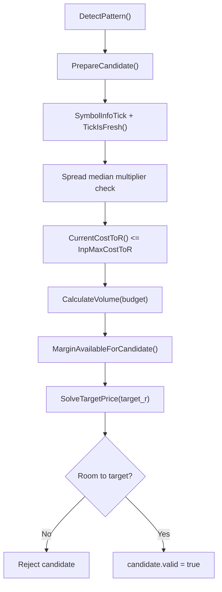
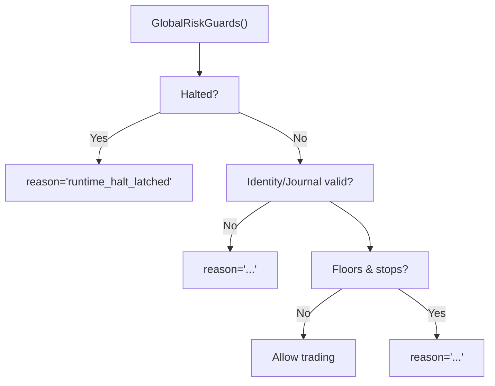
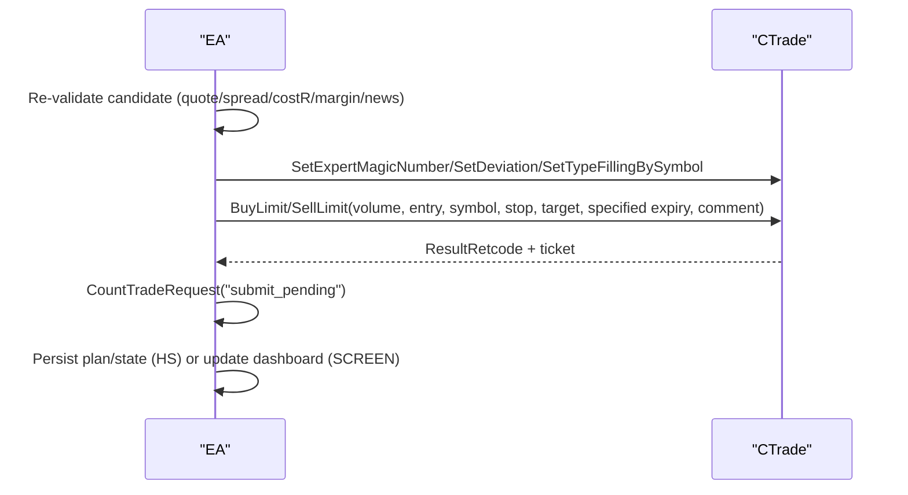
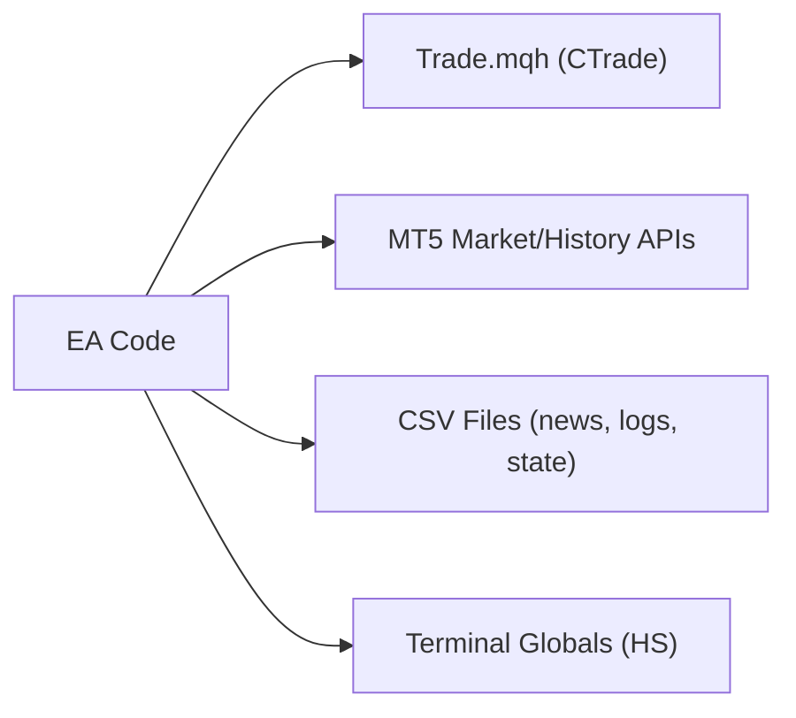

# MQL5 Function Reference

<cite>
**Referenced Files in This Document**
- [TRIAD_R_HS.mq5](file://MQL5/Experts/TRIAD_R_HS/TRIAD_R_HS.mq5)
- [TRIAD_SCREEN.mq5](file://MQL5/Experts/TRIAD_SCREEN/TRIAD_SCREEN.mq5)
- [README.md (HS)](file://MQL5/Experts/TRIAD_R_HS/README.md)
- [README.md (SCREEN)](file://MQL5/Experts/TRIAD_SCREEN/README.md)
</cite>

## Table of Contents
1. Introduction
2. Project Structure
3. Core Components
4. Architecture Overview
5. Detailed Component Analysis
6. Dependency Analysis
7. Performance Considerations
8. Troubleshooting Guide
9. Conclusion
10. Appendices

## Introduction
This document provides a comprehensive MQL5 API reference for the TRIAD-R expert advisors:
- TRIAD_R_HS.mq5: production-grade, fail-closed research EA with lifecycle locks, instance ownership, and persistent state journaling.
- TRIAD_SCREEN.mq5: demo-only screening EA that ports the same V2.1 entry rules but omits production safety machinery; includes an on-chart dashboard and CSV logs.

The focus is on public-facing behaviors exposed by these EAs: initialization, session management, signal detection, risk calculations, order execution, position management, chart logging/dashboarding, and integration points with MetaTrader 5 APIs. Guidance is included for extending functionality and maintaining compatibility across MT5 versions.

## Project Structure
The repository contains two primary MQL5 experts under MQL5/Experts:
- TRIAD_R_HS: canonical strategy implementation with robust safety controls.
- TRIAD_SCREEN: demo screening tool with identical entry logic and simplified persistence.

**Diagram sources**
- [TRIAD_R_HS.mq5:1-120](file://MQL5/Experts/TRIAD_R_HS/TRIAD_R_HS.mq5#L1-L120)
- [TRIAD_SCREEN.mq5:1-160](file://MQL5/Experts/TRIAD_SCREEN/TRIAD_SCREEN.mq5#L1-L160)

**Section sources**
- [TRIAD_R_HS.mq5:1-120](file://MQL5/Experts/TRIAD_R_HS/TRIAD_R_HS.mq5#L1-L120)
- [TRIAD_SCREEN.mq5:1-160](file://MQL5/Experts/TRIAD_SCREEN/TRIAD_SCREEN.mq5#L1-L160)
- [README.md (HS):1-120](file://MQL5/Experts/TRIAD_R_HS/README.md#L1-L120)
- [README.md (SCREEN):1-80](file://MQL5/Experts/TRIAD_SCREEN/README.md#L1-L80)

## Core Components
- Session management: computes London/New York ranges and entry windows using civil-time and DST-aware helpers; tracks per-session state and consumed flags.
- Signal detection: identifies sweep/reclaim/displacement patterns on M5 bars with configurable wick/body thresholds and ATR-based filters.
- Risk calculations: selects risk profile, adjusts for drawdown, enforces firm floors, daily/weekly stops, and projected equity checks before risking cash.
- Order execution: submits limit orders with SL/TP, validates broker distances, spread gates, cost-to-R, margin availability, and request latency caps.
- Position management: enforces exposure invariants, cancels/closes own-magic objects, handles foreign exposure, and performs emergency cleanup.
- Charting/logging: writes audit logs to CSV, prints events, and renders a dashboard overlay in TRIAD_SCREEN.

Key data structures:
- SessionRuntime (HS) / single-session state (SCREEN): range bounds, entry window, high/low, consumed flag, last closed bar.
- SignalCandidate (HS) / TSC_Candidate (SCREEN): pattern side, entry/stop/target, volume, cash risk, target net, percentiles, rejection reasons.
- NewsEvent: UTC time, currency, title.

**Section sources**
- [TRIAD_R_HS.mq5:150-262](file://MQL5/Experts/TRIAD_R_HS/TRIAD_R_HS.mq5#L150-L262)
- [TRIAD_SCREEN.mq5:160-287](file://MQL5/Experts/TRIAD_SCREEN/TRIAD_SCREEN.mq5#L160-L287)

## Architecture Overview
The EAs follow a timer-driven loop that:
1) Initializes or refreshes sessions and news calendar.
2) Scans symbols for completed session ranges and detects signals.
3) Validates candidates against market conditions, risk guards, and account state.
4) Submits orders or manages existing exposure.
5) Logs decisions and persists state as appropriate.

**Diagram sources**
- [TRIAD_R_HS.mq5:1867-1909](file://MQL5/Experts/TRIAD_R_HS/TRIAD_R_HS.mq5#L1867-L1909)
- [TRIAD_R_HS.mq5:1936-2116](file://MQL5/Experts/TRIAD_R_HS/TRIAD_R_HS.mq5#L1936-L2116)
- [TRIAD_R_HS.mq5:2380-2399](file://MQL5/Experts/TRIAD_R_HS/TRIAD_R_HS.mq5#L2380-L2399)
- [TRIAD_SCREEN.mq5:2347-2399](file://MQL5/Experts/TRIAD_SCREEN/TRIAD_SCREEN.mq5#L2347-L2399)

## Detailed Component Analysis

### Initialization and Safety Controls (HS)
- AuthorizedAccountContext(): verifies tester mode or authorized login/server context.
- AcquireLiveInstanceLock()/RefreshLiveInstanceLock()/ReleaseLiveInstanceLock(): terminal-global owner/heartbeat lock to prevent duplicate live instances.
- RuntimeAccountIdentityValid(): validates configuration hash, identity hash, server offset tolerance, leverage, currency, hedging mode, and trade permissions.
- RuntimeJournalValid(): reads persisted halt/migration latches and state signature; fails closed on mismatch.
- Halt()/WriteHaltLatch()/ReadHaltLatch(): persist safe halts with signatures bound to config/account identity.

**Diagram sources**
- [TRIAD_R_HS.mq5:273-281](file://MQL5/Experts/TRIAD_R_HS/TRIAD_R_HS.mq5#L273-L281)
- [TRIAD_R_HS.mq5:494-566](file://MQL5/Experts/TRIAD_R_HS/TRIAD_R_HS.mq5#L494-L566)
- [TRIAD_R_HS.mq5:1714-1762](file://MQL5/Experts/TRIAD_R_HS/TRIAD_R_HS.mq5#L1714-L1762)
- [TRIAD_R_HS.mq5:329-350](file://MQL5/Experts/TRIAD_R_HS/TRIAD_R_HS.mq5#L329-L350)

**Section sources**
- [TRIAD_R_HS.mq5:268-350](file://MQL5/Experts/TRIAD_R_HS/TRIAD_R_HS.mq5#L268-L350)
- [TRIAD_R_HS.mq5:494-566](file://MQL5/Experts/TRIAD_R_HS/TRIAD_R_HS.mq5#L494-L566)
- [TRIAD_R_HS.mq5:1714-1762](file://MQL5/Experts/TRIAD_R_HS/TRIAD_R_HS.mq5#L1714-L1762)

### Session Management
- GetCurrentSessionBounds()/BuildBoundsForCivilDate(): compute range_start/end and entry_start/end for London and New York using DST-aware offsets.
- RefreshSession(index, now): updates per-session state, marks consumed when mid-session attach occurs, and loads range high/low after range_end.

**Diagram sources**
- [TRIAD_R_HS.mq5:754-789](file://MQL5/Experts/TRIAD_R_HS/TRIAD_R_HS.mq5#L754-L789)
- [TRIAD_R_HS.mq5:1867-1909](file://MQL5/Experts/TRIAD_R_HS/TRIAD_R_HS.mq5#L1867-L1909)

**Section sources**
- [TRIAD_R_HS.mq5:754-789](file://MQL5/Experts/TRIAD_R_HS/TRIAD_R_HS.mq5#L754-L789)
- [TRIAD_R_HS.mq5:1867-1909](file://MQL5/Experts/TRIAD_R_HS/TRIAD_R_HS.mq5#L1867-L1909)

### News Calendar Integration
- LoadNewsCalendar(): parses triad_red_news.csv, validates timestamps, currencies, impacts, and required coverage declaration.
- NewsCalendarCurrent()/IsRelevantNewsWindow()/UpcomingRelevantNews()/RecentRelevantNews(): enforce blackout windows around relevant events.

**Diagram sources**
- [TRIAD_R_HS.mq5:836-918](file://MQL5/Experts/TRIAD_R_HS/TRIAD_R_HS.mq5#L836-L918)
- [TRIAD_R_HS.mq5:920-1000](file://MQL5/Experts/TRIAD_R_HS/TRIAD_R_HS.mq5#L920-L1000)

**Section sources**
- [TRIAD_R_HS.mq5:836-1000](file://MQL5/Experts/TRIAD_R_HS/TRIAD_R_HS.mq5#L836-L1000)

### Signal Detection and Candidate Preparation
- DetectPattern(session_index, candidate): scans M5 bars for sweep/reclaim/displacement; sets side, signal_bar_time, rejection reasons.
- PrepareCandidate(candidate): computes entry (mid of displacement), stop (ATR-based), validates symbol trade mode, quotes, spread gate, cost-to-R, volume, margin, target price, and room constraints.

**Diagram sources**
- [TRIAD_R_HS.mq5:1936-2116](file://MQL5/Experts/TRIAD_R_HS/TRIAD_R_HS.mq5#L1936-L2116)
- [TRIAD_R_HS.mq5:2380-2399](file://MQL5/Experts/TRIAD_R_HS/TRIAD_R_HS.mq5#L2380-L2399)

**Section sources**
- [TRIAD_R_HS.mq5:1936-2116](file://MQL5/Experts/TRIAD_R_HS/TRIAD_R_HS.mq5#L1936-L2116)
- [TRIAD_R_HS.mq5:2380-2399](file://MQL5/Experts/TRIAD_R_HS/TRIAD_R_HS.mq5#L2380-L2399)

### Risk Calculations and Guards
- ActiveRiskFraction(): base risk from profile, halved if drawdown threshold reached.
- CanTakeCashRisk(stressed_loss, slippage_reserve_cash, reason): projects equity after loss against firm floor, daily/weekly stops, and drawdown shutdown.
- GlobalRiskGuards(reason): composite guard including halted state, identity/journal validity, log failures, migration latches, unauthorized history, lifecycle locks, floors, phase targets.

**Diagram sources**
- [TRIAD_R_HS.mq5:1621-1712](file://MQL5/Experts/TRIAD_R_HS/TRIAD_R_HS.mq5#L1621-L1712)
- [TRIAD_R_HS.mq5:1772-1846](file://MQL5/Experts/TRIAD_R_HS/TRIAD_R_HS.mq5#L1772-L1846)

**Section sources**
- [TRIAD_R_HS.mq5:1621-1712](file://MQL5/Experts/TRIAD_R_HS/TRIAD_R_HS.mq5#L1621-L1712)
- [TRIAD_R_HS.mq5:1772-1846](file://MQL5/Experts/TRIAD_R_HS/TRIAD_R_HS.mq5#L1772-L1846)

### Order Execution and Position Management
- SubmitCandidate(candidate): re-validates at submission time, sets magic/deviation/filling, submits BuyLimit/SellLimit with expiration, logs latency and retcodes.
- DeleteOrder(ticket, reason, emergency)/ClosePosition(ticket, reason, emergency): throttled emergency vs non-emergency requests, idempotent behavior if already absent.
- ManageExposure(): enforces one-pending-or-one-position invariant, cleans foreign exposure, flattens on guard violations.

**Diagram sources**
- [TRIAD_SCREEN.mq5:2083-2206](file://MQL5/Experts/TRIAD_SCREEN/TRIAD_SCREEN.mq5#L2083-L2206)
- [TRIAD_SCREEN.mq5:2208-2272](file://MQL5/Experts/TRIAD_SCREEN/TRIAD_SCREEN.mq5#L2208-L2272)
- [TRIAD_SCREEN.mq5:2347-2399](file://MQL5/Experts/TRIAD_SCREEN/TRIAD_SCREEN.mq5#L2347-L2399)

**Section sources**
- [TRIAD_SCREEN.mq5:2083-2206](file://MQL5/Experts/TRIAD_SCREEN/TRIAD_SCREEN.mq5#L2083-L2206)
- [TRIAD_SCREEN.mq5:2208-2272](file://MQL5/Experts/TRIAD_SCREEN/TRIAD_SCREEN.mq5#L2208-L2272)
- [TRIAD_SCREEN.mq5:2347-2399](file://MQL5/Experts/TRIAD_SCREEN/TRIAD_SCREEN.mq5#L2347-L2399)

### Chart Drawing and Dashboard (SCREEN)
- Draws status, phase progress, qualifying days, daily/overall floor distance, today’s signals/candidates/fills/rejects, net R ledger, and ConfigHash fingerprint.
- Writes CSVs: J (event journal), S (persisted state), D (daily summary), P (planned cash risk), T (closed-trade R ledger).

**Section sources**
- [TRIAD_SCREEN.mq5:152-156](file://MQL5/Experts/TRIAD_SCREEN/TRIAD_SCREEN.mq5#L152-L156)
- [TRIAD_SCREEN.mq5:291-354](file://MQL5/Experts/TRIAD_SCREEN/TRIAD_SCREEN.mq5#L291-L354)
- [TRIAD_SCREEN.mq5:547-578](file://MQL5/Experts/TRIAD_SCREEN/TRIAD_SCREEN.mq5#L547-L578)

## Dependency Analysis
- External libraries: #include <Trade/Trade.mqh> for CTrade operations.
- Platform APIs: AccountInfo*, SymbolInfo*, HistorySelect*, OrdersTotal/PositionsTotal, CopyRates, iATR/iBarShift, GlobalVariable* (HS), FileOpen/FileWrite (both).
- Data inputs: triad_red_news.csv schema and validation.

**Diagram sources**
- [TRIAD_R_HS.mq5:7](file://MQL5/Experts/TRIAD_R_HS/TRIAD_R_HS.mq5#L7)
- [TRIAD_SCREEN.mq5:34](file://MQL5/Experts/TRIAD_SCREEN/TRIAD_SCREEN.mq5#L34)

**Section sources**
- [TRIAD_R_HS.mq5:7](file://MQL5/Experts/TRIAD_R_HS/TRIAD_R_HS.mq5#L7)
- [TRIAD_SCREEN.mq5:34](file://MQL5/Experts/TRIAD_SCREEN/TRIAD_SCREEN.mq5#L34)

## Performance Considerations
- Timer cadence and one-second maximum synchronous order-request latency are enforced; excessive latency triggers ERROR-level logs.
- Request throttling: non-emergency requests capped per day; emergency cleanup uses per-ticket throttling to avoid storms.
- Efficient range/statistics computation: only read completed ranges after range_end; use minute-matched spreads and bounded lookbacks.
- Avoid redundant indicator calls: ATR handle reuse and BarsCalculated checks; EMA(50) handle reuse for H1 bias filter.

[No sources needed since this section provides general guidance]

## Troubleshooting Guide
Common error categories and handling:
- News calendar issues: insufficient coverage, invalid rows, stale runtime coverage; blocks entries until fixed.
- Quote freshness and spread gates: stale ticks or widened spreads reject candidates.
- Broker constraints: stops/freezes levels violated; symbol not in full trade mode.
- Risk guard violations: firm floor, daily/weekly stops, drawdown shutdown, phase complete, external cashflow/unauthorized history.
- Instance conflicts: duplicate live instance detected; stale instance fenced.
- State mismatches: persisted halt/migration latches or state signature mismatch; requires formal reset/rebaseline.

Remediation steps:
- Ensure triad_red_news.csv has explicit ALL,COVERAGE row covering required hours.
- Verify server offset and timezone settings; confirm broker symbol suffixes and trade modes.
- Review Experts log and CSV audit logs for exact rejection reasons.
- For HS: perform one-time authorization flows for fresh phase state or halt reset as documented.

**Section sources**
- [TRIAD_R_HS.mq5:836-918](file://MQL5/Experts/TRIAD_R_HS/TRIAD_R_HS.mq5#L836-L918)
- [TRIAD_R_HS.mq5:1714-1846](file://MQL5/Experts/TRIAD_R_HS/TRIAD_R_HS.mq5#L1714-L1846)
- [TRIAD_SCREEN.mq5:2083-2206](file://MQL5/Experts/TRIAD_SCREEN/TRIAD_SCREEN.mq5#L2083-L2206)

## Conclusion
The TRIAD-R EAs implement a disciplined, safety-first approach to session-based sweep/reclaim strategies:
- Robust session/timezone handling ensures correct range and entry windows.
- Strict signal validation and risk guards protect capital and comply with challenge rules.
- Transparent logging and dashboards aid debugging and operational oversight.
- The HS variant adds production-grade safeguards (instance locks, journal signatures, lifecycle locks), while SCREEN focuses on demo screening and visualization.

Extending functionality should preserve fail-closed semantics, respect request caps and latency limits, and maintain compatibility with MT5 APIs and broker-specific constraints.

[No sources needed since this section summarizes without analyzing specific files]

## Appendices

### API Summary: Key Functions and Responsibilities
- Session and time:
  - GetCurrentSessionBounds(session_index, server_now, ...): returns range and entry boundaries for London/New York.
  - BuildBoundsForCivilDate(...): constructs session times from civil dates with DST awareness.
- News calendar:
  - LoadNewsCalendar(): load and validate triad_red_news.csv; enforce coverage.
  - IsRelevantNewsWindow()/UpcomingRelevantNews()/RecentRelevantNews(): manage blackout windows.
- Market data and statistics:
  - ReadRange(symbol, start, end, high, low): fetch M5 range between times.
  - ComputeAtrBefore(symbol, before_time, atr): retrieve ATR(14) anchored to a completed M15 bar.
  - ComparableStatistics(...): compute range/ATR percentiles and spread median over comparable sessions.
- Signal detection:
  - DetectPattern(session_index, candidate): identify sweep/reclaim/displacement; set side and rejection reasons.
  - PrepareCandidate(candidate): compute entry/stop/target, validate quotes, spread, cost-to-R, volume, margin, room.
- Risk and guards:
  - ActiveRiskFraction(): profile-based risk adjusted by drawdown.
  - CanTakeCashRisk(stressed_loss, slippage_reserve_cash, reason): project equity after loss against floors/stops/shutdown.
  - GlobalRiskGuards(reason): composite pre-trade checks (halt, identity, journal, floors, phase).
- Order execution:
  - SubmitCandidate(candidate): final revalidation and limit order submission with SL/TP and expiration.
  - DeleteOrder/Closing functions: idempotent cancel/close with emergency throttling.
  - ManageExposure(): enforce one-exposure invariant and flatten on guard violations.
- Logging and persistence:
  - LogEvent(level, event, detail): write to CSV and print; HS includes balance/equity/request counts.
  - PersistAccountState()/GVRead/GVWrite: HS terminal globals for state, halt latches, and signatures.

**Section sources**
- [TRIAD_R_HS.mq5:754-789](file://MQL5/Experts/TRIAD_R_HS/TRIAD_R_HS.mq5#L754-L789)
- [TRIAD_R_HS.mq5:836-1000](file://MQL5/Experts/TRIAD_R_HS/TRIAD_R_HS.mq5#L836-L1000)
- [TRIAD_R_HS.mq5:1014-1223](file://MQL5/Experts/TRIAD_R_HS/TRIAD_R_HS.mq5#L1014-L1223)
- [TRIAD_R_HS.mq5:1936-2116](file://MQL5/Experts/TRIAD_R_HS/TRIAD_R_HS.mq5#L1936-L2116)
- [TRIAD_R_HS.mq5:2380-2399](file://MQL5/Experts/TRIAD_R_HS/TRIAD_R_HS.mq5#L2380-L2399)
- [TRIAD_R_HS.mq5:1621-1712](file://MQL5/Experts/TRIAD_R_HS/TRIAD_R_HS.mq5#L1621-L1712)
- [TRIAD_R_HS.mq5:1772-1846](file://MQL5/Experts/TRIAD_R_HS/TRIAD_R_HS.mq5#L1772-L1846)
- [TRIAD_SCREEN.mq5:2083-2206](file://MQL5/Experts/TRIAD_SCREEN/TRIAD_SCREEN.mq5#L2083-L2206)
- [TRIAD_SCREEN.mq5:2208-2272](file://MQL5/Experts/TRIAD_SCREEN/TRIAD_SCREEN.mq5#L2208-L2272)
- [TRIAD_SCREEN.mq5:2347-2399](file://MQL5/Experts/TRIAD_SCREEN/TRIAD_SCREEN.mq5#L2347-L2399)

### Extending EA Functionality and Compatibility
- Adding new filters: integrate into PrepareCandidate or GlobalRiskGuards; ensure rejections are logged with clear reasons.
- Custom indicators: create and cache handles (like g_atr_handles/g_h1_ema_handles); guard with BarsCalculated and CopyBuffer checks.
- MT5 version compatibility: rely on standard APIs (CTrade, SymbolInfo*, HistorySelect*); avoid deprecated features; test on target build.
- Safety-first extension: honor request caps, latency limits, and fail-closed defaults; never bypass news blackouts or risk guards.

[No sources needed since this section provides general guidance]