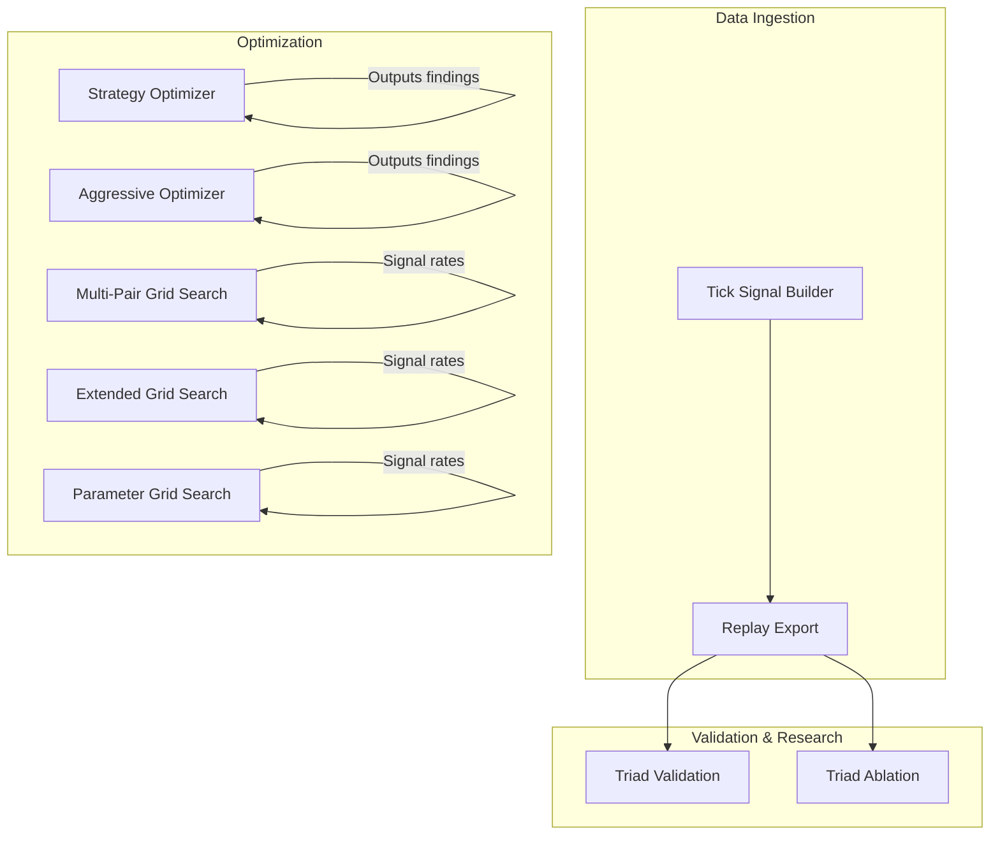
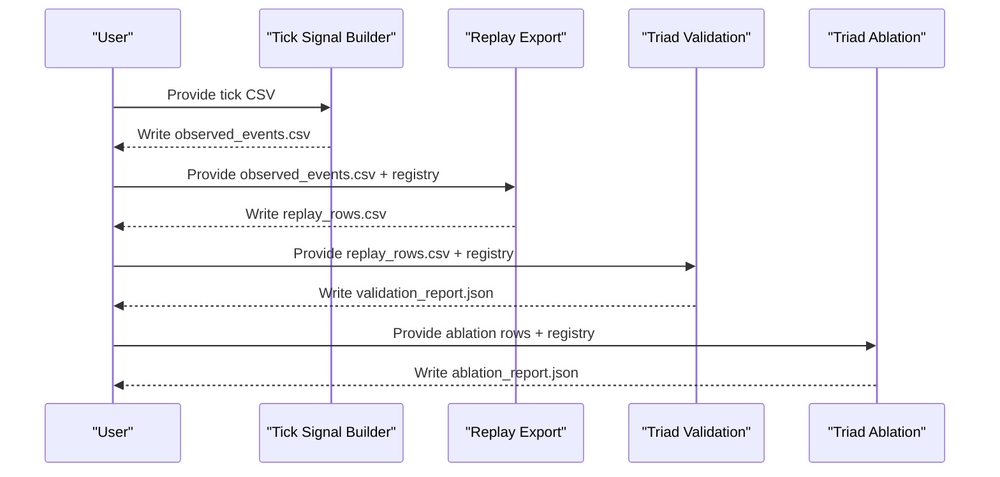
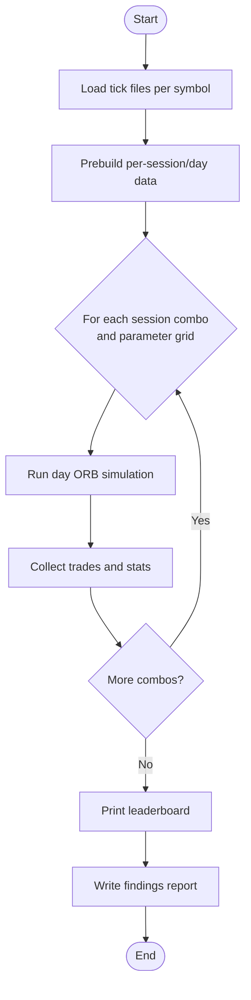
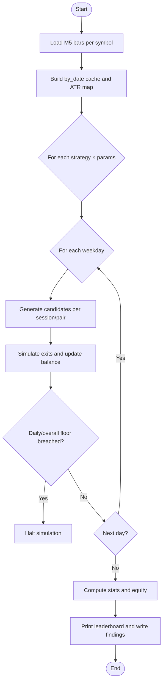
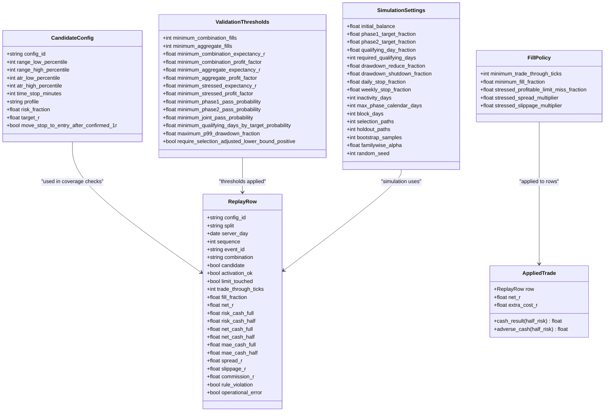
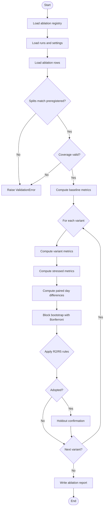

# Python Tool Interfaces

<cite>
**Referenced Files in This Document**
- [tools/__init__.py](file://tools/__init__.py)
- [tools/strategy_optimizer.py](file://tools/strategy_optimizer.py)
- [tools/aggressive_optimizer.py](file://tools/aggressive_optimizer.py)
- [tools/extended_grid_search.py](file://tools/extended_grid_search.py)
- [tools/multi_pair_grid_search.py](file://tools/multi_pair_grid_search.py)
- [tools/parameter_grid_search.py](file://tools/parameter_grid_search.py)
- [tools/replay_export.py](file://tools/replay_export.py)
- [tools/tick_signal_builder.py](file://tools/tick_signal_builder.py)
- [tools/triad_validation.py](file://tools/triad_validation.py)
- [tools/triad_ablation.py](file://tools/triad_ablation.py)
</cite>

## Table of Contents
1. Introduction
2. Project Structure
3. Core Components
4. Architecture Overview
5. Detailed Component Analysis
6. Dependency Analysis
7. Performance Considerations
8. Troubleshooting Guide
9. Conclusion
10. Appendices

## Introduction
This document provides comprehensive Python API documentation for the research and validation tools used to evaluate, optimize, and validate trading strategies across multiple instruments and sessions. It covers:
- Strategy optimization tools for grid searches and challenge simulations
- Validation frameworks that enforce a frozen registry and replay-based evaluation
- Ablation study tooling with preregistered hypotheses and statistical decision rules
- Performance analysis utilities including signal detection and parameter sweeps
- Data input/output contracts, logging mechanisms, error handling, and extension guidance

The tools are designed to be offline, deterministic where applicable, and auditable through registries and CSV schemas.

## Project Structure
The repository organizes research and validation logic under tools/:
- Strategy optimizers: strategy_optimizer.py, aggressive_optimizer.py
- Parameter grid search utilities: multi_pair_grid_search.py, extended_grid_search.py, parameter_grid_search.py
- Replay pipeline: tick_signal_builder.py (tick-to-events), replay_export.py (events-to-replay rows)
- Validation and ablation: triad_validation.py, triad_ablation.py

**Diagram sources**
- [tools/tick_signal_builder.py:1-800](file://tools/tick_signal_builder.py#L1-L800)
- [tools/replay_export.py:1-800](file://tools/replay_export.py#L1-L800)
- [tools/strategy_optimizer.py:1-800](file://tools/strategy_optimizer.py#L1-L800)
- [tools/aggressive_optimizer.py:1-795](file://tools/aggressive_optimizer.py#L1-L795)
- [tools/multi_pair_grid_search.py:1-466](file://tools/multi_pair_grid_search.py#L1-L466)
- [tools/extended_grid_search.py:1-432](file://tools/extended_grid_search.py#L1-L432)
- [tools/parameter_grid_search.py:1-245](file://tools/parameter_grid_search.py#L1-L245)
- [tools/triad_validation.py:1-800](file://tools/triad_validation.py#L1-L800)
- [tools/triad_ablation.py:1-800](file://tools/triad_ablation.py#L1-L800)

**Section sources**
- [tools/__init__.py:1-2](file://tools/__init__.py#L1-L2)

## Core Components
This section summarizes key classes, functions, parameters, and return formats for each tool. Where appropriate, usage patterns and integration notes are included.

### Strategy Optimizer
Purpose:
- Grid-search ORB variants across target R, opening range bars, stop modes, ATR stops, minimum ORB width, and session combinations.
- Compute per-combo metrics: signals, win rate, average R, profit factor, monthly cash estimate, Sharpe-like score, Kelly fraction.
- Simulate Phase 1 challenge constraints on top results.

Key data structures:
- Bar: time, open, high, low, close
- Trade: direction, entry, stop, target, exit_price, exit_reason, pnl_r, pnl_cash, lots, session, day_key
- GridResult: label, strategy, target_r, orb_bars, stop_mode, atr_stop, min_orb_pips, sessions; outputs include days_tested, signals, wins, losses, time_exits, win_rate, avg_r, std_r, profit_factor, total_r, total_cash, monthly_cash, sharpe_r, kelly, trades

Core functions:
- load_ticks(path): loads ask and mid ticks per day from tab-delimited files; returns (ask_day, mid_day) dicts keyed by date string
- build_bars(ticks, period): builds OHLC bars from ticks; returns list of Bar
- atr14(bars, before): computes 14-period ATR using bar ranges prior to a timestamp
- run_day_orb(...): runs one day’s ORB simulation with given parameters; returns Trade or None
- prebuild_days(loaded): builds per-session/day data structures once
- run_combo(sessions, day_data, ...): executes all days for a combo; returns GridResult
- run_grid(loaded): enumerates session combos and parameter grids; returns list[GridResult]
- print_leaderboard(results): filters viable combos and prints top results
- simulate_challenge(result): sequential Phase 1 simulation with daily/overall floors; returns dict with phase outcomes
- write_findings(results, viable, top20, out_path): writes markdown report

Input/Output:
- Input: tick CSVs per symbol under validation/HistoryData
- Output: console leaderboard, findings_strategy_optimizer.md

Logging:
- Progress prints during loading, prebuilding, and grid execution
- Findings written to file

Error handling:
- Skips invalid rows and missing files
- Validates ATR and stop bands; rejects trades outside constraints

Usage example:
- Run as script to process available tick files and generate findings

**Section sources**
- [tools/strategy_optimizer.py:75-124](file://tools/strategy_optimizer.py#L75-L124)
- [tools/strategy_optimizer.py:164-181](file://tools/strategy_optimizer.py#L164-L181)
- [tools/strategy_optimizer.py:187-208](file://tools/strategy_optimizer.py#L187-L208)
- [tools/strategy_optimizer.py:244-381](file://tools/strategy_optimizer.py#L244-L381)
- [tools/strategy_optimizer.py:387-405](file://tools/strategy_optimizer.py#L387-L405)
- [tools/strategy_optimizer.py:411-485](file://tools/strategy_optimizer.py#L411-L485)
- [tools/strategy_optimizer.py:491-530](file://tools/strategy_optimizer.py#L491-L530)
- [tools/strategy_optimizer.py:536-571](file://tools/strategy_optimizer.py#L536-L571)
- [tools/strategy_optimizer.py:577-622](file://tools/strategy_optimizer.py#L577-L622)
- [tools/strategy_optimizer.py:628-771](file://tools/strategy_optimizer.py#L628-L771)

### Aggressive Multi-Pair Challenge Optimizer
Purpose:
- Optimize fast Phase 1 completion across multiple pairs and strategies (ORB ATR-fixed, ORB midpoint, volatility expansion).
- Fixed lot sizing based on initial balance to avoid compounding blow-up.
- Enforces daily loss limits and overall floor; tracks equity curve and Phase 1 timeline.

Key data structures:
- Bar: ts (UTC-aware), open, high, low, close
- Trade: pair, direction, entry, stop, target, exit_price, exit_reason, pnl_cash, pnl_r, lots, bar_date, strategy

Core functions:
- load_pair(symbol): loads M5 bars from history files; returns list[Bar]
- preprocess(bars): builds by_date cache and rolling ATR map; returns (by_date, atr_map)
- calc_lots(stop_dist, symbol): size lots using fixed risk budget
- sig_orb_atr/sig_orb_half/sig_vola: signal generators returning candidate dicts
- simulate(sig, future_bars, end_utc, symbol): scans exits; returns Trade
- run_backtest(cache, strategy, target_r, orb_bars, atr_stop, max_per_day=2): simulates full backtest; returns dict with stats, equity, per-pair breakdown
- run_grid(cache): enumerates strategy × target R × ORB bars × ATR stop; returns list[dict]
- print_leaderboard(results): filters and prints top combos
- print_deep_dive(r): detailed best config summary and ASCII equity curve
- write_findings(results, top): writes markdown report

Input/Output:
- Input: M5 OHLCV CSVs per symbol
- Output: console leaderboard, deep dive, findings_aggressive_optimizer.md

Logging:
- Progress prints per combination and per symbol preprocessing
- Equity curve printed for best configuration

Error handling:
- Skips invalid bars and missing files
- Enforces stop distance and ATR constraints; halts if floor breached

Usage example:
- Run as script to process all available pairs and produce findings

**Section sources**
- [tools/aggressive_optimizer.py:122-144](file://tools/aggressive_optimizer.py#L122-L144)
- [tools/aggressive_optimizer.py:149-168](file://tools/aggressive_optimizer.py#L149-L168)
- [tools/aggressive_optimizer.py:174-207](file://tools/aggressive_optimizer.py#L174-L207)
- [tools/aggressive_optimizer.py:213-220](file://tools/aggressive_optimizer.py#L213-L220)
- [tools/aggressive_optimizer.py:226-288](file://tools/aggressive_optimizer.py#L226-L288)
- [tools/aggressive_optimizer.py:294-328](file://tools/aggressive_optimizer.py#L294-L328)
- [tools/aggressive_optimizer.py:334-485](file://tools/aggressive_optimizer.py#L334-L485)
- [tools/aggressive_optimizer.py:491-509](file://tools/aggressive_optimizer.py#L491-L509)
- [tools/aggressive_optimizer.py:515-552](file://tools/aggressive_optimizer.py#L515-L552)
- [tools/aggressive_optimizer.py:558-598](file://tools/aggressive_optimizer.py#L558-L598)
- [tools/aggressive_optimizer.py:603-761](file://tools/aggressive_optimizer.py#L603-L761)

### Multi-Pair Grid Search
Purpose:
- Sweep SWEEP_ATR_MAX and RECLAIM_WICK_MIN across EURUSD London, GBPUSD London, USDJPY New York.
- Reports signal counts, rates, and rejection reasons per session and combined portfolio view.

Key functions:
- london_wall_to_server/ny_wall_to_server: DST-correct session boundary conversion
- bar_key/build_bars/compute_atr14: bar construction and ATR calculation
- count_signals_for_day(...): detects sweep→reclaim→displacement signals; returns (found, reason)
- run_grid(session_name, ask_day, mid_day): prebuilds per-day data and runs parameter grid; returns list[dict]
- main(): orchestrates loading, grid runs, and reporting

Input/Output:
- Input: tick CSVs per symbol
- Output: console tables per session and combined portfolio view

Logging:
- Loading progress and per-session result tables

Error handling:
- Skips incomplete days and invalid windows
- Tracks rejection reasons for diagnostics

Usage example:
- Run as script to analyze parameter sensitivity across sessions

**Section sources**
- [tools/multi_pair_grid_search.py:89-130](file://tools/multi_pair_grid_search.py#L89-L130)
- [tools/multi_pair_grid_search.py:137-176](file://tools/multi_pair_grid_search.py#L137-L176)
- [tools/multi_pair_grid_search.py:183-265](file://tools/multi_pair_grid_search.py#L183-L265)
- [tools/multi_pair_grid_search.py:272-301](file://tools/multi_pair_grid_search.py#L272-L301)
- [tools/multi_pair_grid_search.py:308-370](file://tools/multi_pair_grid_search.py#L308-L370)
- [tools/multi_pair_grid_search.py:384-461](file://tools/multi_pair_grid_search.py#L384-L461)

### Extended Grid Search
Purpose:
- Adds RECLAIM_BARS dimension to sweep/wick parameter grid.
- Provides per-session and combined portfolio views with annualized signal estimates and challenge ETA approximations.

Key functions:
- bar_key/build_bars/atrs: bar building and ATR computation
- detect(...): parameterized signal detector with sweep_max, wick_min, reclaim_bars; returns (found, reason)
- load_ticks/prebuild: per-session prebuild of bars and reference ticks
- main(): orchestrates grid search and reporting

Input/Output:
- Input: tick CSVs per symbol
- Output: console tables per session and combined portfolio view

Logging:
- Loading progress and per-session result tables

Error handling:
- Skips invalid windows and insufficient data

Usage example:
- Run as script to explore reclaim window sensitivity

**Section sources**
- [tools/extended_grid_search.py:70-96](file://tools/extended_grid_search.py#L70-L96)
- [tools/extended_grid_search.py:103-143](file://tools/extended_grid_search.py#L103-L143)
- [tools/extended_grid_search.py:149-220](file://tools/extended_grid_search.py#L149-L220)
- [tools/extended_grid_search.py:227-252](file://tools/extended_grid_search.py#L227-L252)
- [tools/extended_grid_search.py:259-283](file://tools/extended_grid_search.py#L259-L283)
- [tools/extended_grid_search.py:290-431](file://tools/extended_grid_search.py#L290-L431)

### Parameter Grid Search
Purpose:
- Quick spike script to test SWEEP_ATR_MAX and RECLAIM_WICK_MIN on EURUSD London session.
- Reports signal counts, rates, and rejection reasons.

Key functions:
- bar_key/build_bars/compute_atr14: bar building and ATR
- lower_wick/upper_wick/body_ratio: geometry helpers
- count_signals(...): detects signals within entry window; returns (total_days, signals, reasons)
- main(): loads EURUSD ticks and prints grid results

Input/Output:
- Input: EURUSD tick CSV
- Output: console table per parameter combo

Logging:
- Loading progress and result table

Error handling:
- Skips invalid rows and windows

Usage example:
- Run as script for quick parameter exploration

**Section sources**
- [tools/parameter_grid_search.py:27-82](file://tools/parameter_grid_search.py#L27-L82)
- [tools/parameter_grid_search.py:85-194](file://tools/parameter_grid_search.py#L85-L194)
- [tools/parameter_grid_search.py:197-244](file://tools/parameter_grid_search.py#L197-L244)

### Tick Signal Builder
Purpose:
- Converts raw bid/ask tick CSV into observed-event CSV required by replay_export.
- Implements frozen V2.1 Sleeve A signal detection on EURUSD London session.
- Reconstructs exit paths using forward mid-price ticks.

Key data structures:
- Bar: time, open, high, low, close, ticks
- SignalEvent: fields capturing sweep, reclaim, displacement, ATR, costs, entry/stop prices
- RejectionStats: counters for diagnostic reporting

Key functions:
- compute_atr14(bars_m15, before): ATR from completed M15 bars
- detect_signals(...): applies sweep→reclaim→displacement logic; returns list[SignalEvent]
- compute_exit_path(sig, entry_window_end, forward_mids): determines limit touch, fills, target/stop/time-stop outcomes; returns dict with exit metadata
- process_file(tick_file, output_file, combination, verbose=False): reads ticks, builds bars, detects signals, writes events CSV

Input/Output:
- Input: tick CSV (DATE, TIME, BID, ASK)
- Output: observed_events.csv with schema defined in replay_export

Logging:
- Loading progress, per-day processing logs, optional verbose rejection breakdown

Error handling:
- Skips invalid dates and missing data
- Enforces session boundaries and ATR requirements

Usage example:
- python tools/tick_signal_builder.py --tick-file <path> --output <path> --combination EURUSD_LONDON [--verbose]

**Section sources**
- [tools/tick_signal_builder.py:86-127](file://tools/tick_signal_builder.py#L86-L127)
- [tools/tick_signal_builder.py:133-173](file://tools/tick_signal_builder.py#L133-L173)
- [tools/tick_signal_builder.py:180-197](file://tools/tick_signal_builder.py#L180-L197)
- [tools/tick_signal_builder.py:204-257](file://tools/tick_signal_builder.py#L204-L257)
- [tools/tick_signal_builder.py:285-462](file://tools/tick_signal_builder.py#L285-L462)
- [tools/tick_signal_builder.py:469-587](file://tools/tick_signal_builder.py#L469-L587)
- [tools/tick_signal_builder.py:594-800](file://tools/tick_signal_builder.py#L594-L800)

### Replay Export
Purpose:
- Builds registry-conformant replay rows from observed events produced by external replays.
- Applies frozen EA contract arithmetic: entry placement, stop band, cost gate, lot rounding, target solving, time-stop selection, breakeven policy.
- Expands event set to full calendar coverage for WALK_FORWARD and HOLDOUT splits.

Key data structures:
- ObservedEvent: fields describing signal sequence, costs, fill observations, exit path
- ConfigSpec: profile, risk_fraction, target_r, time_stop_minutes, breakeven policy
- EntrySpec: variant entry parameters (sweep band, wick filter, displacement body, midpoint requirement, entry mode)

Key functions:
- load_observed_events(path): validates and parses event CSV; returns list[ObservedEvent]
- load_config_specs(registry): extracts configurations from validated registry
- resolve_entry(event, spec): re-checks sweep depth, reclaim wick, displacement body/midpoint; returns (entry, stop, rejection)
- resolve_prices(event, entry, stop): computes cash per unit, per-lot risk, round-trip costs, spread/slippage/commission in R
- resolve_exit(event, config, entry, stop, prices): selects effective exit price and net R considering target/stop/breakeven/time/session-end
- resolve_lots(event, config, per_lot_risk, initial_balance): sizes volume with lattice rounding and all-in loss ceiling
- _row_from_resolved(...): produces ReplayRow with candidate/activation flags and cost fields

Input/Output:
- Input: observed_events.csv + registry JSON
- Output: replay_rows.csv conforming to validator schema

Logging:
- Errors raised via ValidationError for schema mismatches and invalid values

Error handling:
- Strict parsing and validation; fail closed on ambiguous or invalid inputs

Usage example:
- python tools/replay_export.py schema
- python tools/replay_export.py build --event-file <path> --configs <registry.json> --selection-split <start> <end> --holdout-split <start> <end> --output <path>

**Section sources**
- [tools/replay_export.py:152-195](file://tools/replay_export.py#L152-L195)
- [tools/replay_export.py:212-274](file://tools/replay_export.py#L212-L274)
- [tools/replay_export.py:281-316](file://tools/replay_export.py#L281-L316)
- [tools/replay_export.py:319-434](file://tools/replay_export.py#L319-L434)
- [tools/replay_export.py:437-455](file://tools/replay_export.py#L437-L455)
- [tools/replay_export.py:463-486](file://tools/replay_export.py#L463-L486)
- [tools/replay_export.py:510-581](file://tools/replay_export.py#L510-L581)
- [tools/replay_export.py:584-623](file://tools/replay_export.py#L584-L623)
- [tools/replay_export.py:626-726](file://tools/replay_export.py#L626-L726)
- [tools/replay_export.py:729-762](file://tools/replay_export.py#L729-L762)
- [tools/replay_export.py:765-800](file://tools/replay_export.py#L765-L800)

### Triad Validation
Purpose:
- Offline champion-selection and challenge-replay tooling for TRIAD-R V2.1.
- Loads frozen registry, validates replay CSV coverage, applies fill policy, computes metrics, and enforces release gates.

Key data structures:
- CandidateConfig: range/ATR bands, time stop, profile, risk/target R, breakeven policy
- FillPolicy: minimum trade-through ticks, fill fraction, stressed miss fraction, stress multipliers
- ValidationThresholds: minimum fills, expectancy, profit factor, drawdown bounds, pass probabilities
- SimulationSettings: challenge simulation parameters, bootstrap settings, random seed
- ReplayRow: row-level fields consumed by validator
- AppliedTrade: wrapper over ReplayRow with extra cost adjustments

Key functions:
- enumerate_candidate_configs(): generates 160 unique configs
- build_registry/write_registry/load_registry: create, persist, and verify registry with SHA-256 hash
- load_replay_rows(path, registry): strict CSV parsing and validation
- validate_replay_coverage(rows, configs): ensures complete calendar coverage per split/config/combination
- apply_fill_policy(row, policy, stressed, seed): filters and adjusts trades per policy
- metric_report(rows, policy, stressed, seed, ...): computes aggregate and per-combination metrics
- independently_eligible_combinations(diagnostics, thresholds): selects eligible combinations based on thresholds
- parse_combination_priorities(text): parses router priorities for session tie-breaking
- _router_key(row, priorities): stable routing key for selection

Input/Output:
- Input: registry JSON + replay_rows.csv
- Output: validation_report.json with metrics, eligibility, and simulation results

Logging:
- Errors raised via ValidationError for invalid registry or replay data

Error handling:
- Strict field validation, finite checks, nonnegative constraints, duplicate row detection

Usage example:
- python3 tools/triad_validation.py preregister --output validation/triad_v2_1_registry.json
- python3 tools/triad_validation.py schema
- python3 tools/triad_validation.py validate --registry <path> --input <path> --output <path>

**Section sources**
- [tools/triad_validation.py:98-128](file://tools/triad_validation.py#L98-L128)
- [tools/triad_validation.py:130-181](file://tools/triad_validation.py#L130-L181)
- [tools/triad_validation.py:183-208](file://tools/triad_validation.py#L183-L208)
- [tools/triad_validation.py:231-267](file://tools/triad_validation.py#L231-L267)
- [tools/triad_validation.py:270-331](file://tools/triad_validation.py#L270-L331)
- [tools/triad_validation.py:334-437](file://tools/triad_validation.py#L334-L437)
- [tools/triad_validation.py:440-473](file://tools/triad_validation.py#L440-L473)
- [tools/triad_validation.py:475-497](file://tools/triad_validation.py#L475-L497)
- [tools/triad_validation.py:500-518](file://tools/triad_validation.py#L500-L518)
- [tools/triad_validation.py:521-643](file://tools/triad_validation.py#L521-L643)
- [tools/triad_validation.py:646-708](file://tools/triad_validation.py#L646-L708)
- [tools/triad_validation.py:711-717](file://tools/triad_validation.py#L711-L717)
- [tools/triad_validation.py:720-748](file://tools/triad_validation.py#L720-L748)
- [tools/triad_validation.py:751-800](file://tools/triad_validation.py#L751-L800)

### Triad Ablation
Purpose:
- Preregistered ablation research round testing whether V2.1 entry complexity earns itself.
- Tests single-element changes against baseline with fixed controls and preregistered decision rules.
- Uses block bootstrap and Bonferroni adjustment for familywise confidence intervals.

Key data structures:
- AblationRun: variant_id, question, description, changed_element, simplicity_bonus, entry_spec
- AblationSettings: acceptance deltas, opportunity premium, minimum fills, bootstrap parameters

Key functions:
- build_runs(): defines baseline and variants (Q1–Q3)
- fixed_config_spec(variant_id): constructs ConfigSpec with fixed controls
- build_registry/write_registry/load_registry: create, persist, and verify ablation registry
- load_runs(registry): loads runs ensuring baseline first
- load_settings(registry): loads decision thresholds
- load_ablation_rows(path, runs): loads replay rows using synthetic registry for coverage checks
- guard_split_args/guard_row_days: enforce preregistered splits and row date ranges
- paired_day_differences(...): computes paired differences between variant and baseline
- paired_bootstrap_interval(...): block bootstrap with Bonferroni adjustment
- decide(run, r1_failures, stress_failures, paired, settings, baseline_fills): applies R2/R5 rules
- evaluate(registry_path, input_path, output_path): orchestrates selection and holdout confirmation

Input/Output:
- Input: ablation registry JSON + ablation_rows.csv
- Output: ablation_report.json with metrics, decisions, and confirmations

Logging:
- Errors raised via ValidationError for invalid registry or data

Error handling:
- Strict enforcement of preregistered splits and decision rules

Usage example:
- python3 tools/triad_ablation.py schema
- python3 tools/triad_ablation.py preregister --output validation/triad_v2_2_ablation_registry.json
- python3 tools/triad_ablation.py build --event-file <path> --registry <path> --selection-split <start> <end> --holdout-split <start> <end> --output <path>
- python3 tools/triad_ablation.py validate --registry <path> --input <path> --output <path>

**Section sources**
- [tools/triad_ablation.py:188-259](file://tools/triad_ablation.py#L188-L259)
- [tools/triad_ablation.py:267-377](file://tools/triad_ablation.py#L267-L377)
- [tools/triad_ablation.py:380-463](file://tools/triad_ablation.py#L380-L463)
- [tools/triad_ablation.py:470-559](file://tools/triad_ablation.py#L470-L559)
- [tools/triad_ablation.py:562-626](file://tools/triad_ablation.py#L562-L626)
- [tools/triad_ablation.py:629-673](file://tools/triad_ablation.py#L629-L673)
- [tools/triad_ablation.py:676-800](file://tools/triad_ablation.py#L676-L800)

## Architecture Overview
End-to-end flow from raw ticks to validated results:

**Diagram sources**
- [tools/tick_signal_builder.py:594-800](file://tools/tick_signal_builder.py#L594-L800)
- [tools/replay_export.py:319-434](file://tools/replay_export.py#L319-L434)
- [tools/triad_validation.py:334-437](file://tools/triad_validation.py#L334-L437)
- [tools/triad_ablation.py:676-800](file://tools/triad_ablation.py#L676-L800)

## Detailed Component Analysis

### Strategy Optimization Workflow

**Diagram sources**
- [tools/strategy_optimizer.py:187-208](file://tools/strategy_optimizer.py#L187-L208)
- [tools/strategy_optimizer.py:387-405](file://tools/strategy_optimizer.py#L387-L405)
- [tools/strategy_optimizer.py:411-485](file://tools/strategy_optimizer.py#L411-L485)
- [tools/strategy_optimizer.py:491-530](file://tools/strategy_optimizer.py#L491-L530)
- [tools/strategy_optimizer.py:536-571](file://tools/strategy_optimizer.py#L536-L571)
- [tools/strategy_optimizer.py:628-771](file://tools/strategy_optimizer.py#L628-L771)

**Section sources**
- [tools/strategy_optimizer.py:491-530](file://tools/strategy_optimizer.py#L491-L530)
- [tools/strategy_optimizer.py:536-571](file://tools/strategy_optimizer.py#L536-L571)
- [tools/strategy_optimizer.py:628-771](file://tools/strategy_optimizer.py#L628-L771)

### Aggressive Optimizer Backtest Flow

**Diagram sources**
- [tools/aggressive_optimizer.py:149-168](file://tools/aggressive_optimizer.py#L149-L168)
- [tools/aggressive_optimizer.py:174-207](file://tools/aggressive_optimizer.py#L174-L207)
- [tools/aggressive_optimizer.py:334-485](file://tools/aggressive_optimizer.py#L334-L485)
- [tools/aggressive_optimizer.py:491-509](file://tools/aggressive_optimizer.py#L491-L509)
- [tools/aggressive_optimizer.py:515-552](file://tools/aggressive_optimizer.py#L515-L552)
- [tools/aggressive_optimizer.py:603-761](file://tools/aggressive_optimizer.py#L603-L761)

**Section sources**
- [tools/aggressive_optimizer.py:334-485](file://tools/aggressive_optimizer.py#L334-L485)
- [tools/aggressive_optimizer.py:491-509](file://tools/aggressive_optimizer.py#L491-L509)
- [tools/aggressive_optimizer.py:515-552](file://tools/aggressive_optimizer.py#L515-L552)
- [tools/aggressive_optimizer.py:603-761](file://tools/aggressive_optimizer.py#L603-L761)

### Validation Pipeline Class Relationships

**Diagram sources**
- [tools/triad_validation.py:98-128](file://tools/triad_validation.py#L98-L128)
- [tools/triad_validation.py:130-181](file://tools/triad_validation.py#L130-L181)
- [tools/triad_validation.py:183-208](file://tools/triad_validation.py#L183-L208)
- [tools/triad_validation.py:210-224](file://tools/triad_validation.py#L210-L224)

**Section sources**
- [tools/triad_validation.py:98-224](file://tools/triad_validation.py#L98-L224)

### Ablation Decision Flow

**Diagram sources**
- [tools/triad_ablation.py:267-377](file://tools/triad_ablation.py#L267-L377)
- [tools/triad_ablation.py:422-463](file://tools/triad_ablation.py#L422-L463)
- [tools/triad_ablation.py:510-559](file://tools/triad_ablation.py#L510-L559)
- [tools/triad_ablation.py:562-626](file://tools/triad_ablation.py#L562-L626)
- [tools/triad_ablation.py:629-673](file://tools/triad_ablation.py#L629-L673)
- [tools/triad_ablation.py:676-800](file://tools/triad_ablation.py#L676-L800)

**Section sources**
- [tools/triad_ablation.py:629-673](file://tools/triad_ablation.py#L629-L673)
- [tools/triad_ablation.py:676-800](file://tools/triad_ablation.py#L676-L800)

## Dependency Analysis
Component coupling and cohesion:
- replay_export depends on triad_validation types (FillPolicy, ReplayRow, ValidationError, constants)
- triad_ablation imports replay_export and triad_validation for shared types and utilities
- Grid search tools are self-contained but share common patterns (bar building, ATR, DST conversions)
- Strategy optimizers are independent and focus on backtesting and challenge simulation

External dependencies:
- Standard library only (csv, datetime, statistics, math, pathlib, typing)
- No third-party libraries; deterministic and portable

Potential circular dependencies:
- None detected; replay_export imports triad_validation types but not vice versa
- triad_ablation imports both replay_export and triad_validation without cycles

Integration points:
- CSV schemas enforced across tools ensure interoperability
- Registries provide frozen configuration and thresholds for validation and ablation

**Section sources**
- [tools/replay_export.py:140-150](file://tools/replay_export.py#L140-L150)
- [tools/triad_ablation.py:98-123](file://tools/triad_ablation.py#L98-L123)

## Performance Considerations
- Prebuild per-day data structures once to avoid recomputation in grid loops
- Use efficient bar building with dictionaries keyed by floored timestamps
- Filter early on ATR and stop bands to reduce downstream computations
- For large datasets, prefer streaming or chunked processing where feasible
- Batch operations for metrics computation (e.g., mean, stdev) using standard library functions

[No sources needed since this section provides general guidance]

## Troubleshooting Guide
Common issues and resolutions:
- Missing tick files: Tools skip unavailable symbols; ensure files exist under validation/HistoryData
- Invalid CSV headers: Run schema commands to verify expected fields
- Registry mismatch: Ensure registry SHA-256 matches; re-register if parameters change
- Split violations: Ablation tools enforce preregistered splits; do not modify after registration
- Empty or incomplete replay rows: Validate coverage; ensure no-candidate rows for every combination/day
- Zero ATR or insufficient bars: Skip days with inadequate history; check data quality

Error handling strategies:
- ValidationError raised for schema mismatches, invalid values, and coverage gaps
- Fail-closed behavior prevents silent mispricing or false signals
- Logging prints progress and diagnostics; use verbose flags where available

**Section sources**
- [tools/triad_validation.py:334-437](file://tools/triad_validation.py#L334-L437)
- [tools/replay_export.py:319-434](file://tools/replay_export.py#L319-L434)
- [tools/triad_ablation.py:422-463](file://tools/triad_ablation.py#L422-L463)

## Conclusion
The tools provide a robust, auditable pipeline for strategy research, optimization, and validation:
- Strategy optimizers enable rapid exploration of ORB variants and challenge simulation
- Grid search utilities offer parameter sensitivity analysis across sessions and instruments
- Replay export and validation enforce frozen registries and strict CSV contracts
- Ablation tooling tests specific hypothesis changes with preregistered decision rules
- All components emphasize determinism, transparency, and extensibility

[No sources needed since this section summarizes without analyzing specific files]

## Appendices

### Extending Existing Tools
- Add new strategies by implementing signal generators and integrating into backtest loops
- Extend parameter grids by adding new dimensions and updating enumeration logic
- Introduce new instruments by defining specs and session definitions
- Create custom analysis modules by leveraging shared utilities (bar building, ATR, DST)

### Creating Custom Analysis Modules
- Follow existing patterns: define clear input/output contracts, validate inputs strictly, and log progress
- Use dataclasses for structured results and ensure immutability where appropriate
- Implement error handling with descriptive messages and fail-closed semantics

### Integrating with External Data Sources
- Map external tick formats to internal representations (datetime, price, side)
- Ensure timezone and DST handling matches broker/server conventions
- Validate data completeness and consistency before processing

[No sources needed since this section provides general guidance]