# Reference Implementation APIs

<cite>
**Referenced Files in This Document**
- [triad_reference.py](file://tests/triad_reference.py)
- [test_reference.py](file://tests/test_reference.py)
- [TRIAD_R_HS.mq5](file://MQL5/Experts/TRIAD_R_HS/TRIAD_R_HS.mq5)
- [README.md](file://MQL5/Experts/TRIAD_R_HS/README.md)
- [triad_validation.py](file://tools/triad_validation.py)
- [replay_export.py](file://tools/replay_export.py)
- [triad_v2_1_registry.json](file://validation/triad_v2_1_registry.json)
</cite>

## Table of Contents
1. [Introduction](#introduction)
2. [Project Structure](#project-structure)
3. [Core Components](#core-components)
4. [Architecture Overview](#architecture-overview)
5. [Detailed Component Analysis](#detailed-component-analysis)
6. [Dependency Analysis](#dependency-analysis)
7. [Performance Considerations](#performance-considerations)
8. [Troubleshooting Guide](#troubleshooting-guide)
9. [Conclusion](#conclusion)
10. [Appendices](#appendices)

## Introduction
This document describes the independent reference implementation that provides mathematical verification and testing oracles for the TRIAD-R system. It focuses on the Python reference math, validation tooling, and their relationship to the MQL5 Expert Advisor (EA). The goal is to ensure MQL5-Python parity for profile management, session timing, risk calculations, state transitions, and phase logic used by the EA. It also explains how to use the reference APIs for test case generation, validation workflows, and extending the library with new algorithms or business rules.

The reference implementation is intentionally minimal and standard-library-only. It does not call MQL5 and does not submit orders. Instead, it defines deterministic arithmetic and state transitions that mirror the EA’s contract so tests can assert correctness across both implementations.

## Project Structure
At a high level:
- tests/triad_reference.py: Pure-Python reference functions for profile cash sizing, drawdown tiers, daily state transitions, firm floors/reserves, volume rounding, phase targets, civil-time session bounds, and server time conversion.
- tests/test_reference.py: Unit tests that validate the reference math and serve as examples of expected behavior.
- tools/triad_validation.py: Offline champion-selection and challenge-replay tooling that consumes replay CSVs, applies a frozen registry of 160 configurations, enforces fill policies, computes metrics, and simulates phases.
- tools/replay_export.py: Producer that converts observed signal events into the validator’s CSV schema using the same per-config arithmetic as the EA.
- validation/triad_v2_1_registry.json: Frozen configuration matrix and thresholds used by the validator.
- MQL5/Experts/TRIAD_R_HS/TRIAD_R_HS.mq5: The canonical EA implementing the strategy; the reference exists to verify its core math and business logic.

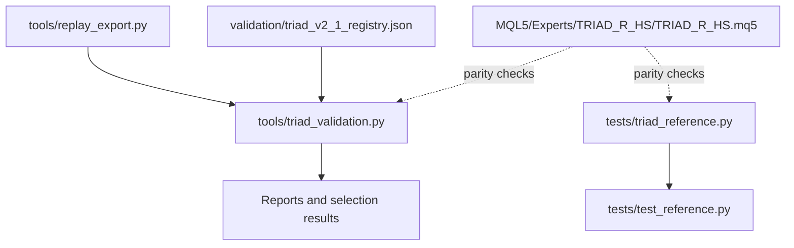

**Diagram sources**
- [triad_reference.py:1-167](file://tests/triad_reference.py#L1-L167)
- [test_reference.py:1-161](file://tests/test_reference.py#L1-L161)
- [triad_validation.py:1-800](file://tools/triad_validation.py#L1-L800)
- [replay_export.py:1-200](file://tools/replay_export.py#L1-L200)
- [triad_v2_1_registry.json:1-800](file://validation/triad_v2_1_registry.json#L1-L800)
- [TRIAD_R_HS.mq5:1-200](file://MQL5/Experts/TRIAD_R_HS/TRIAD_R_HS.mq5#L1-L200)

**Section sources**
- [triad_reference.py:1-167](file://tests/triad_reference.py#L1-L167)
- [test_reference.py:1-161](file://tests/test_reference.py#L1-L161)
- [triad_validation.py:1-800](file://tools/triad_validation.py#L1-L800)
- [replay_export.py:1-200](file://tools/replay_export.py#L1-L200)
- [triad_v2_1_registry.json:1-800](file://validation/triad_v2_1_registry.json#L1-L800)
- [TRIAD_R_HS.mq5:1-200](file://MQL5/Experts/TRIAD_R_HS/TRIAD_R_HS.mq5#L1-L200)

## Core Components
- Profile management: Paired risk/target profiles A–D define risk fraction and target R. Cash risk and nominal winner are derived from initial balance and profile.
- Drawdown tiers: Risk fraction halves above a threshold; at a higher threshold the strategy shuts down.
- Daily state transitions: Based on completed trade nets, the next day may be ready, eligible only for a second trade, or locked.
- Profitable day calculation: Uses the lower of midnight balance/equity minus previous day balance.
- Firm floors and reserves: Overall floor and daily floor computed from phase initial and rollover values; reserve is the greater of percent-based reserve and twice slippage reserve.
- Volume rounding: Downward rounding to symbol step within min/max constraints.
- Phase targets and locking: Targets per phase; completion requires dashboard-confirmed days.
- Session timing: London and New York session bounds in UTC with DST handling; server time offset conversion.
- Halt latch signature: Deterministic checksum over persisted emergency-halt payload.

These components are implemented in pure Python and validated by unit tests. They provide the oracle against which the EA’s behavior is verified.

**Section sources**
- [triad_reference.py:16-167](file://tests/triad_reference.py#L16-L167)
- [test_reference.py:27-157](file://tests/test_reference.py#L27-L157)

## Architecture Overview
The reference architecture ensures parity between the MQL5 EA and Python validation tooling through three layers:

1. Reference math layer: Pure-Python functions implement the canonical arithmetic and state transitions.
2. Replay export layer: Converts observed events into the validator’s CSV schema using the same per-config arithmetic as the EA.
3. Validation layer: Applies a frozen registry of configurations, conservative fill policy, metric computation, selection rules, and phase simulations.

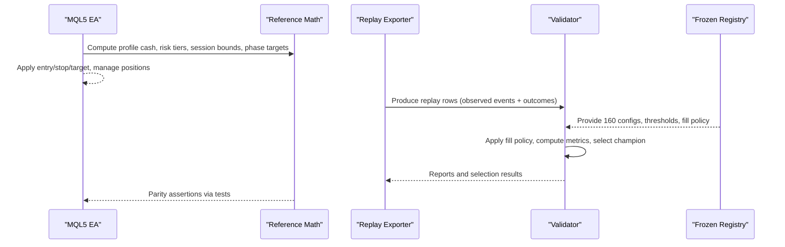

**Diagram sources**
- [triad_reference.py:16-167](file://tests/triad_reference.py#L16-L167)
- [replay_export.py:1-200](file://tools/replay_export.py#L1-L200)
- [triad_validation.py:1-800](file://tools/triad_validation.py#L1-L800)
- [triad_v2_1_registry.json:1-800](file://validation/triad_v2_1_registry.json#L1-L800)
- [TRIAD_R_HS.mq5:1-200](file://MQL5/Experts/TRIAD_R_HS/TRIAD_R_HS.mq5#L1-L200)

## Detailed Component Analysis

### Profile Management and Risk Calculations
- Profiles A–D define paired risk fractions and target R values. Cash risk equals initial balance times risk fraction; nominal winner equals cash risk times target R.
- Active risk fraction halves when drawdown exceeds a threshold; at a higher threshold, the strategy shuts down.
- Tests assert these behaviors for multiple profiles and boundary conditions.

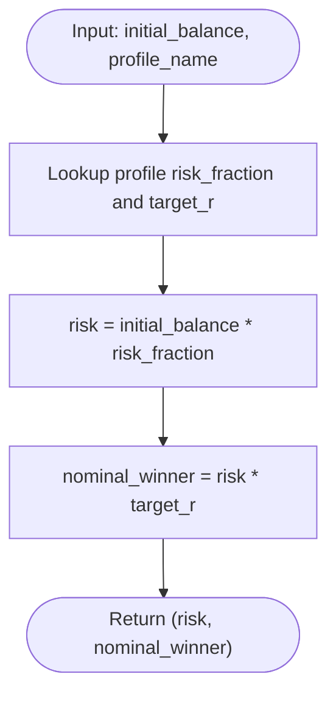

**Diagram sources**
- [triad_reference.py:22-65](file://tests/triad_reference.py#L22-L65)

**Section sources**
- [triad_reference.py:22-65](file://tests/triad_reference.py#L22-L65)
- [test_reference.py:27-54](file://tests/test_reference.py#L27-L54)

### Daily State Transitions and Profitable Day Logic
- Next-day state depends on completed trade nets: zero or negative first net allows second trade eligibility; any positive first net locks the day.
- Profitable day result uses the minimum of midnight balance and equity minus previous day balance.

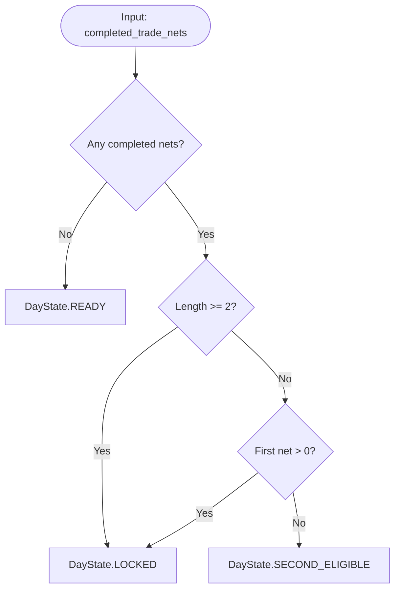

**Diagram sources**
- [triad_reference.py:78-88](file://tests/triad_reference.py#L78-L88)

**Section sources**
- [triad_reference.py:78-88](file://tests/triad_reference.py#L78-L88)
- [test_reference.py:85-99](file://tests/test_reference.py#L85-L99)

### Firm Floors and Reserves
- Overall floor is 90% of phase initial; daily floor is 95% of max(rollover_balance, rollover_equity); combined floor is the maximum of overall and daily.
- Reserve is the greater of percent-based reserve and twice the one-trade slippage reserve.

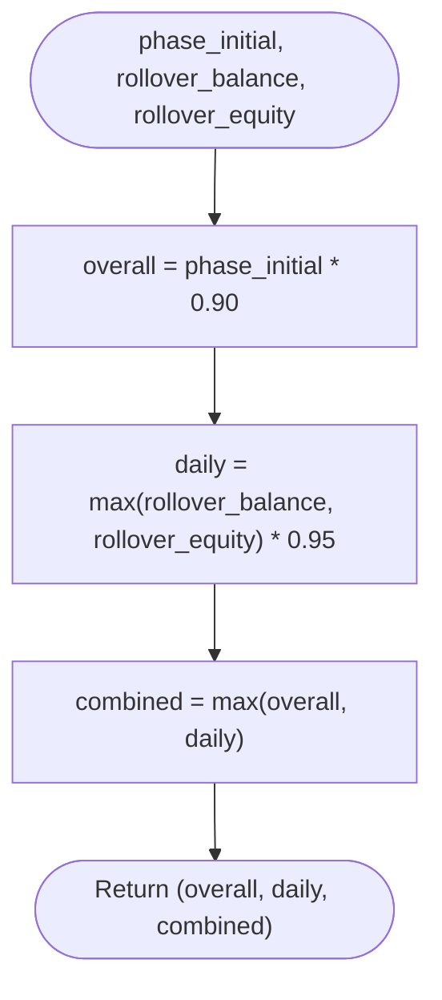

**Diagram sources**
- [triad_reference.py:91-95](file://tests/triad_reference.py#L91-L95)

**Section sources**
- [triad_reference.py:91-103](file://tests/triad_reference.py#L91-L103)
- [test_reference.py:107-121](file://tests/test_reference.py#L107-L121)

### Volume Rounding
- Rounds down to symbol step within min/max constraints; returns None if invalid inputs or raw below minimum.

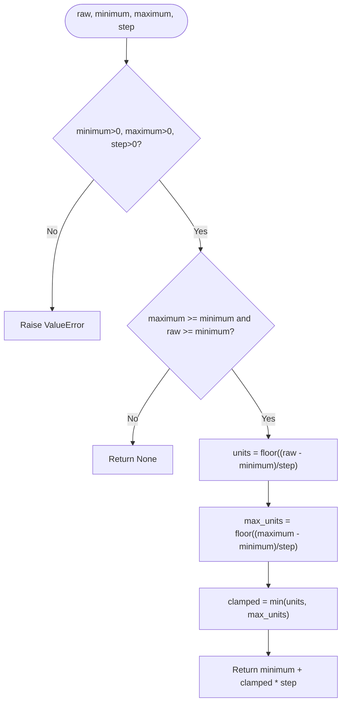

**Diagram sources**
- [triad_reference.py:106-114](file://tests/triad_reference.py#L106-L114)

**Section sources**
- [triad_reference.py:106-114](file://tests/triad_reference.py#L106-L114)
- [test_reference.py:122-128](file://tests/test_reference.py#L122-L128)

### Phase Targets and Locking
- Phase targets depend on phase number relative to initial balance; completion requires dashboard-confirmed days threshold.
- Returns tuple indicating whether phase is complete and whether target pending days remain.

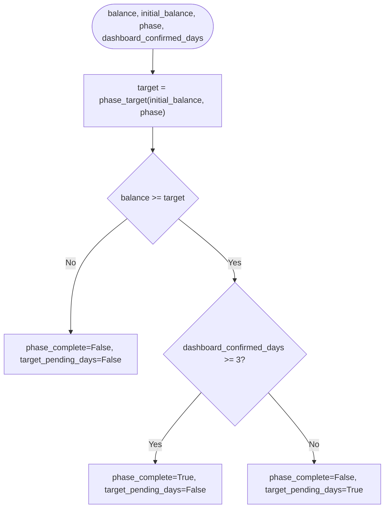

**Diagram sources**
- [triad_reference.py:117-131](file://tests/triad_reference.py#L117-L131)

**Section sources**
- [triad_reference.py:117-131](file://tests/triad_reference.py#L117-L131)
- [test_reference.py:100-105](file://tests/test_reference.py#L100-L105)

### Session Timing and Server Time Conversion
- Computes London and New York session bounds in UTC, handling DST differences between regions.
- Converts UTC datetimes to server time with a fixed offset.

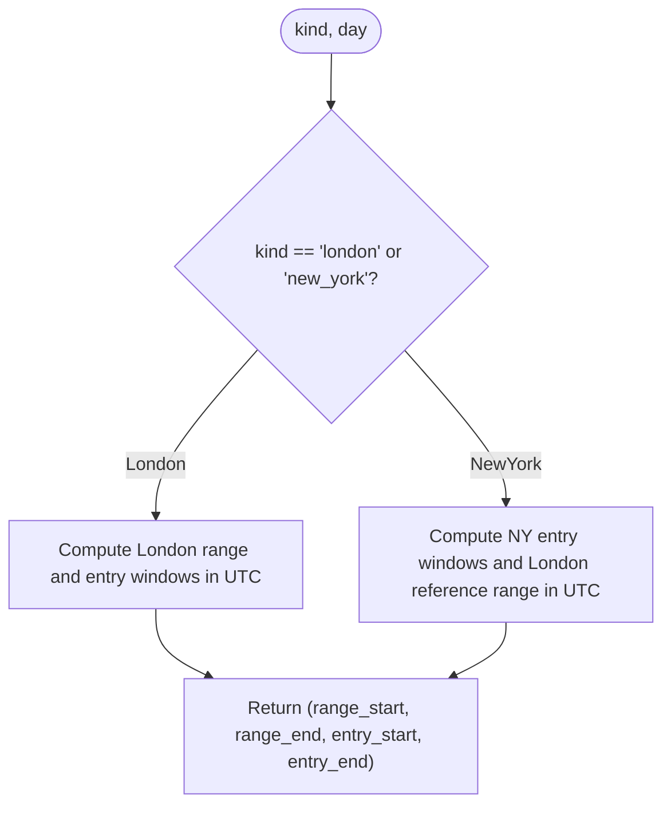

**Diagram sources**
- [triad_reference.py:139-158](file://tests/triad_reference.py#L139-L158)

**Section sources**
- [triad_reference.py:134-167](file://tests/triad_reference.py#L134-L167)
- [test_reference.py:131-157](file://tests/test_reference.py#L131-L157)

### Halt Latch Signature
- Produces a deterministic checksum over a persisted emergency-halt payload bound to configuration and identity hashes.
- Validates binary halt value and reason hash ranges; raises errors for invalid states.

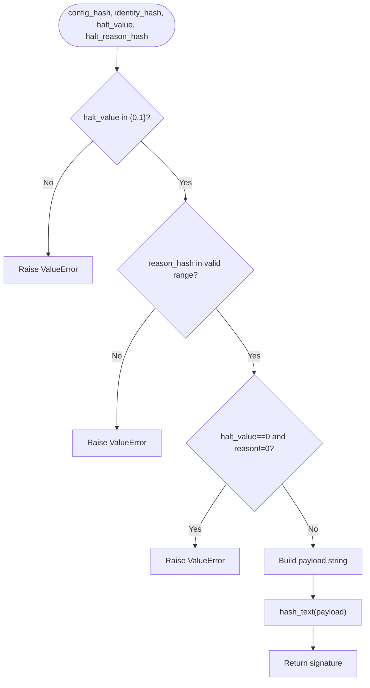

**Diagram sources**
- [triad_reference.py:36-58](file://tests/triad_reference.py#L36-L58)

**Section sources**
- [triad_reference.py:36-58](file://tests/triad_reference.py#L36-L58)
- [test_reference.py:56-83](file://tests/test_reference.py#L56-L83)

### Validation Tooling and Champion Selection
- The validator loads a frozen registry of 160 configurations, validates replay coverage, applies a conservative fill policy, computes metrics, independently gates combinations, and selects a champion based on joint two-phase pass probability and other criteria.
- It supports stressed scenarios, bootstrap intervals, and firm-floor checks aligned with specification requirements.

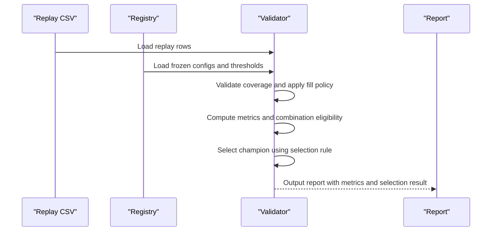

**Diagram sources**
- [triad_validation.py:1-800](file://tools/triad_validation.py#L1-L800)
- [triad_v2_1_registry.json:1-800](file://validation/triad_v2_1_registry.json#L1-L800)

**Section sources**
- [triad_validation.py:1-800](file://tools/triad_validation.py#L1-L800)
- [triad_v2_1_registry.json:1-800](file://validation/triad_v2_1_registry.json#L1-L800)

### Replay Exporter
- Converts observed events into the validator’s CSV schema using the same per-config arithmetic as the EA.
- Enforces strict contracts for event fields, exit reasons, costs, and fill observations.

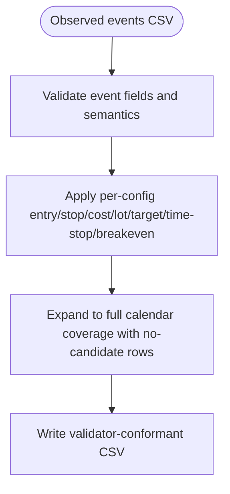

**Diagram sources**
- [replay_export.py:1-200](file://tools/replay_export.py#L1-L200)

**Section sources**
- [replay_export.py:1-200](file://tools/replay_export.py#L1-L200)

## Dependency Analysis
- triad_reference.py has no external dependencies beyond Python standard library; it defines pure functions and dataclasses.
- test_reference.py imports triad_reference.py to assert behavior.
- triad_validation.py depends on the frozen registry JSON and implements selection and simulation logic.
- replay_export.py depends on triad_validation.py types and constants to produce compatible CSV outputs.
- The MQL5 EA serves as the production implementation; the reference and validation tooling ensure parity without calling MQL5.

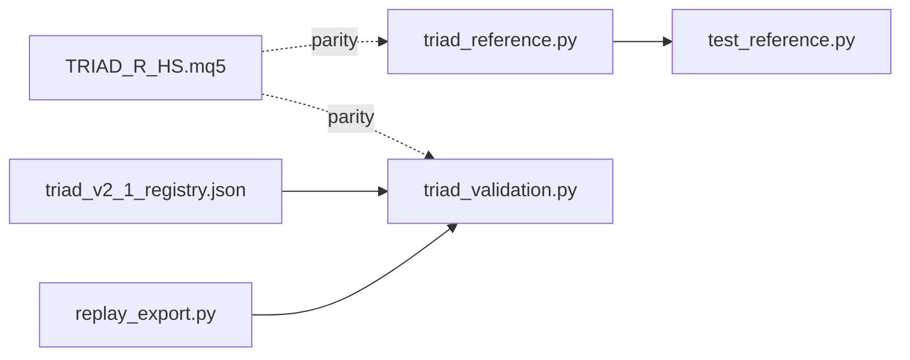

**Diagram sources**
- [triad_reference.py:1-167](file://tests/triad_reference.py#L1-L167)
- [test_reference.py:1-161](file://tests/test_reference.py#L1-L161)
- [triad_validation.py:1-800](file://tools/triad_validation.py#L1-L800)
- [replay_export.py:1-200](file://tools/replay_export.py#L1-L200)
- [triad_v2_1_registry.json:1-800](file://validation/triad_v2_1_registry.json#L1-L800)
- [TRIAD_R_HS.mq5:1-200](file://MQL5/Experts/TRIAD_R_HS/TRIAD_R_HS.mq5#L1-L200)

**Section sources**
- [triad_reference.py:1-167](file://tests/triad_reference.py#L1-L167)
- [test_reference.py:1-161](file://tests/test_reference.py#L1-L161)
- [triad_validation.py:1-800](file://tools/triad_validation.py#L1-L800)
- [replay_export.py:1-200](file://tools/replay_export.py#L1-L200)
- [triad_v2_1_registry.json:1-800](file://validation/triad_v2_1_registry.json#L1-L800)
- [TRIAD_R_HS.mq5:1-200](file://MQL5/Experts/TRIAD_R_HS/TRIAD_R_HS.mq5#L1-L200)

## Performance Considerations
- The reference math is O(1) per function call and suitable for unit tests and small-scale validations.
- The validator processes replay CSVs efficiently but may be resource-intensive for large datasets due to bootstrap sampling and path simulations.
- Use batch processing and avoid unnecessary recomputation when integrating with larger pipelines.

[No sources needed since this section provides general guidance]

## Troubleshooting Guide
Common issues and resolutions:
- Invalid profile or drawdown thresholds: Ensure drawdown_percent is within supported ranges; shutdown occurs at the specified threshold.
- Session bounds mismatches: Verify timezone handling and DST transitions; use session_bounds_utc for consistent UTC boundaries.
- Volume rounding errors: Confirm symbol properties (min, max, step) are valid; rounding always goes down.
- Registry mismatch: If the registry file is modified, the validator will reject it due to hash mismatch; regenerate using the provided tooling.
- Replay CSV schema errors: Ensure all required fields are present and correctly typed; missing or malformed fields cause validation failures.

**Section sources**
- [triad_reference.py:68-75](file://tests/triad_reference.py#L68-L75)
- [triad_reference.py:139-167](file://tests/triad_reference.py#L139-L167)
- [triad_reference.py:106-114](file://tests/triad_reference.py#L106-L114)
- [triad_validation.py:317-331](file://tools/triad_validation.py#L317-L331)
- [triad_validation.py:360-437](file://tools/triad_validation.py#L360-L437)

## Conclusion
The independent reference implementation provides a robust foundation for verifying the TRIAD-R system’s mathematical and business logic. By isolating core calculations in pure Python and validating them through comprehensive tests, it ensures parity with the MQL5 EA while enabling offline analysis and champion selection. The frozen registry and validator tooling enforce consistency across configurations and replay data, supporting rigorous evaluation and extension of the strategy.

[No sources needed since this section summarizes without analyzing specific files]

## Appendices

### API Usage Examples
- Profile cash calculation: Use profile_cash with initial balance and profile name to derive risk and nominal winner.
- Active risk fraction: Call active_risk_fraction with profile name and drawdown percentage to determine current risk tier or shutdown.
- Session bounds: Use session_bounds_utc for London or New York sessions to obtain UTC start/end and entry windows.
- Volume rounding: Apply round_volume_down with symbol properties to compute executable lot sizes.
- Phase targets: Compute phase_target and phase_locked to evaluate phase completion and pending days.

**Section sources**
- [triad_reference.py:61-131](file://tests/triad_reference.py#L61-L131)
- [test_reference.py:27-105](file://tests/test_reference.py#L27-L105)

### Extending the Reference Library
- Add new profiles: Extend PROFILES with additional risk/target pairs and update tests accordingly.
- Implement new session types: Add session_bounds_utc cases for additional markets or time zones.
- Introduce new business rules: Create functions for new state transitions or risk calculations and validate with unit tests.
- Update validator: Modify triad_validation.py to incorporate new thresholds or selection criteria, ensuring registry updates maintain integrity.

**Section sources**
- [triad_reference.py:22-27](file://tests/triad_reference.py#L22-L27)
- [triad_reference.py:139-158](file://tests/triad_reference.py#L139-L158)
- [triad_validation.py:278-305](file://tools/triad_validation.py#L278-L305)