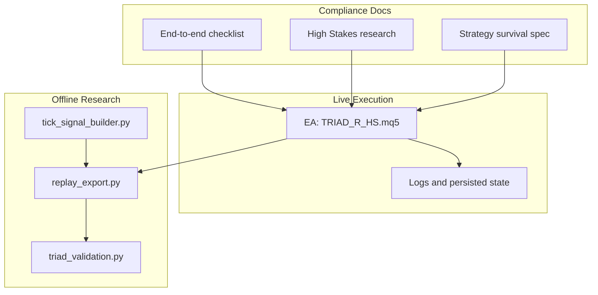
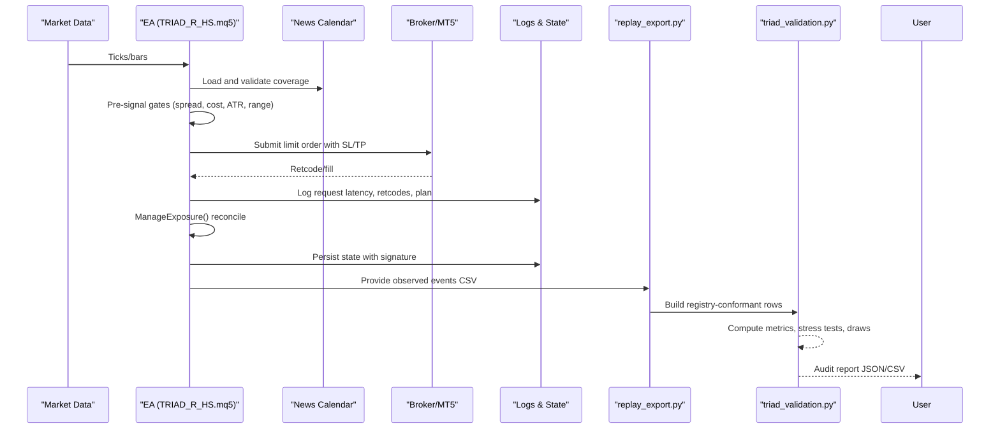
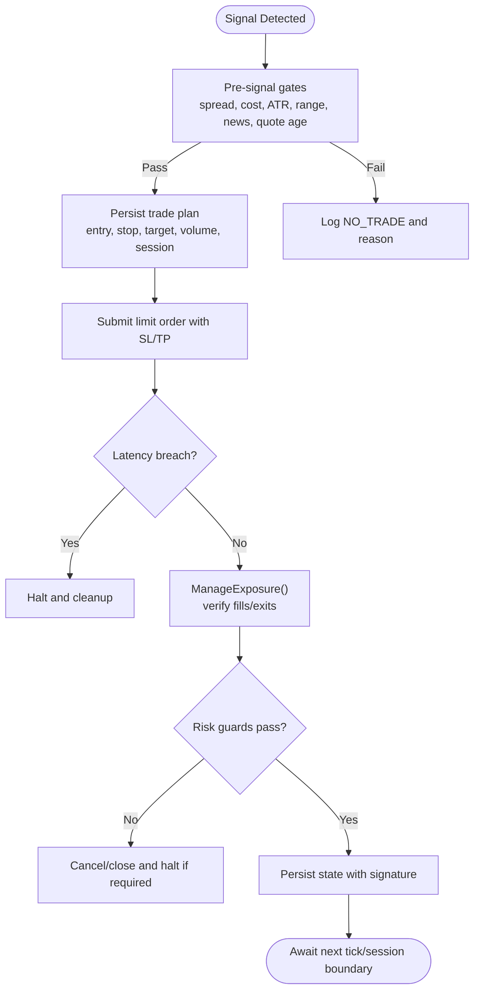
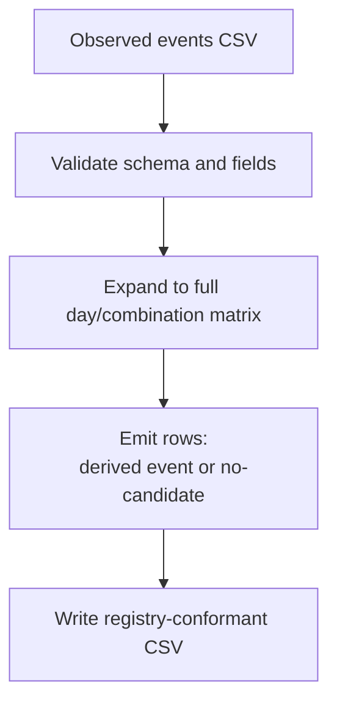
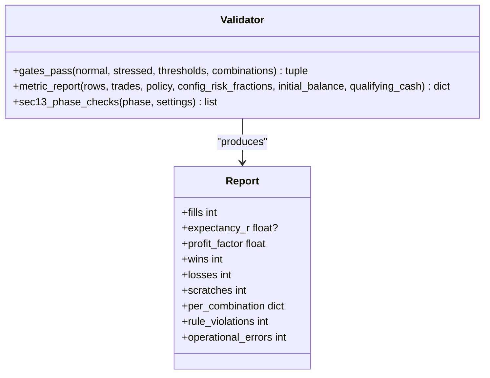
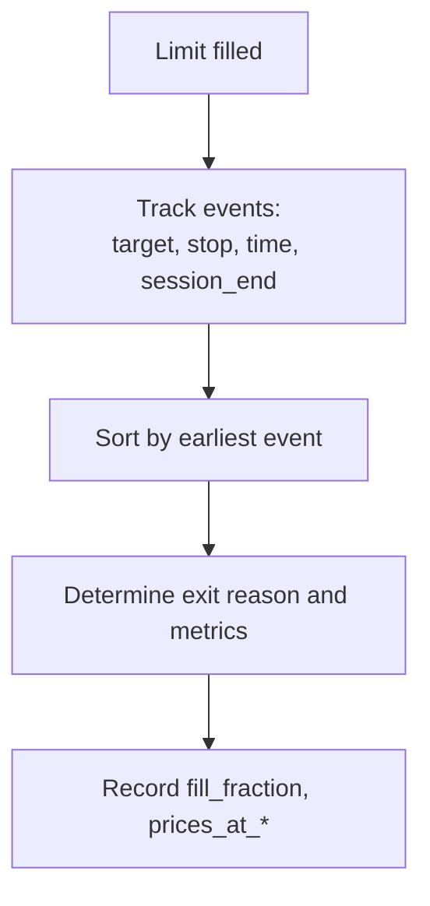

# Audit Trail and Documentation Standards

<cite>
**Referenced Files in This Document**
- [TRIAD_R_HS.mq5](file://MQL5/Experts/TRIAD_R_HS/TRIAD_R_HS.mq5)
- [README.md](file://MQL5/Experts/TRIAD_R_HS/README.md)
- [triad_validation.py](file://tools/triad_validation.py)
- [replay_export.py](file://tools/replay_export.py)
- [tick_signal_builder.py](file://tools/tick_signal_builder.py)
- [THE5ERS-END-TO-END-PRECODE-CHECKLIST.md](file://THE5ERS-END-TO-END-PRECODE-CHECKLIST.md)
- [THE5ERS-HIGH-STAKES-RESEARCH.md](file://THE5ERS-HIGH-STAKES-RESEARCH.md)
- [TRIAD-SURVIVE.md](file://TRIAD-SURVIVE.md)
- [TRIAD_R_HS-CODE-REVIEW.md](file://TRIAD_R_HS-CODE-REVIEW.md)
</cite>

## Table of Contents
1. Introduction
2. Project Structure
3. Core Components
4. Architecture Overview
5. Detailed Component Analysis
6. Dependency Analysis
7. Performance Considerations
8. Troubleshooting Guide
9. Conclusion
10. Appendices

## Introduction
This document defines the audit trail generation and compliance documentation standards for The5ers-related trading operations in this repository. It explains how all trading decisions, market data inputs, risk calculations, and rule enforcement actions are captured, retained, and made accessible for audits and regulatory inquiries. It also sets documentation standards for strategy development, parameter changes, and operational procedures, with examples of audit reports, compliance certificates, and regulatory submissions. Finally, it provides guidance on maintaining audit-ready records and responding to requests.

## Project Structure
The audit system spans three layers:
- Live execution layer (MQL5 EA): captures runtime events, enforces rules, persists state, and writes structured logs.
- Offline research/validation layer (Python tools): exports replay rows, validates signals, computes metrics, and produces audit-grade reports.
- Compliance documentation: formalizes lifecycle gates, rules, and operating procedures that must be followed and audited.

**Diagram sources**
- [TRIAD_R_HS.mq5:1-200](file://MQL5/Experts/TRIAD_R_HS/TRIAD_R_HS.mq5#L1-L200)
- [replay_export.py:961-1027](file://tools/replay_export.py#L961-L1027)
- [triad_validation.py:899-919](file://tools/triad_validation.py#L899-L919)
- [THE5ERS-END-TO-END-PRECODE-CHECKLIST.md:1-120](file://THE5ERS-END-TO-END-PRECODE-CHECKLIST.md#L1-L120)
- [THE5ERS-HIGH-STAKES-RESEARCH.md:100-155](file://THE5ERS-HIGH-STAKES-RESEARCH.md#L100-L155)
- [TRIAD-SURVIVE.md:31-60](file://TRIAD-SURVIVE.md#L31-L60)

**Section sources**
- [TRIAD_R_HS.mq5:1-200](file://MQL5/Experts/TRIAD_R_HS/TRIAD_R_HS.mq5#L1-L200)
- [README.md:15-26](file://MQL5/Experts/TRIAD_R_HS/README.md#L15-L26)
- [replay_export.py:961-1027](file://tools/replay_export.py#L961-L1027)
- [triad_validation.py:899-919](file://tools/triad_validation.py#L899-L919)
- [THE5ERS-END-TO-END-PRECODE-CHECKLIST.md:1-120](file://THE5ERS-END-TO-END-PRECODE-CHECKLIST.md#L1-L120)
- [THE5ERS-HIGH-STAKES-RESEARCH.md:100-155](file://THE5ERS-HIGH-STAKES-RESEARCH.md#L100-L155)
- [TRIAD-SURVIVE.md:31-60](file://TRIAD-SURVIVE.md#L31-L60)

## Core Components
- EA logging and persistence: structured event logging, order submission lifecycle, exposure reconciliation, news calendar validation, rollover protection, and persistent state with signatures.
- Replay export: deterministic expansion of observed events into a registry-conformant day/combination matrix with explicit no-candidate rows.
- Validation engine: aggregate and per-combination metrics, stress testing, phase simulations, drawdown analysis, and Section-13 checklist gating.
- Signal builder: deterministic exit logic and fill/through tracking used by replay pipelines.
- Compliance docs: immutable profile, pre-signal gates, entry sequence, sizing, exits, risk engine, and lifecycle locks.

Key responsibilities:
- Capture every decision point: signal detection, gate checks, order submission, fills, modifications, exits, and errors.
- Preserve context: timestamps, server time, symbol properties, spread/cost assumptions, calendar coverage, and state snapshots.
- Enforce immutability: frozen registries, signed latches, and signature-based state integrity.

**Section sources**
- [TRIAD_R_HS.mq5:2800-2900](file://MQL5/Experts/TRIAD_R_HS/TRIAD_R_HS.mq5#L2800-L2900)
- [TRIAD_R_HS.mq5:2942-3000](file://MQL5/Experts/TRIAD_R_HS/TRIAD_R_HS.mq5#L2942-L3000)
- [replay_export.py:961-1027](file://tools/replay_export.py#L961-L1027)
- [triad_validation.py:899-919](file://tools/triad_validation.py#L899-L919)
- [tick_signal_builder.py:559-587](file://tools/tick_signal_builder.py#L559-L587)
- [THE5ERS-END-TO-END-PRECODE-CHECKLIST.md:121-179](file://THE5ERS-END-TO-END-PRECODE-CHECKLIST.md#L121-L179)
- [THE5ERS-HIGH-STAKES-RESEARCH.md:119-155](file://THE5ERS-HIGH-STAKES-RESEARCH.md#L119-L155)

## Architecture Overview
The audit architecture ensures end-to-end traceability from market data through live execution to offline validation and reporting.

**Diagram sources**
- [TRIAD_R_HS.mq5:2800-2900](file://MQL5/Experts/TRIAD_R_HS/TRIAD_R_HS.mq5#L2800-L2900)
- [TRIAD_R_HS.mq5:2942-3000](file://MQL5/Experts/TRIAD_R_HS/TRIAD_R_HS.mq5#L2942-L3000)
- [replay_export.py:961-1027](file://tools/replay_export.py#L961-L1027)
- [triad_validation.py:899-919](file://tools/triad_validation.py#L899-L919)

## Detailed Component Analysis

### EA Audit Trail and Rule Enforcement
- Event logging: Every major action is logged with level, event name, and detail, including order submission, latency breaches, and audit log failures.
- Order lifecycle: Plan persistence, request submission, latency checks, acceptance handling, and synchronous exposure reconciliation ensure no orphaned orders or positions.
- Exposure management: Guards enforce one-position topology, cancel pending entries under constraints, flatten when required by firm floors or internal limits, and halt on anomalies.
- News calendar: Requires explicit UTC coverage declaration; stale coverage fails closed and prevents new entries.
- Persistence and integrity: Terminal globals store configuration hash, account identity, phase initial balance, daily/weekly floors, high-water balance, request counts, halt/migration latches, and a last-written signature to detect partial updates.

**Diagram sources**
- [TRIAD_R_HS.mq5:2800-2900](file://MQL5/Experts/TRIAD_R_HS/TRIAD_R_HS.mq5#L2800-L2900)
- [TRIAD_R_HS.mq5:2942-3000](file://MQL5/Experts/TRIAD_R_HS/TRIAD_R_HS.mq5#L2942-L3000)
- [TRIAD_R_HS.mq5:587-618](file://MQL5/Experts/TRIAD_R_HS/TRIAD_R_HS.mq5#L587-L618)

**Section sources**
- [TRIAD_R_HS.mq5:2800-2900](file://MQL5/Experts/TRIAD_R_HS/TRIAD_R_HS.mq5#L2800-L2900)
- [TRIAD_R_HS.mq5:2942-3000](file://MQL5/Experts/TRIAD_R_HS/TRIAD_R_HS.mq5#L2942-L3000)
- [TRIAD_R_HS.mq5:587-618](file://MQL5/Experts/TRIAD_R_HS/TRIAD_R_HS.mq5#L587-L618)
- [TRIAD_R_HS.mq5:844-930](file://MQL5/Experts/TRIAD_R_HS/TRIAD_R_HS.mq5#L844-L930)

### Replay Export and Registry-Conformant Rows
- Deterministic expansion: For each configuration, combination, and server day, exactly one row is emitted: either derived from an observed event or an explicit no-candidate row.
- Schema enforcement: Loader validates headers and field types; mismatches fail fast.
- Coverage and splits: Selection and holdout ranges are declared externally; the tool refuses to infer them from data.

**Diagram sources**
- [replay_export.py:961-1027](file://tools/replay_export.py#L961-L1027)
- [replay_export.py:319-333](file://tools/replay_export.py#L319-L333)

**Section sources**
- [replay_export.py:961-1027](file://tools/replay_export.py#L961-L1027)
- [replay_export.py:319-333](file://tools/replay_export.py#L319-L333)

### Validation Engine and Metrics
- Aggregate and per-combination metrics: fills, expectancy R, profit factor, wins/losses/scratches, rule violations, operational errors, touch-without-trade-through, partial-fill observations.
- Gates pass: Validates minimum fills, expectancy, profit factor, and zero violations across normal and stressed scenarios.
- Phase simulation and drawdown: Computes median/p95/p99 maximum drawdowns, joint two-phase pass probabilities, and firm-floor stress checks.

**Diagram sources**
- [triad_validation.py:673-708](file://tools/triad_validation.py#L673-L708)
- [triad_validation.py:899-919](file://tools/triad_validation.py#L899-L919)
- [triad_validation.py:1384-1410](file://tools/triad_validation.py#L1384-L1410)

**Section sources**
- [triad_validation.py:673-708](file://tools/triad_validation.py#L673-L708)
- [triad_validation.py:899-919](file://tools/triad_validation.py#L899-L919)
- [triad_validation.py:1384-1410](file://tools/triad_validation.py#L1384-L1410)

### Signal Builder and Exit Logic
- Deterministic exit selection: Events such as target hit, stop hit, time stop, and session end are ordered by time to determine the first exit.
- Fill and through tracking: Records whether the limit was touched and whether price traded through at least once; fill fraction indicates complete vs partial fills.

**Diagram sources**
- [tick_signal_builder.py:559-587](file://tools/tick_signal_builder.py#L559-L587)

**Section sources**
- [tick_signal_builder.py:559-587](file://tools/tick_signal_builder.py#L559-L587)

### Compliance Documentation Standards
- Immutable profile: One working entry or one open position, no copiers, no grid/martingale, visible stops, news blackout windows, rate-limited requests, consistent risk process across phases.
- Pre-signal gates: Mandatory checks before any signal can proceed; no override scoring.
- Entry sequence: Defined sweep/reclaim steps, limit placement, cancellation conditions, and prohibition of market chase.
- Sizing and exits: Cash-risk calculation using live symbol economics, fixed targets, time stops, session/rollover buffers, and weekend flat rules.
- Risk engine: Paired profiles tested offline; only one selected champion used consistently; drawdown throttle documented.

**Section sources**
- [THE5ERS-END-TO-END-PRECODE-CHECKLIST.md:121-179](file://THE5ERS-END-TO-END-PRECODE-CHECKLIST.md#L121-L179)
- [THE5ERS-END-TO-END-PRECODE-CHECKLIST.md:182-215](file://THE5ERS-END-TO-END-PRECODE-CHECKLIST.md#L182-L215)
- [THE5ERS-HIGH-STAKES-RESEARCH.md:119-155](file://THE5ERS-HIGH-STAKES-RESEARCH.md#L119-L155)
- [TRIAD-SURVIVE.md:31-60](file://TRIAD-SURVIVE.md#L31-L60)

## Dependency Analysis
The audit pipeline depends on strict contracts between components:
- EA to replay exporter: Observed events CSV must conform to schema; loader rejects mismatches.
- Replay exporter to validator: Rows must include both WALK_FORWARD and HOLDOUT splits; validator enforces registry hashes and thresholds.
- Validator to release gates: Reports feed Section-13 checklist and go/no-go decisions.

**Diagram sources**
- [replay_export.py:961-1027](file://tools/replay_export.py#L961-L1027)
- [triad_validation.py:899-919](file://tools/triad_validation.py#L899-L919)

**Section sources**
- [replay_export.py:961-1027](file://tools/replay_export.py#L961-L1027)
- [triad_validation.py:899-919](file://tools/triad_validation.py#L899-L919)

## Performance Considerations
- Logging overhead: Structured logging and frequent state persistence occur around order submission and exposure reconciliation; ensure terminal global writes succeed to avoid halts.
- Request latency: Order request latency is measured and enforced; breaches trigger immediate cleanup and halt to prevent ambiguous exposure.
- Replay scalability: Export expands to full day/combination matrices; ensure sufficient disk space and deterministic ordering for reproducibility.
- Validation compute: Stress tests and bootstrap simulations increase CPU usage; run on dedicated machines and archive intermediate artifacts.

[No sources needed since this section provides general guidance]

## Troubleshooting Guide
Common issues and responses:
- Audit log failure after order submit: EA halts, attempts to delete submitted order, cancels pending entries, closes positions, and refuses further action until resolved.
- Order submission failed: EA halts, reconciles possible order, cancels pending entries, closes positions, and clears trade plan variables.
- News coverage stale: New entries blocked; requires operator refresh and explicit coverage declaration.
- Multiple or overlapping exposure: EA cancels pending entries and closes positions; halts until invariant restored.
- External cashflow or unauthorized history: Sets migration latch; ordinary reset cannot clear; requires reviewed rebaseline release.

Operational recommendations:
- Preserve Experts log and CSV logs with tester and forward evidence.
- Archive compiler output, source/build checksums, and terminal build versions.
- Use one-time authorization flows for fresh phase state and emergency halt resets; never leave authorization flags enabled.

**Section sources**
- [TRIAD_R_HS.mq5:2800-2900](file://MQL5/Experts/TRIAD_R_HS/TRIAD_R_HS.mq5#L2800-L2900)
- [TRIAD_R_HS.mq5:2942-3000](file://MQL5/Experts/TRIAD_R_HS/TRIAD_R_HS.mq5#L2942-L3000)
- [TRIAD_R_HS.mq5:844-930](file://MQL5/Experts/TRIAD_R_HS/TRIAD_R_HS.mq5#L844-L930)
- [TRIAD_R_HS-CODE-REVIEW.md:19-45](file://TRIAD_R_HS-CODE-REVIEW.md#L19-L45)
- [TRIAD_R_HS-CODE-REVIEW.md:78-97](file://TRIAD_R_HS-CODE-REVIEW.md#L78-L97)

## Conclusion
The repository implements a robust, fail-closed audit trail spanning live execution, offline replay/export, and validation/reporting. It enforces immutable profiles, rigorous pre-signal gates, deterministic replay rows, and comprehensive metrics. By preserving signed state, logging every decision, and producing regulator-ready reports, it supports audit readiness, compliance verification, and responsive handling of inquiries.

[No sources needed since this section summarizes without analyzing specific files]

## Appendices

### Audit Trail Format
- Event fields: server_day, sequence, event_id, plus derived fields for candidate activation, limit touch, trade-through ticks, fill fraction, exit reason, prices_at_*, worst_adverse_price, rule_violation, operational_error.
- CSV schema enforced by loader; mismatches fail fast.

**Section sources**
- [triad_validation.py:1858-1876](file://tools/triad_validation.py#L1858-L1876)
- [replay_export.py:319-333](file://tools/replay_export.py#L319-L333)

### Retention Policies
- Keep Experts log and CSV logs indefinitely for the life of the strategy and post-close archival.
- Archive tester outputs, compiler logs, source/build checksums, and validation reports alongside live logs.
- Persist terminal-global state with signatures; do not delete or modify without formal migration processes.

**Section sources**
- [README.md:139-146](file://MQL5/Experts/TRIAD_R_HS/README.md#L139-L146)
- [TRIAD_R_HS.mq5:587-618](file://MQL5/Experts/TRIAD_R_HS/TRIAD_R_HS.mq5#L587-L618)

### Accessibility Requirements
- Logs and reports must be stored in version-controlled directories with clear naming conventions.
- Access controls should restrict modification but allow read access for auditors and regulators.
- Include index files mapping releases to logs, reports, and checksums.

[No sources needed since this section provides general guidance]

### Strategy Development Documentation Standards
- Freeze registries and parameters; any change breaks hashes and must be revalidated.
- Document selection rationale, splits, thresholds, and decision rules prior to data generation.
- Maintain changelogs linking commits to validated releases and reports.

**Section sources**
- [README.md:147-226](file://MQL5/Experts/TRIAD_R_HS/README.md#L147-L226)
- [triad_validation.py:899-919](file://tools/triad_validation.py#L899-L919)

### Operational Procedures
- Follow the end-to-end checklist for initialization, start-of-day, pre-signal gates, entry, sizing, open-position management, daily/weekly processes, profitable-day accounting, drawdown guards, phase transitions, payout/scale lifecycle, and failure recovery.
- Treat each funded or scaled account as a new configuration event; re-read balances, floors, and rules.

**Section sources**
- [THE5ERS-END-TO-END-PRECODE-CHECKLIST.md:78-118](file://THE5ERS-END-TO-END-PRECODE-CHECKLIST.md#L78-L118)
- [THE5ERS-END-TO-END-PRECODE-CHECKLIST.md:218-274](file://THE5ERS-END-TO-END-PRECODE-CHECKLIST.md#L218-L274)
- [THE5ERS-END-TO-END-PRECODE-CHECKLIST.md:278-338](file://THE5ERS-END-TO-END-PRECODE-CHECKLIST.md#L278-L338)

### Examples of Audit Reports, Compliance Certificates, and Regulatory Submissions
- Audit report: triad_validation.py produces a JSON/CSV report containing aggregate and per-combination metrics, stress outcomes, drawdown percentiles, and Section-13 checklist verdicts.
- Compliance certificate: Operator attestation tied to release ID, source/build checksum, compiler output, and validated reports confirming zero violations and passed gates.
- Regulatory submission: Package includes EA source, compiled EX5 hash, configuration hash, news CSV with coverage declaration, observed events CSV, replay rows, validation report, and archived logs.

**Section sources**
- [triad_validation.py:673-708](file://tools/triad_validation.py#L673-L708)
- [triad_validation.py:1384-1410](file://tools/triad_validation.py#L1384-L1410)
- [README.md:147-226](file://MQL5/Experts/TRIAD_R_HS/README.md#L147-L226)

### Guidance for Maintaining Audit-Ready Documentation
- Keep order submission disabled until all gates pass; use dry mode for research.
- Archive every release with immutable identifiers and checksums.
- Refresh news CSV proactively; validate coverage declarations.
- Run forward-demo fills and reconcile fills, commissions, swaps, stops, targets, request counts, and dashboard days.

**Section sources**
- [README.md:15-26](file://MQL5/Experts/TRIAD_R_HS/README.md#L15-L26)
- [README.md:118-146](file://MQL5/Experts/TRIAD_R_HS/README.md#L118-L146)
- [TRIAD_R_HS-CODE-REVIEW.md:123-141](file://TRIAD_R_HS-CODE-REVIEW.md#L123-L141)

### Responding to Audit Requests or Regulatory Inquiries
- Provide the exact release package: source, compiled artifact, configuration hash, news CSV, observed events, replay rows, validation report, and logs.
- Explain any incidents with timestamps, error codes, and remediation steps; highlight migration latches and rebaseline requirements where applicable.
- Demonstrate compliance with immutable profile, pre-signal gates, one-position topology, visible stops, and news blackout rules.

**Section sources**
- [TRIAD_R_HS.mq5:587-618](file://MQL5/Experts/TRIAD_R_HS/TRIAD_R_HS.mq5#L587-L618)
- [TRIAD_R_HS.mq5:2800-2900](file://MQL5/Experts/TRIAD_R_HS/TRIAD_R_HS.mq5#L2800-L2900)
- [TRIAD_R_HS-CODE-REVIEW.md:19-45](file://TRIAD_R_HS-CODE-REVIEW.md#L19-L45)