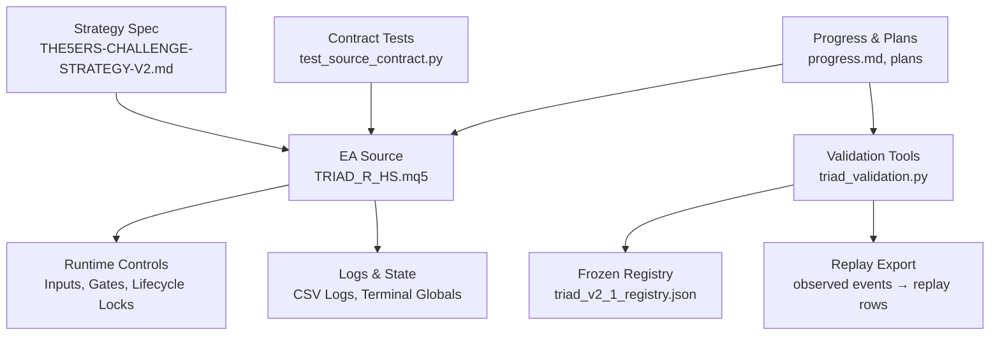
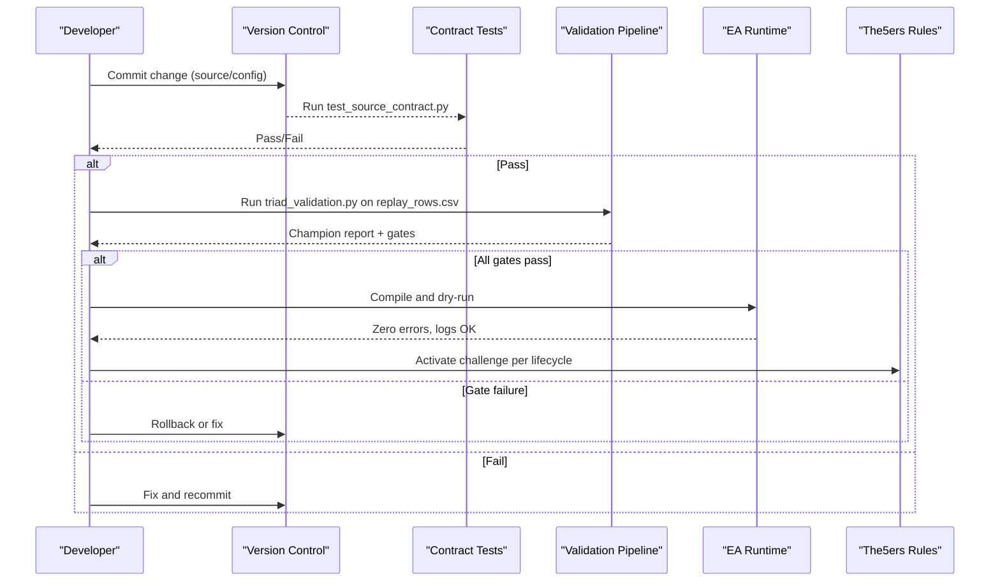
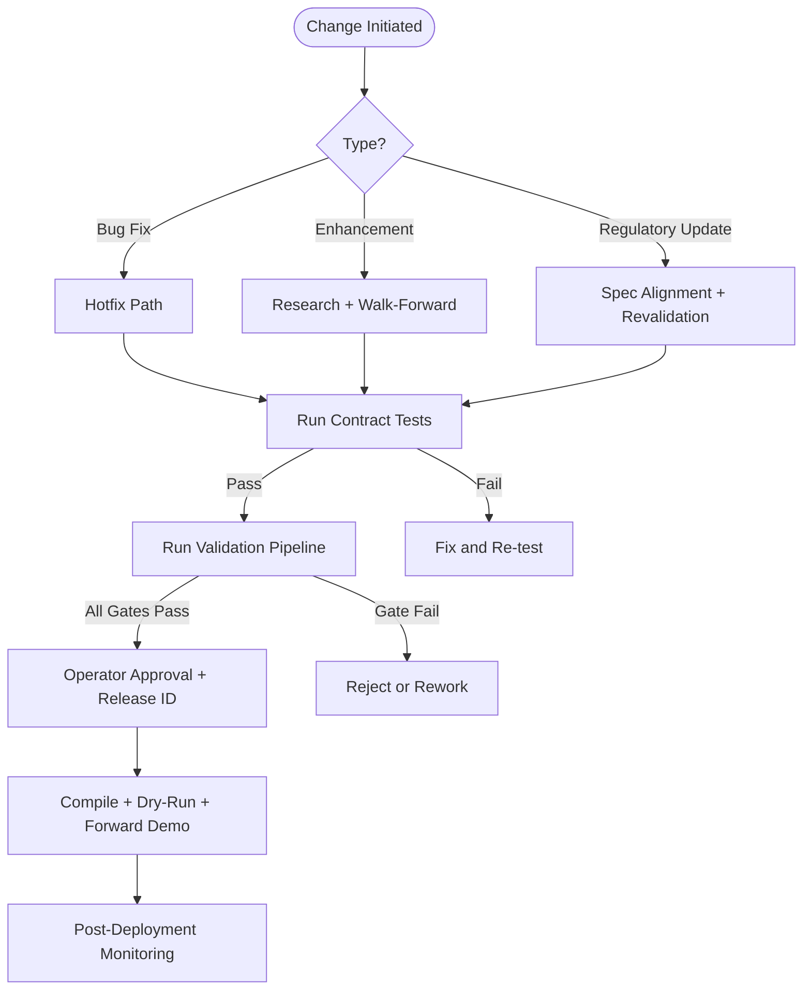
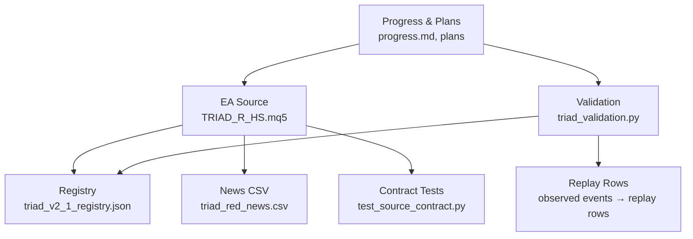

# Change Management and Version Control

<cite>
**Referenced Files in This Document**
- [THE5ERS-CHALLENGE-STRATEGY-V2.md](file://THE5ERS-CHALLENGE-STRATEGY-V2.md)
- [TRIAD_R_HS.mq5](file://MQL5/Experts/TRIAD_R_HS/TRIAD_R_HS.mq5)
- [README.md](file://MQL5/Experts/TRIAD_R_HS/README.md)
- [triad_v2_1_registry.json](file://validation/triad_v2_1_registry.json)
- [test_source_contract.py](file://tests/test_source_contract.py)
- [triad_validation.py](file://tools/triad_validation.py)
- [progress.md](file://progress.md)
- [prop-fund-challenge-improvement-plan.md](file://prop-fund-challenge-improvement-plan.md)
- [strategy-improvements-plan.md](file://strategy-improvements-plan.md)
- [THE5ERS-END-TO-END-PRECODE-CHECKLIST.md](file://THE5ERS-END-TO-END-PRECODE-CHECKLIST.md)
</cite>

## Table of Contents
1. Introduction
2. Project Structure
3. Core Components
4. Architecture Overview
5. Detailed Component Analysis
6. Dependency Analysis
7. Performance Considerations
8. Troubleshooting Guide
9. Conclusion
10. Appendices

## Introduction
This document defines the change management and version control procedures required to maintain compliance with The5ers regulations for the TRIAD-R High Stakes strategy. It formalizes how changes are requested, assessed, approved, versioned, tested, deployed, and audited. It also documents rollback procedures, pre-deployment testing requirements, and validation processes that ensure ongoing regulatory compliance during updates.

The repository implements a fail-closed MQL5 Expert Advisor (EA) with strict pre-signal gates, one-position enforcement, explicit news blackout windows, drawdown throttling, and a comprehensive offline validation pipeline. All changes must preserve these guardrails and pass through documented gates before any live activation.

## Project Structure
The project is organized around four layers:
- Strategy specification and lifecycle rules: canonical strategy document and end-to-end checklists define immutable constraints and phase transitions.
- EA implementation: MQL5 source with inputs, enums, state machines, and safety controls.
- Validation and research tools: Python-based replay export, champion selection, ablation studies, and contract tests.
- Configuration registries and data: frozen configuration matrices, history data, and artifacts produced by the pipeline.

**Diagram sources**
- [THE5ERS-CHALLENGE-STRATEGY-V2.md:1-120](file://THE5ERS-CHALLENGE-STRATEGY-V2.md#L1-L120)
- [TRIAD_R_HS.mq5:1-150](file://MQL5/Experts/TRIAD_R_HS/TRIAD_R_HS.mq5#L1-L150)
- [triad_v2_1_registry.json:1-120](file://validation/triad_v2_1_registry.json#L1-L120)
- [triad_validation.py:1-120](file://tools/triad_validation.py#L1-L120)
- [test_source_contract.py:1-120](file://tests/test_source_contract.py#L1-L120)

**Section sources**
- [THE5ERS-CHALLENGE-STRATEGY-V2.md:1-120](file://THE5ERS-CHALLENGE-STRATEGY-V2.md#L1-L120)
- [README.md:15-145](file://MQL5/Experts/TRIAD_R_HS/README.md#L15-L145)
- [triad_v2_1_registry.json:1-120](file://validation/triad_v2_1_registry.json#L1-L120)
- [triad_validation.py:1-120](file://tools/triad_validation.py#L1-L120)
- [test_source_contract.py:1-120](file://tests/test_source_contract.py#L1-L120)

## Core Components
- Immutable profile and gates: One working entry or one open position, no grid/martingale, visible stops, news blackout, daily trade limits, volume rounding down, and rate-limited requests. These cannot be optimized away at runtime.
- Entry sequence: Sweep/reclaim/displacement logic with strict geometry, limit order placement, stop/target attachment, and cancellation policy.
- Risk engine: Paired risk/target profiles, drawdown throttle tiers, internal daily/weekly stops, and firm-floor protection.
- Daily operating state machine: First net-positive locks day; second trade allowed only if safe; two-trade lock; calendar resets.
- Product lifecycle: Phase 1 → Phase 2 → Funded transitions with fresh handshakes, new floors/counters, and unchanged strategy through first payout.
- Validation pipeline: Frozen registry, walk-forward selection, holdout evaluation, stress scenarios, bootstrap simulations, and forward-demo acceptance.

**Section sources**
- [THE5ERS-CHALLENGE-STRATEGY-V2.md:32-183](file://THE5ERS-CHALLENGE-STRATEGY-V2.md#L32-L183)
- [THE5ERS-CHALLENGE-STRATEGY-V2.md:185-382](file://THE5ERS-CHALLENGE-STRATEGY-V2.md#L185-L382)
- [THE5ERS-CHALLENGE-STRATEGY-V2.md:384-438](file://THE5ERS-CHALLENGE-STRATEGY-V2.md#L384-L438)

## Architecture Overview
Change management is enforced through layered controls:
- Specification layer: Canonical rules define what may not change and how phases transition.
- Implementation layer: EA enforces gates, sizing, exits, and lifecycle locks at runtime.
- Validation layer: Offline tools validate against frozen registries and historical data, then approve a single champion configuration.
- Contract layer: Static tests assert compliance with immutable behaviors and default gate states.

**Diagram sources**
- [test_source_contract.py:44-107](file://tests/test_source_contract.py#L44-L107)
- [triad_validation.py:148-181](file://tools/triad_validation.py#L148-L181)
- [README.md:147-196](file://MQL5/Experts/TRIAD_R_HS/README.md#L147-L196)
- [THE5ERS-CHALLENGE-STRATEGY-V2.md:384-438](file://THE5ERS-CHALLENGE-STRATEGY-V2.md#L384-L438)

## Detailed Component Analysis

### Formal Change Request Process
- Purpose: Ensure every modification preserves compliance, maintains auditability, and passes all validation gates before deployment.
- Scope: EA source code, input parameters, configuration registries, validation tool behavior, and operational files (news CSV).
- Trigger types:
  - Bug fixes: Immediate hotfix path with accelerated testing and post-release audit.
  - Enhancements: Research-driven changes requiring walk-forward selection and holdout confirmation.
  - Regulatory updates: Changes driven by updated The5ers terms require immediate spec alignment and revalidation.

Required artifacts:
- Change request form capturing:
  - Change ID, author, date, scope, rationale, risk assessment, affected components, rollback plan, and approval sign-off.
- Impact assessment:
  - Compliance impact (gates, daily limits, news blackout, product lifecycle).
  - Technical impact (entry geometry, risk engine, exits, persistence).
  - Data impact (registry, splits, replay schema).
  - Operational impact (logs, alerts, monitoring).
- Approval workflow:
  - Developer self-review against contract tests.
  - Peer review of spec alignment and validation results.
  - Operator approval for release gating inputs and release ID.

Templates (examples):
- Change Request Form: fields include Change ID, Title, Author, Date, Type, Description, Affected Files, Risk Level, Compliance Impact, Testing Plan, Rollback Plan, Approver(s), Status.
- Compliance Impact Assessment: sections for Rule Mapping, Gate Effects, Sizing/Exposure, News/Session Boundaries, Phase/Lifecycle Effects, Stress Scenarios, Evidence Required.
- Approval Form: sections for Reviewer, Findings, Conditions, Sign-off, Release ID, Post-Deployment Monitoring.

**Section sources**
- [THE5ERS-CHALLENGE-STRATEGY-V2.md:32-183](file://THE5ERS-CHALLENGE-STRATEGY-V2.md#L32-L183)
- [README.md:53-117](file://MQL5/Experts/TRIAD_R_HS/README.md#L53-L117)
- [triad_validation.py:148-181](file://tools/triad_validation.py#L148-L181)

### Version Control System for Configurations, Parameters, and Code
- Source code:
  - Single EA file with clearly labeled inputs, enums, and lifecycle locks. Build ID embedded for traceability.
  - Default state disables order submission and all release gates; explicit user approval required to enable.
- Configuration registry:
  - Frozen matrix of 160 configurations covering range bands, ATR bands, time stops, paired profiles, and breakeven policies.
  - Registry includes commit metadata; any mutation invalidates validation runs.
- Validation pipeline:
  - Replay export requires explicit split boundaries; no inference from data.
  - Selection uses walk-forward only; holdout evaluated after champion locked.
  - Reports include per-combination and portfolio gates, confidence bounds, and stress outcomes.
- Contract tests:
  - Assert defaults, forbidden behaviors, sizing methods, state persistence, and lifecycle guards.

**Diagram sources**
- [triad_v2_1_registry.json:1-120](file://validation/triad_v2_1_registry.json#L1-L120)
- [triad_validation.py:148-181](file://tools/triad_validation.py#L148-L181)
- [test_source_contract.py:44-107](file://tests/test_source_contract.py#L44-L107)
- [README.md:147-196](file://MQL5/Experts/TRIAD_R_HS/README.md#L147-L196)

**Section sources**
- [triad_v2_1_registry.json:1-120](file://validation/triad_v2_1_registry.json#L1-L120)
- [triad_validation.py:148-181](file://tools/triad_validation.py#L148-L181)
- [test_source_contract.py:44-107](file://tests/test_source_contract.py#L44-L107)
- [README.md:147-196](file://MQL5/Experts/TRIAD_R_HS/README.md#L147-L196)

### Impact Assessment Procedures
- Compliance mapping:
  - Verify each change against immutable profile: one-position rule, no grid/martingale, visible stops, news blackout, daily trade limits, volume rounding, rate limiting.
- Technical impact:
  - Entry geometry changes require revalidation of sweep/reclaim/displacement thresholds and stop distance ranges.
  - Risk engine changes must preserve paired profiles and drawdown throttle tiers.
  - Exit engine changes must retain session/rollover/news flat rules and weekend closure.
- Data impact:
  - Any registry mutation invalidates prior validation; splits must remain explicit.
  - Replay export schema must remain compatible; no-candidate days must be preserved.
- Operational impact:
  - Logs and alerts must continue to capture signals, rejections, fills, exits, rollover state, and inactivity risks.
  - News CSV coverage must remain current and validated.

**Section sources**
- [THE5ERS-CHALLENGE-STRATEGY-V2.md:32-183](file://THE5ERS-CHALLENGE-STRATEGY-V2.md#L32-L183)
- [triad_validation.py:148-181](file://tools/triad_validation.py#L148-L181)
- [README.md:27-49](file://MQL5/Experts/TRIAD_R_HS/README.md#L27-L49)

### Approval Workflows for Strategy Modifications
- Pre-deployment approvals:
  - Contract tests must pass.
  - Validation pipeline must produce a passing champion report with all Section 13 gates met.
  - Operator sets release ID and attestation flags only after evidence exists.
- Deployment approvals:
  - Compile with zero errors; investigate warnings.
  - Dry-run confirms signal logging without order submission.
  - Forward demo validates fills, costs, and behavior on target infrastructure.
- Post-deployment approvals:
  - Daily reconciliation of balance/equity and qualifying days.
  - Inactivity alerts at 20/25 days; escalation at 25.
  - Phase transitions require human-authorized handoff and fresh initialization.

**Section sources**
- [README.md:53-117](file://MQL5/Experts/TRIAD_R_HS/README.md#L53-L117)
- [THE5ERS-CHALLENGE-STRATEGY-V2.md:384-438](file://THE5ERS-CHALLENGE-STRATEGY-V2.md#L384-L438)
- [test_source_contract.py:44-107](file://tests/test_source_contract.py#L44-L107)

### Version Control for Strategy Configurations, Parameter Sets, and Code Changes
- EA inputs:
  - Safety and account identity inputs default closed; combination gates default false.
  - Candidate research inputs default to baseline behavior to preserve existing validation.
- Registry:
  - Frozen matrix; any change requires revalidation and new release record.
- Build IDs:
  - Embedded build ID tracks source version; tests assert presence and format.
- Artifacts:
  - Replay exports and reports archived with provenance metadata.
  - Logs preserved for audit and debugging.

**Section sources**
- [TRIAD_R_HS.mq5:53-150](file://MQL5/Experts/TRIAD_R_HS/TRIAD_R_HS.mq5#L53-L150)
- [triad_v2_1_registry.json:1-120](file://validation/triad_v2_1_registry.json#L1-L120)
- [test_source_contract.py:20-26](file://tests/test_source_contract.py#L20-L26)

### Rollback Procedures
- Immediate rollback triggers:
  - Contract test failure.
  - Validation gate failure.
  - Runtime error or halt latch activation.
  - News calendar staleness or missing coverage.
- Rollback steps:
  - Revert to last known-good commit.
  - Re-run contract tests and validation pipeline.
  - If runtime issue, flatten exposure via broker-visible stops and halt; reconcile state on restart.
  - For persisted halt or migration latch, use authorized reset process only after formal reconciliation.

**Section sources**
- [README.md:89-117](file://MQL5/Experts/TRIAD_R_HS/README.md#L89-L117)
- [THE5ERS-END-TO-END-PRECODE-CHECKLIST.md:319-339](file://THE5ERS-END-TO-END-PRECODE-CHECKLIST.md#L319-L339)

### Testing Requirements Before Deployment
- Contract tests:
  - Assert defaults, forbidden behaviors, sizing, state persistence, and lifecycle guards.
- Validation pipeline:
  - Walk-forward selection with per-combination and portfolio gates.
  - Holdout evaluation with confidence bounds and stress scenarios.
  - Minimum fill counts and probability thresholds enforced.
- Forward demo:
  - 30–50 fills on target infrastructure with zero manual interventions and zero compliance errors.
  - Live expectancy within predefined confidence bounds.

**Section sources**
- [test_source_contract.py:44-107](file://tests/test_source_contract.py#L44-L107)
- [triad_validation.py:148-181](file://tools/triad_validation.py#L148-L181)
- [THE5ERS-CHALLENGE-STRATEGY-V2.md:373-382](file://THE5ERS-CHALLENGE-STRATEGY-V2.md#L373-L382)

### Validation Processes for Compliance Verification
- Section 13 gates:
  - Per-combination fills, expectancy, profit factor, regime robustness.
  - Portfolio gates: expectancy, profit factor, stressed performance, bootstrap paths, phase probabilities, drawdown metrics, qualifying-day probability, firm-floor checks.
- Forward gate:
  - Real fills, zero errors, cost alignment, and behavioral consistency.
- Release attestations:
  - Compilation, operational drills, external rules, account-specific checks, forward demo, statistical and stress gates, explicit user approval.

**Section sources**
- [THE5ERS-CHALLENGE-STRATEGY-V2.md:328-382](file://THE5ERS-CHALLENGE-STRATEGY-V2.md#L328-L382)
- [README.md:147-196](file://MQL5/Experts/TRIAD_R_HS/README.md#L147-L196)

### Managing Configuration Drift
- Prevent drift by:
  - Keeping registry frozen and validated; any change triggers revalidation.
  - Using candidate inputs that default to baseline behavior.
  - Enforcing combination priorities derived from training/walk-forward data and included in configuration hash.
- Detect drift by:
  - Contract tests asserting defaults and forbidden behaviors.
  - Runtime identity checks (account/server/product code) failing closed on mismatch.
  - News CSV coverage validation and staleness checks.

**Section sources**
- [triad_v2_1_registry.json:1-120](file://validation/triad_v2_1_registry.json#L1-L120)
- [README.md:53-117](file://MQL5/Experts/TRIAD_R_HS/README.md#L53-L117)
- [test_source_contract.py:44-107](file://tests/test_source_contract.py#L44-L107)

### Maintaining Audit Trails for Changes
- Artifacts to preserve:
  - Source commits with build IDs.
  - Compiler output and checksums.
  - Validation reports with split boundaries and gate results.
  - Logs capturing signals, rejections, fills, exits, rollover state, and inactivity alerts.
- Traceability:
  - Release ID ties configuration, source checksum, datasets, and reports.
  - Combination priorities and derivation evidence included in release record.

**Section sources**
- [README.md:139-145](file://MQL5/Experts/TRIAD_R_HS/README.md#L139-L145)
- [triad_validation.py:148-181](file://tools/triad_validation.py#L148-L181)
- [progress.md:370-400](file://progress.md#L370-L400)

### Ensuring Regulatory Compliance During Updates
- Immutable constraints enforced at runtime:
  - One-position rule, visible stops, news blackout, daily trade limits, volume rounding, rate limiting.
- Lifecycle controls:
  - Phase transitions require fresh handshakes and new counters.
  - Payout/scale locks prevent silent changes while exposure exists.
- Continuous verification:
  - Daily reconciliation with dashboard.
  - Inactivity alerts and escalation.
  - Post-payout rebaseline process for external cashflow.

**Section sources**
- [THE5ERS-CHALLENGE-STRATEGY-V2.md:32-183](file://THE5ERS-CHALLENGE-STRATEGY-V2.md#L32-L183)
- [THE5ERS-CHALLENGE-STRATEGY-V2.md:384-438](file://THE5ERS-CHALLENGE-STRATEGY-V2.md#L384-L438)
- [README.md:110-117](file://MQL5/Experts/TRIAD_R_HS/README.md#L110-L117)

## Dependency Analysis
Key dependencies and relationships:
- EA depends on:
  - Frozen registry for configuration space.
  - News CSV for blackout enforcement.
  - MT5 symbol properties for sizing and stops.
- Validation depends on:
  - Replay export schema and splits.
  - Historical data and news mapping.
  - Contract tests for static assurance.
- Progress and plans depend on:
  - Current status of compilation, testing, and validation.
  - Identified blockers and next steps.

**Diagram sources**
- [TRIAD_R_HS.mq5:53-150](file://MQL5/Experts/TRIAD_R_HS/TRIAD_R_HS.mq5#L53-L150)
- [triad_v2_1_registry.json:1-120](file://validation/triad_v2_1_registry.json#L1-L120)
- [triad_validation.py:148-181](file://tools/triad_validation.py#L148-L181)
- [test_source_contract.py:44-107](file://tests/test_source_contract.py#L44-L107)
- [progress.md:370-400](file://progress.md#L370-L400)

**Section sources**
- [TRIAD_R_HS.mq5:53-150](file://MQL5/Experts/TRIAD_R_HS/TRIAD_R_HS.mq5#L53-L150)
- [triad_v2_1_registry.json:1-120](file://validation/triad_v2_1_registry.json#L1-L120)
- [triad_validation.py:148-181](file://tools/triad_validation.py#L148-L181)
- [test_source_contract.py:44-107](file://tests/test_source_contract.py#L44-L107)
- [progress.md:370-400](file://progress.md#L370-L400)

## Performance Considerations
- Validation efficiency:
  - Use M5 OHLCV data where possible to avoid tick-data bottlenecks.
  - Maintain minimal parameter dimensions to reduce search space.
- Runtime efficiency:
  - Rate-limit non-emergency requests to prevent server overload.
  - Avoid redundant indicator recalculations; reuse handles and cache where appropriate.
- Stress resilience:
  - Validate under spread/slippage stress and missed limit fills.
  - Ensure drawdown throttle prevents excessive risk during adverse conditions.

[No sources needed since this section provides general guidance]

## Troubleshooting Guide
Common issues and resolutions:
- Unknown account/profile/phase: No new orders until identity matches authorized values.
- Configuration hash mismatch: No new orders; verify source and registry alignment.
- Stale quote/bar: No new orders; ensure history depth and refresh cadence.
- Calendar missing/stale: No new orders; update coverage declaration and reload.
- Order rejected: One delayed, fully revalidated retry maximum; log reason.
- Duplicate/multiple positions: Cancel entries, flatten safely, halt for reconciliation.
- Partial fill: Reconcile actual risk/position count immediately; halt if unresolved.
- Daily/weekly/strategy floor: Cancel entries and lock relevant period.
- Firm-floor danger: No new order; emergency exposure reduction.
- EA/VPS restart: Reconstruct from broker state before action.

**Section sources**
- [THE5ERS-END-TO-END-PRECODE-CHECKLIST.md:319-339](file://THE5ERS-END-TO-END-PRECODE-CHECKLIST.md#L319-L339)

## Conclusion
This change management and version control framework ensures that all modifications to the TRIAD-R High Stakes strategy comply with The5ers regulations. By enforcing immutable constraints, maintaining a frozen configuration registry, validating through a rigorous offline pipeline, and requiring explicit operator approvals, the system minimizes risk and maximizes auditability. Rollback procedures, testing requirements, and continuous monitoring further safeguard compliance during updates.

[No sources needed since this section summarizes without analyzing specific files]

## Appendices

### Appendix A: Change Documentation Templates
- Change Request Form:
  - Fields: Change ID, Title, Author, Date, Type, Description, Affected Files, Risk Level, Compliance Impact, Testing Plan, Rollback Plan, Approver(s), Status.
- Compliance Impact Assessment:
  - Sections: Rule Mapping, Gate Effects, Sizing/Exposure, News/Session Boundaries, Phase/Lifecycle Effects, Stress Scenarios, Evidence Required.
- Approval Form:
  - Sections: Reviewer, Findings, Conditions, Sign-off, Release ID, Post-Deployment Monitoring.

[No sources needed since this section provides conceptual templates]

### Appendix B: Example Workflows
- Enhancement Workflow:
  - Propose change → Assess impact → Implement → Run contract tests → Run validation pipeline → Approve release → Compile/dry-run → Forward demo → Deploy → Monitor.
- Bug Fix Workflow:
  - Identify issue → Implement fix → Run contract tests → Run validation pipeline → Approve release → Compile/dry-run → Deploy → Monitor.

[No sources needed since this section provides conceptual workflows]