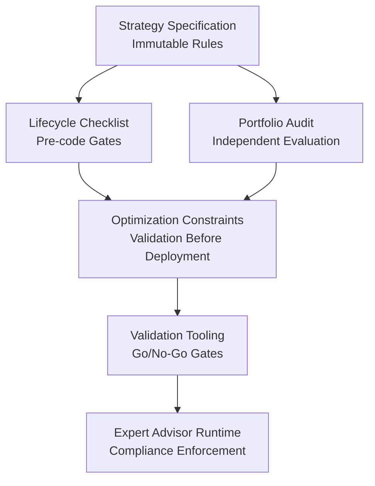
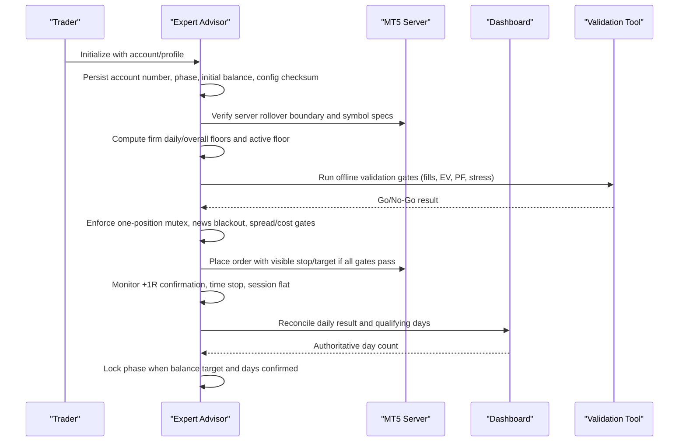
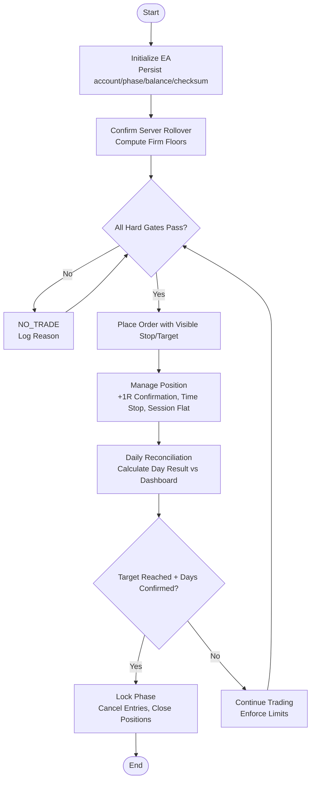

# Compliance and Regulatory

<cite>
**Referenced Files in This Document**
- [THE5ERS-CHALLENGE-STRATEGY-V2.md](file://THE5ERS-CHALLENGE-STRATEGY-V2.md)
- [THE5ERS-END-TO-END-PRECODE-CHECKLIST.md](file://THE5ERS-END-TO-END-PRECODE-CHECKLIST.md)
- [THE5ERS-CHALLENGE-OPTIMIZATION.md](file://THE5ERS-CHALLENGE-OPTIMIZATION.md)
- [TRIAD-SURVIVE.md](file://TRIAD-SURVIVE.md)
- [STRATEGY-PORTFOLIO-AUDIT.md](file://STRATEGY-PORTFOLIO-AUDIT.md)
- [triad_validation.py](file://tools/triad_validation.py)
- [TRIAD_R_HS.mq5](file://MQL5/Experts/TRIAD_R_HS/TRIAD_R_HS.mq5)
</cite>

## Table of Contents
1. Introduction
2. Project Structure
3. Core Components
4. Architecture Overview
5. Detailed Component Analysis
6. Dependency Analysis
7. Performance Considerations
8. Troubleshooting Guide
9. Conclusion
10. Appendices

## Introduction
This document defines compliance and regulatory requirements for The5ers proprietary trading firm challenges as implemented by the repository’s strategy and supporting tools. It focuses on rule adherence procedures, audit requirements, documentation standards, change management, and how the system enforces position limits, trading restrictions, and reporting obligations. It also explains compliance monitoring, audit trail generation, and regulatory reporting capabilities, with guidance for maintaining compliance documentation, handling rule changes, and responding to reviews or audits.

## Project Structure
The compliance framework is defined primarily through strategy specifications, lifecycle checklists, optimization guidelines, and implementation artifacts:
- Strategy specification and immutable rules define hard gates, risk engines, daily state machine, profitable-day accounting, and firm-floor protection.
- End-to-end checklist maps each requirement to a verifiable action across the full lifecycle from checkout to payout and scaling.
- Optimization guidance constrains what may be tuned and mandates validation before deployment.
- Portfolio audit provides independent evaluation criteria and long-term survival design.
- Validation tooling codifies go/no-go gates and failure reporting.
- Expert Advisor (EA) enforces runtime compliance, including account identity checks, history reconciliation, and inactivity alerts.

**Diagram sources**
- [THE5ERS-CHALLENGE-STRATEGY-V2.md:32-50](file://THE5ERS-CHALLENGE-STRATEGY-V2.md#L32-L50)
- [THE5ERS-END-TO-END-PRECODE-CHECKLIST.md:52-98](file://THE5ERS-END-TO-END-PRECODE-CHECKLIST.md#L52-L98)
- [THE5ERS-CHALLENGE-OPTIMIZATION.md:19-33](file://THE5ERS-CHALLENGE-OPTIMIZATION.md#L19-L33)
- [triad_validation.py:899-919](file://tools/triad_validation.py#L899-L919)
- [TRIAD_R_HS.mq5:1480-1540](file://MQL5/Experts/TRIAD_R_HS/TRIAD_R_HS.mq5#L1480-L1540)

**Section sources**
- [THE5ERS-CHALLENGE-STRATEGY-V2.md:32-50](file://THE5ERS-CHALLENGE-STRATEGY-V2.md#L32-L50)
- [THE5ERS-END-TO-END-PRECODE-CHECKLIST.md:52-98](file://THE5ERS-END-TO-END-PRECODE-CHECKLIST.md#L52-L98)
- [THE5ERS-CHALLENGE-OPTIMIZATION.md:19-33](file://THE5ERS-CHALLENGE-OPTIMIZATION.md#L19-L33)
- [STRATEGY-PORTFOLIO-AUDIT.md:15-47](file://STRATEGY-PORTFOLIO-AUDIT.md#L15-L47)
- [triad_validation.py:899-919](file://tools/triad_validation.py#L899-L919)
- [TRIAD_R_HS.mq5:1480-1540](file://MQL5/Experts/TRIAD_R_HS/TRIAD_R_HS.mq5#L1480-L1540)

## Core Components
- Immutable profile and hard gates: one working entry or one open position, no simultaneous positions, visible stops, news blackout enforcement, session/time constraints, volume rounding, rate-limited requests, and source ownership.
- Risk engine: paired risk/target profiles, drawdown throttle tiers, internal daily/weekly stops, and emergency shutdown boundaries.
- Daily operating state machine: deterministic flow from ready to locked, preventing day-counter manipulation and enforcing maximum sequential trades per server day.
- Profitable-day engine: exact formula using midnight balance/equity and previous-day balance; dashboard authoritative; phase-specific counters; target completion requires both balance and days.
- Firm-rule guard: persisted account/phase/initial balance/config checksum; rollover floors computed from MT5 server time; safety reserve above active floor; fail closed on mismatch.
- Signal collision and ranking: deterministic selection among candidates without changing risk; logging of rejections and collisions.
- Lifecycle controls: pre-activation verification, phase transitions, funded transition, payout/scale locks, and restart/reconciliation procedures.

**Section sources**
- [THE5ERS-CHALLENGE-STRATEGY-V2.md:32-50](file://THE5ERS-CHALLENGE-STRATEGY-V2.md#L32-L50)
- [THE5ERS-CHALLENGE-STRATEGY-V2.md:185-222](file://THE5ERS-CHALLENGE-STRATEGY-V2.md#L185-L222)
- [THE5ERS-CHALLENGE-STRATEGY-V2.md:224-240](file://THE5ERS-CHALLENGE-STRATEGY-V2.md#L224-L240)
- [THE5ERS-CHALLENGE-STRATEGY-V2.md:243-269](file://THE5ERS-CHALLENGE-STRATEGY-V2.md#L243-L269)
- [THE5ERS-CHALLENGE-STRATEGY-V2.md:272-311](file://THE5ERS-CHALLENGE-STRATEGY-V2.md#L272-L311)
- [THE5ERS-CHALLENGE-STRATEGY-V2.md:314-325](file://THE5ERS-CHALLENGE-STRATEGY-V2.md#L314-L325)
- [THE5ERS-CHALLENGE-STRATEGY-V2.md:384-432](file://THE5ERS-CHALLENGE-STRATEGY-V2.md#L384-L432)

## Architecture Overview
The compliance architecture integrates strategy rules, lifecycle gates, validation metrics, and runtime enforcement into a cohesive system that ensures adherence to The5ers’ requirements.

**Diagram sources**
- [THE5ERS-CHALLENGE-STRATEGY-V2.md:272-311](file://THE5ERS-CHALLENGE-STRATEGY-V2.md#L272-L311)
- [THE5ERS-CHALLENGE-STRATEGY-V2.md:243-269](file://THE5ERS-CHALLENGE-STRATEGY-V2.md#L243-L269)
- [triad_validation.py:899-919](file://tools/triad_validation.py#L899-L919)
- [TRIAD_R_HS.mq5:1480-1540](file://MQL5/Experts/TRIAD_R_HS/TRIAD_R_HS.mq5#L1480-L1540)

## Detailed Component Analysis

### Rule Adherence Procedures
- One-position rule: Account-wide mutex prevents multiple simultaneous exposures; any duplicate/multiple position triggers flatten/halt and reconciliation.
- News blackout: No new entries within 30 minutes of red-folder events; pending orders canceled; existing positions flattened before relevant events.
- Visible stops: Every entry includes broker-visible stop and target; missing stop triggers immediate correction attempt or close/halt.
- Volume rounding: Always rounded down; minimum lot unsafe skips trade; never increase size to satisfy profitable-day threshold.
- Rate limiting: No per-tick modifications; default cap of non-emergency trade requests per server day; safety cancels/closes remain permitted.
- Source ownership: Trader must own complete EA source code and build record; runtime optimizer disabled.

**Section sources**
- [THE5ERS-CHALLENGE-STRATEGY-V2.md:32-50](file://THE5ERS-CHALLENGE-STRATEGY-V2.md#L32-L50)
- [THE5ERS-END-TO-END-PRECODE-CHECKLIST.md:121-162](file://THE5ERS-END-TO-END-PRECODE-CHECKLIST.md#L121-L162)
- [TRIAD_R_HS.mq5:1480-1540](file://MQL5/Experts/TRIAD_R_HS/TRIAD_R_HS.mq5#L1480-L1540)

### Position Limits and Trading Restrictions
- Maximum one working entry or one open position account-wide.
- No separate target tickets; no copier or coordinated execution.
- No grid, martingale, averaging, hedge, recovery trade, HFT, tick scalping, arbitrage, emulator, or stealth stop.
- Long/short symmetry enforced; no forced alternation; directional evidence logged.
- Session/time constraints: correct civil-time sessions; flat before rollover and weekends; Friday flat.

**Section sources**
- [THE5ERS-CHALLENGE-STRATEGY-V2.md:32-50](file://THE5ERS-CHALLENGE-STRATEGY-V2.md#L32-L50)
- [TRIAD-SURVIVE.md:31-61](file://TRIAD-SURVIVE.md#L31-L61)
- [STRATEGY-PORTFOLIO-AUDIT.md:291-308](file://STRATEGY-PORTFOLIO-AUDIT.md#L291-L308)

### Reporting Requirements and Profitable-Day Accounting
- Qualifying day formula: min(midnight balance, midnight equity) - previous-day balance >= $12.50.
- Any three qualifying days per phase; not required to be first or consecutive; losing/small-positive days do not reset count.
- Dashboard authoritative; EA estimate reconciled daily; phase-specific counters maintained.
- Target completion requires both balance target and dashboard-confirmed days; otherwise enter TARGET_PENDING_DAYS and remain flat pending review.

**Section sources**
- [THE5ERS-CHALLENGE-STRATEGY-V2.md:243-269](file://THE5ERS-CHALLENGE-STRATEGY-V2.md#L243-L269)
- [THE5ERS-END-TO-END-PRECODE-CHECKLIST.md:218-232](file://THE5ERS-END-TO-END-PRECODE-CHECKLIST.md#L218-L232)

### Compliance Monitoring and Audit Trail Generation
- Pre-initialization persistence: account number, server, program/profile, phase, initial balance, selected base risk and exit configuration, configuration/build checksum, prior rollover balance/equity, and day counters.
- History reconciliation: unauthorized deals, external cashflows, and magic mismatches trigger halt and require state migration/rebaseline release.
- Inactivity monitoring: alerts at 20 and 25 days; persistent alert state via global variables; no maintenance trades.
- Event logging: every signal/no-signal, fill, MFE, MAE, cost, slippage, exit reason recorded; direction concentration logged; rejected candidates and collision reasons documented.

**Section sources**
- [THE5ERS-CHALLENGE-STRATEGY-V2.md:272-311](file://THE5ERS-CHALLENGE-STRATEGY-V2.md#L272-L311)
- [TRIAD_R_HS.mq5:1480-1540](file://MQL5/Experts/TRIAD_R_HS/TRIAD_R_HS.mq5#L1480-L1540)
- [THE5ERS-END-TO-END-PRECODE-CHECKLIST.md:319-338](file://THE5ERS-END-TO-END-PRECODE-CHECKLIST.md#L319-L338)

### Change Management Processes
- Parameter freeze: no runtime optimization or automatic parameter mutation; only four coarse dimensions tested offline (range band, ATR band, time stop, categorical execution profile).
- Validation gates: minimum fills, net expectancy, profit factor, stress tests, block bootstrap simulations, forward demo, zero implementation errors.
- Phase transitions: new account handshakes verify product, phase, account number, server, initial balance, symbols, and rules; same champion strategy/configuration preserved.
- Payout/scale locks: cancel pending entries, close all open trades, reconcile balance/dashboard, human confirmation required; no silent changes while order/position exists.

**Section sources**
- [THE5ERS-CHALLENGE-STRATEGY-V2.md:328-382](file://THE5ERS-CHALLENGE-STRATEGY-V2.md#L328-L382)
- [THE5ERS-CHALLENGE-STRATEGY-V2.md:384-432](file://THE5ERS-CHALLENGE-STRATEGY-V2.md#L384-L432)
- [THE5ERS-CHALLENGE-OPTIMIZATION.md:192-215](file://THE5ERS-CHALLENGE-OPTIMIZATION.md#L192-L215)

### Regulatory Reporting Capabilities
- Daily reconciliation: MT5 and dashboard balance/equity reconciled; day calculation recorded and compared; MFE, MAE, spread, slippage, exit reason logged.
- Phase completion guards: lock phase only after both balance target and days confirmed; TARGET_PENDING_DAYS requires human review.
- Funded lifecycle: re-read agreement, symbol specifications, leverage, permissions, payout terms; treat as new configuration event; keep same source version and risk process through first payout.

**Section sources**
- [THE5ERS-CHALLENGE-STRATEGY-V2.md:384-432](file://THE5ERS-CHALLENGE-STRATEGY-V2.md#L384-L432)
- [THE5ERS-END-TO-END-PRECODE-CHECKLIST.md:252-294](file://THE5ERS-END-TO-END-PRECODE-CHECKLIST.md#L252-L294)

### Compliance Review and Audit Response Guidance
- Maintain immutable configuration records: source version, compiler version, checksum, parameters, and validation results.
- Preserve agreement snapshots, purchase timestamps, and FAQ versions; resolve ambiguities with written support before activation.
- Prepare audit artifacts: signal logs, fill logs, rejection logs, collision logs, inactivity alerts, daily reconciliations, and phase transition records.
- Respond to findings: if rule violations detected, halt immediately, reconcile state, and require formal revalidation before resuming.

**Section sources**
- [THE5ERS-CHALLENGE-STRATEGY-V2.md:384-432](file://THE5ERS-CHALLENGE-STRATEGY-V2.md#L384-L432)
- [THE5ERS-END-TO-END-PRECODE-CHECKLIST.md:31-47](file://THE5ERS-END-TO-END-PRECODE-CHECKLIST.md#L31-L47)
- [TRIAD_R_HS.mq5:1480-1540](file://MQL5/Experts/TRIAD_R_HS/TRIAD_R_HS.mq5#L1480-L1540)

## Dependency Analysis
The compliance system depends on accurate data inputs, strict gate enforcement, and robust runtime safeguards. Dependencies include:
- Strategy specification defines immutable rules and processes.
- Lifecycle checklist operationalizes each requirement into verifiable actions.
- Optimization constraints ensure changes are validated before deployment.
- Validation tooling enforces quantitative thresholds and failure reporting.
- EA runtime enforces account identity, history reconciliation, and inactivity alerts.

**Diagram sources**
- [THE5ERS-CHALLENGE-STRATEGY-V2.md:32-50](file://THE5ERS-CHALLENGE-STRATEGY-V2.md#L32-L50)
- [THE5ERS-END-TO-END-PRECODE-CHECKLIST.md:52-98](file://THE5ERS-END-TO-END-PRECODE-CHECKLIST.md#L52-L98)
- [triad_validation.py:899-919](file://tools/triad_validation.py#L899-L919)
- [TRIAD_R_HS.mq5:1480-1540](file://MQL5/Experts/TRIAD_R_HS/TRIAD_R_HS.mq5#L1480-L1540)

**Section sources**
- [THE5ERS-CHALLENGE-STRATEGY-V2.md:32-50](file://THE5ERS-CHALLENGE-STRATEGY-V2.md#L32-L50)
- [THE5ERS-END-TO-END-PRECODE-CHECKLIST.md:52-98](file://THE5ERS-END-TO-END-PRECODE-CHECKLIST.md#L52-L98)
- [triad_validation.py:899-919](file://tools/triad_validation.py#L899-L919)
- [TRIAD_R_HS.mq5:1480-1540](file://MQL5/Experts/TRIAD_R_HS/TRIAD_R_HS.mq5#L1480-L1540)

## Performance Considerations
- Compliance-first design prioritizes zero rule violations over speed or return maximization.
- Drawdown throttles reduce risk during adverse periods; emergency shutdown protects against catastrophic loss.
- Stress testing includes spread and slippage multipliers; validation gates ensure robustness under adverse conditions.
- Forward demo and live monitoring detect execution issues early; zero implementation errors required before production.

[No sources needed since this section provides general guidance]

## Troubleshooting Guide
Common compliance failures and responses:
- Unknown account/profile/phase: no new orders until identity verified.
- Configuration hash mismatch: no new orders; investigate unauthorized changes.
- Stale quote/bar: no new orders; existing broker stop remains.
- Calendar missing/stale: no new orders; refresh calendar.
- Server rollover mismatch: no new orders; reconcile with MT5 server time.
- Order rejected: one delayed, fully revalidated retry maximum.
- Visible stop missing: one correction attempt; if unsuccessful, close and halt.
- Duplicate/multiple positions: cancel entries, flatten as safely executable, halt.
- Partial fill: reconcile actual risk/position count immediately.
- Request cap reached: block entries; never block safety cancel/close.
- Daily/weekly/firm floor breach: cancel entries and lock relevant period; emergency exposure reduction if near firm floor.
- EA/VPS restart: reconstruct from broker state before action.
- Manual trade detected: halt and require reconciliation.
- Gap/slippage overrun: log actual, halt, do not claim guaranteed cap.

**Section sources**
- [THE5ERS-END-TO-END-PRECODE-CHECKLIST.md:319-338](file://THE5ERS-END-TO-END-PRECODE-CHECKLIST.md#L319-L338)
- [TRIAD_R_HS.mq5:1480-1540](file://MQL5/Experts/TRIAD_R_HS/TRIAD_R_HS.mq5#L1480-L1540)

## Conclusion
The repository implements a comprehensive compliance and regulatory framework for The5ers challenges. It enforces immutable rules, rigorous validation, detailed audit trails, and robust change management. The system ensures adherence to position limits, trading restrictions, and reporting requirements through hard gates, risk engines, daily state machines, and runtime safeguards. Documentation standards and lifecycle controls provide clear procedures for maintaining compliance, handling rule changes, and responding to reviews or audits.

[No sources needed since this section summarizes without analyzing specific files]

## Appendices

### Compliance Flowchart

**Diagram sources**
- [THE5ERS-CHALLENGE-STRATEGY-V2.md:272-311](file://THE5ERS-CHALLENGE-STRATEGY-V2.md#L272-L311)
- [THE5ERS-CHALLENGE-STRATEGY-V2.md:243-269](file://THE5ERS-CHALLENGE-STRATEGY-V2.md#L243-L269)
- [TRIAD_R_HS.mq5:1480-1540](file://MQL5/Experts/TRIAD_R_HS/TRIAD_R_HS.mq5#L1480-L1540)