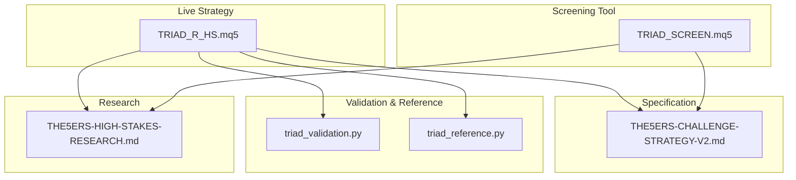
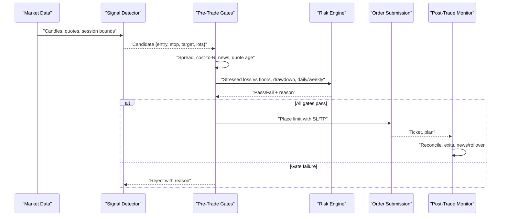
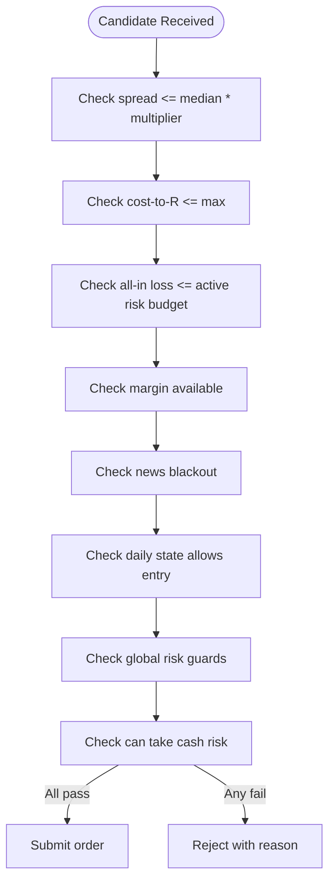
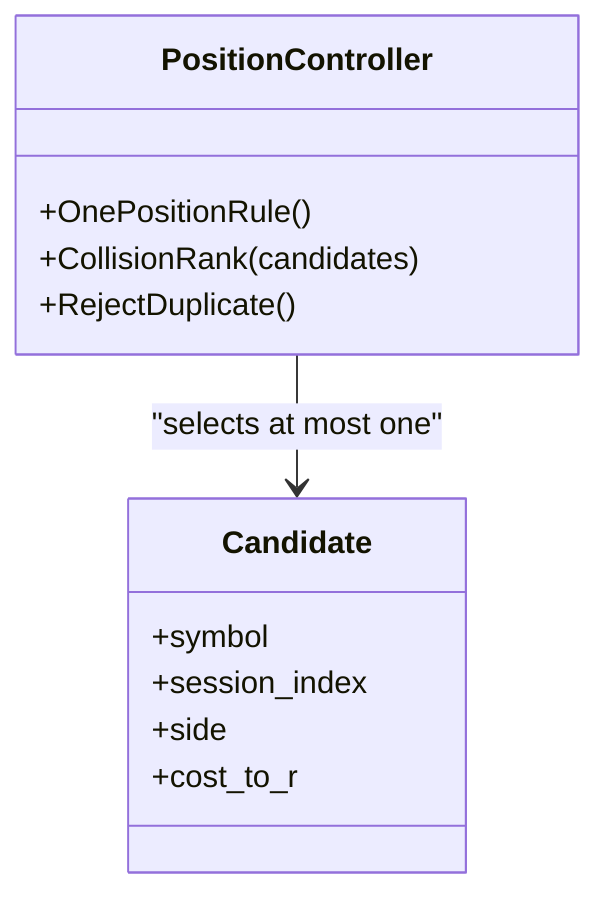
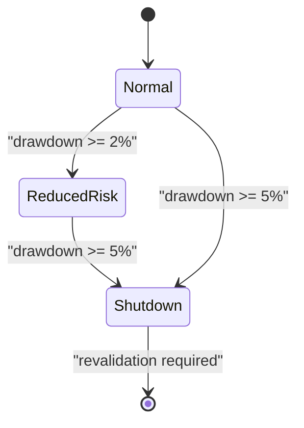
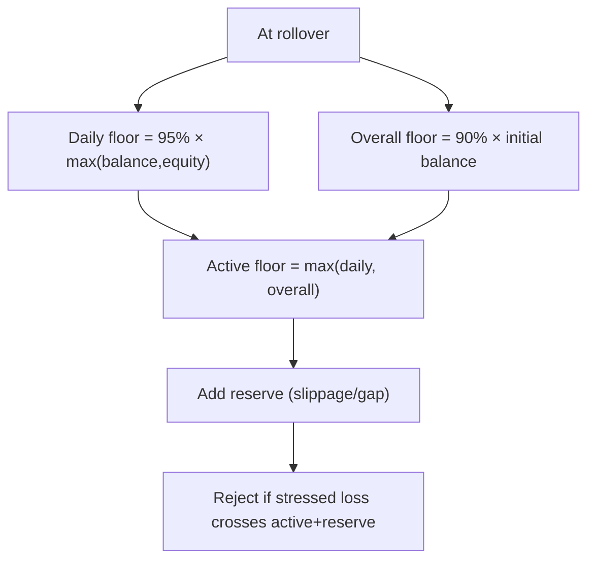
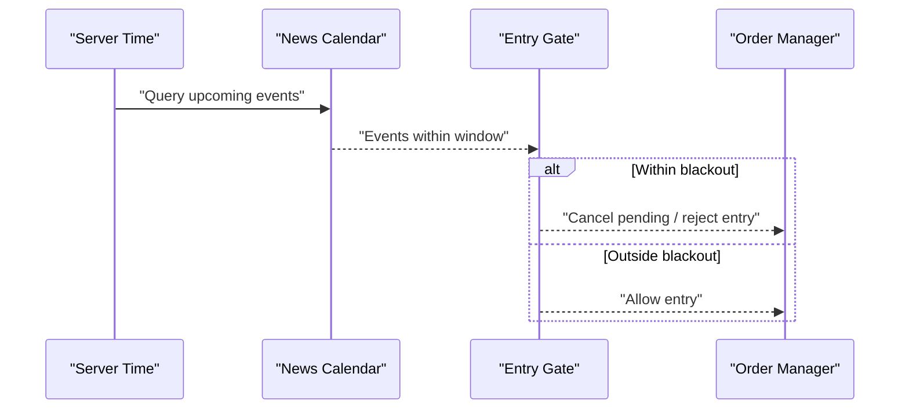
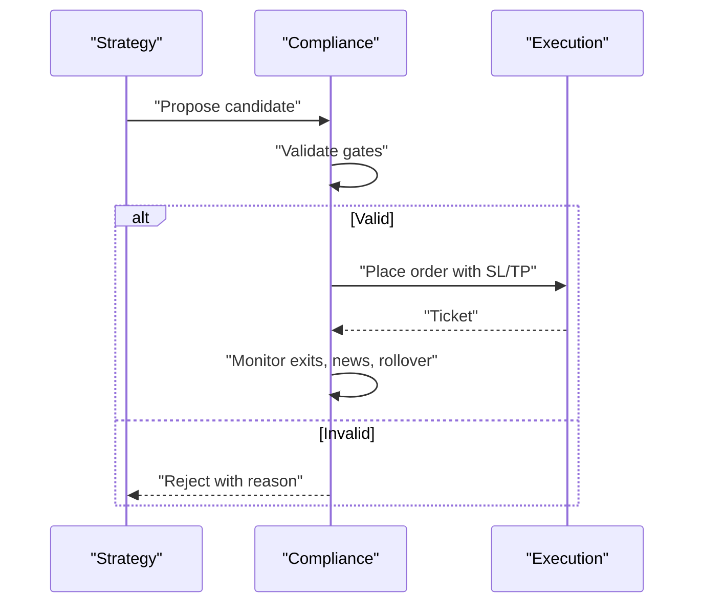
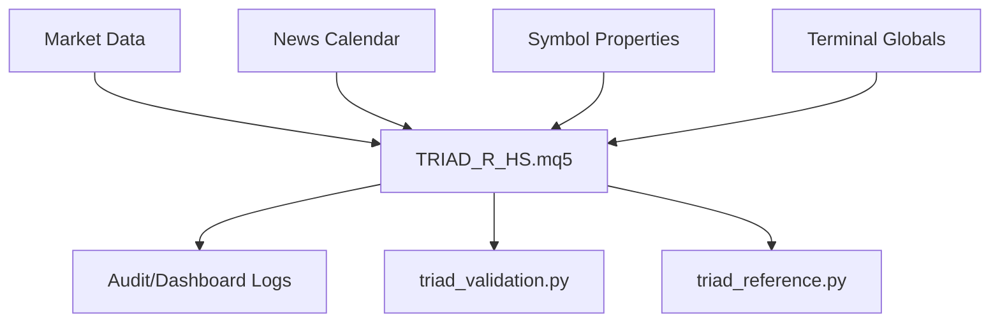

# Rule Adherence and Compliance Monitoring

<cite>
**Referenced Files in This Document**
- [TRIAD_R_HS.mq5](file://MQL5/Experts/TRIAD_R_HS/TRIAD_R_HS.mq5)
- [TRIAD_SCREEN.mq5](file://MQL5/Experts/TRIAD_SCREEN/TRIAD_SCREEN.mq5)
- [THE5ERS-CHALLENGE-STRATEGY-V2.md](file://THE5ERS-CHALLENGE-STRATEGY-V2.md)
- [TRIAD_R_HS-CODE-REVIEW.md](file://TRIAD_R_HS-CODE-REVIEW.md)
- [triad_validation.py](file://tools/triad_validation.py)
- [triad_reference.py](file://tests/triad_reference.py)
- [THE5ERS-HIGH-STAKES-RESEARCH.md](file://THE5ERS-HIGH-STAKES-RESEARCH.md)
</cite>

## Table of Contents
1. [Introduction](#introduction)
2. [Project Structure](#project-structure)
3. [Core Components](#core-components)
4. [Architecture Overview](#architecture-overview)
5. [Detailed Component Analysis](#detailed-component-analysis)
6. [Dependency Analysis](#dependency-analysis)
7. [Performance Considerations](#performance-considerations)
8. [Troubleshooting Guide](#troubleshooting-guide)
9. [Conclusion](#conclusion)
10. [Appendices](#appendices)

## Introduction
This document explains how the TRIAD-R system enforces proprietary trading firm rules for The5ers, focusing on position limits, maximum drawdown constraints, daily loss limits, and trading restrictions. It details real-time compliance checks, rule validation, automatic trade rejection, and the integration between strategy logic and compliance enforcement across pre-trade, post-trade, and continuous monitoring phases. It also provides examples of violations, automated responses, reporting outputs, configuration guidance, alerting, and edge-case handling.

## Project Structure
The repository contains:
- Production MQL5 Expert Advisors implementing the canonical strategy and compliance controls.
- A screening/demo EA mirroring core logic without production safety machinery.
- Canonical specification defining immutable rules, risk profiles, and lifecycle.
- Validation tools and reference math used to verify behavior offline and in tests.
- Research documents clarifying firm rules, internal limits, and operational policies.

**Diagram sources**
- [TRIAD_R_HS.mq5:1-120](file://MQL5/Experts/TRIAD_R_HS/TRIAD_R_HS.mq5#L1-L120)
- [TRIAD_SCREEN.mq5:1-120](file://MQL5/Experts/TRIAD_SCREEN/TRIAD_SCREEN.mq5#L1-L120)
- [THE5ERS-CHALLENGE-STRATEGY-V2.md:1-120](file://THE5ERS-CHALLENGE-STRATEGY-V2.md#L1-L120)

**Section sources**
- [TRIAD_R_HS.mq5:1-120](file://MQL5/Experts/TRIAD_R_HS/TRIAD_R_HS.mq5#L1-L120)
- [TRIAD_SCREEN.mq5:1-120](file://MQL5/Experts/TRIAD_SCREEN/TRIAD_SCREEN.mq5#L1-L120)
- [THE5ERS-CHALLENGE-STRATEGY-V2.md:1-120](file://THE5ERS-CHALLENGE-STRATEGY-V2.md#L1-L120)

## Core Components
- Pre-signal gates: mandatory checks before any order is considered (position limits, spread, cost-to-R, news blackout, quote freshness, broker stop/freeze levels, volume rounding, target room).
- Risk engine: drawdown throttle, daily/weekly stops, firm floors with reserve, phase targets, and one-position topology.
- Entry/exit engine: sweep/reclaim pattern, limit entry, visible stop/target, time/session/news rollover exits.
- State machine: daily flow from ready to first trade, second eligibility, and locked; resets at server rollover.
- Persistence and identity: account/server/product lock, config hash, signed halt latches, state signatures, instance locks.
- Reporting and alerts: audit logs, daily summaries, dashboard metrics, inactivity alerts, and revalidation triggers.

Key implementation anchors:
- Pre-trade revalidation pipeline and rejection reasons are enforced immediately before submission.
- Global risk guards enforce drawdown, daily/weekly stops, and firm floor reserves.
- Daily state gating prevents unauthorized entries after profits or two trades.
- News blackout windows block new orders around high-impact events.

**Section sources**
- [TRIAD_R_HS.mq5:1593-1772](file://MQL5/Experts/TRIAD_R_HS/TRIAD_R_HS.mq5#L1593-L1772)
- [TRIAD_R_HS.mq5:2754-2777](file://MQL5/Experts/TRIAD_R_HS/TRIAD_R_HS.mq5#L2754-L2777)
- [THE5ERS-CHALLENGE-STRATEGY-V2.md:74-115](file://THE5ERS-CHALLENGE-STRATEGY-V2.md#L74-L115)
- [THE5ERS-CHALLENGE-STRATEGY-V2.md:185-240](file://THE5ERS-CHALLENGE-STRATEGY-V2.md#L185-L240)

## Architecture Overview
The compliance architecture integrates strategy signals with hard gates and continuous monitoring. Every candidate signal passes through a strict sequence of validations. If any gate fails, the candidate is rejected with a logged reason. Post-fill, positions are reconciled against plans and protected by emergency exits and global guards.

**Diagram sources**
- [TRIAD_R_HS.mq5:2754-2777](file://MQL5/Experts/TRIAD_R_HS/TRIAD_R_HS.mq5#L2754-L2777)
- [TRIAD_R_HS.mq5:1593-1772](file://MQL5/Experts/TRIAD_R_HS/TRIAD_R_HS.mq5#L1593-L1772)
- [THE5ERS-CHALLENGE-STRATEGY-V2.md:74-115](file://THE5ERS-CHALLENGE-STRATEGY-V2.md#L74-L115)

## Detailed Component Analysis

### Pre-Trade Checks and Automatic Rejection
- Mandatory gates include instrument/session enablement, no open/working exposure, range/ATR percentile filters, spread median multiplier, cost-to-R cap, news blackout, quote freshness, broker stop/freeze compliance, volume rounding, target room, and stressed loss below firm floors plus reserve.
- Immediate recheck right before submission validates spread, cost-to-R, cash risk budget, margin availability, news window, daily state, global risk guards, and cash risk capacity. Any failure sets a specific rejection reason and aborts submission.

**Diagram sources**
- [TRIAD_R_HS.mq5:2754-2777](file://MQL5/Experts/TRIAD_R_HS/TRIAD_R_HS.mq5#L2754-L2777)
- [TRIAD_SCREEN.mq5:2122-2150](file://MQL5/Experts/TRIAD_SCREEN/TRIAD_SCREEN.mq5#L2122-L2150)

**Section sources**
- [TRIAD_R_HS.mq5:2754-2777](file://MQL5/Experts/TRIAD_R_HS/TRIAD_R_HS.mq5#L2754-L2777)
- [TRIAD_SCREEN.mq5:2122-2150](file://MQL5/Experts/TRIAD_SCREEN/TRIAD_SCREEN.mq5#L2122-L2150)
- [THE5ERS-CHALLENGE-STRATEGY-V2.md:74-115](file://THE5ERS-CHALLENGE-STRATEGY-V2.md#L74-L115)

### Position Limits and One-Position Topology
- Only one working entry or one open position account-wide. No simultaneous positions, copiers, or coordinated execution.
- Correlated instruments share a single position constraint within the same session/event.
- Collision ranking selects at most one candidate per event using locked priorities and cost/R tiebreakers.

**Diagram sources**
- [THE5ERS-CHALLENGE-STRATEGY-V2.md:31-50](file://THE5ERS-CHALLENGE-STRATEGY-V2.md#L31-L50)
- [THE5ERS-CHALLENGE-STRATEGY-V2.md:314-325](file://THE5ERS-CHALLENGE-STRATEGY-V2.md#L314-L325)

**Section sources**
- [THE5ERS-CHALLENGE-STRATEGY-V2.md:31-50](file://THE5ERS-CHALLENGE-STRATEGY-V2.md#L31-L50)
- [THE5ERS-CHALLENGE-STRATEGY-V2.md:314-325](file://THE5ERS-CHALLENGE-STRATEGY-V2.md#L314-L325)

### Maximum Drawdown Constraints and Throttle
- Strategy drawdown measured from highest flat balance; checked continuously and before every order.
- Two-tier response: reduce risk by 50% at 2% drawdown; emergency shutdown at 5% with immediate exposure close and halt.
- Internal daily and weekly stops provide additional buffers below firm termination boundaries.

**Diagram sources**
- [THE5ERS-CHALLENGE-STRATEGY-V2.md:200-221](file://THE5ERS-CHALLENGE-STRATEGY-V2.md#L200-L221)
- [TRIAD_R_HS.mq5:1772-1800](file://MQL5/Experts/TRIAD_R_HS/TRIAD_R_HS.mq5#L1772-L1800)

**Section sources**
- [THE5ERS-CHALLENGE-STRATEGY-V2.md:200-221](file://THE5ERS-CHALLENGE-STRATEGY-V2.md#L200-L221)
- [TRIAD_R_HS.mq5:1772-1800](file://MQL5/Experts/TRIAD_R_HS/TRIAD_R_HS.mq5#L1772-L1800)

### Daily Loss Limits and Firm Floors
- Firm daily floor computed at rollover from higher of balance/equity times 95%; overall floor at 90% of phase initial balance. Active floor is the more restrictive.
- Reserve added to prevent crossing floors under stress; includes slippage/gap buffer.
- Internal daily stop (e.g., -1%) and weekly stop (e.g., -2%) act as early circuit breakers.

**Diagram sources**
- [THE5ERS-CHALLENGE-STRATEGY-V2.md:272-296](file://THE5ERS-CHALLENGE-STRATEGY-V2.md#L272-L296)
- [triad_reference.py:91-103](file://tests/triad_reference.py#L91-L103)

**Section sources**
- [THE5ERS-CHALLENGE-STRATEGY-V2.md:272-296](file://THE5ERS-CHALLENGE-STRATEGY-V2.md#L272-L296)
- [triad_reference.py:91-103](file://tests/triad_reference.py#L91-L103)

### Trading Restrictions and News Blackout
- No new entries or working orders within a configured window around relevant red-folder news; USD restrictions apply broadly to USD pairs.
- Pending orders must be cancelled before blackouts; retries suppressed during prohibited windows.
- Calendar coverage must be operator-verified via explicit UTC declaration; missing/stale coverage fails closed.

**Diagram sources**
- [TRIAD_R_HS.mq5:939-980](file://MQL5/Experts/TRIAD_R_HS/TRIAD_R_HS.mq5#L939-L980)
- [TRIAD_R_HS.mq5:2766-2770](file://MQL5/Experts/TRIAD_R_HS/TRIAD_R_HS.mq5#L2766-L2770)
- [TRIAD_R_HS-CODE-REVIEW.md:46-49](file://TRIAD_R_HS-CODE-REVIEW.md#L46-L49)

**Section sources**
- [TRIAD_R_HS.mq5:939-980](file://MQL5/Experts/TRIAD_R_HS/TRIAD_R_HS.mq5#L939-L980)
- [TRIAD_R_HS.mq5:2766-2770](file://MQL5/Experts/TRIAD_R_HS/TRIAD_R_HS.mq5#L2766-L2770)
- [TRIAD_R_HS-CODE-REVIEW.md:46-49](file://TRIAD_R_HS-CODE-REVIEW.md#L46-L49)

### Integration Between Strategy Logic and Compliance Enforcement
- Strategy detects sweep/reclaim patterns and proposes candidates with entry, stop, target, and volume.
- Compliance layer validates each candidate against live market conditions, risk budgets, and firm rules.
- Post-trade, positions are monitored for exits, news/rollover flattening, and reconciliation with original plans.

**Diagram sources**
- [TRIAD_R_HS.mq5:2754-2777](file://MQL5/Experts/TRIAD_R_HS/TRIAD_R_HS.mq5#L2754-L2777)
- [TRIAD_R_HS.mq5:1593-1772](file://MQL5/Experts/TRIAD_R_HS/TRIAD_R_HS.mq5#L1593-L1772)

**Section sources**
- [TRIAD_R_HS.mq5:2754-2777](file://MQL5/Experts/TRIAD_R_HS/TRIAD_R_HS.mq5#L2754-L2777)
- [TRIAD_R_HS.mq5:1593-1772](file://MQL5/Experts/TRIAD_R_HS/TRIAD_R_HS.mq5#L1593-L1772)

### Real-Time Compliance Checking Algorithms
- Spread gate: current spread compared to median over recent sessions; rejects when too wide.
- Cost-to-R gate: estimated round-trip cost including commission and slippage must not exceed configured threshold.
- Cash risk budget: all-in loss computed via symbol economics; must fit active risk fraction.
- Margin availability: ensures sufficient free margin for planned risk.
- News blackout: checks relevant currencies and configured minutes around events.
- Daily state: enforces one-positive-lock and two-trade daily caps.
- Global risk guards: drawdown tiers, daily/weekly stops, firm floors with reserve.

**Section sources**
- [TRIAD_R_HS.mq5:2754-2777](file://MQL5/Experts/TRIAD_R_HS/TRIAD_R_HS.mq5#L2754-L2777)
- [TRIAD_SCREEN.mq5:2122-2150](file://MQL5/Experts/TRIAD_SCREEN/TRIAD_SCREEN.mq5#L2122-L2150)
- [THE5ERS-CHALLENGE-STRATEGY-V2.md:74-115](file://THE5ERS-CHALLENGE-STRATEGY-V2.md#L74-L115)

### Post-Trade Validation and Continuous Monitoring
- Positions reconciled against original plan: ticket, volume, visible stops/targets, comment/magic propagation.
- Exits enforced: +1R confirmation, time stops, session cutoffs, news/rollover buffers, Friday flattening.
- Emergency repair paths: missing visible stop triggers protective correction; failures close and halt.
- Continuous checks: quote freshness, latency/slippage bounds, request throttling, and instance lease fencing.

**Section sources**
- [TRIAD_R_HS.mq5:2979-3060](file://MQL5/Experts/TRIAD_R_HS/TRIAD_R_HS.mq5#L2979-L3060)
- [TRIAD_R_HS-CODE-REVIEW.md:66-77](file://TRIAD_R_HS-CODE-REVIEW.md#L66-L77)

### Examples of Rule Violations and Automated Responses
- Spread spike during thin liquidity: candidate rejected with spread gate reason; no order placed.
- News blackout overlap: pending order cancelled; entry blocked until window clears.
- Drawdown reaches 5%: emergency close attempts, halt persisted with reason, requires formal revalidation.
- Two trades completed: day locked; further signals rejected regardless of outcome.
- Stressed loss would cross firm floor plus reserve: entry rejected to protect capital.

**Section sources**
- [TRIAD_R_HS.mq5:2754-2777](file://MQL5/Experts/TRIAD_R_HS/TRIAD_R_HS.mq5#L2754-L2777)
- [THE5ERS-CHALLENGE-STRATEGY-V2.md:200-221](file://THE5ERS-CHALLENGE-STRATEGY-V2.md#L200-L221)
- [THE5ERS-CHALLENGE-STRATEGY-V2.md:272-296](file://THE5ERS-CHALLENGE-STRATEGY-V2.md#L272-L296)

### Compliance Reporting Outputs
- Audit log CSV records server time, level, event, detail, balance, equity, and request counts for every significant action.
- Daily summary CSV tracks day key, balance, equity, phase, status, qualifying days, day net, signals/candidates/fills/rejects, last rejection, and net R totals.
- Dashboard displays challenge status, phase progress, qualifying days, daily floor distance, today’s counters, and setting fingerprint.

**Section sources**
- [TRIAD_R_HS.mq5:299-327](file://MQL5/Experts/TRIAD_R_HS/TRIAD_R_HS.mq5#L299-L327)
- [TRIAD_SCREEN.mq5:547-578](file://MQL5/Experts/TRIAD_SCREEN/TRIAD_SCREEN.mq5#L547-L578)

### Configuration Guidance for Compliance Parameters
- Enable order submission only after all release gates pass; keep product code, authorized login, and expected server/currency/leverage set correctly.
- Set news calendar file and require coverage declaration; configure blackout and flat minutes appropriately.
- Configure spread median multiplier, cost-to-R cap, slippage reserves, and commission assumptions to match broker reality.
- Tune range/ATR percentiles and comparable sessions conservatively; validate out-of-sample before enabling.
- Use internal daily/weekly stops and drawdown thresholds aligned with firm rules but tighter for safety.

**Section sources**
- [TRIAD_R_HS.mq5:52-149](file://MQL5/Experts/TRIAD_R_HS/TRIAD_R_HS.mq5#L52-L149)
- [TRIAD_SCREEN.mq5:86-151](file://MQL5/Experts/TRIAD_SCREEN/TRIAD_SCREEN.mq5#L86-L151)
- [THE5ERS-CHALLENGE-STRATEGY-V2.md:31-50](file://THE5ERS-CHALLENGE-STRATEGY-V2.md#L31-L50)

### Alerting Setup and Edge Cases
- Alerts for inactivity driven by news-blocked days streak; escalate if repeated news blackouts cause prolonged inactivity.
- Instance lock heartbeat failures fence stale instances and halt trading safely.
- External cashflow or unauthorized history triggers migration latch requiring separate review; ordinary reset cannot clear.
- Quote staleness, latency spikes, and partial fills trigger halts or repairs; emergency requests bypass non-emergency caps.

**Section sources**
- [TRIAD_R_HS.mq5:251-257](file://MQL5/Experts/TRIAD_R_HS/TRIAD_R_HS.mq5#L251-L257)
- [TRIAD_R_HS.mq5:494-566](file://MQL5/Experts/TRIAD_R_HS/TRIAD_R_HS.mq5#L494-L566)
- [TRIAD_R_HS-CODE-REVIEW.md:20-45](file://TRIAD_R_HS-CODE-REVIEW.md#L20-L45)

## Dependency Analysis
The compliance system depends on:
- Live market data and session/time utilities for accurate boundaries.
- News calendar with verified coverage declarations.
- Symbol properties and MT5 economics for precise sizing and exits.
- Terminal globals for persistence, identity, and safety latches.
- Validation tools and reference math for offline verification and testing.

**Diagram sources**
- [TRIAD_R_HS.mq5:213-262](file://MQL5/Experts/TRIAD_R_HS/TRIAD_R_HS.mq5#L213-L262)
- [triad_validation.py:673-708](file://tools/triad_validation.py#L673-L708)
- [triad_reference.py:16-167](file://tests/triad_reference.py#L16-L167)

**Section sources**
- [TRIAD_R_HS.mq5:213-262](file://MQL5/Experts/TRIAD_R_HS/TRIAD_R_HS.mq5#L213-L262)
- [triad_validation.py:673-708](file://tools/triad_validation.py#L673-L708)
- [triad_reference.py:16-167](file://tests/triad_reference.py#L16-L167)

## Performance Considerations
- Keep pre-trade checks efficient; refresh quote-derived metrics immediately before ranking to avoid stale spreads or costs.
- Avoid excessive order modifications; rely on initial SL/TP and minimal post-fill adjustments.
- Use session-aware caching for range and ATR statistics to reduce indicator calls.
- Rate-limit non-emergency requests; ensure emergency actions remain uncapped for safety.
- Validate timing with an early lead to mitigate clock skew and processing delays.

[No sources needed since this section provides general guidance]

## Troubleshooting Guide
Common issues and resolutions:
- Audit log open/write failures: fail closed; investigate terminal permissions and disk space; emergency requests may still proceed where authorized.
- Duplicate live instance detected: another chart holds the lease; stop current instance to avoid conflicts.
- Stale calendar coverage: operator must update the CSV with verified coverage-through timestamp; otherwise fail closed.
- Migration latch set: external cashflow or unauthorized history detected; requires separate reviewed release to continue; do not use ordinary reset.
- Missing visible stop: attempt one protective repair; if failed, close position and halt for review.

**Section sources**
- [TRIAD_R_HS.mq5:299-327](file://MQL5/Experts/TRIAD_R_HS/TRIAD_R_HS.mq5#L299-L327)
- [TRIAD_R_HS.mq5:494-566](file://MQL5/Experts/TRIAD_R_HS/TRIAD_R_HS.mq5#L494-L566)
- [TRIAD_R_HS-CODE-REVIEW.md:20-45](file://TRIAD_R_HS-CODE-REVIEW.md#L20-L45)

## Conclusion
The TRIAD-R system implements a robust, fail-closed compliance framework tailored for The5ers’ proprietary trading rules. It enforces strict pre-trade gates, continuous risk monitoring, and disciplined post-trade management. By integrating strategy signals with hard compliance checks, it minimizes rule violations, protects capital through drawdown and daily/weekly stops, and maintains operational integrity via persistence, identity checks, and instance fencing. Proper configuration, vigilant monitoring, and adherence to the canonical specification ensure reliable operation through evaluation phases and into funded trading.

[No sources needed since this section summarizes without analyzing specific files]

## Appendices

### Appendix A: Key Functions and Their Roles
- DailyStateAllowsEntry: Enforces daily flow rules (first trade profit lock, second trade eligibility, two-trade cap).
- GlobalRiskGuards: Applies drawdown throttle, daily/weekly stops, and firm floor reserves.
- CanTakeCashRisk: Validates stressed loss against active risk budget and reserves.
- IsRelevantNewsWindow: Blocks entries around high-impact news for relevant currencies.

**Section sources**
- [TRIAD_R_HS.mq5:1593-1772](file://MQL5/Experts/TRIAD_R_HS/TRIAD_R_HS.mq5#L1593-L1772)
- [TRIAD_SCREEN.mq5:1949-1977](file://MQL5/Experts/TRIAD_SCREEN/TRIAD_SCREEN.mq5#L1949-L1977)

### Appendix B: Validation and Offline Verification
- triad_validation.py computes aggregate and per-combination metrics, applies gates, simulates phases, and reports pass probabilities and drawdowns.
- triad_reference.py provides independent arithmetic for profiles, drawdown tiers, profitable-day calculations, firm floors, and volume rounding.

**Section sources**
- [triad_validation.py:673-708](file://tools/triad_validation.py#L673-L708)
- [triad_validation.py:900-919](file://tools/triad_validation.py#L900-L919)
- [triad_reference.py:16-167](file://tests/triad_reference.py#L16-L167)

### Appendix C: Firm Rules and Internal Limits
- Firm daily loss and overall loss definitions; internal limits recommended to stay well below termination boundaries.
- News policy stricter than minimum requirements; 30-minute blackout remains conservative.
- EA automation policy prohibits HFT, arbitrage, emulators, and other prohibited practices.

**Section sources**
- [THE5ERS-HIGH-STAKES-RESEARCH.md:56-129](file://THE5ERS-HIGH-STAKES-RESEARCH.md#L56-L129)
- [THE5ERS-CHALLENGE-STRATEGY-V2.md:31-50](file://THE5ERS-CHALLENGE-STRATEGY-V2.md#L31-L50)