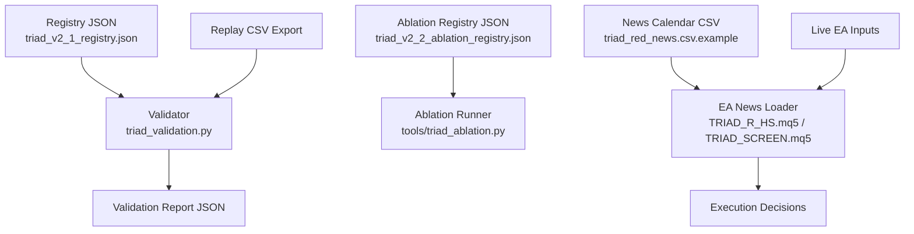
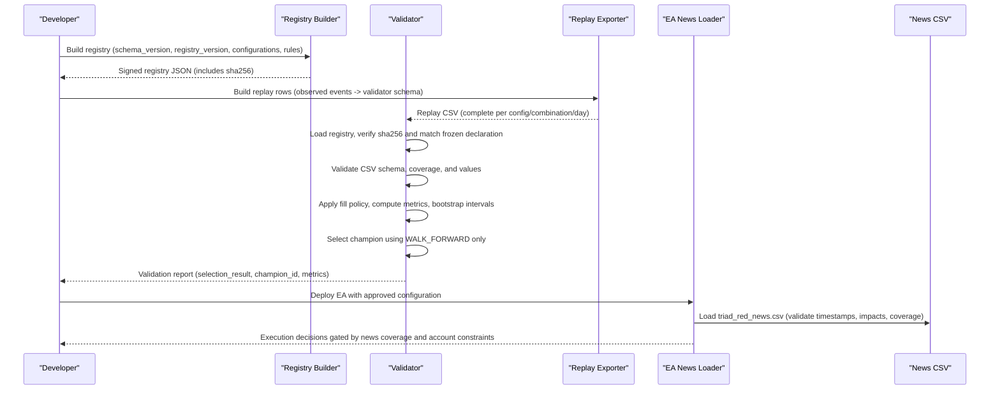
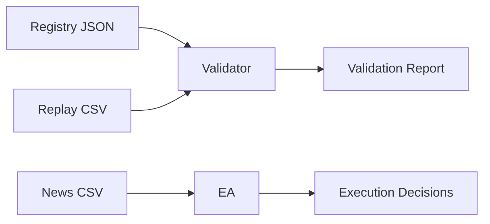

# Configuration Management

<cite>
**Referenced Files in This Document**
- [triad_v2_1_registry.json](file://validation/triad_v2_1_registry.json)
- [triad_v2_2_ablation_registry.json](file://validation/triad_v2_2_ablation_registry.json)
- [triad_validation.py](file://tools/triad_validation.py)
- [TRIAD_R_HS.mq5](file://MQL5/Experts/TRIAD_R_HS/TRIAD_R_HS.mq5)
- [TRIAD_SCREEN.mq5](file://MQL5/Experts/TRIAD_SCREEN/TRIAD_SCREEN.mq5)
- [triad_red_news.csv.example](file://MQL5/Files/triad_red_news.csv.example)
- [test_validation.py](file://tests/test_validation.py)
</cite>

## Table of Contents
1. [Introduction](#introduction)
2. [Project Structure](#project-structure)
3. [Core Components](#core-components)
4. [Architecture Overview](#architecture-overview)
5. [Detailed Component Analysis](#detailed-component-analysis)
6. [Dependency Analysis](#dependency-analysis)
7. [Performance Considerations](#performance-considerations)
8. [Troubleshooting Guide](#troubleshooting-guide)
9. [Conclusion](#conclusion)
10. [Appendices](#appendices)

## Introduction
This document explains the configuration management system used to define, validate, version, and deploy strategy configurations across research, validation, and live environments. It covers:
- Strategy registries that enumerate all candidate configurations and their parameters
- Configuration hashing and integrity checks to prevent unauthorized changes
- Version control via schema and registry versions
- Parameter validation rules for replay CSVs and runtime inputs
- Economic calendar CSV format and news event processing
- Migration procedures for state and configuration changes
- Practical examples for creating new configurations, validating settings, and managing versions throughout the lifecycle

## Project Structure
The configuration system spans three layers:
- Registry layer: JSON files declare frozen configuration matrices, selection rules, thresholds, splits, and hashes
- Validation layer: Python tooling enforces schema, validates replay exports, selects champions, and computes confidence bounds
- Runtime layer: MQL5 EAs consume a strict economic calendar CSV and enforce operational gates before trading

**Diagram sources**
- [triad_v2_1_registry.json:1-800](file://validation/triad_v2_1_registry.json#L1-L800)
- [triad_v2_2_ablation_registry.json:1-196](file://validation/triad_v2_2_ablation_registry.json#L1-L196)
- [triad_validation.py:278-331](file://tools/triad_validation.py#L278-L331)
- [triad_red_news.csv.example:1-7](file://MQL5/Files/triad_red_news.csv.example#L1-L7)
- [TRIAD_R_HS.mq5:836-919](file://MQL5/Experts/TRIAD_R_HS/TRIAD_R_HS.mq5#L836-L919)
- [TRIAD_SCREEN.mq5:852-929](file://MQL5/Experts/TRIAD_SCREEN/TRIAD_SCREEN.mq5#L852-L929)

**Section sources**
- [triad_v2_1_registry.json:1-800](file://validation/triad_v2_1_registry.json#L1-L800)
- [triad_v2_2_ablation_registry.json:1-196](file://validation/triad_v2_2_ablation_registry.json#L1-L196)
- [triad_validation.py:278-331](file://tools/triad_validation.py#L278-L331)
- [triad_red_news.csv.example:1-7](file://MQL5/Files/triad_red_news.csv.example#L1-L7)
- [TRIAD_R_HS.mq5:836-919](file://MQL5/Experts/TRIAD_R_HS/TRIAD_R_HS.mq5#L836-L919)
- [TRIAD_SCREEN.mq5:852-929](file://MQL5/Experts/TRIAD_SCREEN/TRIAD_SCREEN.mq5#L852-L929)

## Core Components
- Frozen strategy registry (V2.1): enumerates 160 candidate configurations with range bands, ATR bands, time stops, risk/target profiles, and breakeven policy; includes selection rule, fill policy, thresholds, simulation settings, CSV schema, and SHA-256 commit hash
- Ablation registry (V2.2): preregistered research round defining variants, fixed controls, decision rules, evaluation methodology, and splits
- Validator tool: loads and verifies registry integrity, parses replay CSVs against strict schema, applies fill policies, performs bootstrap-based confidence intervals, and selects a champion using walk-forward data only
- News calendar loader: reads a strict CSV contract, validates timestamps, currency codes, impact levels, and coverage declarations; enforces runtime staleness checks

Key responsibilities:
- Ensure configuration immutability via cryptographic hashing
- Enforce parameter validity at load time and runtime
- Provide reproducible selection and holdout evaluation
- Gate execution on verified news coverage and account-specific constraints

**Section sources**
- [triad_v2_1_registry.json:1-800](file://validation/triad_v2_1_registry.json#L1-L800)
- [triad_v2_2_ablation_registry.json:1-196](file://validation/triad_v2_2_ablation_registry.json#L1-L196)
- [triad_validation.py:278-331](file://tools/triad_validation.py#L278-L331)
- [triad_validation.py:360-437](file://tools/triad_validation.py#L360-L437)
- [TRIAD_R_HS.mq5:836-919](file://MQL5/Experts/TRIAD_R_HS/TRIAD_R_HS.mq5#L836-L919)
- [TRIAD_SCREEN.mq5:852-929](file://MQL5/Experts/TRIAD_SCREEN/TRIAD_SCREEN.mq5#L852-L929)

## Architecture Overview
The system separates concerns into distinct phases:
- Pre-registration: build and sign a registry with a SHA-256 hash covering all declared parameters and rules
- Replay export: produce a complete CSV of observed events and outcomes per configuration and combination
- Validation: verify registry integrity, parse CSVs, apply fill policies, compute metrics, select champion from walk-forward data, evaluate holdout after selection
- Deployment: EA loads a validated news calendar CSV and enforces runtime gates before any order submission

**Diagram sources**
- [triad_validation.py:278-331](file://tools/triad_validation.py#L278-L331)
- [triad_validation.py:360-437](file://tools/triad_validation.py#L360-L437)
- [triad_red_news.csv.example:1-7](file://MQL5/Files/triad_red_news.csv.example#L1-L7)
- [TRIAD_R_HS.mq5:836-919](file://MQL5/Experts/TRIAD_R_HS/TRIAD_R_HS.mq5#L836-L919)
- [TRIAD_SCREEN.mq5:852-929](file://MQL5/Experts/TRIAD_SCREEN/TRIAD_SCREEN.mq5#L852-L929)

## Detailed Component Analysis

### Strategy Registry (V2.1)
- Enumerates 160 unique configurations across:
  - Range percentile bands: two options
  - ATR percentile bands: two options
  - Time stops: 30, 45, 60, 90 minutes, or session-only (0)
  - Risk/target profiles: A–D with paired risk_fraction and target_r
  - Breakeven policy: move stop to entry after confirmed 1R on/off
- Each configuration has a deterministic config_id encoding its dimensions
- Registry includes:
  - Schema and registry versions
  - Canonical strategy reference
  - Selection split and holdout split
  - Selection rule list
  - Fill policy and thresholds
  - Simulation settings
  - CSV field definitions
  - SHA-256 commit over payload excluding the hash itself

Integrity checks:
- Hash mismatch detection prevents post-declaration edits
- Exact match against frozen builder ensures environment parity

**Section sources**
- [triad_v2_1_registry.json:1-800](file://validation/triad_v2_1_registry.json#L1-L800)
- [triad_validation.py:231-267](file://tools/triad_validation.py#L231-L267)
- [triad_validation.py:278-331](file://tools/triad_validation.py#L278-L331)

### Ablation Registry (V2.2)
- Preregistered research round focused on whether V2.1 entry complexity earns itself
- Defines:
  - Fixed controls (profile, risk, target, time stop, bands, etc.)
  - Decision rules R1–R5 for variant acceptance
  - Evaluation methodology (bootstrap method, paired comparison, familywise adjustment)
  - Splits (walk-forward and holdout ranges)
  - Variants with changed elements and descriptions
  - SHA-256 commit over entire payload

Usage:
- Build ablation rows from observed-event CSV
- Validate against preregistered decision rules
- Holdout confirmation requires sufficient fills on both baseline and variant sides

**Section sources**
- [triad_v2_2_ablation_registry.json:1-196](file://validation/triad_v2_2_ablation_registry.json#L1-L196)

### Replay CSV Schema and Validation
- Strict schema enforced by validator:
  - Required fields include config_id, split, server_day, sequence, event_id, combination, candidate flags, activation and limit status, trade-through ticks, fill fraction, net R, cash metrics, cost metrics, and error flags
- Validation rules:
  - Config IDs must exist in registry
  - Split must be TRAIN, WALK_FORWARD, or HOLDOUT
  - Combination must be one of allowed instrument/session pairs
  - Sequence and trade-through ticks must be non-negative
  - Duplicate rows are rejected
  - Activated candidates require positive risk cash values
  - Coverage completeness is enforced per split/config/combination/day

Fill policy application:
- Requires minimum trade-through ticks and full fill fraction
- Stressed scenario deterministically removes some profitable limits and increases spread/slippage costs
- Produces applied trades with adjusted net R and extra cost R

**Section sources**
- [triad_validation.py:71-95](file://tools/triad_validation.py#L71-L95)
- [triad_validation.py:360-437](file://tools/triad_validation.py#L360-L437)
- [triad_validation.py:480-497](file://tools/triad_validation.py#L480-L497)

### Economic Calendar CSV Format and Processing
- CSV fields: utc_time, currency, impact, title
- Rules:
  - utc_time must be UTC in YYYY.MM.DD HH:MM format
  - currency must be a three-letter uppercase code
  - impact must be RED or HIGH; other rows ignored except COVERAGE metadata
  - Every file must include an ALL,COVERAGE row declaring operator-verified coverage end
  - Titles must avoid unquoted commas
  - Coverage must extend beyond current UTC by required hours; stale coverage disables entries
- Runtime behavior:
  - Loads and validates each row
  - Tracks declared coverage end
  - Checks relevance windows for upcoming/recent news around symbol pairs
  - Fails closed if coverage is insufficient or malformed

**Section sources**
- [triad_red_news.csv.example:1-7](file://MQL5/Files/triad_red_news.csv.example#L1-L7)
- [TRIAD_R_HS.mq5:798-834](file://MQL5/Experts/TRIAD_R_HS/TRIAD_R_HS.mq5#L798-L834)
- [TRIAD_R_HS.mq5:836-919](file://MQL5/Experts/TRIAD_R_HS/TRIAD_R_HS.mq5#L836-L919)
- [TRIAD_SCREEN.mq5:852-929](file://MQL5/Experts/TRIAD_SCREEN/TRIAD_SCREEN.mq5#L852-L929)

### Configuration Migration Procedures
- State migration latches:
  - External cashflow or unauthorized trading history triggers a migration latch requiring formal rebaseline
  - Ordinary halt reset cannot clear migration latches
- One-time authorizations:
  - Fresh phase initialization requires explicit one-time authorization input
  - Persisted emergency halt reset requires one-time authorization input
- Lifecycle locks:
  - Payout, phase handoff, and scale handoff require selecting corresponding lock and reattaching EA
  - Post-payout continuation requires separate approved migration release
- Account handshake:
  - Authorized login, server, currency, leverage, hedging mode, and trade-server offset must match verified profile
  - Product code and gate inputs are declarations; EA cannot independently verify external facts

Operational guidance:
- Preserve logs and state signatures
- Reconcile balance, login/server, phase, targets, and agreement after lifecycle changes
- Never leave one-time authorization inputs enabled

**Section sources**
- [TRIAD_R_HS.mq5:836-919](file://MQL5/Experts/TRIAD_R_HS/TRIAD_R_HS.mq5#L836-L919)
- [TRIAD_R_HS.mq5:956-995](file://MQL5/Experts/TRIAD_R_HS/TRIAD_R_HS.mq5#L956-L995)

### Practical Examples

#### Creating a New Configuration
Steps:
- Define new configuration within the frozen matrix dimensions (range bands, ATR bands, time stops, profiles, breakeven policy)
- Generate config_id deterministically from dimensions
- Add to registry via builder function and write signed registry
- Ensure replay export includes no-candidate rows for every day/combo where applicable
- Run validator to confirm integrity and coverage

References:
- Matrix enumeration and ID generation
- Registry building and signing
- Replay coverage enforcement

**Section sources**
- [triad_validation.py:231-267](file://tools/triad_validation.py#L231-L267)
- [triad_validation.py:278-331](file://tools/triad_validation.py#L278-L331)
- [triad_validation.py:440-473](file://tools/triad_validation.py#L440-L473)

#### Validating Settings
Steps:
- Use schema command to print expected CSV header
- Build replay export with exact splits and registry
- Run validator with registry, input CSV, and output path
- Check selection result and champion ID
- Inspect reports for fill uncertainty counts, metrics, and confidence intervals

References:
- CLI commands and error handling
- Replay row loading and validation
- Selection logic and holdout separation

**Section sources**
- [triad_validation.py:1902-1933](file://tools/triad_validation.py#L1902-L1933)
- [triad_validation.py:360-437](file://tools/triad_validation.py#L360-L437)

#### Managing Configuration Versions
Steps:
- Increment schema_version when CSV schema changes
- Increment registry_version when configuration matrix or rules change
- Recompute and store registry_sha256 over payload
- Tests assert committed registry matches builder output
- Any mutation breaks hash verification and halts validation

References:
- Version constants and registry structure
- Hash computation and verification
- Test assertions for integrity

**Section sources**
- [triad_validation.py:49-53](file://tools/triad_validation.py#L49-L53)
- [triad_validation.py:270-331](file://tools/triad_validation.py#L270-L331)
- [test_validation.py:80-133](file://tests/test_validation.py#L80-L133)

## Dependency Analysis
The system exhibits clear separation between configuration definition, validation, and runtime enforcement:
- Registries depend on canonical strategy documentation and frozen parameters
- Validator depends on registries and replay CSVs; it does not submit orders
- EA depends on news CSV and runtime inputs; it enforces operational gates

**Diagram sources**
- [triad_v2_1_registry.json:1-800](file://validation/triad_v2_1_registry.json#L1-L800)
- [triad_validation.py:278-331](file://tools/triad_validation.py#L278-L331)
- [triad_red_news.csv.example:1-7](file://MQL5/Files/triad_red_news.csv.example#L1-L7)
- [TRIAD_R_HS.mq5:836-919](file://MQL5/Experts/TRIAD_R_HS/TRIAD_R_HS.mq5#L836-L919)

**Section sources**
- [triad_v2_1_registry.json:1-800](file://validation/triad_v2_1_registry.json#L1-L800)
- [triad_validation.py:278-331](file://tools/triad_validation.py#L278-L331)
- [triad_red_news.csv.example:1-7](file://MQL5/Files/triad_red_news.csv.example#L1-L7)
- [TRIAD_R_HS.mq5:836-919](file://MQL5/Experts/TRIAD_R_HS/TRIAD_R_HS.mq5#L836-L919)

## Performance Considerations
- Bootstrap intervals use moving block bootstrap over calendar days to preserve temporal dependence
- Familywise adjustments (Bonferroni) protect multiple comparisons during selection
- Stressed scenarios increase costs and remove profitable limits deterministically to assess robustness
- Replay coverage requirements ensure consistent day sets across configurations and combinations
- EA runtime checks minimize latency-sensitive operations and enforce safety leads

[No sources needed since this section provides general guidance]

## Troubleshooting Guide
Common issues and resolutions:
- Registry hash mismatch: indicates post-declaration edits; regenerate registry and recommit
- CSV header mismatch: run schema command to print expected fields and align export
- Unknown config_id: ensure replay export uses configurations from the loaded registry
- Invalid split or combination: restrict to TRAIN/WALK_FORWARD/HOLDOUT and allowed pairs
- Missing coverage: include explicit no-candidate rows for every configuration/combination/day per split
- News calendar errors: verify timestamps, currency codes, impact levels, and coverage declaration; refresh before expiration
- Stale coverage: update coverage timestamp and reload EA; runtime checks will fail closed until refreshed

**Section sources**
- [triad_validation.py:317-331](file://tools/triad_validation.py#L317-L331)
- [triad_validation.py:360-437](file://tools/triad_validation.py#L360-L437)
- [TRIAD_R_HS.mq5:836-919](file://MQL5/Experts/TRIAD_R_HS/TRIAD_R_HS.mq5#L836-L919)
- [TRIAD_SCREEN.mq5:852-929](file://MQL5/Experts/TRIAD_SCREEN/TRIAD_SCREEN.mq5#L852-L929)

## Conclusion
The configuration management system enforces strict immutability through cryptographic hashing, comprehensive validation of replay exports, and rigorous runtime checks for news coverage and account constraints. The registry-based approach ensures reproducibility across environments, while the ablation framework enables preregistered research without compromising the frozen selection pipeline. Operational procedures for migration and lifecycle management provide safe transitions and accountability throughout the strategy lifecycle.

[No sources needed since this section summarizes without analyzing specific files]

## Appendices

### Appendix A: Registry Structure Summary
- schema_version: identifies CSV/schema revision
- registry_version: identifies configuration matrix revision
- canonical_strategy: references authoritative strategy document
- selection_split and holdout_split: define data partitions
- selection_rule: enumerated rules governing champion selection
- fill_policy: assumptions about limit fills and stressed scenarios
- thresholds: point-estimate and simulation gates
- simulation: bootstrap samples, block days, random seed
- csv_fields: expected replay CSV columns
- configurations: enumerated candidate configurations with parameters
- registry_sha256: commit hash over payload excluding itself

**Section sources**
- [triad_v2_1_registry.json:1-800](file://validation/triad_v2_1_registry.json#L1-L800)
- [triad_validation.py:278-331](file://tools/triad_validation.py#L278-L331)

### Appendix B: News CSV Contract Summary
- Fields: utc_time, currency, impact, title
- Timestamp format: YYYY.MM.DD HH:MM UTC
- Impact values: RED or HIGH; COVERAGE metadata row required
- Currency: three-letter uppercase code
- Coverage: operator-verified end time must extend beyond current UTC by required hours
- Titles: avoid unquoted commas

**Section sources**
- [triad_red_news.csv.example:1-7](file://MQL5/Files/triad_red_news.csv.example#L1-L7)
- [TRIAD_R_HS.mq5:836-919](file://MQL5/Experts/TRIAD_R_HS/TRIAD_R_HS.mq5#L836-L919)