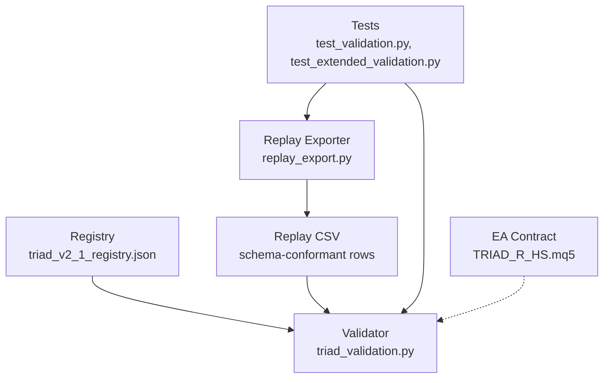
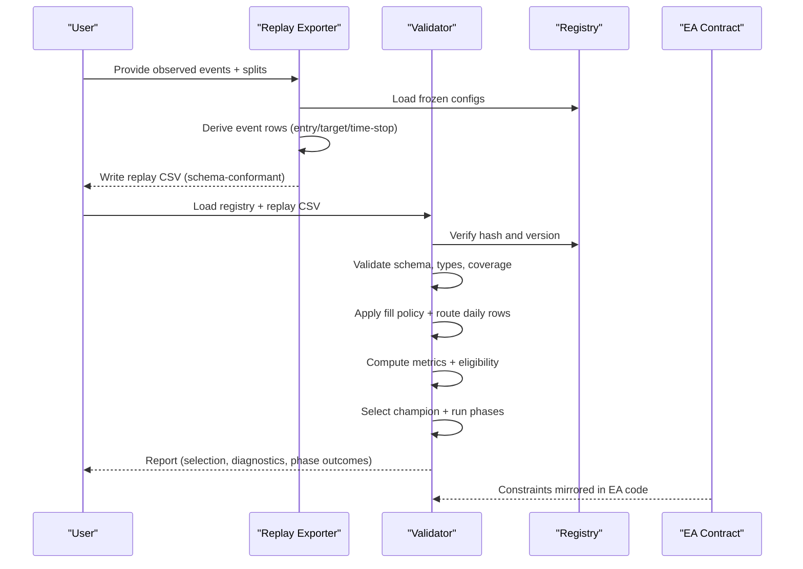
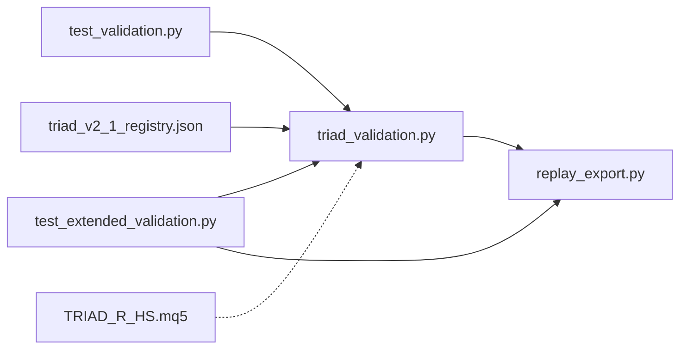

# Configuration Validation

<cite>
**Referenced Files in This Document**
- [triad_validation.py](file://tools/triad_validation.py)
- [replay_export.py](file://tools/replay_export.py)
- [test_validation.py](file://tests/test_validation.py)
- [test_extended_validation.py](file://tests/test_extended_validation.py)
- [triad_v2_1_registry.json](file://validation/triad_v2_1_registry.json)
- [TRIAD_R_HS.mq5](file://MQL5/Experts/TRIAD_R_HS/TRIAD_R_HS.mq5)
</cite>

## Table of Contents
1. [Introduction](#introduction)
2. [Project Structure](#project-structure)
3. [Core Components](#core-components)
4. [Architecture Overview](#architecture-overview)
5. [Detailed Component Analysis](#detailed-component-analysis)
6. [Dependency Analysis](#dependency-analysis)
7. [Performance Considerations](#performance-considerations)
8. [Troubleshooting Guide](#troubleshooting-guide)
9. [Conclusion](#conclusion)
10. [Appendices](#appendices)

## Introduction
This document explains the configuration validation mechanisms used to ensure that TRIAD-R V2.1 configurations and replay data are valid, consistent, and compliant with business rules before any selection or deployment. It covers:
- Parameter constraints (ranges, types, allowed values)
- Business rule enforcement (fill policy, routing, thresholds)
- Schema validation (CSV headers, required fields, cross-field checks)
- Integrity checks before selection/deployment (registry hash, coverage, split boundaries)
- Error handling and feedback for invalid configurations
- Examples of valid and invalid configurations with failure explanations and resolutions

The system is designed so that a frozen registry defines all candidate configurations and validation rules. Replay exports must conform to a strict schema and full calendar coverage. The validator enforces conservative fill assumptions, per-combination eligibility, aggregate gates, simulation phase gates, and drawdown-related requirements.

## Project Structure
The validation pipeline spans three main areas:
- Registry and validator: defines parameters, thresholds, policies, and selection logic
- Replay exporter: converts observed events into the exact CSV schema consumed by the validator
- Tests: assert correctness of registry integrity, schema conformance, routing, metrics, and phase simulations

**Diagram sources**
- [triad_validation.py:278-305](file://tools/triad_validation.py#L278-L305)
- [replay_export.py:140-150](file://tools/replay_export.py#L140-L150)
- [triad_v2_1_registry.json:1-20](file://validation/triad_v2_1_registry.json#L1-L20)
- [TRIAD_R_HS.mq5:3569-3587](file://MQL5/Experts/TRIAD_R_HS/TRIAD_R_HS.mq5#L3569-L3587)

**Section sources**
- [triad_validation.py:278-305](file://tools/triad_validation.py#L278-L305)
- [replay_export.py:1-122](file://tools/replay_export.py#L1-L122)
- [triad_v2_1_registry.json:1-20](file://validation/triad_v2_1_registry.json#L1-L20)
- [TRIAD_R_HS.mq5:3569-3587](file://MQL5/Experts/TRIAD_R_HS/TRIAD_R_HS.mq5#L3569-L3587)

## Core Components
- CandidateConfig: immutable parameter set defining each strategy variant (range bands, ATR bands, time stops, profile, risk fraction, target R, breakeven policy).
- FillPolicy: conservative assumptions about pending orders, minimum trade-through ticks, partial fills, and stress multipliers.
- ValidationThresholds: point-estimate and simulation-based gates for combination and aggregate performance, pass probabilities, and drawdown limits.
- SimulationSettings: simulation parameters including paths, bootstrap samples, block days, daily/weekly stops, and random seed.
- ReplayRow: normalized row representing one event outcome for a configuration, split, day, sequence, and combination.
- ValidationError: exception type raised when inputs violate schema, ranges, or business rules.

Key responsibilities:
- Enumerate exactly 160 unique configurations from declared bands and profiles
- Validate replay CSV schema, field types, and cross-field consistency
- Enforce full coverage across splits, combinations, and days
- Apply fill policy and compute metrics per combination and aggregate
- Route multiple signals per day using priorities, cost/R, sequence, and stable session index
- Select champion based on independent combination eligibility and aggregate gates
- Run Phase 1 and Phase 2 simulations with confidence bounds and drawdown tracking

**Section sources**
- [triad_validation.py:98-181](file://tools/triad_validation.py#L98-L181)
- [triad_validation.py:242-267](file://tools/triad_validation.py#L242-L267)
- [triad_validation.py:360-437](file://tools/triad_validation.py#L360-L437)
- [triad_validation.py:646-708](file://tools/triad_validation.py#L646-L708)
- [triad_validation.py:720-748](file://tools/triad_validation.py#L720-L748)
- [triad_validation.py:766-794](file://tools/triad_validation.py#L766-L794)

## Architecture Overview
The validation architecture enforces integrity at every stage:
- Registry integrity: SHA-256 payload hash ensures no tampering; mismatch raises an error
- Schema conformance: replay CSV must match exact header and field types
- Coverage completeness: every configuration and combination must have rows for each split and day
- Fill policy: only fully filled trades through by at least one tick count as fills; stressed scenario may reject profitable limits deterministically
- Routing: one signal per day per combination; ties broken by lower cost/R, earlier sequence, stable session index
- Eligibility: per-combination thresholds applied independently; failing combinations disabled before ranking
- Selection: champion chosen by lexicographic config_id among those passing all gates and having positive familywise-adjusted bootstrap lower bound
- Simulation: Phase 1 and Phase 2 pass probabilities, joint pass probability, qualifying-day targets, drawdown statistics

**Diagram sources**
- [replay_export.py:1-122](file://tools/replay_export.py#L1-L122)
- [triad_validation.py:317-331](file://tools/triad_validation.py#L317-L331)
- [triad_validation.py:360-437](file://tools/triad_validation.py#L360-L437)
- [triad_validation.py:646-708](file://tools/triad_validation.py#L646-L708)
- [triad_validation.py:720-748](file://tools/triad_validation.py#L720-L748)
- [triad_validation.py:1530-1554](file://tools/triad_validation.py#L1530-L1554)
- [TRIAD_R_HS.mq5:3569-3587](file://MQL5/Experts/TRIAD_R_HS/TRIAD_R_HS.mq5#L3569-L3587)

## Detailed Component Analysis

### Registry and Parameter Constraints
- Frozen registry contains schema version, registry version, canonical strategy reference, selection and holdout split names, selection rule description, fill policy, thresholds, simulation settings, CSV fields, and 160 configurations.
- Each configuration includes:
  - range_low_percentile and range_high_percentile
  - atr_low_percentile and atr_high_percentile
  - time_stop_minutes (including session-only zero)
  - profile (A/B/C/D), which maps to risk_fraction and target_r
  - move_stop_to_entry_after_confirmed_1r (breakeven policy)
- Registry integrity:
  - load_registry computes and compares SHA-256 payload hash; any mutation triggers a validation error
  - build_registry enumerates exactly 160 unique configurations; assertion ensures matrix size and uniqueness

Parameter constraints enforced:
- Allowed splits: TRAIN, WALK_FORWARD, HOLDOUT
- Allowed combinations: EURUSD_LONDON, GBPUSD_LONDON, USDJPY_NEW_YORK
- Time stops: 30, 45, 60, 90 minutes, or 0 for session-only
- Profiles map to specific risk fractions and target R values
- Boolean fields strictly parsed as true/false or 1/0

Examples:
- Valid configuration: range bands within declared sets, ATR bands within declared sets, time stop in allowed list, profile mapped to correct risk and target R, boolean flags correctly set
- Invalid configuration: unknown combination name, split not in allowed set, non-finite numeric value, negative sequence or trade_through_ticks, duplicate replay row key

Resolutions:
- Correct split and combination names
- Ensure finite numeric values and non-negative integers where required
- Remove duplicates and ensure unique keys per replay row

**Section sources**
- [triad_validation.py:49-95](file://tools/triad_validation.py#L49-L95)
- [triad_validation.py:98-181](file://tools/triad_validation.py#L98-L181)
- [triad_validation.py:242-267](file://tools/triad_validation.py#L242-L267)
- [triad_validation.py:317-331](file://tools/triad_validation.py#L317-L331)
- [triad_v2_1_registry.json:1-20](file://validation/triad_v2_1_registry.json#L1-L20)

### Replay CSV Schema and Cross-Field Validation
Schema fields include identifiers, flags, counts, cash and R metrics, costs, and error flags. Validation enforces:
- Exact header match against CSV_FIELDS
- Strict parsing of booleans and floats
- Non-negative constraints for certain fields (e.g., risk_cash_full/half, mae_cash_full/half, spread_r, slippage_r, commission_r)
- Finite numeric constraints for net_r and cash fields
- Unique key constraint per (config_id, split, server_day, sequence, event_id)
- Cross-field consistency: activated candidates must have positive cash-risk values

Coverage validation:
- Every configuration and combination must have rows for both WALK_FORWARD and HOLDOUT splits
- Calendar-day coverage must be identical across all configuration/combination pairs within a split
- Missing combinations or differing day sets raise validation errors

Examples:
- Valid CSV: matches schema, has complete coverage, consistent day sets, positive risk for activated candidates
- Invalid CSV: missing header fields, unknown combination, negative sequence, duplicate key, activated candidate with zero risk

Resolutions:
- Align CSV headers to schema
- Add missing rows for all combinations and days
- Fix negative or invalid values
- Ensure activated candidates carry positive risk

**Section sources**
- [triad_validation.py:360-437](file://tools/triad_validation.py#L360-L437)
- [triad_validation.py:440-473](file://tools/triad_validation.py#L440-L473)
- [test_validation.py:125-132](file://tests/test_validation.py#L125-L132)

### Fill Policy and Business Rules
Fill policy enforces conservative assumptions:
- Minimum trade-through ticks: limit must trade through by at least one tick to count as a fill
- Minimum fill fraction: partial fills below threshold are excluded
- Stressed scenario: deterministic rejection of some profitable limits and increased modeled costs via spread/slippage multipliers
- AppliedTrade adjusts net R by extra cost under stress

Routing rules:
- One signal per day per combination; router selects winner using priority, lower cost/R, earlier sequence, stable session index
- Demoted rows retain candidate flag for audit but are marked inactive and zeroed risk/cash

Eligibility and thresholds:
- Per-combination thresholds: minimum fills, expectancy R, profit factor
- Aggregate thresholds: minimum aggregate fills, expectancy R, profit factor
- Simulation thresholds: phase pass probabilities, joint pass probability, qualifying-day targets, maximum drawdown fraction

Examples:
- Valid fill: candidate active, limit touched, trade-through ticks sufficient, fill fraction meets threshold
- Invalid fill: activation refused, limit not touched, insufficient trade-through ticks, partial fill below threshold

Resolutions:
- Ensure upstream replay reports accurate limit_touched and trade_through_ticks
- Adjust priorities and cost/R to favor better opportunities
- Increase sample size or improve entry conditions to meet minimum fills

**Section sources**
- [triad_validation.py:112-128](file://tools/triad_validation.py#L112-L128)
- [triad_validation.py:480-497](file://tools/triad_validation.py#L480-L497)
- [triad_validation.py:646-708](file://tools/triad_validation.py#L646-L708)
- [triad_validation.py:720-748](file://tools/triad_validation.py#L720-L748)
- [triad_validation.py:766-794](file://tools/triad_validation.py#L766-L794)
- [test_extended_validation.py:106-197](file://tests/test_extended_validation.py#L106-L197)

### Champion Selection and Simulation Gates
Selection process:
- Reject configurations with rule violations or operational errors
- Independently evaluate combinations; disable failing combinations before portfolio ranking
- Require aggregate point-estimate gates to pass
- Run Phase 1 and Phase 2 simulations with bootstrap confidence bounds
- Choose champion by maximum joint two-phase pass probability, then minimum P99 drawdown, then minimum median completion days, then lexicographically smallest config_id
- Selected configuration must retain positive familywise-adjusted bootstrap lower bound

Simulation details:
- Paths and bootstrap samples configurable
- Block days for resampling
- Daily and weekly stop fractions
- Inactivity days and maximum phase calendar days
- Confidence bounds reported for joint pass probability

Examples:
- Valid selection: passes all gates, positive adjusted lower bound, robust across years
- Invalid selection: holdout rows supplied to selection, insufficient fills, failed thresholds, firm floor breach

Resolutions:
- Remove holdout rows from selection input
- Improve entry conditions or increase sample coverage
- Adjust thresholds if appropriate and documented
- Ensure firm floor and drawdown constraints are met

**Section sources**
- [triad_validation.py:1530-1554](file://tools/triad_validation.py#L1530-L1554)
- [triad_validation.py:521-544](file://tools/triad_validation.py#L521-L544)
- [test_validation.py:178-273](file://tests/test_validation.py#L178-L273)
- [test_extended_validation.py:300-406](file://tests/test_extended_validation.py#L300-L406)

### Replay Exporter Validation and Contract Enforcement
The exporter validates observed events and derives replay rows:
- Validates direction, exit reasons, and contract fields
- Applies frozen EA arithmetic: entry at retracement, stop within ATR band, cost gate, lot rounding anchored at minimum volume, cash risk/net target computation, time-stop selection from horizon prices, breakeven policy
- Expands events to full calendar coverage for every configuration and combination
- Enforces split cut predeclaration; events outside declared ranges raise validation errors
- Rejects weak displacement, small accounts below minimum volume, and duplicate events

Examples:
- Valid export: derived rows match EA contract, full coverage, split boundaries respected
- Invalid export: unknown combination, events outside declared splits, duplicate event keys, weak displacement leading to activation refusal

Resolutions:
- Ensure upstream replay produces correct observed events
- Respect split boundaries and provide full coverage
- Fix duplicate keys and invalid fields

**Section sources**
- [replay_export.py:1-122](file://tools/replay_export.py#L1-L122)
- [replay_export.py:433-455](file://tools/replay_export.py#L433-L455)
- [test_extended_validation.py:448-555](file://tests/test_extended_validation.py#L448-L555)

### EA Contract Alignment
The MQL5 Expert Advisor enforces input contracts mirroring the validator’s assumptions:
- Cost assumptions must not be weaker than canonical defaults
- Operational contract: calendar offsets, news blocking, quote age, deviation, latency, request limits
- Risk contract: firm floor reserve, internal daily/weekly stops, drawdown reduce/shutdown percentages
- Symbol mapping constraints prevent overlapping symbols

These constraints ensure live behavior aligns with offline validation.

**Section sources**
- [TRIAD_R_HS.mq5:3569-3587](file://MQL5/Experts/TRIAD_R_HS/TRIAD_R_HS.mq5#L3569-L3587)

## Dependency Analysis
Components depend on each other as follows:
- replay_export.py depends on triad_validation.py for shared constants, types, and functions
- tests depend on both modules to assert behavior
- registry JSON is generated and validated by triad_validation.py
- EA code mirrors constraints enforced by the validator

**Diagram sources**
- [replay_export.py:140-150](file://tools/replay_export.py#L140-L150)
- [triad_validation.py:278-305](file://tools/triad_validation.py#L278-L305)
- [test_validation.py:9-29](file://tests/test_validation.py#L9-L29)
- [test_extended_validation.py:19-47](file://tests/test_extended_validation.py#L19-L47)
- [triad_v2_1_registry.json:1-20](file://validation/triad_v2_1_registry.json#L1-L20)
- [TRIAD_R_HS.mq5:3569-3587](file://MQL5/Experts/TRIAD_R_HS/TRIAD_R_HS.mq5#L3569-L3587)

**Section sources**
- [replay_export.py:140-150](file://tools/replay_export.py#L140-L150)
- [triad_validation.py:278-305](file://tools/triad_validation.py#L278-L305)
- [test_validation.py:9-29](file://tests/test_validation.py#L9-L29)
- [test_extended_validation.py:19-47](file://tests/test_extended_validation.py#L19-L47)

## Performance Considerations
- Bootstrap samples and path counts affect runtime; higher values increase accuracy but require more computation
- Block days influence resampling stability; larger blocks reduce variance but may reduce effective sample size
- Fill policy stress multipliers can reduce effective fills; tune conservative assumptions based on realistic market conditions
- Routing prioritization reduces redundant signals per day, improving efficiency and clarity

[No sources needed since this section provides general guidance]

## Troubleshooting Guide
Common validation failures and resolutions:
- Registry hash mismatch: indicates tampered or outdated registry; regenerate or restore committed registry
- CSV header mismatch: update CSV to match schema; run schema command to print expected fields
- Unknown combination or split: use allowed values defined in validator
- Negative or non-finite numeric values: correct input data to meet constraints
- Duplicate replay row key: remove duplicates or adjust event IDs
- Activated candidate with zero risk: ensure positive cash-risk for activated entries
- Missing coverage: add no-candidate rows for all combinations and days in both splits
- Holdout rows in selection: exclude holdout data from selection input
- Insufficient fills or failed thresholds: improve entry conditions, increase sample size, or adjust thresholds appropriately
- Firm floor breach: tighten risk controls or improve performance to avoid breaching overall floor

Error handling:
- ValidationError exceptions are raised for schema, range, and business rule violations
- Reports expose diagnostics such as fill rates, activation refusals, rejected candidate counts, and phase outcomes

**Section sources**
- [triad_validation.py:317-331](file://tools/triad_validation.py#L317-L331)
- [triad_validation.py:360-437](file://tools/triad_validation.py#L360-L437)
- [triad_validation.py:440-473](file://tools/triad_validation.py#L440-L473)
- [triad_validation.py:646-708](file://tools/triad_validation.py#L646-L708)
- [test_validation.py:103-132](file://tests/test_validation.py#L103-L132)
- [test_extended_validation.py:189-197](file://tests/test_extended_validation.py#L189-L197)
- [test_extended_validation.py:546-573](file://tests/test_extended_validation.py#L546-L573)

## Conclusion
The configuration validation system ensures rigorous integrity checks across registry, replay data, and business rules. By enforcing parameter constraints, schema compliance, coverage completeness, conservative fill assumptions, and simulation gates, it prevents invalid or biased selections and aligns offline validation with live EA behavior. Robust error handling and detailed diagnostics enable quick resolution of issues and continuous improvement of strategy performance.

[No sources needed since this section summarizes without analyzing specific files]

## Appendices

### Example Valid Configuration
- Range bands within declared sets
- ATR bands within declared sets
- Time stop in allowed list (including session-only)
- Profile mapped to correct risk fraction and target R
- Boolean flags correctly set
- Replay CSV with full coverage and consistent day sets

### Example Invalid Configuration
- Unknown combination name
- Split not in allowed set
- Non-finite numeric value
- Negative sequence or trade-through ticks
- Duplicate replay row key
- Activated candidate with zero risk

### Resolution Steps
- Correct field values to match allowed sets and constraints
- Ensure full coverage across splits and combinations
- Remove duplicates and fix invalid types
- Adjust upstream replay to report accurate activation and fill metrics

[No sources needed since this section provides general examples without analyzing specific files]