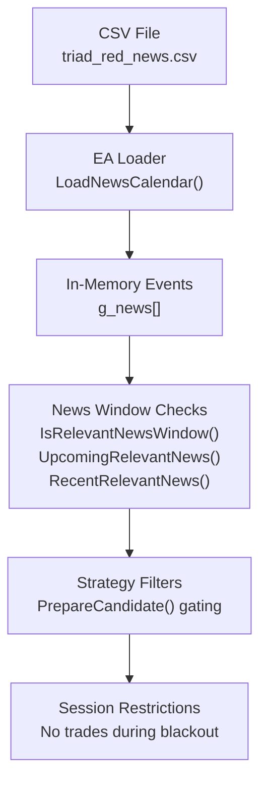
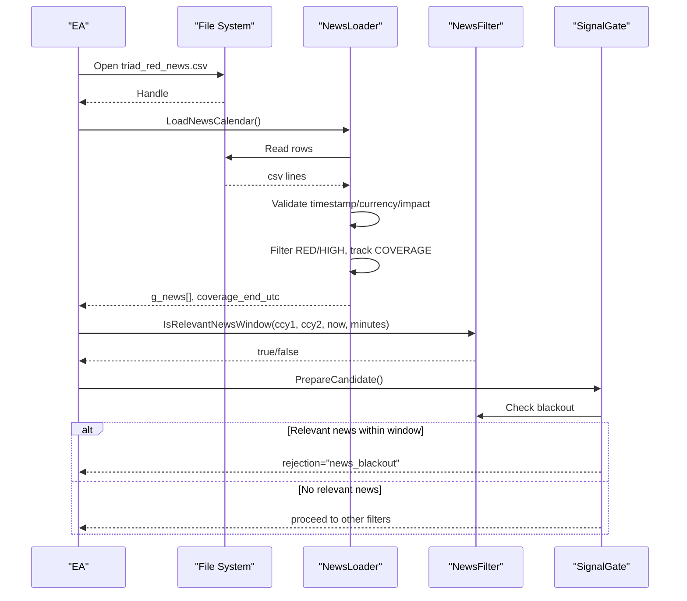
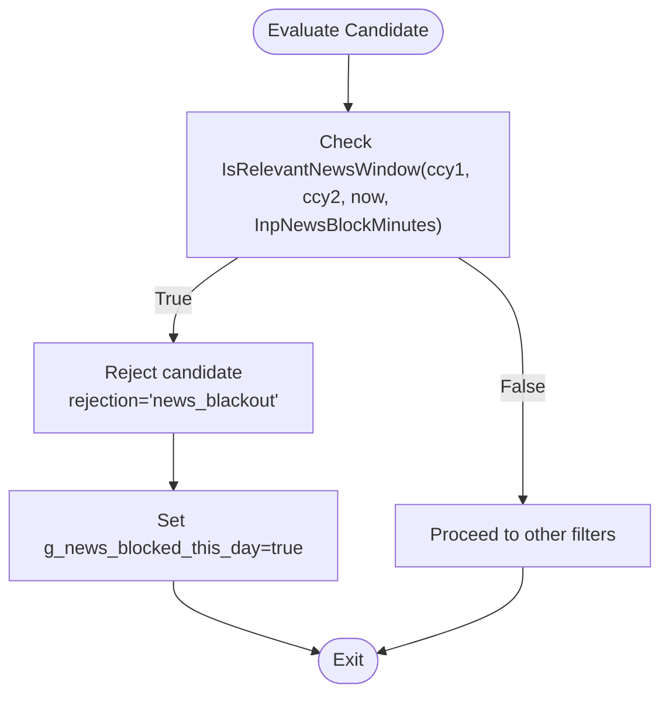
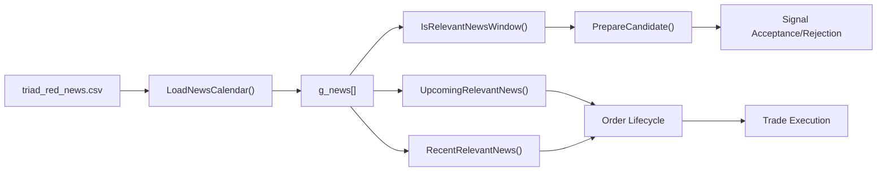

# Economic Calendar Format

<cite>
**Referenced Files in This Document**
- [triad_red_news.csv.example](file://MQL5/Files/triad_red_news.csv.example)
- [TRIAD_R_HS.mq5](file://MQL5/Experts/TRIAD_R_HS/TRIAD_R_HS.mq5)
- [TRIAD_SCREEN.mq5](file://MQL5/Experts/TRIAD_SCREEN/TRIAD_SCREEN.mq5)
</cite>

## Table of Contents
1. [Introduction](#introduction)
2. [Project Structure](#project-structure)
3. [Core Components](#core-components)
4. [Architecture Overview](#architecture-overview)
5. [Detailed Component Analysis](#detailed-component-analysis)
6. [Dependency Analysis](#dependency-analysis)
7. [Performance Considerations](#performance-considerations)
8. [Troubleshooting Guide](#troubleshooting-guide)
9. [Conclusion](#conclusion)
10. [Appendices](#appendices)

## Introduction
This document specifies the economic calendar CSV format consumed by the TRIAD-R system and explains how red news events are processed to protect trading sessions. It covers required columns, data types, date formats, event classification standards, blackout period calculations, and integration with the strategy’s news filtering mechanism. It also documents the relationship between calendar events and trading session restrictions, provides examples of properly formatted files, common formatting errors, and best practices for maintaining accurate calendars.

## Project Structure
The economic calendar is a CSV file placed under MQL5 Files and referenced by the Expert Advisors (EAs). The EAs load, validate, and enforce blackout windows around high-impact news events for relevant currencies.

**Diagram sources**
- [TRIAD_R_HS.mq5:836-918](file://MQL5/Experts/TRIAD_R_HS/TRIAD_R_HS.mq5#L836-L918)
- [TRIAD_R_HS.mq5:939-1000](file://MQL5/Experts/TRIAD_R_HS/TRIAD_R_HS.mq5#L939-L1000)
- [TRIAD_R_HS.mq5:2428-2435](file://MQL5/Experts/TRIAD_R_HS/TRIAD_R_HS.mq5#L2428-L2435)

**Section sources**
- [triad_red_news.csv.example:1-7](file://MQL5/Files/triad_red_news.csv.example#L1-L7)
- [TRIAD_R_HS.mq5:79-85](file://MQL5/Experts/TRIAD_R_HS/TRIAD_R_HS.mq5#L79-L85)

## Core Components
- CSV schema: utc_time, currency, impact, title
- Event classification: RED or HIGH; COVERAGE marker for operator verification
- Date/time format: UTC timestamps in YYYY.MM.DD HH:MM
- Blackout windows: configurable minutes before and after relevant news
- Coverage enforcement: minimum future coverage horizon required at runtime

Key behaviors implemented in the EAs:
- Load only RED/HIGH rows; ignore others
- Validate timestamps and currency codes strictly
- Track declared coverage end via COVERAGE row
- Enforce blackout windows using IsRelevantNewsWindow, UpcomingRelevantNews, RecentRelevantNews
- Block signals and orders when relevant news is within configured windows

**Section sources**
- [TRIAD_R_HS.mq5:793-797](file://MQL5/Experts/TRIAD_R_HS/TRIAD_R_HS.mq5#L793-L797)
- [TRIAD_R_HS.mq5:836-918](file://MQL5/Experts/TRIAD_R_HS/TRIAD_R_HS.mq5#L836-L918)
- [TRIAD_R_HS.mq5:920-1000](file://MQL5/Experts/TRIAD_R_HS/TRIAD_R_HS.mq5#L920-L1000)
- [TRIAD_SCREEN.mq5:852-922](file://MQL5/Experts/TRIAD_SCREEN/TRIAD_SCREEN.mq5#L852-L922)

## Architecture Overview
The EA loads the CSV once per initialization, validates each row, and stores relevant events in memory. During signal evaluation and order lifecycle, it checks whether any relevant news falls within the configured blackout window for the instrument’s currencies. If so, signals are rejected and pending orders are canceled.

**Diagram sources**
- [TRIAD_R_HS.mq5:836-918](file://MQL5/Experts/TRIAD_R_HS/TRIAD_R_HS.mq5#L836-L918)
- [TRIAD_R_HS.mq5:939-1000](file://MQL5/Experts/TRIAD_R_HS/TRIAD_R_HS.mq5#L939-L1000)
- [TRIAD_R_HS.mq5:2428-2435](file://MQL5/Experts/TRIAD_R_HS/TRIAD_R_HS.mq5#L2428-L2435)

## Detailed Component Analysis

### CSV Schema and Validation
- Columns:
  - utc_time: UTC timestamp string in format YYYY.MM.DD HH:MM
  - currency: 3-letter uppercase ISO code (e.g., USD, EUR, GBP, JPY), or ALL for coverage markers
  - impact: RED or HIGH for events; COVERAGE for operator-verified coverage end
  - title: Free-form description of the event
- Validation rules enforced by the loader:
  - Timestamp must match exact length and separators; otherwise invalid
  - Currency must be exactly three uppercase letters
  - Only RED or HIGH rows are loaded into memory
  - COVERAGE rows must have currency=ALL and valid timestamp; they set the declared coverage end
  - Any invalid row aborts loading and returns false unless calendar requirement is disabled

Example rows are provided in the example file.

**Section sources**
- [triad_red_news.csv.example:1-7](file://MQL5/Files/triad_red_news.csv.example#L1-L7)
- [TRIAD_R_HS.mq5:799-834](file://MQL5/Experts/TRIAD_R_HS/TRIAD_R_HS.mq5#L799-L834)
- [TRIAD_R_HS.mq5:836-918](file://MQL5/Experts/TRIAD_R_HS/TRIAD_R_HS.mq5#L836-L918)
- [TRIAD_SCREEN.mq5:852-922](file://MQL5/Experts/TRIAD_SCREEN/TRIAD_SCREEN.mq5#L852-L922)

### Red News Processing and Blackout Windows
- Blackout windows:
  - Pre-event window: InpNewsBlockMinutes (default 30)
  - Post-event window: InpNewsFlatMinutes (default 15)
  - Safety lead: small constant added to avoid boundary edge cases
- Relevance check:
  - For a given symbol pair (ccy1, ccy2), if any stored event matches either currency and falls within ±(window + safety lead), the system considers itself inside a relevant news window
- Integration points:
  - Signal gating: PrepareCandidate rejects with rejection="news_blackout" when inside a relevant window
  - Order management: Pending orders are canceled if a relevant news event occurs while active
  - Recheck logic: Strategy rechecks conditions and may cancel or adjust positions due to upcoming/recent news

**Diagram sources**
- [TRIAD_R_HS.mq5:939-954](file://MQL5/Experts/TRIAD_R_HS/TRIAD_R_HS.mq5#L939-L954)
- [TRIAD_R_HS.mq5:2428-2435](file://MQL5/Experts/TRIAD_R_HS/TRIAD_R_HS.mq5#L2428-L2435)

**Section sources**
- [TRIAD_R_HS.mq5:79-85](file://MQL5/Experts/TRIAD_R_HS/TRIAD_R_HS.mq5#L79-L85)
- [TRIAD_R_HS.mq5:939-1000](file://MQL5/Experts/TRIAD_R_HS/TRIAD_R_HS.mq5#L939-L1000)
- [TRIAD_R_HS.mq5:2428-2435](file://MQL5/Experts/TRIAD_R_HS/TRIAD_R_HS.mq5#L2428-L2435)
- [TRIAD_R_HS.mq5:3052-3053](file://MQL5/Experts/TRIAD_R_HS/TRIAD_R_HS.mq5#L3052-L3053)
- [TRIAD_R_HS.mq5:3146-3151](file://MQL5/Experts/TRIAD_R_HS/TRIAD_R_HS.mq5#L3146-L3151)

### Coverage Enforcement and Staleness Handling
- Coverage marker:
  - A row with impact=COVERAGE and currency=ALL declares the verified coverage end time
- Runtime check:
  - At runtime, the EA verifies that the declared coverage end is at least InpRequiredNewsCoverageHours ahead of current UTC time
  - If not, it logs an error and treats the calendar as insufficient
- Behavior:
  - When calendar is unavailable or stale, blackout checks default to allowing trading (fail-open for news filter), but the EA logs a staleness error

**Section sources**
- [TRIAD_R_HS.mq5:793-797](file://MQL5/Experts/TRIAD_R_HS/TRIAD_R_HS.mq5#L793-L797)
- [TRIAD_R_HS.mq5:836-918](file://MQL5/Experts/TRIAD_R_HS/TRIAD_R_HS.mq5#L836-L918)
- [TRIAD_R_HS.mq5:920-937](file://MQL5/Experts/TRIAD_R_HS/TRIAD_R_HS.mq5#L920-L937)
- [TRIAD_SCREEN.mq5:852-922](file://MQL5/Experts/TRIAD_SCREEN/TRIAD_SCREEN.mq5#L852-L922)

### Relationship to Trading Session Restrictions
- Sessions:
  - London and New York sessions define reference ranges and entry windows
- Interaction with news:
  - Even within valid session windows, signals can be blocked by news blackouts
  - The blackout check is independent of session boundaries and applies whenever relevant news is imminent or recent for the instrument’s currencies
- Practical effect:
  - During high-impact releases, no new entries are taken and existing limit orders may be canceled to avoid slippage and uncertainty

**Section sources**
- [TRIAD_R_HS.mq5:754-779](file://MQL5/Experts/TRIAD_R_HS/TRIAD_R_HS.mq5#L754-L779)
- [TRIAD_R_HS.mq5:2428-2435](file://MQL5/Experts/TRIAD_R_HS/TRIAD_R_HS.mq5#L2428-L2435)
- [TRIAD_R_HS.mq5:3052-3053](file://MQL5/Experts/TRIAD_R_HS/TRIAD_R_HS.mq5#L3052-L3053)

### Example CSV Content
A minimal, correctly formatted example includes:
- Header row: utc_time,currency,impact,title
- One or more RED/HIGH event rows with UTC timestamps and currency codes
- A final COVERAGE row with ALL currency indicating the verified coverage end

Use the provided example file as a template.

**Section sources**
- [triad_red_news.csv.example:1-7](file://MQL5/Files/triad_red_news.csv.example#L1-L7)

### Common Formatting Errors
- Invalid timestamp format or separators
- Non-uppercase or incorrect-length currency codes
- Missing or incorrect impact values (must be RED, HIGH, or COVERAGE)
- COVERAGE row missing currency=ALL or having invalid timestamp
- Trailing whitespace or extra columns causing parse failures
- Insufficient coverage: missing COVERAGE row or coverage end too far in the past relative to current time

These errors cause loader failure or runtime warnings/errors.

**Section sources**
- [TRIAD_R_HS.mq5:799-834](file://MQL5/Experts/TRIAD_R_HS/TRIAD_R_HS.mq5#L799-L834)
- [TRIAD_R_HS.mq5:836-918](file://MQL5/Experts/TRIAD_R_HS/TRIAD_R_HS.mq5#L836-L918)
- [TRIAD_SCREEN.mq5:852-922](file://MQL5/Experts/TRIAD_SCREEN/TRIAD_SCREEN.mq5#L852-L922)

### Best Practices for Maintaining Accurate Calendars
- Always include a COVERAGE row with currency=ALL and a timestamp at least InpRequiredNewsCoverageHours ahead of current time
- Use strict UTC timestamps in YYYY.MM.DD HH:MM format
- Ensure all RED/HIGH events for major sessions are included for instruments traded by the EA
- Keep currency codes uppercase and exactly three characters
- Avoid blank rows or malformed lines; these will abort loading
- Regularly verify coverage through automated checks and alerting on staleness

[No sources needed since this section provides general guidance]

## Dependency Analysis
The economic calendar integrates tightly with the EA’s signal pipeline and order management:

**Diagram sources**
- [TRIAD_R_HS.mq5:836-918](file://MQL5/Experts/TRIAD_R_HS/TRIAD_R_HS.mq5#L836-L918)
- [TRIAD_R_HS.mq5:939-1000](file://MQL5/Experts/TRIAD_R_HS/TRIAD_R_HS.mq5#L939-L1000)
- [TRIAD_R_HS.mq5:2428-2435](file://MQL5/Experts/TRIAD_R_HS/TRIAD_R_HS.mq5#L2428-L2435)
- [TRIAD_R_HS.mq5:3052-3053](file://MQL5/Experts/TRIAD_R_HS/TRIAD_R_HS.mq5#L3052-L3053)

**Section sources**
- [TRIAD_R_HS.mq5:836-918](file://MQL5/Experts/TRIAD_R_HS/TRIAD_R_HS.mq5#L836-L918)
- [TRIAD_R_HS.mq5:939-1000](file://MQL5/Experts/TRIAD_R_HS/TRIAD_R_HS.mq5#L939-L1000)
- [TRIAD_R_HS.mq5:2428-2435](file://MQL5/Experts/TRIAD_R_HS/TRIAD_R_HS.mq5#L2428-L2435)
- [TRIAD_R_HS.mq5:3052-3053](file://MQL5/Experts/TRIAD_R_HS/TRIAD_R_HS.mq5#L3052-L3053)

## Performance Considerations
- CSV parsing runs once per initialization; keep the file concise and well-formed
- News window checks iterate over stored events; typical sizes are manageable
- Avoid excessive trailing spaces or empty lines to prevent unnecessary validation overhead
- Ensure coverage is updated regularly to avoid repeated staleness logging

[No sources needed since this section provides general guidance]

## Troubleshooting Guide
Common issues and diagnostics:
- NEWS_FILE_OPEN: Unable to open the CSV file; verify path and permissions
- NEWS_ROW_INVALID: Malformed row; check timestamp, currency, and impact fields
- NEWS_COVERAGE_INSUFFICIENT: Coverage end too far in the past; update COVERAGE row
- NEWS_RUNTIME_COVERAGE_STALE: Runtime coverage expired; refresh the calendar
- NEWS_BLOCK_INACTIVITY_RISK: Consecutive days where news blackouts prevented trading; review calendar coverage and session alignment

Operational tips:
- Confirm server UTC offset configuration matches broker settings
- Verify that InpRequireNewsCalendar aligns with your operational policy
- Monitor logs for staleness and insufficient coverage alerts

**Section sources**
- [TRIAD_R_HS.mq5:836-918](file://MQL5/Experts/TRIAD_R_HS/TRIAD_R_HS.mq5#L836-L918)
- [TRIAD_R_HS.mq5:920-937](file://MQL5/Experts/TRIAD_R_HS/TRIAD_R_HS.mq5#L920-L937)
- [TRIAD_R_HS.mq5:3470-3489](file://MQL5/Experts/TRIAD_R_HS/TRIAD_R_HS.mq5#L3470-L3489)

## Conclusion
The TRIAD-R economic calendar CSV provides a robust mechanism to protect trading sessions from high-impact news volatility. By enforcing strict schemas, validating coverage, and integrating blackout windows into signal and order lifecycles, the system minimizes exposure to unpredictable market moves around major releases. Maintaining accurate, up-to-date calendars and monitoring staleness alerts ensures reliable operation aligned with session-based strategies.

[No sources needed since this section summarizes without analyzing specific files]

## Appendices

### Appendix A: Configuration Inputs Related to News
- InpNewsCsvFile: Name of the CSV file to load
- InpRequireNewsCalendar: Whether to require a valid calendar at runtime
- InpRequiredNewsCoverageHours: Minimum future coverage horizon
- InpNewsBlockMinutes: Pre-event blackout window
- InpNewsFlatMinutes: Post-event flat period

**Section sources**
- [TRIAD_R_HS.mq5:79-85](file://MQL5/Experts/TRIAD_R_HS/TRIAD_R_HS.mq5#L79-L85)

### Appendix B: Data Structures Used by the News Module
- NewsEvent: Stores utc_time, currency, title
- Global array g_news[]: Holds loaded events
- Coverage tracking: g_news_coverage_end_utc

**Section sources**
- [TRIAD_R_HS.mq5:151-156](file://MQL5/Experts/TRIAD_R_HS/TRIAD_R_HS.mq5#L151-L156)
- [TRIAD_R_HS.mq5:214-228](file://MQL5/Experts/TRIAD_R_HS/TRIAD_R_HS.mq5#L214-L228)