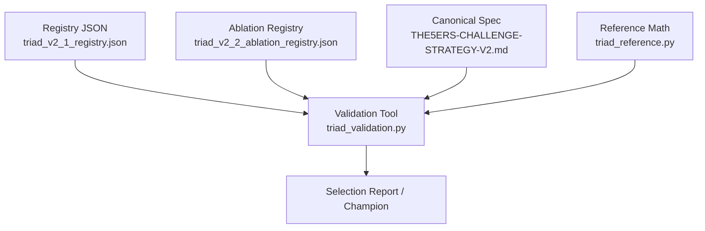
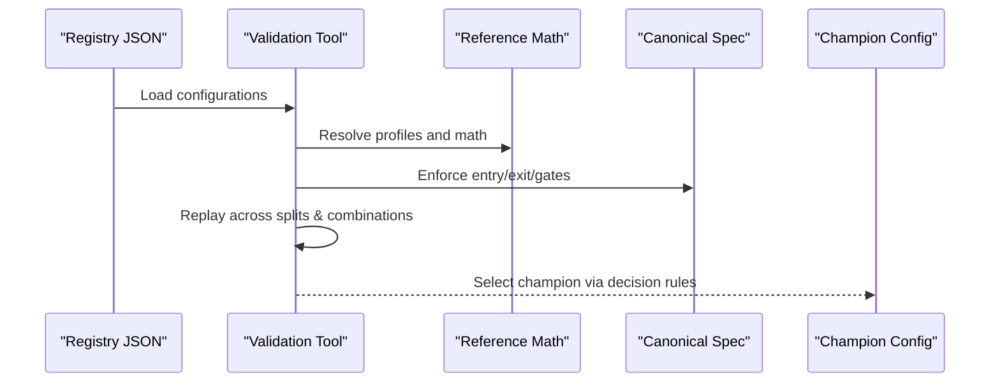
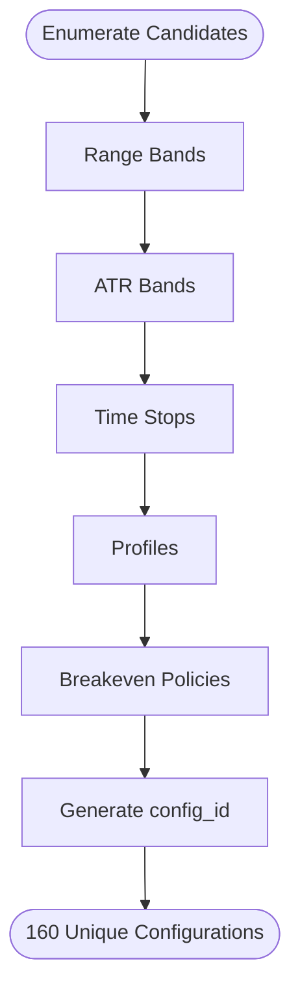

# Strategy Registries

<cite>
**Referenced Files in This Document**
- [triad_v2_1_registry.json](file://validation/triad_v2_1_registry.json)
- [triad_v2_2_ablation_registry.json](file://validation/triad_v2_2_ablation_registry.json)
- [THE5ERS-CHALLENGE-STRATEGY-V2.md](file://THE5ERS-CHALLENGE-STRATEGY-V2.md)
- [triad_validation.py](file://tools/triad_validation.py)
- [triad_reference.py](file://tests/triad_reference.py)
- [test_source_contract.py](file://tests/test_source_contract.py)
</cite>

## Table of Contents
1. Introduction
2. Project Structure
3. Core Components
4. Architecture Overview
5. Detailed Component Analysis
6. Dependency Analysis
7. Performance Considerations
8. Troubleshooting Guide
9. Conclusion

## Introduction
This document explains the strategy registry system used to define, enumerate, and select trading configurations for the TRIAD-R V2.1 strategy. It focuses on:
- The JSON configuration structure stored in the registries
- All configuration parameters and their roles
- How parameter combinations create distinct trading profiles
- The canonical strategy specification linkage
- Practical examples for each profile type (A, B, C, D), including risk characteristics and intended use cases

The registry is a frozen set of candidate configurations that are evaluated offline against replay data to select a champion configuration before live deployment.

## Project Structure
The strategy registry system centers around two JSON registries and supporting validation/reference code:
- A full 160-configuration registry for selection
- An ablation registry for targeted research questions
- A canonical strategy specification that defines entry, exits, risk, and validation gates
- Validation tooling that enumerates candidates, builds IDs, and enforces constraints

**Diagram sources**
- [triad_v2_1_registry.json:1-120](file://validation/triad_v2_1_registry.json#L1-L120)
- [triad_v2_2_ablation_registry.json:1-90](file://validation/triad_v2_2_ablation_registry.json#L1-L90)
- [triad_validation.py:60-70](file://tools/triad_validation.py#L60-L70)
- [triad_reference.py:22-27](file://tests/triad_reference.py#L22-L27)
- [THE5ERS-CHALLENGE-STRATEGY-V2.md:185-199](file://THE5ERS-CHALLENGE-STRATEGY-V2.md#L185-L199)

**Section sources**
- [triad_v2_1_registry.json:1-120](file://validation/triad_v2_1_registry.json#L1-L120)
- [triad_v2_2_ablation_registry.json:1-90](file://validation/triad_v2_2_ablation_registry.json#L1-L90)
- [triad_validation.py:60-70](file://tools/triad_validation.py#L60-L70)
- [triad_reference.py:22-27](file://tests/triad_reference.py#L22-L27)
- [THE5ERS-CHALLENGE-STRATEGY-V2.md:185-199](file://THE5ERS-CHALLENGE-STRATEGY-V2.md#L185-L199)

## Core Components
- Configuration parameters:
  - atr_high_percentile, atr_low_percentile: ATR(M15,14) percentile band used as a pre-signal gate
  - range_high_percentile, range_low_percentile: Reference range width percentile band used as a pre-signal gate
  - risk_fraction: Maximum cash risk fraction applied to phase initial balance
  - target_r: Fixed take-profit expressed in R multiples
  - time_stop_minutes: Time-based exit; 0 means session-only
  - move_stop_to_entry_after_confirmed_1r: Breakeven policy after +1R confirmed close
  - profile: One of A, B, C, D defining paired risk/target
  - config_id: Human-readable identifier encoding all dimensions

- Canonical linkage:
  - Profiles A–D map to specific risk/target pairs defined in the canonical spec
  - Entry/exit rules, pre-signal gates, and validation thresholds are defined in the canonical spec and enforced by the validation tooling

**Section sources**
- [triad_v2_1_registry.json:1-120](file://validation/triad_v2_1_registry.json#L1-L120)
- [triad_validation.py:60-70](file://tools/triad_validation.py#L60-L70)
- [triad_reference.py:22-27](file://tests/triad_reference.py#L22-L27)
- [THE5ERS-CHALLENGE-STRATEGY-V2.md:185-199](file://THE5ERS-CHALLENGE-STRATEGY-V2.md#L185-L199)

## Architecture Overview
The registry drives an offline selection process:
- Candidate configurations are enumerated from fixed parameter grids
- Each configuration is replayed across instrument/session combinations and calendar days
- Selection uses walk-forward splits with statistical decision rules
- Holdout evaluation confirms performance without influencing selection

**Diagram sources**
- [triad_v2_1_registry.json:1-120](file://validation/triad_v2_1_registry.json#L1-L120)
- [triad_validation.py:60-70](file://tools/triad_validation.py#L60-L70)
- [triad_reference.py:22-27](file://tests/triad_reference.py#L22-L27)
- [THE5ERS-CHALLENGE-STRATEGY-V2.md:185-199](file://THE5ERS-CHALLENGE-STRATEGY-V2.md#L185-L199)

## Detailed Component Analysis

### Configuration ID Naming Convention
Configuration IDs encode the following dimensions in order:
- Range band: R{low}_{high}
- ATR band: A{low}_{high}
- Time stop: T{minutes or SESSION}
- Profile: P{A|B|C|D}
- Breakeven policy: BE{0|1} where 1 means moving stop to entry after +1R confirmed close

Examples:
- R30_80-A20_80-T30-PA-BE0: Range 30th–80th, ATR 20th–80th, 30-minute time stop, Profile A, no breakeven
- R30_80-A25_75-TSESSION-PD-BE1: Range 30th–80th, ATR 25th–75th, session-only time stop, Profile D, breakeven enabled

The ID generator constructs these strings deterministically from the parameter tuple and flags.

**Section sources**
- [triad_v2_1_registry.json:1-120](file://validation/triad_v2_1_registry.json#L1-L120)
- [triad_validation.py:231-239](file://tools/triad_validation.py#L231-L239)

### Parameter Combinations and Grid
The registry enumerates a fixed grid:
- Range bands: (30, 80) and (35, 75)
- ATR bands: (20, 80) and (25, 75)
- Time stops: 30, 45, 60, 90 minutes, and 0 (session-only)
- Profiles: A, B, C, D
- Breakeven policies: False, True

This yields exactly 160 unique configurations, each with a unique config_id.

**Diagram sources**
- [triad_validation.py:60-70](file://tools/triad_validation.py#L60-L70)
- [triad_validation.py:242-259](file://tools/triad_validation.py#L242-L259)

**Section sources**
- [triad_validation.py:60-70](file://tools/triad_validation.py#L60-L70)
- [triad_validation.py:242-259](file://tools/triad_validation.py#L242-L259)

### Profile Definitions and Risk Characteristics
Profiles pair maximum risk with a fixed target in R:
- Profile A: 0.40% risk, +1.50R target
- Profile B: 0.35% risk, +1.75R target
- Profile C: 0.30% risk, +2.00R target
- Profile D: 0.25% risk, +2.50R target

These pairs ensure consistent nominal risk × target exposure while allowing different risk levels and reward targets.

Intended use cases:
- Profile A: Baseline conservative risk with moderate target; suitable when preserving capital is prioritized
- Profile B: Slightly lower risk with higher target; balances safety and upside potential
- Profile C: Lower risk with higher target; emphasizes efficiency per unit risk
- Profile D: Lowest risk with highest target; maximizes payoff per unit risk but requires more favorable conditions

Risk characteristics:
- All profiles cap risk at or below 0.40% of phase initial balance
- Target R is fixed per profile; actual cash outcome depends on symbol economics, costs, and lot rounding
- Drawdown throttle halves active risk between 2% and 5% drawdown; at 5% or more, the strategy halts

**Section sources**
- [triad_reference.py:22-27](file://tests/triad_reference.py#L22-L27)
- [THE5ERS-CHALLENGE-STRATEGY-V2.md:185-199](file://THE5ERS-CHALLENGE-STRATEGY-V2.md#L185-L199)
- [test_source_contract.py:62-74](file://tests/test_source_contract.py#L62-L74)

### Example Configurations by Profile Type
Each profile appears across multiple time stops and breakeven policies. Representative examples:
- Profile A:
  - R30_80-A20_80-T30-PA-BE0: 30-minute time stop, no breakeven
  - R30_80-A20_80-T30-PA-BE1: 30-minute time stop, breakeven enabled
- Profile B:
  - R30_80-A20_80-T45-PB-BE0: 45-minute time stop, no breakeven
  - R30_80-A20_80-T45-PB-BE1: 45-minute time stop, breakeven enabled
- Profile C:
  - R30_80-A20_80-T60-PC-BE0: 60-minute time stop, no breakeven
  - R30_80-A20_80-T60-PC-BE1: 60-minute time stop, breakeven enabled
- Profile D:
  - R30_80-A20_80-T90-PD-BE0: 90-minute time stop, no breakeven
  - R30_80-A20_80-T90-PD-BE1: 90-minute time stop, breakeven enabled

Session-only variants exist with time_stop_minutes = 0, encoded as TSESSION in the config_id.

**Section sources**
- [triad_v2_1_registry.json:1-120](file://validation/triad_v2_1_registry.json#L1-L120)
- [triad_v2_1_registry.json:388-483](file://validation/triad_v2_1_registry.json#L388-L483)

### Relationship to the Canonical Strategy Specification
- Entry sequence, pre-signal gates, stop placement, and exit engine are defined in the canonical spec
- Profiles A–D are explicitly listed with risk/target pairs
- Validation thresholds, fill policies, and decision rules are enforced by the validation tooling and may be extended in ablation registries
- The ablation registry documents research questions and variant changes while keeping the base entry unchanged

Key linkages:
- Profiles map directly to canonical risk/target pairs
- Time stops and breakeven policies are tested as part of the selection matrix
- Pre-signal gates (range and ATR percentiles) are applied before entry signals
- Exit behavior includes +1R confirmation, time stops, session hard stop, and forced-flat rules

**Section sources**
- [THE5ERS-CHALLENGE-STRATEGY-V2.md:74-113](file://THE5ERS-CHALLENGE-STRATEGY-V2.md#L74-L113)
- [THE5ERS-CHALLENGE-STRATEGY-V2.md:150-183](file://THE5ERS-CHALLENGE-STRATEGY-V2.md#L150-L183)
- [triad_v2_2_ablation_registry.json:28-82](file://validation/triad_v2_2_ablation_registry.json#L28-L82)

## Dependency Analysis
The registry depends on:
- Canonical spec for entry/exit/risk definitions
- Reference math for profile cash calculations and drawdown logic
- Validation tooling for enumeration, ID generation, and selection

**Diagram sources**
- [triad_v2_1_registry.json:1-120](file://validation/triad_v2_1_registry.json#L1-L120)
- [triad_validation.py:60-70](file://tools/triad_validation.py#L60-L70)
- [triad_reference.py:22-27](file://tests/triad_reference.py#L22-L27)
- [THE5ERS-CHALLENGE-STRATEGY-V2.md:185-199](file://THE5ERS-CHALLENGE-STRATEGY-V2.md#L185-L199)

**Section sources**
- [triad_v2_1_registry.json:1-120](file://validation/triad_v2_1_registry.json#L1-L120)
- [triad_validation.py:60-70](file://tools/triad_validation.py#L60-L70)
- [triad_reference.py:22-27](file://tests/triad_reference.py#L22-L27)
- [THE5ERS-CHALLENGE-STRATEGY-V2.md:185-199](file://THE5ERS-CHALLENGE-STRATEGY-V2.md#L185-L199)

## Performance Considerations
- Time stops influence trade duration and opportunity capture; shorter stops reduce exposure but may miss larger moves
- Breakeven policy affects realized outcomes by reducing downside after +1R confirmation
- Profile choice balances risk and target; lower risk with higher target can improve efficiency but may require stronger signals
- Range and ATR percentile bands filter market regimes; wider bands increase opportunities but may include lower-quality setups
- Session-only time stops align exits with market liquidity windows

[No sources needed since this section provides general guidance]

## Troubleshooting Guide
Common issues and checks:
- Invalid config_id format: Ensure range, ATR, time stop, profile, and breakeven segments match expected patterns
- Profile mismatch: Verify profile maps to correct risk/target pair in reference math
- Time stop semantics: 0 means session-only; non-zero values are minute counts
- Fill policy constraints: Minimum fill fraction and trade-through ticks must be satisfied for valid fills
- Decision rule thresholds: Ensure selection and holdout splits meet minimum fills and expectancy requirements

**Section sources**
- [triad_v2_2_ablation_registry.json:28-82](file://validation/triad_v2_2_ablation_registry.json#L28-L82)
- [triad_validation.py:112-128](file://tools/triad_validation.py#L112-L128)
- [triad_validation.py:130-146](file://tools/triad_validation.py#L130-L146)

## Conclusion
The strategy registry system provides a structured, auditable way to define and evaluate trading configurations. By combining canonical strategy rules with a fixed parameter grid and rigorous validation, it enables robust selection of a champion configuration that aligns with risk management goals and operational constraints. Profiles A–D offer a spectrum of risk/target trade-offs, while time stops and breakeven policies allow fine-tuning of exit behavior. The registry’s design ensures transparency, reproducibility, and alignment with the canonical specification throughout the lifecycle from offline selection to live deployment.

[No sources needed since this section summarizes without analyzing specific files]