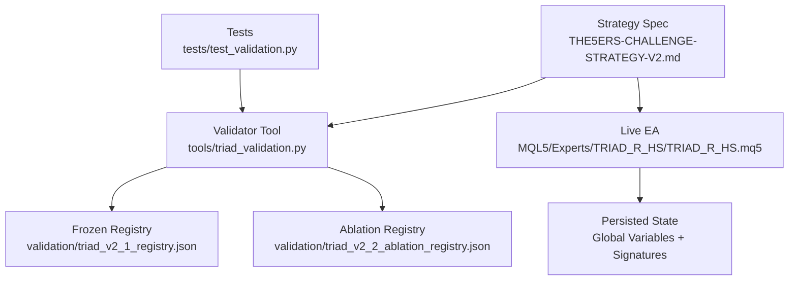
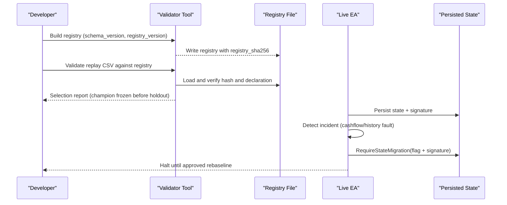
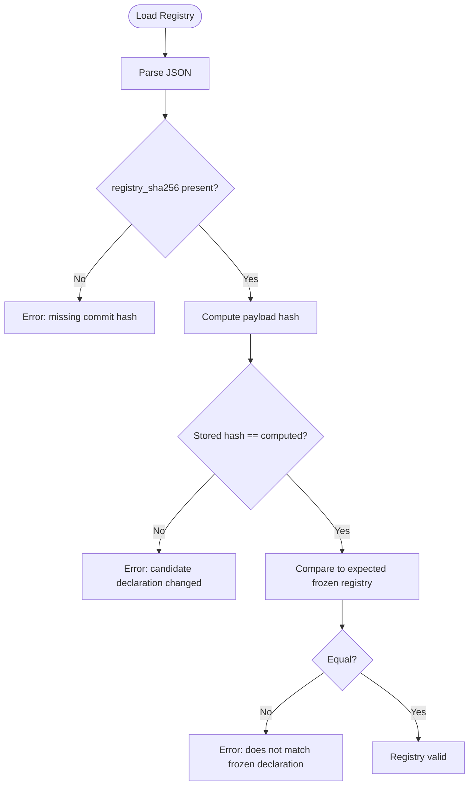
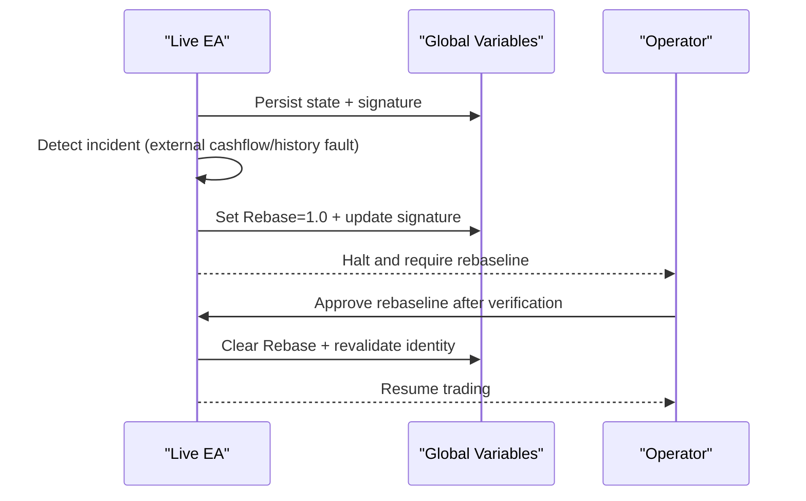
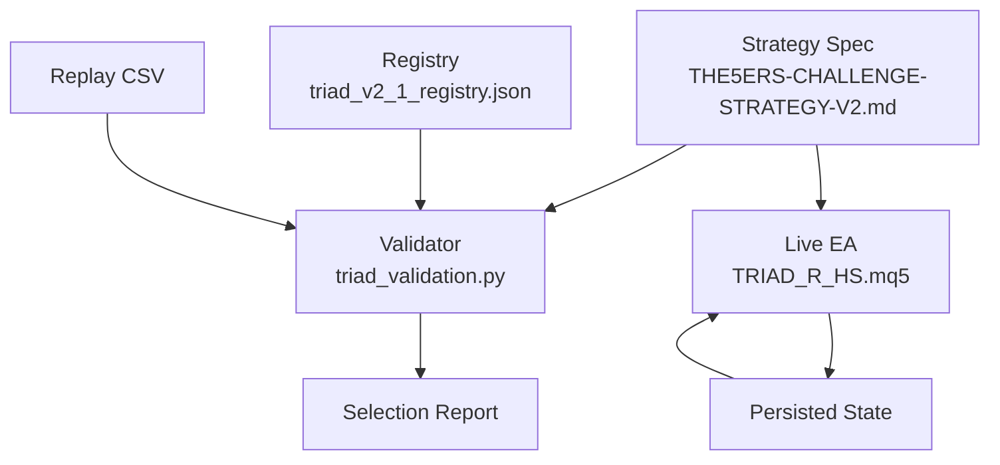

# Version Control and Migration

<cite>
**Referenced Files in This Document**
- [triad_validation.py](file://tools/triad_validation.py)
- [triad_v2_1_registry.json](file://validation/triad_v2_1_registry.json)
- [triad_v2_2_ablation_registry.json](file://validation/triad_v2_2_ablation_registry.json)
- [test_validation.py](file://tests/test_validation.py)
- [TRIAD_R_HS.mq5](file://MQL5/Experts/TRIAD_R_HS/TRIAD_R_HS.mq5)
- [THE5ERS-CHALLENGE-STRATEGY-V2.md](file://THE5ERS-CHALLENGE-STRATEGY-V2.md)
</cite>

## Table of Contents
1. Introduction
2. Project Structure
3. Core Components
4. Architecture Overview
5. Detailed Component Analysis
6. Dependency Analysis
7. Performance Considerations
8. Troubleshooting Guide
9. Conclusion
10. Appendices

## Introduction
This document explains how configuration versions are controlled, validated, and migrated across the project’s offline validation tooling and live Expert Advisor (EA). It focuses on:
- The versioning scheme used for frozen registries and schemas
- Backward compatibility requirements enforced by validators
- Safe migration procedures between versions
- Rollback strategies when migrations fail
- Testing protocols to validate configuration changes
- Guidelines for creating new versions, deprecating old ones, and maintaining legacy configurations

The system is designed around immutable, hash-checked registries that define the exact candidate configurations and selection rules. These registries are consumed by both offline tools and the live EA to ensure consistent behavior across environments.

## Project Structure
Configuration control centers around two JSON registries and a Python-based validator:
- A frozen V2.1 registry enumerates 160 candidate configurations and selection rules
- An ablation registry defines research rounds with explicit schema and decision rules
- The validator enforces schema versions, registry integrity, replay coverage, and selection logic
- The EA implements runtime state persistence and migration latches to protect accounting baselines

**Diagram sources**
- [triad_validation.py:278-331](file://tools/triad_validation.py#L278-L331)
- [triad_v2_1_registry.json:1-15](file://validation/triad_v2_1_registry.json#L1-L15)
- [triad_v2_2_ablation_registry.json:1-90](file://validation/triad_v2_2_ablation_registry.json#L1-L90)
- [TRIAD_R_HS.mq5:603-617](file://MQL5/Experts/TRIAD_R_HS/TRIAD_R_HS.mq5#L603-L617)
- [test_validation.py:80-133](file://tests/test_validation.py#L80-L133)
- [THE5ERS-CHALLENGE-STRATEGY-V2.md:328-382](file://THE5ERS-CHALLENGE-STRATEGY-V2.md#L328-L382)

**Section sources**
- [triad_validation.py:278-331](file://tools/triad_validation.py#L278-L331)
- [triad_v2_1_registry.json:1-15](file://validation/triad_v2_1_registry.json#L1-L15)
- [triad_v2_2_ablation_registry.json:1-90](file://validation/triad_v2_2_ablation_registry.json#L1-L90)
- [TRIAD_R_HS.mq5:603-617](file://MQL5/Experts/TRIAD_R_HS/TRIAD_R_HS.mq5#L603-L617)
- [test_validation.py:80-133](file://tests/test_validation.py#L80-L133)
- [THE5ERS-CHALLENGE-STRATEGY-V2.md:328-382](file://THE5ERS-CHALLENGE-STRATEGY-V2.md#L328-L382)

## Core Components
- Frozen registry builder and loader: constructs a canonical payload, computes a SHA-256 signature, and validates loaded registries against expected declarations
- Schema and registry versions: explicit constants identify schema and registry versions to enforce compatibility
- Replay row validation: ensures CSV inputs match declared fields, splits, combinations, and coverage expectations
- Fill policy and thresholds: define conservative assumptions for fills, stress scenarios, and selection gates
- EA state migration: uses persistent flags and signatures to require human-approved rebaselining after incidents

Key responsibilities:
- Immutable configuration definition via registries
- Strict validation of inputs and outputs
- Protection of accounting baselines during rollover and incidents
- Clear error signaling when mismatches or mutations occur

**Section sources**
- [triad_validation.py:49-95](file://tools/triad_validation.py#L49-L95)
- [triad_validation.py:278-331](file://tools/triad_validation.py#L278-L331)
- [triad_validation.py:360-437](file://tools/triad_validation.py#L360-L437)
- [triad_validation.py:112-145](file://tools/triad_validation.py#L112-L145)
- [TRIAD_R_HS.mq5:603-617](file://MQL5/Experts/TRIAD_R_HS/TRIAD_R_HS.mq5#L603-L617)

## Architecture Overview
The architecture separates offline validation from live execution while enforcing shared contracts through registries and schemas:
- Offline: Validator reads frozen registries, validates replay CSVs, selects champions using walk-forward data, and evaluates holdout outcomes post-selection
- Live: EA persists critical state, detects incidents, and requires migration/rebaseline before continuing under changed conditions

**Diagram sources**
- [triad_validation.py:278-331](file://tools/triad_validation.py#L278-L331)
- [triad_validation.py:360-437](file://tools/triad_validation.py#L360-L437)
- [TRIAD_R_HS.mq5:603-617](file://MQL5/Experts/TRIAD_R_HS/TRIAD_R_HS.mq5#L603-L617)

## Detailed Component Analysis

### Registry Versioning and Integrity
- Schema version and registry version are explicitly declared in registries and enforced by the validator
- The registry includes a SHA-256 hash computed over the payload excluding the hash itself; any mutation invalidates the registry
- The validator compares the loaded registry against the expected frozen declaration; mismatches raise validation errors

Versioning scheme:
- Schema version identifies the structure of the registry (e.g., TRIAD_VALIDATION_V1)
- Registry version identifies the specific set of candidates and rules (e.g., TRIAD_R_V2_1_160)
- Ablation registries use separate schema and registry versions for research rounds

Backward compatibility:
- Registries must match the validator’s frozen declaration exactly
- CSV headers and allowed values must conform to the declared schema
- Unknown config IDs or invalid splits/combinations are rejected

**Diagram sources**
- [triad_validation.py:317-331](file://tools/triad_validation.py#L317-L331)

**Section sources**
- [triad_validation.py:278-331](file://tools/triad_validation.py#L278-L331)
- [triad_v2_1_registry.json:1-15](file://validation/triad_v2_1_registry.json#L1-L15)
- [triad_v2_2_ablation_registry.json:1-90](file://validation/triad_v2_2_ablation_registry.json#L1-L90)

### Configuration Matrix and Candidate Generation
- The validator enumerates a fixed matrix of 160 candidate configurations based on range bands, ATR bands, time stops, risk profiles, and breakeven policies
- Each configuration has a unique ID encoding its parameters
- Tests assert the matrix size and uniqueness to prevent accidental drift

Implications:
- New configurations must be added by expanding the enumerated dimensions
- Any change to the matrix affects the registry and must be reflected in the frozen declaration
- Config IDs are stable identifiers used throughout replay and reporting

**Section sources**
- [triad_validation.py:231-267](file://tools/triad_validation.py#L231-L267)
- [test_validation.py:85-102](file://tests/test_validation.py#L85-L102)

### Replay Validation and Coverage Requirements
- Replay CSVs must include every configuration, instrument/session combination, and calendar/server day for both selection and holdout splits
- Missing rows or inconsistent day sets cause validation failures
- Fields are strictly typed and bounded; booleans must be true/false or 1/0, floats must be finite and nonnegative where required

Coverage enforcement:
- Validates presence of all expected days per split/config/combination
- Rejects duplicate rows and unknown config IDs
- Ensures activated candidates have positive cash-risk values

**Section sources**
- [triad_validation.py:360-437](file://tools/triad_validation.py#L360-L437)
- [triad_validation.py:440-473](file://tools/triad_validation.py#L440-L473)

### Fill Policy and Stress Scenarios
- Conservative fill assumptions require minimum trade-through ticks and full fills
- Stress scenarios increase spread/slippage costs and probabilistically miss profitable limits
- Metrics expose uncertainty counts such as touch without trade-through and partial-fill observations

Operational impact:
- Prevents optimistic backtests from becoming live deployments
- Encourages robust configurations that survive cost increases and missed fills

**Section sources**
- [triad_validation.py:112-128](file://tools/triad_validation.py#L112-L128)
- [triad_validation.py:480-497](file://tools/triad_validation.py#L480-L497)

### EA State Migration and Rollback
- The EA persists critical state including identity, phase, initial balance, selected configuration, and checksums
- On rollover or incident detection, it may require a state migration flag and signature update
- External cashflow or account history faults invalidate existing baselines and halt trading until approved rebaseline

Rollback procedure:
- If migration fails to persist, the EA logs an error and halts
- Rebaselining requires human authorization and verification of account context
- Until migration completes, no orders are submitted and trading remains halted

**Diagram sources**
- [TRIAD_R_HS.mq5:603-617](file://MQL5/Experts/TRIAD_R_HS/TRIAD_R_HS.mq5#L603-L617)
- [TRIAD_R_HS.mq5:3379-3414](file://MQL5/Experts/TRIAD_R_HS/TRIAD_R_HS.mq5#L3379-L3414)

**Section sources**
- [TRIAD_R_HS.mq5:603-617](file://MQL5/Experts/TRIAD_R_HS/TRIAD_R_HS.mq5#L603-L617)
- [TRIAD_R_HS.mq5:3379-3414](file://MQL5/Experts/TRIAD_R_HS/TRIAD_R_HS.mq5#L3379-L3414)

### Testing Protocols for Configuration Changes
- Unit tests assert committed registry matches the validator’s frozen declaration
- Tests verify matrix size and uniqueness of configurations
- Tests confirm registry hash detects mutations and coverage requirements
- Tests validate selection logic rejects holdout influence and produces expected champions

Best practices:
- Always regenerate and commit registries using the provided tooling
- Run full test suite before deploying configuration changes
- Ensure replay exports cover all splits, configs, and combinations

**Section sources**
- [test_validation.py:80-133](file://tests/test_validation.py#L80-L133)
- [test_validation.py:178-255](file://tests/test_validation.py#L178-L255)

## Dependency Analysis
The validator depends on:
- Strategy specification for selection rules and gates
- Frozen registry for candidate definitions and thresholds
- Replay CSV for event-level results
- Tests for regression protection

The EA depends on:
- Persisted state for identity and baseline
- Global variables for migration latches and signatures
- Strategy spec for operational constraints

**Diagram sources**
- [triad_validation.py:278-331](file://tools/triad_validation.py#L278-L331)
- [triad_v2_1_registry.json:1-15](file://validation/triad_v2_1_registry.json#L1-L15)
- [TRIAD_R_HS.mq5:603-617](file://MQL5/Experts/TRIAD_R_HS/TRIAD_R_HS.mq5#L603-L617)
- [THE5ERS-CHALLENGE-STRATEGY-V2.md:328-382](file://THE5ERS-CHALLENGE-STRATEGY-V2.md#L328-L382)

**Section sources**
- [triad_validation.py:278-331](file://tools/triad_validation.py#L278-L331)
- [triad_v2_1_registry.json:1-15](file://validation/triad_v2_1_registry.json#L1-L15)
- [TRIAD_R_HS.mq5:603-617](file://MQL5/Experts/TRIAD_R_HS/TRIAD_R_HS.mq5#L603-L617)
- [THE5ERS-CHALLENGE-STRATEGY-V2.md:328-382](file://THE5ERS-CHALLENGE-STRATEGY-V2.md#L328-L382)

## Performance Considerations
- Registry validation is lightweight but strict; ensure CSVs are complete to avoid repeated validation failures
- Bootstrap and simulation settings in registries affect computational cost; adjust only within approved bounds
- EA state checks are minimal overhead but critical for safety; do not bypass migration latches

[No sources needed since this section provides general guidance]

## Troubleshooting Guide
Common issues and resolutions:
- Registry hash mismatch: Indicates the registry file was modified outside the build process; rebuild using the validator tool
- CSV header mismatch: Ensure replay export matches the schema printed by the validator’s schema command
- Unknown config_id: Replay includes a configuration not present in the frozen registry; align replay generation with the current registry
- Missing coverage: Replay lacks rows for some config/combination/day; generate explicit no-candidate rows for all expected combinations
- EA migration required: Incident detected; halt trading, verify account context, and perform approved rebaseline before resuming

**Section sources**
- [triad_validation.py:317-331](file://tools/triad_validation.py#L317-L331)
- [triad_validation.py:360-437](file://tools/triad_validation.py#L360-L437)
- [TRIAD_R_HS.mq5:603-617](file://MQL5/Experts/TRIAD_R_HS/TRIAD_R_HS.mq5#L603-L617)

## Conclusion
The project enforces rigorous configuration version control through frozen, hash-checked registries and strict validation of replay data. Migrations are protected by persistent latches and signatures, requiring human approval to continue after incidents. Testing ensures registry integrity and selection correctness. Following these procedures guarantees safe updates across environments and maintains consistency between offline validation and live execution.

[No sources needed since this section summarizes without analyzing specific files]

## Appendices

### Creating a New Configuration Version
Steps:
1. Update the strategy specification if rules change
2. Modify the candidate enumeration or thresholds in the validator
3. Rebuild the registry using the validator tool
4. Commit the new registry with updated schema and registry versions
5. Run tests to ensure registry matches frozen declaration
6. Generate replay exports covering all splits, configs, and combinations
7. Validate replay CSVs and select champion using walk-forward data
8. Evaluate holdout outcomes post-selection

**Section sources**
- [triad_validation.py:278-331](file://tools/triad_validation.py#L278-L331)
- [test_validation.py:80-133](file://tests/test_validation.py#L80-L133)

### Deprecation Policies
- Maintain backward compatibility by keeping old registries accessible
- Clearly mark deprecated versions in schema and registry metadata
- Provide migration guides for transitioning to new versions
- Retain legacy configurations for audit and rollback purposes

[No sources needed since this section provides general guidance]

### Maintenance Procedures for Legacy Configurations
- Archive old registries with version tags
- Keep validators compatible with multiple schema versions where feasible
- Document deprecation timelines and support windows
- Monitor usage of legacy configurations and plan phased retirement

[No sources needed since this section provides general guidance]