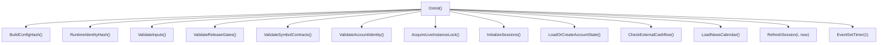
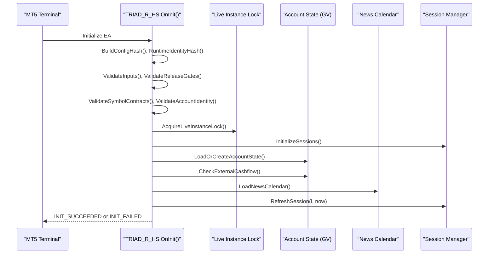
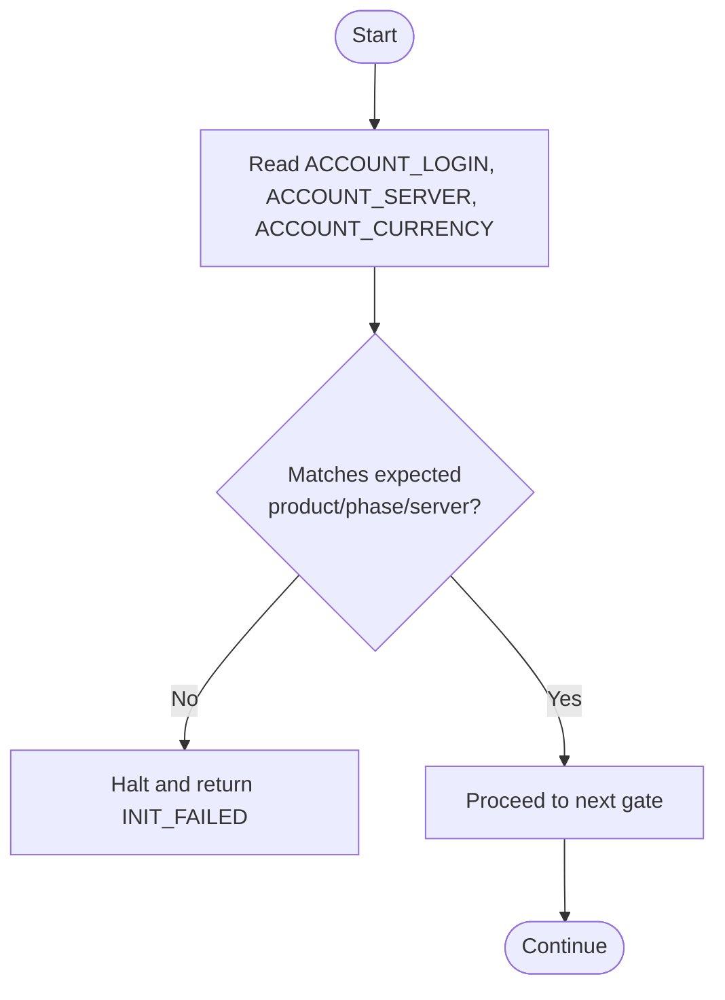
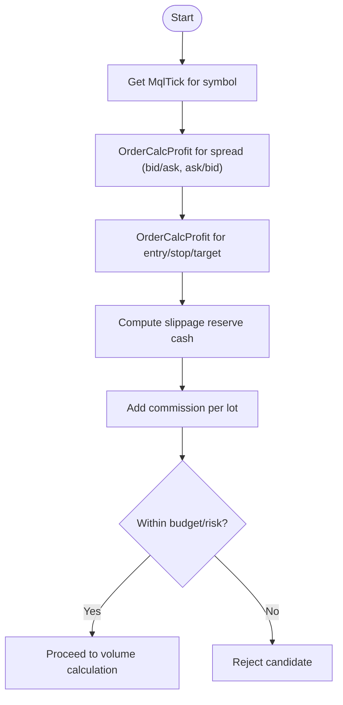
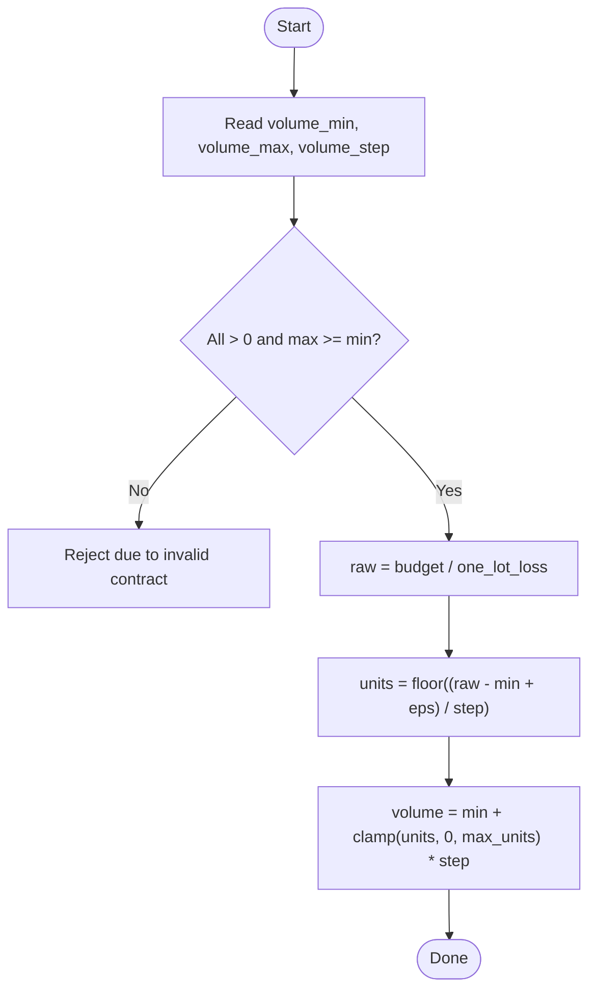
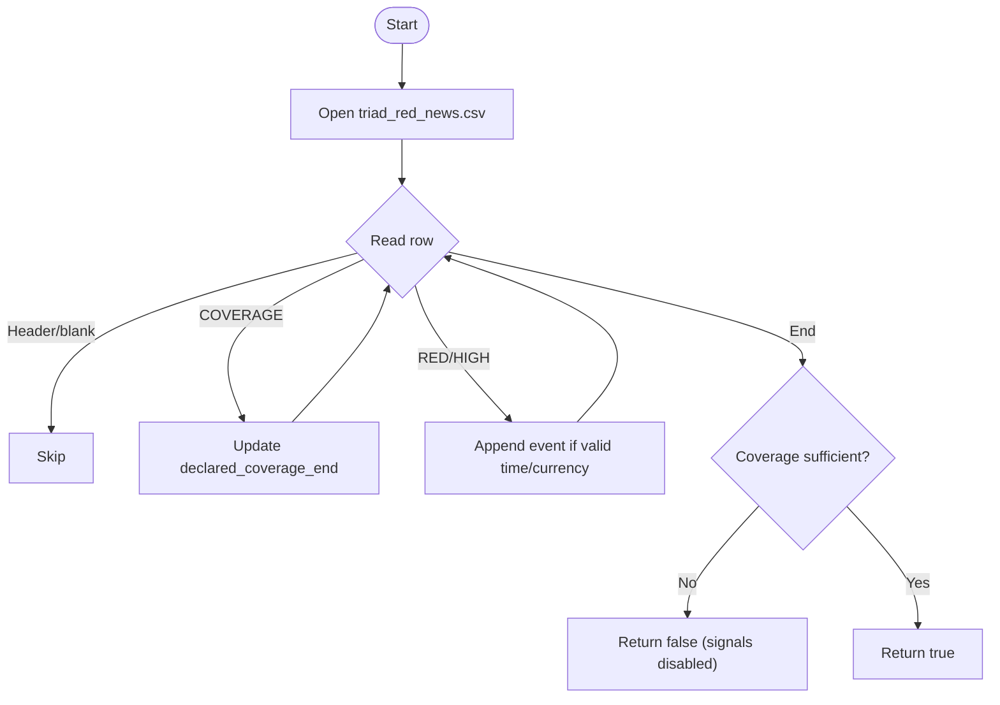
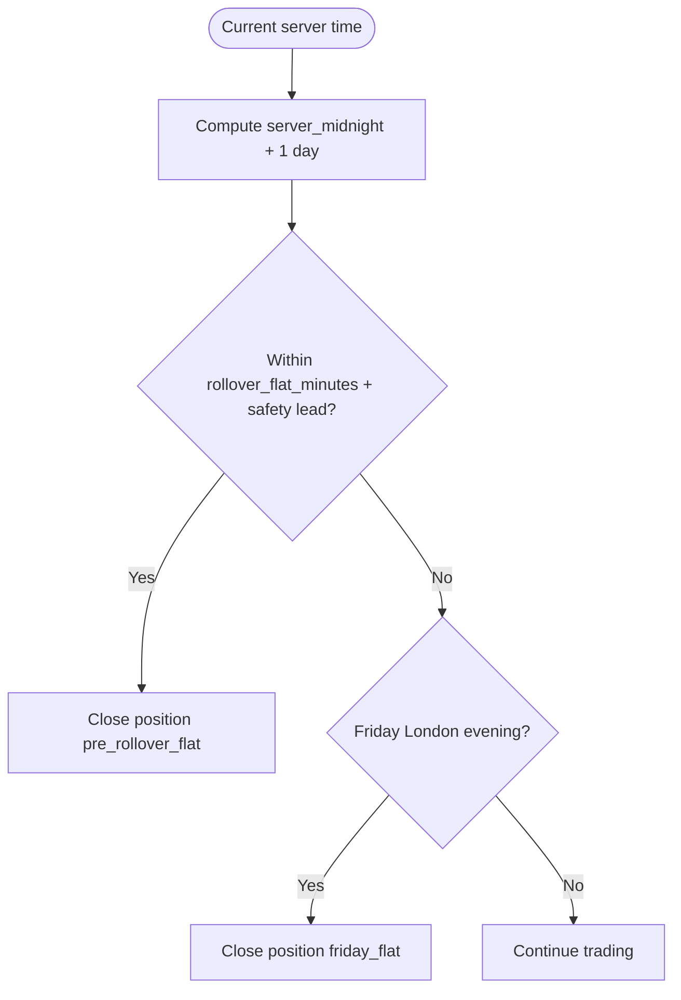
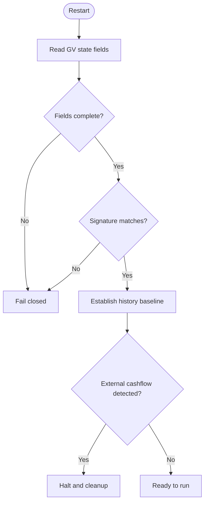
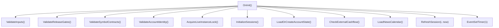

# Account Initialization

<cite>
**Referenced Files in This Document**
- [TRIAD_R_HS.mq5](file://MQL5/Experts/TRIAD_R_HS/TRIAD_R_HS.mq5)
- [triad_red_news.csv.example](file://MQL5/Files/triad_red_news.csv.example)
- [test_reference.py](file://tests/test_reference.py)
</cite>

## Table of Contents
1. Introduction
2. Project Structure
3. Core Components
4. Architecture Overview
5. Detailed Component Analysis
6. Dependency Analysis
7. Performance Considerations
8. Troubleshooting Guide
9. Conclusion

## Introduction
This document describes the complete account initialization process for the TRIAD-R system (canonical EA: TRIAD_R_HS). It covers account identity and server verification, product/phase matching, initial balance persistence, symbol discovery from MT5, tick and contract value testing with OrderCalcProfit, volume step validation, calendar integration with Forex Factory-compatible red events, server rollover observation, timezone conversion for Europe/London and America/New_York, existing state reconciliation, and step-by-step validation checks including build/config hash matching, stop/freeze level reading, and commission/swap confirmation.

## Project Structure
The TRIAD-R system is implemented as an MQL5 Expert Advisor with a dedicated news calendar file format and supporting tests that validate time conversions and calendar schema. The canonical production EA performs strict initialization gates before enabling any trading logic. A separate screening EA mirrors strategy mechanics but omits live safety machinery; this document focuses on the canonical EA’s initialization path.

**Diagram sources**
- [TRIAD_R_HS.mq5:4105-4215](file://MQL5/Experts/TRIAD_R_HS/TRIAD_R_HS.mq5#L4105-L4215)

**Section sources**
- [TRIAD_R_HS.mq5:4105-4215](file://MQL5/Experts/TRIAD_R_HS/TRIAD_R_HS.mq5#L4105-L4215)

## Core Components
- Account identity and server verification: Ensures authorized login/server/product/phase match and enforces fail-closed behavior when mismatched.
- Build/config hash and runtime identity: Computes hashes over all configuration inputs and runtime identity to detect drift or tampering.
- Session setup: Initializes London and New York sessions with symbols, currencies, priorities, and enabled flags.
- State persistence: Persists day/week keys, balances, equity, floors, high watermarks, request counts, rollover incident keys, history baseline timestamps, rebaseline flags, creation time, inactivity alerts, and news-block streaks via terminal global variables with signature verification.
- News calendar: Loads Forex Factory-compatible CSV with RED/HIGH events and operator-verified coverage markers; validates coverage through required hours.
- Timezone handling: Converts between UTC, local wall time (London/New York), and server time using DST-aware offsets.
- Symbol discovery and contract validation: Reads symbol properties (digits, points, freeze/stop levels, volume min/max/step, trade mode) and validates against operational constraints.
- Tick and profit testing: Uses OrderCalcProfit to test spread impact, risk/reward, slippage reserves, and commission effects.
- Volume step verification: Anchors lot sizing to SYMBOL_VOLUME_MIN and steps by SYMBOL_VOLUME_STEP, clamped to SYMBOL_VOLUME_MAX and directional limits.
- Rollover and flat windows: Observes server midnight rollover and applies flat periods around rollover and Friday close.

**Section sources**
- [TRIAD_R_HS.mq5:53-90](file://MQL5/Experts/TRIAD_R_HS/TRIAD_R_HS.mq5#L53-L90)
- [TRIAD_R_HS.mq5:364-428](file://MQL5/Experts/TRIAD_R_HS/TRIAD_R_HS.mq5#L364-L428)
- [TRIAD_R_HS.mq5:568-617](file://MQL5/Experts/TRIAD_R_HS/TRIAD_R_HS.mq5#L568-L617)
- [TRIAD_R_HS.mq5:624-779](file://MQL5/Experts/TRIAD_R_HS/TRIAD_R_HS.mq5#L624-L779)
- [TRIAD_R_HS.mq5:836-917](file://MQL5/Experts/TRIAD_R_HS/TRIAD_R_HS.mq5#L836-L917)
- [TRIAD_R_HS.mq5:3950-3983](file://MQL5/Experts/TRIAD_R_HS/TRIAD_R_HS.mq5#L3950-L3983)
- [TRIAD_R_HS.mq5:2184-2300](file://MQL5/Experts/TRIAD_R_HS/TRIAD_R_HS.mq5#L2184-L2300)
- [TRIAD_R_HS.mq5:2236-2257](file://MQL5/Experts/TRIAD_R_HS/TRIAD_R_HS.mq5#L2236-L2257)
- [TRIAD_R_HS.mq5:3157-3183](file://MQL5/Experts/TRIAD_R_HS/TRIAD_R_HS.mq5#L3157-L3183)

## Architecture Overview
The initialization sequence enforces strict gates before any trading activity. It builds a configuration fingerprint, verifies account identity, acquires a live instance lock, initializes sessions, loads or creates account state, ensures external cashflow baseline, loads the news calendar, refreshes session bounds, and finally enables timers and signals.

**Diagram sources**
- [TRIAD_R_HS.mq5:4105-4215](file://MQL5/Experts/TRIAD_R_HS/TRIAD_R_HS.mq5#L4105-L4215)

## Detailed Component Analysis

### Account Identity and Server Verification
- Verifies authorized login, expected server, product code, phase, and currency.
- Enforces fail-closed behavior if any identity check fails.
- Supports tester mode bypass for backtesting.

Validation flow:

**Section sources**
- [TRIAD_R_HS.mq5:273-281](file://MQL5/Experts/TRIAD_R_HS/TRIAD_R_HS.mq5#L273-L281)
- [TRIAD_R_HS.mq5:405-411](file://MQL5/Experts/TRIAD_R_HS/TRIAD_R_HS.mq5#L405-L411)
- [TRIAD_R_HS.mq5:4128-4131](file://MQL5/Experts/TRIAD_R_HS/TRIAD_R_HS.mq5#L4128-L4131)

### Product/Phase Matching and Initial Balance Persistence
- Product code and phase are part of the runtime identity hash and persisted state signature.
- On fresh state creation, initial balance/equity are captured and persisted along with day/week keys and firm floor.
- Signature verification prevents partial or stale state usage.

Key behaviors:
- Fresh state requires clean account (no exposure/history, balance/equity within tolerance of configured initial balance).
- History baseline timestamp is established to detect external cashflows.
- All critical fields are written atomically with a final signature variable.

**Section sources**
- [TRIAD_R_HS.mq5:405-428](file://MQL5/Experts/TRIAD_R_HS/TRIAD_R_HS.mq5#L405-L428)
- [TRIAD_R_HS.mq5:568-617](file://MQL5/Experts/TRIAD_R_HS/TRIAD_R_HS.mq5#L568-L617)
- [TRIAD_R_HS.mq5:3765-3827](file://MQL5/Experts/TRIAD_R_HS/TRIAD_R_HS.mq5#L3765-L3827)
- [TRIAD_R_HS.mq5:3914-3947](file://MQL5/Experts/TRIAD_R_HS/TRIAD_R_HS.mq5#L3914-L3947)

### Symbol Discovery and Contract Validation
- Symbols are configured per session (EURUSD/GBPUSD for London, USDJPY for New York) and validated for uniqueness and at least one enabled sleeve.
- Contract properties (digits, points, freeze/stop levels, volume limits, trade mode) are read and enforced during candidate evaluation and order management.

Validation highlights:
- Unique symbols and priority ranges checked.
- Trade mode must be full for pending orders; otherwise, pending orders are deleted safely.
- Stop/freeze distances validated against broker minimums.

**Section sources**
- [TRIAD_R_HS.mq5:3586-3596](file://MQL5/Experts/TRIAD_R_HS/TRIAD_R_HS.mq5#L3586-L3596)
- [TRIAD_R_HS.mq5:3950-3983](file://MQL5/Experts/TRIAD_R_HS/TRIAD_R_HS.mq5#L3950-L3983)
- [TRIAD_R_HS.mq5:3012-3016](file://MQL5/Experts/TRIAD_R_HS/TRIAD_R_HS.mq5#L3012-L3016)

### Tick and Contract Value Testing with OrderCalcProfit
- Spread impact is tested by computing profit for 1 lot using bid/ask and ask/bid pairs.
- Risk and reward are computed via OrderCalcProfit for entry/stop/target combinations.
- Slippage reserve cash is derived from adverse vs base results.
- Commission is included in round-trip cost calculations.

Testing flow:

**Section sources**
- [TRIAD_R_HS.mq5:2184-2300](file://MQL5/Experts/TRIAD_R_HS/TRIAD_R_HS.mq5#L2184-L2300)

### Volume Step Verification
- Volume is bounded by SYMBOL_VOLUME_MIN/MAX and stepped by SYMBOL_VOLUME_STEP.
- Directional limits may further cap maximum volume.
- Lot sizing anchors to the minimum volume grid to avoid invalid values on non-zero-offset brokers.

Volume calculation flow:

**Section sources**
- [TRIAD_R_HS.mq5:2236-2257](file://MQL5/Experts/TRIAD_R_HS/TRIAD_R_HS.mq5#L2236-L2257)

### Calendar Integration (Forex Factory-Compatible Red Events)
- Loads CSV with columns: utc_time, currency, impact, title.
- Only RED and HIGH events are considered; COVERAGE rows declare verified coverage end times.
- Requires coverage through current time plus configured hours; otherwise, signals are disabled until valid calendar is loaded.
- Provides functions to check relevant news windows, upcoming events, and recent events relative to session currencies.

Calendar loading flow:

**Diagram sources**
- [TRIAD_R_HS.mq5:836-917](file://MQL5/Experts/TRIAD_R_HS/TRIAD_R_HS.mq5#L836-L917)
- [triad_red_news.csv.example:1-7](file://MQL5/Files/triad_red_news.csv.example#L1-L7)

**Section sources**
- [TRIAD_R_HS.mq5:836-917](file://MQL5/Experts/TRIAD_R_HS/TRIAD_R_HS.mq5#L836-L917)
- [triad_red_news.csv.example:1-7](file://MQL5/Files/triad_red_news.csv.example#L1-L7)

### Server Rollover Observation
- Rollover flat window is enforced near server midnight to avoid trading across daily boundaries.
- Friday flat window closes positions after London evening to avoid weekend exposure.

Rollover logic:

**Section sources**
- [TRIAD_R_HS.mq5:3157-3183](file://MQL5/Experts/TRIAD_R_HS/TRIAD_R_HS.mq5#L3157-L3183)

### Timezone Conversion Setup (Europe/London and America/New_York)
- DST-aware offsets for London (GMT/BST) and New York (EST/EDT) are computed based on last Sunday rules.
- Local wall time to UTC conversion accounts for DST transitions iteratively.
- UTC-to-server conversion uses configured expected server UTC offset hours.

Timezone helpers:
- LondonUtcOffsetSeconds: +1 during BST, 0 otherwise.
- NewYorkUtcOffsetSeconds: -4 during EDT, -5 otherwise.
- LocalWallToUtc: Iterative correction for DST boundary cases.
- UtcToServer/ServerToUtc: Fixed offset conversion.

**Section sources**
- [TRIAD_R_HS.mq5:624-779](file://MQL5/Experts/TRIAD_R_HS/TRIAD_R_HS.mq5#L624-L779)
- [test_reference.py:145-156](file://tests/test_reference.py#L145-L156)

### Existing State Reconciliation Procedures
- On restart, state is read from terminal globals and validated via signature.
- If signature mismatches or fields are incomplete, initialization fails closed.
- External cashflow detection uses a history baseline timestamp to identify deposits/withdrawals not caused by trading.
- Rebaseline flag can be set to force migration when needed.

Reconciliation flow:

**Section sources**
- [TRIAD_R_HS.mq5:3765-3827](file://MQL5/Experts/TRIAD_R_HS/TRIAD_R_HS.mq5#L3765-L3827)
- [TRIAD_R_HS.mq5:3914-3947](file://MQL5/Experts/TRIAD_R_HS/TRIAD_R_HS.mq5#L3914-L3947)

### Step-by-Step Validation Checks

#### Build/Config Hash Matching
- Compute BuildConfigHash over all configuration inputs and EA build ID.
- Compute RuntimeIdentityHash over account login/server/currency, product code, and phase.
- Persist both hashes and verify on load; mismatches indicate config drift or unauthorized changes.

Verification steps:
- Ensure InpEnableOrderSubmission and release gates are set appropriately.
- Confirm InpRequiredProductCode and InpPhase match intended deployment.
- Verify that stored Config/Identity hashes match current runtime values.

**Section sources**
- [TRIAD_R_HS.mq5:364-428](file://MQL5/Experts/TRIAD_R_HS/TRIAD_R_HS.mq5#L364-L428)
- [TRIAD_R_HS.mq5:4116-4117](file://MQL5/Experts/TRIAD_R_HS/TRIAD_R_HS.mq5#L4116-L4117)

#### Stop/Freeze Level Reading
- Read SYMBOL_TRADE_STOPS_LEVEL and SYMBOL_TRADE_FREEZE_LEVEL.
- Validate that entry/stop/target distances meet minimum requirements.
- Normalize prices to tick size and enforce broker constraints.

Checks:
- Ensure candidate distances exceed minimums.
- Confirm visible stops/targets match expected plans; otherwise, repair or halt.

**Section sources**
- [TRIAD_R_HS.mq5:3087-3096](file://MQL5/Experts/TRIAD_R_HS/TRIAD_R_HS.mq5#L3087-L3096)
- [TRIAD_R_HS.mq5:3105-3142](file://MQL5/Experts/TRIAD_R_HS/TRIAD_R_HS.mq5#L3105-L3142)

#### Commission/Swap Confirmation
- Round-trip commission is applied per lot and included in cash loss calculations.
- Swap considerations are embedded in profit calculations via OrderCalcProfit; ensure commissions align with broker settings.

Confirmation steps:
- Validate InpCommissionRoundTripPerLot against broker reality.
- Use OrderCalcProfit to confirm net outcomes include commission effects.

**Section sources**
- [TRIAD_R_HS.mq5:2184-2300](file://MQL5/Experts/TRIAD_R_HS/TRIAD_R_HS.mq5#L2184-L2300)

## Dependency Analysis
Initialization depends on several subsystems:
- Inputs and gates: ValidateInputs, ValidateReleaseGates.
- Symbol contracts: ValidateSymbolContracts.
- Account identity: ValidateAccountIdentity.
- Live instance lock: AcquireLiveInstanceLock.
- Sessions: InitializeSessions, RefreshSession.
- State: LoadOrCreateAccountState, PersistAccountState, CheckExternalCashflow.
- Calendar: LoadNewsCalendar, NewsCalendarCurrent.
- Timer: EventSetTimer.

**Diagram sources**
- [TRIAD_R_HS.mq5:4105-4215](file://MQL5/Experts/TRIAD_R_HS/TRIAD_R_HS.mq5#L4105-L4215)

**Section sources**
- [TRIAD_R_HS.mq5:4105-4215](file://MQL5/Experts/TRIAD_R_HS/TRIAD_R_HS.mq5#L4105-L4215)

## Performance Considerations
- Quote freshness checks prevent stale data usage.
- Range reads require exact M5 bar counts to ensure integrity.
- News calendar loading is bounded and validated; insufficient coverage halts signal generation.
- Global variable writes are batched and flushed to minimize I/O overhead.

[No sources needed since this section provides general guidance]

## Troubleshooting Guide
Common initialization failures and their causes:
- NEWS_FILE_OPEN: Calendar file cannot be opened; ensure triad_red_news.csv exists and is readable.
- NEWS_COVERAGE_INSUFFICIENT: Coverage end time does not extend far enough into the future; update CSV with operator-verified coverage marker.
- NEWS_RUNTIME_COVERAGE_STALE: Runtime coverage has expired; refresh calendar.
- FRESH_STATE_NOT_AUTHORIZED: First-run state requires explicit authorization input; set once after verifying account cleanliness.
- FRESH_STATE_ACCOUNT_NOT_CLEAN: Existing exposure/history or balance/equity mismatch; clear account or adjust expectations.
- PERSISTED_STATE_SIGNATURE_MISMATCH: Partial or inconsistent state; reset state or investigate corruption.
- AUDIT_LOG_OPEN_FAILED/AUDIT_LOG_WRITE_FAILED: Log file issues; check permissions and disk space.
- INSTANCE_LOCK_*: Duplicate live instances or lost ownership; ensure single chart instance per account.

**Section sources**
- [TRIAD_R_HS.mq5:836-917](file://MQL5/Experts/TRIAD_R_HS/TRIAD_R_HS.mq5#L836-L917)
- [TRIAD_R_HS.mq5:3765-3827](file://MQL5/Experts/TRIAD_R_HS/TRIAD_R_HS.mq5#L3765-L3827)
- [TRIAD_R_HS.mq5:3914-3947](file://MQL5/Experts/TRIAD_R_HS/TRIAD_R_HS.mq5#L3914-L3947)
- [TRIAD_R_HS.mq5:4165-4175](file://MQL5/Experts/TRIAD_R_HS/TRIAD_R_HS.mq5#L4165-L4175)

## Conclusion
The TRIAD-R account initialization process is designed to be fail-closed, with rigorous checks for identity, configuration, contracts, state integrity, calendar coverage, and timezone correctness. By following the step-by-step validation checks and ensuring proper setup of symbols, calendars, and server offsets, operators can confidently deploy the EA while maintaining robust safeguards against misconfiguration, stale data, and unauthorized changes.