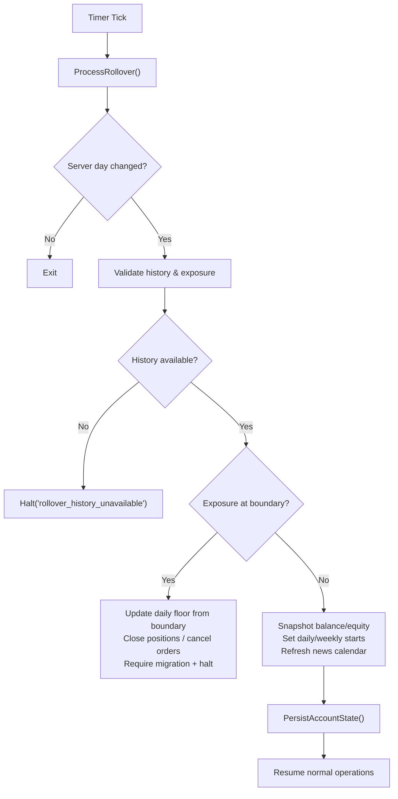
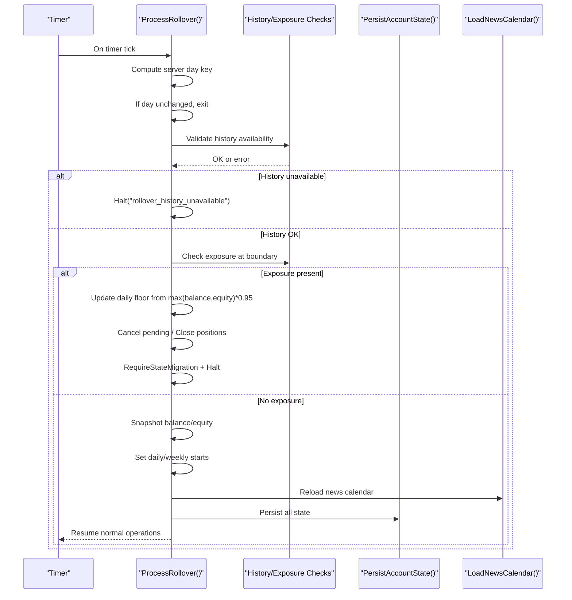
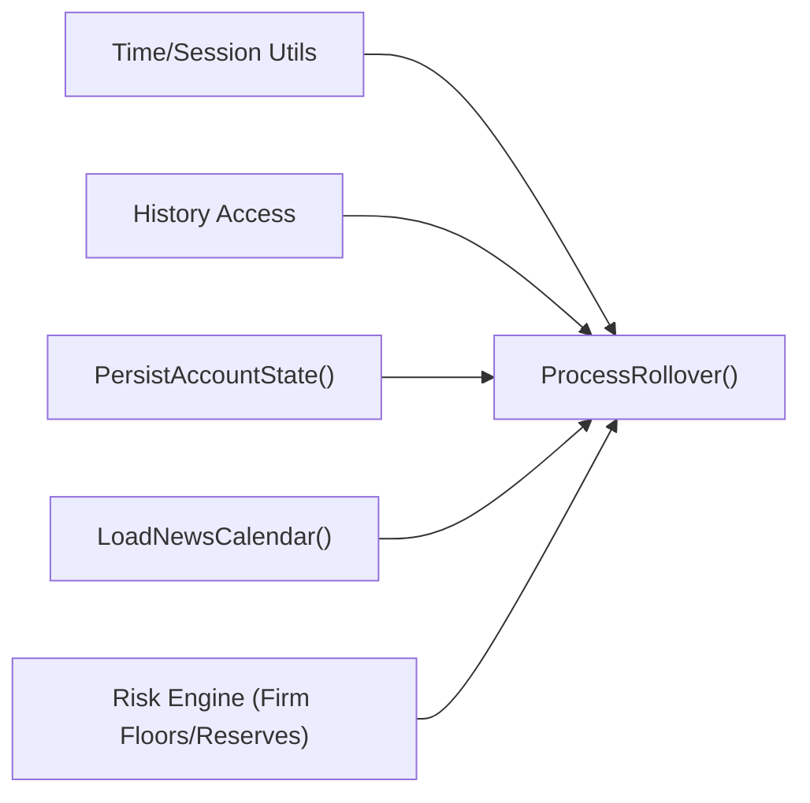

# Daily Rollover Process

<cite>
**Referenced Files in This Document**
- [TRIAD_R_HS.mq5](file://MQL5/Experts/TRIAD_R_HS/TRIAD_R_HS.mq5)
- [README.md](file://MQL5/Experts/TRIAD_R_HS/README.md)
- [THE5ERS-END-TO-END-PRECODE-CHECKLIST.md](file://THE5ERS-END-TO-END-PRECODE-CHECKLIST.md)
- [THE5ERS-CHALLENGE-STRATEGY-V2.md](file://THE5ERS-CHALLENGE-STRATEGY-V2.md)
- [triad_reference.py](file://tests/triad_reference.py)
</cite>

## Table of Contents
1. Introduction
2. Project Structure
3. Core Components
4. Architecture Overview
5. Detailed Component Analysis
6. Dependency Analysis
7. Performance Considerations
8. Troubleshooting Guide
9. Conclusion

## Introduction
This document explains the TRIAD-R daily rollover process as implemented in the EA and aligned with the canonical strategy rules. It covers snapshotting balance and equity at confirmed server boundaries, firm floor calculations, internal reserve management, previous-day balance persistence for profitable-day estimation, weekly start balance handling, news/calendar refresh requirements, floating position validation at rollover, and emergency shutdown protocols during rollover periods.

## Project Structure
The rollover logic is implemented within the TRIAD-R High Stakes Expert Advisor (EA). Key responsibilities include:
- Detecting a confirmed server day change
- Validating history availability and exposure state
- Persisting daily and weekly baselines
- Computing and enforcing firm floors and reserves
- Refreshing the news calendar
- Halting on mismatches or unsafe states

**Diagram sources**
- [TRIAD_R_HS.mq5:3379-3514](file://MQL5/Experts/TRIAD_R_HS/TRIAD_R_HS.mq5#L3379-L3514)

**Section sources**
- [TRIAD_R_HS.mq5:3379-3514](file://MQL5/Experts/TRIAD_R_HS/TRIAD_R_HS.mq5#L3379-L3514)
- [TRIAD_R_HS.mq5:568-601](file://MQL5/Experts/TRIAD_R_HS/TRIAD_R_HS.mq5#L568-L601)
- [TRIAD_R_HS.mq5:836-995](file://MQL5/Experts/TRIAD_R_HS/TRIAD_R_HS.mq5#L836-L995)

## Core Components
- Server-boundary detection and rollover gating
- Exposure validation and cleanup at rollover
- Snapshot of daily baseline (balance and equity)
- Firm daily floor calculation using rollover snapshot
- Firm static overall floor based on phase initial balance
- Internal reserve cash buffer
- Previous-day balance persistence for profitable-day estimation
- Weekly start balance reset at first server rollover of the trading week
- News/calendar reload at rollover
- Emergency halt and migration latching for anomalies

**Section sources**
- [TRIAD_R_HS.mq5:3379-3514](file://MQL5/Experts/TRIAD_R_HS/TRIAD_R_HS.mq5#L3379-L3514)
- [TRIAD_R_HS.mq5:1674-1683](file://MQL5/Experts/TRIAD_R_HS/TRIAD_R_HS.mq5#L1674-L1683)
- [TRIAD_R_HS.mq5:568-601](file://MQL5/Experts/TRIAD_R_HS/TRIAD_R_HS.mq5#L568-L601)
- [TRIAD_R_HS.mq5:836-995](file://MQL5/Experts/TRIAD_R_HS/TRIAD_R_HS.mq5#L836-L995)

## Architecture Overview
The rollover flow enforces fail-closed behavior by validating server time, account identity, and persisted state before any baseline update. It ensures that only clean, flat accounts transition into a new daily window and that firm floors are never underestimated.

**Diagram sources**
- [TRIAD_R_HS.mq5:3379-3514](file://MQL5/Experts/TRIAD_R_HS/TRIAD_R_HS.mq5#L3379-L3514)
- [TRIAD_R_HS.mq5:568-601](file://MQL5/Experts/TRIAD_R_HS/TRIAD_R_HS.mq5#L568-L601)
- [TRIAD_R_HS.mq5:836-995](file://MQL5/Experts/TRIAD_R_HS/TRIAD_R_HS.mq5#L836-L995)

## Detailed Component Analysis

### Rollover Snapshot Procedure
- The EA detects a confirmed server day change using server time and computes a server day key.
- Before updating state, it validates that external history is available and that no unauthorized history or external cashflow has contaminated the accounting basis.
- If exposure exists at the boundary, it preserves the higher of balance or equity to compute the official daily floor, then cancels pending orders and closes positions. It requires a state migration and halts until reconciliation.
- If the account is flat, it snapshots balance and equity as the new daily baseline.

Key behaviors:
- Never snapshot pre-close balance/equity when exposure remains; defer until fully flat.
- Record rollover incident keys to track anomalies across restarts.
- Persist all state atomically via a signed state signature.

**Section sources**
- [TRIAD_R_HS.mq5:3379-3514](file://MQL5/Experts/TRIAD_R_HS/TRIAD_R_HS.mq5#L3379-L3514)
- [TRIAD_R_HS.mq5:568-601](file://MQL5/Experts/TRIAD_R_HS/TRIAD_R_HS.mq5#L568-L601)

### Firm Daily Floor Calculation
- At rollover, the firm daily floor is computed as max(rollover balance, rollover equity) × 0.95.
- If an unexpected rollover exposure was detected, the boundary snapshot is used to ensure the daily floor is not underestimated.
- The active firm floor used for risk checks is the more restrictive of the daily floor and the static overall floor.

Reference alignment:
- Canonical rule: daily floor = max(rollover balance, rollover equity) × 0.95.
- Reference implementation confirms the same formula.

**Section sources**
- [TRIAD_R_HS.mq5:3419-3439](file://MQL5/Experts/TRIAD_R_HS/TRIAD_R_HS.mq5#L3419-L3439)
- [TRIAD_R_HS.mq5:1674-1683](file://MQL5/Experts/TRIAD_R_HS/TRIAD_R_HS.mq5#L1674-L1683)
- [THE5ERS-CHALLENGE-STRATEGY-V2.md:285-295](file://THE5ERS-CHALLENGE-STRATEGY-V2.md#L285-L295)
- [triad_reference.py:91-95](file://tests/triad_reference.py#L91-L95)

### Firm Static Overall Floor
- The firm static overall floor equals phase initial balance × 0.90.
- The active floor used for order gating is the maximum of the daily floor and the overall floor.

**Section sources**
- [TRIAD_R_HS.mq5:1674-1677](file://MQL5/Experts/TRIAD_R_HS/TRIAD_R_HS.mq5#L1674-L1677)
- [THE5ERS-CHALLENGE-STRATEGY-V2.md:285-295](file://THE5ERS-CHALLENGE-STRATEGY-V2.md#L285-L295)

### Internal Reserve Management
- Internal reserve cash is the greater of:
  - A percentage of phase initial balance (default 0.5%), and
  - Twice the configured one-trade gap/slippage reserve.
- Orders are blocked if projected equity after stressed loss would fall below active_firm_floor + reserve.

**Section sources**
- [TRIAD_R_HS.mq5:1679-1683](file://MQL5/Experts/TRIAD_R_HS/TRIAD_R_HS.mq5#L1679-L1683)
- [TRIAD_R_HS.mq5:1685-1694](file://MQL5/Experts/TRIAD_R_HS/TRIAD_R_HS.mq5#L1685-L1694)
- [THE5ERS-CHALLENGE-STRATEGY-V2.md:295-296](file://THE5ERS-CHALLENGE-STRATEGY-V2.md#L295-L296)

### Previous-Day Balance Persistence and Profitable-Day Formula
- The EA persists previous_day_balance to estimate qualifying days.
- Within a tight post-midnight window, it compares min(balance, equity) against previous_day_balance to determine if the day qualifies.
- If the EA was offline across multiple rollovers, dashboard reconciliation is required instead of automatic counting.

**Section sources**
- [TRIAD_R_HS.mq5:3446-3467](file://MQL5/Experts/TRIAD_R_HS/TRIAD_R_HS.mq5#L3446-L3467)
- [triad_reference.py:86-88](file://tests/triad_reference.py#L86-L88)

### Daily State Reset Procedures
- After a successful rollover with no incidents:
  - Set server day key and daily start time/balance/equity.
  - Reset request count.
  - Reload news calendar.
  - Persist all state with a final signature.
- If rollover incidents occurred (e.g., unexpected exposure), the daily floor is reconciled upward and a migration latch is set; the EA halts until formal reconciliation.

**Section sources**
- [TRIAD_R_HS.mq5:3492-3514](file://MQL5/Experts/TRIAD_R_HS/TRIAD_R_HS.mq5#L3492-L3514)
- [TRIAD_R_HS.mq5:568-601](file://MQL5/Experts/TRIAD_R_HS/TRIAD_R_HS.mq5#L568-L601)

### Weekly Start Balance Handling
- At the first server rollover of a new trading week, the EA updates the week key and sets the weekly start balance to the current balance.
- This establishes the weekly reference for drawdown and stop controls.

**Section sources**
- [TRIAD_R_HS.mq5:3503-3508](file://MQL5/Experts/TRIAD_R_HS/TRIAD_R_HS.mq5#L3503-L3508)

### News/Calendar Refresh Requirements
- The news calendar is reloaded at each confirmed rollover and on reattach.
- If news calendar requirement is enabled and reload fails or coverage becomes stale, entries are disabled (fail closed).
- Coverage must extend beyond current UTC by a configured number of hours; runtime checks enforce this continuously.

**Section sources**
- [TRIAD_R_HS.mq5:836-995](file://MQL5/Experts/TRIAD_R_HS/TRIAD_R_HS.mq5#L836-L995)
- [TRIAD_R_HS.mq5:3509-3512](file://MQL5/Experts/TRIAD_R_HS/TRIAD_R_HS.mq5#L3509-L3512)
- [README.md:27-49](file://MQL5/Experts/TRIAD_R_HS/README.md#L27-L49)

### Floating Position Validation at Rollover
- The profile requires no open positions at rollover.
- If exposure is detected at the boundary:
  - The EA records the rollover incident, updates the daily floor conservatively, cancels pending orders, closes positions, requires state migration, and halts.
  - It defers snapshotting until the account is fully flat.

**Section sources**
- [TRIAD_R_HS.mq5:3419-3444](file://MQL5/Experts/TRIAD_R_HS/TRIAD_R_HS.mq5#L3419-L3444)
- [THE5ERS-END-TO-END-PRECODE-CHECKLIST.md:101-116](file://THE5ERS-END-TO-END-PRECODE-CHECKLIST.md#L101-L116)

### Emergency Shutdown Protocols During Rollover
- The EA halts on:
  - Server day regression or invalid time
  - Unavailable rollover history
  - Missed rollover exposure (cannot reconstruct exact midnight equity)
  - Unexpected rollover exposure
  - State persistence failures
  - News calendar failure when required
- Persistent halt latches are written with a signature bound to configuration and identity; partial writes fail closed.
- Migration latches prevent ordinary halt resets when the accounting basis is untrustworthy.

**Section sources**
- [TRIAD_R_HS.mq5:329-350](file://MQL5/Experts/TRIAD_R_HS/TRIAD_R_HS.mq5#L329-L350)
- [TRIAD_R_HS.mq5:3379-3514](file://MQL5/Experts/TRIAD_R_HS/TRIAD_R_HS.mq5#L3379-L3514)
- [TRIAD_R_HS.mq5:603-617](file://MQL5/Experts/TRIAD_R_HS/TRIAD_R_HS.mq5#L603-L617)
- [TRIAD_R_HS.mq5:3854-3893](file://MQL5/Experts/TRIAD_R_HS/TRIAD_R_HS.mq5#L3854-L3893)

## Dependency Analysis
Rollover depends on several subsystems:
- Time and session utilities for server day/week computation
- History access for rollover validation and exposure reconstruction
- Global variable persistence for state and latches
- News calendar loader for blackout windows
- Risk engine for floor and reserve checks

**Diagram sources**
- [TRIAD_R_HS.mq5:3379-3514](file://MQL5/Experts/TRIAD_R_HS/TRIAD_R_HS.mq5#L3379-L3514)
- [TRIAD_R_HS.mq5:568-601](file://MQL5/Experts/TRIAD_R_HS/TRIAD_R_HS.mq5#L568-L601)
- [TRIAD_R_HS.mq5:836-995](file://MQL5/Experts/TRIAD_R_HS/TRIAD_R_HS.mq5#L836-L995)
- [TRIAD_R_HS.mq5:1674-1694](file://MQL5/Experts/TRIAD_R_HS/TRIAD_R_HS.mq5#L1674-L1694)

**Section sources**
- [TRIAD_R_HS.mq5:3379-3514](file://MQL5/Experts/TRIAD_R_HS/TRIAD_R_HS.mq5#L3379-L3514)

## Performance Considerations
- Rollover runs on timer ticks; keep cadence reasonable to avoid excessive history scans.
- History availability checks should be efficient; avoid repeated full-history scans unless necessary.
- PersistAccountState writes many globals; batch writes and flush once per rollover to reduce overhead.
- News calendar reload is file I/O; perform at rollover and cache results for the session.

[No sources needed since this section provides general guidance]

## Troubleshooting Guide
Common rollover issues and responses:
- Rollover history unavailable:
  - Symptom: Halt("rollover_history_unavailable")
  - Action: Ensure sufficient broker history is loaded; do not proceed without it.
- Missed rollover exposure:
  - Symptom: Cannot reconstruct exact midnight equity; migration latch set; halt
  - Action: Reconcile externally; use approved migration release to continue.
- Unexpected rollover exposure:
  - Symptom: Positions open at boundary; daily floor updated conservatively; halt
  - Action: Flatten positions; reconcile; await migration approval if required.
- News calendar failure:
  - Symptom: New entries disabled when InpRequireNewsCalendar is true
  - Action: Refresh triad_red_news.csv with verified coverage; reattach or wait for next rollover reload.
- State persistence failure:
  - Symptom: Halt("state_persistence_failure")
  - Action: Verify terminal global write permissions; retry; preserve logs.
- Server day regression:
  - Symptom: Halt("server_day_regression")
  - Action: Investigate MT5 server time drift; correct environment; do not bypass.

Operational drills recommended:
- Calendar failure, rollover, external cashflow at rollover, MT5 account/server switch, Friday closure, restart, deinitialization, and persisted halt.

**Section sources**
- [TRIAD_R_HS.mq5:3379-3514](file://MQL5/Experts/TRIAD_R_HS/TRIAD_R_HS.mq5#L3379-L3514)
- [TRIAD_R_HS.mq5:3854-3893](file://MQL5/Experts/TRIAD_R_HS/TRIAD_R_HS.mq5#L3854-L3893)
- [README.md:23-25](file://MQL5/Experts/TRIAD_R_HS/README.md#L23-L25)
- [README.md:238-244](file://MQL5/Experts/TRIAD_R_HS/README.md#L238-L244)

## Conclusion
The TRIAD-R rollover process is designed to be fail-closed, ensuring that daily and weekly baselines are established only under validated conditions. It conservatively computes firm floors, enforces internal reserves, persists critical state, and halts on anomalies such as missed rollover exposure, calendar failures, or history unavailability. Operators must maintain accurate news calendars, verify server offsets, and follow formal migration procedures when rollover incidents occur.

[No sources needed since this section summarizes without analyzing specific files]