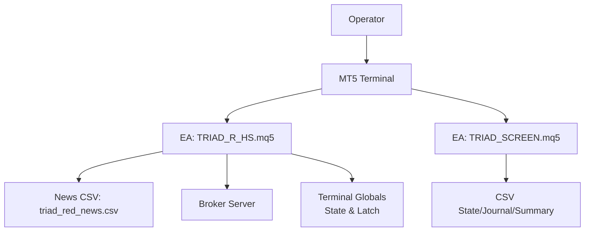
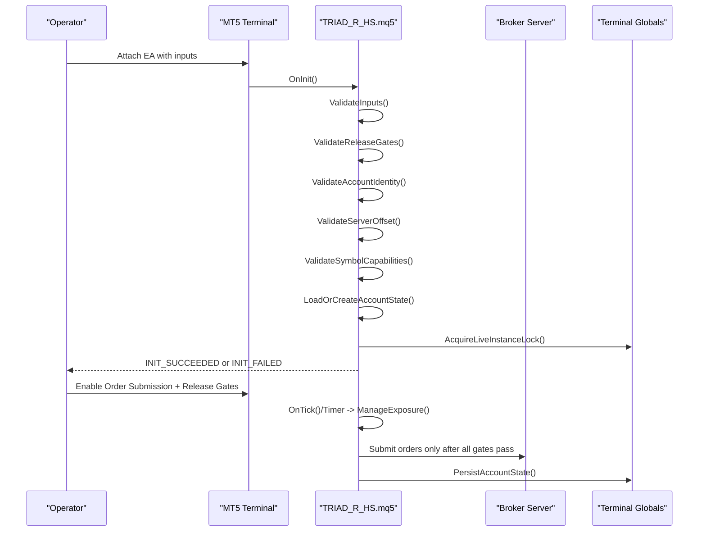
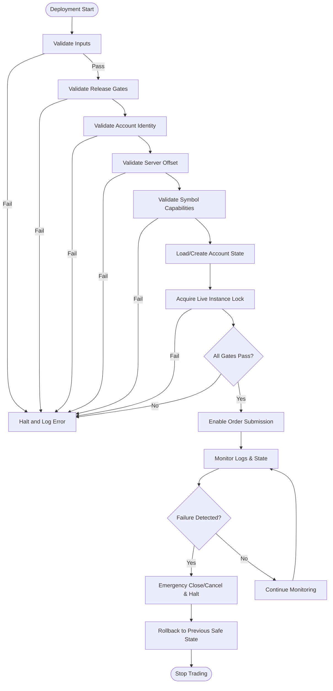
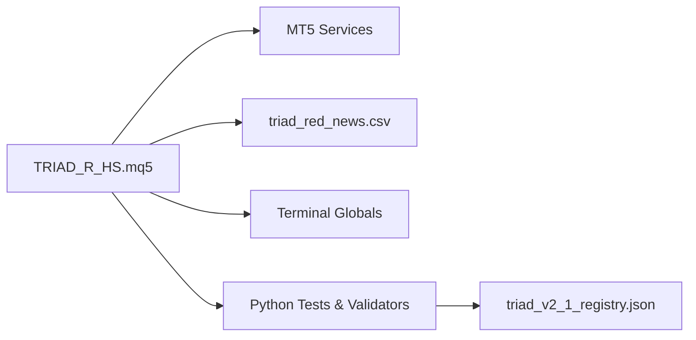

# Deployment Procedures

<cite>
**Referenced Files in This Document**
- [TRIAD_R_HS.mq5](file://MQL5/Experts/TRIAD_R_HS/TRIAD_R_HS.mq5)
- [TRIAD_SCREEN.mq5](file://MQL5/Experts/TRIAD_SCREEN/TRIAD_SCREEN.mq5)
- [triad_red_news.csv.example](file://MQL5/Files/triad_red_news.csv.example)
- [THE5ERS-END-TO-END-PRECODE-CHECKLIST.md](file://THE5ERS-END-TO-END-PRECODE-CHECKLIST.md)
- [TRIAD_R_HS-CODE-REVIEW.md](file://TRIAD_R_HS-CODE-REVIEW.md)
- [triad_v2_1_registry.json](file://validation/triad_v2_1_registry.json)
- [test_source_contract.py](file://tests/test_source_contract.py)
</cite>

## Table of Contents
1. [Introduction](#introduction)
2. [Project Structure](#project-structure)
3. [Core Components](#core-components)
4. [Architecture Overview](#architecture-overview)
5. [Detailed Component Analysis](#detailed-component-analysis)
6. [Dependency Analysis](#dependency-analysis)
7. [Performance Considerations](#performance-considerations)
8. [Troubleshooting Guide](#troubleshooting-guide)
9. [Conclusion](#conclusion)
10. [Appendices](#appendices)

## Introduction
This document provides end-to-end deployment procedures for the TRIAD-R system, focused on safe production activation for The5ers High Stakes accounts. It covers:
- Precode checklist completion and strategy freeze validation
- Account initialization requirements (product identification, server verification, symbol discovery, calendar integration)
- Step-by-step MT5 setup, EA configuration, and parameter validation
- Build hash verification, configuration integrity checks, and runtime environment testing
- Failure handling, rollback procedures, and emergency shutdown protocols

The canonical production Expert Advisor is TRIAD_R_HS.mq5; TRIAD_SCREEN.mq5 is a separate demo screening tool that mirrors strategy logic without production safety machinery.

**Section sources**
- [TRIAD_R_HS.mq5:1-14](file://MQL5/Experts/TRIAD_R_HS/TRIAD_R_HS.mq5#L1-L14)
- [TRIAD_SCREEN.mq5:1-27](file://MQL5/Experts/TRIAD_SCREEN/TRIAD_SCREEN.mq5#L1-L27)
- [THE5ERS-END-TO-END-PRECODE-CHECKLIST.md:15-16](file://THE5ERS-END-TO-END-PRECODE-CHECKLIST.md#L15-L16)

## Project Structure
Key artifacts relevant to deployment:
- Production EA: MQL5/Experts/TRIAD_R_HS/TRIAD_R_HS.mq5
- Demo screening EA: MQL5/Experts/TRIAD_SCREEN/TRIAD_SCREEN.mq5
- News calendar example: MQL5/Files/triad_red_news.csv.example
- Validation registry: validation/triad_v2_1_registry.json
- Source contract tests: tests/test_source_contract.py
- Strategy freeze and lifecycle guidance: THE5ERS-END-TO-END-PRECODE-CHECKLIST.md
- Code review notes: TRIAD_R_HS-CODE-REVIEW.md

**Diagram sources**
- [TRIAD_R_HS.mq5:213-262](file://MQL5/Experts/TRIAD_R_HS/TRIAD_R_HS.mq5#L213-L262)
- [TRIAD_SCREEN.mq5:212-286](file://MQL5/Experts/TRIAD_SCREEN/TRIAD_SCREEN.mq5#L212-L286)
- [triad_red_news.csv.example:1-7](file://MQL5/Files/triad_red_news.csv.example#L1-L7)

**Section sources**
- [TRIAD_R_HS.mq5:1-14](file://MQL5/Experts/TRIAD_R_HS/TRIAD_R_HS.mq5#L1-L14)
- [TRIAD_SCREEN.mq5:1-27](file://MQL5/Experts/TRIAD_SCREEN/TRIAD_SCREEN.mq5#L1-L27)
- [triad_red_news.csv.example:1-7](file://MQL5/Files/triad_red_news.csv.example#L1-L7)

## Core Components
- TRIAD_R_HS.mq5: Canonical production EA with fail-closed design, strict input gates, account identity checks, news calendar enforcement, instance locking, state persistence, and emergency halt latching.
- TRIAD_SCREEN.mq5: Demo-only screening EA mirroring strategy logic for visualization and forward-demo validation without persistent safety mechanisms.
- triad_red_news.csv.example: Example high-impact news events with an operator-verified coverage declaration required by the EA.
- triad_v2_1_registry.json: Frozen configuration registry used by validation tools to ensure candidate parameters match the approved V2.1 specification.
- test_source_contract.py: Automated source-contract assertions enforcing behavioral constraints (e.g., profile limits, prohibited APIs, latch structure).

**Section sources**
- [TRIAD_R_HS.mq5:52-149](file://MQL5/Experts/TRIAD_R_HS/TRIAD_R_HS.mq5#L52-L149)
- [TRIAD_SCREEN.mq5:86-156](file://MQL5/Experts/TRIAD_SCREEN/TRIAD_SCREEN.mq5#L86-L156)
- [triad_red_news.csv.example:1-7](file://MQL5/Files/triad_red_news.csv.example#L1-L7)
- [triad_v2_1_registry.json:1-15](file://validation/triad_v2_1_registry.json#L1-L15)
- [test_source_contract.py:62-86](file://tests/test_source_contract.py#L62-L86)

## Architecture Overview
The deployment architecture enforces strict preconditions before any order submission:
- Inputs are validated against allowed ranges and product rules.
- Release gates require explicit approvals and a traceable release ID.
- Account identity and server offset are verified at runtime.
- Symbol capabilities and properties are checked before trading.
- News calendar must be present and cover required hours.
- Instance lock prevents duplicate live instances.
- State persistence uses signed checksums to prevent tampering or stale recovery.
- Emergency halt latches persist across restarts until reviewed.

**Diagram sources**
- [TRIAD_R_HS.mq5:3536-3597](file://MQL5/Experts/TRIAD_R_HS/TRIAD_R_HS.mq5#L3536-L3597)
- [TRIAD_R_HS.mq5:3599-3607](file://MQL5/Experts/TRIAD_R_HS/TRIAD_R_HS.mq5#L3599-L3607)
- [TRIAD_R_HS.mq5:3654-3691](file://MQL5/Experts/TRIAD_R_HS/TRIAD_R_HS.mq5#L3654-L3691)
- [TRIAD_R_HS.mq5:494-532](file://MQL5/Experts/TRIAD_R_HS/TRIAD_R_HS.mq5#L494-L532)
- [TRIAD_R_HS.mq5:568-600](file://MQL5/Experts/TRIAD_R_HS/TRIAD_R_HS.mq5#L568-L600)

## Detailed Component Analysis

### Precode Checklist and Strategy Freeze Validation
- Complete Stage 0–16 of the End-to-End Precode Checklist, ensuring product identification, phase targets, daily/overall loss limits, profitable-day accounting, and external rule clarifications are resolved.
- Confirm strategy freeze: only Sleeve A M5 sweep/reclaim, one working entry or open position, no copier, no runtime optimization, and four paired profiles only.
- Ensure all RUNTIME, EXTERNAL, and TEST gates are satisfied before enabling order submission.

**Section sources**
- [THE5ERS-END-TO-END-PRECODE-CHECKLIST.md:31-74](file://THE5ERS-END-TO-END-PRECODE-CHECKLIST.md#L31-L74)
- [THE5ERS-END-TO-END-PRECODE-CHECKLIST.md:121-144](file://THE5ERS-END-TO-END-PRECODE-CHECKLIST.md#L121-L144)
- [THE5ERS-END-TO-END-PRECODE-CHECKLIST.md:343-361](file://THE5ERS-END-TO-END-PRECODE-CHECKLIST.md#L343-L361)

### Account Initialization Requirements
- Product identification: Required product code must match High Stakes; initial balance must be $2,500 for evaluation phases.
- Server verification: Expected UTC offset must match observed server time within tolerance; currency must be USD; leverage must be 100.
- Symbol discovery: Symbols must be unique; at least one sleeve enabled; symbol capabilities must support limit orders, SL/TP, and specified expiration.
- Calendar integration: triad_red_news.csv must include high-impact events and an operator-verified coverage declaration; missing or stale coverage fails closed.

**Section sources**
- [TRIAD_R_HS.mq5:3674-3691](file://MQL5/Experts/TRIAD_R_HS/TRIAD_R_HS.mq5#L3674-L3691)
- [TRIAD_R_HS.mq5:3654-3672](file://MQL5/Experts/TRIAD_R_HS/TRIAD_R_HS.mq5#L3654-L3672)
- [TRIAD_R_HS.mq5:3632-3651](file://MQL5/Experts/TRIAD_R_HS/TRIAD_R_HS.mq5#L3632-L3651)
- [triad_red_news.csv.example:1-7](file://MQL5/Files/triad_red_news.csv.example#L1-L7)

### MT5 Platform Setup and EA Configuration
- Install TRIAD_R_HS.mq5 into the Experts directory and compile with zero errors; investigate warnings.
- Configure inputs:
  - InpEnableOrderSubmission remains false until all release gates pass.
  - InpValidationReleaseId must be set to a traceable approved value when enabling live mode.
  - Set InpRequiredProductCode, InpPhase, InpPhaseInitialBalance, InpExpectedAccountServer, InpExpectedAccountCurrency, InpExpectedAccountLeverage.
  - Configure symbols and session priorities; ensure at least one sleeve enabled.
  - Provide triad_red_news.csv with coverage declaration.
- Verify dashboard and logs:
  - Use TRIAD_SCREEN.mq5 on demo to validate signals and fills before production.
  - Monitor audit logs and terminal globals for state integrity.

**Section sources**
- [TRIAD_R_HS.mq5:52-149](file://MQL5/Experts/TRIAD_R_HS/TRIAD_R_HS.mq5#L52-L149)
- [TRIAD_R_HS.mq5:3536-3597](file://MQL5/Experts/TRIAD_R_HS/TRIAD_R_HS.mq5#L3536-L3597)
- [TRIAD_SCREEN.mq5:86-156](file://MQL5/Experts/TRIAD_SCREEN/TRIAD_SCREEN.mq5#L86-L156)

### Parameter Validation and Registry Integrity
- Use triad_v2_1_registry.json to ensure candidate configurations match the frozen V2.1 specification.
- Run automated source-contract tests to enforce behavioral constraints:
  - Only four paired profiles with maximum risk not exceeding 0.4%.
  - Prohibited behaviors removed (partial closes, direct market entries, etc.).
  - Latch structure and signature validation intact.

**Section sources**
- [triad_v2_1_registry.json:1-15](file://validation/triad_v2_1_registry.json#L1-L15)
- [test_source_contract.py:62-86](file://tests/test_source_contract.py#L62-L86)
- [test_source_contract.py:277-310](file://tests/test_source_contract.py#L277-L310)

### Build Hash Verification and Configuration Integrity Checks
- Build ID and config hash:
  - EA_BUILD_ID identifies the exact build; BuildConfigHash includes all behavior-affecting inputs.
  - RuntimeIdentityHash binds account login, server, currency, product code, and phase.
  - AccountStateSignature signs persisted state to detect tampering or mismatched recovery.
- Validate release gates:
  - Require traceable release ID and all gate flags (statistical, stress, operational, external rules, account-specific, forward demo, compilation, user approval).

**Section sources**
- [TRIAD_R_HS.mq5:364-403](file://MQL5/Experts/TRIAD_R_HS/TRIAD_R_HS.mq5#L364-L403)
- [TRIAD_R_HS.mq5:405-428](file://MQL5/Experts/TRIAD_R_HS/TRIAD_R_HS.mq5#L405-L428)
- [TRIAD_R_HS.mq5:3599-3607](file://MQL5/Experts/TRIAD_R_HS/TRIAD_R_HS.mq5#L3599-L3607)

### Runtime Environment Testing
- Deterministic harnesses:
  - Civil-time conversion, DST mismatch weeks, entry/exit state, floor math, volume rounding, restart state, news boundaries.
- Real-tick Strategy Tester runs per symbol/session and paired profile using frozen assumptions.
- Operational drills:
  - Disconnect, stale quote, rejected/uncertain order, partial fill, duplicate exposure, missing stop, calendar failure, rollover, external cashflow at rollover, MT5 account/server switch, Friday closure, restart, deinitialization, and persisted halt.

**Section sources**
- [TRIAD_R_HS.mq5:235-262](file://MQL5/Experts/TRIAD_R_HS/TRIAD_R_HS.mq5#L235-L262)
- [TRIAD_R_HS-CODE-REVIEW.md:123-137](file://TRIAD_R_HS-CODE-REVIEW.md#L123-L137)

### Deployment Validation Steps
- Compile exact source on target MT5 build with zero errors; archive compiler output, EX5 hash, source hash, terminal build, and configuration.
- Run Python unit tests and source-contract checks; ensure all pass.
- Execute deterministic MT5 harnesses covering boundary conditions and error paths.
- Forward-demo validation on exact broker symbols/server with reconciliation of fills, commissions, swaps, stops, targets, request counts, and dashboard days.
- Explicit approval of frozen source/configuration release before enabling order submission.

**Section sources**
- [TRIAD_R_HS-CODE-REVIEW.md:98-121](file://TRIAD_R_HS-CODE-REVIEW.md#L98-L121)
- [TRIAD_R_HS.mq5:235-247](file://MQL5/Experts/TRIAD_R_HS/TRIAD_R_HS.mq5#L235-L247)

### Handling Deployment Failures, Rollback, and Emergency Shutdown
- Fail-closed defaults:
  - Order submission disabled by default; release ID locked until approved.
  - Missing or invalid inputs, account identity, server offset, symbol capabilities, or calendar coverage block trading.
- Persistent halt latches:
  - HaltLatch writes signed values to terminal globals; ReadHaltLatch validates integrity; WriteHaltLatch persists across restarts.
  - A halted journal cannot be silently bypassed by changing terminal globals.
- Instance lock fencing:
  - AcquireLiveInstanceLock prevents duplicate live instances; RefreshLiveInstanceLock fences stale instances; ReleaseLiveInstanceLock clears ownership safely.
- Emergency actions:
  - CancelAllPending and CloseAllPosition invoked on heartbeat failures or critical errors.
  - Rebase migration latch prevents ordinary reset from restoring untrustworthy state after external cashflow or unauthorized history.

**Diagram sources**
- [TRIAD_R_HS.mq5:3536-3597](file://MQL5/Experts/TRIAD_R_HS/TRIAD_R_HS.mq5#L3536-L3597)
- [TRIAD_R_HS.mq5:3599-3607](file://MQL5/Experts/TRIAD_R_HS/TRIAD_R_HS.mq5#L3599-L3607)
- [TRIAD_R_HS.mq5:473-492](file://MQL5/Experts/TRIAD_R_HS/TRIAD_R_HS.mq5#L473-L492)
- [TRIAD_R_HS.mq5:494-532](file://MQL5/Experts/TRIAD_R_HS/TRIAD_R_HS.mq5#L494-L532)
- [TRIAD_R_HS.mq5:534-554](file://MQL5/Experts/TRIAD_R_HS/TRIAD_R_HS.mq5#L534-L554)

**Section sources**
- [TRIAD_R_HS.mq5:329-350](file://MQL5/Experts/TRIAD_R_HS/TRIAD_R_HS.mq5#L329-L350)
- [TRIAD_R_HS.mq5:473-492](file://MQL5/Experts/TRIAD_R_HS/TRIAD_R_HS.mq5#L473-L492)
- [TRIAD_R_HS.mq5:494-532](file://MQL5/Experts/TRIAD_R_HS/TRIAD_R_HS.mq5#L494-L532)
- [TRIAD_R_HS.mq5:534-554](file://MQL5/Experts/TRIAD_R_HS/TRIAD_R_HS.mq5#L534-L554)
- [TRIAD_R_HS.mq5:603-617](file://MQL5/Experts/TRIAD_R_HS/TRIAD_R_HS.mq5#L603-L617)

## Dependency Analysis
- EA depends on MT5 platform services: TimeTradeServer, SymbolInfo*, AccountInfo*, GlobalVariables, indicator handles, and trade APIs via CTrade.
- News calendar dependency: triad_red_news.csv must be present and valid; coverage declaration required.
- State persistence dependency: Terminal globals used for configuration sentinel, identity hash, halt latch, and account state signature.
- Validation dependencies: Python tools and tests rely on frozen registry and source contracts to ensure compliance.

**Diagram sources**
- [TRIAD_R_HS.mq5:213-262](file://MQL5/Experts/TRIAD_R_HS/TRIAD_R_HS.mq5#L213-L262)
- [triad_red_news.csv.example:1-7](file://MQL5/Files/triad_red_news.csv.example#L1-L7)
- [triad_v2_1_registry.json:1-15](file://validation/triad_v2_1_registry.json#L1-L15)

**Section sources**
- [TRIAD_R_HS.mq5:213-262](file://MQL5/Experts/TRIAD_R_HS/TRIAD_R_HS.mq5#L213-L262)
- [triad_red_news.csv.example:1-7](file://MQL5/Files/triad_red_news.csv.example#L1-L7)
- [triad_v2_1_registry.json:1-15](file://validation/triad_v2_1_registry.json#L1-L15)

## Performance Considerations
- Request throttling: Non-emergency requests capped per day; emergency safety actions remain permitted.
- Quote freshness and latency bounds enforced to avoid stale data decisions.
- Spread and cost checks ensure trades meet profitability thresholds under live conditions.
- Volume rounding respects broker lot lattice and limits to prevent invalid orders.

[No sources needed since this section provides general guidance]

## Troubleshooting Guide
Common issues and resolutions:
- Invalid inputs or unsupported phase/profile: Correct inputs and recompile; verify ranges and product code.
- Release gates not passed: Obtain approvals and set traceable release ID; enable order submission only after all gates pass.
- Account identity mismatch: Verify product code, phase, initial balance, server, currency, and leverage.
- Server offset mismatch: Adjust expected UTC offset or correct terminal/server time; ensure tolerance within five seconds.
- Symbol capability errors: Confirm broker supports limit orders, SL/TP, and specified expiration for configured symbols.
- Calendar failure: Provide complete triad_red_news.csv with coverage declaration; ensure coverage meets required hours.
- Duplicate live instance: Ensure only one chart owns the instance lock; resolve conflicts and restart cleanly.
- Persisted state signature mismatch: Investigate terminal global corruption; do not force reset if migration latch is set.

**Section sources**
- [TRIAD_R_HS.mq5:3536-3597](file://MQL5/Experts/TRIAD_R_HS/TRIAD_R_HS.mq5#L3536-L3597)
- [TRIAD_R_HS.mq5:3599-3607](file://MQL5/Experts/TRIAD_R_HS/TRIAD_R_HS.mq5#L3599-L3607)
- [TRIAD_R_HS.mq5:3654-3691](file://MQL5/Experts/TRIAD_R_HS/TRIAD_R_HS.mq5#L3654-L3691)
- [TRIAD_R_HS.mq5:473-492](file://MQL5/Experts/TRIAD_R_HS/TRIAD_R_HS.mq5#L473-L492)
- [TRIAD_R_HS.mq5:494-532](file://MQL5/Experts/TRIAD_R_HS/TRIAD_R_HS.mq5#L494-L532)

## Conclusion
Safe deployment of TRIAD-R requires strict adherence to the precode checklist, strategy freeze, and multi-layered validation gates. The EA’s fail-closed design, persistent state signatures, and emergency halt latches provide robust protection against misconfiguration, runtime anomalies, and unauthorized state recovery. Operators should complete all RUNTIME, EXTERNAL, and TEST gates, perform comprehensive environment testing, and obtain explicit approval before enabling order submission.

[No sources needed since this section summarizes without analyzing specific files]

## Appendices

### Appendix A: Key Input Parameters for Deployment
- InpEnableOrderSubmission: Must remain false until all release gates pass.
- InpValidationReleaseId: Set to a traceable approved value when enabling live mode.
- InpRequiredProductCode: Must match High Stakes product.
- InpPhase, InpPhaseInitialBalance: Must align with evaluation or funded phase requirements.
- InpExpectedAccountServer, InpExpectedAccountCurrency, InpExpectedAccountLeverage: Must match broker account properties.
- InpEURUSDSymbol, InpGBPUSDLondon, InpUSDJPYNewYork: Configure unique symbols and enable at least one sleeve.
- InpNewsCsvFile: Provide triad_red_news.csv with coverage declaration.

**Section sources**
- [TRIAD_R_HS.mq5:52-149](file://MQL5/Experts/TRIAD_R_HS/TRIAD_R_HS.mq5#L52-L149)
- [triad_red_news.csv.example:1-7](file://MQL5/Files/triad_red_news.csv.example#L1-L7)

### Appendix B: Validation and Testing Commands
- Run Python unit tests: python3 -m unittest discover -s tests -v
- Compile exact source on target MT5 build with zero errors; archive outputs.
- Execute deterministic MT5 harnesses for civil-time conversion, DST mismatch, entry/exit state, floor math, volume rounding, restart state, and news boundaries.

**Section sources**
- [TRIAD_R_HS-CODE-REVIEW.md:98-121](file://TRIAD_R_HS-CODE-REVIEW.md#L98-L121)