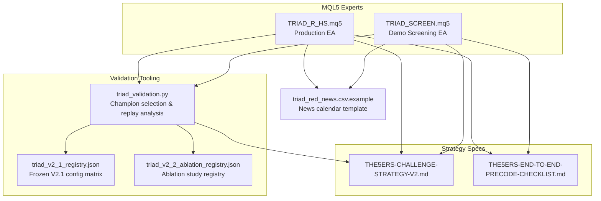
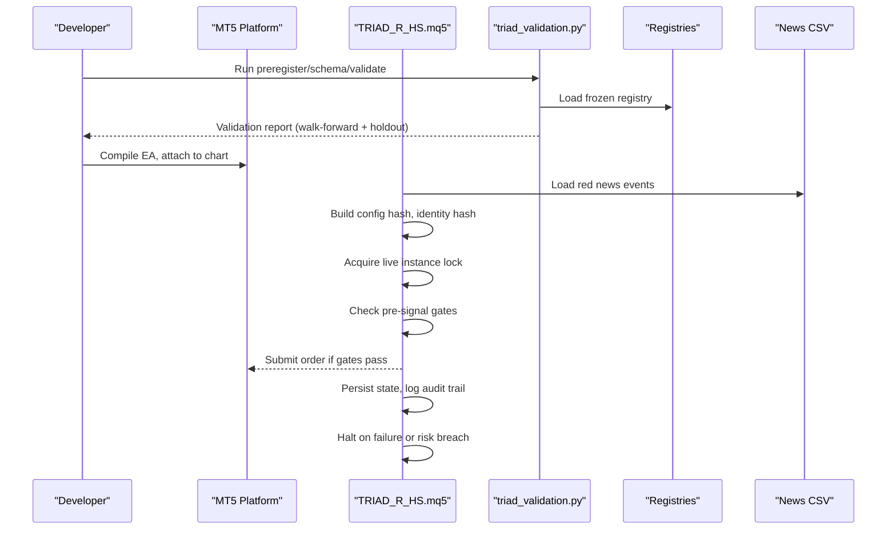
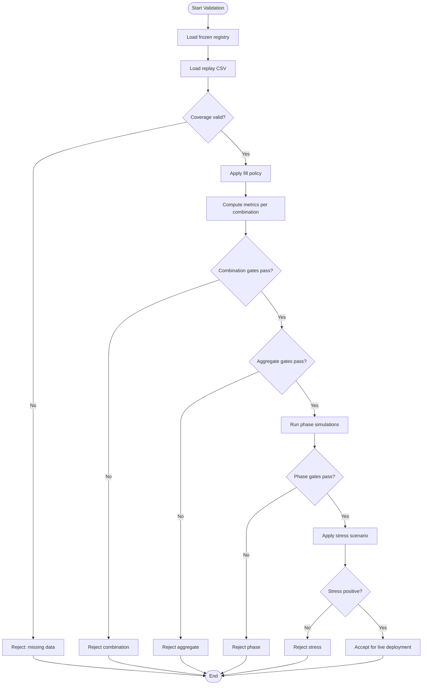
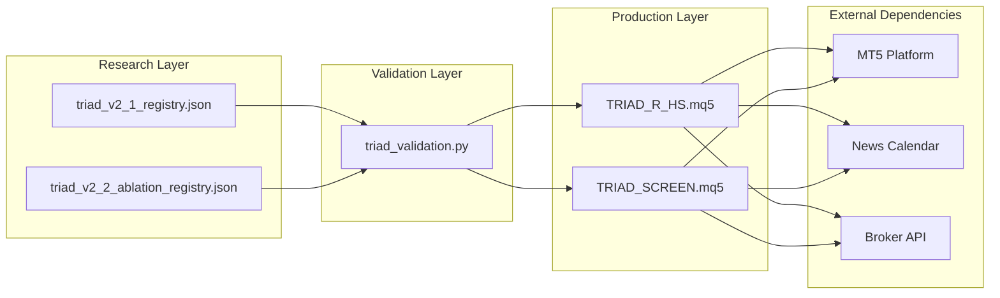

# Live Deployment

<cite>
**Referenced Files in This Document**
- [TRIAD_R_HS.mq5](file://MQL5/Experts/TRIAD_R_HS/TRIAD_R_HS.mq5)
- [TRIAD_SCREEN.mq5](file://MQL5/Experts/TRIAD_SCREEN/TRIAD_SCREEN.mq5)
- [triad_red_news.csv.example](file://MQL5/Files/triad_red_news.csv.example)
- [triad_validation.py](file://tools/triad_validation.py)
- [triad_v2_1_registry.json](file://validation/triad_v2_1_registry.json)
- [triad_v2_2_ablation_registry.json](file://validation/triad_v2_2_ablation_registry.json)
- [THE5ERS-CHALLENGE-STRATEGY-V2.md](file://THE5ERS-CHALLENGE-STRATEGY-V2.md)
- [THE5ERS-END-TO-END-PRECODE-CHECKLIST.md](file://THE5ERS-END-TO-END-PRECODE-CHECKLIST.md)
</cite>

## Table of Contents
1. [Introduction](#introduction)
2. [Project Structure](#project-structure)
3. [Core Components](#core-components)
4. [Architecture Overview](#architecture-overview)
5. [Detailed Component Analysis](#detailed-component-analysis)
6. [Dependency Analysis](#dependency-analysis)
7. [Performance Considerations](#performance-considerations)
8. [Troubleshooting Guide](#troubleshooting-guide)
9. [Conclusion](#conclusion)
10. [Appendices](#appendices)

## Introduction
This document provides a complete live deployment guide for the TRIAD-R system, from code checkout to live trading activation on MT5. It covers:
- MT5 platform setup and EA configuration
- Parameter validation and build integrity checks
- Statistical acceptance criteria (OOS fills, performance factors, walk-forward validation)
- Deployment validation steps (build hash verification, configuration integrity, runtime environment testing)
- Failure handling, rollback procedures, and emergency shutdown protocols
- Transition between evaluation phases, funded account setup, and scaling lifecycle management

The canonical strategy specification is revision 2.1, with a frozen production EA and a separate demo screening tool. The system enforces fail-closed behavior until all gates pass.

## Project Structure
The repository contains:
- MQL5 Expert Advisors for live execution and demo screening
- A Python-based offline validator that defines the frozen selection rules, thresholds, and simulation settings
- Frozen registries defining candidate configurations and ablation studies
- Strategy specifications and checklists describing challenge rules, phase transitions, and operational constraints

**Diagram sources**
- [TRIAD_R_HS.mq5:1-15](file://MQL5/Experts/TRIAD_R_HS/TRIAD_R_HS.mq5#L1-L15)
- [TRIAD_SCREEN.mq5:1-27](file://MQL5/Experts/TRIAD_SCREEN/TRIAD_SCREEN.mq5#L1-L27)
- [triad_validation.py:1-30](file://tools/triad_validation.py#L1-L30)
- [triad_v2_1_registry.json:1-15](file://validation/triad_v2_1_registry.json#L1-L15)
- [triad_v2_2_ablation_registry.json:1-15](file://validation/triad_v2_2_ablation_registry.json#L1-L15)
- [THE5ERS-CHALLENGE-STRATEGY-V2.md:1-10](file://THE5ERS-CHALLENGE-STRATEGY-V2.md#L1-L10)
- [THE5ERS-END-TO-END-PRECODE-CHECKLIST.md:341-360](file://THE5ERS-END-TO-END-PRECODE-CHECKLIST.md#L341-L360)

**Section sources**
- [TRIAD_R_HS.mq5:1-15](file://MQL5/Experts/TRIAD_R_HS/TRIAD_R_HS.mq5#L1-L15)
- [TRIAD_SCREEN.mq5:1-27](file://MQL5/Experts/TRIAD_SCREEN/TRIAD_SCREEN.mq5#L1-L27)
- [triad_validation.py:1-30](file://tools/triad_validation.py#L1-L30)
- [triad_v2_1_registry.json:1-15](file://validation/triad_v2_1_registry.json#L1-L15)
- [triad_v2_2_ablation_registry.json:1-15](file://validation/triad_v2_2_ablation_registry.json#L1-L15)
- [THE5ERS-CHALLENGE-STRATEGY-V2.md:1-10](file://THE5ERS-CHALLENGE-STRATEGY-V2.md#L1-L10)
- [THE5ERS-END-TO-END-PRECODE-CHECKLIST.md:341-360](file://THE5ERS-END-TO-END-PRECODE-CHECKLIST.md#L341-L360)

## Core Components
- Production EA (TRIAD_R_HS.mq5): Implements the canonical V2.1 strategy with strict safety controls, lifecycle locks, instance locking, halt latches, audit logging, and configuration hashing.
- Demo Screening EA (TRIAD_SCREEN.mq5): Mirrors entry logic for one symbol/session per demo account with an on-chart dashboard; intentionally omits production safety machinery.
- Validator (triad_validation.py): Defines the frozen 160-config matrix, fill policy, thresholds, walk-forward selection, holdout evaluation, and Section 13 checklist integration.
- Registries: triad_v2_1_registry.json (frozen V2.1), triad_v2_2_ablation_registry.json (ablation study).
- News calendar template: triad_red_news.csv.example with UTC timestamps and coverage declaration.

Key responsibilities:
- Build and configuration integrity via hashes and signatures
- Fail-closed operation unless all pre-signal gates pass
- Phase-aware lifecycle management and payout/scale transitions
- Robust statistical validation using walk-forward and holdout splits

**Section sources**
- [TRIAD_R_HS.mq5:16-76](file://MQL5/Experts/TRIAD_R_HS/TRIAD_R_HS.mq5#L16-L76)
- [TRIAD_SCREEN.mq5:36-156](file://MQL5/Experts/TRIAD_SCREEN/TRIAD_SCREEN.mq5#L36-L156)
- [triad_validation.py:49-159](file://tools/triad_validation.py#L49-L159)
- [triad_v2_1_registry.json:1-15](file://validation/triad_v2_1_registry.json#L1-L15)
- [triad_v2_2_ablation_registry.json:1-15](file://validation/triad_v2_2_ablation_registry.json#L1-L15)
- [triad_red_news.csv.example:1-7](file://MQL5/Files/triad_red_news.csv.example#L1-L7)

## Architecture Overview
The deployment architecture integrates MT5 execution with offline validation and strict governance:

**Diagram sources**
- [triad_validation.py:15-23](file://tools/triad_validation.py#L15-L23)
- [triad_validation.py:278-331](file://tools/triad_validation.py#L278-L331)
- [TRIAD_R_HS.mq5:268-300](file://MQL5/Experts/TRIAD_R_HS/TRIAD_R_HS.mq5#L268-L300)
- [TRIAD_R_HS.mq5:364-428](file://MQL5/Experts/TRIAD_R_HS/TRIAD_R_HS.mq5#L364-L428)
- [triad_red_news.csv.example:1-7](file://MQL5/Files/triad_red_news.csv.example#L1-L7)

## Detailed Component Analysis

### MT5 Platform Setup and EA Configuration
- Install MT5 terminal and connect to broker server
- Place TRIAD_R_HS.mq5 in Experts directory and compile
- Attach EA to chart(s) for each enabled combination (EURUSD London, GBPUSD London, USDJPY New York)
- Configure inputs:
  - InpEnableOrderSubmission must be false until all gates pass
  - InpPhase set to TRIAD_PHASE_1 or TRIAD_PHASE_2 during evaluation
  - InpProfile matches selected profile (A-D)
  - InpExpectedAccountServer and InpAuthorizedLogin restrict live context
  - InpRequiredProductCode must match HS_NEW_2500
  - InpUseEstimatedDaysInTester controls tester mode behavior
  - InpSkipFreshMidSessionStart defaults true to avoid stale mid-session reconstruction
  - InpNewsCsvFile points to triad_red_news.csv with verified coverage
  - Time stops, risk parameters, and session priorities configured per selection
- Ensure triad_red_news.csv includes operator-verified coverage through declaration line

**Section sources**
- [TRIAD_R_HS.mq5:52-149](file://MQL5/Experts/TRIAD_R_HS/TRIAD_R_HS.mq5#L52-L149)
- [triad_red_news.csv.example:1-7](file://MQL5/Files/triad_red_news.csv.example#L1-L7)
- [THE5ERS-CHALLENGE-STRATEGY-V2.md:54-95](file://THE5ERS-CHALLENGE-STRATEGY-V2.md#L54-L95)

### Statistical Acceptance Criteria
The validator enforces strict acceptance gates before live activation:

- OOS fills requirements:
  - Minimum 100 fills per enabled combination
  - Minimum 300 total fills across all combinations
- Performance factor thresholds:
  - Each enabled combination must have profit factor ≥ 1.15
  - Aggregate profit factor ≥ 1.30
  - Aggregate net expectancy ≥ 0.20R
- Walk-forward validation:
  - Selection split uses WALK_FORWARD rows only
  - Holdout split evaluates outcomes after selection is complete
  - Coverage must include every configuration/combination/day in both splits
- Stress testing:
  - Stressed scenario applies increased spread/slippage multipliers
  - Must remain positive under stress
- Phase probability gates:
  - Phase 1 pass probability ≥ 70%
  - Phase 2 pass probability ≥ 85%
  - Joint pass probability ≥ 60%
- Qualifying days:
  - Three qualifying days by target must achieve ≥ 99% probability
- Drawdown limits:
  - Maximum P99 drawdown fraction ≤ 6%
- Year robustness:
  - No single year responsible for entire profit; removing best year leaves positive remainder

**Diagram sources**
- [triad_validation.py:278-331](file://tools/triad_validation.py#L278-L331)
- [triad_validation.py:440-473](file://tools/triad_validation.py#L440-L473)
- [triad_validation.py:480-497](file://tools/triad_validation.py#L480-L497)
- [triad_validation.py:646-708](file://tools/triad_validation.py#L646-L708)
- [triad_validation.py:899-948](file://tools/triad_validation.py#L899-L948)
- [triad_validation.py:1217-1248](file://tools/triad_validation.py#L1217-L1248)

**Section sources**
- [triad_validation.py:131-146](file://tools/triad_validation.py#L131-L146)
- [triad_validation.py:242-267](file://tools/triad_validation.py#L242-L267)
- [triad_validation.py:440-473](file://tools/triad_validation.py#L440-L473)
- [triad_validation.py:646-708](file://tools/triad_validation.py#L646-L708)
- [triad_validation.py:899-948](file://tools/triad_validation.py#L899-L948)
- [triad_validation.py:1217-1248](file://tools/triad_validation.py#L1217-L1248)
- [THE5ERS-END-TO-END-PRECODE-CHECKLIST.md:341-360](file://THE5ERS-END-TO-END-PRECODE-CHECKLIST.md#L341-L360)

### Build Hash Verification and Configuration Integrity
The EA implements multiple layers of integrity verification:

- Build ID constant: EA_BUILD_ID identifies the compiled version
- Configuration hash: BuildConfigHash() creates a fingerprint of all critical inputs
- Runtime identity hash: RuntimeIdentityHash() binds configuration to account/server/product
- Account state signature: AccountStateSignature() signs persisted state including day keys, balances, and counters
- Halt latch: WriteHaltLatch()/ReadHaltLatch() persists halt state with signature validation
- Instance lock: GlobalVariable-based ownership prevents duplicate live instances

Verification workflow:
1. On initialization, compute configuration hash and compare with stored value
2. Verify runtime identity matches expected account/server/product
3. Validate persisted state signature against current configuration
4. If mismatch detected, halt and prevent new orders
5. Require explicit user approval flags to proceed

**Section sources**
- [TRIAD_R_HS.mq5:209-212](file://MQL5/Experts/TRIAD_R_HS/TRIAD_R_HS.mq5#L209-L212)
- [TRIAD_R_HS.mq5:364-428](file://MQL5/Experts/TRIAD_R_HS/TRIAD_R_HS.mq5#L364-L428)
- [TRIAD_R_HS.mq5:449-492](file://MQL5/Experts/TRIAD_R_HS/TRIAD_R_HS.mq5#L449-L492)
- [TRIAD_R_HS.mq5:494-566](file://MQL5/Experts/TRIAD_R_HS/TRIAD_R_HS.mq5#L494-L566)

### Runtime Environment Testing
Before enabling order submission, verify:

- Server time zone: InpExpectedServerUtcOffsetHours must match actual server offset
- News calendar: triad_red_news.csv must contain verified coverage through declaration
- Quote health: Max quote age and deviation points within tested bounds
- Symbol properties: Volume step, minimum lot, stop levels, tick size
- Execution latency: Trade request latency within acceptable range
- Calendar coverage: Required news coverage hours met for all relevant currencies
- Instance lock: Only one live instance can own the account at a time

Testing procedure:
1. Run in tester mode with InpEnableOrderSubmission=false
2. Verify signal generation without order submission
3. Confirm news blackout periods respected
4. Test session boundaries and rollover handling
5. Validate state persistence across restarts
6. Verify halt conditions trigger correctly

**Section sources**
- [TRIAD_R_HS.mq5:78-90](file://MQL5/Experts/TRIAD_R_HS/TRIAD_R_HS.mq5#L78-L90)
- [TRIAD_R_HS.mq5:268-281](file://MQL5/Experts/TRIAD_R_HS/TRIAD_R_HS.mq5#L268-L281)
- [TRIAD_R_HS.mq5:494-566](file://MQL5/Experts/TRIAD_R_HS/TRIAD_R_HS.mq5#L494-L566)
- [triad_red_news.csv.example:1-7](file://MQL5/Files/triad_red_news.csv.example#L1-L7)

### Deployment Validation Steps
Complete validation pipeline:

1. **Pre-registration**: Generate frozen registry with sha256 hash
2. **Data export**: Export replay rows covering all configurations and combinations
3. **Schema validation**: Verify CSV format and field types
4. **Coverage validation**: Ensure complete day coverage across splits
5. **Selection**: Choose champion using walk-forward only
6. **Holdout evaluation**: Evaluate selected configuration on untouched holdout
7. **Section 13 checklist**: Verify firm-floor protection, stress scenarios, confidence bounds
8. **Report generation**: Produce comprehensive validation report

**Section sources**
- [triad_validation.py:15-23](file://tools/triad_validation.py#L15-L23)
- [triad_validation.py:278-331](file://tools/triad_validation.py#L278-L331)
- [triad_validation.py:360-437](file://tools/triad_validation.py#L360-L437)
- [triad_validation.py:440-473](file://tools/triad_validation.py#L440-L473)
- [triad_validation.py:1380-1385](file://tools/triad_validation.py#L1380-L1385)

### Handling Deployment Failures and Rollback Procedures
Failure response matrix:

| Failure Type | Response | Recovery |
|---|---|---|
| Unknown account/profile | Halt immediately | Verify authorized login and product code |
| Configuration hash mismatch | Halt and block orders | Re-verify inputs and rebuild EA |
| Stale quote/bar | Block new orders | Wait for fresh quotes |
| Calendar missing/stale | Block new orders | Update news CSV with verified coverage |
| Server rollover mismatch | Halt and reconcile | Verify server time and offsets |
| Order rejected | One delayed retry maximum | Investigate rejection reason |
| Duplicate positions | Cancel entries, flatten safely | Reconcile broker state |
| Request cap reached | Block entries, allow safety ops | Wait for next server day |
| Firm-floor danger | Emergency exposure reduction | Close positions, halt strategy |
| EA/VPS restart | Reconstruct from broker state | Validate state integrity |

Rollback procedure:
1. Immediately disable InpEnableOrderSubmission
2. Close all open positions safely
3. Preserve audit logs and state files
4. Investigate root cause using error logs
5. Fix configuration or environment issues
6. Re-run validation if configuration changed
7. Re-enable order submission only after resolution

**Section sources**
- [TRIAD_R_HS.mq5:329-350](file://MQL5/Experts/TRIAD_R_HS/TRIAD_R_HS.mq5#L329-L350)
- [TRIAD_R_HS.mq5:568-617](file://MQL5/Experts/TRIAD_R_HS/TRIAD_R_HS.mq5#L568-L617)
- [THE5ERS-END-TO-END-PRECODE-CHECKLIST.md:319-338](file://THE5ERS-END-TO-END-PRECODE-CHECKLIST.md#L319-L338)

### Emergency Shutdown Protocols
Emergency shutdown triggers:

- Firm floor breach imminent
- Duplicate position detected
- Missing broker-visible stop
- Calendar coverage gap
- State signature mismatch
- Instance lock conflict
- Excessive slippage/gap overrun

Shutdown sequence:
1. Set g_halted=true and persist halt latch with reason
2. Cancel all pending orders
3. Close all open positions
4. Remove configuration sentinel to prevent silent restart
5. Log detailed error information
6. Require manual intervention to reset

**Section sources**
- [TRIAD_R_HS.mq5:329-350](file://MQL5/Experts/TRIAD_R_HS/TRIAD_R_HS.mq5#L329-L350)
- [TRIAD_R_HS.mq5:473-492](file://MQL5/Experts/TRIAD_R_HS/TRIAD_R_HS.mq5#L473-L492)
- [TRIAD_R_HS.mq5:534-566](file://MQL5/Experts/TRIAD_R_HS/TRIAD_R_HS.mq5#L534-L566)

### Transition Between Evaluation Phases
Phase transition protocol:

- Phase 1 to Phase 2: Requires reaching +10% target and three qualifying days
- Phase 2 to Funded: Requires reaching +5% target and three qualifying days
- Each transition requires dashboard confirmation and human verification
- Never reuse evaluation floor/counter state for funded accounts
- Re-read funded agreement terms, symbols, leverage, and payout rules
- Maintain same source version, entry logic, and risk process through first payout

Transition validation:
1. Verify target achievement and qualifying days
2. Confirm no open positions or pending orders
3. Reinitialize state with new initial balance
4. Validate funded account permissions and restrictions
5. Continue monitoring with enhanced scrutiny

**Section sources**
- [THE5ERS-CHALLENGE-STRATEGY-V2.md:416-431](file://THE5ERS-CHALLENGE-STRATEGY-V2.md#L416-L431)
- [THE5ERS-END-TO-END-PRECODE-CHECKLIST.md:278-296](file://THE5ERS-END-TO-END-PRECODE-CHECKLIST.md#L278-L296)

### Funded Account Setup and Scaling Lifecycle Management
Funded account setup:
- Treat as new account/configuration event
- Read and persist funded initial balance and floors
- Re-read symbol specifications, leverage, and payout terms
- Maintain same strategy and risk process through first payout
- Track scaling days separately from evaluation days

Scaling lifecycle:
- Scale-up requires closing all trades first
- After scaling, treat as new configuration event
- Verify new level initial balance and floors
- Reset payout timer and require clean initialization
- No expansion to additional accounts or sleeves before review
- Maintain one-position rule throughout

Payout controls:
- Enter PAYOUT_REQUEST_LOCK before requesting payout
- Cancel pending entries and close all open trades
- Reconcile balance and dashboard status
- Human confirmation required before processing
- Never submit payout automatically

**Section sources**
- [THE5ERS-CHALLENGE-STRATEGY-V2.md:416-431](file://THE5ERS-CHALLENGE-STRATEGY-V2.md#L416-L431)
- [THE5ERS-END-TO-END-PRECODE-CHECKLIST.md:300-314](file://THE5ERS-END-TO-END-PRECODE-CHECKLIST.md#L300-L314)

## Dependency Analysis
The system exhibits clear separation between research, validation, and production components:

**Diagram sources**
- [triad_v2_1_registry.json:1-15](file://validation/triad_v2_1_registry.json#L1-L15)
- [triad_v2_2_ablation_registry.json:1-15](file://validation/triad_v2_2_ablation_registry.json#L1-L15)
- [triad_validation.py:1-30](file://tools/triad_validation.py#L1-L30)
- [TRIAD_R_HS.mq5:1-15](file://MQL5/Experts/TRIAD_R_HS/TRIAD_R_HS.mq5#L1-L15)
- [TRIAD_SCREEN.mq5:1-27](file://MQL5/Experts/TRIAD_SCREEN/TRIAD_SCREEN.mq5#L1-L27)

**Section sources**
- [triad_validation.py:278-331](file://tools/triad_validation.py#L278-L331)
- [TRIAD_R_HS.mq5:268-300](file://MQL5/Experts/TRIAD_R_HS/TRIAD_R_HS.mq5#L268-L300)
- [TRIAD_SCREEN.mq5:212-287](file://MQL5/Experts/TRIAD_SCREEN/TRIAD_SCREEN.mq5#L212-L287)

## Performance Considerations
- Order submission disabled by default until all validation gates pass
- One-position rule minimizes complexity and risk exposure
- Session-based trading reduces overnight risk and funding costs
- Risk fractions capped at 0.40% maximum to preserve capital
- News blackout periods prevent trading around high-impact events
- Request rate limiting prevents excessive API calls
- Audit logging enables post-trade analysis and compliance verification
- State persistence ensures recovery after restarts or crashes

## Troubleshooting Guide
Common issues and resolutions:

**Build and Configuration Issues:**
- Configuration hash mismatch: Verify all input parameters match validated configuration
- Build ID mismatch: Recompile EA from validated source
- Registry hash mismatch: Re-run preregister command with correct data

**Runtime Environment Issues:**
- News calendar errors: Update triad_red_news.csv with verified coverage
- Quote age exceeded: Check network connectivity and broker feed
- Server time mismatch: Verify MT5 server timezone and EA offset setting
- Instance lock conflicts: Ensure only one EA instance runs per account

**Trading Issues:**
- Orders rejected: Check broker restrictions, margin requirements, and symbol availability
- Partial fills: Reconcile position sizes and adjust risk calculations
- Stop levels invalid: Verify symbol stop levels and adjust order prices
- Insufficient liquidity: Reduce position sizes or trade during active sessions

**Statistical Validation Issues:**
- Insufficient fills: Extend backtest period or adjust parameter ranges
- Negative profitability: Review entry logic and market conditions
- Walk-forward failures: Investigate regime changes and parameter stability
- Holdout degradation: Check for overfitting and validate out-of-sample performance

**Section sources**
- [TRIAD_R_HS.mq5:299-327](file://MQL5/Experts/TRIAD_R_HS/TRIAD_R_HS.mq5#L299-L327)
- [TRIAD_SCREEN.mq5:329-354](file://MQL5/Experts/TRIAD_SCREEN/TRIAD_SCREEN.mq5#L329-L354)
- [triad_validation.py:360-437](file://tools/triad_validation.py#L360-L437)
- [THE5ERS-END-TO-END-PRECODE-CHECKLIST.md:319-338](file://THE5ERS-END-TO-END-PRECODE-CHECKLIST.md#L319-L338)

## Conclusion
The TRIAD-R system implements a comprehensive, fail-closed deployment pipeline with rigorous validation and safety controls. The system separates research, validation, and production concerns while maintaining strict governance over live trading activation. Key success factors include:

- Complete statistical validation with walk-forward and holdout splits
- Robust configuration integrity verification through hashing and signatures
- Comprehensive failure handling with automatic shutdown capabilities
- Clear phase transition protocols with human oversight
- Scalable lifecycle management for funded accounts and payouts

The system prioritizes capital preservation and compliance over aggressive returns, ensuring sustainable long-term performance while meeting challenge requirements. All deployment decisions are backed by quantitative evidence and conservative risk management principles.

## Appendices

### A. Pre-Deployment Checklist
- [ ] Statistical validation passes all gates
- [ ] Build hash verified against validated source
- [ ] Configuration hash matches expected values
- [ ] News calendar contains verified coverage
- [ ] MT5 platform connected to approved broker
- [ ] Account permissions verified for EA trading
- [ ] Instance lock mechanism tested
- [ ] Audit logging functional and accessible
- [ ] Emergency shutdown procedures documented
- [ ] Rollback procedures tested and understood

### B. Post-Deployment Monitoring
- Daily review of audit logs and trade activity
- Weekly validation of statistical performance metrics
- Monthly compliance review against challenge rules
- Quarterly revalidation of strategy performance
- Immediate investigation of any halt events or errors
- Continuous monitoring of news calendar accuracy
- Regular backup of state files and configuration

### C. Emergency Contact Procedures
- Define escalation paths for different failure types
- Establish communication channels for rapid response
- Document decision authority for emergency actions
- Create runbooks for common emergency scenarios
- Practice emergency procedures regularly

**Section sources**
- [THE5ERS-END-TO-END-PRECODE-CHECKLIST.md:341-360](file://THE5ERS-END-TO-END-PRECODE-CHECKLIST.md#L341-L360)
- [TRIAD_R_HS.mq5:299-327](file://MQL5/Experts/TRIAD_R_HS/TRIAD_R_HS.mq5#L299-L327)
- [triad_validation.py:899-948](file://tools/triad_validation.py#L899-L948)