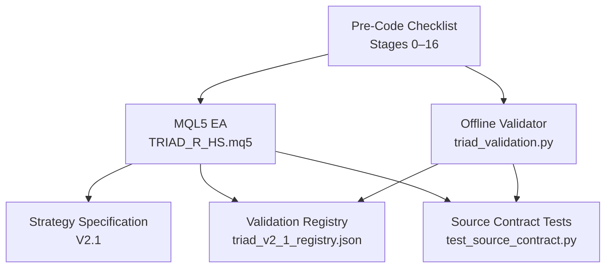
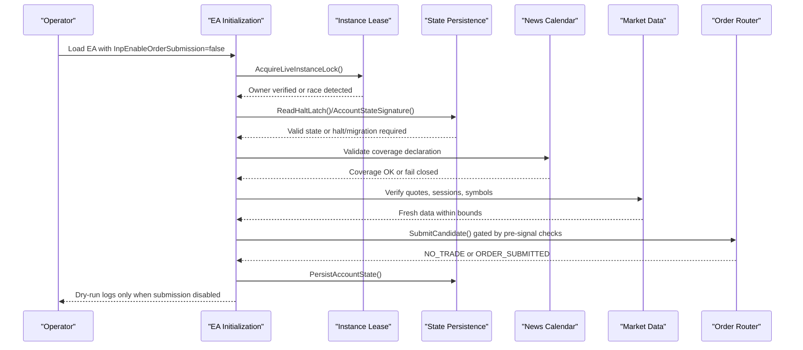
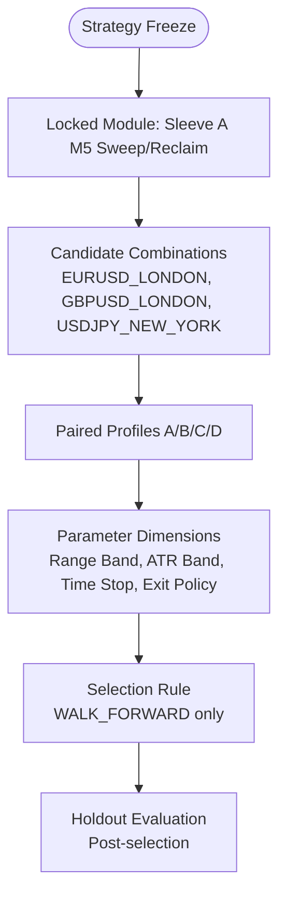
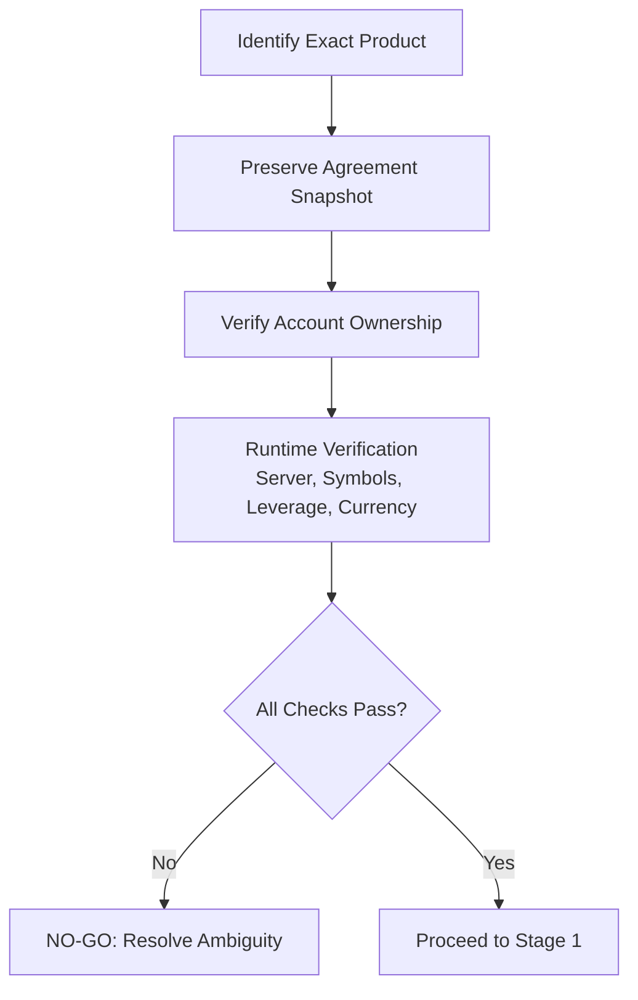
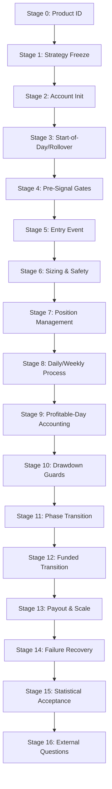
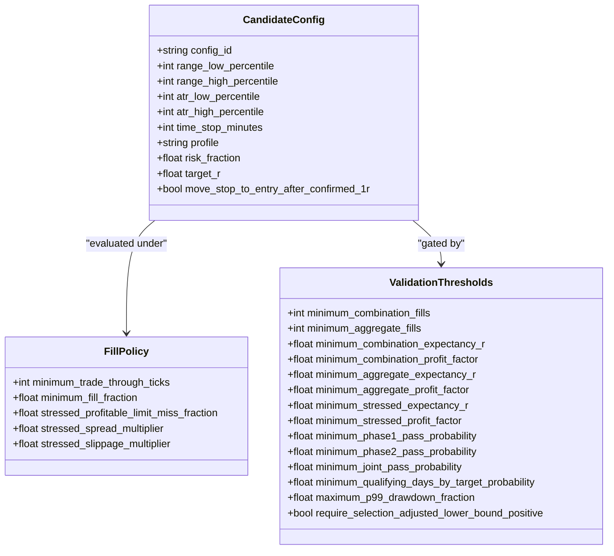
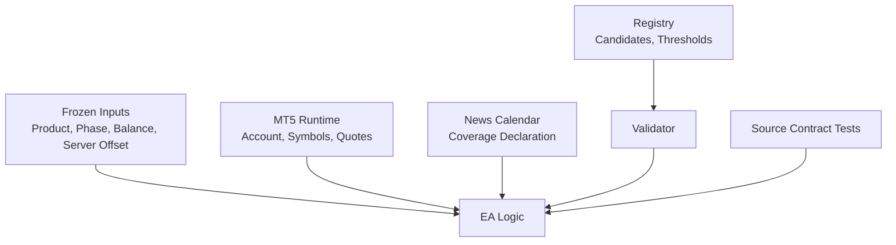

# Pre-Code Validation

<cite>
**Referenced Files in This Document**
- [THE5ERS-END-TO-END-PRECODE-CHECKLIST.md](file://THE5ERS-END-TO-END-PRECODE-CHECKLIST.md)
- [TRIAD_R_HS-CODE-REVIEW.md](file://TRIAD_R_HS-CODE-REVIEW.md)
- [TRIAD_R_HS.mq5](file://MQL5/Experts/TRIAD_R_HS/TRIAD_R_HS.mq5)
- [triad_validation.py](file://tools/triad_validation.py)
- [triad_v2_1_registry.json](file://validation/triad_v2_1_registry.json)
- [test_source_contract.py](file://tests/test_source_contract.py)
- [test_validation.py](file://tests/test_validation.py)
</cite>

## Table of Contents
1. [Introduction](#introduction)
2. [Project Structure](#project-structure)
3. [Core Components](#core-components)
4. [Architecture Overview](#architecture-overview)
5. [Detailed Component Analysis](#detailed-component-analysis)
6. [Dependency Analysis](#dependency-analysis)
7. [Performance Considerations](#performance-considerations)
8. [Troubleshooting Guide](#troubleshooting-guide)
9. [Conclusion](#conclusion)
10. [Appendices](#appendices)

## Introduction
This document provides comprehensive pre-code validation guidance for the TRIAD-R system targeting The5ers $2,500 New High Stakes. It consolidates the complete strategy freeze validation process, product identification requirements, and the full Stage 0–Stage 16 checklist. It also explains how to handle NO-GO conditions, external dependencies, and runtime verification requirements before any coding begins. The goal is to ensure that no live trading occurs until all frozen rules, candidate validations, and compliance gates are satisfied by evidence produced from offline research and testing.

## Project Structure
The repository contains:
- MQL5 Expert Advisor source implementing the TRIAD-R High Stakes strategy with strict fail-closed defaults and explicit release gates.
- A Python-based offline validation tool and a committed registry defining the V2.1 candidate matrix, thresholds, fill policy, and selection rules.
- Tests validating registry integrity, replay coverage, selection logic, and source contract constraints.
- Documentation describing the end-to-end pre-code checklist across stages and a code review summarizing static findings and blockers.

**Diagram sources**
- [TRIAD_R_HS.mq5:1-150](file://MQL5/Experts/TRIAD_R_HS/TRIAD_R_HS.mq5#L1-L150)
- [triad_validation.py:1-180](file://tools/triad_validation.py#L1-L180)
- [triad_v2_1_registry.json:1-120](file://validation/triad_v2_1_registry.json#L1-L120)
- [test_source_contract.py:60-120](file://tests/test_source_contract.py#L60-L120)
- [THE5ERS-END-TO-END-PRECODE-CHECKLIST.md:1-120](file://THE5ERS-END-TO-END-PRECODE-CHECKLIST.md#L1-L120)

**Section sources**
- [TRIAD_R_HS.mq5:1-150](file://MQL5/Experts/TRIAD_R_HS/TRIAD_R_HS.mq5#L1-L150)
- [triad_validation.py:1-180](file://tools/triad_validation.py#L1-L180)
- [triad_v2_1_registry.json:1-120](file://validation/triad_v2_1_registry.json#L1-L120)
- [test_source_contract.py:60-120](file://tests/test_source_contract.py#L60-L120)
- [THE5ERS-END-TO-END-PRECODE-CHECKLIST.md:1-120](file://THE5ERS-END-TO-END-PRECODE-CHECKLIST.md#L1-L120)

## Core Components
- Strategy Freeze and Candidate Matrix:
  - Only Sleeve A M5 sweep/reclaim is allowed.
  - Candidate combinations: EURUSD London, GBPUSD London, USDJPY New York.
  - Disabled modules include gold, indices, continuation, Asian fade, grid, martingale, averaging.
  - Four paired risk/target profiles: A (0.40%/+1.5R), B (0.35%/+1.75R), C (0.30%/+2.0R), D (0.25%/+2.5R).
  - Time-stop candidates: 30/45/60/90 minutes or session-only; breakeven after +1R confirmed close is a candidate.
  - No partial closes in initial implementation.

- Product Identification Requirements:
  - Exact product must be “$2,500 New High Stakes”; phase targets 10% Phase 1 and 5% Phase 2; profitable days three per phase at 0.5% of initial balance; overall loss 10% below phase initial balance; evaluation daily loss 5% of higher prior rollover balance/equity; inactivity 30 consecutive evaluation days.
  - Agreement snapshot preservation required (PDF/screenshots/version/timestamp).
  - Account ownership verification required (user identity, KYC, payment, email, access only).
  - Jurisdiction eligibility must be confirmed at checkout/KYC.

- Pre-Code Checklist Stages 0–16:
  - Stage 0: Identify exact product and preserve agreement snapshot; verify account ownership and jurisdiction.
  - Stage 1: Strategy freeze with locked modules, candidate combinations, disabled modules, one-position rule, no copier, parameter dimension restrictions, and TEST vs LOCKED status for parameters.
  - Stage 2: Account initialization checks including server/product match, initial balance, build/config hash, symbol properties, tick/contract values, volume steps, stop/freeze levels, commission/swap, sessions, rollover behavior, time zones, calendar mapping, and existing state reconciliation.
  - Stage 3: Start-of-day and rollover snapshots, firm floors, internal reserves, previous-day balance, day/week resets, news refresh, and flat exposure at rollover.
  - Stage 4: Before every signal/order gates covering session, range/ATR bands, spread/cost/news/data/account mutex/target room/stop geometry/volume/safety projection/direction evidence.
  - Stage 5: Entry event sequence with sweep/reclaim/displacement limit order, visible exits, expiry, no market chase, and rejection handling.
  - Stage 6: Position sizing and order safety using OrderCalcProfit, cost reserve, volume rounding, minimum lot skip, target solving, and request caps.
  - Stage 7: Open-position management enforcing one position, +1R confirmation, optional breakeven, time/session/news/rollover/Friday stops, equity monitoring, and emergency shutdown at 5% drawdown.
  - Stage 8: Daily/weekly process with first net-positive exit locking the day, second trade allowance under safe projected stop, third trade prohibition, recovery trade prohibition, direction alternation prohibition, qualifying-day chase prohibition, internal daily/weekly stops, and day-end reconciliation.
  - Stage 9: Profitable-day accounting with threshold, formula, counts per phase, cross-date prohibitions, dashboard authority, and simulation requirement.
  - Stage 10: Drawdown and completion guards with paired profile risk, 50% reduction at 2%, shutdown at 5%, near-target policies, target plus days lock, pending-days handling, and calendar-month non-reset.
  - Stage 11: Phase target and transition requiring balance and days, new-account handshake, re-read rules/specs, same champion parameters, and no-order transition lock.
  - Stage 12: Funded transition treating it as a new configuration event, reading initial balance/floors/specs, same strategy/risk process, one-position rule, inactivity, scaling days/target, and expansion policy.
  - Stage 13: Payout and scale lifecycle with evaluation payout prohibition, first funded request timing, later requests cadence, minimum amount, open trades closure, human-only payout action, processing fees, refund terms, scale target, scale transition, and payout timer reset.
  - Stage 14: Failure and recovery paths covering unknown profile, config mismatch, stale data/calendar/server rollover, order rejection retry, missing visible stop correction, duplicate positions, partial fills, request cap, daily/weekly/strategy floor, firm-floor danger, restart reconstruction, manual trade detection, gap/slippage overrun logging.
  - Stage 15: Statistical and operational acceptance thresholds including OOS fills, positive PF, aggregate EV/PF, stress tests, walk-forward/holdout, parameter dimensions, bootstrap paths, pass probabilities, qualifying-day probability, shutdown overshoot stress, inactivity failure check, forward-demo fills, and zero errors.
  - Stage 16: External questions on bulk-trading interpretation, risk reduction acceptability, rollover boundary behavior, and payout/scaling terms; partial closing removed from initial implementation.

**Section sources**
- [THE5ERS-END-TO-END-PRECODE-CHECKLIST.md:31-390](file://THE5ERS-END-TO-END-PRECODE-CHECKLIST.md#L31-L390)
- [TRIAD_R_HS.mq5:52-150](file://MQL5/Experts/TRIAD_R_HS/TRIAD_R_HS.mq5#L52-L150)
- [triad_validation.py:54-180](file://tools/triad_validation.py#L54-L180)
- [triad_v2_1_registry.json:1-120](file://validation/triad_v2_1_registry.json#L1-L120)

## Architecture Overview
The TRIAD-R architecture enforces a fail-closed design with explicit release gates and immutable strategy boundaries. The EA reads frozen inputs, validates account identity and environment, enforces one-position topology, and applies strict pre-signal gates before entry. Offline validation uses a committed registry to define candidate configurations and thresholds, ensuring selection and holdout splits remain independent and auditable.

**Diagram sources**
- [TRIAD_R_HS.mq5:273-330](file://MQL5/Experts/TRIAD_R_HS/TRIAD_R_HS.mq5#L273-L330)
- [TRIAD_R_HS.mq5:494-566](file://MQL5/Experts/TRIAD_R_HS/TRIAD_R_HS.mq5#L494-L566)
- [TRIAD_R_HS.mq5:568-617](file://MQL5/Experts/TRIAD_R_HS/TRIAD_R_HS.mq5#L568-L617)
- [triad_validation.py:278-331](file://tools/triad_validation.py#L278-L331)

**Section sources**
- [TRIAD_R_HS.mq5:273-617](file://MQL5/Experts/TRIAD_R_HS/TRIAD_R_HS.mq5#L273-L617)
- [triad_validation.py:278-331](file://tools/triad_validation.py#L278-L331)

## Detailed Component Analysis

### Strategy Freeze and Candidate Combinations
- Locked modules: Sleeve A M5 sweep/reclaim only; no gold, indices, continuation, Asian fade, grid, martingale, averaging.
- Candidate combinations: EURUSD London, GBPUSD London, USDJPY New York.
- Disabled modules enforced by specification and validated by source contract tests.
- Parameter dimensions restricted to range band, ATR band, time stop, categorical exit policy; no runtime optimization.
- Paired profiles A/B/C/D tested offline; selection based on WALK_FORWARD rows only; HOLDOUT evaluated post-selection.

**Diagram sources**
- [THE5ERS-END-TO-END-PRECODE-CHECKLIST.md:52-74](file://THE5ERS-END-TO-END-PRECODE-CHECKLIST.md#L52-L74)
- [triad_validation.py:242-267](file://tools/triad_validation.py#L242-L267)
- [triad_v2_1_registry.json:1-120](file://validation/triad_v2_1_registry.json#L1-L120)

**Section sources**
- [THE5ERS-END-TO-END-PRECODE-CHECKLIST.md:52-74](file://THE5ERS-END-TO-END-PRECODE-CHECKLIST.md#L52-L74)
- [triad_validation.py:242-267](file://tools/triad_validation.py#L242-L267)
- [triad_v2_1_registry.json:1-120](file://validation/triad_v2_1_registry.json#L1-L120)

### Product Identification Requirements
- Exact product confirmation: Must be “$2,500 New High Stakes”; cannot infer from generic “2-Step” due to conflicting rules.
- Agreement snapshot preservation: Save PDF/screenshots/version and purchase timestamp; verify price and terms.
- Account ownership verification: User’s own identity, KYC, payment, email, and access only; jurisdiction eligibility confirmed at checkout/KYC.
- Runtime verification: Confirm product/phase, initial balance, server, symbols, leverage, currency, and rules against authorized record.

**Diagram sources**
- [THE5ERS-END-TO-END-PRECODE-CHECKLIST.md:31-48](file://THE5ERS-END-TO-END-PRECODE-CHECKLIST.md#L31-L48)
- [TRIAD_R_HS.mq5:52-76](file://MQL5/Experts/TRIAD_R_HS/TRIAD_R_HS.mq5#L52-L76)

**Section sources**
- [THE5ERS-END-TO-END-PRECODE-CHECKLIST.md:31-48](file://THE5ERS-END-TO-END-PRECODE-CHECKLIST.md#L31-L48)
- [TRIAD_R_HS.mq5:52-76](file://MQL5/Experts/TRIAD_R_HS/TRIAD_R_HS.mq5#L52-L76)

### Pre-Code Checklist Stages 0–16
- Stage 0: Product identification and agreement snapshot; account ownership and jurisdiction.
- Stage 1: Strategy freeze with locked modules, candidate combinations, disabled modules, one-position rule, no copier, parameter dimension restrictions, and TEST vs LOCKED status.
- Stage 2: Account initialization with server/product match, initial balance, build/config hash, symbol properties, tick/contract values, volume steps, stop/freeze levels, commission/swap, sessions, rollover behavior, time zones, calendar mapping, and existing state reconciliation.
- Stage 3: Start-of-day and rollover snapshots, firm floors, internal reserves, previous-day balance, day/week resets, news refresh, and flat exposure at rollover.
- Stage 4: Pre-signal gates covering session, range/ATR bands, spread/cost/news/data/account mutex/target room/stop geometry/volume/safety projection/direction evidence.
- Stage 5: Entry event sequence with sweep/reclaim/displacement limit order, visible exits, expiry, no market chase, and rejection handling.
- Stage 6: Position sizing and order safety using OrderCalcProfit, cost reserve, volume rounding, minimum lot skip, target solving, and request caps.
- Stage 7: Open-position management enforcing one position, +1R confirmation, optional breakeven, time/session/news/rollover/Friday stops, equity monitoring, and emergency shutdown at 5% drawdown.
- Stage 8: Daily/weekly process with first net-positive exit locking the day, second trade allowance under safe projected stop, third trade prohibition, recovery trade prohibition, direction alternation prohibition, qualifying-day chase prohibition, internal daily/weekly stops, and day-end reconciliation.
- Stage 9: Profitable-day accounting with threshold, formula, counts per phase, cross-date prohibitions, dashboard authority, and simulation requirement.
- Stage 10: Drawdown and completion guards with paired profile risk, 50% reduction at 2%, shutdown at 5%, near-target policies, target plus days lock, pending-days handling, and calendar-month non-reset.
- Stage 11: Phase target and transition requiring balance and days, new-account handshake, re-read rules/specs, same champion parameters, and no-order transition lock.
- Stage 12: Funded transition treating it as a new configuration event, reading initial balance/floors/specs, same strategy/risk process, one-position rule, inactivity, scaling days/target, and expansion policy.
- Stage 13: Payout and scale lifecycle with evaluation payout prohibition, first funded request timing, later requests cadence, minimum amount, open trades closure, human-only payout action, processing fees, refund terms, scale target, scale transition, and payout timer reset.
- Stage 14: Failure and recovery paths covering unknown profile, config mismatch, stale data/calendar/server rollover, order rejection retry, missing visible stop correction, duplicate positions, partial fills, request cap, daily/weekly/strategy floor, firm-floor danger, restart reconstruction, manual trade detection, gap/slippage overrun logging.
- Stage 15: Statistical and operational acceptance thresholds including OOS fills, positive PF, aggregate EV/PF, stress tests, walk-forward/holdout, parameter dimensions, bootstrap paths, pass probabilities, qualifying-day probability, shutdown overshoot stress, inactivity failure check, forward-demo fills, and zero errors.
- Stage 16: External questions on bulk-trading interpretation, risk reduction acceptability, rollover boundary behavior, and payout/scaling terms; partial closing removed from initial implementation.

**Diagram sources**
- [THE5ERS-END-TO-END-PRECODE-CHECKLIST.md:31-390](file://THE5ERS-END-TO-END-PRECODE-CHECKLIST.md#L31-L390)

**Section sources**
- [THE5ERS-END-TO-END-PRECODE-CHECKLIST.md:31-390](file://THE5ERS-END-TO-END-PRECODE-CHECKLIST.md#L31-L390)

### Offline Validation Tool and Registry
- Registry defines 160 unique configurations across range bands, ATR bands, time stops, profiles, and breakeven policies.
- Fill policy enforces minimum trade-through ticks, full fill fraction, and stressed scenarios with increased spread/slippage costs.
- Thresholds require minimum fills, expectancy, profit factor, stressed metrics, phase pass probabilities, joint pass probability, qualifying-day probability, and drawdown limits.
- Selection uses WALK_FORWARD rows only; HOLDOUT evaluated post-selection to prevent overfitting.
- Coverage validation ensures every configuration and combination has complete day sets across splits.

**Diagram sources**
- [triad_validation.py:98-180](file://tools/triad_validation.py#L98-L180)
- [triad_v2_1_registry.json:1-120](file://validation/triad_v2_1_registry.json#L1-L120)

**Section sources**
- [triad_validation.py:98-180](file://tools/triad_validation.py#L98-L180)
- [triad_v2_1_registry.json:1-120](file://validation/triad_v2_1_registry.json#L1-L120)

### Source Contract and Static Constraints
- Only four paired profiles are implemented; maximum risk is 0.40%.
- Prohibited behaviors such as partial closes, direct market entries, and runtime optimization are absent from source.
- Instance lock publishes heartbeat before owner claim to prevent races.
- Halt latch persists with signature to prevent silent bypass via terminal globals.
- Each enabled combination requires its own release gate; account-wide exposure and persistent halt are present.

**Section sources**
- [test_source_contract.py:60-120](file://tests/test_source_contract.py#L60-L120)
- [test_source_contract.py:157-181](file://tests/test_source_contract.py#L157-L181)
- [test_source_contract.py:277-310](file://tests/test_source_contract.py#L277-L310)
- [TRIAD_R_HS.mq5:494-566](file://MQL5/Experts/TRIAD_R_HS/TRIAD_R_HS.mq5#L494-L566)
- [TRIAD_R_HS.mq5:329-350](file://MQL5/Experts/TRIAD_R_HS/TRIAD_R_HS.mq5#L329-L350)

## Dependency Analysis
The EA depends on:
- Frozen inputs for product code, phase, initial balance, server offset, news file, and session priorities.
- MT5 runtime for account identity, symbol properties, quote freshness, and order execution.
- News calendar with explicit coverage declaration to validate completeness.
- Offline validator and registry for candidate selection and threshold enforcement.
- Tests ensuring source contract compliance and registry integrity.

**Diagram sources**
- [TRIAD_R_HS.mq5:52-150](file://MQL5/Experts/TRIAD_R_HS/TRIAD_R_HS.mq5#L52-L150)
- [triad_validation.py:278-331](file://tools/triad_validation.py#L278-L331)
- [test_source_contract.py:60-120](file://tests/test_source_contract.py#L60-L120)

**Section sources**
- [TRIAD_R_HS.mq5:52-150](file://MQL5/Experts/TRIAD_R_HS/TRIAD_R_HS.mq5#L52-L150)
- [triad_validation.py:278-331](file://tools/triad_validation.py#L278-L331)
- [test_source_contract.py:60-120](file://tests/test_source_contract.py#L60-L120)

## Performance Considerations
- Spread and slippage stress testing are mandatory; validate performance under 1.5× spread and 2× slippage.
- Quote freshness and latency bounds must be enforced to avoid stale signals.
- Volume rounding and minimum lot constraints can distort risk utilization; validate with non-zero-offset grids.
- Request caps prevent excessive API calls; safety operations remain permitted even if caps are reached.
- Bootstrap and Monte Carlo simulations provide confidence bounds for pass probabilities and drawdown expectations.

[No sources needed since this section provides general guidance]

## Troubleshooting Guide
Common issues and responses:
- Unknown account/profile/phase: No new orders; halt and reconcile.
- Configuration hash mismatch: No new orders; investigate terminal globals and build artifacts.
- Stale quote/bar or calendar missing/stale: No new orders; maintain broker stops and refresh data.
- Server rollover mismatch: No new orders; reconcile state and persist migration latches if necessary.
- Order rejected: One delayed, fully revalidated retry maximum; log and proceed cautiously.
- Missing visible stop: One immediate correction attempt; otherwise close and halt.
- Duplicate/multiple positions: Cancel entries, flatten as safely executable, halt.
- Partial fill: Reconcile actual risk/position count immediately; adjust exposure accordingly.
- Request cap reached: Block entries; never block safety cancel/close.
- Daily/weekly/strategy floor: Cancel entries and lock relevant period; monitor equity closely.
- Firm-floor danger: No new order; emergency exposure reduction where possible.
- EA/VPS restart: Reconstruct from broker state before action; validate persisted state signatures.
- Manual trade detected: Halt and require reconciliation; do not assume automated control.
- Gap/slippage overrun: Log actual outcomes; halt; do not claim guaranteed caps.

**Section sources**
- [THE5ERS-END-TO-END-PRECODE-CHECKLIST.md:319-338](file://THE5ERS-END-TO-END-PRECODE-CHECKLIST.md#L319-L338)
- [TRIAD_R_HS-CODE-REVIEW.md:19-77](file://TRIAD_R_HS-CODE-REVIEW.md#L19-L77)

## Conclusion
The TRIAD-R system enforces a rigorous pre-code validation framework centered on strategy freeze, product identification, and comprehensive stage-by-stage checks. All coding and deployment must remain disabled until offline research produces sufficient evidence through the validator and registry, and all RUNTIME, EXTERNAL, and TEST gates are resolved. The fail-closed design, instance lease fencing, halt latches, and source contract tests ensure robustness against common operational failures and compliance risks.

[No sources needed since this section summarizes without analyzing specific files]

## Appendices
- Additional references to code review findings and test suite results confirm material safety improvements and remaining blockers for compile-ready, backtested, challenge-ready, and live-ready status.

**Section sources**
- [TRIAD_R_HS-CODE-REVIEW.md:12-17](file://TRIAD_R_HS-CODE-REVIEW.md#L12-L17)
- [TRIAD_R_HS-CODE-REVIEW.md:98-137](file://TRIAD_R_HS-CODE-REVIEW.md#L98-L137)
- [test_validation.py:80-133](file://tests/test_validation.py#L80-L133)