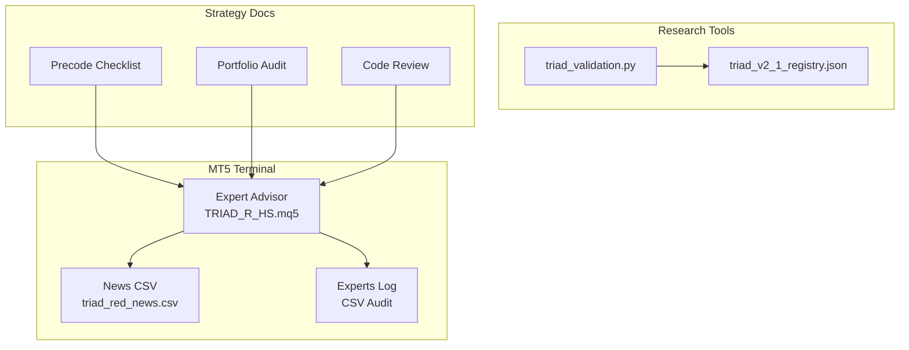
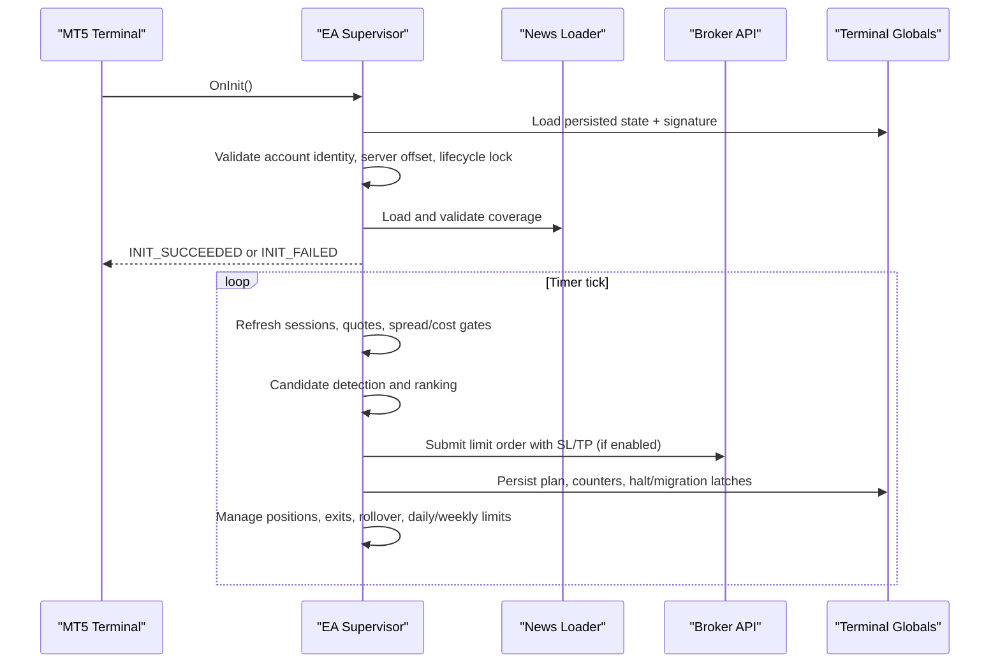
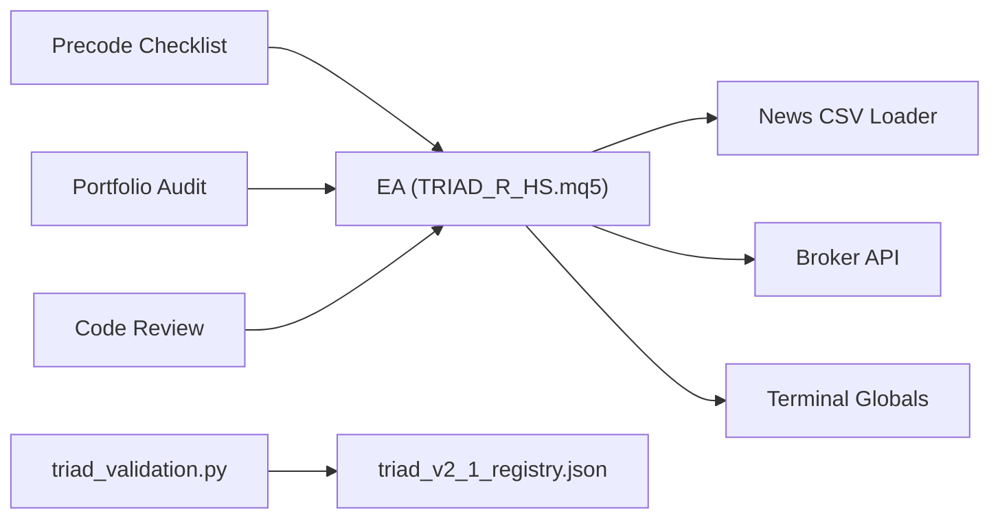

# Deployment and Operations

<cite>
**Referenced Files in This Document**
- [TRIAD_R_HS.mq5](file://MQL5/Experts/TRIAD_R_HS/TRIAD_R_HS.mq5)
- [README.md](file://MQL5/Experts/TRIAD_R_HS/README.md)
- [triad_red_news.csv.example](file://MQL5/Files/triad_red_news.csv.example)
- [THE5ERS-END-TO-END-PRECODE-CHECKLIST.md](file://THE5ERS-END-TO-END-PRECODE-CHECKLIST.md)
- [TRIAD_R_HS-CODE-REVIEW.md](file://TRIAD_R_HS-CODE-REVIEW.md)
- [STRATEGY-PORTFOLIO-AUDIT.md](file://STRATEGY-PORTFOLIO-AUDIT.md)
- [triad_validation.py](file://tools/triad_validation.py)
- [triad_v2_1_registry.json](file://validation/triad_v2_1_registry.json)
</cite>

## Table of Contents
1. [Introduction](#introduction)
2. [Project Structure](#project-structure)
3. [Core Components](#core-components)
4. [Architecture Overview](#architecture-overview)
5. [Detailed Component Analysis](#detailed-component-analysis)
6. [Dependency Analysis](#dependency-analysis)
7. [Performance Considerations](#performance-considerations)
8. [Troubleshooting Guide](#troubleshooting-guide)
9. [Conclusion](#conclusion)
10. [Appendices](#appendices)

## Introduction
This document provides operational guidance for deploying and managing the TRIAD-R system in production environments. It consolidates deployment checklists, validation steps, monitoring and alerting expectations, maintenance procedures, incident response, performance optimization, resource management, and scaling considerations based on the repository’s EA source, research tools, and strategy documentation. The goal is to enable safe, auditable, and resilient operations with fail-closed defaults and strong governance around state, identity, and risk limits.

## Project Structure
The repository contains:
- An MQL5 Expert Advisor implementing a single-position sweep/reclaim strategy with strict safety controls.
- A news calendar contract and example file used at runtime to block trading around high-impact events.
- Offline validation and selection tooling that enforces frozen configuration registries and Section 13-style acceptance criteria.
- Strategy and portfolio audit documents describing architecture, risk targets, and long-term survival design.

**Diagram sources**
- [TRIAD_R_HS.mq5:1-200](file://MQL5/Experts/TRIAD_R_HS/TRIAD_R_HS.mq5#L1-L200)
- [triad_validation.py:1-200](file://tools/triad_validation.py#L1-L200)
- [triad_v2_1_registry.json:1-120](file://validation/triad_v2_1_registry.json#L1-L120)
- [triad_red_news.csv.example:1-7](file://MQL5/Files/triad_red_news.csv.example#L1-L7)

**Section sources**
- [TRIAD_R_HS.mq5:1-200](file://MQL5/Experts/TRIAD_R_HS/TRIAD_R_HS.mq5#L1-L200)
- [triad_validation.py:1-200](file://tools/triad_validation.py#L1-L200)
- [triad_v2_1_registry.json:1-120](file://validation/triad_v2_1_registry.json#L1-L120)
- [triad_red_news.csv.example:1-7](file://MQL5/Files/triad_red_news.csv.example#L1-L7)

## Core Components
- Expert Advisor (EA): Implements entry logic, session gating, news blackout, position sizing, visible stops/targets, lifecycle locks, daily/weekly governors, and persistence. Order submission is disabled by default; all release gates default false.
- News Calendar Contract: Requires an explicit coverage declaration row and validates event completeness before allowing entries.
- Validation Tooling: Enforces frozen configuration matrices, replay schemas, and Section 13-style thresholds for selection and holdout evaluation.
- Strategy Governance: Precode checklist and code review define mandatory pre-deployment validations, failure responses, and recovery paths.

Key operational inputs include account identity verification, server offset tolerance, product code checks, phase initial balance, dashboard days, lifecycle locks, and per-combination gates.

**Section sources**
- [TRIAD_R_HS.mq5:52-150](file://MQL5/Experts/TRIAD_R_HS/TRIAD_R_HS.mq5#L52-L150)
- [README.md:51-145](file://MQL5/Experts/TRIAD_R_HS/README.md#L51-L145)
- [triad_validation.py:130-180](file://tools/triad_validation.py#L130-L180)
- [THE5ERS-END-TO-END-PRECODE-CHECKLIST.md:78-145](file://THE5ERS-END-TO-END-PRECODE-CHECKLIST.md#L78-L145)

## Architecture Overview
The EA runs as a timer-driven supervisor on one chart, scanning configured symbols and enforcing:
- Session windows and DST-aware time conversions.
- News blackout and rollover buffers.
- One-position topology and collision ranking across combinations.
- Visible stop/target inclusion and request latency caps.
- Daily/weekly internal limits and firm floors.
- Persistence via terminal globals with signatures to prevent partial or mixed updates.

**Diagram sources**
- [TRIAD_R_HS.mq5:1502-1572](file://MQL5/Experts/TRIAD_R_HS/TRIAD_R_HS.mq5#L1502-L1572)
- [TRIAD_R_HS.mq5:587-618](file://MQL5/Experts/TRIAD_R_HS/TRIAD_R_HS.mq5#L587-L618)
- [triad_validation.py:1357-1385](file://tools/triad_validation.py#L1357-L1385)

**Section sources**
- [TRIAD_R_HS.mq5:1502-1572](file://MQL5/Experts/TRIAD_R_HS/TRIAD_R_HS.mq5#L1502-L1572)
- [TRIAD_R_HS.mq5:587-618](file://MQL5/Experts/TRIAD_R_HS/TRIAD_R_HS.mq5#L587-L618)

## Detailed Component Analysis

### Live Deployment Checklist
- Install EA into MT5 Experts folder and compile with zero errors; archive compiler output and checksums.
- Place a verified high-impact news CSV in MQL5/Files with an explicit coverage declaration row.
- Attach EA to one chart only; ensure InpEnableOrderSubmission remains false until all gates pass.
- Verify symbols exist in Market Watch and map to EURUSD, GBPUSD, USDJPY base/profit currencies.
- Confirm Experts log shows no ERROR/HALT/stale calendar/insufficient history/property mismatch during dry run.
- Keep order submission disabled until compilation, forward demo, and external rule attestations are complete.

**Section sources**
- [README.md:15-26](file://MQL5/Experts/TRIAD_R_HS/README.md#L15-L26)
- [triad_red_news.csv.example:1-7](file://MQL5/Files/triad_red_news.csv.example#L1-L7)
- [TRIAD_R_HS.mq5:52-150](file://MQL5/Experts/TRIAD_R_HS/TRIAD_R_HS.mq5#L52-L150)

### Pre-Deployment Validation Steps
- Run Python unit tests and static checks; confirm all pass.
- Compile exact build in target MetaEditor; investigate every warning.
- Execute deterministic harnesses for first-event sequences, DST mismatches, volume grids, day/week governor resets, and restart/offline reconstruction.
- Produce OOS evidence per combination and portfolio; freeze priorities using predeclared rules before final OOS.
- Generate MFE/MAE and execution-cost records in tester/post-processing.
- Complete forward-demo fills on exact broker symbols/server with zero operational errors.
- Verify purchased agreement/dashboard values, rollover behavior, leverage, payout terms, and scaling conditions.

**Section sources**
- [TRIAD_R_HS-CODE-REVIEW.md:98-137](file://TRIAD_R_HS-CODE-REVIEW.md#L98-L137)
- [THE5ERS-END-TO-END-PRECODE-CHECKLIST.md:341-360](file://THE5ERS-END-TO-END-PRECODE-CHECKLIST.md#L341-L360)
- [triad_validation.py:130-180](file://tools/triad_validation.py#L130-L180)

### Operational Monitoring Requirements
- Monitor Experts log for ERROR-level events such as insufficient statistics, calendar failures, symbol selection issues, and state persistence failures.
- Track inactivity alerts and direction concentration reviews to detect news-blocked clusters or unusual directional bias.
- Ensure news CSV coverage declaration remains current; stale coverage triggers fail-closed behavior.
- Observe request counts and latency; enforce maximum non-emergency requests per day and synchronous request latency caps.
- Verify daily/weekly governors reset only through confirmed rollover boundaries; persistent halts require formal reconciliation.

**Section sources**
- [TRIAD_R_HS.mq5:142-150](file://MQL5/Experts/TRIAD_R_HS/TRIAD_R_HS.mq5#L142-L150)
- [TRIAD_R_HS.mq5:1502-1572](file://MQL5/Experts/TRIAD_R_HS/TRIAD_R_HS.mq5#L1502-L1572)
- [TRIAD_R_HS.mq5:587-618](file://MQL5/Experts/TRIAD_R_HS/TRIAD_R_HS.mq5#L587-L618)

### Incident Response Procedures
- Unknown account/profile/phase: No new orders; halt and reconcile.
- Configuration hash mismatch: No new orders; verify build/config integrity.
- Stale quote/bar or calendar missing/stale: No new orders; existing broker stops remain active.
- Duplicate/multiple positions: Cancel entries, flatten safely, halt.
- Partial fill: Reconcile actual risk/position count immediately.
- Request cap reached: Block entries; never block safety cancel/close.
- Firm-floor danger: No new order; emergency exposure reduction.
- EA/VPS restart: Reconstruct from broker state before action.
- Manual trade detected: Halt and require reconciliation.

**Section sources**
- [THE5ERS-END-TO-END-PRECODE-CHECKLIST.md:319-338](file://THE5ERS-END-TO-END-PRECODE-CHECKLIST.md#L319-L338)

### Maintenance Procedures
- Rollover reconciliation: Persist balance/equity snapshots; compute firm daily floor; flat positions at rollover boundary.
- News refresh: Reload calendar at server rollover; revalidate coverage before entries.
- State migration: External cashflow or unauthorized history requires a separately reviewed rebaseline release; ordinary halt reset cannot clear migration latch.
- Lifecycle locks: Before payout, phase transition, or scale transition, set appropriate lifecycle lock; EA cancels pending orders, closes own positions, latches journal, and refuses new trades.
- Emergency halt reset: Use one-time authorization input after resolving incident and confirming account flat; clears latch and intentionally returns initialization failure for reattachment.

**Section sources**
- [TRIAD_R_HS.mq5:587-618](file://MQL5/Experts/TRIAD_R_HS/TRIAD_R_HS.mq5#L587-L618)
- [README.md:89-117](file://MQL5/Experts/TRIAD_R_HS/README.md#L89-L117)
- [THE5ERS-END-TO-END-PRECODE-CHECKLIST.md:252-315](file://THE5ERS-END-TO-END-PRECODE-CHECKLIST.md#L252-L315)

### Performance Optimization and Resource Management
- Spread and cost gates: Limit entries when estimated round-trip cost exceeds configured threshold; use historical median spread multipliers.
- Latency control: Cap synchronous request latency; early safety lead prevents crossing exact cutoffs due to timer cadence.
- Volume rounding: Round down on broker lot lattice using minimum and step precision; bound by SYMBOL_VOLUME_MAX and positive SYMBOL_VOLUME_LIMIT.
- Time cutoffs: Apply fixed ten-second early lead for session/news/rollover boundaries; tighten server-offset tolerance to five seconds.
- Internal limits: Cap non-emergency requests per day; maintain reserve funds for gaps/slippage.

**Section sources**
- [TRIAD_R_HS.mq5:121-150](file://MQL5/Experts/TRIAD_R_HS/TRIAD_R_HS.mq5#L121-L150)
- [TRIAD_R_HS-CODE-REVIEW.md:56-64](file://TRIAD_R_HS-CODE-REVIEW.md#L56-L64)

### Scaling Considerations
- Single-terminal rule: Terminal globals coordinate only processes within the same MT5 data environment; do not run multiple terminals, VPS instances, copiers, or manual sessions sharing credentials.
- One-position topology: Account-wide invariant; collision ranking ensures only one working entry or open position at a time.
- Portfolio routing: Separate sleeves should not conflict; router selects reversal vs continuation based on regime signals.
- Long-term survival: Maintain shadow accounts, annual walk-forward revalidation, quarterly health checks, and replace underperforming sleeves over time.

**Section sources**
- [TRIAD_R_HS.mq5:1502-1572](file://MQL5/Experts/TRIAD_R_HS/TRIAD_R_HS.mq5#L1502-L1572)
- [STRATEGY-PORTFOLIO-AUDIT.md:238-310](file://STRATEGY-PORTFOLIO-AUDIT.md#L238-L310)
- [STRATEGY-PORTFOLIO-AUDIT.md:355-380](file://STRATEGY-PORTFOLIO-AUDIT.md#L355-L380)

## Dependency Analysis
The EA depends on:
- MT5 runtime APIs for trading, indicators, and terminal globals.
- News CSV loader for event blocking and coverage validation.
- Validation tooling for offline champion selection and Section 13 compliance.
- Strategy documents defining lifecycle, risk, and operational constraints.

**Diagram sources**
- [TRIAD_R_HS.mq5:1-200](file://MQL5/Experts/TRIAD_R_HS/TRIAD_R_HS.mq5#L1-L200)
- [triad_validation.py:1-200](file://tools/triad_validation.py#L1-L200)
- [triad_v2_1_registry.json:1-120](file://validation/triad_v2_1_registry.json#L1-L120)

**Section sources**
- [TRIAD_R_HS.mq5:1-200](file://MQL5/Experts/TRIAD_R_HS/TRIAD_R_HS.mq5#L1-L200)
- [triad_validation.py:1-200](file://tools/triad_validation.py#L1-L200)
- [triad_v2_1_registry.json:1-120](file://validation/triad_v2_1_registry.json#L1-L120)

## Performance Considerations
- Execution envelope: Validate empirical latency and fill behavior on live infrastructure; one-second synchronous request cap must remain within tested bounds.
- Cost awareness: Use commission and slippage reserves; avoid entries where estimated costs exceed configured thresholds.
- Data freshness: Reject stale quotes beyond configured age; enforce spread and cost gates before candidate submission.
- Governor resets: Daily/weekly limits reset only through confirmed rollover; persistent halts require formal reconciliation.
- Stress testing: Include stressed scenarios with increased spread/slippage and missed profitable limits in validation reports.

[No sources needed since this section provides general guidance]

## Troubleshooting Guide
Common operational issues and responses:
- Insufficient statistics: Upgrade to ERROR level to surface prominently; resolve history depth or data loading issues.
- Calendar failure: No new orders; reload and validate coverage; ensure explicit coverage declaration extends required hours.
- State persistence failure: Investigate terminal global write errors; ensure flush succeeds and signature matches.
- Migration latch: External cashflow or unauthorized history requires rebaseline release; ordinary halt reset cannot clear.
- Duplicate positions: Cancel entries, flatten safely, halt; reconcile broker state before resuming.
- Missing visible stop: One immediate correction attempt; if unsuccessful, close and halt.

**Section sources**
- [strategy-improvements-plan.md:266-332](file://strategy-improvements-plan.md#L266-L332)
- [TRIAD_R_HS.mq5:587-618](file://MQL5/Experts/TRIAD_R_HS/TRIAD_R_HS.mq5#L587-L618)
- [THE5ERS-END-TO-END-PRECODE-CHECKLIST.md:319-338](file://THE5ERS-END-TO-END-PRECODE-CHECKLIST.md#L319-L338)

## Conclusion
The TRIAD-R system emphasizes fail-closed defaults, strict identity and lifecycle governance, robust news/calendar validation, and comprehensive offline selection with Section 13-style acceptance. Production operations should adhere to the precode checklist, maintain vigilant monitoring and alerting, follow documented incident response procedures, and perform disciplined maintenance and lifecycle transitions. Performance and scaling considerations center on cost-aware execution, data freshness, governor resets, and single-terminal, one-position topology.

[No sources needed since this section summarizes without analyzing specific files]

## Appendices

### Appendix A: End-to-End Precode Checklist Summary
- Identify exact product and rules; snapshot agreement and purchase details.
- Freeze strategy module and candidate combinations; disable prohibited modules.
- Initialize account with verified properties; reconcile state and calendar.
- Start-of-day and rollover processes; persist floors and balances.
- Before every signal/order: session, range/ATR samples, spread/cost gates, news blackout, data/latency, account mutex, target room, stop geometry, volume rounding, safety projection, direction evidence.
- Entry event sequence; position sizing and order safety; open-position management; daily/weekly process; profitable-day accounting; drawdown and completion guards; phase target and transition; funded transition; payout and scale lifecycle; failure and recovery paths; statistical and operational acceptance.

**Section sources**
- [THE5ERS-END-TO-END-PRECODE-CHECKLIST.md:31-390](file://THE5ERS-END-TO-END-PRECODE-CHECKLIST.md#L31-L390)

### Appendix B: Validation and Selection Tooling
- Frozen registry defines 160 configurations across profiles, bands, time stops, and breakeven policies.
- Replay export schema includes no-candidate rows for full day coverage; stressed replay removes profitable limits and increases costs.
- Section 13 verdict combines point estimates with confidence bounds, firm-floor checks, and shutdown overshoot analysis.

**Section sources**
- [triad_v2_1_registry.json:1-120](file://validation/triad_v2_1_registry.json#L1-L120)
- [triad_validation.py:130-180](file://tools/triad_validation.py#L130-L180)
- [triad_validation.py:1357-1385](file://tools/triad_validation.py#L1357-L1385)