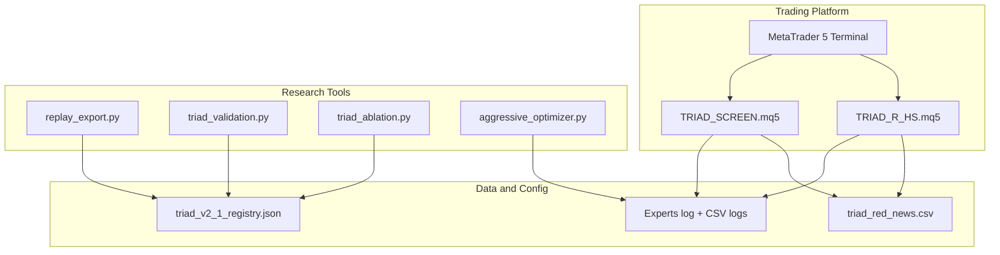
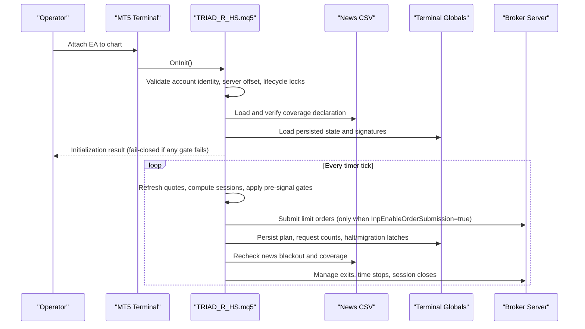
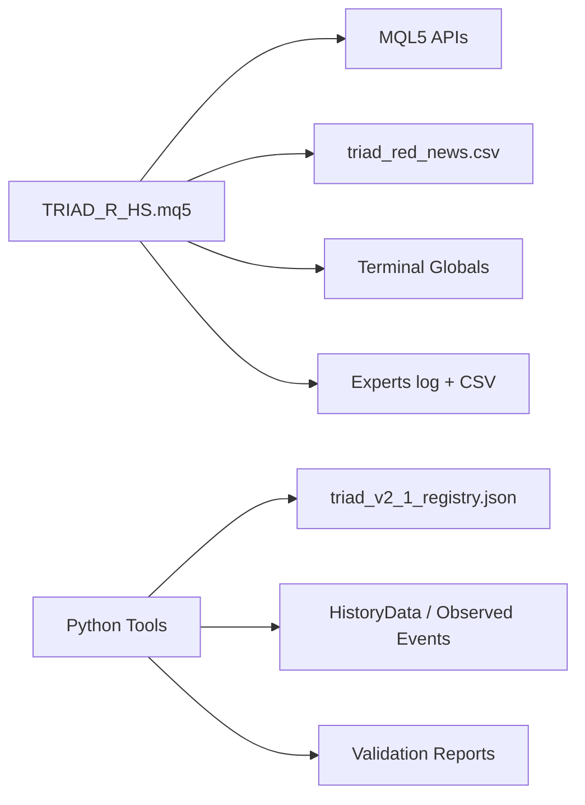

# Maintenance Procedures

<cite>
**Referenced Files in This Document**
- [TRIAD_R_HS.mq5](file://MQL5/Experts/TRIAD_R_HS/TRIAD_R_HS.mq5)
- [TRIAD_R_HS README](file://MQL5/Experts/TRIAD_R_HS/README.md)
- [TRIAD_SCREEN README](file://MQL5/Experts/TRIAD_SCREEN/README.md)
- [THE5ERS Challenge Strategy V2](file://THE5ERS-CHALLENGE-STRATEGY-V2.md)
- [Code Review](file://TRIAD_R_HS-CODE-REVIEW.md)
- [Progress Log](file://progress.md)
- [V2.1 Registry](file://validation/triad_v2_1_registry.json)
</cite>

## Table of Contents
1. Introduction
2. Project Structure
3. Core Components
4. Architecture Overview
5. Detailed Component Analysis
6. Dependency Analysis
7. Performance Considerations
8. Troubleshooting Guide
9. Conclusion
10. Appendices

## Introduction
This document provides maintenance procedures for the TRIAD-R system, focusing on routine tasks such as system updates, parameter reviews, performance optimization, and compliance verification. It also covers scheduled maintenance windows, backup and data archival processes, update management (version control, change validation, rollback), and maintenance checklists for daily, weekly, and monthly tasks. Preventive maintenance, system health assessments, capacity planning, production best practices, change management, and impact mitigation strategies are included to ensure safe operation in live environments.

The TRIAD-R High Stakes EA is intentionally fail-closed by default and must not be enabled for live trading until all validation gates pass. The screening tool TRIAD_SCREEN is a demo-only research tool and must not be used on live accounts.

## Project Structure
The repository contains:
- MQL5 Expert Advisors:
  - TRIAD_R_HS: canonical research EA implementing the sweep/reclaim strategy with strict safety controls.
  - TRIAD_SCREEN: demo screening tool that mirrors entry rules and challenge rules for research only.
- Validation and research tools:
  - Replay export, validation, ablation, and optimizer scripts under tools/.
  - Frozen configuration registry under validation/.
- Documentation and progress logs describing strategy, audits, and development status.

**Diagram sources**
- [TRIAD_R_HS.mq5:1-200](file://MQL5/Experts/TRIAD_R_HS/TRIAD_R_HS.mq5#L1-L200)
- [TRIAD_R_HS README:1-150](file://MQL5/Experts/TRIAD_R_HS/README.md#L1-L150)
- [TRIAD_SCREEN README:1-120](file://MQL5/Experts/TRIAD_SCREEN/README.md#L1-L120)
- [V2.1 Registry:1-120](file://validation/triad_v2_1_registry.json#L1-L120)

**Section sources**
- [TRIAD_R_HS README:1-150](file://MQL5/Experts/TRIAD_R_HS/README.md#L1-L150)
- [TRIAD_SCREEN README:1-120](file://MQL5/Experts/TRIAD_SCREEN/README.md#L1-L120)
- [THE5ERS Challenge Strategy V2:1-120](file://THE5ERS-CHALLENGE-STRATEGY-V2.md#L1-L120)

## Core Components
- TRIAD_R_HS EA:
  - Fail-closed by default; order submission disabled unless explicitly enabled after full validation.
  - Enforces account identity, server offset, product code, phase lifecycle locks, and one-position topology.
  - Implements session-based sweep/reclaim signals with strict pre-signal gates, risk sizing, exits, and drawdown throttling.
  - Persists state via terminal globals with signatures and migration latches; halts on anomalies.
- TRIAD_SCREEN EA:
  - Demo-only screening tool mirroring entry rules and challenge rules; writes event journals and per-day summaries.
  - Provides dashboard status and config fingerprinting for research comparisons.
- Validation pipeline:
  - Replay export transforms observed events into replay rows using the frozen registry.
  - Validator evaluates configurations against walk-forward and holdout splits with strict gates.
  - Ablation runner tests alternative entry variants under preregistered conditions.

Key maintenance-relevant behaviors:
- News calendar must include an explicit coverage declaration and be refreshed before expiration.
- Daily/weekly governors act as calendar locks; they reset at confirmed rollover.
- Emergency halt and migration latches require formal review and cannot be cleared by ordinary reset.
- One instance lock prevents concurrent execution; stale instances are fenced.

**Section sources**
- [TRIAD_R_HS.mq5:52-150](file://MQL5/Experts/TRIAD_R_HS/TRIAD_R_HS.mq5#L52-L150)
- [TRIAD_R_HS README:51-145](file://MQL5/Experts/TRIAD_R_HS/README.md#L51-L145)
- [TRIAD_SCREEN README:12-120](file://MQL5/Experts/TRIAD_SCREEN/README.md#L12-L120)
- [THE5ERS Challenge Strategy V2:54-183](file://THE5ERS-CHALLENGE-STRATEGY-V2.md#L54-L183)

## Architecture Overview
The system architecture centers on a single-instance, timer-driven EA that enforces hard safety gates and persists state across restarts. A separate demo screening EA supports multi-symbol research without risking capital. Offline tools validate and compare configurations using frozen registries and replay data.

**Diagram sources**
- [TRIAD_R_HS.mq5:327-350](file://MQL5/Experts/TRIAD_R_HS/TRIAD_R_HS.mq5#L327-L350)
- [TRIAD_R_HS.mq5:587-618](file://MQL5/Experts/TRIAD_R_HS/TRIAD_R_HS.mq5#L587-L618)
- [TRIAD_R_HS README:27-145](file://MQL5/Experts/TRIAD_R_HS/README.md#L27-L145)

## Detailed Component Analysis

### Update Management and Version Control
- Build identification:
  - The EA embeds a build ID and version property; maintain a record of source checksums and compiled artifacts.
- Change validation:
  - Run Python unit tests and static contract checks before any change.
  - Compile in MetaEditor with zero errors and archive compiler output.
  - Validate behavior in Strategy Tester with deterministic settings.
- Rollback procedures:
  - Keep previous builds archived with checksums and configuration hashes.
  - If a new build fails validation or introduces regressions, revert to the last known-good build and re-run the full validation sequence.
- Release gating:
  - All release attestations default to false; enable only after completing required validations and approvals.

Operational notes:
- Order submission defaults to false; keep it disabled until all gates pass.
- Use tester-only enabling for Strategy Tester runs; live accounts remain locked.

**Section sources**
- [TRIAD_R_HS.mq5:1-10](file://MQL5/Experts/TRIAD_R_HS/TRIAD_R_HS.mq5#L1-L10)
- [TRIAD_R_HS README:15-24](file://MQL5/Experts/TRIAD_R_HS/README.md#L15-L24)
- [TRIAD_R_HS README:51-135](file://MQL5/Experts/TRIAD_R_HS/README.md#L51-L135)
- [Code Review:12-17](file://TRIAD_R_HS-CODE-REVIEW.md#L12-L17)
- [Progress Log:370-383](file://progress.md#L370-L383)

### Parameter Reviews and Configuration Governance
- Frozen registry:
  - The V2.1 registry defines 160 configurations covering range bands, ATR bands, time stops, profiles, and breakeven policies. Do not modify the registry without revalidating through the full pipeline.
- Candidate parameters:
  - Only specific candidate changes are intended: paired risk/target profiles, percentile bands, time stop values, breakeven policy toggles, and collision priorities derived from predeclared rules.
- Collision priorities:
  - Per-combination priorities are validated and included in the configuration hash; they must come from approved selection and cannot be tuned ad hoc.

Maintenance actions:
- Before any parameter change, run offline validation with the frozen registry and replay data.
- Record configuration hash and rationale; attach evidence to the release package.

**Section sources**
- [V2.1 Registry:1-120](file://validation/triad_v2_1_registry.json#L1-L120)
- [TRIAD_R_HS README:118-135](file://MQL5/Experts/TRIAD_R_HS/README.md#L118-L135)
- [Code Review:50-55](file://TRIAD_R_HS-CODE-REVIEW.md#L50-L55)

### Scheduled Maintenance Windows
- News calendar refresh:
  - Ensure triad_red_news.csv includes an explicit coverage declaration and is refreshed before declared coverage expires.
  - Reload occurs at confirmed server rollover and on reattach; runtime coverage is checked on every decision path.
- Session boundaries:
  - Entry and cleanup controls use fixed early leads to avoid boundary races; maintain consistent server offset and DST handling.
- Rollover and weekend buffers:
  - Positions are flattened before rollover and Friday cutoffs; ensure logs confirm flatting and no exposure remains.

Recommended schedule:
- Pre-market: Verify news coverage declaration and symbol availability.
- During session: Monitor Experts log for ERROR/HALT events and news blackout alerts.
- Post-session: Confirm positions closed, logs archived, and state persisted.

**Section sources**
- [TRIAD_R_HS README:27-48](file://MQL5/Experts/TRIAD_R_HS/README.md#L27-L48)
- [TRIAD_R_HS README:139-145](file://MQL5/Experts/TRIAD_R_HS/README.md#L139-L145)
- [THE5ERS Challenge Strategy V2:74-93](file://THE5ERS-CHALLENGE-STRATEGY-V2.md#L74-L93)

### Backup Procedures and Data Archival
- Persistence model:
  - Live and dry modes use separate terminal-global prefixes and CSV logs; state includes configuration/build hash, account identity hash, phase initial balance, rollover state, floors, high-water balance, request count, external cashflow baseline, creation time, halt/migration latches, and active plan.
- Signature and migration latches:
  - Last-written signatures reject partial or mixed updates; migration latches prevent unauthorized history or cashflow from migrating into baselines.
- Archival recommendations:
  - Archive Experts logs, CSV logs, and terminal global snapshots around rollovers, payouts, and incidents.
  - Preserve tester outputs, forward-demo evidence, and validation reports with configuration hashes.

Operational safeguards:
- External cashflow or unauthorized history triggers a migration latch requiring formal rebaseline.
- Ordinary halt reset cannot clear migration latches; follow formal review process.

**Section sources**
- [TRIAD_R_HS README:139-145](file://MQL5/Experts/TRIAD_R_HS/README.md#L139-L145)
- [TRIAD_R_HS.mq5:587-618](file://MQL5/Experts/TRIAD_R_HS/TRIAD_R_HS.mq5#L587-L618)
- [Code Review:34-45](file://TRIAD_R_HS-CODE-REVIEW.md#L34-L45)

### Compliance Verification
- Immutable profile:
  - One working entry or position, no grid/martingale/averaging/hedge, broker-visible stops, news blackout windows, rate limits, and volume rounding down.
- Pre-signal gates:
  - Instrument/session enabled, no existing exposure, range/ATR within percentiles, spread within median multiplier, cost within 0.10R, no red news within 30 minutes, valid quote/bar/calendar/state, execution health within bounds, stop/freeze levels respected, rounded volume within risk tier, target fits inside reference range, projected stressed loss above floors.
- Operational compliance:
  - Maintain zero prohibited-practice violations; adhere to The5ers rules and product declarations.

Maintenance checklist items:
- Verify symbol base/profit currencies map correctly.
- Confirm server offset tolerance and timezone conversions.
- Validate news calendar completeness and coverage declaration.
- Check that rate limits and request caps are enforced.

**Section sources**
- [THE5ERS Challenge Strategy V2:32-93](file://THE5ERS-CHALLENGE-STRATEGY-V2.md#L32-L93)
- [TRIAD_R_HS README:75-88](file://MQL5/Experts/TRIAD_R_HS/README.md#L75-L88)

### Performance Optimization
- Execution health:
  - Max synchronous request latency capped; monitor for rejected/uncertain orders and incomplete outcomes.
- Quote freshness:
  - Quote age gates prevent stale data usage; ensure network stability and low-latency VPS.
- Volume rounding:
  - Volume is rounded down on the broker’s lattice; minimum-lot over-risk results in no-trade.
- Early cutoffs:
  - Entry/cleanup controls use fixed early leads to avoid boundary races; maintain consistent cadence.

Optimization actions:
- Tune spread/commission assumptions conservatively in offline validation.
- Monitor fill rates and slippage; adjust thresholds only after OOS evidence.
- Avoid chasing expired limits; rely on planned entries and cancellations.

**Section sources**
- [TRIAD_R_HS.mq5:78-90](file://MQL5/Experts/TRIAD_R_HS/TRIAD_R_HS.mq5#L78-L90)
- [TRIAD_R_HS README:129-135](file://MQL5/Experts/TRIAD_R_HS/README.md#L129-L135)
- [Code Review:56-64](file://TRIAD_R_HS-CODE-REVIEW.md#L56-L64)

### Maintenance Checklists

Daily tasks:
- Verify news calendar coverage declaration and refresh if nearing expiration.
- Check Experts log for ERROR/HALT events, news blackout streaks, and inactivity alerts.
- Confirm symbols present in Market Watch and base/profit currency mappings correct.
- Ensure positions are flat before rollover and Friday cutoffs.
- Archive logs and CSV outputs; note configuration hash and build ID.

Weekly tasks:
- Review daily/weekly governor resets and ensure calendar rollover logic executed.
- Validate request counts and non-emergency request cap behavior.
- Reconcile dashboard-confirmed days and phase targets; flag pending states.
- Run Python unit tests and static checks to detect regressions.

Monthly tasks:
- Perform full validation pipeline with replay export and validator using frozen registry.
- Review performance metrics: fill rates, slippage, costs, expectancy, profit factor.
- Assess capacity planning: VPS uptime, broker connectivity, data feed quality.
- Audit compliance: ensure no prohibited practices, news violations, or rule breaches.

**Section sources**
- [TRIAD_R_HS README:21-24](file://MQL5/Experts/TRIAD_R_HS/README.md#L21-L24)
- [TRIAD_R_HS README:139-145](file://MQL5/Experts/TRIAD_R_HS/README.md#L139-L145)
- [TRIAD_SCREEN README:81-108](file://MQL5/Experts/TRIAD_SCREEN/README.md#L81-L108)
- [Progress Log:327-366](file://progress.md#L327-L366)

### Preventive Maintenance Activities
- Instance lock and fencing:
  - One instance per terminal; stale instances are fenced and cannot submit or rewrite state.
- Migration latches:
  - External cashflow or unauthorized history triggers migration latch; requires formal rebaseline.
- Halt and reset procedures:
  - Ordinary halt reset clears persistent halt; migration latch cannot be cleared this way.
- Lifecycle locks:
  - Payout, phase transition, and scale transition locks freeze execution; resume only after reconciliation.

Preventive actions:
- Never leave one-time authorization flags true after initialization.
- Monitor for PERSISTED_STATE_MIGRATION_LOCK and resolve incidents formally.
- Keep order submission disabled until all gates pass; use demo screening for research.

**Section sources**
- [TRIAD_R_HS README:89-117](file://MQL5/Experts/TRIAD_R_HS/README.md#L89-L117)
- [Code Review:20-32](file://TRIAD_R_HS-CODE-REVIEW.md#L20-L32)
- [Code Review:70-77](file://TRIAD_R_HS-CODE-REVIEW.md#L70-L77)

### System Health Assessments
- Initialization checks:
  - Account identity, server offset, product code, leverage, hedging mode, permissions.
- Runtime checks:
  - Quote age, bar state, symbol properties, calendar state, execution health.
- State integrity:
  - Signatures and last-written markers prevent partial updates; migration latches protect baselines.

Assessment steps:
- On attach, verify initialization result and log messages.
- During run, watch for HALT reasons and migrate to formal review if needed.
- After rollover, confirm state persistence and signature validity.

**Section sources**
- [TRIAD_R_HS README:75-88](file://MQL5/Experts/TRIAD_R_HS/README.md#L75-L88)
- [TRIAD_R_HS.mq5:327-350](file://MQL5/Experts/TRIAD_R_HS/TRIAD_R_HS.mq5#L327-L350)
- [TRIAD_R_HS.mq5:587-618](file://MQL5/Experts/TRIAD_R_HS/TRIAD_R_HS.mq5#L587-L618)

### Capacity Planning
- Data requirements:
  - Tick data for sweep/reclaim validation; M5 OHLCV for optimizer runs.
- Tooling capacity:
  - Ensure Python environment and dependencies installed; run tests regularly.
- Infrastructure:
  - VPS reliability, broker connectivity, and data feed quality critical for low-latency operations.

Planning actions:
- Secure sufficient historical data for validation pipelines.
- Monitor disk space for logs and data files; rotate archives periodically.
- Plan for broker-specific differences (tick size, volume step, stops level).

**Section sources**
- [Progress Log:232-273](file://progress.md#L232-L273)
- [Progress Log:557-566](file://progress.md#L557-L566)

### Production Best Practices
- Fail-closed defaults:
  - Order submission disabled; release ID locked; all attestations false by default.
- One-position topology:
  - No simultaneous positions; enforce account-wide limits.
- Rate limiting:
  - Non-emergency request cap enforced; emergency cleanup never gated by cap.
- Logging and auditability:
  - Comprehensive logs capture decisions, retcodes, slippage, rollover estimates, and alerts.

Best practice actions:
- Keep order submission disabled until full validation and approval.
- Use demo screening for research; do not attach to live accounts.
- Archive logs and state around incidents; reconcile with broker records.

**Section sources**
- [TRIAD_R_HS README:51-72](file://MQL5/Experts/TRIAD_R_HS/README.md#L51-L72)
- [TRIAD_SCREEN README:115-139](file://MQL5/Experts/TRIAD_SCREEN/README.md#L115-L139)
- [THE5ERS Challenge Strategy V2:32-50](file://THE5ERS-CHALLENGE-STRATEGY-V2.md#L32-L50)

### Change Management Procedures
- Source control:
  - Commit exact source with build ID; archive compiled artifacts and checksums.
- Validation gates:
  - Unit tests, static checks, compile, Strategy Tester, forward demo, and Section 13 gates.
- Approval workflow:
  - Explicit user approval required; attach evidence to release package.
- Rollback:
  - Revert to last known-good build if validation fails; re-run full sequence.

Change management actions:
- Freeze registry and parameters; any change requires revalidation.
- Record configuration hash and rationale; maintain traceable release IDs.
- Keep order submission disabled until all gates pass.

**Section sources**
- [TRIAD_R_HS README:227-246](file://MQL5/Experts/TRIAD_R_HS/README.md#L227-L246)
- [Progress Log:385-400](file://progress.md#L385-L400)
- [Code Review:123-142](file://TRIAD_R_HS-CODE-REVIEW.md#L123-L142)

### Maintenance Impact Mitigation Strategies
- Scheduled windows:
  - Perform updates during low-traffic periods; ensure news calendar refreshed beforehand.
- Instance fencing:
  - Stale instances cannot interfere; maintain single-terminal rule.
- Graceful degradation:
  - Fail-closed behavior prevents risky operations; logs capture failures for review.
- Recovery procedures:
  - Use ordinary halt reset for persistent halt; migration latch requires formal rebaseline.

Mitigation actions:
- Test updates in Strategy Tester before deployment.
- Monitor Experts log for errors; halt and investigate immediately.
- Archive logs and state; reconcile with broker records post-incident.

**Section sources**
- [TRIAD_R_HS README:25-26](file://MQL5/Experts/TRIAD_R_HS/README.md#L25-L26)
- [TRIAD_R_HS README:99-108](file://MQL5/Experts/TRIAD_R_HS/README.md#L99-L108)
- [Code Review:28-32](file://TRIAD_R_HS-CODE-REVIEW.md#L28-L32)

## Dependency Analysis
The system depends on:
- MQL5 platform APIs for trading, indicators, and terminal globals.
- News CSV for blackout windows and coverage declarations.
- Frozen registry for configuration validation and selection.
- Python tools for offline validation, replay export, and ablation studies.

**Diagram sources**
- [TRIAD_R_HS.mq5:1-200](file://MQL5/Experts/TRIAD_R_HS/TRIAD_R_HS.mq5#L1-L200)
- [V2.1 Registry:1-120](file://validation/triad_v2_1_registry.json#L1-L120)
- [Progress Log:286-310](file://progress.md#L286-L310)

**Section sources**
- [TRIAD_R_HS.mq5:1-200](file://MQL5/Experts/TRIAD_R_HS/TRIAD_R_HS.mq5#L1-L200)
- [Progress Log:286-310](file://progress.md#L286-L310)

## Performance Considerations
- Latency and slippage:
  - Max request latency capped; monitor for rejected orders and incomplete outcomes.
- Fill rates and costs:
  - Conservative assumptions in offline validation; track live fill rates and costs.
- Volume rounding:
  - Downward rounding on broker lattice; minimum-lot over-risk results in no-trade.
- Early cutoffs:
  - Fixed early leads prevent boundary races; maintain consistent cadence.

Recommendations:
- Optimize VPS and network for low latency.
- Monitor spread and commission impacts; adjust thresholds only after OOS evidence.
- Avoid chasing expired limits; rely on planned entries and cancellations.

[No sources needed since this section provides general guidance]

## Troubleshooting Guide
Common issues and resolutions:
- News calendar stale:
  - Refresh triad_red_news.csv with updated coverage declaration; reload on rollover or reattach.
- Persistent halt:
  - Investigate Experts log for HALT reason; use ordinary halt reset if applicable.
- Migration latch:
  - Requires formal rebaseline; cannot be cleared by ordinary reset.
- Instance fencing:
  - Ensure single-terminal rule; stale instances are fenced and cannot interfere.

Diagnostic steps:
- Check Experts log for ERROR/HALT events and migration latch warnings.
- Verify symbol base/profit currencies and server offset.
- Confirm news calendar completeness and coverage declaration.

**Section sources**
- [TRIAD_R_HS README:21-24](file://MQL5/Experts/TRIAD_R_HS/README.md#L21-L24)
- [TRIAD_R_HS README:99-108](file://MQL5/Experts/TRIAD_R_HS/README.md#L99-L108)
- [Code Review:20-32](file://TRIAD_R_HS-CODE-REVIEW.md#L20-L32)

## Conclusion
The TRIAD-R system emphasizes fail-closed safety, strict compliance, and rigorous validation. Maintenance procedures should focus on ensuring news calendar accuracy, preserving state integrity, validating changes through the full pipeline, and monitoring system health. By adhering to these procedures, operators can minimize risks and maintain reliable operation in production environments.

[No sources needed since this section summarizes without analyzing specific files]

## Appendices

### Appendix A: Key Configuration Parameters
- Safety and identity:
  - Enable order submission, release ID, product code, authorized login/server, phase lifecycle locks.
- Calendar and timing:
  - Expected server UTC offset, news blackout/flat minutes, required coverage hours, max quote age/deviation/request latency.
- Instruments and priorities:
  - Symbol names, enabled combinations, collision priorities.
- Risk and exits:
  - Profile, range/ATR percentiles, comparable sessions, time stop, breakeven policy, drawdown thresholds.

**Section sources**
- [TRIAD_R_HS.mq5:52-150](file://MQL5/Experts/TRIAD_R_HS/TRIAD_R_HS.mq5#L52-L150)

### Appendix B: Validation Pipeline Commands
- Aggressive optimizer:
  - Run multi-pair M5 optimizer for research insights.
- Tick signal builder:
  - Generate observed events from tick data for sweep/reclaim validation.
- Replay export:
  - Build replay rows using frozen registry and split dates.
- Validator:
  - Evaluate configurations against walk-forward and holdout splits.

**Section sources**
- [Progress Log:327-366](file://progress.md#L327-L366)