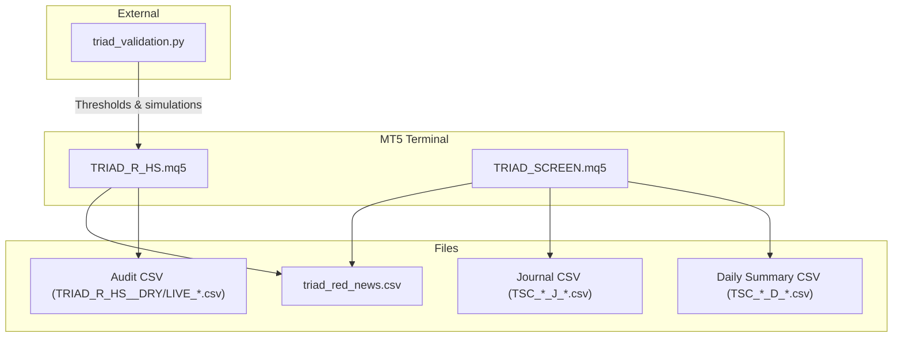
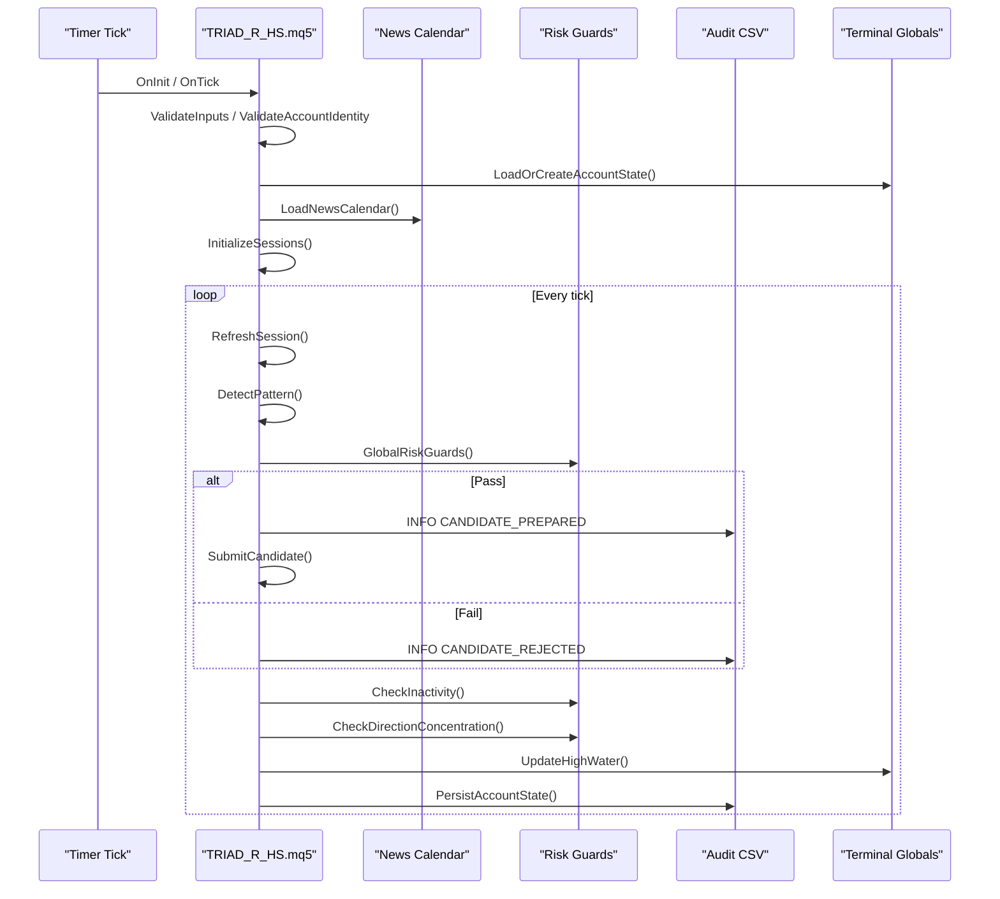
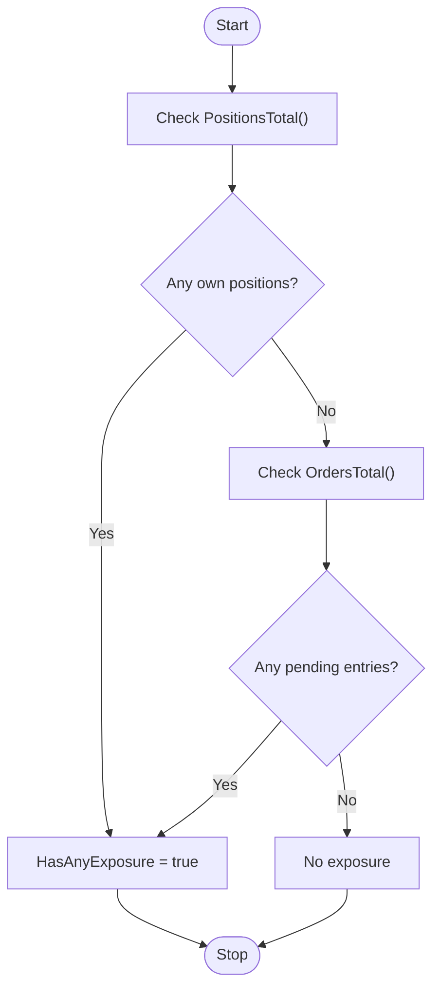
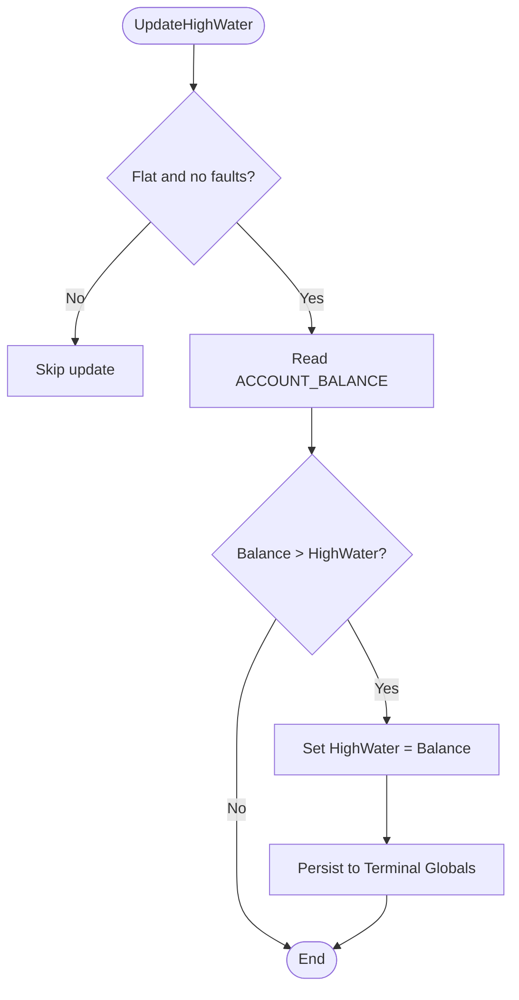
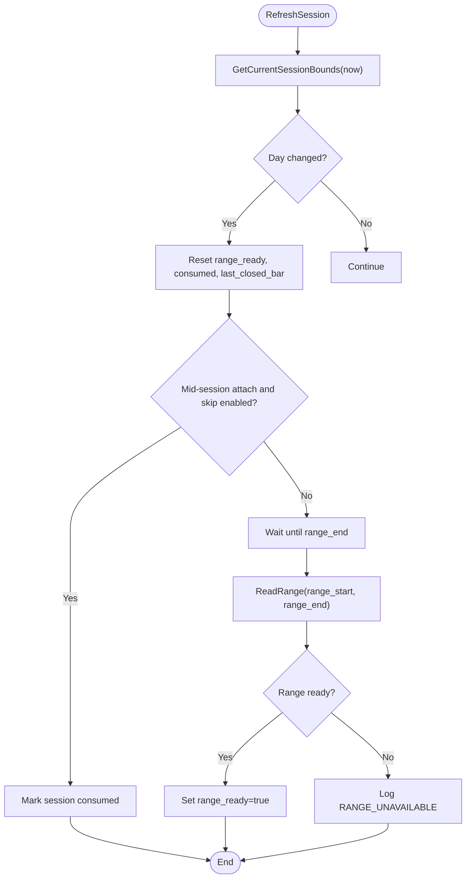
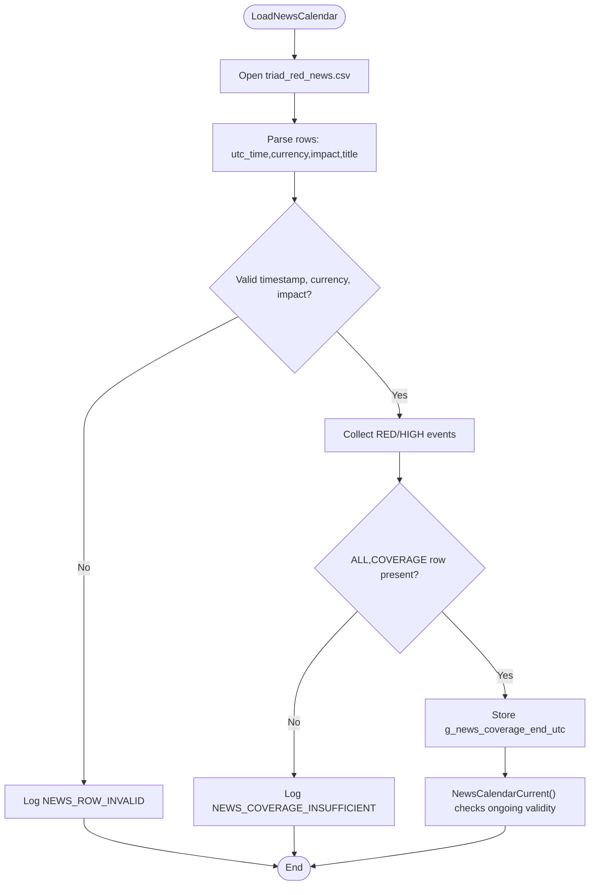
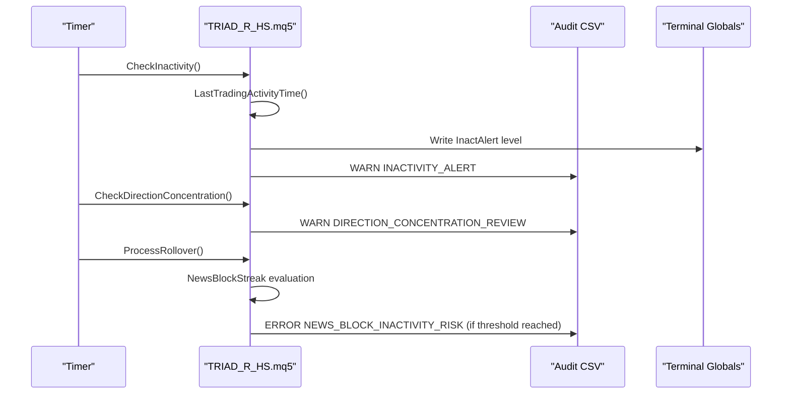
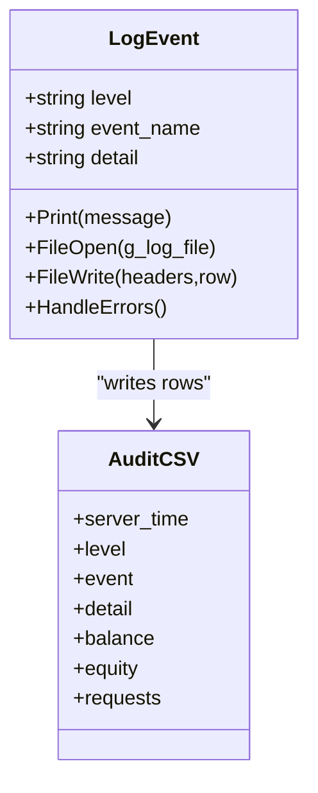
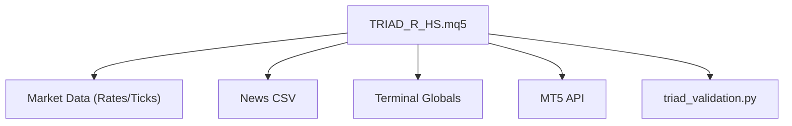

# Monitoring and Alerting

<cite>
**Referenced Files in This Document**
- [TRIAD_R_HS.mq5](file://MQL5/Experts/TRIAD_R_HS/TRIAD_R_HS.mq5)
- [TRIAD_SCREEN.mq5](file://MQL5/Experts/TRIAD_SCREEN/TRIAD_SCREEN.mq5)
- [README.md (TRIAD_R_HS)](file://MQL5/Experts/TRIAD_R_HS/README.md)
- [README.md (TRIAD_SCREEN)](file://MQL5/Experts/TRIAD_SCREEN/README.md)
- [triad_validation.py](file://tools/triad_validation.py)
</cite>

## Table of Contents
1. [Introduction](#introduction)
2. [Project Structure](#project-structure)
3. [Core Components](#core-components)
4. [Architecture Overview](#architecture-overview)
5. [Detailed Component Analysis](#detailed-component-analysis)
6. [Dependency Analysis](#dependency-analysis)
7. [Performance Considerations](#performance-considerations)
8. [Troubleshooting Guide](#troubleshooting-guide)
9. [Conclusion](#conclusion)
10. [Appendices](#appendices)

## Introduction
This document provides comprehensive monitoring and alerting guidance for the TRIAD-R system, focusing on real-time position tracking, drawdown monitoring, session management, news event detection, alert thresholds, notification mechanisms, logging frameworks, dashboards, performance metrics, operational health checks, automated alerts, escalation procedures, incident response workflows, production best practices, and troubleshooting.

The system includes:
- A production-grade Expert Advisor (EA) with fail-closed safety, persistent state, audit logs, and strict input validation.
- A separate demo screening EA with an on-chart dashboard and CSV-based journals for research and comparison.

## Project Structure
The monitoring and alerting capabilities are implemented primarily within two MQL5 EAs and supporting tools:
- TRIAD_R_HS.mq5: canonical production EA with robust logging, halt latches, global-variable state persistence, news calendar enforcement, session bounds, risk guards, and inactivity/direction concentration monitoring.
- TRIAD_SCREEN.mq5: demo screening EA with a simple on-chart dashboard, per-combo CSV journals, daily summaries, and challenge-rule simulation.
- triad_validation.py: offline validation tool that simulates phase progression, drawdown gates, qualifying days, and inactivity to inform thresholds and reporting.

**Diagram sources**
- [TRIAD_R_HS.mq5:299-327](file://MQL5/Experts/TRIAD_R_HS/TRIAD_R_HS.mq5#L299-L327)
- [TRIAD_SCREEN.mq5:329-354](file://MQL5/Experts/TRIAD_SCREEN/TRIAD_SCREEN.mq5#L329-L354)
- [triad_validation.py:1010-1062](file://tools/triad_validation.py#L1010-L1062)

**Section sources**
- [TRIAD_R_HS.mq5:1-150](file://MQL5/Experts/TRIAD_R_HS/TRIAD_R_HS.mq5#L1-L150)
- [TRIAD_SCREEN.mq5:1-160](file://MQL5/Experts/TRIAD_SCREEN/TRIAD_SCREEN.mq5#L1-L160)

## Core Components
- Real-time monitoring:
  - Position tracking via history scans and exposure checks.
  - Drawdown monitoring using high-water balance and internal weekly/daily stops.
  - Session management with London/New York windows, range computation, and entry windows.
  - News event detection from a validated CSV with coverage declarations and blackout windows.
- Alerting and notifications:
  - In-app print statements and CSV audit logs for errors, warnings, halts, and informational events.
  - Persistent terminal globals for critical state (halt latches, migration flags, inactivity alerts).
- Logging framework:
  - Centralized LogEvent function writing structured CSV rows with server time, level, event name, detail, balance, equity, and request counts.
  - Separate files for live/dry modes and per-account prefixes.
- Dashboards and metrics:
  - On-chart dashboard in TRIAD_SCREEN showing status, phase progress, qualifying days, floors, signals/candidates/fills/rejects, net R, and configuration fingerprint.
  - Daily summary CSVs capturing day-level metrics.
- Operational health checks:
  - Input validation, symbol contract checks, account identity verification, server offset validation, instance lock acquisition, and news calendar validity.

**Section sources**
- [TRIAD_R_HS.mq5:299-327](file://MQL5/Experts/TRIAD_R_HS/TRIAD_R_HS.mq5#L299-L327)
- [TRIAD_SCREEN.mq5:329-354](file://MQL5/Experts/TRIAD_SCREEN/TRIAD_SCREEN.mq5#L329-L354)
- [TRIAD_R_HS.mq5:3536-3596](file://MQL5/Experts/TRIAD_R_HS/TRIAD_R_HS.mq5#L3536-L3596)
- [TRIAD_SCREEN.mq5:81-156](file://MQL5/Experts/TRIAD_SCREEN/TRIAD_SCREEN.mq5#L81-L156)

## Architecture Overview
The monitoring architecture integrates market data, session logic, risk guards, and news calendars into a timer-driven loop that:
- Validates inputs and environment.
- Loads or creates persistent account state.
- Refreshes sessions and computes ranges and indicators.
- Detects patterns and prepares candidates with cost/R and spread filters.
- Enforces risk guards (daily/weekly stops, drawdown shutdown, inactivity, direction concentration).
- Logs all decisions and outcomes to CSV audit logs.
- Persists state and updates high-water balance when flat.

**Diagram sources**
- [TRIAD_R_HS.mq5:4105-4199](file://MQL5/Experts/TRIAD_R_HS/TRIAD_R_HS.mq5#L4105-L4199)
- [TRIAD_R_HS.mq5:4003-4099](file://MQL5/Experts/TRIAD_R_HS/TRIAD_R_HS.mq5#L4003-L4099)
- [TRIAD_R_HS.mq5:3516-3529](file://MQL5/Experts/TRIAD_R_HS/TRIAD_R_HS.mq5#L3516-L3529)
- [TRIAD_R_HS.mq5:1525-1591](file://MQL5/Experts/TRIAD_R_HS/TRIAD_R_HS.mq5#L1525-L1591)

## Detailed Component Analysis

### Real-Time Position Tracking
- Exposure checks:
  - HasAnyExposure detects open positions or pending entries.
  - HasForeignExposure identifies non-strategy positions/orders by magic number.
- History reconstruction:
  - RebuildDailyClosedTrades aggregates realized PnL per day, including commissions and swaps.
  - StrategyPositionNetFromHistory reconstructs net outcome for specific positions.
- Activity timestamps:
  - LastTradingActivityTime tracks last deal time for inactivity monitoring.

**Diagram sources**
- [TRIAD_R_HS.mq5:1236-1272](file://MQL5/Experts/TRIAD_R_HS/TRIAD_R_HS.mq5#L1236-L1272)
- [TRIAD_R_HS.mq5:1274-1352](file://MQL5/Experts/TRIAD_R_HS/TRIAD_R_HS.mq5#L1274-L1352)
- [TRIAD_R_HS.mq5:1384-1400](file://MQL5/Experts/TRIAD_R_HS/TRIAD_R_HS.mq5#L1384-L1400)

**Section sources**
- [TRIAD_R_HS.mq5:1236-1272](file://MQL5/Experts/TRIAD_R_HS/TRIAD_R_HS.mq5#L1236-L1272)
- [TRIAD_R_HS.mq5:1274-1352](file://MQL5/Experts/TRIAD_R_HS/TRIAD_R_HS.mq5#L1274-L1352)
- [TRIAD_R_HS.mq5:1384-1400](file://MQL5/Experts/TRIAD_R_HS/TRIAD_R_HS.mq5#L1384-L1400)

### Drawdown Monitoring
- High-water balance:
  - UpdateHighWater increases high water only when flat and no external cashflows or faults exist.
- Internal stops:
  - Daily stop threshold based on daily floor and percentage.
  - Weekly stop threshold based on week start balance and percentage.
- Strategy drawdown shutdown:
  - Thresholds configured via drawdown reduce and shutdown percentages; enforced in candidate preparation and risk guards.
- Validation simulation:
  - triad_validation.py simulates drawdown paths and gates to confirm thresholds and outcomes.

**Diagram sources**
- [TRIAD_R_HS.mq5:3516-3529](file://MQL5/Experts/TRIAD_R_HS/TRIAD_R_HS.mq5#L3516-L3529)
- [triad_validation.py:1010-1062](file://tools/triad_validation.py#L1010-L1062)

**Section sources**
- [TRIAD_R_HS.mq5:3516-3529](file://MQL5/Experts/TRIAD_R_HS/TRIAD_R_HS.mq5#L3516-L3529)
- [triad_validation.py:1010-1062](file://tools/triad_validation.py#L1010-L1062)

### Session Management
- Session bounds:
  - BuildBoundsForCivilDate defines range and entry windows for London and New York sessions.
  - GetCurrentSessionBounds maps current server time to session windows.
- Range computation:
  - ReadRange retrieves high/low over completed range bars.
- Fresh-session handling:
  - SkipFreshMidSessionStart prevents reconstructing stale events mid-entry window.

**Diagram sources**
- [TRIAD_R_HS.mq5:754-789](file://MQL5/Experts/TRIAD_R_HS/TRIAD_R_HS.mq5#L754-L789)
- [TRIAD_R_HS.mq5:1014-1033](file://MQL5/Experts/TRIAD_R_HS/TRIAD_R_HS.mq5#L1014-L1033)
- [TRIAD_SCREEN.mq5:751-800](file://MQL5/Experts/TRIAD_SCREEN/TRIAD_SCREEN.mq5#L751-L800)

**Section sources**
- [TRIAD_R_HS.mq5:754-789](file://MQL5/Experts/TRIAD_R_HS/TRIAD_R_HS.mq5#L754-L789)
- [TRIAD_R_HS.mq5:1014-1033](file://MQL5/Experts/TRIAD_R_HS/TRIAD_R_HS.mq5#L1014-L1033)
- [TRIAD_SCREEN.mq5:751-800](file://MQL5/Experts/TRIAD_SCREEN/TRIAD_SCREEN.mq5#L751-L800)

### News Event Detection
- News calendar loading:
  - LoadNewsCalendar parses CSV, validates timestamps, currencies, impacts, and coverage declaration.
  - Requires explicit ALL,COVERAGE row extending at least InpRequiredNewsCoverageHours beyond current UTC.
- Runtime checks:
  - NewsCalendarCurrent ensures coverage remains valid during runtime.
  - IsRelevantNewsWindow, UpcomingRelevantNews, RecentRelevantNews enforce blackout windows around relevant events.
- Stale calendar handling:
  - If coverage becomes stale, entries are disabled and ERROR events logged.

**Diagram sources**
- [TRIAD_R_HS.mq5:836-918](file://MQL5/Experts/TRIAD_R_HS/TRIAD_R_HS.mq5#L836-L918)
- [TRIAD_R_HS.mq5:920-1000](file://MQL5/Experts/TRIAD_R_HS/TRIAD_R_HS.mq5#L920-L1000)

**Section sources**
- [TRIAD_R_HS.mq5:836-918](file://MQL5/Experts/TRIAD_R_HS/TRIAD_R_HS.mq5#L836-L918)
- [TRIAD_R_HS.mq5:920-1000](file://MQL5/Experts/TRIAD_R_HS/TRIAD_R_HS.mq5#L920-L1000)

### Alert Thresholds and Notification Mechanisms
- Inactivity alerts:
  - CheckInactivity monitors last trading activity and persists alert levels to terminal globals; logs INACTIVITY_ALERT when approaching 30-day inactivity.
- Direction concentration review:
  - CheckDirectionConcentration warns if recent trades are heavily skewed in one direction.
- News-block inactivity streak:
  - Tracks consecutive days where news blackouts blocked signals without any trade; logs ERROR NEWS_BLOCK_INACTIVITY_RISK at configured threshold.
- Request throttling:
  - MaxNonEmergencyRequestsDay limits non-emergency requests per day; emergency cleanup is never gated.
- Print and CSV notifications:
  - LogEvent writes structured rows to CSV and prints to Experts tab for ERROR, HALT, and optionally INFO/WARN depending on verbosity.

**Diagram sources**
- [TRIAD_R_HS.mq5:1525-1591](file://MQL5/Experts/TRIAD_R_HS/TRIAD_R_HS.mq5#L1525-L1591)
- [TRIAD_R_HS.mq5:3469-3490](file://MQL5/Experts/TRIAD_R_HS/TRIAD_R_HS.mq5#L3469-L3490)
- [TRIAD_R_HS.mq5:299-327](file://MQL5/Experts/TRIAD_R_HS/TRIAD_R_HS.mq5#L299-L327)

**Section sources**
- [TRIAD_R_HS.mq5:1525-1591](file://MQL5/Experts/TRIAD_R_HS/TRIAD_R_HS.mq5#L1525-L1591)
- [TRIAD_R_HS.mq5:3469-3490](file://MQL5/Experts/TRIAD_R_HS/TRIAD_R_HS.mq5#L3469-L3490)
- [TRIAD_R_HS.mq5:299-327](file://MQL5/Experts/TRIAD_R_HS/TRIAD_R_HS.mq5#L299-L327)

### Logging Framework
- Centralized logging:
  - LogEvent formats messages with server time, level, event name, detail, balance, equity, and request count.
  - Writes to CSV with headers and appends rows; handles file open/write failures gracefully.
- Audit log naming:
  - Per-account prefix and mode suffix (DRY/LIVE/TEST) ensure separation of logs.
- Halt and migration latches:
  - Persistent terminal globals track halt state and reason hashes with signatures to prevent tampering.
  - Migration latches require formal rebaseline releases after external cashflows or unauthorized history.

**Diagram sources**
- [TRIAD_R_HS.mq5:299-327](file://MQL5/Experts/TRIAD_R_HS/TRIAD_R_HS.mq5#L299-L327)
- [TRIAD_SCREEN.mq5:329-354](file://MQL5/Experts/TRIAD_SCREEN/TRIAD_SCREEN.mq5#L329-L354)

**Section sources**
- [TRIAD_R_HS.mq5:299-327](file://MQL5/Experts/TRIAD_R_HS/TRIAD_R_HS.mq5#L299-L327)
- [TRIAD_SCREEN.mq5:329-354](file://MQL5/Experts/TRIAD_SCREEN/TRIAD_SCREEN.mq5#L329-L354)

### Monitoring Dashboards and Performance Metrics
- On-chart dashboard (TRIAD_SCREEN):
  - Displays STATUS (ACTIVE/PASSED/FAILED/TARGET_REACHED_DAYS_PENDING/HALTED), phase progress, qualifying days, daily/overall floor distances, today’s signals/candidates/fills/rejects, net R ledger, and ConfigHash fingerprint.
- Daily summary CSV:
  - Captures server_day, balance, equity, phase, status, qualifying_days, day_closed_net, signals, candidates, fills, rejects, last_rejection, net_r_total.
- Metrics collection:
  - Request counts, fill rates, candidate rejections, and drawdown outcomes are recorded in journals and summaries for post-run analysis.

**Section sources**
- [TRIAD_SCREEN.mq5:81-156](file://MQL5/Experts/TRIAD_SCREEN/TRIAD_SCREEN.mq5#L81-L156)
- [TRIAD_SCREEN.mq5:547-578](file://MQL5/Experts/TRIAD_SCREEN/TRIAD_SCREEN.mq5#L547-L578)

### Operational Health Checks
- Input validation:
  - ValidateInputs enforces allowed ranges for profiles, bands, time stops, costs, operational contracts, and symbols.
- Symbol contracts:
  - ValidateSymbolContracts verifies base/profit currencies, tick sizes, order modes, and expiration modes.
- Account identity:
  - ValidateAccountIdentity checks product code, initial balance, authorized login/server/currency/leverage, margin mode, and trading permissions.
- Server offset:
  - ValidateServerOffset ensures broker server offset matches expected value within tolerance.
- Instance lock:
  - AcquireLiveInstanceLock prevents duplicate live instances and fences stale instances.

**Section sources**
- [TRIAD_R_HS.mq5:3536-3596](file://MQL5/Experts/TRIAD_R_HS/TRIAD_R_HS.mq5#L3536-L3596)
- [TRIAD_R_HS.mq5:3616-3672](file://MQL5/Experts/TRIAD_R_HS/TRIAD_R_HS.mq5#L3616-L3672)
- [TRIAD_R_HS.mq5:494-554](file://MQL5/Experts/TRIAD_R_HS/TRIAD_R_HS.mq5#L494-L554)

## Dependency Analysis
- The EA depends on:
  - Market data (rates, ticks) for session ranges and statistics.
  - News calendar CSV for blackout enforcement.
  - Terminal globals for persistent state and halt latches.
  - MT5 functions for history, orders, positions, and account info.
- External tool dependency:
  - triad_validation.py informs thresholds and simulations used in production logic.

**Diagram sources**
- [TRIAD_R_HS.mq5:1006-1033](file://MQL5/Experts/TRIAD_R_HS/TRIAD_R_HS.mq5#L1006-L1033)
- [TRIAD_R_HS.mq5:836-918](file://MQL5/Experts/TRIAD_R_HS/TRIAD_R_HS.mq5#L836-L918)
- [triad_validation.py:1010-1062](file://tools/triad_validation.py#L1010-L1062)

**Section sources**
- [TRIAD_R_HS.mq5:1006-1033](file://MQL5/Experts/TRIAD_R_HS/TRIAD_R_HS.mq5#L1006-L1033)
- [TRIAD_R_HS.mq5:836-918](file://MQL5/Experts/TRIAD_R_HS/TRIAD_R_HS.mq5#L836-L918)
- [triad_validation.py:1010-1062](file://tools/triad_validation.py#L1010-L1062)

## Performance Considerations
- Efficient history access:
  - Use completed bar checks and bounded CopyRanges to avoid incomplete data.
- Throttled operations:
  - Limit non-emergency requests per day; emergency cleanup bypasses caps.
- Indicator handles:
  - Reuse iATR and EMA handles per session to minimize overhead.
- File I/O:
  - Append-only CSV writes with seek-to-end to reduce contention.
- Dashboard refresh:
  - TRIAD_SCREEN uses configurable refresh intervals to balance responsiveness and resource usage.

[No sources needed since this section provides general guidance]

## Troubleshooting Guide
Common issues and resolutions:
- News calendar failures:
  - Ensure triad_red_news.csv exists, has valid timestamps, and includes an ALL,COVERAGE row extending required hours.
  - Check ERROR NEWS_FILE_OPEN, NEWS_ROW_INVALID, NEWS_COVERAGE_INSUFFICIENT, NEWS_RUNTIME_COVERAGE_STALE.
- Stale quotes or insufficient history:
  - Verify symbol availability and history depth; check STATS_INSUFFICIENT events.
- Duplicate live instances:
  - Confirm only one chart holds the instance lock; resolve DUPLICATE_LIVE_INSTANCE or INSTANCE_LOCK_LOST_DURING_INITIALIZATION.
- External cashflows or unauthorized history:
  - Require state migration; do not use ordinary halt reset; follow formal rebaseline process.
- Inactivity risks:
  - Monitor INACTIVITY_ALERT and NEWS_BLOCK_INACTIVITY_RISK; adjust calendar coverage or strategy parameters.

**Section sources**
- [TRIAD_R_HS.mq5:836-918](file://MQL5/Experts/TRIAD_R_HS/TRIAD_R_HS.mq5#L836-L918)
- [TRIAD_R_HS.mq5:1211-1223](file://MQL5/Experts/TRIAD_R_HS/TRIAD_R_HS.mq5#L1211-L1223)
- [TRIAD_R_HS.mq5:494-554](file://MQL5/Experts/TRIAD_R_HS/TRIAD_R_HS.mq5#L494-L554)
- [TRIAD_R_HS.mq5:1419-1523](file://MQL5/Experts/TRIAD_R_HS/TRIAD_R_HS.mq5#L1419-L1523)
- [TRIAD_R_HS.mq5:1525-1591](file://MQL5/Experts/TRIAD_R_HS/TRIAD_R_HS.mq5#L1525-L1591)
- [TRIAD_R_HS.mq5:3469-3490](file://MQL5/Experts/TRIAD_R_HS/TRIAD_R_HS.mq5#L3469-L3490)

## Conclusion
The TRIAD-R system implements robust monitoring and alerting through centralized logging, persistent state, strict input and environment validation, session management, news calendar enforcement, and risk guards. The demo screening EA complements production operations with an on-chart dashboard and CSV journals. Operators should rely on these mechanisms to detect anomalies, enforce compliance, and maintain operational health in production environments.

[No sources needed since this section summarizes without analyzing specific files]

## Appendices

### Automated Alerts and Escalation Procedures
- Configure thresholds:
  - InpNewsBlockInactivityThreshold for news-block inactivity streaks.
  - InpInternalDailyStopPercent and InpInternalWeeklyStopPercent for internal stops.
  - InpDrawdownReducePercent and InpDrawdownShutdownPercent for drawdown controls.
- Escalation:
  - ERROR and HALT events require immediate operator attention; review Experts log and CSV audit logs.
  - For persisted halt latches or migration locks, follow formal revalidation and rebaseline processes.

**Section sources**
- [TRIAD_R_HS.mq5:142-150](file://MQL5/Experts/TRIAD_R_HS/TRIAD_R_HS.mq5#L142-L150)
- [TRIAD_R_HS.mq5:3536-3596](file://MQL5/Experts/TRIAD_R_HS/TRIAD_R_HS.mq5#L3536-L3596)
- [TRIAD_R_HS.mq5:3854-3894](file://MQL5/Experts/TRIAD_R_HS/TRIAD_R_HS.mq5#L3854-L3894)

### Incident Response Workflows
- News calendar failure:
  - Stop new entries, verify CSV, reload calendar, resume when coverage is sufficient.
- External cashflow detected:
  - Halt execution, require state migration, perform formal rebaseline before resuming.
- Unauthorized trading history:
  - Halt execution, require state migration, reconcile account history.
- Duplicate live instance:
  - Fence stale instance, allow new owner to proceed, investigate root cause.

**Section sources**
- [TRIAD_R_HS.mq5:836-918](file://MQL5/Experts/TRIAD_R_HS/TRIAD_R_HS.mq5#L836-L918)
- [TRIAD_R_HS.mq5:1419-1523](file://MQL5/Experts/TRIAD_R_HS/TRIAD_R_HS.mq5#L1419-L1523)
- [TRIAD_R_HS.mq5:494-554](file://MQL5/Experts/TRIAD_R_HS/TRIAD_R_HS.mq5#L494-L554)

### Production Best Practices
- Keep order submission disabled until all release gates pass.
- Maintain current news calendar with verified coverage.
- Use separate accounts for each symbol/session combo in demo screening.
- Preserve logs and state for reconciliation and audits.
- Regularly validate inputs and environment to prevent drift.

**Section sources**
- [README.md (TRIAD_R_HS):15-26](file://MQL5/Experts/TRIAD_R_HS/README.md#L15-L26)
- [README.md (TRIAD_SCREEN):60-80](file://MQL5/Experts/TRIAD_SCREEN/README.md#L60-L80)