# Troubleshooting Guide

<cite>
**Referenced Files in This Document**
- [TRIAD_R_HS.mq5](file://MQL5/Experts/TRIAD_R_HS/TRIAD_R_HS.mq5)
- [TRIAD_SCREEN.mq5](file://MQL5/Experts/TRIAD_SCREEN/TRIAD_SCREEN.mq5)
- [README.md (TRIAD_R_HS)](file://MQL5/Experts/TRIAD_R_HS/README.md)
- [README.md (TRIAD_SCREEN)](file://MQL5/Experts/TRIAD_SCREEN/README.md)
- [triad_red_news.csv.example](file://MQL5/Files/triad_red_news.csv.example)
- [test_source_contract.py](file://tests/test_source_contract.py)
- [test_screen_ea_contract.py](file://tests/test_screen_ea_contract.py)
- [replay_export.py](file://tools/replay_export.py)
- [triad_validation.py](file://tools/triad_validation.py)
</cite>

## Table of Contents
1. [Introduction](#introduction)
2. [Project Structure](#project-structure)
3. [Core Components](#core-components)
4. [Architecture Overview](#architecture-overview)
5. [Detailed Component Analysis](#detailed-component-analysis)
6. [Dependency Analysis](#dependency-analysis)
7. [Performance Considerations](#performance-considerations)
8. [Troubleshooting Guide](#troubleshooting-guide)
9. [Conclusion](#conclusion)
10. [Appendices](#appendices)

## Introduction
This guide provides comprehensive troubleshooting for the TRIAD-R system, covering deployment problems, runtime errors, connection issues, and configuration mismatches. It explains how to interpret error messages, analyze logs, and run diagnostics. It also details recovery paths for common failure scenarios such as unknown account profiles, stale quotes, calendar failures, order rejections, duplicate positions, missing stops, sizing errors, and compliance violations. Finally, it includes debugging tool usage, performance optimization tips, and system health assessment procedures for both the production EA and the screening tool.

## Project Structure
The repository contains two primary MQL5 components:
- TRIAD_R_HS: The canonical research EA with fail-closed safety, lifecycle locks, journaling, and strict initialization gates.
- TRIAD_SCREEN: A separate demo-screening EA that mirrors V2.1 entry rules without production safety machinery, plus an on-chart dashboard.

Supporting artifacts include:
- News CSV example defining the required format and coverage row.
- Tests validating source contracts and behavior.
- Tools for replay export and validation.

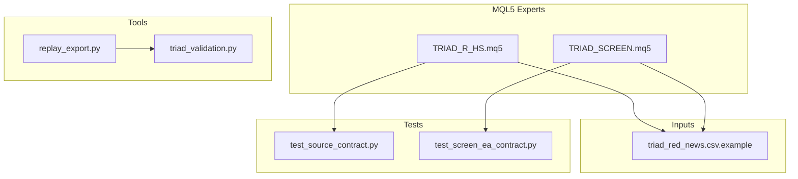

**Diagram sources**
- [TRIAD_R_HS.mq5:1-150](file://MQL5/Experts/TRIAD_R_HS/TRIAD_R_HS.mq5#L1-L150)
- [TRIAD_SCREEN.mq5:1-160](file://MQL5/Experts/TRIAD_SCREEN/TRIAD_SCREEN.mq5#L1-L160)
- [triad_red_news.csv.example:1-7](file://MQL5/Files/triad_red_news.csv.example#L1-L7)
- [test_source_contract.py:445-478](file://tests/test_source_contract.py#L445-L478)
- [test_screen_ea_contract.py:271-301](file://tests/test_screen_ea_contract.py#L271-L301)
- [replay_export.py:549-575](file://tools/replay_export.py#L549-L575)
- [triad_validation.py:888-919](file://tools/triad_validation.py#L888-L919)

**Section sources**
- [TRIAD_R_HS.mq5:1-150](file://MQL5/Experts/TRIAD_R_HS/TRIAD_R_HS.mq5#L1-L150)
- [TRIAD_SCREEN.mq5:1-160](file://MQL5/Experts/TRIAD_SCREEN/TRIAD_SCREEN.mq5#L1-L160)
- [README.md (TRIAD_R_HS):1-150](file://MQL5/Experts/TRIAD_R_HS/README.md#L1-L150)
- [README.md (TRIAD_SCREEN):1-120](file://MQL5/Experts/TRIAD_SCREEN/README.md#L1-L120)

## Core Components
- Production EA (TRIAD_R_HS): Fail-closed design, instance lock, halt latches, state signatures, news calendar enforcement, session bounds, risk guards, exposure invariants, audit logging, and strict initialization checks.
- Screening EA (TRIAD_SCREEN): Demo-only tool mirroring V2.1 entry logic, challenge rule tracking, on-chart dashboard, crash-safe closed-trade ledger, and per-run halts.

Key operational themes:
- All entries are gated by session geometry, news blackout, spread/cost, and risk guards.
- Exposure is strictly one-pending-order-or-one-position; violations trigger immediate cleanup.
- State persistence uses terminal globals with integrity signatures; partial writes fail closed.
- Logs are written to CSV with structured events for auditability.

**Section sources**
- [TRIAD_R_HS.mq5:268-617](file://MQL5/Experts/TRIAD_R_HS/TRIAD_R_HS.mq5#L268-L617)
- [TRIAD_SCREEN.mq5:291-580](file://MQL5/Experts/TRIAD_SCREEN/TRIAD_SCREEN.mq5#L291-L580)
- [README.md (TRIAD_R_HS):15-150](file://MQL5/Experts/TRIAD_R_HS/README.md#L15-L150)
- [README.md (TRIAD_SCREEN):12-120](file://MQL5/Experts/TRIAD_SCREEN/README.md#L12-L120)

## Architecture Overview
The system enforces a layered control flow:
- Initialization validates environment, server offset, account identity, and configuration.
- Runtime loop refreshes sessions, loads news calendar, computes candidates, applies risk guards, manages exposure, and persists state.
- Safety mechanisms include instance locks, halt latches, exposure invariants, and emergency throttles.

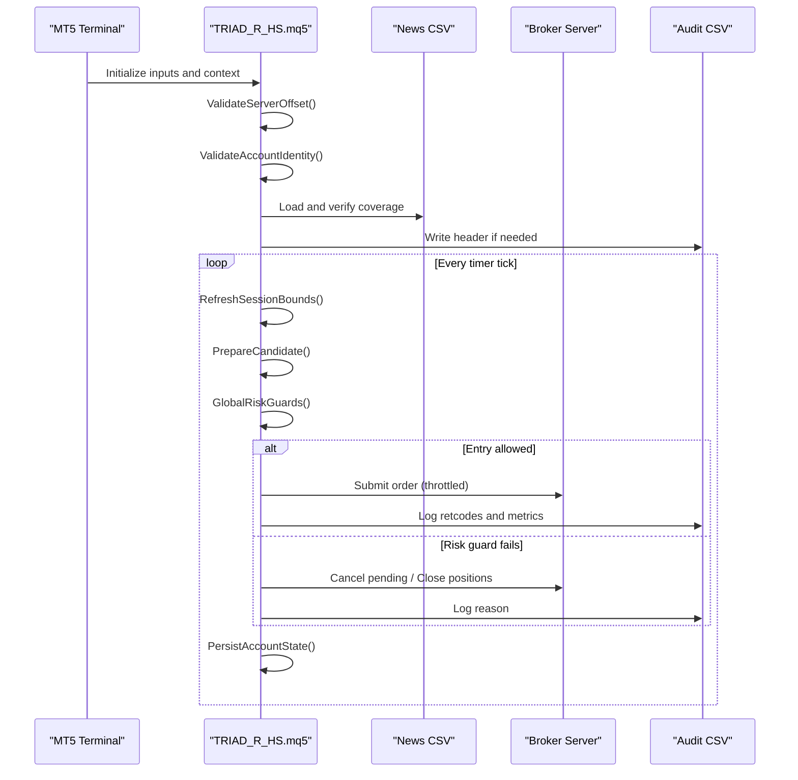

**Diagram sources**
- [TRIAD_R_HS.mq5:3654-3691](file://MQL5/Experts/TRIAD_R_HS/TRIAD_R_HS.mq5#L3654-L3691)
- [TRIAD_R_HS.mq5:2951-2985](file://MQL5/Experts/TRIAD_R_HS/TRIAD_R_HS.mq5#L2951-L2985)
- [TRIAD_R_HS.mq5:299-327](file://MQL5/Experts/TRIAD_R_HS/TRIAD_R_HS.mq5#L299-L327)
- [TRIAD_R_HS.mq5:568-617](file://MQL5/Experts/TRIAD_R_HS/TRIAD_R_HS.mq5#L568-L617)

## Detailed Component Analysis

### Initialization and Identity Validation
- Validates server UTC offset within tolerance.
- Enforces product code, phase initial balance, leverage, currency, and hedging mode expectations.
- Fails closed on mismatched identity or unauthorized context.

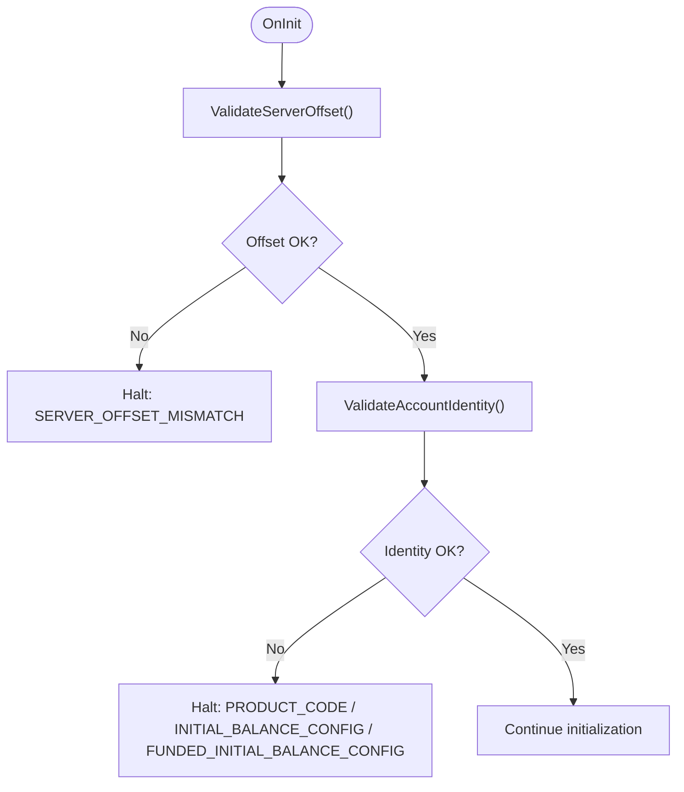

**Diagram sources**
- [TRIAD_R_HS.mq5:3654-3691](file://MQL5/Experts/TRIAD_R_HS/TRIAD_R_HS.mq5#L3654-L3691)

**Section sources**
- [TRIAD_R_HS.mq5:3654-3691](file://MQL5/Experts/TRIAD_R_HS/TRIAD_R_HS.mq5#L3654-L3691)

### Instance Lock and Concurrency Control
- Acquires a terminal-global owner/heartbeat lock to prevent multiple live instances.
- Detects stale instances and fences them; heartbeat loss triggers emergency cleanup.

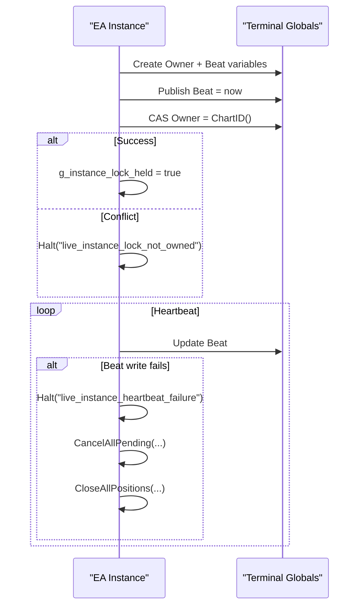

**Diagram sources**
- [TRIAD_R_HS.mq5:494-554](file://MQL5/Experts/TRIAD_R_HS/TRIAD_R_HS.mq5#L494-L554)

**Section sources**
- [TRIAD_R_HS.mq5:494-554](file://MQL5/Experts/TRIAD_R_HS/TRIAD_R_HS.mq5#L494-L554)

### Exposure Invariant Enforcement
- Ensures at most one own pending order or one own position.
- Violations trigger cancel/close and halt.

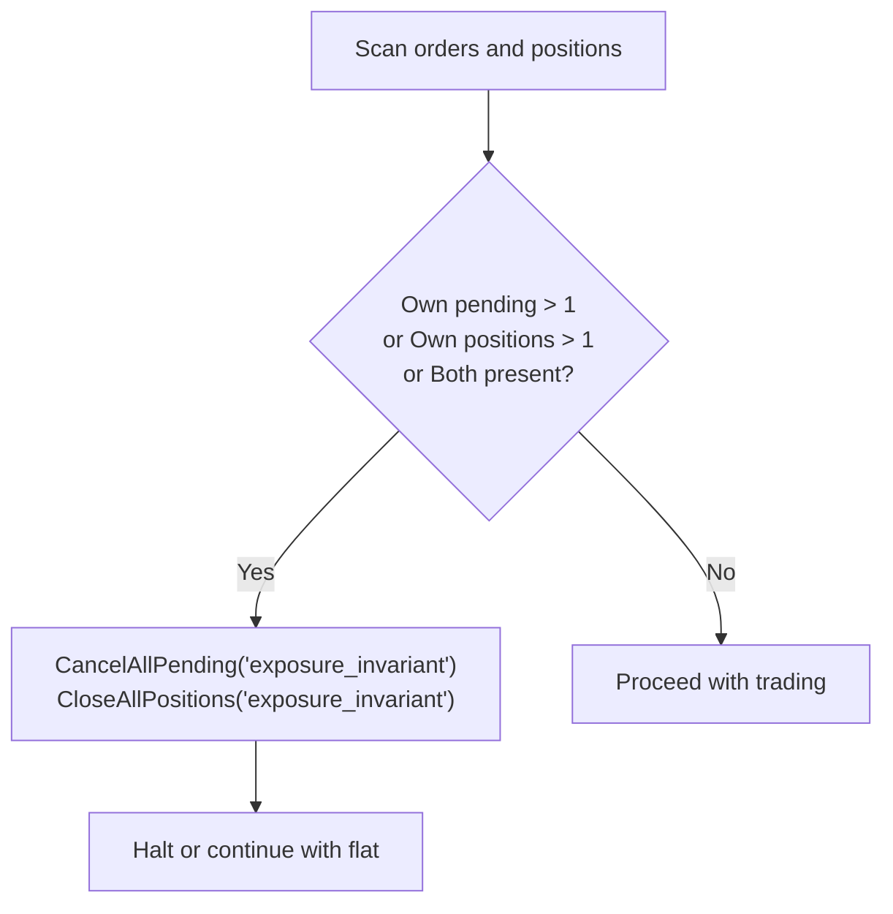

**Diagram sources**
- [TRIAD_R_HS.mq5:2970-2976](file://MQL5/Experts/TRIAD_R_HS/TRIAD_R_HS.mq5#L2970-L2976)
- [TRIAD_SCREEN.mq5:2387-2394](file://MQL5/Experts/TRIAD_SCREEN/TRIAD_SCREEN.mq5#L2387-L2394)

**Section sources**
- [TRIAD_R_HS.mq5:2970-2976](file://MQL5/Experts/TRIAD_R_HS/TRIAD_R_HS.mq5#L2970-L2976)
- [TRIAD_SCREEN.mq5:2387-2394](file://MQL5/Experts/TRIAD_SCREEN/TRIAD_SCREEN.mq5#L2387-L2394)

### News Calendar and Coverage Validation
- Loads RED/HIGH events and requires explicit ALL,COVERAGE timestamp.
- Stale or missing coverage blocks entries and forces managed exposure flat.

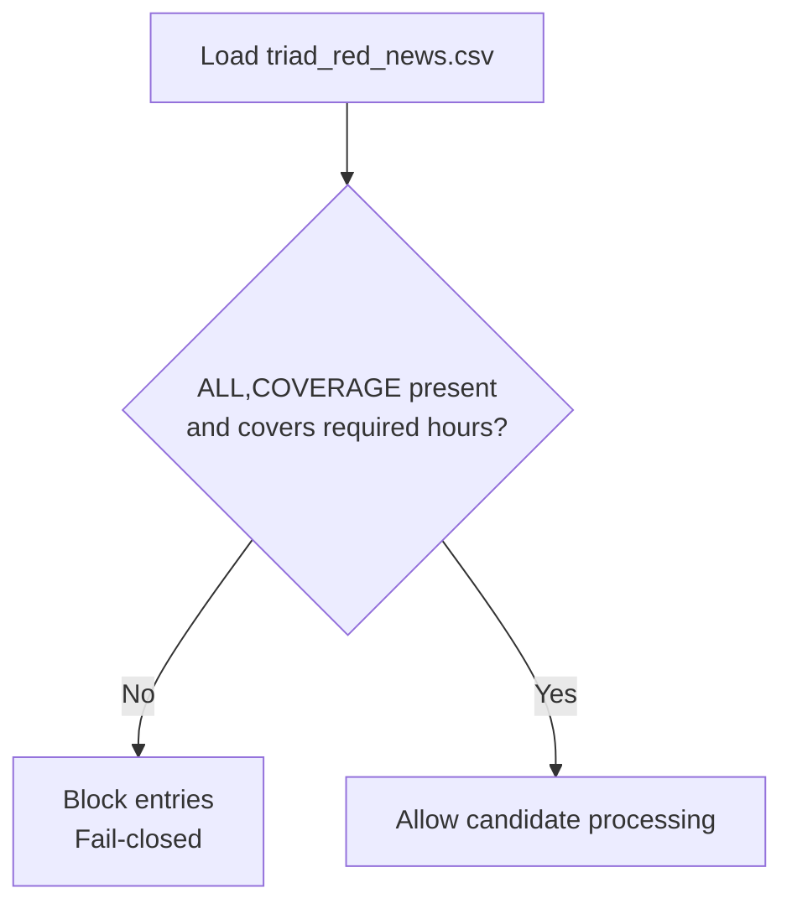

**Diagram sources**
- [triad_red_news.csv.example:1-7](file://MQL5/Files/triad_red_news.csv.example#L1-L7)
- [README.md (TRIAD_R_HS):27-48](file://MQL5/Experts/TRIAD_R_HS/README.md#L27-L48)

**Section sources**
- [triad_red_news.csv.example:1-7](file://MQL5/Files/triad_red_news.csv.example#L1-L7)
- [README.md (TRIAD_R_HS):27-48](file://MQL5/Experts/TRIAD_R_HS/README.md#L27-L48)

### Session Bounds and Time Windows
- Computes London and New York windows using DST-aware conversions.
- Skips mid-session attach to avoid reconstructing stale events.

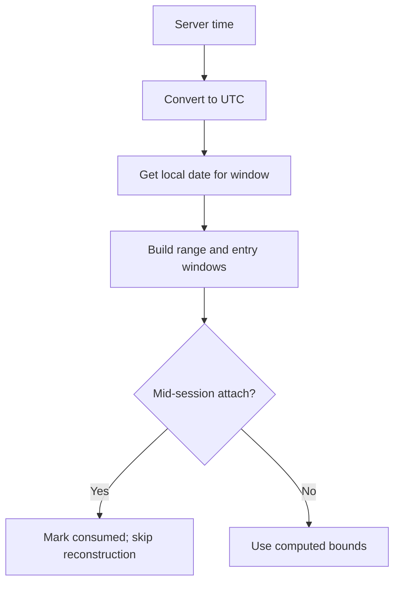

**Diagram sources**
- [TRIAD_R_HS.mq5:624-789](file://MQL5/Experts/TRIAD_R_HS/TRIAD_R_HS.mq5#L624-L789)
- [TRIAD_SCREEN.mq5:583-749](file://MQL5/Experts/TRIAD_SCREEN/TRIAD_SCREEN.mq5#L583-L749)

**Section sources**
- [TRIAD_R_HS.mq5:624-789](file://MQL5/Experts/TRIAD_R_HS/TRIAD_R_HS.mq5#L624-L789)
- [TRIAD_SCREEN.mq5:583-749](file://MQL5/Experts/TRIAD_SCREEN/TRIAD_SCREEN.mq5#L583-L749)

### Candidate Preparation and Rejection Reasons
- Applies sweep/reclaim/displacement geometry, ATR/range percentile gates, spread/cost filters, and time-stop constraints.
- Rejects with explicit reasons (e.g., insufficient history, stats insufficient, news blackout).

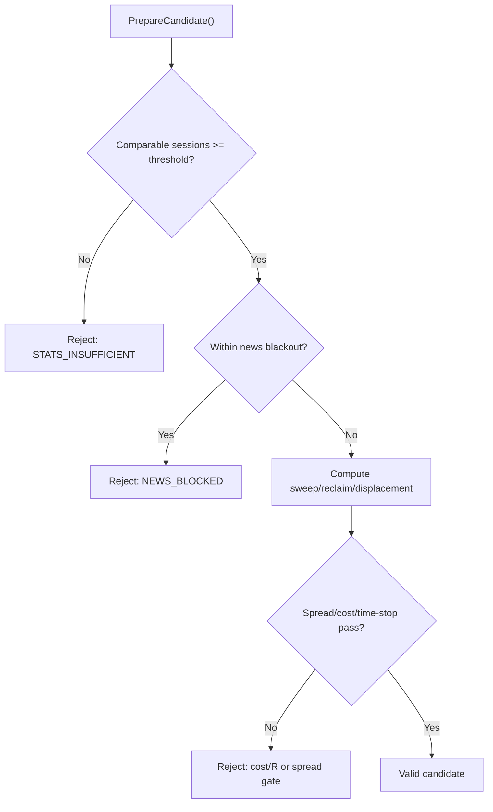

**Diagram sources**
- [TRIAD_R_HS.mq5:180-207](file://MQL5/Experts/TRIAD_R_HS/TRIAD_R_HS.mq5#L180-L207)
- [test_source_contract.py:445-478](file://tests/test_source_contract.py#L445-L478)

**Section sources**
- [TRIAD_R_HS.mq5:180-207](file://MQL5/Experts/TRIAD_R_HS/TRIAD_R_HS.mq5#L180-L207)
- [test_source_contract.py:445-478](file://tests/test_source_contract.py#L445-L478)

### Order Submission and Latency Controls
- Throttles non-emergency requests per day; measures latency against configured maximum.
- Emergency actions bypass non-emergency cap but remain per-ticket throttled.

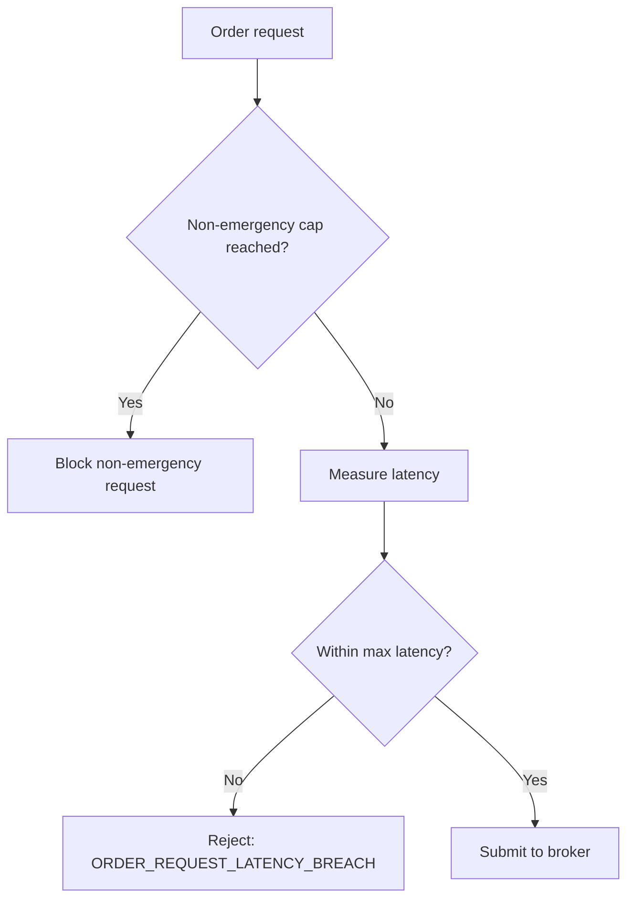

**Diagram sources**
- [test_screen_ea_contract.py:289-294](file://tests/test_screen_ea_contract.py#L289-L294)
- [TRIAD_R_HS.mq5:86-90](file://MQL5/Experts/TRIAD_R_HS/TRIAD_R_HS.mq5#L86-L90)

**Section sources**
- [test_screen_ea_contract.py:289-294](file://tests/test_screen_ea_contract.py#L289-L294)
- [TRIAD_R_HS.mq5:86-90](file://MQL5/Experts/TRIAD_R_HS/TRIAD_R_HS.mq5#L86-L90)

### State Persistence and Migration Latches
- Persists configuration hash, identity hash, halt latches, daily/weekly baselines, request counts, and state signature.
- Partial writes fail closed; migration latches require formal rebaseline.

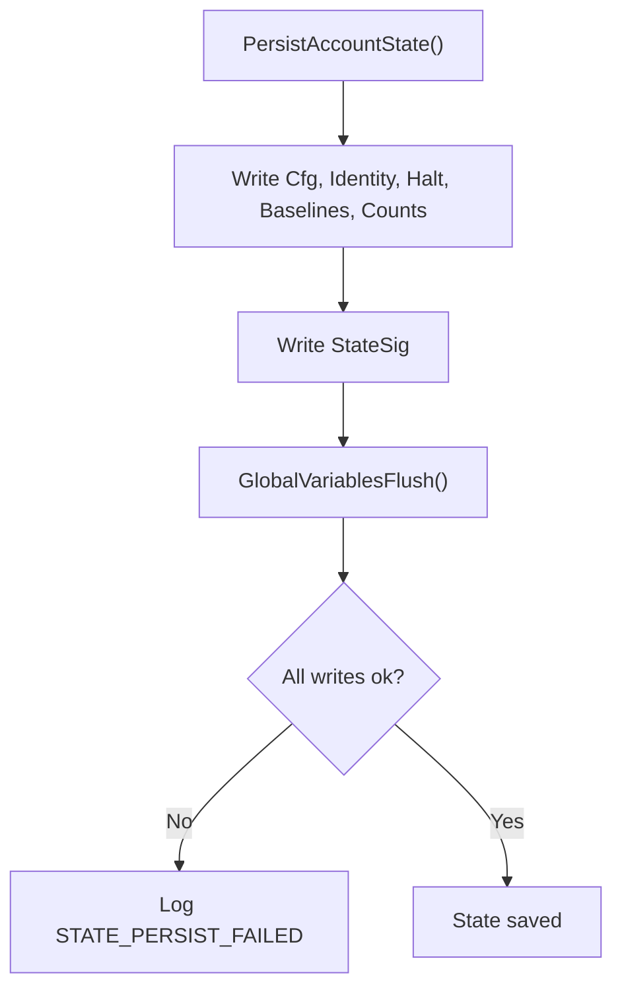

**Diagram sources**
- [TRIAD_R_HS.mq5:568-617](file://MQL5/Experts/TRIAD_R_HS/TRIAD_R_HS.mq5#L568-L617)

**Section sources**
- [TRIAD_R_HS.mq5:568-617](file://MQL5/Experts/TRIAD_R_HS/TRIAD_R_HS.mq5#L568-L617)

## Dependency Analysis
- TRIAD_R_HS depends on MQL5 Trade library, global variables for state, file I/O for audit logs, and the news CSV.
- TRIAD_SCREEN depends on similar structures but omits production safety machinery.
- Tests assert presence of specific tokens and behaviors across both EAs.
- Tools validate replay exports and apply Section-13 gates.

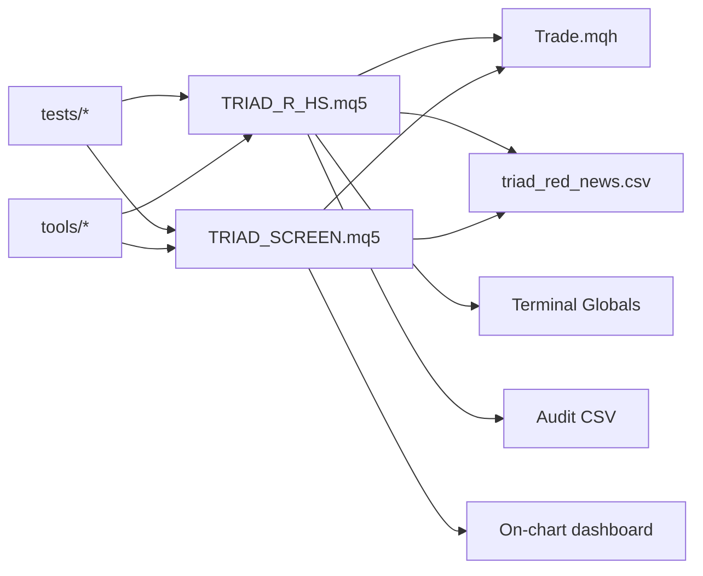

**Diagram sources**
- [TRIAD_R_HS.mq5:7-8](file://MQL5/Experts/TRIAD_R_HS/TRIAD_R_HS.mq5#L7-L8)
- [TRIAD_SCREEN.mq5:34-35](file://MQL5/Experts/TRIAD_SCREEN/TRIAD_SCREEN.mq5#L34-L35)
- [triad_red_news.csv.example:1-7](file://MQL5/Files/triad_red_news.csv.example#L1-L7)
- [test_source_contract.py:445-478](file://tests/test_source_contract.py#L445-L478)
- [test_screen_ea_contract.py:271-301](file://tests/test_screen_ea_contract.py#L271-L301)

**Section sources**
- [TRIAD_R_HS.mq5:7-8](file://MQL5/Experts/TRIAD_R_HS/TRIAD_R_HS.mq5#L7-L8)
- [TRIAD_SCREEN.mq5:34-35](file://MQL5/Experts/TRIAD_SCREEN/TRIAD_SCREEN.mq5#L34-L35)
- [triad_red_news.csv.example:1-7](file://MQL5/Files/triad_red_news.csv.example#L1-L7)
- [test_source_contract.py:445-478](file://tests/test_source_contract.py#L445-L478)
- [test_screen_ea_contract.py:271-301](file://tests/test_screen_ea_contract.py#L271-L301)

## Performance Considerations
- Timer cadence and one-second synchronous request latency ceiling must be validated empirically; breaches are logged and rejected.
- Non-emergency request caps protect against excessive calls; emergency cleanup remains responsive.
- Indicator handles and session computations should be refreshed efficiently; ensure sufficient history depth to avoid repeated warnings.
- Use Strategy Tester with deterministic state reset for batch runs; preserve logs for post-processing.

[No sources needed since this section provides general guidance]

## Troubleshooting Guide

### Deployment Problems
- **Installation**: Copy EA to correct directory, compile with zero errors, attach to chart, ensure symbols exist in Market Watch.
- **News CSV**: Place verified `triad_red_news.csv` in `MQL5/Files`; ensure schema matches and coverage row extends beyond current UTC by required hours.
- **Order submission**: Defaults disabled; enable only after all validation gates pass and user approval.

Resolution steps:
- Verify compilation output and source/build checksum archived.
- Confirm symbols and base/profit currencies map correctly.
- Review Experts log and audit CSV for any ERROR/HALT/stale calendar/insufficient history/property mismatch/offset mismatch.

**Section sources**
- [README.md (TRIAD_R_HS):15-24](file://MQL5/Experts/TRIAD_R_HS/README.md#L15-L24)
- [README.md (TRIAD_R_HS):27-48](file://MQL5/Experts/TRIAD_R_HS/README.md#L27-L48)
- [triad_red_news.csv.example:1-7](file://MQL5/Files/triad_red_news.csv.example#L1-L7)

### Runtime Errors and Halts
Common HALT/ERROR conditions and resolutions:
- **SERVER_OFFSET_MISMATCH**: Adjust `InpExpectedServerUtcOffsetHours` to match broker server; verify tolerance.
- **PRODUCT_CODE / INITIAL_BALANCE_CONFIG / FUNDED_INITIAL_BALANCE_CONFIG**: Ensure phase and initial balance match contract; funded phase requires reconciled initial balance.
- **INSTANCE_LOCK_* / STALE_INSTANCE_FENCED**: Only one live instance per account; remove duplicates; ensure heartbeat updates.
- **EXTERNAL_CASHFLOW_DETECTED / UNAUTHORIZED_TRADING_HISTORY**: Requires formal rebaseline/migration release; do not use ordinary halt reset.
- **AUDIT_LOG_OPEN_FAILED / AUDIT_LOG_WRITE_FAILED**: Check file permissions and path; resolve storage issues.

Recovery:
- Fix configuration or environment, then reattach EA.
- For persisted halts, use one-time authorization input to clear latch, then reattach.

**Section sources**
- [TRIAD_R_HS.mq5:3654-3691](file://MQL5/Experts/TRIAD_R_HS/TRIAD_R_HS.mq5#L3654-L3691)
- [TRIAD_R_HS.mq5:494-554](file://MQL5/Experts/TRIAD_R_HS/TRIAD_R_HS.mq5#L494-L554)
- [TRIAD_R_HS.mq5:568-617](file://MQL5/Experts/TRIAD_R_HS/TRIAD_R_HS.mq5#L568-L617)
- [test_source_contract.py:445-478](file://tests/test_source_contract.py#L445-L478)

### Connection Issues
- **Stale quotes**: Max quote age and deviation points enforced; if exceeded, signals may be blocked or rejected.
- **Calendar failures**: Missing or stale news coverage blocks entries; update CSV and ensure coverage extends sufficiently.
- **Rollover flat minutes**: During rollover boundaries, entries are blocked; wait until flat period passes.

Resolution:
- Verify quote freshness and deviation thresholds.
- Refresh news CSV before coverage expires; reconcile event times and DST changes.
- Respect rollover buffers; avoid attaching during critical boundaries.

**Section sources**
- [TRIAD_R_HS.mq5:78-90](file://MQL5/Experts/TRIAD_R_HS/TRIAD_R_HS.mq5#L78-L90)
- [README.md (TRIAD_R_HS):27-48](file://MQL5/Experts/TRIAD_R_HS/README.md#L27-L48)

### Configuration Mismatches
- **Account identity**: Login, server, currency, leverage must match authorized values; product code must be exact.
- **Phase and targets**: Phase initial balance and targets must align with agreement; Phase 2 base may differ from preset.
- **Symbol names**: Suffixes allowed; base/profit currencies validated.

Resolution:
- Align inputs with actual account and agreement.
- Use dashboard ConfigHash to attribute results to settings.

**Section sources**
- [TRIAD_R_HS.mq5:3654-3691](file://MQL5/Experts/TRIAD_R_HS/TRIAD_R_HS.mq5#L3654-L3691)
- [README.md (TRIAD_SCREEN):120-159](file://MQL5/Experts/TRIAD_SCREEN/README.md#L120-L159)

### Error Message Interpretation
- Look for structured events in audit CSV and Experts log: level, event name, detail.
- Key tokens include ORDER_REQUEST_LATENCY_BREACH, EXPOSURE_INVARIANT_VIOLATED, FOREIGN_EXPOSURE, REQUEST_CAP_REACHED, etc.
- Use these tokens to identify root cause quickly.

**Section sources**
- [test_source_contract.py:445-478](file://tests/test_source_contract.py#L445-L478)
- [TRIAD_SCREEN.mq5:2387-2394](file://MQL5/Experts/TRIAD_SCREEN/TRIAD_SCREEN.mq5#L2387-L2394)

### Log Analysis Techniques
- Open audit CSV files in spreadsheet tools; filter by level and event name.
- Correlate server_time with MT5 Experts tab timestamps.
- Track request_count, balance, equity columns to assess activity and impact.

**Section sources**
- [TRIAD_R_HS.mq5:299-327](file://MQL5/Experts/TRIAD_R_HS/TRIAD_R_HS.mq5#L299-L327)
- [TRIAD_SCREEN.mq5:329-354](file://MQL5/Experts/TRIAD_SCREEN/TRIAD_SCREEN.mq5#L329-L354)

### Diagnostic Procedures
- Run Python unit tests to validate source contracts and expected tokens.
- Use replay export to build observed-event CSVs and validate fill policies.
- Apply Section-13 validation to check aggregate and per-combination gates.

**Section sources**
- [test_source_contract.py:445-478](file://tests/test_source_contract.py#L445-L478)
- [replay_export.py:549-575](file://tools/replay_export.py#L549-L575)
- [triad_validation.py:888-919](file://tools/triad_validation.py#L888-L919)

### Failure Recovery Paths
- **Unknown account profiles**: Ensure product code and phase match; if mismatch, restore authorized context and reconcile.
- **Stale quotes**: Wait for fresh quotes or adjust thresholds; verify broker data feed.
- **Calendar failures**: Update news CSV; ensure coverage row extends beyond required hours.
- **Order rejections**: Check latency, spread/cost gates, and risk guards; retry after resolving conditions.

**Section sources**
- [TRIAD_R_HS.mq5:3654-3691](file://MQL5/Experts/TRIAD_R_HS/TRIAD_R_HS.mq5#L3654-L3691)
- [TRIAD_R_HS.mq5:2970-2985](file://MQL5/Experts/TRIAD_R_HS/TRIAD_R_HS.mq5#L2970-L2985)

### Critical Issue Resolution Guides
- **Duplicate positions**: Exposure invariant violation detected; system cancels pending and closes positions automatically. Verify no manual interference; reattach if necessary.
- **Missing stops**: Visible exit plan mismatch triggers repair; ensure SL/TP set per plan; emergency delete/close if needed.
- **Sizing errors**: Cost-to-R and spread/cost gates reject invalid sizes; adjust parameters or wait for favorable conditions.
- **Compliance violations**: Daily/overall floor breach, phase complete, drawdown shutdown; system flattens exposure and halts new entries.

**Section sources**
- [TRIAD_R_HS.mq5:2970-2985](file://MQL5/Experts/TRIAD_R_HS/TRIAD_R_HS.mq5#L2970-L2985)
- [test_screen_ea_contract.py:271-301](file://tests/test_screen_ea_contract.py#L271-L301)

### Debugging Tools Usage
- **Strategy Tester**: Use deterministic state reset for batch runs; enable order submission only in tester; preserve logs.
- **Replay export**: Build observed-event CSVs from upstream tick/bar replay; validate fill policies and costs.
- **Validation tool**: Apply Section-13 gates; inspect reports for expectancy, profit factor, fills, and stress outcomes.

**Section sources**
- [README.md (TRIAD_R_HS):147-197](file://MQL5/Experts/TRIAD_R_HS/README.md#L147-L197)
- [replay_export.py:549-575](file://tools/replay_export.py#L549-L575)
- [triad_validation.py:888-919](file://tools/triad_validation.py#L888-L919)

### Performance Optimization Tips
- Ensure sufficient history depth to avoid STATS_INSUFFICIENT warnings.
- Tune request latency thresholds based on empirical testing; monitor ORDER_REQUEST_LATENCY_BREACH events.
- Use efficient session bounds computation; avoid redundant indicator handle creation.

[No sources needed since this section provides general guidance]

### System Health Assessment
- Monitor dashboard status (ACTIVE/PASSED/FAILED/HALTED) and ConfigHash.
- Review daily summaries and closed-trade ledgers for net R and qualifying days.
- Check for foreign/manual exposure and ensure own-magic exposure is cleaned.

**Section sources**
- [README.md (TRIAD_SCREEN):81-139](file://MQL5/Experts/TRIAD_SCREEN/README.md#L81-L139)

### Environmental and Platform-Specific Issues
- **DST and server offsets**: Validate UK/US DST handling and broker server offset; mismatches cause initialization failures.
- **File permissions**: Audit log open/write failures indicate permission or path issues.
- **Third-party integrations**: News CSV must be operator-verified; stale or malformed calendars block entries.

**Section sources**
- [TRIAD_R_HS.mq5:624-789](file://MQL5/Experts/TRIAD_R_HS/TRIAD_R_HS.mq5#L624-L789)
- [TRIAD_R_HS.mq5:299-327](file://MQL5/Experts/TRIAD_R_HS/TRIAD_R_HS.mq5#L299-L327)
- [README.md (TRIAD_R_HS):27-48](file://MQL5/Experts/TRIAD_R_HS/README.md#L27-L48)

## Conclusion
The TRIAD-R system employs robust fail-closed safeguards, strict initialization, and comprehensive logging to ensure safe operation. Troubleshooting focuses on interpreting structured error messages, analyzing audit logs, and following documented recovery paths. Use the provided tools and tests to validate configurations, diagnose issues, and maintain system health. Always adhere to the frozen rules and validation gates before enabling order submission.

[No sources needed since this section summarizes without analyzing specific files]

## Appendices

### Quick Reference: Common Tokens and Actions
- SERVER_OFFSET_MISMATCH: Adjust server offset input.
- PRODUCT_CODE / INITIAL_BALANCE_CONFIG: Align phase and balance with contract.
- INSTANCE_LOCK_*: Ensure single live instance; resolve conflicts.
- EXTERNAL_CASHFLOW_DETECTED: Requires formal rebaseline.
- AUDIT_LOG_OPEN_FAILED: Fix file permissions/path.
- EXPOSURE_INVARIANT_VIOLATED: System cleans up; verify no manual interference.
- ORDER_REQUEST_LATENCY_BREACH: Tune latency thresholds; investigate execution delays.

**Section sources**
- [test_source_contract.py:445-478](file://tests/test_source_contract.py#L445-L478)
- [TRIAD_R_HS.mq5:3654-3691](file://MQL5/Experts/TRIAD_R_HS/TRIAD_R_HS.mq5#L3654-L3691)
- [TRIAD_R_HS.mq5:494-554](file://MQL5/Experts/TRIAD_R_HS/TRIAD_R_HS.mq5#L494-L554)
- [TRIAD_R_HS.mq5:2970-2985](file://MQL5/Experts/TRIAD_R_HS/TRIAD_R_HS.mq5#L2970-L2985)