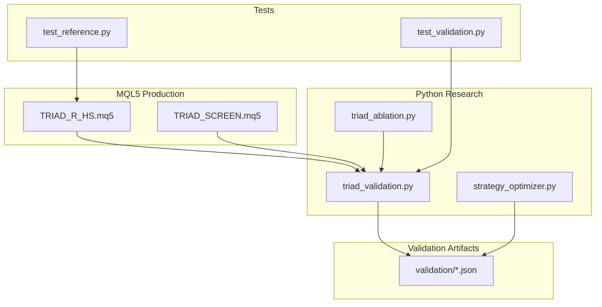
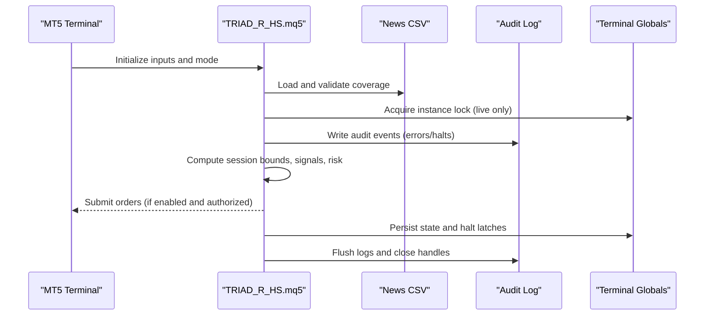
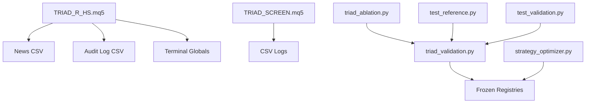

# Coding Standards and Conventions

<cite>
**Referenced Files in This Document**
- [TRIAD_R_HS.mq5](file://MQL5/Experts/TRIAD_R_HS/TRIAD_R_HS.mq5)
- [TRIAD_SCREEN.mq5](file://MQL5/Experts/TRIAD_SCREEN/TRIAD_SCREEN.mq5)
- [triad_validation.py](file://tools/triad_validation.py)
- [strategy_optimizer.py](file://tools/strategy_optimizer.py)
- [triad_ablation.py](file://tools/triad_ablation.py)
- [test_reference.py](file://tests/test_reference.py)
- [test_validation.py](file://tests/test_validation.py)
- [README.md (High Stakes EA)](file://MQL5/Experts/TRIAD_R_HS/README.md)
- [README.md (Screen EA)](file://MQL5/Experts/TRIAD_SCREEN/README.md)
</cite>

## Table of Contents
1. Introduction
2. Project Structure
3. Core Components
4. Architecture Overview
5. Detailed Component Analysis
6. Dependency Analysis
7. Performance Considerations
8. Troubleshooting Guide
9. Conclusion
10. Appendices

## Introduction
This document defines coding standards and conventions for the TRIAD-R system across MQL5 production code and Python research tools. It covers naming, file organization, comments, error handling, consistency between MQL5 and Python, code review criteria, testing requirements, and quality gates that must be met before changes are accepted. The goal is to ensure safe, auditable, and maintainable development with strong fail-closed behavior and reproducible validation.

## Project Structure
The repository separates live trading logic from research and validation:
- MQL5 Experts: production-grade EAs for live/dry-run execution and demo screening.
- Tools: Python modules for validation, ablation studies, and strategy optimization.
- Tests: unit tests validating core math, persistence integrity, civil time conversions, and validator contracts.
- Validation: frozen registries and data schemas used by Python tooling.
- Docs and plans: strategy specifications and challenge-related documentation.

**Diagram sources**
- [TRIAD_R_HS.mq5:1-150](file://MQL5/Experts/TRIAD_R_HS/TRIAD_R_HS.mq5#L1-L150)
- [TRIAD_SCREEN.mq5:1-160](file://MQL5/Experts/TRIAD_SCREEN/TRIAD_SCREEN.mq5#L1-L160)
- [triad_validation.py:1-120](file://tools/triad_validation.py#L1-L120)
- [triad_ablation.py:1-160](file://tools/triad_ablation.py#L1-L160)
- [strategy_optimizer.py:1-80](file://tools/strategy_optimizer.py#L1-L80)
- [test_reference.py:1-40](file://tests/test_reference.py#L1-L40)
- [test_validation.py:1-40](file://tests/test_validation.py#L1-L40)

**Section sources**
- [TRIAD_R_HS.mq5:1-150](file://MQL5/Experts/TRIAD_R_HS/TRIAD_R_HS.mq5#L1-L150)
- [TRIAD_SCREEN.mq5:1-160](file://MQL5/Experts/TRIAD_SCREEN/TRIAD_SCREEN.mq5#L1-L160)
- [triad_validation.py:1-120](file://tools/triad_validation.py#L1-L120)
- [triad_ablation.py:1-160](file://tools/triad_ablation.py#L1-L160)
- [strategy_optimizer.py:1-80](file://tools/strategy_optimizer.py#L1-L80)
- [test_reference.py:1-40](file://tests/test_reference.py#L1-L40)
- [test_validation.py:1-40](file://tests/test_validation.py#L1-L40)

## Core Components
- MQL5 High Stakes EA: fail-closed production EA with strict safety, instance locks, state persistence, news calendar enforcement, session bounds, and risk governors.
- MQL5 Screen EA: demo-only screening tool mirroring V2.1 entry rules without production safety machinery; includes on-chart dashboard and CSV logs.
- Python Validator: frozen registry-based champion selection, replay row validation, metrics, phase simulations, and Section-13 checks.
- Python Ablation Tool: preregistered ablation study with fixed controls and decision rules enforced by a SHA-256 registry.
- Strategy Optimizer: parameter grid search over ORB strategies for research insights.
- Tests: deterministic unit tests for profile math, persistence signatures, daily state transitions, floors, volume rounding, and civil time conversions.

**Section sources**
- [TRIAD_R_HS.mq5:16-263](file://MQL5/Experts/TRIAD_R_HS/TRIAD_R_HS.mq5#L16-L263)
- [TRIAD_SCREEN.mq5:36-287](file://MQL5/Experts/TRIAD_SCREEN/TRIAD_SCREEN.mq5#L36-L287)
- [triad_validation.py:49-159](file://tools/triad_validation.py#L49-L159)
- [triad_ablation.py:125-186](file://tools/triad_ablation.py#L125-L186)
- [strategy_optimizer.py:46-125](file://tools/strategy_optimizer.py#L46-L125)
- [test_reference.py:27-157](file://tests/test_reference.py#L27-L157)
- [test_validation.py:80-133](file://tests/test_validation.py#L80-L133)

## Architecture Overview
The system enforces separation of concerns:
- MQL5 EAs implement trading logic, safety, and persistence.
- Python tools validate, select, and simulate using frozen registries and replay data.
- Tests assert correctness of critical algorithms and contracts.

**Diagram sources**
- [TRIAD_R_HS.mq5:268-350](file://MQL5/Experts/TRIAD_R_HS/TRIAD_R_HS.mq5#L268-L350)
- [TRIAD_R_HS.mq5:494-600](file://MQL5/Experts/TRIAD_R_HS/TRIAD_R_HS.mq5#L494-L600)
- [TRIAD_R_HS.mq5:791-800](file://MQL5/Experts/TRIAD_R_HS/TRIAD_R_HS.mq5#L791-L800)

**Section sources**
- [TRIAD_R_HS.mq5:268-600](file://MQL5/Experts/TRIAD_R_HS/TRIAD_R_HS.mq5#L268-L600)
- [TRIAD_R_HS.mq5:791-800](file://MQL5/Experts/TRIAD_R_HS/TRIAD_R_HS.mq5#L791-L800)

## Detailed Component Analysis

### MQL5 Naming and File Organization
- Enums use uppercase prefixes per module: ENUM_TRIAD_PHASE, ENUM_TSC_WINDOW.
- Constants use uppercase names: EA_BUILD_ID, SAFETY_TIME_LEAD_SECONDS, TSC_BUILD_ID.
- Input parameters follow Inp prefix: InpEnableOrderSubmission, InpPhaseInitialBalance.
- Structs group related runtime state: SessionRuntime, SignalCandidate, TSC_Candidate.
- Global variables prefixed with g_: g_trade, g_news, g_sessions, g_halted.
- File organization keeps each EA in its own folder under MQL5/Experts with README describing scope and safety.

Guidelines:
- Use descriptive enum names scoped to the feature or module.
- Prefix all user-facing inputs with Inp and group related inputs together.
- Group global state with clear prefixes and initialize defaults at declaration.
- Keep structs cohesive and small; avoid overly large aggregates.

**Section sources**
- [TRIAD_R_HS.mq5:16-263](file://MQL5/Experts/TRIAD_R_HS/TRIAD_R_HS.mq5#L16-L263)
- [TRIAD_SCREEN.mq5:36-287](file://MQL5/Experts/TRIAD_SCREEN/TRIAD_SCREEN.mq5#L36-L287)

### MQL5 Comment Standards
- Top-of-file headers include purpose, version, and status notes.
- Inline comments explain non-obvious decisions, especially around safety and timing.
- Block comments delineate major sections: enums, constants, inputs, structs, utilities, logging, persistence, session bounds, news calendar.
- Comments should not duplicate obvious code; focus on rationale and constraints.

Guidelines:
- Always annotate fail-closed behaviors and safety gates.
- Document DST and session boundary assumptions explicitly.
- Include references to canonical specs where applicable.

**Section sources**
- [TRIAD_R_HS.mq5:1-15](file://MQL5/Experts/TRIAD_R_HS/TRIAD_R_HS.mq5#L1-L15)
- [TRIAD_SCREEN.mq5:1-35](file://MQL5/Experts/TRIAD_SCREEN/TRIAD_SCREEN.mq5#L1-L35)

### MQL5 Error Handling and Safety
- Fail-closed design: order submission disabled by default; multiple release gates default false.
- Instance locks prevent concurrent live instances; heartbeat fencing ensures stale instances are fenced.
- Persistent halt latches with commit signatures protect against partial writes and unauthorized resets.
- Audit logging writes structured CSV entries with server time, level, event, detail, balance, equity, request count.
- News calendar validation enforces coverage and blocks entries when stale or missing.

Guidelines:
- Treat any I/O failure as an error path; log and fail closed if necessary.
- Use explicit latches and signatures for critical state transitions.
- Validate external inputs (news CSV, account identity) rigorously.
- Separate emergency cleanup from non-emergency request throttling.

**Section sources**
- [TRIAD_R_HS.mq5:268-350](file://MQL5/Experts/TRIAD_R_HS/TRIAD_R_HS.mq5#L268-L350)
- [TRIAD_R_HS.mq5:494-600](file://MQL5/Experts/TRIAD_R_HS/TRIAD_R_HS.mq5#L494-L600)
- [TRIAD_R_HS.mq5:791-800](file://MQL5/Experts/TRIAD_R_HS/TRIAD_R_HS.mq5#L791-L800)

### Python Naming and File Organization
- Modules use snake_case filenames: triad_validation.py, strategy_optimizer.py.
- Dataclasses define immutable records: CandidateConfig, ReplayRow, AppliedTrade.
- Constants are UPPER_SNAKE_CASE: SCHEMA_VERSION, ALLOWED_COMBINATIONS, CSV_FIELDS.
- Functions use verb-noun patterns: load_registry, build_registry, apply_fill_policy.
- Tests mirror module structure and import functions directly for focused assertions.

Guidelines:
- Prefer dataclasses for domain models; keep them frozen where appropriate.
- Centralize schema definitions and constants in module-level constants.
- Organize tests by feature area with clear test classes and methods.

**Section sources**
- [triad_validation.py:49-159](file://tools/triad_validation.py#L49-L159)
- [triad_validation.py:183-227](file://tools/triad_validation.py#L183-L227)
- [strategy_optimizer.py:75-125](file://tools/strategy_optimizer.py#L75-L125)
- [test_validation.py:80-133](file://tests/test_validation.py#L80-L133)

### Python Comment Standards
- Module docstrings describe purpose, commands, and constraints.
- Function docstrings specify inputs, outputs, and side effects.
- Inline comments clarify complex logic like bootstrap intervals, fill policies, and thresholds.
- Avoid redundant comments; focus on why and how, not what.

Guidelines:
- Document CLI commands and expected inputs/outputs.
- Explain statistical and simulation assumptions clearly.
- Reference frozen registries and their immutability guarantees.

**Section sources**
- [triad_validation.py:1-30](file://tools/triad_validation.py#L1-L30)
- [triad_validation.py:278-305](file://tools/triad_validation.py#L278-L305)
- [triad_ablation.py:1-79](file://tools/triad_ablation.py#L1-L79)

### Python Error Handling and Validation
- ValidationError raised for invalid registries, replay rows, and schema mismatches.
- Strict parsing helpers enforce boolean and numeric constraints.
- Coverage validation ensures every configuration/combination/day exists in splits.
- Fill policy applies conservative rules; stressed scenarios adjust costs deterministically.

Guidelines:
- Raise specific exceptions with actionable messages.
- Validate input schemas early and fail fast.
- Ensure reproducibility via fixed seeds and frozen registries.

**Section sources**
- [triad_validation.py:227-237](file://tools/triad_validation.py#L227-L237)
- [triad_validation.py:334-357](file://tools/triad_validation.py#L334-L357)
- [triad_validation.py:360-437](file://tools/triad_validation.py#L360-L437)
- [triad_validation.py:440-473](file://tools/triad_validation.py#L440-L473)

### Consistency Between MQL5 and Python
- Both implement session bounds and DST-aware time conversions; Python tests verify correctness.
- Risk profiles and thresholds are mirrored in Python validators and MQL5 inputs.
- Registry-driven selection in Python aligns with EA configuration hashes and priorities.
- News calendar schema is consistent across MQL5 and Python tools.

Guidelines:
- Keep session boundaries and DST logic synchronized; test cross-platform equivalence.
- Align risk parameters and thresholds between EA inputs and Python validators.
- Use shared constants and schemas to reduce drift.

**Section sources**
- [test_reference.py:131-157](file://tests/test_reference.py#L131-L157)
- [triad_validation.py:54-68](file://tools/triad_validation.py#L54-L68)
- [TRIAD_R_HS.mq5:624-799](file://MQL5/Experts/TRIAD_R_HS/TRIAD_R_HS.mq5#L624-L799)
- [TRIAD_SCREEN.mq5:581-749](file://MQL5/Experts/TRIAD_SCREEN/TRIAD_SCREEN.mq5#L581-L749)

### Code Review Criteria
- All release gates must remain false unless validated and approved.
- No changes to frozen registries without re-registration and hash verification.
- New features must include unit tests and integration tests where applicable.
- Error paths must be covered; fail-closed behavior preserved.
- Logging must capture sufficient context for audits and debugging.

**Section sources**
- [TRIAD_R_HS.mq5:52-76](file://MQL5/Experts/TRIAD_R_HS/TRIAD_R_HS.mq5#L52-L76)
- [triad_validation.py:278-305](file://tools/triad_validation.py#L278-L305)
- [test_validation.py:80-133](file://tests/test_validation.py#L80-L133)

### Testing Requirements
- Unit tests cover profile math, persistence signatures, daily state transitions, floors, volume rounding, and civil time conversions.
- Validator tests assert registry integrity, coverage requirements, fill policy behavior, and selection mechanics.
- Tests must run deterministically with fixed seeds and frozen registries.

Guidelines:
- Add tests for new functions and edge cases.
- Use fixtures and helper functions to construct realistic replay rows.
- Validate both normal and stressed scenarios.

**Section sources**
- [test_reference.py:27-157](file://tests/test_reference.py#L27-L157)
- [test_validation.py:80-317](file://tests/test_validation.py#L80-L317)

### Quality Gates Before Acceptance
- Compile MQL5 with zero errors; investigate warnings.
- Run Python unit tests successfully.
- Validate replay exports against frozen registries.
- Perform walk-forward and holdout evaluations per Section-13.
- Forward-demo validation on exact broker symbols/server.
- Explicit approval of frozen source/configuration release.

**Section sources**
- [README.md (High Stakes EA):227-247](file://MQL5/Experts/TRIAD_R_HS/README.md#L227-L247)
- [triad_validation.py:278-305](file://tools/triad_validation.py#L278-L305)
- [test_validation.py:80-133](file://tests/test_validation.py#L80-L133)

## Dependency Analysis
Key dependencies and relationships:
- MQL5 EAs depend on MT5 libraries and news CSV; they persist state via terminal globals and write audit logs.
- Python tools depend on standard library modules and frozen registries; they do not submit orders.
- Tests depend on Python modules and validate core logic in isolation.

**Diagram sources**
- [TRIAD_R_HS.mq5:268-350](file://MQL5/Experts/TRIAD_R_HS/TRIAD_R_HS.mq5#L268-L350)
- [TRIAD_SCREEN.mq5:329-354](file://MQL5/Experts/TRIAD_SCREEN/TRIAD_SCREEN.mq5#L329-L354)
- [triad_validation.py:278-305](file://tools/triad_validation.py#L278-L305)
- [triad_ablation.py:98-123](file://tools/triad_ablation.py#L98-L123)
- [strategy_optimizer.py:220-224](file://tools/strategy_optimizer.py#L220-L224)
- [test_reference.py:7-21](file://tests/test_reference.py#L7-L21)
- [test_validation.py:9-29](file://tests/test_validation.py#L9-L29)

**Section sources**
- [TRIAD_R_HS.mq5:268-350](file://MQL5/Experts/TRIAD_R_HS/TRIAD_R_HS.mq5#L268-L350)
- [TRIAD_SCREEN.mq5:329-354](file://MQL5/Experts/TRIAD_SCREEN/TRIAD_SCREEN.mq5#L329-L354)
- [triad_validation.py:278-305](file://tools/triad_validation.py#L278-L305)
- [triad_ablation.py:98-123](file://tools/triad_ablation.py#L98-L123)
- [strategy_optimizer.py:220-224](file://tools/strategy_optimizer.py#L220-L224)
- [test_reference.py:7-21](file://tests/test_reference.py#L7-L21)
- [test_validation.py:9-29](file://tests/test_validation.py#L9-L29)

## Performance Considerations
- MQL5 timers and request throttling minimize unnecessary operations; emergency cleanup bypasses non-emergency caps.
- Python tools use efficient data structures and batch processing; registries ensure reproducibility.
- Logging should be concise but informative; avoid excessive I/O in hot paths.

[No sources needed since this section provides general guidance]

## Troubleshooting Guide
Common issues and resolutions:
- News calendar stale or missing: entries blocked; refresh coverage and revalidate.
- Instance lock conflicts: ensure single live instance per account; check heartbeat and owner variables.
- State migration required: resolve external cashflow or exposure anomalies; follow rebaseline process.
- Registry mismatch: re-register and verify SHA-256; do not mutate frozen payloads.
- Test failures: inspect assertion messages; update fixtures or logic accordingly.

**Section sources**
- [TRIAD_R_HS.mq5:791-800](file://MQL5/Experts/TRIAD_R_HS/TRIAD_R_HS.mq5#L791-L800)
- [TRIAD_R_HS.mq5:494-600](file://MQL5/Experts/TRIAD_R_HS/TRIAD_R_HS.mq5#L494-L600)
- [triad_validation.py:360-437](file://tools/triad_validation.py#L360-L437)
- [test_validation.py:80-133](file://tests/test_validation.py#L80-L133)

## Conclusion
The TRIAD-R system enforces rigorous coding standards, fail-closed safety, and reproducible validation across MQL5 and Python. Adhering to these conventions ensures consistency, reliability, and auditability. All changes must pass defined quality gates and maintain alignment with frozen registries and canonical specifications.

[No sources needed since this section summarizes without analyzing specific files]

## Appendices

### Appendix A: MQL5 Input Parameter Groups
- Safety and account identity: enable flags, release IDs, gate attestations, product codes, authorized login, server/currency/leverage expectations.
- Fixed server/calendar controls: UTC offset, news blackout windows, rollover flat minutes, max quote age/deviation/request latency, fresh mid-session skip.
- Instruments: symbol names, session enablement, priorities, per-combination gates.
- Coarse research candidates: profiles, percentile bands, comparable sessions, time stop, breakeven move, H1 EMA bias filter.
- Fixed entry/risk definitions: sweep ATR bounds, reclaim bars/wick, displacement body, limit expiry, stop buffer/min/max, cost-to-R, spread multiplier, commission, slippage reserves, drawdown tiers, firm floor reserve.
- Logging: verbosity, file prefix, inactivity threshold.

**Section sources**
- [TRIAD_R_HS.mq5:52-150](file://MQL5/Experts/TRIAD_R_HS/TRIAD_R_HS.mq5#L52-L150)

### Appendix B: Python Validation Schema and Thresholds
- CSV fields define replay row contract; schema enforced strictly.
- Allowed combinations limited to EURUSD_LONDON, GBPUSD_LONDON, USDJPY_NEW_YORK.
- Profiles map risk fractions and target R values; time stops include session-only option.
- Fill policy enforces minimum trade-through ticks and full fills; stressed scenario adjusts costs and misses profitable limits deterministically.
- Thresholds include minimum fills, expectancy, profit factor, phase pass probabilities, qualifying day probability, and drawdown limits.

**Section sources**
- [triad_validation.py:71-95](file://tools/triad_validation.py#L71-L95)
- [triad_validation.py:54-68](file://tools/triad_validation.py#L54-L68)
- [triad_validation.py:130-159](file://tools/triad_validation.py#L130-L159)

### Appendix C: Testing Checklist
- Profile math: verify cash calculations and risk fraction bounds.
- Persistence integrity: confirm halt latch signatures invalidate on mutation.
- Daily state transitions: ensure first net positive locks day; second eligible after zero/loss.
- Floor and volume rounding: validate firm floors, reserves, and down-rounding behavior.
- Civil time conversions: test London/NY DST transitions and UTC-to-server mapping.

**Section sources**
- [test_reference.py:27-157](file://tests/test_reference.py#L27-L157)