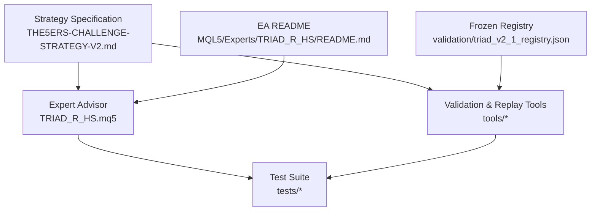
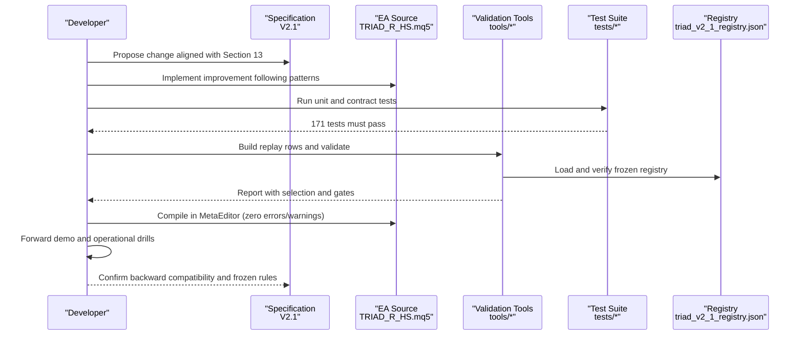
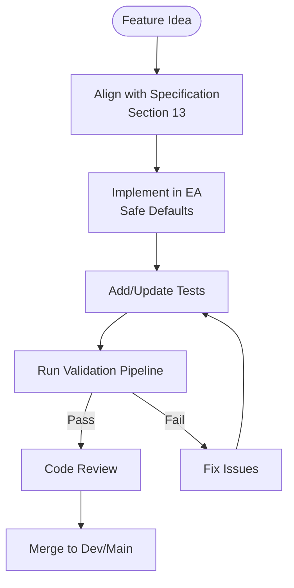
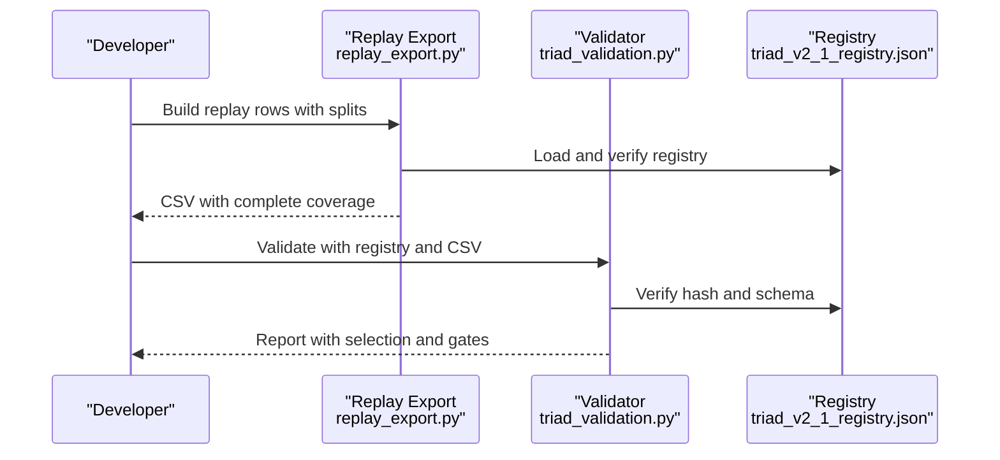
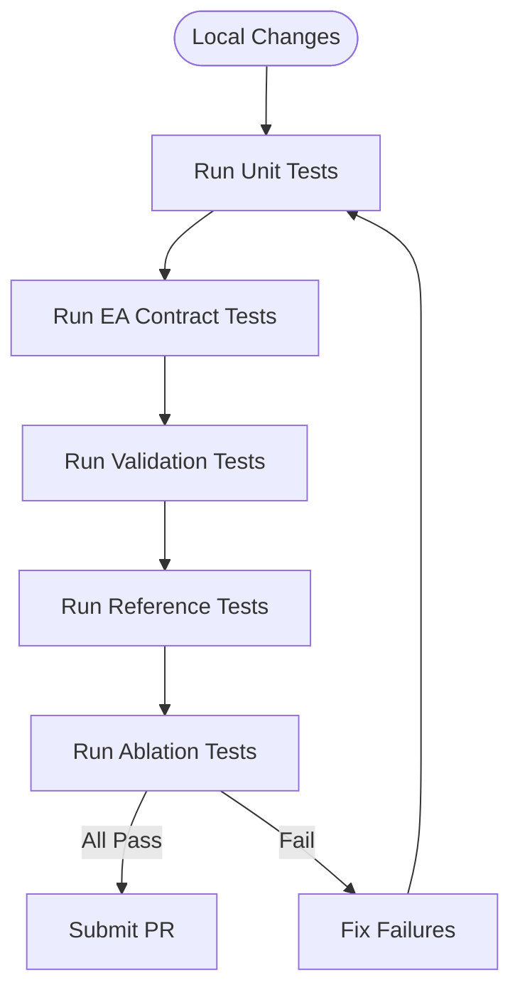
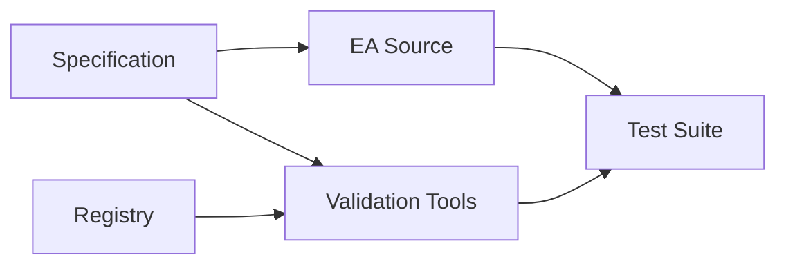

# Contribution Workflow

<cite>
**Referenced Files in This Document**
- [THE5ERS-CHALLENGE-STRATEGY-V2.md](file://THE5ERS-CHALLENGE-STRATEGY-V2.md)
- [TRIAD_R_HS.mq5](file://MQL5/Experts/TRIAD_R_HS/TRIAD_R_HS.mq5)
- [EA README](file://MQL5/Experts/TRIAD_R_HS/README.md)
- [triad_validation.py](file://tools/triad_validation.py)
- [test_source_contract.py](file://tests/test_source_contract.py)
- [test_validation.py](file://tests/test_validation.py)
- [test_reference.py](file://tests/test_reference.py)
- [test_ablation_scaffold.py](file://tests/test_ablation_scaffold.py)
- [progress.md](file://progress.md)
</cite>

## Table of Contents
1. [Introduction](#introduction)
2. [Project Structure](#project-structure)
3. [Core Components](#core-components)
4. [Architecture Overview](#architecture-overview)
5. [Detailed Component Analysis](#detailed-component-analysis)
6. [Dependency Analysis](#dependency-analysis)
7. [Performance Considerations](#performance-considerations)
8. [Troubleshooting Guide](#troubleshooting-guide)
9. [Conclusion](#conclusion)
10. [Appendices](#appendices)

## Introduction
This document defines the contribution workflow for developers working on the TRIAD-R system. It covers the full development lifecycle from feature conception through deployment, including branching strategy, commit practices, code review gates, and validation requirements. The process is designed to keep changes backward-compatible with the frozen V2.1 strategy specification and to ensure all 171 tests pass before any change is considered ready for release or challenge use.

The repository enforces a strict separation between:
- Frozen strategy specification and registry (not to be modified without revalidation).
- MQL5 Expert Advisor source code (subject to static contract tests).
- Python tooling for replay export, champion selection, and ablation research.
- A comprehensive test suite that validates contracts, data schemas, and selection mechanics.

## Project Structure
At a high level, the project consists of:
- MQL5 EA implementation under MQL5/Experts/TRIAD_R_HS.
- Offline validation and replay tooling under tools/.
- A comprehensive test suite under tests/.
- Frozen registries and documentation under validation/ and root markdown files.

**Diagram sources**
- [THE5ERS-CHALLENGE-STRATEGY-V2.md:1-461](file://THE5ERS-CHALLENGE-STRATEGY-V2.md#L1-L461)
- [EA README:1-247](file://MQL5/Experts/TRIAD_R_HS/README.md#L1-L247)
- [triad_validation.py:1-800](file://tools/triad_validation.py#L1-L800)
- [test_source_contract.py:1-547](file://tests/test_source_contract.py#L1-L547)

**Section sources**
- [THE5ERS-CHALLENGE-STRATEGY-V2.md:1-461](file://THE5ERS-CHALLENGE-STRATEGY-V2.md#L1-L461)
- [EA README:1-247](file://MQL5/Experts/TRIAD_R_HS/README.md#L1-L247)
- [progress.md:49-112](file://progress.md#L49-L112)

## Core Components
- Strategy Specification: Canonical rules for entry, risk, exits, daily state machine, firm floors, signal collision handling, and offline validation gates.
- Expert Advisor: MQL5 implementation enforcing the specification, with safety defaults locked down by default.
- Validation Tooling: Python-based replay export and champion selection pipeline that consumes event-level results and evaluates against the frozen registry.
- Test Suite: Static contract tests for the EA, schema and registry integrity tests, and ablation scaffold tests.

Key responsibilities:
- Keep the frozen registry immutable; any change requires regeneration and revalidation.
- Ensure the EA remains compliant with the specification and passes all contract tests.
- Maintain backward compatibility for new inputs and features by defaulting to baseline behavior.

**Section sources**
- [THE5ERS-CHALLENGE-STRATEGY-V2.md:1-461](file://THE5ERS-CHALLENGE-STRATEGY-V2.md#L1-L461)
- [triad_validation.py:1-800](file://tools/triad_validation.py#L1-L800)
- [test_source_contract.py:1-547](file://tests/test_source_contract.py#L1-L547)

## Architecture Overview
The development lifecycle integrates specification, implementation, testing, and validation into a repeatable pipeline:

**Diagram sources**
- [THE5ERS-CHALLENGE-STRATEGY-V2.md:328-382](file://THE5ERS-CHALLENGE-STRATEGY-V2.md#L328-L382)
- [EA README:147-226](file://MQL5/Experts/TRIAD_R_HS/README.md#L147-L226)
- [triad_validation.py:1902-1933](file://tools/triad_validation.py#L1902-L1933)
- [test_source_contract.py:15-547](file://tests/test_source_contract.py#L15-L547)

## Detailed Component Analysis

### Branching Strategy
- Use feature branches named after the change scope (e.g., `feature/h1-ema-bias`, `fix/news-block-streak`).
- Base branches:
  - `main` for stable releases and frozen registry alignment.
  - `dev` for integration of validated changes before release.
- Never modify the frozen registry directly; regenerate only when specification changes are approved.

### Commit Practices
- Atomic commits per logical change:
  - One input or rule at a time.
  - Include test updates alongside implementation.
- Commit messages should reference affected sections of the specification and tests.
- Avoid mixing unrelated changes in a single commit.

### Code Review Process
- Mandatory checks before merging:
  - All 171 tests pass locally.
  - EA compiles in MetaEditor with zero errors and warnings.
  - Frozen registry integrity verified.
  - Backward compatibility confirmed for new inputs.
- Reviewers validate:
  - Alignment with Section 13 gates.
  - No regression in contract tests.
  - Correctness of replay export and validation logic.

**Section sources**
- [progress.md:159-166](file://progress.md#L159-L166)
- [EA README:227-247](file://MQL5/Experts/TRIAD_R_HS/README.md#L227-L247)
- [test_source_contract.py:15-547](file://tests/test_source_contract.py#L15-L547)

### Feature Conception to Implementation
- Start by identifying the need in the specification (e.g., optional H1 EMA bias filter).
- Implement changes in the EA with safe defaults preserving baseline behavior.
- Add or update tests to assert structural and behavioral contracts.
- Validate using replay export and champion selection tools.

**Diagram sources**
- [THE5ERS-CHALLENGE-STRATEGY-V2.md:328-382](file://THE5ERS-CHALLENGE-STRATEGY-V2.md#L328-L382)
- [test_source_contract.py:15-547](file://tests/test_source_contract.py#L15-L547)

### Validating Against Frozen Strategy Specifications
- Use the frozen registry to enforce configuration matrix and thresholds.
- Replay export must include every configuration and combination with explicit no-candidate rows.
- Champion selection uses WALK_FORWARD rows only; HOLDOUT is evaluated post-selection.

**Diagram sources**
- [triad_validation.py:278-331](file://tools/triad_validation.py#L278-L331)
- [triad_validation.py:360-437](file://tools/triad_validation.py#L360-L437)
- [triad_validation.py:1902-1933](file://tools/triad_validation.py#L1902-L1933)

**Section sources**
- [triad_validation.py:1-800](file://tools/triad_validation.py#L1-L800)
- [test_validation.py:80-133](file://tests/test_validation.py#L80-L133)

### Maintaining Backward Compatibility
- New EA inputs must default to baseline behavior (e.g., `InpRequireH1EmaBias = false`).
- Changes must not alter frozen entry geometry or registry values.
- Contract tests assert presence of required tokens and absence of forbidden behaviors.

**Section sources**
- [test_source_contract.py:524-536](file://tests/test_source_contract.py#L524-L536)
- [EA README:118-134](file://MQL5/Experts/TRIAD_R_HS/README.md#L118-L134)

### Ensuring All 171 Tests Pass
- Run the full test suite before submitting changes.
- Focus areas:
  - EA source contract tests.
  - Validation pipeline tests.
  - Reference math and persistence integrity tests.
  - Ablation scaffold tests.

**Diagram sources**
- [progress.md:159-166](file://progress.md#L159-L166)
- [test_source_contract.py:15-547](file://tests/test_source_contract.py#L15-L547)
- [test_validation.py:80-317](file://tests/test_validation.py#L80-L317)
- [test_reference.py:27-161](file://tests/test_reference.py#L27-L161)
- [test_ablation_scaffold.py:46-503](file://tests/test_ablation_scaffold.py#L46-L503)

**Section sources**
- [progress.md:159-166](file://progress.md#L159-L166)

## Dependency Analysis
The components have clear dependencies:
- EA depends on specification rules and news calendar format.
- Validation tools depend on the frozen registry and replay CSV schema.
- Tests depend on both EA source structure and tooling interfaces.

**Diagram sources**
- [THE5ERS-CHALLENGE-STRATEGY-V2.md:1-461](file://THE5ERS-CHALLENGE-STRATEGY-V2.md#L1-L461)
- [triad_validation.py:1-800](file://tools/triad_validation.py#L1-L800)
- [test_source_contract.py:15-547](file://tests/test_source_contract.py#L15-L547)

**Section sources**
- [triad_validation.py:1-800](file://tools/triad_validation.py#L1-L800)
- [test_source_contract.py:15-547](file://tests/test_source_contract.py#L15-L547)

## Performance Considerations
- Keep replay exports minimal and complete; avoid unnecessary data transformations.
- Use block-bootstrap methods for robust statistical evaluation.
- Ensure tests run efficiently; focus on contract and schema validation first.

[No sources needed since this section provides general guidance]

## Troubleshooting Guide
Common issues and resolutions:
- Registry hash mismatch: Indicates tampered or outdated registry; regenerate from specification.
- CSV header mismatch: Re-run schema command and rebuild replay rows.
- Missing coverage: Ensure every configuration and combination has explicit no-candidate rows.
- EA compilation failures: Address all errors and warnings; do not proceed until clean.

**Section sources**
- [triad_validation.py:317-331](file://tools/triad_validation.py#L317-L331)
- [triad_validation.py:360-437](file://tools/triad_validation.py#L360-L437)
- [EA README:227-247](file://MQL5/Experts/TRIAD_R_HS/README.md#L227-L247)

## Conclusion
The TRIAD-R contribution workflow ensures rigorous validation against the frozen V2.1 specification, maintains backward compatibility, and enforces a comprehensive test suite. By following the branching strategy, commit practices, and code review process, developers can confidently propose and implement improvements while ensuring all 171 tests pass before submission.

[No sources needed since this section summarizes without analyzing specific files]

## Appendices

### Quick Commands
- Run tests: `python -m pytest tests/ -v`
- Compile EA: Use MetaEditor with zero errors/warnings
- Build replay rows: `python tools/replay_export.py build ...`
- Validate: `python tools/triad_validation.py validate ...`

**Section sources**
- [progress.md:327-366](file://progress.md#L327-L366)
- [EA README:147-226](file://MQL5/Experts/TRIAD_R_HS/README.md#L147-L226)