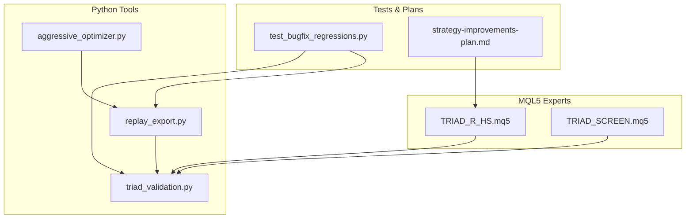
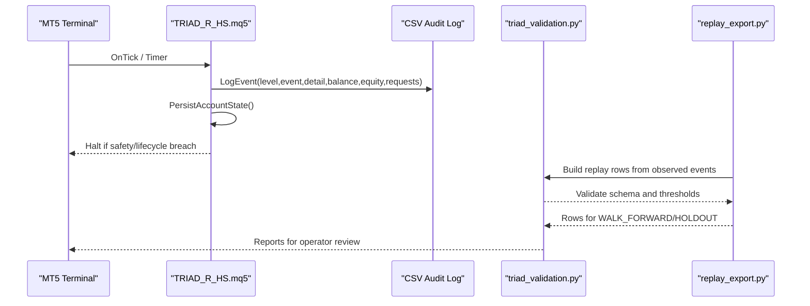
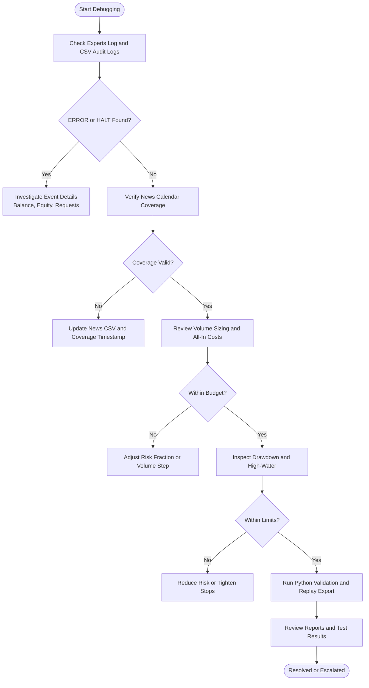
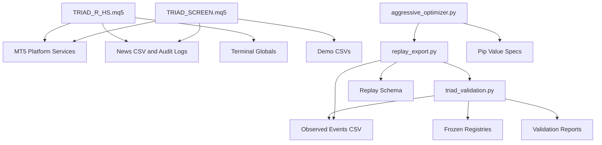

# Debugging and Troubleshooting

<cite>
**Referenced Files in This Document**
- [TRIAD_R_HS.mq5](file://MQL5/Experts/TRIAD_R_HS/TRIAD_R_HS.mq5)
- [TRIAD_SCREEN.mq5](file://MQL5/Experts/TRIAD_SCREEN/TRIAD_SCREEN.mq5)
- [triad_validation.py](file://tools/triad_validation.py)
- [replay_export.py](file://tools/replay_export.py)
- [aggressive_optimizer.py](file://tools/aggressive_optimizer.py)
- [test_bugfix_regressions.py](file://tests/test_bugfix_regressions.py)
- [strategy-improvements-plan.md](file://strategy-improvements-plan.md)
- [README.md (TRIAD_R_HS)](file://MQL5/Experts/TRIAD_R_HS/README.md)
- [README.md (TRIAD_SCREEN)](file://MQL5/Experts/TRIAD_SCREEN/README.md)
</cite>

## Table of Contents
1. [Introduction](#introduction)
2. [Project Structure](#project-structure)
3. [Core Components](#core-components)
4. [Architecture Overview](#architecture-overview)
5. [Detailed Component Analysis](#detailed-component-analysis)
6. [Dependency Analysis](#dependency-analysis)
7. [Performance Considerations](#performance-considerations)
8. [Troubleshooting Guide](#troubleshooting-guide)
9. [Conclusion](#conclusion)
10. [Appendices](#appendices)

## Introduction
This document provides a practical, code-grounded debugging and troubleshooting guide for the TRIAD-R system across both MQL5 Expert Advisors and Python research tools. It focuses on:
- Interpreting error messages and logs from live or demo runs
- Diagnosing performance issues and strategy logic problems
- Understanding and reproducing recent bugs found during development
- Applying logging strategies and monitoring approaches for production environments

The guidance is derived directly from the repository’s MQL5 EAs and Python tooling, with explicit references to source locations so you can trace any issue back to implementation details.

## Project Structure
At a high level, the system comprises:
- Two MQL5 Expert Advisors:
  - TRIAD_R_HS.mq5: canonical research EA with fail-closed safety, instance locks, journaling, and lifecycle controls
  - TRIAD_SCREEN.mq5: demo screening EA with an on-chart dashboard and simplified persistence
- Python research and validation tooling:
  - triad_validation.py: offline champion selection and challenge replay evaluation
  - replay_export.py: export pipeline that validates observed events and expands rows per configuration
  - aggressive_optimizer.py: parameter search utilities including pip value assumptions and lot sizing helpers
- Tests and plans:
  - test_bugfix_regressions.py: regression tests encoding specific defects and their fixes
  - strategy-improvements-plan.md: documented improvements and expected outcomes

**Diagram sources**
- [TRIAD_R_HS.mq5:1-150](file://MQL5/Experts/TRIAD_R_HS/TRIAD_R_HS.mq5#L1-L150)
- [TRIAD_SCREEN.mq5:1-150](file://MQL5/Experts/TRIAD_SCREEN/TRIAD_SCREEN.mq5#L1-L150)
- [triad_validation.py:1-60](file://tools/triad_validation.py#L1-L60)
- [replay_export.py:707-759](file://tools/replay_export.py#L707-L759)
- [aggressive_optimizer.py:57-78](file://tools/aggressive_optimizer.py#L57-L78)
- [test_bugfix_regressions.py:1-60](file://tests/test_bugfix_regressions.py#L1-L60)
- [strategy-improvements-plan.md:295-332](file://strategy-improvements-plan.md#L295-L332)

**Section sources**
- [TRIAD_R_HS.mq5:1-150](file://MQL5/Experts/TRIAD_R_HS/TRIAD_R_HS.mq5#L1-L150)
- [TRIAD_SCREEN.mq5:1-150](file://MQL5/Experts/TRIAD_SCREEN/TRIAD_SCREEN.mq5#L1-L150)
- [triad_validation.py:1-60](file://tools/triad_validation.py#L1-L60)
- [replay_export.py:707-759](file://tools/replay_export.py#L707-L759)
- [aggressive_optimizer.py:57-78](file://tools/aggressive_optimizer.py#L57-L78)
- [test_bugfix_regressions.py:1-60](file://tests/test_bugfix_regressions.py#L1-L60)
- [strategy-improvements-plan.md:295-332](file://strategy-improvements-plan.md#L295-L332)

## Core Components
- Logging and event reporting:
  - MQL5 EAs implement structured logging via LogEvent, writing CSV audit logs and printing to Experts log when verbose or critical levels are used
  - Screen EA includes similar logging tailored for demo runs and dashboard output
- State persistence and safety:
  - Canonical EA persists configuration hashes, account identity, halt latches, daily/weekly state, and request counts using terminal globals and CSV logs
  - Screen EA uses small CSVs for state and summaries, suitable for demo exploration
- Strategy logic and risk controls:
  - Both EAs implement session bounds, news blackout handling, drawdown tiers, internal stops, and exposure reconciliation
  - Python tools validate and simulate challenge rules, fill policies, and statistical gates

Key areas to focus on during debugging:
- Event logs and CSV audit trails for errors, halts, and warnings
- News calendar validity and coverage checks
- Volume sizing and all-in cost constraints
- Drawdown calculations and high-water updates
- Instance locks and multi-instance conflicts

**Section sources**
- [TRIAD_R_HS.mq5:299-332](file://MQL5/Experts/TRIAD_R_HS/TRIAD_R_HS.mq5#L299-L332)
- [TRIAD_SCREEN.mq5:329-354](file://MQL5/Experts/TRIAD_SCREEN/TRIAD_SCREEN.mq5#L329-L354)
- [TRIAD_R_HS.mq5:568-617](file://MQL5/Experts/TRIAD_R_HS/TRIAD_R_HS.mq5#L568-L617)
- [TRIAD_SCREEN.mq5:456-545](file://MQL5/Experts/TRIAD_SCREEN/TRIAD_SCREEN.mq5#L456-L545)
- [triad_validation.py:162-181](file://tools/triad_validation.py#L162-L181)

## Architecture Overview
The debugging architecture centers around structured logging, persisted state, and validation pipelines:

**Diagram sources**
- [TRIAD_R_HS.mq5:299-332](file://MQL5/Experts/TRIAD_R_HS/TRIAD_R_HS.mq5#L299-L332)
- [TRIAD_R_HS.mq5:568-617](file://MQL5/Experts/TRIAD_R_HS/TRIAD_R_HS.mq5#L568-L617)
- [triad_validation.py:1-60](file://tools/triad_validation.py#L1-L60)
- [replay_export.py:707-759](file://tools/replay_export.py#L707-L759)

## Detailed Component Analysis

### MQL5 Logging and Error Handling
- LogEvent writes structured entries to a CSV file and prints to Experts log based on verbosity and severity
- Critical events include:
  - AUDIT_LOG_OPEN_FAILED/AUDIT_LOG_WRITE_FAILED when file operations fail
  - INSTANCE_LOCK_* events for duplicate instances or race conditions
  - STATE_PERSIST_FAILED when global variable writes fail
  - NEWS_* events for calendar loading and coverage issues
  - HALT events when strategy halts due to safety or lifecycle breaches

Debugging steps:
- Check Experts log for ERROR and HALT lines
- Inspect CSV audit logs for balance/equity/request context at time of events
- Verify file permissions and paths for log files
- Confirm news CSV format and coverage timestamp

**Section sources**
- [TRIAD_R_HS.mq5:299-332](file://MQL5/Experts/TRIAD_R_HS/TRIAD_R_HS.mq5#L299-L332)
- [TRIAD_R_HS.mq5:503-530](file://MQL5/Experts/TRIAD_R_HS/TRIAD_R_HS.mq5#L503-L530)
- [TRIAD_R_HS.mq5:599-617](file://MQL5/Experts/TRIAD_R_HS/TRIAD_R_HS.mq5#L599-L617)
- [TRIAD_R_HS.mq5:844-915](file://MQL5/Experts/TRIAD_R_HS/TRIAD_R_HS.mq5#L844-L915)

### State Persistence and Lifecycle Controls
- The canonical EA persists configuration hash, runtime identity, halt latches, daily/weekly state, request counts, and external cashflow baselines
- A commit signature ensures partial or inconsistent state is rejected on restart
- One-time authorization inputs allow fresh phase initialization or halt reset under controlled conditions

Debugging steps:
- Review persisted state files and terminal globals for mismatches
- Use one-time authorization flags only after verifying account state and logs
- Investigate migration latches when external cashflows or unauthorized history are detected

**Section sources**
- [TRIAD_R_HS.mq5:568-617](file://MQL5/Experts/TRIAD_R_HS/TRIAD_R_HS.mq5#L568-L617)
- [TRIAD_R_HS.mq5:449-492](file://MQL5/Experts/TRIAD_R_HS/TRIAD_R_HS.mq5#L449-L492)
- [TRIAD_R_HS.mq5:273-281](file://MQL5/Experts/TRIAD_R_HS/TRIAD_R_HS.mq5#L273-L281)

### Session Bounds, News Blackout, and Time Handling
- Session bounds are computed using civil time conversions and DST-aware offsets
- News blackout prevents entries around high-impact events; insufficient coverage halts trading
- Mid-session attach behavior avoids reconstructing stale events

Debugging steps:
- Verify server offset settings and DST transitions
- Ensure news CSV has valid UTC timestamps and coverage through required hours
- Check for RANGE_UNAVAILABLE or NEWS_* events in logs

**Section sources**
- [TRIAD_R_HS.mq5:624-779](file://MQL5/Experts/TRIAD_R_HS/TRIAD_R_HS.mq5#L624-L779)
- [TRIAD_R_HS.mq5:791-915](file://MQL5/Experts/TRIAD_R_HS/TRIAD_R_HS.mq5#L791-L915)
- [TRIAD_SCREEN.mq5:717-780](file://MQL5/Experts/TRIAD_SCREEN/TRIAD_SCREEN.mq5#L717-L780)

### Volume Sizing and All-In Cost Constraints
- Volume is sized so all-in loss (stop + slippage + commission) fits the risk budget
- Lattice rounding respects broker volume step and minimums
- Python tools mirror this logic for replay exports and validation

Debugging steps:
- Compare EA volume calculations with Python tool outputs
- Check for activation_ok=false when minimum volume exceeds budget
- Validate pip values and per-lot costs in optimizer specs

**Section sources**
- [TRIAD_R_HS.mq5:2236-2257](file://MQL5/Experts/TRIAD_R_HS/TRIAD_R_HS.mq5#L2236-L2257)
- [replay_export.py:729-759](file://tools/replay_export.py#L729-L759)
- [aggressive_optimizer.py:213-220](file://tools/aggressive_optimizer.py#L213-L220)
- [test_bugfix_regressions.py:373-405](file://tests/test_bugfix_regressions.py#L373-L405)

### Drawdown Calculation and High-Water Updates
- Drawdown is computed relative to high-water balance, updated while flat to avoid distortion
- Internal stops and shutdown thresholds trigger halts or reduced risk
- Python simulations enforce drawdown gates and track max drawdown

Debugging steps:
- Monitor high-water updates and equity snapshots
- Check for strategy_drawdown_shutdown events in validation reports
- Verify daily/weekly stop logic against account equity curves

**Section sources**
- [triad_validation.py:1019-1061](file://tools/triad_validation.py#L1019-L1061)
- [triad_validation.py:1297-1329](file://tools/triad_validation.py#L1297-L1329)
- [TRIAD_SCREEN.mq5:3478-3489](file://MQL5/Experts/TRIAD_SCREEN/TRIAD_SCREEN.mq5#L3478-L3489)

### Recent Bug Fixes and Resolution Processes
- Breakeven cap consistency: net_r and net_cash must agree when breakeven moves stop to entry
  - Fixed by pricing effective fill at entry and ensuring net cash reflects capped exit
  - Verified via regression tests asserting negative net cash for capped exits
- All-in risk ceiling: volume sizing now includes slippage and commission to stay within budget
  - Old pure-risk sizing could exceed budget; new lattice floor enforces compliance
  - Tests assert maximum inclusive multiple and skip minimum volumes that breach ceiling
- Stats insufficient logging level: STATS_INSUFFICIENT upgraded from WARN to ERROR
  - Ensures operators see blocking conditions immediately
  - Contract test verifies log event name and level

**Section sources**
- [test_bugfix_regressions.py:22-75](file://tests/test_bugfix_regressions.py#L22-L75)
- [test_bugfix_regressions.py:353-405](file://tests/test_bugfix_regressions.py#L353-L405)
- [strategy-improvements-plan.md:295-332](file://strategy-improvements-plan.md#L295-L332)

### Conceptual Overview

[No sources needed since this diagram shows conceptual workflow, not actual code structure]

## Dependency Analysis
The MQL5 EAs depend on:
- MetaTrader 5 platform services (time, account info, trade functions)
- File I/O for news CSV and audit logs
- Terminal globals for state persistence and instance locks

Python tools depend on:
- Standard library modules for CSV, JSON, math, statistics
- Frozen registries and schemas for validation
- Observed event CSVs from upstream replay pipelines

**Diagram sources**
- [TRIAD_R_HS.mq5:1-150](file://MQL5/Experts/TRIAD_R_HS/TRIAD_R_HS.mq5#L1-L150)
- [TRIAD_SCREEN.mq5:1-150](file://MQL5/Experts/TRIAD_SCREEN/TRIAD_SCREEN.mq5#L1-L150)
- [triad_validation.py:1-60](file://tools/triad_validation.py#L1-L60)
- [replay_export.py:707-759](file://tools/replay_export.py#L707-L759)
- [aggressive_optimizer.py:57-78](file://tools/aggressive_optimizer.py#L57-L78)

**Section sources**
- [TRIAD_R_HS.mq5:1-150](file://MQL5/Experts/TRIAD_R_HS/TRIAD_R_HS.mq5#L1-L150)
- [TRIAD_SCREEN.mq5:1-150](file://MQL5/Experts/TRIAD_SCREEN/TRIAD_SCREEN.mq5#L1-L150)
- [triad_validation.py:1-60](file://tools/triad_validation.py#L1-L60)
- [replay_export.py:707-759](file://tools/replay_export.py#L707-L759)
- [aggressive_optimizer.py:57-78](file://tools/aggressive_optimizer.py#L57-L78)

## Performance Considerations
- Logging frequency:
  - Verbose logging can impact performance; use ERROR/HALT levels in production
  - CSV append operations should be monitored for disk I/O bottlenecks
- Request throttling:
  - Non-emergency request caps prevent excessive API calls
  - Emergency cleanup bypasses caps but is per-ticket throttled
- Data processing:
  - Python validation tools process large CSVs efficiently using standard libraries
  - Replay exports expand rows per configuration; ensure sufficient memory and CPU for batch runs

[No sources needed since this section provides general guidance]

## Troubleshooting Guide

### Common MQL5 Issues
- News calendar failures:
  - Symptoms: NEWS_FILE_OPEN, NEWS_ROW_INVALID, NEWS_COVERAGE_INSUFFICIENT
  - Resolution: Verify CSV format, UTC timestamps, and coverage through required hours
- Instance lock conflicts:
  - Symptoms: DUPLICATE_LIVE_INSTANCE, INSTANCE_LOCK_STORAGE_FAILED
  - Resolution: Ensure single live instance per account; check terminal globals for owner/beat
- State persistence failures:
  - Symptoms: STATE_PERSIST_FAILED, REBASELINE_FLAG_PERSIST_FAILED
  - Resolution: Check terminal global write permissions; investigate migration latches
- Drawdown shutdowns:
  - Symptoms: strategy_drawdown_shutdown in validation reports
  - Resolution: Reduce risk fraction or tighten stops; verify high-water updates

**Section sources**
- [TRIAD_R_HS.mq5:844-915](file://MQL5/Experts/TRIAD_R_HS/TRIAD_R_HS.mq5#L844-L915)
- [TRIAD_R_HS.mq5:503-530](file://MQL5/Experts/TRIAD_R_HS/TRIAD_R_HS.mq5#L503-L530)
- [TRIAD_R_HS.mq5:599-617](file://MQL5/Experts/TRIAD_R_HS/TRIAD_R_HS.mq5#L599-L617)
- [triad_validation.py:1019-1061](file://tools/triad_validation.py#L1019-L1061)

### Common Python Tool Issues
- Replay export schema mismatches:
  - Symptoms: ValidationError during load_observed_events
  - Resolution: Ensure CSV fields match EVENT_FIELDS; validate types and ranges
- Fill policy violations:
  - Symptoms: No fills despite activation_ok=true
  - Resolution: Check minimum trade_through_ticks and fill_fraction requirements
- Drawdown simulation failures:
  - Symptoms: strategy_drawdown_shutdown in reports
  - Resolution: Adjust risk parameters; verify initial balance and thresholds

**Section sources**
- [test_bugfix_regressions.py:229-256](file://tests/test_bugfix_regressions.py#L229-L256)
- [triad_validation.py:112-128](file://tools/triad_validation.py#L112-L128)
- [triad_validation.py:1019-1061](file://tools/triad_validation.py#L1019-L1061)

### Production Monitoring Strategies
- Enable structured logging with ERROR/HALT levels in production
- Monitor CSV audit logs for balance/equity/request trends
- Set up alerts for HALT events and news coverage staleness
- Use Python validation reports to detect drawdown and inactivity issues early

**Section sources**
- [TRIAD_R_HS.mq5:299-332](file://MQL5/Experts/TRIAD_R_HS/TRIAD_R_HS.mq5#L299-L332)
- [TRIAD_SCREEN.mq5:329-354](file://MQL5/Experts/TRIAD_SCREEN/TRIAD_SCREEN.mq5#L329-L354)
- [triad_validation.py:162-181](file://tools/triad_validation.py#L162-L181)

## Conclusion
The TRIAD-R system provides robust debugging and troubleshooting capabilities through structured logging, persisted state, and comprehensive validation tooling. By focusing on error messages, log analysis, and recent bug fixes, operators can quickly identify and resolve issues in both MQL5 and Python components. Adhering to the recommended logging strategies and monitoring approaches ensures reliable operation in production environments.

[No sources needed since this section summarizes without analyzing specific files]

## Appendices

### Quick Reference: Key Log Events
- AUDIT_LOG_OPEN_FAILED: File open error for audit log
- AUDIT_LOG_WRITE_FAILED: File write error for audit log
- DUPLICATE_LIVE_INSTANCE: Multiple live instances detected
- INSTANCE_LOCK_STORAGE_FAILED: Cannot create owner/heartbeat variables
- NEWS_FILE_OPEN: Cannot open news CSV
- NEWS_ROW_INVALID: Malformed news row
- NEWS_COVERAGE_INSUFFICIENT: Required coverage not met
- STATE_PERSIST_FAILED: Global variable write failed
- STRATEGY_HALTED: Strategy halted due to safety/lifecycle breach

**Section sources**
- [TRIAD_R_HS.mq5:299-332](file://MQL5/Experts/TRIAD_R_HS/TRIAD_R_HS.mq5#L299-L332)
- [TRIAD_R_HS.mq5:503-530](file://MQL5/Experts/TRIAD_R_HS/TRIAD_R_HS.mq5#L503-L530)
- [TRIAD_R_HS.mq5:844-915](file://MQL5/Experts/TRIAD_R_HS/TRIAD_R_HS.mq5#L844-L915)