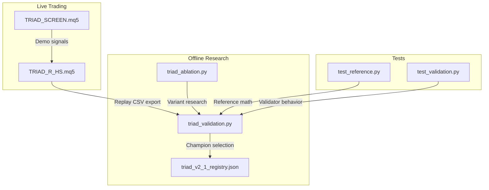
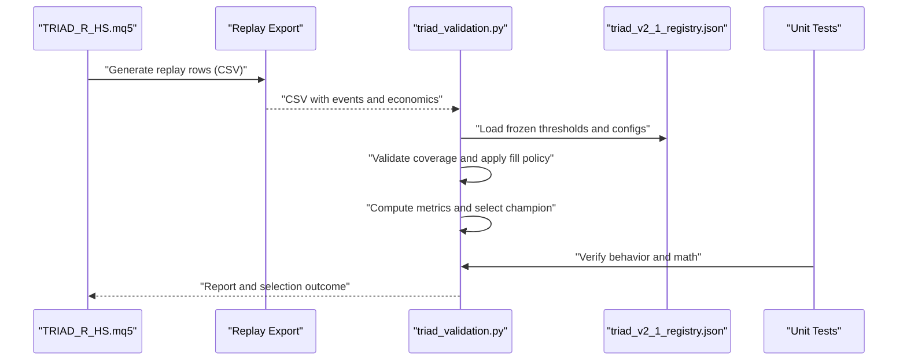
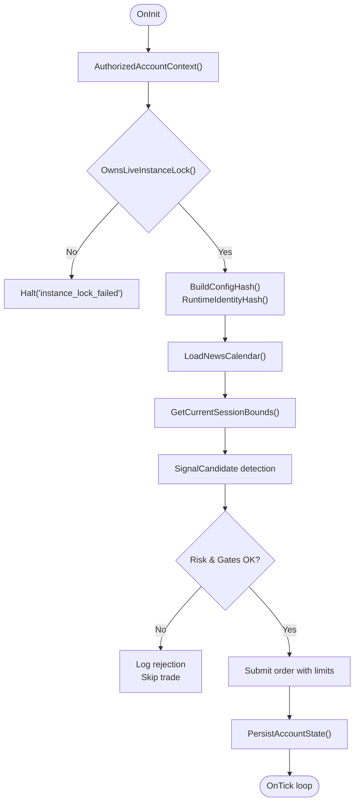
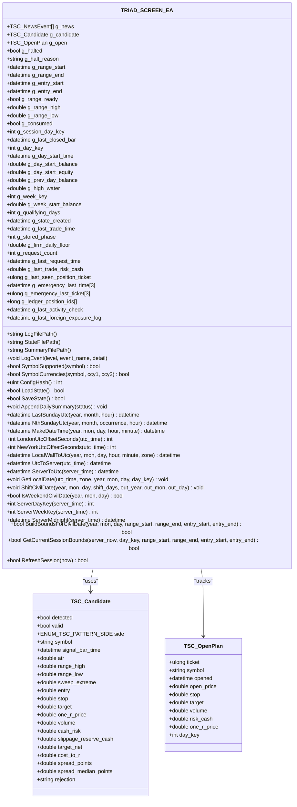
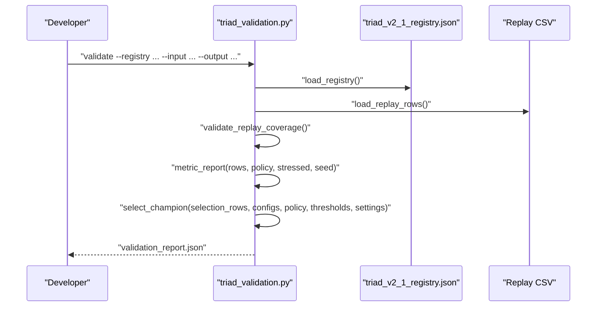
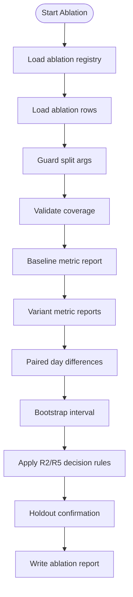
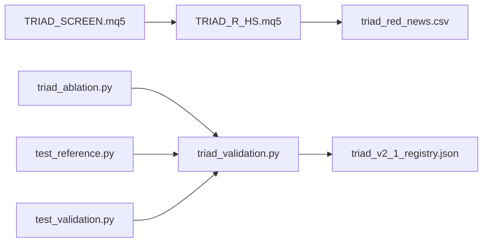

# Developer Guide

<cite>
**Referenced Files in This Document**
- [TRIAD_R_HS.mq5](file://MQL5/Experts/TRIAD_R_HS/TRIAD_R_HS.mq5)
- [TRIAD_SCREEN.mq5](file://MQL5/Experts/TRIAD_SCREEN/TRIAD_SCREEN.mq5)
- [triad_validation.py](file://tools/triad_validation.py)
- [triad_ablation.py](file://tools/triad_ablation.py)
- [test_reference.py](file://tests/test_reference.py)
- [test_validation.py](file://tests/test_validation.py)
- [triad_v2_1_registry.json](file://validation/triad_v2_1_registry.json)
- [THE5ERS-CHALLENGE-STRATEGY-V2.md](file://THE5ERS-CHALLENGE-STRATEGY-V2.md)
</cite>

## Table of Contents
1. [Introduction](#introduction)
2. [Project Structure](#project-structure)
3. [Core Components](#core-components)
4. [Architecture Overview](#architecture-overview)
5. [Detailed Component Analysis](#detailed-component-analysis)
6. [Dependency Analysis](#dependency-analysis)
7. [Performance Considerations](#performance-considerations)
8. [Troubleshooting Guide](#troubleshooting-guide)
9. [Conclusion](#conclusion)
10. [Appendices](#appendices)

## Introduction
This guide explains how to develop, test, and extend the TRIAD-R system safely and consistently. It covers:
- Development environment setup for MQL5 Experts and Python tooling
- Contributing workflow and code review expectations
- Testing procedures using unit tests and validation tools
- Coding standards and architectural principles
- Extending functionality with ablations and new features
- Debugging techniques, performance profiling, and troubleshooting

The system is composed of:
- A production-grade MQL5 Expert Advisor (EA) implementing a research strategy with fail-closed safety
- A separate demo screening EA for on-chart exploration
- Python-based offline validation, champion selection, and ablation research tools
- A frozen configuration registry that locks evaluation rules and thresholds

## Project Structure
At a high level:
- MQL5 Experts implement live trading logic and screeners
- tools/ contains offline replay, validation, and ablation pipelines
- tests/ contains unit tests for reference math and validation logic
- validation/ stores the frozen registry used by the validator
- Documentation files define strategy rules and challenge constraints



**Diagram sources**
- [TRIAD_R_HS.mq5:1-120](file://MQL5/Experts/TRIAD_R_HS/TRIAD_R_HS.mq5#L1-L120)
- [TRIAD_SCREEN.mq5:1-160](file://MQL5/Experts/TRIAD_SCREEN/TRIAD_SCREEN.mq5#L1-L160)
- [triad_validation.py:1-120](file://tools/triad_validation.py#L1-L120)
- [triad_ablation.py:1-120](file://tools/triad_ablation.py#L1-L120)
- [triad_v2_1_registry.json:1-120](file://validation/triad_v2_1_registry.json#L1-L120)
- [test_reference.py:1-60](file://tests/test_reference.py#L1-L60)
- [test_validation.py:1-60](file://tests/test_validation.py#L1-L60)

**Section sources**
- [TRIAD_R_HS.mq5:1-120](file://MQL5/Experts/TRIAD_R_HS/TRIAD_R_HS.mq5#L1-L120)
- [TRIAD_SCREEN.mq5:1-160](file://MQL5/Experts/TRIAD_SCREEN/TRIAD_SCREEN.mq5#L1-L160)
- [triad_validation.py:1-120](file://tools/triad_validation.py#L1-L120)
- [triad_ablation.py:1-120](file://tools/triad_ablation.py#L1-L120)
- [triad_v2_1_registry.json:1-120](file://validation/triad_v2_1_registry.json#L1-L120)
- [test_reference.py:1-60](file://tests/test_reference.py#L1-L60)
- [test_validation.py:1-60](file://tests/test_validation.py#L1-L60)

## Core Components
- Production EA (TRIAD_R_HS.mq5): Implements V2.1 strategy with strict safety gates, session bounds, news blackout handling, instance locking, state persistence, and audit logging.
- Screening EA (TRIAD_SCREEN.mq5): Demo-only tool mirroring core signal logic without lifecycle locks; provides an on-chart dashboard and per-combo state files.
- Validation pipeline (triad_validation.py): Loads replay CSVs, validates coverage, applies fill policies, computes metrics, selects champions under frozen thresholds, and simulates phase outcomes.
- Ablation pipeline (triad_ablation.py): Pre-registered research round testing entry variants against baseline with preregistered decision rules and bootstrap inference.
- Tests: Reference math tests and validator behavior tests ensure correctness of risk math, persistence integrity, and selection logic.
- Registry (triad_v2_1_registry.json): Frozen 160-config matrix and thresholds used by the validator to prevent post-hoc changes.

Key responsibilities:
- Live execution safety and compliance with challenge rules
- Offline evidence generation and verification
- Reproducible selection and holdout evaluation
- Transparent auditing via logs and registries

**Section sources**
- [TRIAD_R_HS.mq5:1-220](file://MQL5/Experts/TRIAD_R_HS/TRIAD_R_HS.mq5#L1-L220)
- [TRIAD_SCREEN.mq5:1-240](file://MQL5/Experts/TRIAD_SCREEN/TRIAD_SCREEN.mq5#L1-L240)
- [triad_validation.py:1-180](file://tools/triad_validation.py#L1-L180)
- [triad_ablation.py:1-160](file://tools/triad_ablation.py#L1-L160)
- [test_reference.py:1-160](file://tests/test_reference.py#L1-L160)
- [test_validation.py:1-120](file://tests/test_validation.py#L1-L120)
- [triad_v2_1_registry.json:1-120](file://validation/triad_v2_1_registry.json#L1-L120)

## Architecture Overview
The architecture separates live execution from offline validation to maintain reproducibility and safety:
- The EA runs live with fail-closed safeguards and detailed audit logs
- Replay exports produce event-level CSVs consumed by the validator
- The validator enforces a frozen registry and selection rules
- Ablation research evaluates variant hypotheses independently



**Diagram sources**
- [triad_validation.py:1-120](file://tools/triad_validation.py#L1-L120)
- [triad_v2_1_registry.json:1-120](file://validation/triad_v2_1_registry.json#L1-L120)
- [test_validation.py:1-120](file://tests/test_validation.py#L1-L120)

**Section sources**
- [triad_validation.py:1-180](file://tools/triad_validation.py#L1-L180)
- [triad_v2_1_registry.json:1-120](file://validation/triad_v2_1_registry.json#L1-L120)
- [test_validation.py:1-120](file://tests/test_validation.py#L1-L120)

## Detailed Component Analysis

### Production EA: TRIAD_R_HS.mq5
Responsibilities:
- Session management for London and New York windows
- News calendar integration and blackout enforcement
- Signal detection and candidate structuring
- Risk sizing, stops, targets, and time stops
- Instance locking, halt latches, and state persistence
- Audit logging and request throttling

Safety mechanisms:
- Fail-closed design with explicit user approval flags
- Account identity checks and server offset validation
- Global variable journaling with signature verification
- Emergency safety throttles and cancellation routines



**Diagram sources**
- [TRIAD_R_HS.mq5:268-330](file://MQL5/Experts/TRIAD_R_HS/TRIAD_R_HS.mq5#L268-L330)
- [TRIAD_R_HS.mq5:494-566](file://MQL5/Experts/TRIAD_R_HS/TRIAD_R_HS.mq5#L494-L566)
- [TRIAD_R_HS.mq5:568-617](file://MQL5/Experts/TRIAD_R_HS/TRIAD_R_HS.mq5#L568-L617)

**Section sources**
- [TRIAD_R_HS.mq5:1-220](file://MQL5/Experts/TRIAD_R_HS/TRIAD_R_HS.mq5#L1-L220)
- [TRIAD_R_HS.mq5:268-330](file://MQL5/Experts/TRIAD_R_HS/TRIAD_R_HS.mq5#L268-L330)
- [TRIAD_R_HS.mq5:494-566](file://MQL5/Experts/TRIAD_R_HS/TRIAD_R_HS.mq5#L494-L566)
- [TRIAD_R_HS.mq5:568-617](file://MQL5/Experts/TRIAD_R_HS/TRIAD_R_HS.mq5#L568-L617)

### Screening EA: TRIAD_SCREEN.mq5
Purpose:
- Demo-only multi-symbol screener with on-chart dashboard
- Mirrors canonical V2.1 signal logic without lifecycle locks
- Tracks daily summaries and state per combo/account

Key behaviors:
- Session bounds and range computation
- Candidate detection and open plan tracking
- State persistence via CSV files
- Dashboard status reporting



**Diagram sources**
- [TRIAD_SCREEN.mq5:160-240](file://MQL5/Experts/TRIAD_SCREEN/TRIAD_SCREEN.mq5#L160-L240)
- [TRIAD_SCREEN.mq5:291-354](file://MQL5/Experts/TRIAD_SCREEN/TRIAD_SCREEN.mq5#L291-L354)
- [TRIAD_SCREEN.mq5:371-451](file://MQL5/Experts/TRIAD_SCREEN/TRIAD_SCREEN.mq5#L371-L451)
- [TRIAD_SCREEN.mq5:456-545](file://MQL5/Experts/TRIAD_SCREEN/TRIAD_SCREEN.mq5#L456-L545)
- [TRIAD_SCREEN.mq5:583-749](file://MQL5/Experts/TRIAD_SCREEN/TRIAD_SCREEN.mq5#L583-L749)

**Section sources**
- [TRIAD_SCREEN.mq5:1-240](file://MQL5/Experts/TRIAD_SCREEN/TRIAD_SCREEN.mq5#L1-L240)
- [TRIAD_SCREEN.mq5:291-354](file://MQL5/Experts/TRIAD_SCREEN/TRIAD_SCREEN.mq5#L291-L354)
- [TRIAD_SCREEN.mq5:371-451](file://MQL5/Experts/TRIAD_SCREEN/TRIAD_SCREEN.mq5#L371-L451)
- [TRIAD_SCREEN.mq5:456-545](file://MQL5/Experts/TRIAD_SCREEN/TRIAD_SCREEN.mq5#L456-L545)
- [TRIAD_SCREEN.mq5:583-749](file://MQL5/Experts/TRIAD_SCREEN/TRIAD_SCREEN.mq5#L583-L749)

### Validation Pipeline: triad_validation.py
Responsibilities:
- Load and validate replay CSV schema and coverage
- Apply frozen fill policy and compute metrics
- Select champion based on walk-forward data only
- Simulate phase outcomes and drawdown constraints
- Enforce registry integrity via SHA-256 hash

Workflow:


**Diagram sources**
- [triad_validation.py:1-120](file://tools/triad_validation.py#L1-L120)
- [triad_validation.py:278-331](file://tools/triad_validation.py#L278-L331)
- [triad_validation.py:360-437](file://tools/triad_validation.py#L360-L437)
- [triad_validation.py:646-708](file://tools/triad_validation.py#L646-L708)

**Section sources**
- [triad_validation.py:1-180](file://tools/triad_validation.py#L1-L180)
- [triad_validation.py:278-331](file://tools/triad_validation.py#L278-L331)
- [triad_validation.py:360-437](file://tools/triad_validation.py#L360-L437)
- [triad_validation.py:646-708](file://tools/triad_validation.py#L646-L708)

### Ablation Pipeline: triad_ablation.py
Purpose:
- Pre-registered research round testing entry variants
- Fixed controls and decision rules locked in registry
- Paired day-level bootstrap inference with familywise adjustment

Key elements:
- Baseline vs variants comparison
- R1/R2/R3/R4/R5 decision rules
- Bootstrap intervals and simplicity tie-breaking



**Diagram sources**
- [triad_ablation.py:1-120](file://tools/triad_ablation.py#L1-L120)
- [triad_ablation.py:275-368](file://tools/triad_ablation.py#L275-L368)
- [triad_ablation.py:470-560](file://tools/triad_ablation.py#L470-L560)
- [triad_ablation.py:629-674](file://tools/triad_ablation.py#L629-L674)

**Section sources**
- [triad_ablation.py:1-160](file://tools/triad_ablation.py#L1-L160)
- [triad_ablation.py:275-368](file://tools/triad_ablation.py#L275-L368)
- [triad_ablation.py:470-560](file://tools/triad_ablation.py#L470-L560)
- [triad_ablation.py:629-674](file://tools/triad_ablation.py#L629-L674)

### Tests: Reference Math and Validator Behavior
Coverage:
- Profile math, drawdown tiers, and volume rounding
- Persistence integrity and halt latch signatures
- Daily state transitions and phase locking
- Civil time conversions and session bounds
- Registry integrity and selection behavior

Execution:
```bash
python -m pytest tests/test_reference.py -v
python -m pytest tests/test_validation.py -v
```

**Section sources**
- [test_reference.py:1-160](file://tests/test_reference.py#L1-L160)
- [test_validation.py:1-120](file://tests/test_validation.py#L1-L120)

## Dependency Analysis
Component relationships:
- EAs depend on MQL5 standard library and external news CSV
- Validator depends on Python standard library and JSON/CSV modules
- Tests depend on both reference math and validator modules
- Registry is immutable and enforced by validators



**Diagram sources**
- [triad_validation.py:1-120](file://tools/triad_validation.py#L1-L120)
- [triad_v2_1_registry.json:1-120](file://validation/triad_v2_1_registry.json#L1-L120)
- [triad_ablation.py:1-120](file://tools/triad_ablation.py#L1-L120)
- [test_reference.py:1-60](file://tests/test_reference.py#L1-L60)
- [test_validation.py:1-60](file://tests/test_validation.py#L1-L60)

**Section sources**
- [triad_validation.py:1-120](file://tools/triad_validation.py#L1-L120)
- [triad_v2_1_registry.json:1-120](file://validation/triad_v2_1_registry.json#L1-L120)
- [triad_ablation.py:1-120](file://tools/triad_ablation.py#L1-L120)
- [test_reference.py:1-60](file://tests/test_reference.py#L1-L60)
- [test_validation.py:1-60](file://tests/test_validation.py#L1-L60)

## Performance Considerations
- EA request throttling and latency limits prevent overloading brokers
- News calendar loading and session bounds computation are optimized per tick
- Validator uses efficient dataclasses and streaming CSV processing
- Bootstrap sampling parameters balance accuracy and runtime
- Logging should be tuned to avoid excessive I/O during backtesting

Recommendations:
- Use tester mode for rapid iteration without live risks
- Monitor log files for performance bottlenecks
- Validate CSV completeness before running full pipelines
- Tune bootstrap samples based on available compute resources

## Troubleshooting Guide
Common issues and resolutions:
- Instance lock conflicts: Ensure single live instance per account
- News calendar missing or stale: Verify file path and coverage hours
- Registry mismatch: Re-register if thresholds or configs change
- Replay CSV schema errors: Run schema command to verify fields
- State persistence failures: Check global variables and file permissions

Debugging steps:
- Enable verbose logging in EA inputs
- Review audit logs for error patterns
- Validate CSV headers and coverage requirements
- Run unit tests to isolate logic issues
- Check registry hashes for unintended mutations

**Section sources**
- [TRIAD_R_HS.mq5:299-327](file://MQL5/Experts/TRIAD_R_HS/TRIAD_R_HS.mq5#L299-L327)
- [TRIAD_SCREEN.mq5:329-354](file://MQL5/Experts/TRIAD_SCREEN/TRIAD_SCREEN.mq5#L329-L354)
- [triad_validation.py:360-437](file://tools/triad_validation.py#L360-L437)
- [triad_ablation.py:422-463](file://tools/triad_ablation.py#L422-L463)

## Conclusion
The TRIAD-R system provides a robust framework for developing, validating, and extending trading strategies with strong safety guarantees and reproducible research practices. By following the development workflow, coding standards, and testing procedures outlined in this guide, developers can confidently contribute to the project while maintaining code quality and reliability.

Key principles:
- Fail-closed design prevents unintended live actions
- Frozen registries ensure reproducibility
- Comprehensive testing validates both math and behavior
- Clear separation between live execution and offline research

## Appendices

### Development Environment Setup
Prerequisites:
- MetaTrader 5 terminal with MQL5 compiler
- Python 3.8+ with standard libraries
- Git for version control

Setup steps:
1. Install MetaTrader 5 and configure broker connection
2. Set up Python environment and install dependencies
3. Clone repository and verify test suite passes
4. Configure news CSV file paths and permissions

### Contributing Guidelines
Workflow:
1. Create feature branch from main
2. Implement changes with comprehensive tests
3. Update documentation as needed
4. Submit pull request with clear description
5. Address code review feedback
6. Merge after passing all checks

Code review checklist:
- Tests pass locally and in CI
- No breaking changes to frozen registries
- Logging and error handling improved
- Performance impact assessed
- Documentation updated

### Testing Procedures
Unit tests:
- Run reference math tests for profile calculations
- Run validator tests for selection behavior
- Verify registry integrity and schema compliance

Integration tests:
- Generate replay CSVs from historical data
- Run validation pipeline with frozen registry
- Execute ablation research with preregistered rules

### Coding Standards
MQL5:
- Follow existing naming conventions and structure
- Use structured logging for all significant events
- Implement proper error handling and recovery
- Maintain fail-closed safety mechanisms

Python:
- Use type hints and dataclasses where appropriate
- Write comprehensive unit tests for new logic
- Follow existing module organization patterns
- Document functions and classes with docstrings

### Extending Functionality
Adding new features:
1. Identify component requiring modification
2. Implement changes with backward compatibility
3. Add tests covering new behavior
4. Update documentation and examples
5. Run full validation pipeline

Extending ablations:
1. Define new variant with single change
2. Register variant in ablation registry
3. Generate replay data for new variant
4. Evaluate against baseline with decision rules
5. Document findings and recommendations

### Best Practices
- Always test in tester mode before live deployment
- Maintain comprehensive audit logs
- Validate data integrity at each pipeline stage
- Use frozen registries to prevent post-hoc changes
- Document all configuration changes and rationale
- Monitor performance and resource usage
- Follow established patterns for consistency