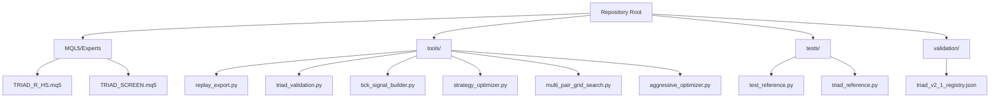
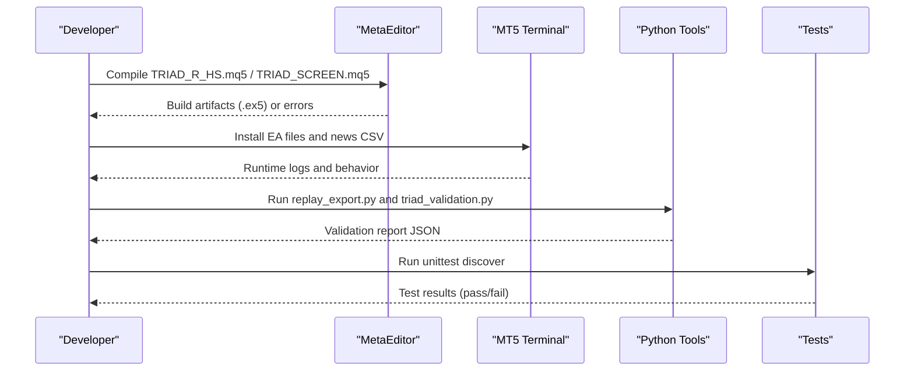
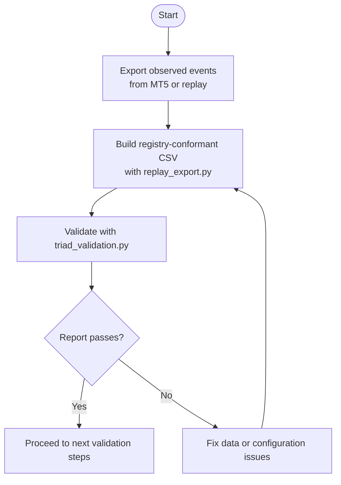
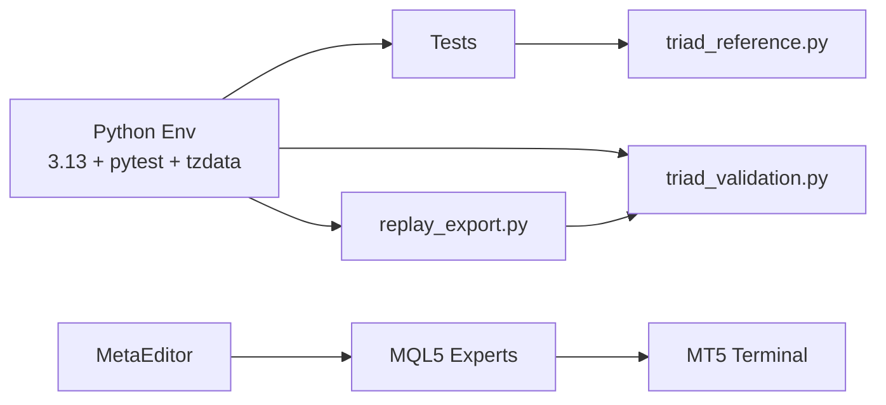

# Development Environment Setup

<cite>
**Referenced Files in This Document**
- [MQL5/Experts/TRIAD_R_HS/README.md](file://MQL5/Experts/TRIAD_R_HS/README.md)
- [MQL5/Experts/TRIAD_SCREEN/README.md](file://MQL5/Experts/TRIAD_SCREEN/README.md)
- [tests/test_reference.py](file://tests/test_reference.py)
- [tests/triad_reference.py](file://tests/triad_reference.py)
- [tools/replay_export.py](file://tools/replay_export.py)
- [tools/triad_validation.py](file://tools/triad_validation.py)
- [tools/tick_signal_builder.py](file://tools/tick_signal_builder.py)
- [tools/strategy_optimizer.py](file://tools/strategy_optimizer.py)
- [tools/multi_pair_grid_search.py](file://tools/multi_pair_grid_search.py)
- [tools/aggressive_optimizer.py](file://tools/aggressive_optimizer.py)
- [.gitignore](file://.gitignore)
</cite>

## Table of Contents
1. [Introduction](#introduction)
2. [Project Structure](#project-structure)
3. [Core Components](#core-components)
4. [Architecture Overview](#architecture-overview)
5. [Detailed Component Analysis](#detailed-component-analysis)
6. [Dependency Analysis](#dependency-analysis)
7. [Performance Considerations](#performance-considerations)
8. [Troubleshooting Guide](#troubleshooting-guide)
9. [Conclusion](#conclusion)
10. [Appendices](#appendices)

## Introduction
This document provides a complete, step-by-step guide to setting up the development environment for the TRIAD-R system. It covers:
- Python environment requirements (Python 3.13 recommended; standard library modules used include zoneinfo and datetime)
- Required packages (pytest, tzdata)
- MetaEditor setup for MQL5 compilation
- Workspace configuration and verification steps
- Troubleshooting common setup issues

The goal is to ensure you can run tests, compile MQL5 Expert Advisors, and execute offline validation tools without environment-related blockers.

## Project Structure
The repository contains:
- MQL5 Expert Advisors and documentation under MQL5/Experts
- Python-based research, validation, and optimization tools under tools/
- Unit tests under tests/
- Validation registries and data under validation/
- Documentation and plans at the repository root

**Diagram sources**
- [MQL5/Experts/TRIAD_R_HS/README.md:1-247](file://MQL5/Experts/TRIAD_R_HS/README.md#L1-L247)
- [MQL5/Experts/TRIAD_SCREEN/README.md:1-159](file://MQL5/Experts/TRIAD_SCREEN/README.md#L1-L159)
- [tools/replay_export.py:1-200](file://tools/replay_export.py#L1-L200)
- [tools/triad_validation.py:1-200](file://tools/triad_validation.py#L1-L200)
- [tools/tick_signal_builder.py:108-147](file://tools/tick_signal_builder.py#L108-L147)
- [tools/strategy_optimizer.py:1-200](file://tools/strategy_optimizer.py#L1-L200)
- [tools/multi_pair_grid_search.py:86-124](file://tools/multi_pair_grid_search.py#L86-L124)
- [tools/aggressive_optimizer.py:85-116](file://tools/aggressive_optimizer.py#L85-L116)
- [tests/test_reference.py:1-161](file://tests/test_reference.py#L1-L161)
- [tests/triad_reference.py:1-167](file://tests/triad_reference.py#L1-L167)

**Section sources**
- [MQL5/Experts/TRIAD_R_HS/README.md:1-247](file://MQL5/Experts/TRIAD_R_HS/README.md#L1-L247)
- [MQL5/Experts/TRIAD_SCREEN/README.md:1-159](file://MQL5/Experts/TRIAD_SCREEN/README.md#L1-L159)

## Core Components
- MQL5 Expert Advisors:
  - TRIAD_R_HS: canonical strategy EA with strict safety controls and operational gates
  - TRIAD_SCREEN: demo screening tool with on-chart dashboard
- Python tools:
  - replay_export.py: converts observed events into registry-conformant CSVs consumed by the validator
  - triad_validation.py: validates replay outputs against frozen registries and thresholds
  - tick_signal_builder.py, strategy_optimizer.py, multi_pair_grid_search.py, aggressive_optimizer.py: research and optimization utilities
- Tests:
  - test_reference.py and triad_reference.py: unit tests and reference math for civil time, session bounds, volume rounding, and risk profiles

Key environment notes:
- Python 3.13 is recommended; the code uses standard library modules such as datetime, decimal, zoneinfo, csv, json, argparse, statistics, and unittest
- pytest and tzdata are required for running tests and timezone handling

**Section sources**
- [MQL5/Experts/TRIAD_R_HS/README.md:1-247](file://MQL5/Experts/TRIAD_R_HS/README.md#L1-L247)
- [MQL5/Experts/TRIAD_SCREEN/README.md:1-159](file://MQL5/Experts/TRIAD_SCREEN/README.md#L1-L159)
- [tools/replay_export.py:1-200](file://tools/replay_export.py#L1-L200)
- [tools/triad_validation.py:1-200](file://tools/triad_validation.py#L1-L200)
- [tests/test_reference.py:1-161](file://tests/test_reference.py#L1-L161)
- [tests/triad_reference.py:1-167](file://tests/triad_reference.py#L1-L167)

## Architecture Overview
The development workflow integrates MQL5 compilation and Python-based validation:

**Diagram sources**
- [MQL5/Experts/TRIAD_R_HS/README.md:15-24](file://MQL5/Experts/TRIAD_R_HS/README.md#L15-L24)
- [MQL5/Experts/TRIAD_SCREEN/README.md:59-80](file://MQL5/Experts/TRIAD_SCREEN/README.md#L59-L80)
- [tools/replay_export.py:105-121](file://tools/replay_export.py#L105-L121)
- [tools/triad_validation.py:13-30](file://tools/triad_validation.py#L13-L30)
- [tests/test_reference.py:159-161](file://tests/test_reference.py#L159-L161)

## Detailed Component Analysis

### Python Environment Setup
- Use Python 3.13 (recommended). The code relies on standard library modules including datetime, decimal, zoneinfo, csv, json, argparse, statistics, and unittest.
- Install required packages:
  - pytest: for running tests
  - tzdata: for timezone data used by zoneinfo
- Verify installation:
  - python --version should show 3.13.x
  - pip install pytest tzdata
  - python -m pytest --version confirms pytest availability
  - python -c "from zoneinfo import ZoneInfo; print('OK')" verifies timezone support

**Section sources**
- [tests/triad_reference.py:13](file://tests/triad_reference.py#L13)
- [tests/test_reference.py:1-161](file://tests/test_reference.py#L1-L161)
- [progress.md:363](file://progress.md#L363)
- [progress.md:560](file://progress.md#L560)

### MetaEditor and MQL5 Compilation
- Install MetaTrader 5 and open MetaEditor
- Copy TRIAD_R_HS.mq5 and TRIAD_SCREEN.mq5 into MQL5/Experts subfolders
- Ensure the news CSV file exists in MQL5/Files with the correct schema and coverage declaration
- Compile in MetaEditor targeting your broker’s MT5 build; resolve all errors and review warnings
- Save compiler output and checksums for audit records

**Section sources**
- [MQL5/Experts/TRIAD_R_HS/README.md:15-24](file://MQL5/Experts/TRIAD_R_HS/README.md#L15-L24)
- [MQL5/Experts/TRIAD_SCREEN/README.md:59-80](file://MQL5/Experts/TRIAD_SCREEN/README.md#L59-L80)

### Workspace Configuration
- Create or update MQL5/Files/triad_red_news.csv from an independently verified high-impact calendar export
- Ensure symbols EURUSD, GBPUSD, USDJPY are present in Market Watch and map correctly to base/profit currencies
- Keep .gitignore rules intact to exclude compiled artifacts and local artifacts

**Section sources**
- [MQL5/Experts/TRIAD_R_HS/README.md:15-24](file://MQL5/Experts/TRIAD_R_HS/README.md#L15-L24)
- [.gitignore:1-16](file://.gitignore#L1-L16)

### Running Tests and Validating Environment
- Run unit tests using unittest discover from the repository root:
  - python -m unittest discover -s tests -v
- Validate Python tools:
  - python tools/replay_export.py schema
  - python tools/triad_validation.py schema
- Confirm timezone handling and session bounds via tests that exercise London/New York DST transitions

**Section sources**
- [MQL5/Experts/TRIAD_R_HS/README.md:227-233](file://MQL5/Experts/TRIAD_R_HS/README.md#L227-L233)
- [tools/replay_export.py:105-121](file://tools/replay_export.py#L105-L121)
- [tools/triad_validation.py:13-30](file://tools/triad_validation.py#L13-L30)
- [tests/test_reference.py:131-157](file://tests/test_reference.py#L131-L157)

### Offline Validation Pipeline
- Produce observed-event CSVs from MT5 Strategy Tester or external replay harness
- Convert to registry-conformant rows using replay_export.py
- Validate against frozen registries using triad_validation.py
- Review reports for selection, holdout evaluation, and Section 13 checklist outcomes

**Diagram sources**
- [tools/replay_export.py:1-200](file://tools/replay_export.py#L1-L200)
- [tools/triad_validation.py:1-200](file://tools/triad_validation.py#L1-L200)

**Section sources**
- [tools/replay_export.py:1-200](file://tools/replay_export.py#L1-L200)
- [tools/triad_validation.py:1-200](file://tools/triad_validation.py#L1-L200)

## Dependency Analysis
- Python dependencies:
  - Standard library only for core logic (datetime, decimal, zoneinfo, csv, json, argparse, statistics, unittest)
  - External packages: pytest, tzdata
- MQL5 dependencies:
  - MetaTrader 5 terminal and MetaEditor
  - News CSV file with UTC timestamps and coverage declaration
- Tooling relationships:
  - replay_export.py depends on triad_validation.py schemas and constants
  - Tests depend on triad_reference.py for reference math and session bounds

**Diagram sources**
- [tools/replay_export.py:123-150](file://tools/replay_export.py#L123-L150)
- [tools/triad_validation.py:32-47](file://tools/triad_validation.py#L32-L47)
- [tests/triad_reference.py:1-167](file://tests/triad_reference.py#L1-L167)
- [MQL5/Experts/TRIAD_R_HS/README.md:15-24](file://MQL5/Experts/TRIAD_R_HS/README.md#L15-L24)

**Section sources**
- [tools/replay_export.py:123-150](file://tools/replay_export.py#L123-L150)
- [tools/triad_validation.py:32-47](file://tools/triad_validation.py#L32-L47)
- [tests/triad_reference.py:1-167](file://tests/triad_reference.py#L1-L167)
- [MQL5/Experts/TRIAD_R_HS/README.md:15-24](file://MQL5/Experts/TRIAD_R_HS/README.md#L15-L24)

## Performance Considerations
- Use Python 3.13 for optimal performance and compatibility with modern standard library features
- Ensure tzdata is installed to avoid timezone resolution overhead or failures during DST transitions
- When running large replay exports or validations, consider parallelizing independent tasks and monitoring memory usage
- For MQL5 compilation, use the broker’s current MT5 build to minimize runtime discrepancies

[No sources needed since this section provides general guidance]

## Troubleshooting Guide
Common setup issues and resolutions:
- Missing tzdata:
  - Symptom: timezone resolution errors when running tests or tools
  - Resolution: pip install tzdata
- Missing pytest:
  - Symptom: cannot run tests via pytest
  - Resolution: pip install pytest
- Incorrect Python version:
  - Symptom: incompatibilities with zoneinfo or other modules
  - Resolution: upgrade to Python 3.13
- MQL5 compilation errors:
  - Symptom: MetaEditor reports errors or warnings
  - Resolution: recompile with the broker’s MT5 build; review every warning; ensure news CSV exists and is valid
- Stale or invalid news CSV:
  - Symptom: EA fails closed due to missing or stale coverage
  - Resolution: update triad_red_news.csv with verified events and explicit coverage row; refresh before coverage expires
- Timezone/DST mismatches:
  - Symptom: session bounds or server time conversions fail
  - Resolution: verify tzdata installation and ensure UTC-aware datetimes are used consistently

**Section sources**
- [MQL5/Experts/TRIAD_R_HS/README.md:27-49](file://MQL5/Experts/TRIAD_R_HS/README.md#L27-L49)
- [tests/test_reference.py:131-157](file://tests/test_reference.py#L131-L157)
- [tests/triad_reference.py:134-166](file://tests/triad_reference.py#L134-L166)
- [progress.md:363](file://progress.md#L363)
- [progress.md:560](file://progress.md#L560)

## Conclusion
You now have a complete setup guide for the TRIAD-R development environment:
- Python 3.13 with pytest and tzdata installed
- MetaEditor configured for MQL5 compilation
- Workspace prepared with news CSV and symbol mappings
- Tests and validation tools ready to run
Follow the verification steps and troubleshooting tips to ensure a stable environment for research, validation, and future development.

[No sources needed since this section summarizes without analyzing specific files]

## Appendices

### Quick Commands Reference
- Install dependencies:
  - pip install pytest tzdata
- Run tests:
  - python -m unittest discover -s tests -v
- Validate schemas:
  - python tools/replay_export.py schema
  - python tools/triad_validation.py schema
- Compile MQL5:
  - Open MetaEditor, load TRIAD_R_HS.mq5 / TRIAD_SCREEN.mq5, compile with broker’s MT5 build

**Section sources**
- [MQL5/Experts/TRIAD_R_HS/README.md:227-233](file://MQL5/Experts/TRIAD_R_HS/README.md#L227-L233)
- [tools/replay_export.py:105-121](file://tools/replay_export.py#L105-L121)
- [tools/triad_validation.py:13-30](file://tools/triad_validation.py#L13-L30)