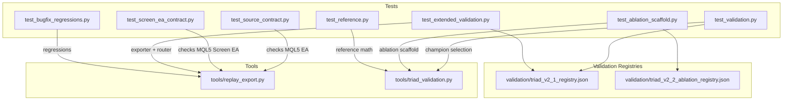
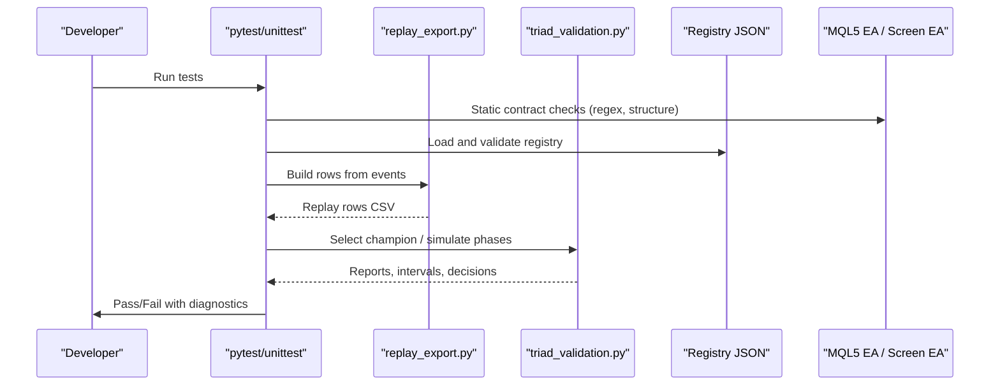
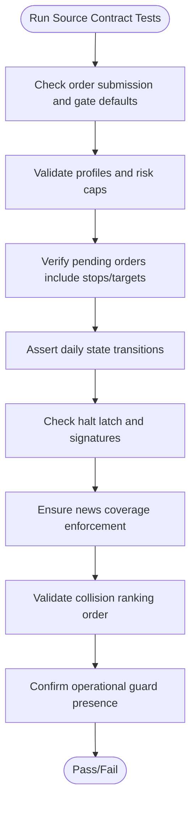
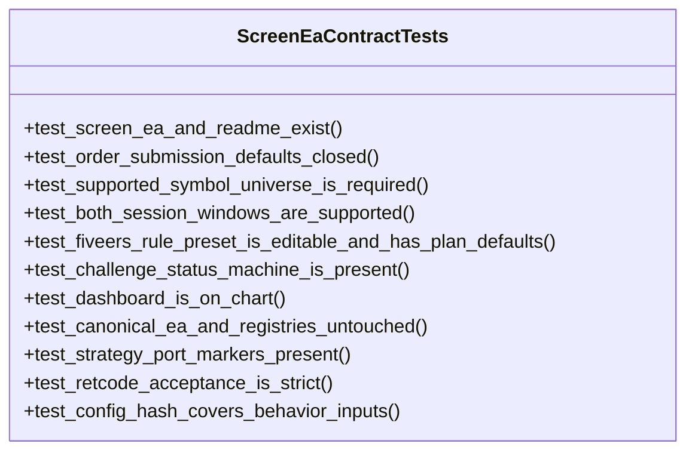
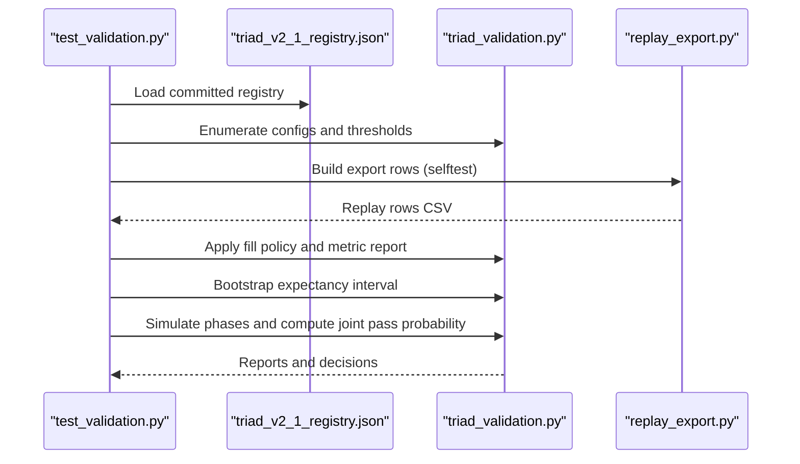
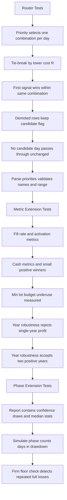
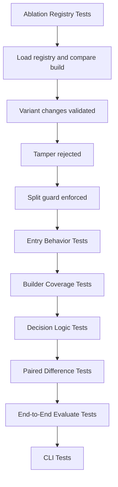
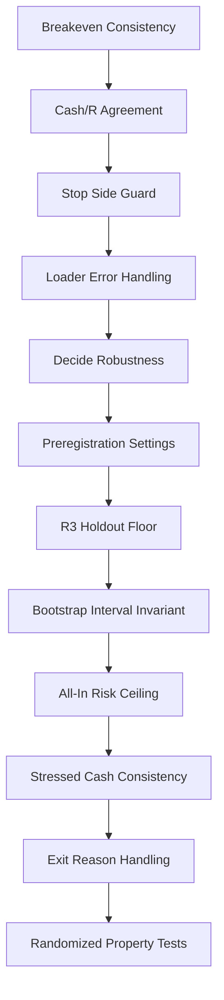
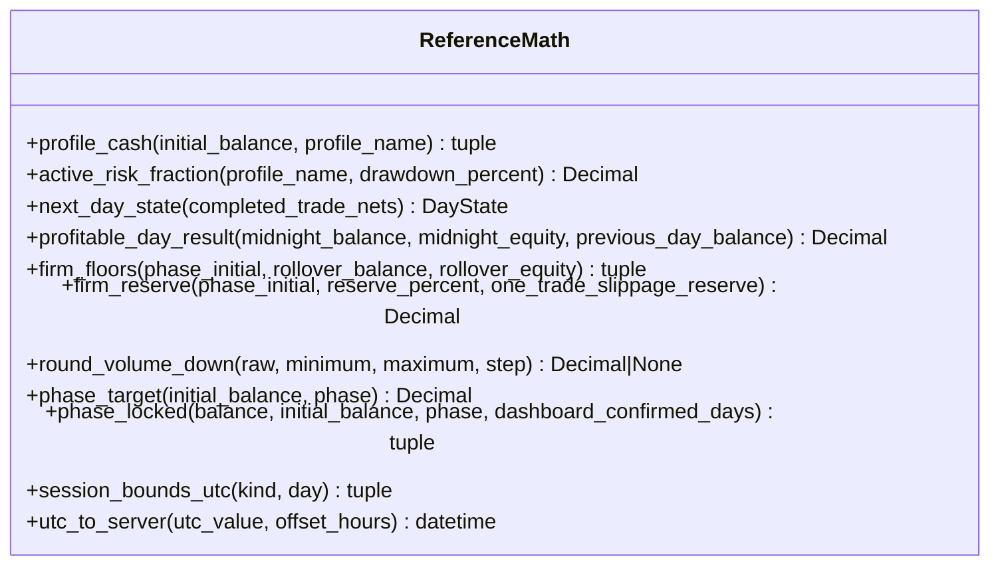
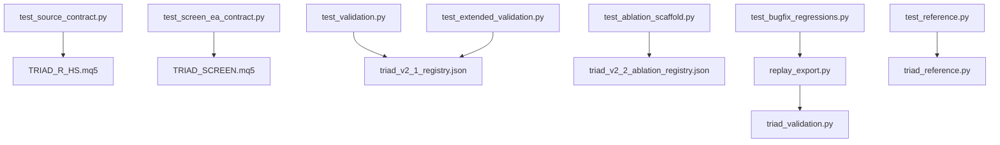

# Testing Procedures

<cite>
**Referenced Files in This Document**
- [test_ablation_scaffold.py](file://tests/test_ablation_scaffold.py)
- [test_bugfix_regressions.py](file://tests/test_bugfix_regressions.py)
- [test_extended_validation.py](file://tests/test_extended_validation.py)
- [test_reference.py](file://tests/test_reference.py)
- [test_screen_ea_contract.py](file://tests/test_screen_ea_contract.py)
- [test_source_contract.py](file://tests/test_source_contract.py)
- [test_validation.py](file://tests/test_validation.py)
- [triad_reference.py](file://tests/triad_reference.py)
- [replay_export.py](file://tools/replay_export.py)
- [triad_validation.py](file://tools/triad_validation.py)
- [triad_v2_1_registry.json](file://validation/triad_v2_1_registry.json)
- [triad_v2_2_ablation_registry.json](file://validation/triad_v2_2_ablation_registry.json)
</cite>

## Table of Contents
1. [Introduction](#introduction)
2. [Project Structure](#project-structure)
3. [Core Components](#core-components)
4. [Architecture Overview](#architecture-overview)
5. [Detailed Component Analysis](#detailed-component-analysis)
6. [Dependency Analysis](#dependency-analysis)
7. [Performance Considerations](#performance-considerations)
8. [Troubleshooting Guide](#troubleshooting-guide)
9. [Conclusion](#conclusion)
10. [Appendices](#appendices)

## Introduction
This document explains the TRIAD-R testing procedures with a focus on unit tests, contract validation, and integration testing. It covers how to run all tests (171 total), how to interpret results, how to write new tests, how to maintain coverage, and how debugging should proceed when failures occur. It also documents the contract-testing approach that ensures MQL5-Python parity and the validation pipeline testing procedures used by the replay exporter and champion selection tooling.

The test suite is organized around three pillars:
- Contract tests for the MQL5 Expert Advisor and its screen variant, ensuring behavioral parity and safe defaults.
- Validation and replay export tests that verify the Python-side evidence pipeline against frozen registries.
- Reference math tests that validate deterministic arithmetic and time handling independently of MQL5.

## Project Structure
The tests live under tests/ and target both MQL5 source files and Python tooling under tools/. The validation layer uses committed registries under validation/ to lock configuration space and splits.

**Diagram sources**
- [test_source_contract.py:15-25](file://tests/test_source_contract.py#L15-L25)
- [test_screen_ea_contract.py:39-49](file://tests/test_screen_ea_contract.py#L39-L49)
- [test_validation.py:80-133](file://tests/test_validation.py#L80-L133)
- [test_extended_validation.py:100-197](file://tests/test_extended_validation.py#L100-L197)
- [test_ablation_scaffold.py:46-101](file://tests/test_ablation_scaffold.py#L46-L101)
- [test_bugfix_regressions.py:22-138](file://tests/test_bugfix_regressions.py#L22-L138)
- [test_reference.py:27-105](file://tests/test_reference.py#L27-L105)
- [replay_export.py:125-197](file://tools/replay_export.py#L125-L197)
- [triad_validation.py:49-95](file://tools/triad_validation.py#L49-L95)
- [triad_v2_1_registry.json:1-15](file://validation/triad_v2_1_registry.json#L1-L15)
- [triad_v2_2_ablation_registry.json:1-89](file://validation/triad_v2_2_ablation_registry.json#L1-L89)

**Section sources**
- [test_source_contract.py:15-25](file://tests/test_source_contract.py#L15-L25)
- [test_screen_ea_contract.py:39-49](file://tests/test_screen_ea_contract.py#L39-L49)
- [test_validation.py:80-133](file://tests/test_validation.py#L80-L133)
- [test_extended_validation.py:100-197](file://tests/test_extended_validation.py#L100-L197)
- [test_ablation_scaffold.py:46-101](file://tests/test_ablation_scaffold.py#L46-L101)
- [test_bugfix_regressions.py:22-138](file://tests/test_bugfix_regressions.py#L22-L138)
- [test_reference.py:27-105](file://tests/test_reference.py#L27-L105)
- [replay_export.py:125-197](file://tools/replay_export.py#L125-L197)
- [triad_validation.py:49-95](file://tools/triad_validation.py#L49-L95)
- [triad_v2_1_registry.json:1-15](file://validation/triad_v2_1_registry.json#L1-L15)
- [triad_v2_2_ablation_registry.json:1-89](file://validation/triad_v2_2_ablation_registry.json#L1-L89)

## Core Components
- MQL5 source contract tests:
  - Validate EA behavior defaults, order submission gates, risk tiers, state persistence, news coverage, session logic, and collision ranking.
  - Ensure the canonical EA file and registries remain unmodified at HEAD.
- MQL5 screen EA contract tests:
  - Verify supported symbols, session windows, dashboard presence, challenge status machine, and safety behaviors.
- Validation pipeline tests:
  - Registry integrity, fill policy semantics, selection rules, phase simulation reports, and replay exporter correctness.
- Ablation scaffold tests:
  - Preregistered ablation registry validation, entry behavior variants, paired comparisons, decision rules, and CLI flows.
- Regression tests:
  - Breakeven consistency, cash/R agreement, loader error handling, holdout floor enforcement, randomized invariants, and exit reason handling.
- Reference math tests:
  - Independent standard-library implementations of profile math, daily state, firm floors, volume rounding, and civil-time conversions.

**Section sources**
- [test_source_contract.py:20-542](file://tests/test_source_contract.py#L20-L542)
- [test_screen_ea_contract.py:44-316](file://tests/test_screen_ea_contract.py#L44-L316)
- [test_validation.py:80-313](file://tests/test_validation.py#L80-L313)
- [test_extended_validation.py:100-578](file://tests/test_extended_validation.py#L100-L578)
- [test_ablation_scaffold.py:46-501](file://tests/test_ablation_scaffold.py#L46-L501)
- [test_bugfix_regressions.py:22-683](file://tests/test_bugfix_regressions.py#L22-L683)
- [test_reference.py:27-157](file://tests/test_reference.py#L27-L157)

## Architecture Overview
The testing architecture enforces parity between MQL5 and Python through:
- Source-level contract assertions that pin critical identifiers, defaults, and control flow markers in the EA and screen EA.
- Frozen registries that define the candidate matrix and evaluation rules; any mismatch triggers validation errors.
- Replay exporter tests that ensure observed events are transformed into the exact CSV schema consumed by the validator.
- Reference math tests that provide independent oracles for deterministic calculations.

**Diagram sources**
- [test_source_contract.py:20-542](file://tests/test_source_contract.py#L20-L542)
- [test_screen_ea_contract.py:44-316](file://tests/test_screen_ea_contract.py#L44-L316)
- [test_validation.py:80-313](file://tests/test_validation.py#L80-L313)
- [test_extended_validation.py:408-578](file://tests/test_extended_validation.py#L408-L578)
- [replay_export.py:125-197](file://tools/replay_export.py#L125-L197)
- [triad_validation.py:49-95](file://tools/triad_validation.py#L49-L95)
- [triad_v2_1_registry.json:1-15](file://validation/triad_v2_1_registry.json#L1-L15)

## Detailed Component Analysis

### MQL5 Source Contract Tests
These tests assert the canonical EA’s behavior and safety properties:
- Order submission defaults closed and release gates default false.
- Only four paired profiles with maximum risk fraction constraints.
- Pending orders must include visible stop/target; missing fields cause rejection.
- Daily state uses first net positive and two-trade lock semantics.
- Persistent halt latch and signature integrity.
- News coverage cannot silently expire; required coverage window enforced.
- Collision ranking uses priority before cost/time.
- Operational guards present and correctly named.

**Diagram sources**
- [test_source_contract.py:44-127](file://tests/test_source_contract.py#L44-L127)
- [test_source_contract.py:138-175](file://tests/test_source_contract.py#L138-L175)
- [test_source_contract.py:212-228](file://tests/test_source_contract.py#L212-L228)
- [test_source_contract.py:269-312](file://tests/test_source_contract.py#L269-L312)
- [test_source_contract.py:393-419](file://tests/test_source_contract.py#L393-L419)
- [test_source_contract.py:427-467](file://tests/test_source_contract.py#L427-L467)

**Section sources**
- [test_source_contract.py:20-542](file://tests/test_source_contract.py#L20-L542)

### MQL5 Screen EA Contract Tests
These tests mirror the canonical EA approach for the multi-symbol demo EA:
- Supported symbol universe and session windows.
- Challenge status machine and dashboard presence.
- Strategy port markers and emergency cleanup paths.
- Retcode acceptance strictness and price normalizers tick-size anchored.
- Config hash covering behavior inputs.
- Canonical EA and registries untouched.

**Diagram sources**
- [test_screen_ea_contract.py:39-316](file://tests/test_screen_ea_contract.py#L39-L316)

**Section sources**
- [test_screen_ea_contract.py:44-316](file://tests/test_screen_ea_contract.py#L44-L316)

### Validation Pipeline Tests
These tests cover the Python-side evidence pipeline:
- Registry integrity and hash mismatch detection.
- Fill policy semantics including stress costs and uncertainty counts.
- Selection-aware confidence intervals and champion freezing before holdout.
- Phase simulation reports with confidence bounds, draws, and median stats.
- Replay exporter self-test round trip and coverage validation.

**Diagram sources**
- [test_validation.py:80-133](file://tests/test_validation.py#L80-L133)
- [test_validation.py:135-176](file://tests/test_validation.py#L135-L176)
- [test_validation.py:178-273](file://tests/test_validation.py#L178-L273)
- [test_validation.py:275-313](file://tests/test_validation.py#L275-L313)
- [test_extended_validation.py:408-578](file://tests/test_extended_validation.py#L408-L578)
- [replay_export.py:125-197](file://tools/replay_export.py#L125-L197)
- [triad_v2_1_registry.json:1-15](file://validation/triad_v2_1_registry.json#L1-L15)

**Section sources**
- [test_validation.py:80-313](file://tests/test_validation.py#L80-L313)
- [test_extended_validation.py:408-578](file://tests/test_extended_validation.py#L408-L578)

### Extended Validation Tests
These tests extend coverage to:
- Account-wide router with priority, cost/R, sequence, and session routing.
- Extended metric report including fill rates, cash metrics, lot-underuse, and year robustness.
- Phase extension with confidence bounds, draws, median drawdown, and time in drawdown.
- Replay exporter contract checks, lot math, time-stop selection, calendar coverage, split-cut enforcement, and round-trip fidelity.

**Diagram sources**
- [test_extended_validation.py:100-197](file://tests/test_extended_validation.py#L100-L197)
- [test_extended_validation.py:199-298](file://tests/test_extended_validation.py#L199-L298)
- [test_extended_validation.py:300-406](file://tests/test_extended_validation.py#L300-L406)

**Section sources**
- [test_extended_validation.py:100-578](file://tests/test_extended_validation.py#L100-L578)

### Ablation Scaffold Tests
These tests validate the preregistered ablation framework:
- Registry matches tool declaration and schema version.
- Six runs with baseline first; each variant changes at least one entry parameter.
- Tamper protection via registry SHA and split guard.
- Entry behavior variants (simpler reclaim, quote entry, no wick filter, lower body threshold, no midpoint).
- Builder coverage across runs, combinations, and days; out-of-cut day rejection; same-session repeat not an order.
- Decision logic: failure blocks everything, superiority threshold, simpler tie requires opportunity premium and no harm.
- Paired differences include extra opportunity; bootstrap interval finite and deterministic.
- End-to-end evaluate scenario recommending no change or confirming variant dominance.
- CLI preregister refuses overwrite then forces; build rejects different split.

**Diagram sources**
- [test_ablation_scaffold.py:46-101](file://tests/test_ablation_scaffold.py#L46-L101)
- [test_ablation_scaffold.py:104-211](file://tests/test_ablation_scaffold.py#L104-L211)
- [test_ablation_scaffold.py:213-260](file://tests/test_ablation_scaffold.py#L213-L260)
- [test_ablation_scaffold.py:262-309](file://tests/test_ablation_scaffold.py#L262-L309)
- [test_ablation_scaffold.py:311-358](file://tests/test_ablation_scaffold.py#L311-L358)
- [test_ablation_scaffold.py:385-471](file://tests/test_ablation_scaffold.py#L385-L471)
- [test_ablation_scaffold.py:473-499](file://tests/test_ablation_scaffold.py#L473-L499)
- [triad_v2_2_ablation_registry.json:1-89](file://validation/triad_v2_2_ablation_registry.json#L1-L89)

**Section sources**
- [test_ablation_scaffold.py:46-501](file://tests/test_ablation_scaffold.py#L46-L501)
- [triad_v2_2_ablation_registry.json:1-196](file://validation/triad_v2_2_ablation_registry.json#L1-L196)

### Bugfix Regression Tests
These tests encode specific findings and invariants:
- Breakeven consistency: net_r and net_cash_full agree under cap; stop timing relative to breakeven confirmation.
- Cash/R agreement across all exit paths for both breakeven policies.
- Stop side must be protective; wrong side rejected.
- Loader error handling for non-integer and negative trade-through ticks.
- Decide robustness without paired days or with None interval.
- Preregistration settings: holdout fill floor and clean schema output.
- R3 holdout floor blocks confirmation if insufficient fills.
- Bootstrap interval invariant: adjusted interval contains ordinary interval.
- All-in risk ceiling: volume sized so all-in loss fits budget; minimum volume skip if breach.
- Stressed cash consistency includes stress cost.
- Exit reason handling honors breakeven; cancel never counts as fill; unsupported time stop horizon raises error; loader requires breakeven timestamp.
- Randomized property tests: invariants and CSV round-trip preservation; fill policy conditions.

**Diagram sources**
- [test_bugfix_regressions.py:22-138](file://tests/test_bugfix_regressions.py#L22-L138)
- [test_bugfix_regressions.py:140-186](file://tests/test_bugfix_regressions.py#L140-L186)
- [test_bugfix_regressions.py:188-227](file://tests/test_bugfix_regressions.py#L188-L227)
- [test_bugfix_regressions.py:229-257](file://tests/test_bugfix_regressions.py#L229-L257)
- [test_bugfix_regressions.py:259-284](file://tests/test_bugfix_regressions.py#L259-L284)
- [test_bugfix_regressions.py:286-302](file://tests/test_bugfix_regressions.py#L286-L302)
- [test_bugfix_regressions.py:304-317](file://tests/test_bugfix_regressions.py#L304-L317)
- [test_bugfix_regressions.py:320-346](file://tests/test_bugfix_regressions.py#L320-L346)
- [test_bugfix_regressions.py:353-406](file://tests/test_bugfix_regressions.py#L353-L406)
- [test_bugfix_regressions.py:408-434](file://tests/test_bugfix_regressions.py#L408-L434)
- [test_bugfix_regressions.py:436-512](file://tests/test_bugfix_regressions.py#L436-L512)
- [test_bugfix_regressions.py:514-683](file://tests/test_bugfix_regressions.py#L514-L683)

**Section sources**
- [test_bugfix_regressions.py:22-683](file://tests/test_bugfix_regressions.py#L22-L683)

### Reference Math Tests
Independent standard-library oracles validate deterministic calculations:
- Profile cash math and active risk fraction tiers.
- Nominal winner not assumed qualifying cash.
- Halt latch signature mutation invalidates commit signature; unlocked halt cannot retain stale reason.
- Daily state transitions based on completed trade nets.
- Profitable day result uses lower midnight value.
- Phase target and locked states require dashboard days.
- Firm floor math and reserve greater of percent and twice slippage.
- Volume always rounds down within symbol constraints.
- Session bounds UTC for London and New York with DST handling.
- UTC to server conversion fixed offset.

**Diagram sources**
- [triad_reference.py:16-167](file://tests/triad_reference.py#L16-L167)

**Section sources**
- [test_reference.py:27-157](file://tests/test_reference.py#L27-L157)
- [triad_reference.py:16-167](file://tests/triad_reference.py#L16-L167)

## Dependency Analysis
The test suite depends on:
- MQL5 source files for static contract checks.
- Python tools for replay export and validation.
- Committed registries for configuration space and evaluation rules.
- Reference math module for deterministic oracles.

**Diagram sources**
- [test_source_contract.py:15-25](file://tests/test_source_contract.py#L15-L25)
- [test_screen_ea_contract.py:20-25](file://tests/test_screen_ea_contract.py#L20-L25)
- [test_validation.py:32-34](file://tests/test_validation.py#L32-L34)
- [test_extended_validation.py:49-51](file://tests/test_extended_validation.py#L49-L51)
- [test_ablation_scaffold.py:22-24](file://tests/test_ablation_scaffold.py#L22-L24)
- [test_bugfix_regressions.py:15-19](file://tests/test_bugfix_regressions.py#L15-L19)
- [test_reference.py:7-21](file://tests/test_reference.py#L7-L21)
- [replay_export.py:140-150](file://tools/replay_export.py#L140-L150)

**Section sources**
- [test_source_contract.py:15-25](file://tests/test_source_contract.py#L15-L25)
- [test_screen_ea_contract.py:20-25](file://tests/test_screen_ea_contract.py#L20-L25)
- [test_validation.py:32-34](file://tests/test_validation.py#L32-L34)
- [test_extended_validation.py:49-51](file://tests/test_extended_validation.py#L49-L51)
- [test_ablation_scaffold.py:22-24](file://tests/test_ablation_scaffold.py#L22-L24)
- [test_bugfix_regressions.py:15-19](file://tests/test_bugfix_regressions.py#L15-L19)
- [test_reference.py:7-21](file://tests/test_reference.py#L7-L21)
- [replay_export.py:140-150](file://tools/replay_export.py#L140-L150)

## Performance Considerations
- Use targeted test discovery to run subsets during development (e.g., only contract tests or only validation tests).
- Avoid loading large datasets in unit tests; rely on synthetic events and temporary directories.
- Keep randomized tests deterministic by seeding RNGs where applicable.
- Prefer fixture-based row construction over file I/O for speed.
- Cache registry loads where possible within test sessions.

[No sources needed since this section provides general guidance]

## Troubleshooting Guide
Common failure categories and how to debug:
- Registry mismatch:
  - If load_registry raises a hash mismatch, inspect triad_v2_1_registry.json for unintended edits.
  - For ablation, ensure triad_v2_2_ablation_registry.json matches build_registry and schema version.
- Replay exporter issues:
  - ValidationError for unknown combination or outside declared splits indicates upstream event data misalignment.
  - Self-test round trip failing suggests CSV schema drift or field type mismatches.
- MQL5 contract failures:
  - Regex assertions failing indicate EA source drift; verify canonical EA and screen EA have required markers and defaults.
  - Git status checks failing mean canonical files or registries were modified locally.
- Validation pipeline failures:
  - Bootstrap interval or phase simulation discrepancies often stem from seed or block_days changes; verify SimulationSettings.
  - Champion selection rejecting holdout rows is expected; ensure only selection rows are passed to select_champion.
- Regression failures:
  - Breakeven or cash/R disagreements suggest exit path or cost modeling changes; trace through derive_event_rows and resolve_exit.
  - Loader errors for trade_through_ticks indicate upstream replay export issues; validate CSV types and ranges.

**Section sources**
- [test_validation.py:103-113](file://tests/test_validation.py#L103-L113)
- [test_extended_validation.py:546-573](file://tests/test_extended_validation.py#L546-L573)
- [test_source_contract.py:133-146](file://tests/test_source_contract.py#L133-L146)
- [test_screen_ea_contract.py:133-146](file://tests/test_screen_ea_contract.py#L133-L146)
- [test_ablation_scaffold.py:78-101](file://tests/test_ablation_scaffold.py#L78-L101)
- [test_bugfix_regressions.py:229-257](file://tests/test_bugfix_regressions.py#L229-L257)

## Conclusion
The TRIAD-R test suite provides comprehensive coverage across MQL5 contract validation, Python validation pipeline integrity, and reference math correctness. By running all tests, developers can ensure parity between the EA and its evidence pipeline, maintain frozen registries, and catch regressions early. Writing new tests should follow existing patterns: use synthetic data, assert deterministic outcomes, and leverage reference oracles where appropriate. Maintaining coverage involves keeping registries committed, validating CSV schemas, and ensuring MQL5 source contracts remain intact.

[No sources needed since this section summarizes without analyzing specific files]

## Appendices

### How to Run All Tests
- Use unittest discover to run all tests in the repository root:
  - python -m unittest discover -s tests -p "test_*.py"
- To run specific modules:
  - python -m unittest tests.test_source_contract
  - python -m unittest tests.test_screen_ea_contract
  - python -m unittest tests.test_validation
  - python -m unittest tests.test_extended_validation
  - python -m unittest tests.test_ablation_scaffold
  - python -m unittest tests.test_bugfix_regressions
  - python -m unittest tests.test_reference
- Expected outcome: 171 tests passing across all modules.

[No sources needed since this section provides general guidance]

### Interpreting Test Results
- Pass: All assertions met; registry hashes match; MQL5 contracts intact; validation reports consistent.
- Fail: Inspect assertion messages for regex mismatches, ValidationError exceptions, or numerical discrepancies.
- Regression: Focus on recent changes to replay_export.py or triad_validation.py; verify CSV schema and fill policy parameters.
- Contract: Re-check MQL5 source for required markers and defaults; ensure canonical files are unmodified.

[No sources needed since this section provides general guidance]

### Writing New Tests
- Follow existing patterns:
  - Use synthetic events and temporary directories.
  - Assert deterministic outcomes with seeded RNGs.
  - Leverage reference math for oracles.
- Add coverage for:
  - New entry modes or variants in ablation registry.
  - Additional session windows or combinations.
  - Edge cases in loader and exporter validation.
- Maintain registries:
  - Commit new configurations and updates to registries.
  - Ensure schema versions and hashes reflect changes.

[No sources needed since this section provides general guidance]

### Maintaining Test Coverage
- Keep registries frozen and committed.
- Validate CSV schemas regularly using replay exporter self-test.
- Ensure MQL5 source contracts include required markers and defaults.
- Update tests when new features are added to avoid drift.

[No sources needed since this section provides general guidance]