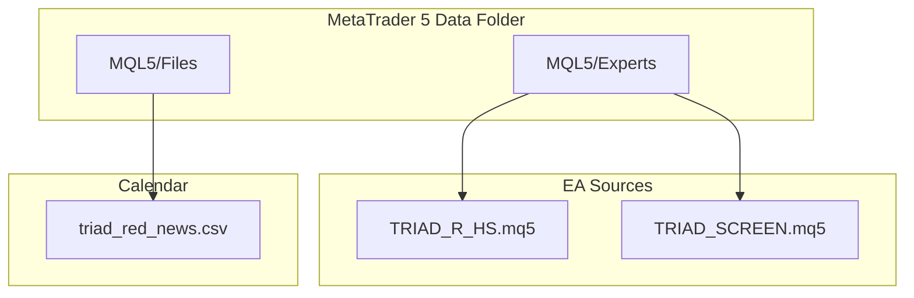

# Getting Started Guide

<cite>
**Referenced Files in This Document**
- [TRIAD_R_HS.mq5](file://MQL5/Experts/TRIAD_R_HS/TRIAD_R_HS.mq5)
- [TRIAD_R_HS README](file://MQL5/Experts/TRIAD_R_HS/README.md)
- [TRIAD_SCREEN.mq5](file://MQL5/Experts/TRIAD_SCREEN/TRIAD_SCREEN.mq5)
- [TRIAD_SCREEN README](file://MQL5/Experts/TRIAD_SCREEN/README.md)
- [triad_red_news.csv.example](file://MQL5/Files/triad_red_news.csv.example)
- [test_screen_ea_contract.py](file://tests/test_screen_ea_contract.py)
</cite>

## Table of Contents
1. [Introduction](#introduction)
2. [Prerequisites](#prerequisites)
3. [Project Structure](#project-structure)
4. [Installation and Environment Setup](#installation-and-environment-setup)
5. [Production EA: TRIAD_R_HS Setup](#production-ea-triad_r_hs-setup)
6. [Research Tool: TRIAD_SCREEN Setup](#research-tool-triad_screen-setup)
7. [Economic Calendar Configuration](#economic-calendar-configuration)
8. [Initial Testing Procedures](#initial-testing-procedures)
9. [Verification Checklist](#verification-checklist)
10. [Troubleshooting Guide](#troubleshooting-guide)
11. [Performance Considerations](#performance-considerations)
12. [Conclusion](#conclusion)

## Introduction
This guide helps you deploy the TRIAD-R trading system safely for research and demo screening, with clear steps to install MetaTrader 5 (MT5), place files correctly, configure parameters, set up the economic calendar, and run initial tests. It covers both components:
- Production EA: TRIAD_R_HS (fail-closed by default; not for live use until validated)
- Research tool: TRIAD_SCREEN (demo-only screening with on-chart dashboard)

The system implements a session-based M5 sweep/reclaim strategy with strict risk controls, news blackout handling, and challenge-style rules for demo validation.

## Prerequisites
- Basic forex trading concepts: currency pairs, bid/ask, spread, slippage, lots, leverage, daily/overall drawdowns, qualifying days, phase targets
- MT5 familiarity: installing MT5, opening Data Folder, using MetaEditor, attaching EAs, Strategy Tester, Market Watch
- Algorithmic trading principles: event-driven execution, timers, state persistence, logging, fail-closed design, testing vs live deployment

## Project Structure
Key locations relevant to installation and configuration:
- MQL5/Experts/TRIAD_R_HS/TRIAD_R_HS.mq5 — production EA source
- MQL5/Experts/TRIAD_SCREEN/TRIAD_SCREEN.mq5 — demo screening EA source
- MQL5/Files/triad_red_news.csv.example — example economic calendar format
- tests/* — static contract tests that validate behavior and defaults

**Diagram sources**
- [TRIAD_R_HS.mq5:1-10](file://MQL5/Experts/TRIAD_R_HS/TRIAD_R_HS.mq5#L1-L10)
- [TRIAD_SCREEN.mq5:1-35](file://MQL5/Experts/TRIAD_SCREEN/TRIAD_SCREEN.mq5#L1-L35)
- [triad_red_news.csv.example:1-7](file://MQL5/Files/triad_red_news.csv.example#L1-L7)

**Section sources**
- [TRIAD_R_HS README:15-25](file://MQL5/Experts/TRIAD_R_HS/README.md#L15-L25)
- [TRIAD_SCREEN README:12-44](file://MQL5/Experts/TRIAD_SCREEN/README.md#L12-L44)

## Installation and Environment Setup
- Install MT5 from your broker or provider. Ensure you can open the Data Folder via File → Open Data Folder.
- Prepare two environments:
  - Demo accounts for TRIAD_SCREEN (one account per symbol/window combo)
  - One MT5 terminal instance for TRIAD_R_HS research/dry runs (order submission disabled by default)
- Keep order submission disabled unless explicitly enabling it in controlled contexts (e.g., Strategy Tester or demo only).

**Section sources**
- [TRIAD_R_HS README:15-25](file://MQL5/Experts/TRIAD_R_HS/README.md#L15-L25)
- [TRIAD_SCREEN README:59-79](file://MQL5/Experts/TRIAD_SCREEN/README.md#L59-L79)

## Production EA: TRIAD_R_HS Setup
Follow these steps to install and initialize TRIAD_R_HS safely:
1. Copy TRIAD_R_HS.mq5 into MQL5/Experts/TRIAD_R_HS/.
2. Create MQL5/Files/triad_red_news.csv from an independently verified high-impact calendar export. Do not simply rename the example file.
3. Compile in MetaEditor with zero errors; review all warnings. Save compiler output and build checksum for validation records.
4. Restart or refresh MT5 Navigator, attach the EA to one chart, and leave InpEnableOrderSubmission=false.
5. Confirm symbols EURUSD, GBPUSD, USDJPY are present in Market Watch and map to expected base/profit currencies.
6. Review Experts log and dry-run CSV logs for any ERROR, HALT, stale calendar, insufficient history, property mismatch, or offset mismatch. Treat these as failed runs.

Important runtime notes:
- The EA is timer-driven and scans configured symbols from one chart. Do not attach multiple live-order instances to the same account.
- Execution mode acquires a terminal-global owner/heartbeat lock and fails closed on concurrent instances.
- News CSV must be current and include explicit coverage declaration beyond required hours.

**Section sources**
- [TRIAD_R_HS README:15-25](file://MQL5/Experts/TRIAD_R_HS/README.md#L15-L25)
- [TRIAD_R_HS README:27-47](file://MQL5/Experts/TRIAD_R_HS/README.md#L27-L47)
- [TRIAD_R_HS.mq5:52-90](file://MQL5/Experts/TRIAD_R_HS/TRIAD_R_HS.mq5#L52-L90)

## Research Tool: TRIAD_SCREEN Setup
Use TRIAD_SCREEN to screen multiple symbols and sessions across demo accounts:
1. Create a demo account for each symbol/window combination you want to test.
2. Compile TRIAD_SCREEN.mq5 in MetaEditor with zero errors.
3. On a chart for the chosen symbol, attach the EA and set:
   - InpSymbol = the combo symbol
   - InpWindow = TSC_WINDOW_LONDON or TSC_WINDOW_NEW_YORK
   - InpComboLabel = optional short label (defaults auto-derived)
   - Challenge inputs (InpChallengePhase, InpPhaseInitialBalance, etc.) matching your agreement
   - InpEnableOrderSubmission = true only on demo accounts; keep false for dry dashboard
4. Keep MQL5/Files/triad_red_news.csv current with the same schema as the canonical EA. If you do not want news blackout, set InpRequireNewsCalendar=false.

Supported symbols and windows:
- Symbols: EURUSD, GBPUSD, USDCHF, AUDUSD, USDCAD, NZDUSD, USDJPY, EURJPY, GBPJPY
- Windows: London (range 00:00–07:00 local, entry 07:00–11:00), New York (reference range previous day 07:00–13:00, entry 08:30–11:00)

Dashboard highlights:
- STATUS: ACTIVE / PASSED / FAILED_* / TARGET_REACHED_DAYS_PENDING / HALTED:*
- Phase progress, qualifying days, daily/overall floor distances
- Today’s signals/candidates/fills/rejects, net-R ledger
- ConfigHash fingerprint for settings attribution

Safety semantics:
- Same rules gate entries and exposure; floors trigger flattening
- Foreign/manual exposure detected; own-magic exposure cleaned
- One exposure invariant enforced; mid-session attach consumes session
- Detach cleanup cancels pending orders and closes positions when order submission enabled

**Section sources**
- [TRIAD_SCREEN README:12-44](file://MQL5/Experts/TRIAD_SCREEN/README.md#L12-L44)
- [TRIAD_SCREEN README:46-79](file://MQL5/Experts/TRIAD_SCREEN/README.md#L46-L79)
- [TRIAD_SCREEN README:81-159](file://MQL5/Experts/TRIAD_SCREEN/README.md#L81-L159)
- [TRIAD_SCREEN.mq5:86-155](file://MQL5/Experts/TRIAD_SCREEN/TRIAD_SCREEN.mq5#L86-L155)

## Economic Calendar Configuration
Both components rely on triad_red_news.csv with the following contract:
- Filename: triad_red_news.csv (configurable via InpNewsCsvFile)
- Fields: utc_time,currency,impact,title
- utc_time format: YYYY.MM.DD HH:MM in UTC
- currency: three-letter uppercase code; loader normalizes case
- impact: RED or HIGH; other non-metadata rows ignored
- Coverage row: ALL,COVERAGE with timestamp marking operator-verified completion
- Titles: free of unquoted commas
- Include all relevant red/high events for EUR, GBP, USD, JPY (CPI, NFP, FOMC/rate decisions, etc.)
- Required coverage extends at least InpRequiredNewsCoverageHours beyond current UTC (default 24h)
- Stale or missing coverage disables new entries and forces managed exposure flat at runtime
- Reload at server rollover and reattach; verify DST changes and reconcile times

Steps:
- Export high-impact events from a reliable source
- Format as CSV with UTC timestamps and correct fields
- Add ALL,COVERAGE row with a future timestamp confirming completeness
- Place in MQL5/Files/ and ensure it remains current before trading windows

**Section sources**
- [triad_red_news.csv.example:1-7](file://MQL5/Files/triad_red_news.csv.example#L1-L7)
- [TRIAD_R_HS README:27-47](file://MQL5/Experts/TRIAD_R_HS/README.md#L27-L47)
- [TRIAD_SCREEN README:76-79](file://MQL5/Experts/TRIAD_SCREEN/README.md#L76-L79)

## Initial Testing Procedures
For TRIAD_R_HS:
- Use Strategy Tester with InpEnableOrderSubmission=true only inside tester; outside tester, order submission remains locked.
- Set InpResetTesterStateOnInit=true for deterministic batch/optimization passes.
- Run real-tick Strategy Tester per symbol/session and paired profile using frozen assumptions.
- Validate fill policy, spread/slippage stress, bootstrap/Monte Carlo, and qualifying-day gates.

For TRIAD_SCREEN:
- Run on demo accounts with InpEnableOrderSubmission=true to simulate fills; keep false for dry dashboard.
- Observe dashboard status and CSV outputs under MQL5/Files/:
  - Event journal, persisted state, per-day summary, planned cash risk, closed-trade R ledger
- Verify signal detection, candidate validity, and challenge rule compliance without risking funds.

Static contract checks:
- Run Python unit tests to validate defaults, supported symbols/windows, and safety behaviors.

**Section sources**
- [TRIAD_R_HS README:118-133](file://MQL5/Experts/TRIAD_R_HS/README.md#L118-L133)
- [TRIAD_R_HS README:227-246](file://MQL5/Experts/TRIAD_R_HS/README.md#L227-L246)
- [TRIAD_SCREEN README:59-79](file://MQL5/Experts/TRIAD_SCREEN/README.md#L59-L79)
- [test_screen_ea_contract.py:39-146](file://tests/test_screen_ea_contract.py#L39-L146)

## Verification Checklist
Before considering any move toward live usage:
- Compile with zero errors; review all warnings
- Confirm symbols present in Market Watch and correct base/profit currencies
- Validate calendar coverage and UTC alignment
- Check Experts log and CSV logs for errors/halts/stale calendar/offset mismatches
- Ensure InpEnableOrderSubmission is false except in controlled contexts
- For TRIAD_SCREEN: confirm dashboard shows ACTIVE/PASSED/FAILED states appropriately
- For TRIAD_R_HS: confirm fail-closed behavior and no unintended order submissions

**Section sources**
- [TRIAD_R_HS README:15-25](file://MQL5/Experts/TRIAD_R_HS/README.md#L15-L25)
- [TRIAD_SCREEN README:81-95](file://MQL5/Experts/TRIAD_SCREEN/README.md#L81-L95)

## Troubleshooting Guide
Common issues and resolutions:
- Calendar stale or missing coverage:
  - Update triad_red_news.csv with fresh events and extend ALL,COVERAGE timestamp
  - Reattach EA to reload calendar; check logs for NEWS_BLOCK_INACTIVITY_RISK alerts
- Insufficient history or property mismatch:
  - Ensure sufficient M5 history loaded; verify symbol properties match expectations
- Offset mismatch:
  - Set InpExpectedServerUtcOffsetHours to broker’s actual server offset
- Order submission accidentally enabled:
  - Keep InpEnableOrderSubmission=false unless explicitly enabling in tester/demo
- Concurrent instance conflict:
  - Only one live-order instance per account; EA uses terminal-global locks and fails closed on conflicts
- Detach with exposure:
  - EA cancels pending orders and closes positions on deinit if order submission enabled; restore authorized context before reattach
- Screen EA halted due to state mismatch:
  - Fix cause and restart EA; state saved to CSV is not restored on next init

Validation references:
- Static contract tests assert defaults, supported symbols/windows, and safety behaviors
- Dashboard markers indicate status reasons and help identify failures quickly

**Section sources**
- [TRIAD_R_HS README:27-47](file://MQL5/Experts/TRIAD_R_HS/README.md#L27-L47)
- [TRIAD_R_HS.mq5:2942-2947](file://MQL5/Experts/TRIAD_R_HS/TRIAD_R_HS.mq5#L2942-L2947)
- [TRIAD_SCREEN README:97-113](file://MQL5/Experts/TRIAD_SCREEN/README.md#L97-L113)
- [test_screen_ea_contract.py:186-200](file://tests/test_screen_ea_contract.py#L186-L200)

## Performance Considerations
- Timer cadence and request latency:
  - EA enforces maximum synchronous order-request latency and early cutoffs to avoid crossing exact cutoffs
- Spread and cost gates:
  - Spread median multiplier and commission round trip per lot affect candidate validity and sizing
- Slippage reserves:
  - Stop and target slippage reserve points protect against adverse fills
- Volume rounding and cash risk:
  - Volume-grid and cash-risk calculations ensure consistent sizing and budget adherence
- News blackout buffers:
  - Pre-event and post-event buffers reduce exposure during high-impact releases

[No sources needed since this section provides general guidance]

## Conclusion
You now have a complete path to install, configure, and test TRIAD-R components safely. Start with TRIAD_SCREEN on demo accounts to validate mechanics and challenge-rule compliance, then proceed to TRIAD_R_HS in dry-run mode with strict validation gates. Always keep order submission disabled until thorough testing and approvals are complete. Maintain a current economic calendar, monitor logs and dashboards, and follow the troubleshooting steps to resolve common setup issues.