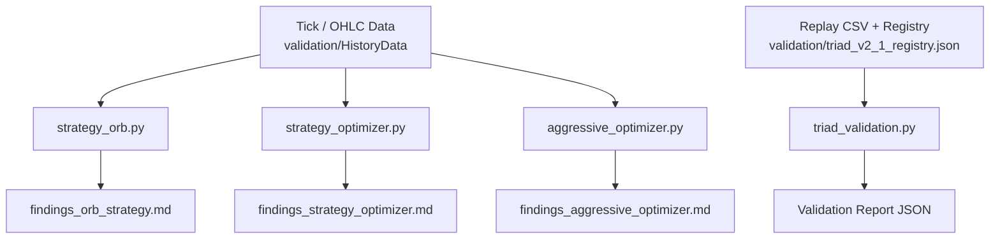
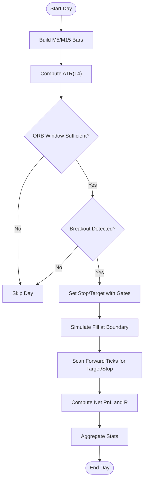
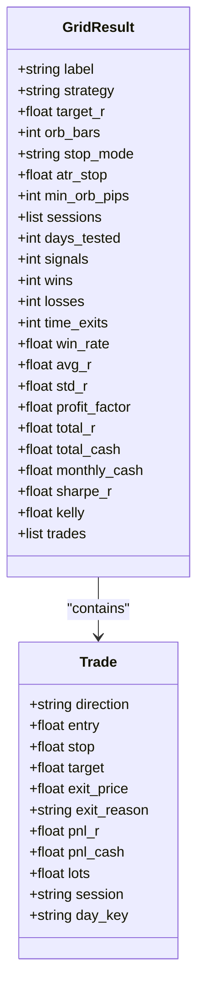
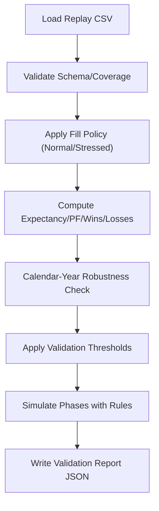
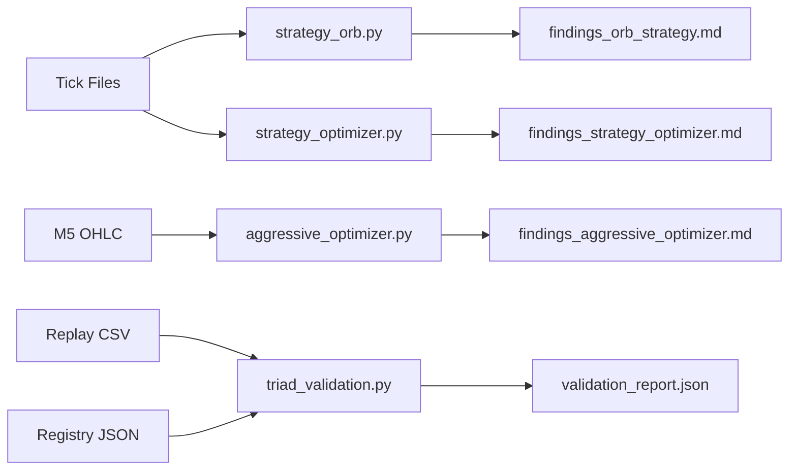

# Backtesting Results and Analysis

<cite>
**Referenced Files in This Document**
- [strategy_optimizer.py](file://tools/strategy_optimizer.py)
- [triad_validation.py](file://tools/triad_validation.py)
- [strategy_orb.py](file://tools/strategy_orb.py)
- [aggressive_optimizer.py](file://tools/aggressive_optimizer.py)
- [findings_aggressive_optimizer.md](file://findings_aggressive_optimizer.md)
- [findings_orb_strategy.md](file://findings_orb_strategy.md)
- [triad_v2_1_registry.json](file://validation/triad_v2_1_registry.json)
</cite>

## Table of Contents
1. [Introduction](#introduction)
2. [Project Structure](#project-structure)
3. [Core Components](#core-components)
4. [Architecture Overview](#architecture-overview)
5. [Detailed Component Analysis](#detailed-component-analysis)
6. [Dependency Analysis](#dependency-analysis)
7. [Performance Considerations](#performance-considerations)
8. [Troubleshooting Guide](#troubleshooting-guide)
9. [Conclusion](#conclusion)
10. [Appendices](#appendices)

## Introduction
This document explains how backtesting results are produced, interpreted, and validated for the ORB-based strategies and the TRIAD-R V2.1 framework. It covers:
- The backtesting methodology used by strategy_optimizer.py and triad_validation.py
- Data sources, time windows, and market conditions tested
- Key performance indicators (win rate, profit factor, maximum drawdown, Sharpe-like ratio, expectancy)
- Findings from the strategy optimizer and ORB strategy tests
- Guidance to set up backtests, interpret reports, and make data-driven decisions about parameters and robustness across regimes

## Project Structure
The backtesting system is implemented as a set of focused tools under tools/:
- strategy_orb.py: Standalone ORB backtester that reads tick files, builds bars, simulates entries/exits, and writes findings
- strategy_optimizer.py: Parameter grid search over ORB variants with multiple stop modes, targets, sessions, and filters; outputs leaderboard and findings
- aggressive_optimizer.py: Multi-pair optimizer targeting fast challenge completion with fixed lot sizing and phase simulation
- triad_validation.py: Champion selection and challenge replay tooling using a frozen registry and replay CSVs; computes metrics, stress scenarios, and pass probabilities



**Diagram sources**
- [strategy_orb.py:161-220](file://tools/strategy_orb.py#L161-L220)
- [strategy_optimizer.py:187-224](file://tools/strategy_optimizer.py#L187-L224)
- [aggressive_optimizer.py:149-168](file://tools/aggressive_optimizer.py#L149-L168)
- [triad_validation.py:360-437](file://tools/triad_validation.py#L360-L437)
- [triad_v2_1_registry.json:1-20](file://validation/triad_v2_1_registry.json#L1-L20)

**Section sources**
- [strategy_orb.py:1-668](file://tools/strategy_orb.py#L1-L668)
- [strategy_optimizer.py:1-803](file://tools/strategy_optimizer.py#L1-L803)
- [aggressive_optimizer.py:1-795](file://tools/aggressive_optimizer.py#L1-L795)
- [triad_validation.py:1-1934](file://tools/triad_validation.py#L1-L1934)

## Core Components
- ORB Strategy Backtester (strategy_orb.py): Builds M5/M15 bars from ticks, defines opening range, detects breakouts, applies ATR-based stops/targets, simulates fills/exits, and aggregates per-session stats. Outputs findings_orb_strategy.md.
- Strategy Optimizer (strategy_optimizer.py): Grid search over target R, ORB window size, stop mode (range/half_range/atr_fixed), ATR stop multiples, minimum ORB width, and session combinations. Computes win rate, avg R, profit factor, monthly cash estimate, Sharpe-like score, half-Kelly, and runs a Phase 1 challenge simulator. Outputs findings_strategy_optimizer.md.
- Aggressive Multi-Pair Optimizer (aggressive_optimizer.py): Tests three strategies across many pairs, uses fixed lot sizing, enforces daily trade limits, and simulates Phase 1/Phase 2 rules to find fastest paths to challenge completion. Outputs findings_aggressive_optimizer.md.
- TRIAD Validation (triad_validation.py): Loads replay CSV rows, validates schema and coverage against a frozen registry, applies fill policies (including stressed costs), computes expectancy/profit factor, year-robustness checks, and simulates phases with thresholds and confidence bounds. Produces validation_report.json.

Key performance indicators used across components:
- Win rate: proportion of trades hitting target vs total signals
- Profit factor: gross wins divided by gross losses
- Expectancy (avg R): average net P&L per trade measured in risk units
- Maximum drawdown: peak-to-trough decline during simulated equity curve
- Sharpe-like ratio: avg R divided by std dev of R (used as a stability proxy)
- Half-Kelly: fractional position sizing derived from win rate and target R

**Section sources**
- [strategy_orb.py:243-367](file://tools/strategy_orb.py#L243-L367)
- [strategy_optimizer.py:244-381](file://tools/strategy_optimizer.py#L244-L381)
- [aggressive_optimizer.py:443-471](file://tools/aggressive_optimizer.py#L443-L471)
- [triad_validation.py:500-708](file://tools/triad_validation.py#L500-L708)

## Architecture Overview
The backtesting pipeline consists of data ingestion, bar construction, signal generation, execution simulation, statistics aggregation, and reporting/validation.

```mermaid
sequenceDiagram
participant Data as "Tick/OHLC Data"
participant Orb as "strategy_orb.py"
participant Opt as "strategy_optimizer.py"
participant Val as "triad_validation.py"
participant Reports as "Findings & Reports"
Data->>Orb : Load ask/mid ticks per day
Orb->>Orb : Build M5/M15 bars, compute ATR
Orb->>Orb : Detect ORB breakout, set stop/target
Orb->>Orb : Simulate fill/exits, compute PnL/R
Orb-->>Reports : Write findings_orb_strategy.md
Data->>Opt : Load ask/mid ticks per day
Opt->>Opt : Prebuild days, run grid combos
Opt->>Opt : Compute WR, PF, AvgR, Sharpe, Kelly
Opt->>Opt : Simulate Phase 1 challenge
Opt-->>Reports : Write findings_strategy_optimizer.md
Val->>Val : Load Replay CSV + Registry
Val->>Val : Validate schema/coverage, apply fill policy
Val->>Val : Compute metrics, stress scenarios, thresholds
Val-->>Reports : Write validation_report.json
```

**Diagram sources**
- [strategy_orb.py:161-220](file://tools/strategy_orb.py#L161-L220)
- [strategy_optimizer.py:187-224](file://tools/strategy_optimizer.py#L187-L224)
- [triad_validation.py:360-437](file://tools/triad_validation.py#L360-L437)

## Detailed Component Analysis

### ORB Strategy Backtester (strategy_orb.py)
- Data loading: Reads Eightcap tick files, separates ask and mid-price series per calendar day
- Bar building: Constructs M5 bars from ask ticks and M15 bars from mid ticks
- ATR computation: Uses 14-period ATR on M15 bars prior to entry window
- Entry logic: Defines opening range from first N M5 bars within session window; enters on first close beyond range high/low
- Stop/target: Stop placed beyond opposite side of range with ATR buffer; target at fixed R multiple; validity gates enforce ATR multiples and pip floors
- Execution simulation: Assumes limit fill at boundary when price crosses; scans forward ticks to hit target or stop; otherwise exits at session end
- Statistics: Computes win rate, avg R, profit factor, total R/cash, and prints combined summary; writes findings report



**Diagram sources**
- [strategy_orb.py:243-367](file://tools/strategy_orb.py#L243-L367)

**Section sources**
- [strategy_orb.py:161-220](file://tools/strategy_orb.py#L161-L220)
- [strategy_orb.py:243-367](file://tools/strategy_orb.py#L243-L367)
- [strategy_orb.py:374-411](file://tools/strategy_orb.py#L374-L411)
- [strategy_orb.py:418-467](file://tools/strategy_orb.py#L418-L467)
- [strategy_orb.py:474-625](file://tools/strategy_orb.py#L474-L625)

### Strategy Optimizer (strategy_optimizer.py)
- Grid dimensions: TARGET_R × ORB_BARS × STOP_MODE × ATR_STOP × MIN_ORB_PIPS × SESSION_COMBOS
- Sessions: EURUSD_LONDON, GBPUSD_LONDON, USDJPY_NEWYORK; supports single or multi-session combos with max one trade per calendar day across pairs
- Stop modes:
  - range: original approach, stop beyond opposite side of range plus small ATR buffer
  - half_range: tighter stop at midpoint of range
  - atr_fixed: decoupled stop as fixed ATR fraction from entry
- Metrics: win rate, avg R, std R, profit factor, total R/cash, monthly cash estimate, Sharpe-like ratio, half-Kelly
- Challenge simulation: Sequential replay of trades with daily loss limit, overall floor, qualifying days, and Phase 1 target



**Diagram sources**
- [strategy_optimizer.py:75-124](file://tools/strategy_optimizer.py#L75-L124)
- [strategy_optimizer.py:84-97](file://tools/strategy_optimizer.py#L84-L97)

**Section sources**
- [strategy_optimizer.py:62-70](file://tools/strategy_optimizer.py#L62-L70)
- [strategy_optimizer.py:214-224](file://tools/strategy_optimizer.py#L214-L224)
- [strategy_optimizer.py:244-381](file://tools/strategy_optimizer.py#L244-L381)
- [strategy_optimizer.py:411-485](file://tools/strategy_optimizer.py#L411-L485)
- [strategy_optimizer.py:491-530](file://tools/strategy_optimizer.py#L491-L530)
- [strategy_optimizer.py:536-571](file://tools/strategy_optimizer.py#L536-L571)
- [strategy_optimizer.py:577-622](file://tools/strategy_optimizer.py#L577-L622)
- [strategy_optimizer.py:628-771](file://tools/strategy_optimizer.py#L628-L771)

### Aggressive Multi-Pair Optimizer (aggressive_optimizer.py)
- Strategies: orb_atr, orb_half, vola; parameter grids include target R, ORB bars, ATR stops
- Instruments: Broad multi-pair coverage including FX majors/minors and XAUUSD
- Risk model: Fixed lot sizing based on $2,500 base balance; daily trade limits to avoid correlated exposure
- Simulation: Tracks equity curve, computes true peak-to-trough drawdown, estimates monthly P&L, and simulates Phase 1/Phase 2 rules
- Output: Top configurations ranked by speed to Phase 1 and monthly P&L; per-pair contributions analyzed

**Section sources**
- [aggressive_optimizer.py:1-22](file://tools/aggressive_optimizer.py#L1-L22)
- [aggressive_optimizer.py:34-84](file://tools/aggressive_optimizer.py#L34-L84)
- [aggressive_optimizer.py:149-200](file://tools/aggressive_optimizer.py#L149-L200)
- [aggressive_optimizer.py:443-471](file://tools/aggressive_optimizer.py#L443-L471)
- [findings_aggressive_optimizer.md:1-141](file://findings_aggressive_optimizer.md#L1-L141)

### TRIAD Validation (triad_validation.py)
- Registry: Frozen configuration matrix (160 configs) with profiles, ranges, ATR bands, time stops, breakeven toggles
- Replay CSV: Event-level results exported from tick/bid-ask replay; strict schema and coverage validation
- Fill policy: Requires limit to trade through by minimum ticks; excludes partial fills; stressed scenario increases spread/slippage and randomly misses profitable limits
- Metrics: Expectancy (avg R), profit factor, wins/losses/scratches, per-combination breakdowns, rule violations, operational errors
- Year-robustness: Ensures no single year/regime accounts for entire profit; requires positive remainder after removing best year
- Phase simulation: Applies thresholds for Phase 1/Phase 2 pass probabilities, drawdown limits, qualifying days, and bootstrap confidence bounds



**Diagram sources**
- [triad_validation.py:360-437](file://tools/triad_validation.py#L360-L437)
- [triad_validation.py:480-497](file://tools/triad_validation.py#L480-L497)
- [triad_validation.py:500-708](file://tools/triad_validation.py#L500-L708)
- [triad_validation.py:1061-1100](file://tools/triad_validation.py#L1061-L1100)

**Section sources**
- [triad_validation.py:49-69](file://tools/triad_validation.py#L49-L69)
- [triad_validation.py:98-128](file://tools/triad_validation.py#L98-L128)
- [triad_validation.py:130-158](file://tools/triad_validation.py#L130-L158)
- [triad_validation.py:242-267](file://tools/triad_validation.py#L242-L267)
- [triad_validation.py:278-331](file://tools/triad_validation.py#L278-L331)
- [triad_validation.py:360-437](file://tools/triad_validation.py#L360-L437)
- [triad_validation.py:521-544](file://tools/triad_validation.py#L521-L544)
- [triad_validation.py:646-708](file://tools/triad_validation.py#L646-L708)
- [triad_v2_1_registry.json:1-20](file://validation/triad_v2_1_registry.json#L1-L20)

## Dependency Analysis
- Data dependencies:
  - Tick files for EURUSD, GBPUSD, USDJPY consumed by strategy_orb.py and strategy_optimizer.py
  - OHLC M5 files consumed by aggressive_optimizer.py
  - Replay CSV and registry consumed by triad_validation.py
- Module coupling:
  - strategy_optimizer.py depends on shared concepts (bars, ATR, session boundaries) but is self-contained
  - triad_validation.py is independent of live trading systems; it consumes pre-exported replay events
- External constraints:
  - DST-aware session boundaries for London and New York
  - Challenge rules (daily loss limit, overall floor, qualifying days) enforced in simulations



**Diagram sources**
- [strategy_orb.py:161-220](file://tools/strategy_orb.py#L161-L220)
- [strategy_optimizer.py:187-224](file://tools/strategy_optimizer.py#L187-L224)
- [aggressive_optimizer.py:149-168](file://tools/aggressive_optimizer.py#L149-L168)
- [triad_validation.py:360-437](file://tools/triad_validation.py#L360-L437)
- [triad_v2_1_registry.json:1-20](file://validation/triad_v2_1_registry.json#L1-L20)

**Section sources**
- [strategy_orb.py:161-220](file://tools/strategy_orb.py#L161-L220)
- [strategy_optimizer.py:187-224](file://tools/strategy_optimizer.py#L187-L224)
- [aggressive_optimizer.py:149-168](file://tools/aggressive_optimizer.py#L149-L168)
- [triad_validation.py:360-437](file://tools/triad_validation.py#L360-L437)

## Performance Considerations
- Data volume: Tick files can be large; prebuilding day data reduces repeated parsing overhead in strategy_optimizer.py
- Computational cost: Grid searches multiply across parameters; consider reducing grid sizes or focusing on promising regions
- Realism: Fill assumptions (limit at boundary) and slippage/spread modeling affect outcomes; triad_validation.py includes stressed scenarios to test robustness
- Risk controls: Fixed lot sizing prevents compounding blow-ups; daily trade limits reduce correlated exposure
- Statistical significance: Longer datasets improve confidence; current short windows require caution and forward testing

[No sources needed since this section provides general guidance]

## Troubleshooting Guide
Common issues and resolutions:
- Missing tick/OHLC files: Ensure paths exist and match expected naming conventions; scripts will skip missing instruments
- Invalid CSV schema: triad_validation.py enforces strict headers; run schema command to verify fields
- Duplicate or missing replay rows: Coverage validation ensures consistent day sets across splits; export explicit no-candidate rows for inactive days
- Zero or invalid risk values: Activated candidates must have positive risk; check sizing logic and stop distances
- Overfitting concerns: Use longer datasets and holdout splits; rely on year-robustness checks and confidence bounds

**Section sources**
- [strategy_orb.py:632-667](file://tools/strategy_orb.py#L632-L667)
- [strategy_optimizer.py:777-799](file://tools/strategy_optimizer.py#L777-L799)
- [triad_validation.py:360-437](file://tools/triad_validation.py#L360-L437)
- [triad_validation.py:440-473](file://tools/triad_validation.py#L440-L473)

## Conclusion
The backtesting suite provides a comprehensive framework for evaluating ORB strategies and the TRIAD-R V2.1 framework:
- strategy_orb.py offers a clear baseline for ORB logic and highlights limitations in short windows
- strategy_optimizer.py enables systematic exploration of stop modes, targets, and sessions, producing actionable leaderboards and challenge simulations
- aggressive_optimizer.py identifies robust multi-pair configurations optimized for challenge timelines
- triad_validation.py ensures rigorous validation with stress testing, thresholds, and confidence bounds

Use these tools iteratively: start with ORB baseline, expand via optimizer grids, validate with TRIAD framework, and forward-test top candidates before deployment.

[No sources needed since this section summarizes without analyzing specific files]

## Appendices

### Interpreting Key Metrics
- Win rate: Higher does not guarantee profitability if avg R is negative; focus on expectancy
- Profit factor: Indicates relative magnitude of wins vs losses; >1.2 typically desirable
- Expectancy (avg R): Positive expectancy is essential; combine with signal frequency for monthly ROI
- Maximum drawdown: Must stay within challenge limits; use sequential equity simulation
- Sharpe-like ratio: Stability indicator; higher suggests more consistent returns
- Half-Kelly: Suggests fractional sizing based on edge; conservative half-Kelly reduces variance

[No sources needed since this section provides general guidance]

### Setting Up Backtests
- Prepare tick/OHLC data in required formats and locations
- Run strategy_orb.py to establish baseline ORB performance
- Run strategy_optimizer.py to explore parameter grids and generate findings_strategy_optimizer.md
- Run aggressive_optimizer.py for multi-pair optimization and timeline estimates
- Generate replay CSVs and validate with triad_validation.py using the frozen registry

**Section sources**
- [strategy_orb.py:632-667](file://tools/strategy_orb.py#L632-L667)
- [strategy_optimizer.py:777-799](file://tools/strategy_optimizer.py#L777-L799)
- [triad_validation.py:15-29](file://tools/triad_validation.py#L15-L29)

### Findings Summary
- ORB baseline shows high win rate but negative avg R in short window; needs longer data and filters
- Optimizer identifies stop modes and targets that improve expectancy and monthly P&L
- Aggressive optimizer highlights multi-pair configurations with strong performance and fast Phase 1 completion
- TRIAD validation ensures robustness across regimes and stress scenarios

**Section sources**
- [findings_orb_strategy.md:1-107](file://findings_orb_strategy.md#L1-L107)
- [findings_aggressive_optimizer.md:1-141](file://findings_aggressive_optimizer.md#L1-L141)