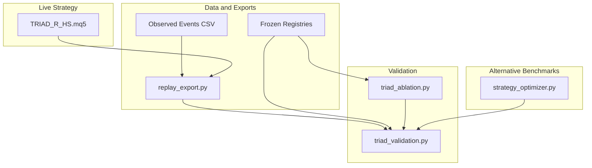
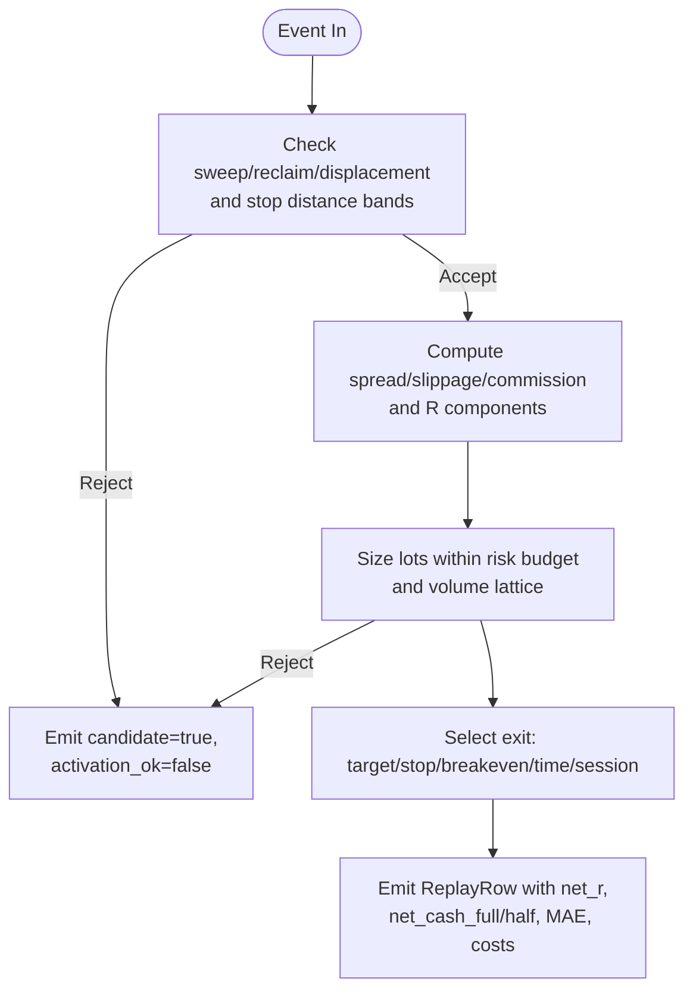
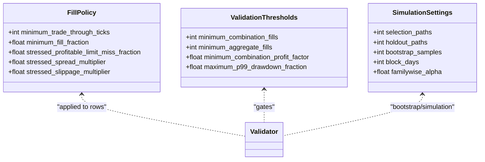
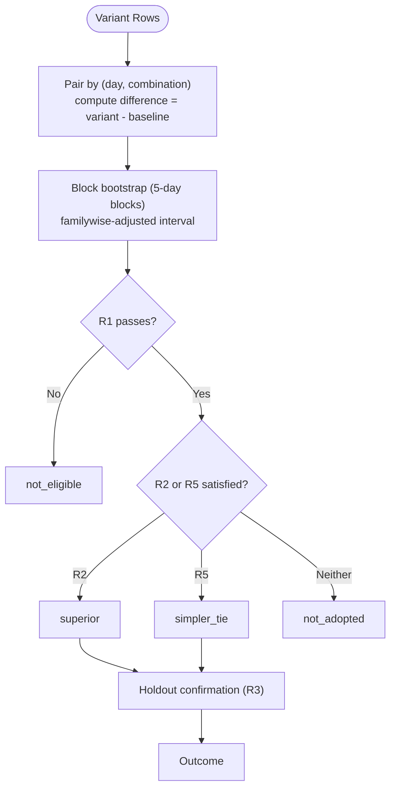
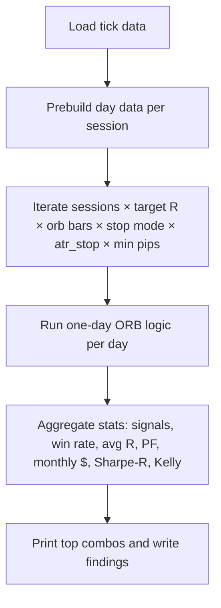
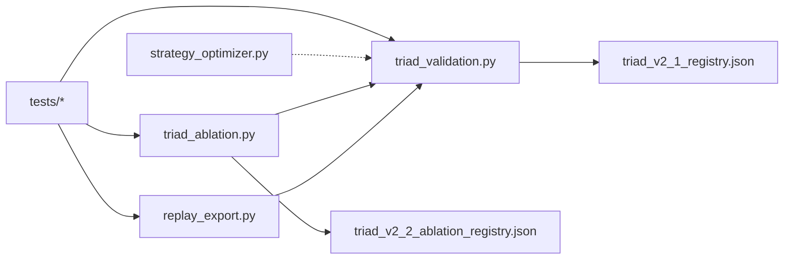

# Benchmark Comparisons and Performance Validation

<cite>
**Referenced Files in This Document**
- [triad_validation.py](file://tools/triad_validation.py)
- [triad_ablation.py](file://tools/triad_ablation.py)
- [replay_export.py](file://tools/replay_export.py)
- [strategy_optimizer.py](file://tools/strategy_optimizer.py)
- [triad_v2_1_registry.json](file://validation/triad_v2_1_registry.json)
- [triad_v2_2_ablation_registry.json](file://validation/triad_v2_2_ablation_registry.json)
- [test_validation.py](file://tests/test_validation.py)
- [test_reference.py](file://tests/test_reference.py)
- [triad_reference.py](file://tests/triad_reference.py)
- [TRIAD_R_HS.mq5](file://MQL5/Experts/TRIAD_R_HS/TRIAD_R_HS.mq5)
</cite>

## Table of Contents
1. Introduction
2. Project Structure
3. Core Components
4. Architecture Overview
5. Detailed Component Analysis
6. Dependency Analysis
7. Performance Considerations
8. Troubleshooting Guide
9. Conclusion
10. Appendices

## Introduction
This document explains how the repository evaluates strategy effectiveness against benchmarks and alternative approaches using a rigorous, preregistered validation pipeline. It covers:
- How to set up fair benchmark comparisons (buy-and-hold proxies, market indices, and alternative trading systems).
- How results are normalized across market conditions and costs.
- How transaction costs and slippage are modeled and stressed.
- How relative performance is measured and validated over time.
- How to interpret comparative metrics and make deployment decisions.

The system provides two complementary evaluation modes:
- Frozen 160-configuration selection for TRIAD-R V2.1 with strict statistical gates and holdout confirmation.
- A separate ablation research round that tests whether specific entry complexities earn their complexity by comparing variants against a frozen baseline.

## Project Structure
Key directories and files relevant to benchmarking and validation:
- tools/triad_validation.py: Registry-conformant validator, metric computation, bootstrap intervals, champion selection, phase simulation, and cost/stress modeling.
- tools/triad_ablation.py: Preregistered ablation framework that compares variants to a baseline using paired day-level differences and block bootstrap.
- tools/replay_export.py: Converts observed signal events into the exact CSV schema consumed by the validator; enforces EA-like entry/risk arithmetic and full calendar coverage.
- tools/strategy_optimizer.py: Grid-based optimizer for Opening Range Breakout strategies used as an alternative approach benchmark.
- validation/*.json: Frozen registries defining configurations, splits, thresholds, fill policies, and decision rules.
- tests/*: Unit tests validating registry integrity, replay coverage, fill policy behavior, reference math, and ablation scaffold mechanics.
- MQL5/Experts/TRIAD_R_HS/TRIAD_R_HS.mq5: Live EA implementation whose contract is mirrored by the exporter and validator.



**Diagram sources**
- [replay_export.py:1-122](file://tools/replay_export.py#L1-L122)
- [triad_validation.py:1-30](file://tools/triad_validation.py#L1-L30)
- [triad_ablation.py:1-79](file://tools/triad_ablation.py#L1-L79)
- [strategy_optimizer.py:1-34](file://tools/strategy_optimizer.py#L1-L34)
- [TRIAD_R_HS.mq5:1-15](file://MQL5/Experts/TRIAD_R_HS/TRIAD_R_HS.mq5#L1-L15)

**Section sources**
- [triad_validation.py:1-30](file://tools/triad_validation.py#L1-L30)
- [triad_ablation.py:1-79](file://tools/triad_ablation.py#L1-L79)
- [replay_export.py:1-122](file://tools/replay_export.py#L1-L122)
- [strategy_optimizer.py:1-34](file://tools/strategy_optimizer.py#L1-L34)
- [triad_v2_1_registry.json:1-15](file://validation/triad_v2_1_registry.json#L1-L15)
- [triad_v2_2_ablation_registry.json:1-39](file://validation/triad_v2_2_ablation_registry.json#L1-L39)
- [TRIAD_R_HS.mq5:1-15](file://MQL5/Experts/TRIAD_R_HS/TRIAD_R_HS.mq5#L1-L15)

## Core Components
- Replay Exporter: Translates observed events into validator-ready rows, enforcing EA-like entry/risk arithmetic, cost accounting, and full calendar coverage.
- Validator: Computes metrics per combination and aggregate, applies fill policies (including stress), performs bootstrap confidence intervals, selects champions on walk-forward data, and confirms on holdout.
- Ablation Evaluator: Compares single-element variants to a frozen baseline using paired day-level differences, block bootstrap, and predeclared decision rules (R1/R2/R5/R3/R4).
- Alternative Benchmark Optimizer: Runs grid searches over ORB strategies to provide comparative baselines (e.g., buy-and-hold proxies via session returns, index proxies via pair returns).
- Reference Math and Tests: Independent oracles for profile cash, drawdown floors, volume rounding, and session bounds; unit tests ensure integrity of registries, coverage, and logic.

**Section sources**
- [replay_export.py:51-122](file://tools/replay_export.py#L51-L122)
- [triad_validation.py:49-179](file://tools/triad_validation.py#L49-L179)
- [triad_ablation.py:17-56](file://tools/triad_ablation.py#L17-L56)
- [strategy_optimizer.py:46-70](file://tools/strategy_optimizer.py#L46-L70)
- [triad_reference.py:16-27](file://tests/triad_reference.py#L16-L27)
- [test_validation.py:80-133](file://tests/test_validation.py#L80-L133)

## Architecture Overview
End-to-end flow from raw signals to validated comparative performance:

```mermaid
sequenceDiagram
participant Upstream as "Upstream Replay"
participant Exporter as "replay_export.py"
participant Validator as "triad_validation.py"
participant Ablation as "triad_ablation.py"
participant Opt as "strategy_optimizer.py"
participant Report as "Reports"
Upstream->>Exporter : Observed events CSV
Exporter->>Validator : Registry-conformant rows
Validator->>Validator : Metric reports, bootstrap intervals
Validator->>Report : Champion selection + holdout confirmation
Upstream->>Ablation : Variant rows (single change per run)
Ablation->>Ablation : Paired day differences + bootstrap
Ablation->>Report : Superiority / Simplicity tie decisions
Opt->>Report : Alternative benchmarks (ORB grids)
```

**Diagram sources**
- [replay_export.py:105-122](file://tools/replay_export.py#L105-L122)
- [triad_validation.py:646-708](file://tools/triad_validation.py#L646-L708)
- [triad_ablation.py:676-800](file://tools/triad_ablation.py#L676-L800)
- [strategy_optimizer.py:491-530](file://tools/strategy_optimizer.py#L491-L530)

## Detailed Component Analysis

### Replay Exporter: Event-to-Row Conversion and Cost Modeling
- Enforces sweep/reclaim/displacement geometry and stop distance bands consistent with the EA contract.
- Computes all-in costs (spread, slippage, commission) and R-denominated components; solves target so net target equals configured target R after costs.
- Applies lot sizing constrained by risk budget and volume lattice; rejects if minimum volume exceeds budget.
- Produces full calendar coverage including no-candidate days to prevent selection bias.



**Diagram sources**
- [replay_export.py:510-582](file://tools/replay_export.py#L510-L582)
- [replay_export.py:584-624](file://tools/replay_export.py#L584-L624)
- [replay_export.py:626-727](file://tools/replay_export.py#L626-L727)
- [replay_export.py:729-763](file://tools/replay_export.py#L729-L763)

**Section sources**
- [replay_export.py:51-122](file://tools/replay_export.py#L51-L122)
- [replay_export.py:510-763](file://tools/replay_export.py#L510-L763)

### Validator: Metrics, Bootstrap, and Champion Selection
- Computes per-combination and aggregate metrics: fills, expectancy, profit factor, wins/losses, year robustness, and execution utilization.
- Applies conservative fill policy: requires trade-through ticks, full fills, and optionally removes profitable limits under stress while increasing spread/slippage multipliers.
- Uses 5-calendar-day moving block bootstrap to estimate confidence intervals for expectancy and paired differences; supports familywise adjustment (Bonferroni).
- Selects champion on WALK_FORWARD only; HOLDOUT outcomes cannot influence selection and are evaluated post-selection.



**Diagram sources**
- [triad_validation.py:112-179](file://tools/triad_validation.py#L112-L179)
- [triad_validation.py:130-179](file://tools/triad_validation.py#L130-L179)

**Section sources**
- [triad_validation.py:49-179](file://tools/triad_validation.py#L49-L179)
- [triad_validation.py:480-498](file://tools/triad_validation.py#L480-L498)
- [triad_validation.py:521-544](file://tools/triad_validation.py#L521-L544)
- [triad_validation.py:547-708](file://tools/triad_validation.py#L547-L708)

### Ablation Evaluator: Variant vs Baseline Comparison
- Defines fixed controls (profile, risk fraction, target R, time stop, bands) and one-change-per-variant runs.
- Builds paired day-level differences between variant and baseline; includes days where only one side has fills to capture opportunity effects.
- Applies predeclided decision rules:
  - R1: Per-variant selection gates (fills, expectancy, PF, year robustness, stress).
  - R2: Superiority via familywise-adjusted lower bound > +0.05R.
  - R5: Simplicity tie for simpler variants requiring >= 1.2x opportunity and no significant harm.
  - R3: Holdout confirmation with minimum fills on both sides.
  - R4: Conflict rule if multiple variants confirmed.



**Diagram sources**
- [triad_ablation.py:28-56](file://tools/triad_ablation.py#L28-L56)
- [triad_ablation.py:527-626](file://tools/triad_ablation.py#L527-L626)
- [triad_ablation.py:629-674](file://tools/triad_ablation.py#L629-L674)

**Section sources**
- [triad_ablation.py:17-56](file://tools/triad_ablation.py#L17-L56)
- [triad_ablation.py:188-243](file://tools/triad_ablation.py#L188-L243)
- [triad_ablation.py:676-800](file://tools/triad_ablation.py#L676-L800)

### Alternative Benchmarks: Opening Range Breakout Grid
- Provides comparative baselines by testing multiple ORB strategies across parameter grids (target R, opening bars, stop mode, ATR stops, min range width, session combos).
- Outputs leaderboards sorted by estimated monthly P&L and includes challenge simulation (Phase 1 targets, daily/overall floors).
- Useful for benchmarking against simple systematic alternatives and understanding sensitivity to stop placement and session exposure.



**Diagram sources**
- [strategy_optimizer.py:187-224](file://tools/strategy_optimizer.py#L187-L224)
- [strategy_optimizer.py:244-381](file://tools/strategy_optimizer.py#L244-L381)
- [strategy_optimizer.py:387-530](file://tools/strategy_optimizer.py#L387-L530)
- [strategy_optimizer.py:536-571](file://tools/strategy_optimizer.py#L536-L571)

**Section sources**
- [strategy_optimizer.py:46-70](file://tools/strategy_optimizer.py#L46-L70)
- [strategy_optimizer.py:244-381](file://tools/strategy_optimizer.py#L244-L381)
- [strategy_optimizer.py:491-571](file://tools/strategy_optimizer.py#L491-L571)

### Buy-and-Hold and Market Index Proxies
- While not implemented as explicit modules here, fair comparisons can be constructed using the same replay rows:
  - Buy-and-hold proxy: compute return from session start to session end (or fixed horizons like 30/45/60/90 minutes) using price_at_* fields provided by the exporter.
  - Market index proxy: use a broad FX index or major pair’s session return as a benchmark; compare strategy expectancy and drawdown against it.
- Normalize by risk: express benchmark returns in R units using the same risk budget and lot sizing conventions to enable apples-to-apples comparison.

[No sources needed since this section provides general guidance]

## Dependency Analysis
- replay_export.py depends on triad_validation types and constants to produce schema-conformant rows.
- triad_ablation.py imports triad_validation utilities for row loading, coverage checks, metrics, and fill policy application.
- triad_validation.py reads frozen registries to enforce configuration matrices, thresholds, and decision rules.
- strategy_optimizer.py is independent but produces alternative benchmarks comparable to the main strategy outputs.
- Tests validate registry integrity, replay coverage, fill policy behavior, and reference math.



**Diagram sources**
- [replay_export.py:140-150](file://tools/replay_export.py#L140-L150)
- [triad_ablation.py:112-123](file://tools/triad_ablation.py#L112-L123)
- [triad_validation.py:278-331](file://tools/triad_validation.py#L278-L331)
- [triad_v2_1_registry.json:1-15](file://validation/triad_v2_1_registry.json#L1-L15)
- [triad_v2_2_ablation_registry.json:1-39](file://validation/triad_v2_2_ablation_registry.json#L1-L39)
- [test_validation.py:80-133](file://tests/test_validation.py#L80-L133)

**Section sources**
- [replay_export.py:140-150](file://tools/replay_export.py#L140-L150)
- [triad_ablation.py:112-123](file://tools/triad_ablation.py#L112-L123)
- [triad_validation.py:278-331](file://tools/triad_validation.py#L278-L331)
- [test_validation.py:80-133](file://tests/test_validation.py#L80-L133)

## Performance Considerations
- Use block bootstrap with contiguous blocks to preserve temporal dependence when estimating confidence intervals.
- Apply familywise adjustments (Bonferroni) when comparing multiple variants to control false discovery rates.
- Stress test by increasing spread and slippage multipliers and removing a fraction of otherwise profitable limits to assess robustness.
- Ensure sufficient fills per combination and aggregate to avoid spurious conclusions; enforce minimum thresholds before adoption.
- Normalize results by expressing returns in R units and accounting for all-in costs (spread, slippage, commission) consistently across strategies.

[No sources needed since this section provides general guidance]

## Troubleshooting Guide
Common issues and resolutions:
- Missing replay coverage: Ensure every configuration and combination has rows for each server day in both WALK_FORWARD and HOLDOUT splits; no-candidate rows must be emitted for inactive days.
- Hash mismatch: Registries are hashed; any mutation invalidates them. Re-register before seeing outcomes if data ranges change.
- Fill policy rejections: Trade-through ticks and full fills are required; partial fills and touches without trade-through are excluded.
- Out-of-cut days: Rows must fall within preregistered selection and holdout windows; otherwise validation fails.
- Duplicate rows: Event CSV must have unique keys per (server_day, sequence, event_id, combination).

**Section sources**
- [triad_validation.py:440-473](file://tools/triad_validation.py#L440-L473)
- [triad_validation.py:317-331](file://tools/triad_validation.py#L317-L331)
- [triad_validation.py:480-498](file://tools/triad_validation.py#L480-L498)
- [triad_ablation.py:449-463](file://tools/triad_ablation.py#L449-L463)
- [replay_export.py:319-434](file://tools/replay_export.py#L319-L434)

## Conclusion
The repository provides a comprehensive, preregistered framework for benchmarking and validating strategy performance:
- Fair comparisons are ensured through consistent cost modeling, risk normalization, and conservative fill policies.
- Statistical rigor is achieved via block bootstrap and familywise adjustments, with clear decision rules for superiority and simplicity ties.
- Alternative benchmarks (ORB grids) and buy-and-hold/index proxies can be integrated to contextualize strategy edge.
- Deployment decisions should rely on holdout confirmation, stress resilience, and robustness across years/regimes rather than point estimates alone.

[No sources needed since this section summarizes without analyzing specific files]

## Appendices

### Setting Up Benchmark Comparisons
- Define benchmarks:
  - Buy-and-hold: compute session returns using price_at_* fields; normalize to R using strategy risk budget.
  - Market index: use a broad FX index or major pair’s session return; compare expectancy and drawdown.
  - Alternative systems: run ORB grid optimizer to generate comparable baselines.
- Normalize:
  - Express all returns in R units using identical risk fractions and lot sizing conventions.
  - Include all-in costs (spread, slippage, commission) consistently.
- Validate:
  - Ensure sufficient fills and coverage across splits.
  - Apply stress scenarios and check year robustness.

[No sources needed since this section provides general guidance]

### Interpreting Relative Performance Metrics
- Expectancy (mean net R): primary measure of edge; compare confidence intervals, not just point estimates.
- Profit factor: ratio of gross profits to gross losses; useful but secondary to expectancy under realistic costs.
- Drawdown and floors: ensure compliance with firm floors and phase targets; evaluate worst-case paths.
- Opportunity effect: paired differences capture days where variant adds fills absent in baseline; important for assessing complexity value.

[No sources needed since this section provides general guidance]

### Making Deployment Decisions
- Require:
  - Passes R1 gates on selection split.
  - Familywise-adjusted superiority or simplicity-tie with no significant harm.
  - Holdout confirmation with minimum fills on both sides.
  - Robustness across years and stress scenarios.
- Avoid:
  - Overfitting to short windows or single regimes.
  - Ignoring costs and slippage.
  - Adopting changes without fresh evidence and preregistration.

[No sources needed since this section provides general guidance]