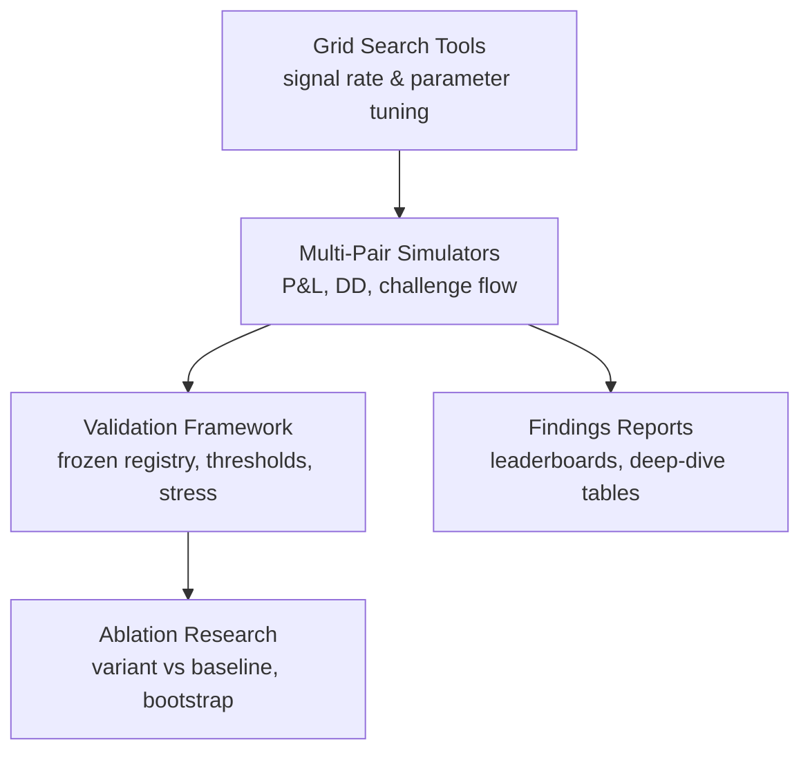
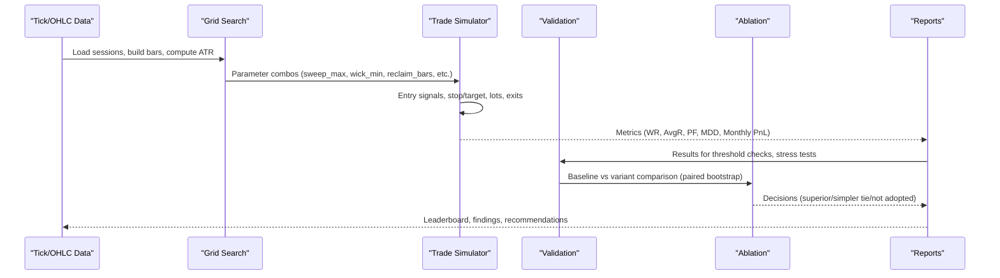
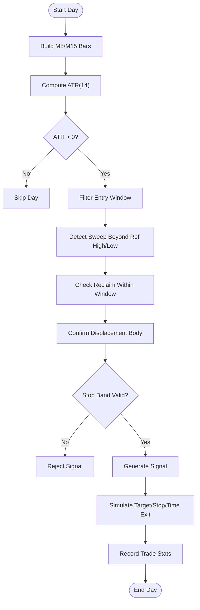
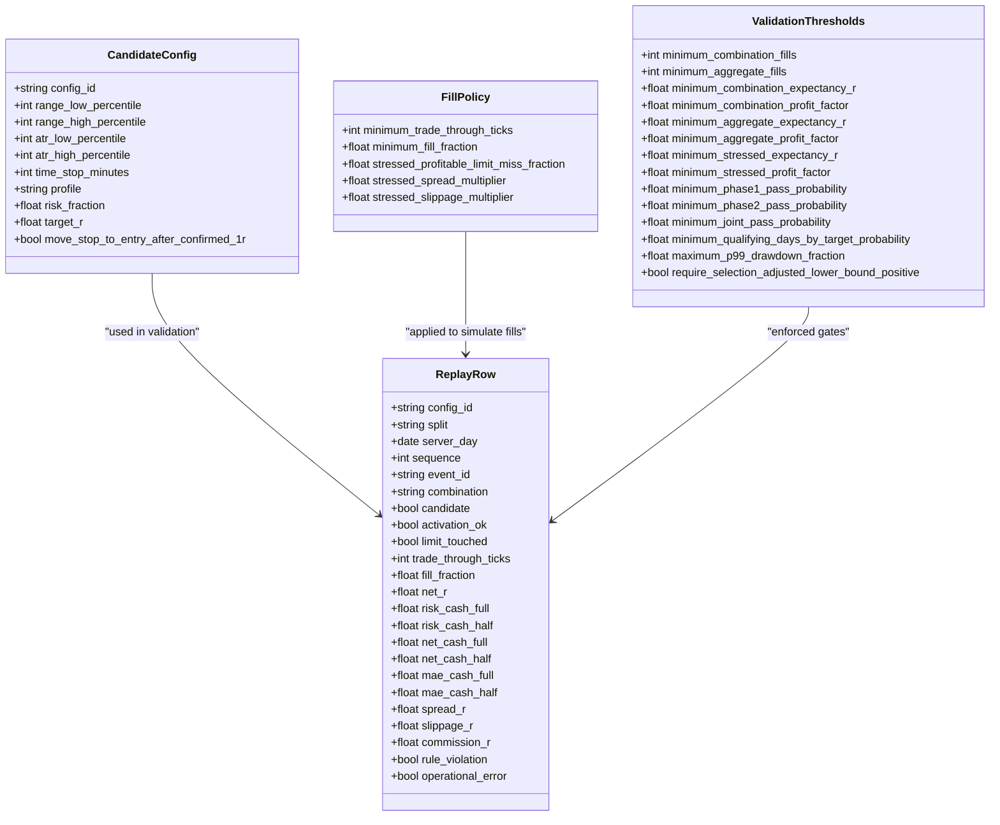
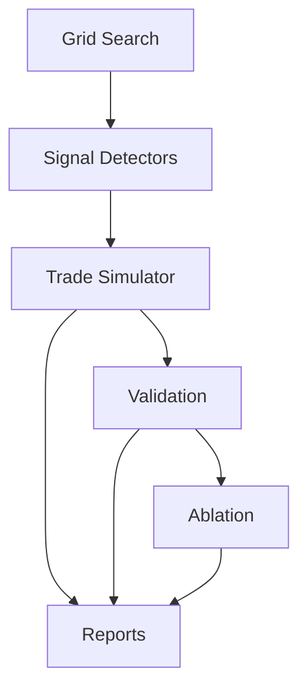

# Performance Analysis

<cite>
**Referenced Files in This Document**
- [strategy_optimizer.py](file://tools/strategy_optimizer.py)
- [aggressive_optimizer.py](file://tools/aggressive_optimizer.py)
- [extended_grid_search.py](file://tools/extended_grid_search.py)
- [multi_pair_grid_search.py](file://tools/multi_pair_grid_search.py)
- [parameter_grid_search.py](file://tools/parameter_grid_search.py)
- [triad_validation.py](file://tools/triad_validation.py)
- [triad_ablation.py](file://tools/triad_ablation.py)
- [findings_aggressive_optimizer.md](file://findings_aggressive_optimizer.md)
</cite>

## Table of Contents
1. [Introduction](#introduction)
2. [Project Structure](#project-structure)
3. [Core Components](#core-components)
4. [Architecture Overview](#architecture-overview)
5. [Detailed Component Analysis](#detailed-component-analysis)
6. [Dependency Analysis](#dependency-analysis)
7. [Performance Considerations](#performance-considerations)
8. [Troubleshooting Guide](#troubleshooting-guide)
9. [Conclusion](#conclusion)
10. [Appendices](#appendices)

## Introduction
This document explains the performance analysis methodology and how to interpret results across backtesting, forward testing, statistical analysis, and benchmark comparisons for the strategies in this repository. It focuses on:
- Backtesting outcomes from grid searches and multi-pair simulations
- Forward testing reports and challenge simulation logic
- Statistical metrics (expectancy, profit factor, drawdown, Sharpe-like ratios)
- Benchmarking against challenge targets and alternative parameter sets
- How to identify optimization opportunities and validate robustness
- Guidance for performance reviews, trade statistics analysis, and data-driven strategy modifications

The codebase provides a comprehensive toolkit for parameter exploration, signal detection, risk sizing, and rigorous validation with frozen registries and holdout splits.

## Project Structure
The performance analysis pipeline spans several tools:
- Grid search utilities for signal parameters and session combinations
- Multi-pair simulators that compute P&L, drawdowns, and challenge progression
- Validation and ablation frameworks that enforce strict selection rules, stress tests, and bootstrap inference
- Findings reports generated by optimizers

**Diagram sources**
- [multi_pair_grid_search.py:183-265](file://tools/multi_pair_grid_search.py#L183-L265)
- [aggressive_optimizer.py:334-485](file://tools/aggressive_optimizer.py#L334-L485)
- [triad_validation.py:646-708](file://tools/triad_validation.py#L646-L708)
- [triad_ablation.py:676-800](file://tools/triad_ablation.py#L676-L800)
- [findings_aggressive_optimizer.md:1-141](file://findings_aggressive_optimizer.md#L1-L141)

**Section sources**
- [multi_pair_grid_search.py:1-120](file://tools/multi_pair_grid_search.py#L1-L120)
- [aggressive_optimizer.py:1-120](file://tools/aggressive_optimizer.py#L1-L120)
- [triad_validation.py:1-180](file://tools/triad_validation.py#L1-L180)
- [triad_ablation.py:1-160](file://tools/triad_ablation.py#L1-L160)
- [findings_aggressive_optimizer.md:1-141](file://findings_aggressive_optimizer.md#L1-L141)

## Core Components
- Signal detection and parameter grids: sweep depth, wick filters, reclaim windows, displacement confirmation
- Session-aware bar building and ATR computation
- Risk sizing and lot calculation based on fixed account risk fractions
- Trade simulation with target/stop/time exits and commission modeling
- Challenge simulation enforcing daily loss limits, overall floor, qualifying days, and phase targets
- Validation framework with frozen registries, thresholds, stress scenarios, and bootstrap inference
- Ablation research comparing variants to baseline under preregistered decision rules

Key outputs include:
- Leaderboards ranking configurations by monthly P&L or fastest Phase 1 completion
- Deep-dive summaries with per-pair contributions and equity curves
- Validation reports with expectancy, profit factor, fill rates, year robustness, and stress metrics
- Ablation decisions with paired differences and familywise-adjusted confidence intervals

**Section sources**
- [strategy_optimizer.py:75-125](file://tools/strategy_optimizer.py#L75-L125)
- [aggressive_optimizer.py:122-144](file://tools/aggressive_optimizer.py#L122-L144)
- [triad_validation.py:98-147](file://tools/triad_validation.py#L98-L147)
- [triad_ablation.py:160-186](file://tools/triad_ablation.py#L160-L186)

## Architecture Overview
The system integrates parameter exploration, simulation, and validation into a cohesive workflow:

**Diagram sources**
- [multi_pair_grid_search.py:308-370](file://tools/multi_pair_grid_search.py#L308-L370)
- [aggressive_optimizer.py:334-485](file://tools/aggressive_optimizer.py#L334-L485)
- [triad_validation.py:646-708](file://tools/triad_validation.py#L646-L708)
- [triad_ablation.py:676-800](file://tools/triad_ablation.py#L676-L800)

## Detailed Component Analysis

### Backtesting Outcomes and Grid Searches
- Extended grid search evaluates sweep depth, wick minimum, and reclaim window length across sessions, reporting signal counts, rejection reasons, and annualized opportunity estimates.
- Multi-pair grid search aggregates signals across EURUSD London, GBPUSD London, USDJPY New York, providing combined portfolio views and challenge context.
- Parameter grid search measures signal rate changes for coarse sweeps and wick filters on single-pair data.

Interpretation guidance:
- Use signal rate and rejection breakdowns to refine entry filters; high “too_deep” or “weak_wick” suggests tightening or relaxing specific thresholds.
- Combine sessions to estimate realistic opportunity sets while respecting one-trade-per-day constraints.

**Section sources**
- [extended_grid_search.py:146-221](file://tools/extended_grid_search.py#L146-L221)
- [multi_pair_grid_search.py:183-265](file://tools/multi_pair_grid_search.py#L183-L265)
- [parameter_grid_search.py:85-194](file://tools/parameter_grid_search.py#L85-L194)

### Multi-Pair Strategy Simulation and Challenge Progression
- Aggressive optimizer runs three strategies (ORB with ATR-fixed stop, ORB with midpoint stop, volatility expansion), computes per-day candidates, enforces max trades per day, and simulates challenge phases with daily loss limits and overall floor.
- Outputs include win rate, average R, profit factor, maximum drawdown, estimated monthly P&L, Phase 1 pass status, and per-pair contributions.

Interpretation guidance:
- Prioritize configurations that pass Phase 1 quickly with controlled drawdown and positive expectancy.
- Review per-pair performance to understand diversification benefits and concentration risks.

**Section sources**
- [aggressive_optimizer.py:334-485](file://tools/aggressive_optimizer.py#L334-L485)
- [findings_aggressive_optimizer.md:33-93](file://findings_aggressive_optimizer.md#L33-L93)

### Statistical Analysis and Robustness Checks
- Validation framework computes expectancy, profit factor, fill rates, all-in cost R, calendar-year robustness, and stress scenarios (spread/slippage multipliers).
- Thresholds enforce minimum fills, expectancy, profit factor, and drawdown bounds; selection uses walk-forward only, then holdout evaluation after selection is complete.
- Year robustness ensures no single year dominates profits; stress tests evaluate resilience under adverse execution conditions.

Interpretation guidance:
- Treat expectancy and profit factor as primary indicators; ensure they meet thresholds across combinations.
- Use stress metrics to assess fragility; configurations failing stress are less robust.
- Calendar-year robustness indicates sustainability across regimes.

**Section sources**
- [triad_validation.py:646-708](file://tools/triad_validation.py#L646-L708)
- [triad_validation.py:521-544](file://tools/triad_validation.py#L521-L544)
- [triad_validation.py:131-147](file://tools/triad_validation.py#L131-L147)

### Ablation Research and Variant Comparison
- Ablation module defines variants that change exactly one entry element relative to a fixed baseline, with preregistered decision rules.
- Uses paired day-level differences and block bootstrap with Bonferroni adjustment to determine superiority or simplicity ties.
- Holdout confirmation requires sufficient fills and non-negative expectancy relative to baseline.

Interpretation guidance:
- Adoption requires statistically significant improvement or simpler equivalent without harm.
- Focus on variants that increase opportunity without degrading performance; complexity must be justified by measurable gains.

**Section sources**
- [triad_ablation.py:188-243](file://tools/triad_ablation.py#L188-L243)
- [triad_ablation.py:527-626](file://tools/triad_ablation.py#L527-L626)
- [triad_ablation.py:676-800](file://tools/triad_ablation.py#L676-L800)

### Backtesting Flowchart for Signal Detection

**Diagram sources**
- [multi_pair_grid_search.py:183-265](file://tools/multi_pair_grid_search.py#L183-L265)
- [extended_grid_search.py:146-221](file://tools/extended_grid_search.py#L146-L221)
- [parameter_grid_search.py:85-194](file://tools/parameter_grid_search.py#L85-L194)

### Class Diagram for Validation and Ablation Structures

**Diagram sources**
- [triad_validation.py:98-147](file://tools/triad_validation.py#L98-L147)
- [triad_validation.py:183-208](file://tools/triad_validation.py#L183-L208)

## Dependency Analysis
- Grid search tools depend on session definitions, DST handling, bar building, and ATR computation.
- Multi-pair simulators depend on signal generators, risk sizing, and challenge simulation logic.
- Validation depends on replay rows, fill policies, thresholds, and bootstrap inference.
- Ablation depends on baseline and variant row generation, paired differences, and decision rules.

**Diagram sources**
- [multi_pair_grid_search.py:308-370](file://tools/multi_pair_grid_search.py#L308-L370)
- [aggressive_optimizer.py:334-485](file://tools/aggressive_optimizer.py#L334-L485)
- [triad_validation.py:646-708](file://tools/triad_validation.py#L646-L708)
- [triad_ablation.py:676-800](file://tools/triad_ablation.py#L676-L800)

**Section sources**
- [multi_pair_grid_search.py:308-370](file://tools/multi_pair_grid_search.py#L308-L370)
- [aggressive_optimizer.py:334-485](file://tools/aggressive_optimizer.py#L334-L485)
- [triad_validation.py:646-708](file://tools/triad_validation.py#L646-L708)
- [triad_ablation.py:676-800](file://tools/triad_ablation.py#L676-L800)

## Performance Considerations
- Fixed lot sizing prevents compounding blow-up during drawdown sequences and aligns with challenge constraints.
- Max trades per day reduces correlated exposure and stabilizes daily P&L variance.
- ATR-based stops decouple stop size from opening range width, improving risk-reward symmetry.
- Stress testing (spread/slippage multipliers) reveals execution sensitivity; configurations failing stress are fragile.
- Calendar-year robustness ensures profits are not concentrated in a single regime.

Recommendations:
- Prefer configurations with positive expectancy, acceptable profit factor, and low drawdown.
- Validate against stress scenarios before deployment.
- Use ablation results to simplify entries when complexity does not yield significant gains.

[No sources needed since this section provides general guidance]

## Troubleshooting Guide
Common issues and resolutions:
- Missing tick files: Ensure history data paths exist and match expected naming conventions.
- Zero ATR: Days with insufficient pre-session bars will skip signals; verify data coverage and session boundaries.
- No signals: Check sweep depth and wick thresholds; adjust parameters based on rejection breakdowns.
- Validation errors: Ensure replay CSV schema matches requirements and all combinations have complete day coverage.
- Bootstrap failures: Insufficient paired days or zero fills can prevent interval computation; expand data or relax filters.

**Section sources**
- [multi_pair_grid_search.py:272-301](file://tools/multi_pair_grid_search.py#L272-L301)
- [triad_validation.py:360-437](file://tools/triad_validation.py#L360-L437)
- [triad_ablation.py:562-626](file://tools/triad_ablation.py#L562-L626)

## Conclusion
The repository provides a robust performance analysis framework combining parameter grid searches, multi-pair simulations, and rigorous validation with frozen registries and stress tests. Key takeaways:
- Use signal rate and rejection breakdowns to tune entry filters.
- Prioritize configurations with positive expectancy, acceptable profit factor, and controlled drawdown.
- Validate robustness via stress tests and calendar-year analysis.
- Adopt ablation insights to simplify strategies when complexity does not improve outcomes.
- Forward-test top configurations on demo accounts before live deployment.

[No sources needed since this section summarizes without analyzing specific files]

## Appendices

### Performance Metrics Reference
- Win Rate: Proportion of winning trades among filled trades
- Average R: Mean net P&L normalized by risk per trade
- Profit Factor: Gross wins divided by gross losses
- Maximum Drawdown: Peak-to-trough decline in equity
- Estimated Monthly P&L: Annualized cash flow scaled to trading days
- Sharpe-like Ratio: Average R divided by standard deviation of R
- Qualifying Days: Days meeting minimum net P&L threshold for challenge phases

**Section sources**
- [aggressive_optimizer.py:443-485](file://tools/aggressive_optimizer.py#L443-L485)
- [triad_validation.py:646-708](file://tools/triad_validation.py#L646-L708)

### Benchmark Comparisons
- Compare configurations against challenge targets (Phase 1/2 progress, daily loss limits, overall floor)
- Benchmark per-pair contributions to understand diversification effects
- Use ablation results to compare baseline vs simplified variants

**Section sources**
- [findings_aggressive_optimizer.md:33-93](file://findings_aggressive_optimizer.md#L33-L93)
- [triad_ablation.py:676-800](file://tools/triad_ablation.py#L676-L800)