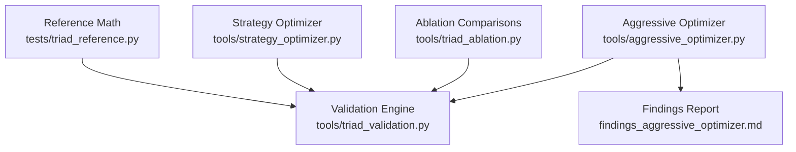
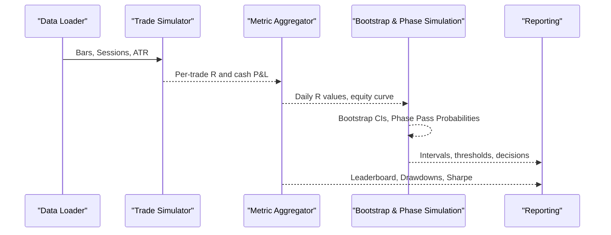
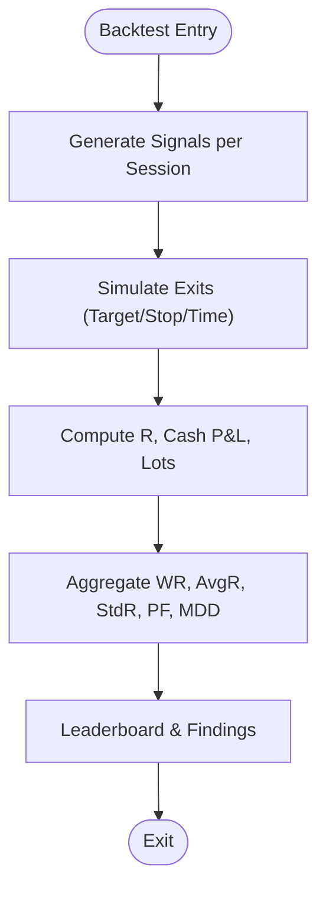
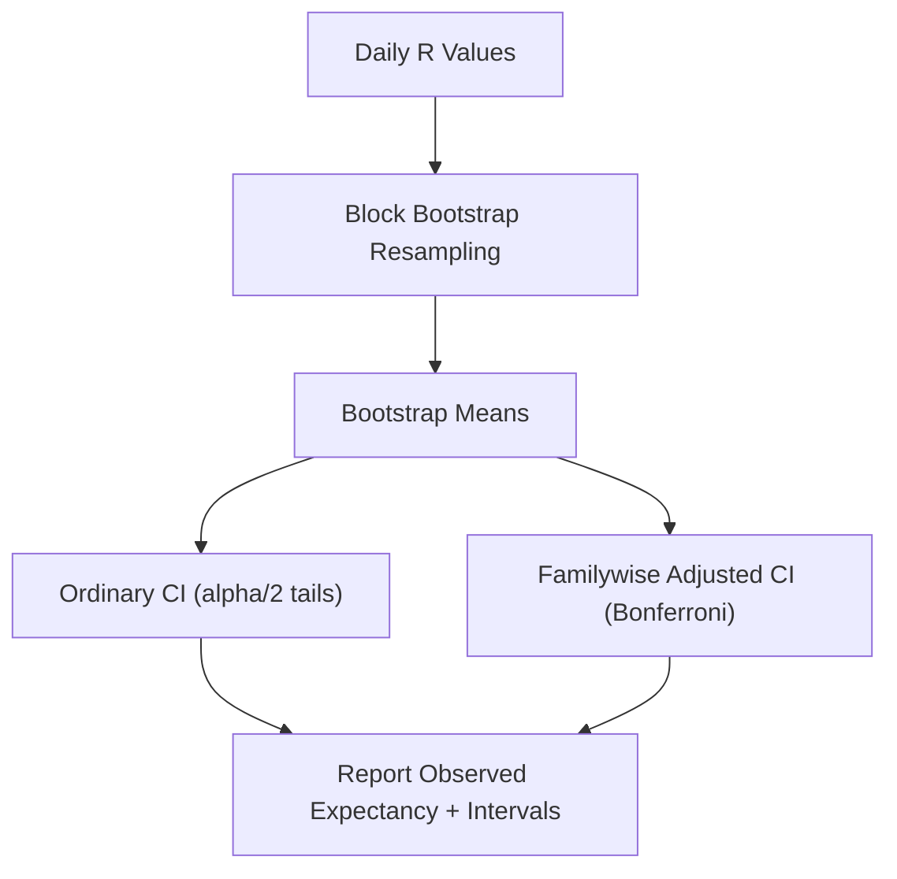
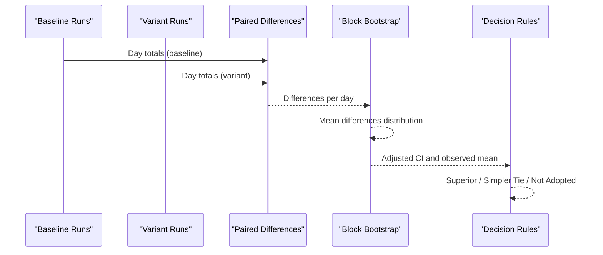
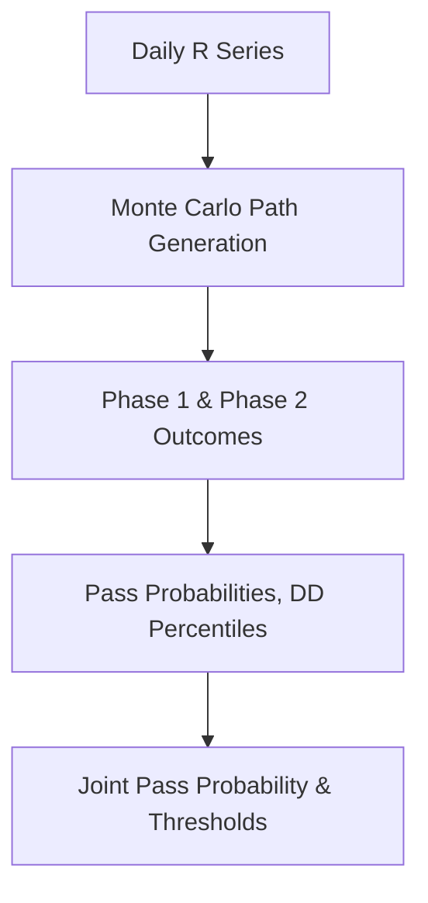
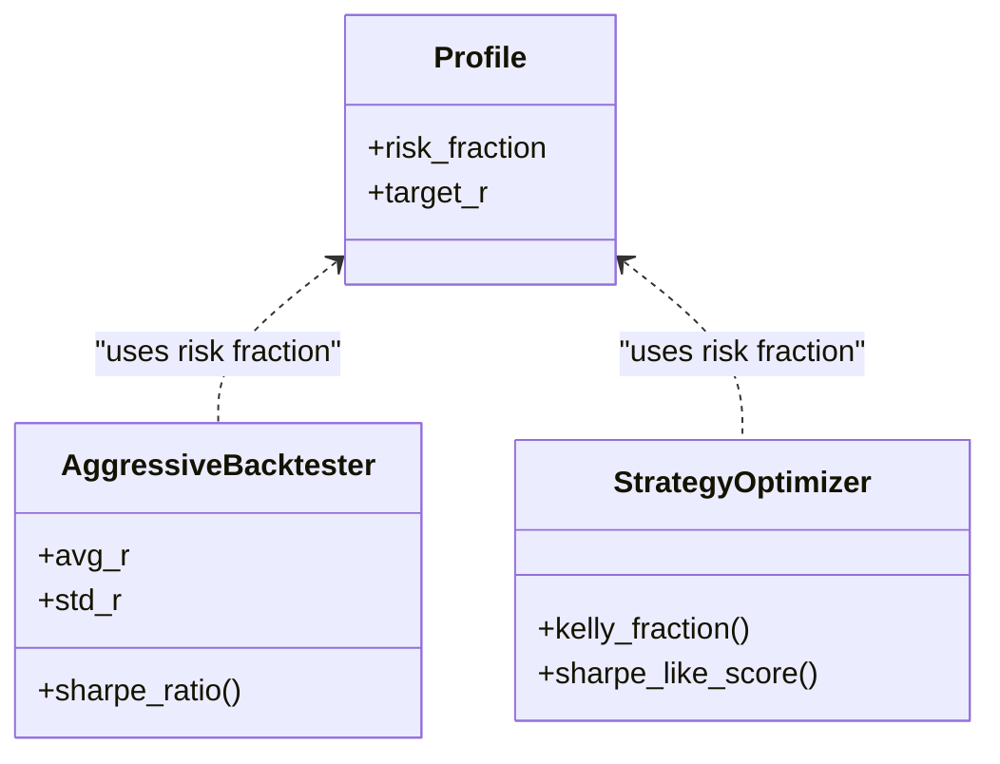
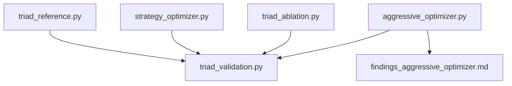

# Statistical Analysis and Metrics

<cite>
**Referenced Files in This Document**
- [aggressive_optimizer.py](file://tools/aggressive_optimizer.py)
- [triad_validation.py](file://tools/triad_validation.py)
- [triad_ablation.py](file://tools/triad_ablation.py)
- [strategy_optimizer.py](file://tools/strategy_optimizer.py)
- [triad_reference.py](file://tests/triad_reference.py)
- [findings_aggressive_optimizer.md](file://findings_aggressive_optimizer.md)
</cite>

## Table of Contents
1. [Introduction](#introduction)
2. [Project Structure](#project-structure)
3. [Core Components](#core-components)
4. [Architecture Overview](#architecture-overview)
5. [Detailed Component Analysis](#detailed-component-analysis)
6. [Dependency Analysis](#dependency-analysis)
7. [Performance Considerations](#performance-considerations)
8. [Troubleshooting Guide](#troubleshooting-guide)
9. [Conclusion](#conclusion)
10. [Appendices](#appendices)

## Introduction
This document explains the statistical analysis methodologies and performance metrics used across the TRIAD-R system, with a focus on how edge is quantified, validated, and protected against overfitting. It covers:
- Probability distributions and confidence intervals for expectancy and paired differences
- Significance testing via block bootstrap and Bonferroni familywise adjustment
- Key metrics such as expected value (expectancy), variance, standard deviation, correlation-aware risk aggregation, and risk-adjusted returns
- Practical guidance to interpret outputs, detect overfitting risks, and validate strategy edge
- Examples of common analyses performed on trading strategies and their implications for risk management and position sizing

The content synthesizes implementations found in the optimizer and validation tooling, ensuring all claims map to concrete code paths.

## Project Structure
The statistical engine spans several modules:
- Aggressive multi-pair backtesting and metric computation
- Validation routines that compute expectancy intervals, phase pass probabilities, and drawdown statistics
- Ablation tools that compare variants using paired day-level differences and block bootstrap
- Reference math for deterministic contract arithmetic and session handling

**Diagram sources**
- [aggressive_optimizer.py:334-485](file://tools/aggressive_optimizer.py#L334-L485)
- [triad_validation.py:1469-1522](file://tools/triad_validation.py#L1469-L1522)
- [triad_ablation.py:562-626](file://tools/triad_ablation.py#L562-L626)
- [strategy_optimizer.py:1-200](file://tools/strategy_optimizer.py#L1-L200)
- [triad_reference.py:61-131](file://tests/triad_reference.py#L61-L131)
- [findings_aggressive_optimizer.md:1-141](file://findings_aggressive_optimizer.md#L1-L141)

**Section sources**
- [aggressive_optimizer.py:334-485](file://tools/aggressive_optimizer.py#L334-L485)
- [triad_validation.py:1469-1522](file://tools/triad_validation.py#L1469-L1522)
- [triad_ablation.py:562-626](file://tools/triad_ablation.py#L562-L626)
- [strategy_optimizer.py:1-200](file://tools/strategy_optimizer.py#L1-L200)
- [triad_reference.py:61-131](file://tests/triad_reference.py#L61-L131)
- [findings_aggressive_optimizer.md:1-141](file://findings_aggressive_optimizer.md#L1-L141)

## Core Components
- Aggressive backtester computes per-trade R-based outcomes, aggregates win rate, average R, profit factor, monthly P&L, Sharpe-like ratio, and maximum drawdown. It also tracks qualifying days and phase targets for challenge simulation.
- Validation module provides:
  - Block bootstrap for expectancy confidence intervals with Bonferroni familywise adjustment
  - Phase simulation with Monte Carlo path generation to estimate pass probabilities and drawdown percentiles
  - Wilson score intervals for binomial proportions (e.g., win rate)
- Ablation module compares baseline vs variant using paired day-level differences and block bootstrap to produce significance-adjusted confidence intervals.
- Strategy optimizer computes additional risk-adjusted metrics including Kelly fraction and Sharpe-like scores across parameter grids.
- Reference module defines deterministic profiles, risk fractions, phase targets, and session bounds used by validation and simulations.

**Section sources**
- [aggressive_optimizer.py:443-485](file://tools/aggressive_optimizer.py#L443-L485)
- [triad_validation.py:1075-1123](file://tools/triad_validation.py#L1075-L1123)
- [triad_validation.py:1124-1160](file://tools/triad_validation.py#L1124-L1160)
- [triad_validation.py:1469-1522](file://tools/triad_validation.py#L1469-L1522)
- [triad_ablation.py:562-626](file://tools/triad_ablation.py#L562-L626)
- [strategy_optimizer.py:1-200](file://tools/strategy_optimizer.py#L1-L200)
- [triad_reference.py:61-131](file://tests/triad_reference.py#L61-L131)

## Architecture Overview
The system follows a layered architecture:
- Data ingestion and preprocessing (bars, sessions, ATR)
- Signal generation and trade simulation (bar-level exits)
- Metric aggregation (R-based statistics, drawdowns, phase gates)
- Statistical inference (bootstrap CIs, phase pass probabilities, paired comparisons)
- Reporting and decision rules (leaderboards, ablation decisions, findings)

**Diagram sources**
- [aggressive_optimizer.py:149-207](file://tools/aggressive_optimizer.py#L149-L207)
- [aggressive_optimizer.py:294-328](file://tools/aggressive_optimizer.py#L294-L328)
- [aggressive_optimizer.py:334-485](file://tools/aggressive_optimizer.py#L334-L485)
- [triad_validation.py:1469-1522](file://tools/triad_validation.py#L1469-L1522)
- [triad_validation.py:1124-1160](file://tools/triad_validation.py#L1124-L1160)

## Detailed Component Analysis

### Aggressive Backtester Statistics
- Computes per-trade net R and cash P&L, then aggregates:
  - Win rate, average R, standard deviation of R
  - Profit factor (gross wins / gross losses)
  - Monthly P&L estimate based on trading days
  - Sharpe-like ratio as average R divided by standard deviation of R
  - Maximum drawdown computed from running peak equity
- Uses fixed lot sizing tied to initial balance to avoid compounding blow-up during drawdown sequences.

**Diagram sources**
- [aggressive_optimizer.py:226-288](file://tools/aggressive_optimizer.py#L226-L288)
- [aggressive_optimizer.py:294-328](file://tools/aggressive_optimizer.py#L294-L328)
- [aggressive_optimizer.py:334-485](file://tools/aggressive_optimizer.py#L334-L485)

**Section sources**
- [aggressive_optimizer.py:443-485](file://tools/aggressive_optimizer.py#L443-L485)
- [aggressive_optimizer.py:213-220](file://tools/aggressive_optimizer.py#L213-L220)
- [aggressive_optimizer.py:334-485](file://tools/aggressive_optimizer.py#L334-L485)

### Expectancy Confidence Intervals via Block Bootstrap
- The validation module builds daily R values from replay rows and performs moving-calendar-day block bootstrap to estimate confidence intervals around observed expectancy.
- Ordinary and familywise-adjusted intervals are produced; the latter applies Bonferroni correction across multiple comparisons (family_size).
- Percentile function interpolates ordered bootstrap means to obtain interval bounds.

**Diagram sources**
- [triad_validation.py:1469-1522](file://tools/triad_validation.py#L1469-L1522)
- [triad_validation.py:1075-1086](file://tools/triad_validation.py#L1075-L1086)

**Section sources**
- [triad_validation.py:1469-1522](file://tools/triad_validation.py#L1469-L1522)
- [triad_validation.py:1075-1086](file://tools/triad_validation.py#L1075-L1086)

### Paired Ablation Comparison with Significance Adjustment
- Compares baseline vs variant by computing per-day paired differences (net R totals per combination).
- Uses block bootstrap on day means to estimate mean difference and confidence intervals, with Bonferroni familywise adjustment.
- Decision logic evaluates whether adjusted lower bound exceeds acceptance threshold or if simpler tie criteria are met.

**Diagram sources**
- [triad_ablation.py:530-559](file://tools/triad_ablation.py#L530-L559)
- [triad_ablation.py:562-626](file://tools/triad_ablation.py#L562-L626)
- [triad_ablation.py:629-673](file://tools/triad_ablation.py#L629-L673)

**Section sources**
- [triad_ablation.py:530-559](file://tools/triad_ablation.py#L530-L559)
- [triad_ablation.py:562-626](file://tools/triad_ablation.py#L562-L626)
- [triad_ablation.py:629-673](file://tools/triad_ablation.py#L629-L673)

### Phase Simulation and Pass Probabilities
- Monte Carlo simulation generates multiple phase paths using daily R values and block sampling.
- Tracks phase completion, joint pass probability across phases, drawdown percentiles, and time-in-drawdown metrics.
- Uses Wilson score intervals for reporting confidence bounds on binomial outcomes where applicable.

**Diagram sources**
- [triad_validation.py:1124-1160](file://tools/triad_validation.py#L1124-L1160)
- [triad_validation.py:1089-1123](file://tools/triad_validation.py#L1089-L1123)

**Section sources**
- [triad_validation.py:1124-1160](file://tools/triad_validation.py#L1124-L1160)
- [triad_validation.py:1089-1123](file://tools/triad_validation.py#L1089-L1123)

### Risk-Adjusted Returns and Position Sizing
- Sharpe-like ratio computed as average R divided by standard deviation of R in aggressive backtester.
- Kelly fraction computed in strategy optimizer to suggest optimal bet sizing under constraints.
- Fixed risk fraction per trade (Profile A) and phase targets defined in reference module ensure consistent risk budgeting.

**Diagram sources**
- [triad_reference.py:16-27](file://tests/triad_reference.py#L16-L27)
- [aggressive_optimizer.py:443-485](file://tools/aggressive_optimizer.py#L443-L485)
- [strategy_optimizer.py:1-200](file://tools/strategy_optimizer.py#L1-L200)

**Section sources**
- [triad_reference.py:61-131](file://tests/triad_reference.py#L61-L131)
- [aggressive_optimizer.py:443-485](file://tools/aggressive_optimizer.py#L443-L485)
- [strategy_optimizer.py:1-200](file://tools/strategy_optimizer.py#L1-L200)

### Correlation-Aware Risk Aggregation Guidance
- While explicit correlation matrices are not computed in these modules, the design enforces limits on correlated exposure:
  - Max trades per day and per symbol reduce simultaneous correlated risk.
  - Research notes identify clusters (e.g., EURUSD/GBPUSD) and recommend combined risk caps.
- For rigorous correlation analysis, extend the pipeline to compute pairwise correlations of daily returns and adjust position sizing accordingly.

[No sources needed since this section provides general guidance]

## Dependency Analysis
- Aggressive backtester depends on data loaders, signal generators, and simulators to produce R-based metrics.
- Validation module depends on replay rows and fill policies to compute bootstrap intervals and phase simulations.
- Ablation module depends on paired day totals and bootstrap routines to compare variants with significance adjustments.
- Reference module provides deterministic constants and session boundaries consumed by validation and simulations.

**Diagram sources**
- [aggressive_optimizer.py:334-485](file://tools/aggressive_optimizer.py#L334-L485)
- [triad_validation.py:1469-1522](file://tools/triad_validation.py#L1469-L1522)
- [triad_ablation.py:562-626](file://tools/triad_ablation.py#L562-L626)
- [strategy_optimizer.py:1-200](file://tools/strategy_optimizer.py#L1-L200)
- [triad_reference.py:61-131](file://tests/triad_reference.py#L61-L131)
- [findings_aggressive_optimizer.md:1-141](file://findings_aggressive_optimizer.md#L1-L141)

**Section sources**
- [aggressive_optimizer.py:334-485](file://tools/aggressive_optimizer.py#L334-L485)
- [triad_validation.py:1469-1522](file://tools/triad_validation.py#L1469-L1522)
- [triad_ablation.py:562-626](file://tools/triad_ablation.py#L562-L626)
- [strategy_optimizer.py:1-200](file://tools/strategy_optimizer.py#L1-L200)
- [triad_reference.py:61-131](file://tests/triad_reference.py#L61-L131)
- [findings_aggressive_optimizer.md:1-141](file://findings_aggressive_optimizer.md#L1-L141)

## Performance Considerations
- Use block bootstrap with appropriate block sizes to preserve temporal dependence in financial time series.
- Limit family size in Bonferroni adjustments to control false discovery rate when comparing multiple configurations.
- Ensure sufficient sample sizes (usable samples) for stable confidence intervals; sparse strategies may yield zero-fill replicates and should be excluded explicitly.
- Monitor maximum drawdown and phase pass probabilities to guard against overleveraging and regime shifts.

[No sources needed since this section provides general guidance]

## Troubleshooting Guide
- If bootstrap yields no usable samples, verify daily R series contain fills and that block resampling windows are valid.
- If phase pass probabilities are unstable, increase Monte Carlo paths and check drawdown thresholds and weekly stop logic.
- If paired ablation intervals are empty, confirm paired day coverage across baseline and variant runs.
- Validate session boundaries and DST offsets to avoid misaligned entry windows.

**Section sources**
- [triad_validation.py:1469-1522](file://tools/triad_validation.py#L1469-L1522)
- [triad_validation.py:1124-1160](file://tools/triad_validation.py#L1124-L1160)
- [triad_ablation.py:562-626](file://tools/triad_ablation.py#L562-L626)

## Conclusion
The TRIAD-R system employs robust statistical methods to quantify and validate strategy edge:
- R-based metrics provide normalized performance measures independent of account size
- Block bootstrap with Bonferroni adjustment delivers statistically sound confidence intervals
- Monte Carlo phase simulations estimate practical pass probabilities and drawdown risks
- Paired ablation comparisons isolate incremental improvements with significance controls
These techniques support disciplined risk management, informed position sizing, and reliable strategy selection while mitigating overfitting risks.

[No sources needed since this section summarizes without analyzing specific files]

## Appendices

### Interpreting Statistical Outputs
- Expectancy (average R): Positive and stable across bootstrap intervals indicates edge; wide intervals suggest insufficient data or high variability.
- Confidence intervals: Familywise-adjusted intervals are conservative; use them to decide adoption only if lower bounds exceed acceptance thresholds.
- Phase pass probabilities: Joint pass probability reflects realistic challenge success rates; low values indicate fragility under constraints.
- Drawdown percentiles: P95/P99 drawdowns help assess tail risk; ensure they remain within firm limits.

[No sources needed since this section provides general guidance]

### Common Analyses and Implications
- Win rate vs average R: High win rate alone is insufficient; combine with average R and profit factor to assess profitability.
- Sharpe-like ratio: Higher ratios imply smoother equity curves; useful for comparing strategies with different volatility profiles.
- Kelly fraction: Suggests optimal bet sizing under idealized assumptions; apply half-Kelly or constrained sizing in practice to reduce risk.
- Correlation clusters: Group correlated pairs and cap combined risk to prevent concentrated exposure.

[No sources needed since this section provides general guidance]