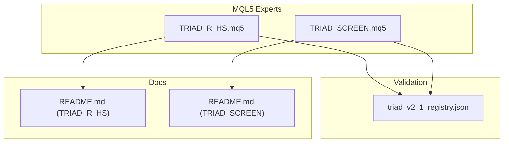
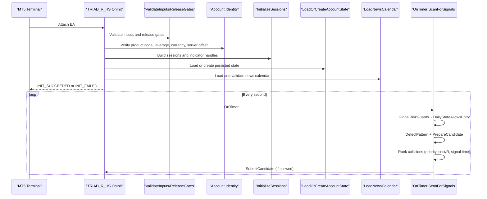
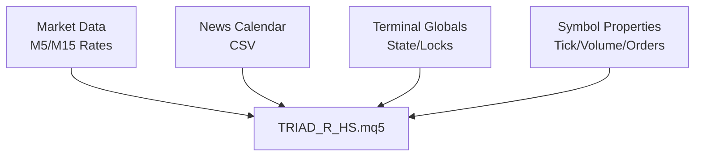

# Configuration Parameters

<cite>
**Referenced Files in This Document**
- [TRIAD_R_HS.mq5](file://MQL5/Experts/TRIAD_R_HS/TRIAD_R_HS.mq5)
- [TRIAD_SCREEN.mq5](file://MQL5/Experts/TRIAD_SCREEN/TRIAD_SCREEN.mq5)
- [triad_v2_1_registry.json](file://validation/triad_v2_1_registry.json)
- [README.md (TRIAD_R_HS)](file://MQL5/Experts/TRIAD_R_HS/README.md)
- [README.md (TRIAD_SCREEN)](file://MQL5/Experts/TRIAD_SCREEN/README.md)
</cite>

## Table of Contents
1. Introduction
2. Project Structure
3. Core Components
4. Architecture Overview
5. Detailed Component Analysis
6. Dependency Analysis
7. Performance Considerations
8. Troubleshooting Guide
9. Conclusion
10. Appendices

## Introduction
This document provides comprehensive documentation for all TRIAD-R Expert Advisor configuration parameters, focusing on the production EA (TRIAD_R_HS) and the screening tool (TRIAD_SCREEN). It covers session settings, instrument configurations, risk parameters, safety controls, validation rules, default values, recommended settings for different trading scenarios, parameter dependencies, migration procedures between profile versions, and safe modification/testing guidance.

The TRIAD-R strategy is a research implementation with strict fail-closed behavior by default. Order submission is disabled unless explicitly enabled and validated through multiple gates. The screening tool mirrors many of the same inputs to allow demo testing and dashboarding without production safety machinery.

## Project Structure
The repository contains two MQL5 Experts:
- TRIAD_R_HS: canonical production EA with full safety, lifecycle locks, state persistence, and news calendar enforcement.
- TRIAD_SCREEN: demo-only screening EA that ports the V2.1 entry logic and challenge dashboard but omits production safety machinery.

**Diagram sources**
- [TRIAD_R_HS.mq5:1-120](file://MQL5/Experts/TRIAD_R_HS/TRIAD_R_HS.mq5#L1-L120)
- [TRIAD_SCREEN.mq5:1-160](file://MQL5/Experts/TRIAD_SCREEN/TRIAD_SCREEN.mq5#L1-L160)
- [triad_v2_1_registry.json:1-120](file://validation/triad_v2_1_registry.json#L1-L120)
- [README.md (TRIAD_R_HS):1-120](file://MQL5/Experts/TRIAD_R_HS/README.md#L1-L120)
- [README.md (TRIAD_SCREEN):1-80](file://MQL5/Experts/TRIAD_SCREEN/README.md#L1-L80)

**Section sources**
- [TRIAD_R_HS.mq5:1-120](file://MQL5/Experts/TRIAD_R_HS/TRIAD_R_HS.mq5#L1-L120)
- [TRIAD_SCREEN.mq5:1-160](file://MQL5/Experts/TRIAD_SCREEN/TRIAD_SCREEN.mq5#L1-L160)
- [triad_v2_1_registry.json:1-120](file://validation/triad_v2_1_registry.json#L1-L120)
- [README.md (TRIAD_R_HS):1-120](file://MQL5/Experts/TRIAD_R_HS/README.md#L1-L120)
- [README.md (TRIAD_SCREEN):1-80](file://MQL5/Experts/TRIAD_SCREEN/README.md#L1-L80)

## Core Components
- Session management: London and New York windows with range and entry boundaries derived from civil time and DST-aware offsets.
- Instrument configuration: EURUSD/London, GBPUSD/London, USDJPY/New York with symbol validation and priority-based collision handling.
- Risk parameters: Profiles A–D define risk fraction and target R; internal daily/weekly stops; drawdown reduce/shutdown thresholds; firm floor reserve.
- Safety controls: News calendar enforcement, quote freshness, request latency caps, instance lock, halt latches, external cashflow detection, and account identity verification.
- Validation: Input contract checks enforce revision 2.1 defaults and ranges; release gates require operator attestations before live order submission.

Key input categories:
- Safety and account identity: enable submission, product code, authorized login/server/currency/leverage, phase, lifecycle lock, fresh-state/halt reset flags.
- Fixed server/calendar controls: UTC offset, news blackout/flat minutes, required coverage hours, quote age/deviation limits, request latency caps, mid-session skip.
- Instruments: symbols per sleeve, enable flags, priorities, per-sleeve gates.
- Coarse research candidates: profiles, percentile bands, comparable sessions, time stop, breakeven move, H1 EMA bias filter.
- Fixed entry/risk definitions: sweep ATR bounds, reclaim bars/width, displacement body, limit expiry, stop buffer/ATR bounds, cost-to-R, spread multiplier, commission, slippage reserves, drawdown tiers, firm floor reserve.
- Logging: verbosity, file prefix, inactivity alert threshold.

**Section sources**
- [TRIAD_R_HS.mq5:52-150](file://MQL5/Experts/TRIAD_R_HS/TRIAD_R_HS.mq5#L52-L150)
- [TRIAD_SCREEN.mq5:86-156](file://MQL5/Experts/TRIAD_SCREEN/TRIAD_SCREEN.mq5#L86-L156)
- [triad_v2_1_registry.json:1-120](file://validation/triad_v2_1_registry.json#L1-L120)

## Architecture Overview
The EA initializes with strict input validation, account identity checks, and session setup. It loads or creates persisted account state, enforces news calendar availability, and acquires an instance lock for live mode. On each timer tick, it scans enabled sessions, detects patterns, prepares candidates, ranks collisions, and submits orders only if all guards pass. Daily/weekly governors and drawdown controls manage exposure and can force exits.

**Diagram sources**
- [TRIAD_R_HS.mq5:4105-4216](file://MQL5/Experts/TRIAD_R_HS/TRIAD_R_HS.mq5#L4105-L4216)
- [TRIAD_R_HS.mq5:3536-3597](file://MQL5/Experts/TRIAD_R_HS/TRIAD_R_HS.mq5#L3536-L3597)
- [TRIAD_R_HS.mq5:3599-3614](file://MQL5/Experts/TRIAD_R_HS/TRIAD_R_HS.mq5#L3599-L3614)
- [TRIAD_R_HS.mq5:3616-3731](file://MQL5/Experts/TRIAD_R_HS/TRIAD_R_HS.mq5#L3616-L3731)
- [TRIAD_R_HS.mq5:3765-3948](file://MQL5/Experts/TRIAD_R_HS/TRIAD_R_HS.mq5#L3765-L3948)
- [TRIAD_R_HS.mq5:3950-4001](file://MQL5/Experts/TRIAD_R_HS/TRIAD_R_HS.mq5#L3950-L4001)
- [TRIAD_R_HS.mq5:4003-4099](file://MQL5/Experts/TRIAD_R_HS/TRIAD_R_HS.mq5#L4003-L4099)

## Detailed Component Analysis

### Session Settings
- Window types: London (range 00:00–07:00 local, entry 07:00–11:00) and New York (reference range previous day 07:00–13:00 local, entry 08:30–11:00).
- Time conversion: DST-aware UTC conversions for London and New York; server offset configured via expected UTC offset hours.
- Fresh mid-session start: skipping reconstruction when attached inside the entry window after first bar.

Recommended settings:
- Keep InpExpectedServerUtcOffsetHours at broker’s actual offset (default 3).
- Use InpSkipFreshMidSessionStart=true to avoid stale events.
- Ensure sufficient history for ComparableStatistics (InpComparableSessions=60).

**Section sources**
- [TRIAD_R_HS.mq5:624-779](file://MQL5/Experts/TRIAD_R_HS/TRIAD_R_HS.mq5#L624-L779)
- [TRIAD_SCREEN.mq5:583-749](file://MQL5/Experts/TRIAD_SCREEN/TRIAD_SCREEN.mq5#L583-L749)
- [TRIAD_R_HS.mq5:3572-3580](file://MQL5/Experts/TRIAD_R_HS/TRIAD_R_HS.mq5#L3572-L3580)

### Instrument Configurations
- Symbols: EURUSD (London), GBPUSD (London), USDJPY (New York). Each has enable flags and priority for collision resolution.
- Symbol validation: base/profit currency mapping, order capabilities, tick size, volume constraints.
- Priorities: locked 1–3 range; ties resolved by lower cost/R, earlier signal, stable index.

Recommended settings:
- Enable only intended sleeves; ensure unique symbols.
- Set priorities based on offline selection; do not tune at runtime.

**Section sources**
- [TRIAD_R_HS.mq5:92-105](file://MQL5/Experts/TRIAD_R_HS/TRIAD_R_HS.mq5#L92-L105)
- [TRIAD_R_HS.mq5:3616-3652](file://MQL5/Experts/TRIAD_R_HS/TRIAD_R_HS.mq5#L3616-L3652)
- [TRIAD_R_HS.mq5:3586-3593](file://MQL5/Experts/TRIAD_R_HS/TRIAD_R_HS.mq5#L3586-L3593)

### Risk Parameters
- Profiles A–D: risk fractions 0.4%, 0.35%, 0.3%, 0.25%; target R 1.5, 1.75, 2.0, 2.5.
- Internal daily stop percent: 0–1% (default 1%).
- Internal weekly stop percent: 0–2% (default 2%).
- Drawdown reduce percent: fixed 2%.
- Drawdown shutdown percent: fixed 5%.
- Firm floor reserve percent: minimum 0.5%.

Recommended settings:
- Choose profile based on risk tolerance and historical performance; keep other risk guards at defaults.
- Do not modify drawdown reduce/shutdown; they are revision-contracted.

**Section sources**
- [triad_v2_1_registry.json:1-120](file://validation/triad_v2_1_registry.json#L1-L120)
- [TRIAD_R_HS.mq5:121-140](file://MQL5/Experts/TRIAD_R_HS/TRIAD_R_HS.mq5#L121-L140)
- [TRIAD_R_HS.mq5:3581-3585](file://MQL5/Experts/TRIAD_R_HS/TRIAD_R_HS.mq5#L3581-L3585)

### Safety Controls
- News calendar: required for live mode; enforces RED/HIGH events and explicit coverage declaration; blocks entries during blackout windows.
- Quote freshness: max quote age seconds (default 10); deviation points cap (default 20).
- Request throttling: max non-emergency requests per day (default 20); max trade request latency ms (default 1000).
- Instance lock: prevents duplicate live instances; heartbeat fencing.
- External cashflow detection: halts and requires rebaseline on deposits/withdrawals/unauthorized deals.
- Account identity: product code, authorized login/server/currency/leverage, hedging mode, autotrading permissions.

Recommended settings:
- Keep InpRequireNewsCalendar=true for live mode.
- Maintain InpMaxQuoteAgeSeconds<=10 and InpMaxDeviationPoints<=20.
- Never disable instance lock or override account identity checks.

**Section sources**
- [TRIAD_R_HS.mq5:79-91](file://MQL5/Experts/TRIAD_R_HS/TRIAD_R_HS.mq5#L79-L91)
- [TRIAD_R_HS.mq5:836-937](file://MQL5/Experts/TRIAD_R_HS/TRIAD_R_HS.mq5#L836-L937)
- [TRIAD_R_HS.mq5:3572-3596](file://MQL5/Experts/TRIAD_R_HS/TRIAD_R_HS.mq5#L3572-L3596)
- [TRIAD_R_HS.mq5:494-566](file://MQL5/Experts/TRIAD_R_HS/TRIAD_R_HS.mq5#L494-L566)
- [TRIAD_R_HS.mq5:1419-1523](file://MQL5/Experts/TRIAD_R_HS/TRIAD_R_HS.mq5#L1419-L1523)
- [TRIAD_R_HS.mq5:3674-3731](file://MQL5/Experts/TRIAD_R_HS/TRIAD_R_HS.mq5#L3674-L3731)

### Parameter Validation Rules and Defaults
- Phase: TRIAD_PHASE_1, TRIAD_PHASE_2, TRIAD_FUNDED.
- Lifecycle lock: LIFECYCLE_ACTIVE, LIFECYCLE_PAYOUT_REQUEST, LIFECYCLE_PHASE_TRANSITION, LIFECYCLE_SCALE_TRANSITION.
- Profile: PROFILE_A_040_R150 to PROFILE_D_025_R250.
- Range percentile bands: only 30–80 or 35–75.
- ATR percentile bands: only 20–80 or 25–75.
- Comparable sessions: fixed 60.
- Time stop: 0, 30, 45, 60, 90 minutes.
- Entry geometry: fixed revision 2.1 values for sweep ATR min/max, reclaim bars/width, displacement body, limit expiry, stop buffer/ATR bounds.
- Cost assumptions: max cost-to-R 0.10, spread median multiplier 1.50, commission round trip per lot >=4.0, slippage reserves >=10/5 points.
- Operational contracts: server offset 3, news block 30 min, flat 15 min, required coverage 24–720 hours, quote age 1–10 sec, deviation 0–20 pts, latency <=1000 ms, request cap 1–20/day, mid-session skip true.
- Risk contracts: firm floor reserve >=0.5%, daily stop 0–1%, weekly stop 0–2%, drawdown reduce 2%, shutdown 5%.
- Symbols: unique and at least one sleeve enabled.
- Priorities: 1–3 range.
- Live mode requires news calendar.

**Section sources**
- [TRIAD_R_HS.mq5:3536-3597](file://MQL5/Experts/TRIAD_R_HS/TRIAD_R_HS.mq5#L3536-L3597)

### Recommended Settings for Different Trading Scenarios
- Conservative profile: Profile D (0.25% risk, 2.5R target) with 45-minute time stop and no breakeven move.
- Aggressive profile: Profile A (0.4% risk, 1.5R target) with 30-minute time stop and breakeven move enabled.
- Low volatility environments: narrower ATR bands (25–75) and longer time stop (60–90 minutes).
- High volatility environments: wider ATR bands (20–80) and shorter time stop (30–45 minutes).
- Demo screening: use TRIAD_SCREEN with matching profile/time stop/bands; enable order submission only on demo accounts.

**Section sources**
- [triad_v2_1_registry.json:1-120](file://validation/triad_v2_1_registry.json#L1-L120)
- [README.md (TRIAD_SCREEN):60-80](file://MQL5/Experts/TRIAD_SCREEN/README.md#L60-L80)

### Examples of Configuration Files
- Registry-driven configurations: triad_v2_1_registry.json defines 160 combinations across profiles, time stops, bands, and breakeven policies.
- News CSV schema: utc_time,currency,impact,title with ALL,COVERAGE row; only RED/HIGH events loaded.

Example registry entries:
- Profile A, 30-minute time stop, range 30–80, ATR 20–80, breakeven off.
- Profile B, 45-minute time stop, range 30–80, ATR 25–75, breakeven on.

**Section sources**
- [triad_v2_1_registry.json:1-120](file://validation/triad_v2_1_registry.json#L1-L120)
- [README.md (TRIAD_R_HS):27-49](file://MQL5/Experts/TRIAD_R_HS/README.md#L27-L49)

### Parameter Optimization Strategies
- Offline champion selection: use triad_validation.py with frozen registry to evaluate WALK_FORWARD rows only; HOLDOUT reserved for post-selection evaluation.
- Grid search over time stops, bands, and breakeven policy within allowed ranges; do not modify entry geometry or operational contracts.
- Stressed replay: apply 1.5x spread and 2x slippage to test robustness; require minimum aggregate fills and expectancy thresholds.

**Section sources**
- [tools/triad_validation.py:317-331](file://tools/triad_validation.py#L317-L331)
- [tools/replay_export.py:437-455](file://tools/replay_export.py#L437-L455)
- [README.md (TRIAD_R_HS):147-197](file://MQL5/Experts/TRIAD_R_HS/README.md#L147-L197)

### Migration Procedures Between Profile Versions
- Fresh phase authorization: set InpAuthorizeFreshPhaseState=true once on a clean account with balance/equity equal to phase initial balance; EA creates journal and returns initialization failure; return flag to false and reattach.
- Halt reset: set InpAuthorizeHaltReset=true once to clear persisted halt latch; EA writes unlocked signature and returns initialization failure; return flag to false and reattach.
- Rebaseline/migration: external cashflow or unauthorized history triggers migration latch; ordinary halt reset cannot clear it; requires separately reviewed migration release.

**Section sources**
- [TRIAD_R_HS.mq5:3765-3948](file://MQL5/Experts/TRIAD_R_HS/TRIAD_R_HS.mq5#L3765-L3948)
- [README.md (TRIAD_R_HS):89-117](file://MQL5/Experts/TRIAD_R_HS/README.md#L89-L117)

### Parameter Dependencies
- Profile influences risk fraction and target R; time stop interacts with session boundaries and breakeven move.
- Bands (range/ATR) affect candidate filtering; must be within allowed pairs.
- Collision priorities determine winner among concurrent signals; tied by cost/R and signal time.
- News calendar availability gates entries; live mode requires calendar.
- Account identity (product code, leverage, currency) must match verified profile; mismatches halt initialization.

**Section sources**
- [triad_v2_1_registry.json:1-120](file://validation/triad_v2_1_registry.json#L1-L120)
- [TRIAD_R_HS.mq5:3553-3596](file://MQL5/Experts/TRIAD_R_HS/TRIAD_R_HS.mq5#L3553-L3596)
- [TRIAD_R_HS.mq5:4003-4099](file://MQL5/Experts/TRIAD_R_HS/TRIAD_R_HS.mq5#L4003-L4099)

### Validation Checks
- Input validation: rejects unsupported phases, profiles, bands, time stops, entry geometry, cost assumptions, operational contracts, risk guards, symbols, priorities, and live-mode calendar requirement.
- Release gates: require traceable release ID and all attestation flags true for live order submission.
- Symbol contracts: verify base/profit currencies, order capabilities, tick/volume properties.
- Account identity: product code, authorized login/server/currency/leverage, hedging mode, autotrading permissions, server offset tolerance.

**Section sources**
- [TRIAD_R_HS.mq5:3536-3597](file://MQL5/Experts/TRIAD_R_HS/TRIAD_R_HS.mq5#L3536-L3597)
- [TRIAD_R_HS.mq5:3599-3614](file://MQL5/Experts/TRIAD_R_HS/TRIAD_R_HS.mq5#L3599-L3614)
- [TRIAD_R_HS.mq5:3616-3731](file://MQL5/Experts/TRIAD_R_HS/TRIAD_R_HS.mq5#L3616-L3731)

### Troubleshooting Common Configuration Issues
- NEWS_COVERAGE_INSUFFICIENT: update triad_red_news.csv with valid ALL,COVERAGE row extending beyond current UTC plus required hours.
- INPUT_OPERATIONAL_CONTRACT: revert server offset, news minutes, quote age, deviation, latency, request cap, or mid-session skip to defaults.
- INPUT_RISK_CONTRACT: restore firm floor reserve, daily/weekly stops, drawdown reduce/shutdown to contracted values.
- INPUT_NEWS_FAIL_OPEN: enable InpRequireNewsCalendar for live mode.
- PERSISTED_STATE_MIGRATION_LOCK: resolve external cashflow/unauthorized history; use migration release, not ordinary halt reset.
- INSTANCE_LOCK_LOST: ensure single live instance per account; check terminal globals ownership.

**Section sources**
- [TRIAD_R_HS.mq5:836-937](file://MQL5/Experts/TRIAD_R_HS/TRIAD_R_HS.mq5#L836-L937)
- [TRIAD_R_HS.mq5:3572-3596](file://MQL5/Experts/TRIAD_R_HS/TRIAD_R_HS.mq5#L3572-L3596)
- [TRIAD_R_HS.mq5:3854-3948](file://MQL5/Experts/TRIAD_R_HS/TRIAD_R_HS.mq5#L3854-L3948)
- [TRIAD_R_HS.mq5:494-566](file://MQL5/Experts/TRIAD_R_HS/TRIAD_R_HS.mq5#L494-L566)

### Safe Parameter Modification and Testing Procedures
- Modify only coarse research candidates: profile, bands, time stop, breakeven move, and combination priorities within allowed ranges.
- Test in Strategy Tester with InpEnableOrderSubmission=true and InpResetTesterStateOnInit=true for deterministic runs.
- Forward demo on exact broker symbols/server; reconcile fills, commissions, swaps, stops, targets, request counts, and dashboard days.
- Record ConfigHash for each run to attribute results to settings.
- Never leave one-time authorization flags true; consume them once and return to false.

**Section sources**
- [TRIAD_R_HS.mq5:4105-4216](file://MQL5/Experts/TRIAD_R_HS/TRIAD_R_HS.mq5#L4105-L4216)
- [README.md (TRIAD_R_HS):118-132](file://MQL5/Experts/TRIAD_R_HS/README.md#L118-L132)
- [README.md (TRIAD_SCREEN):60-80](file://MQL5/Experts/TRIAD_SCREEN/README.md#L60-L80)

## Dependency Analysis
The EA depends on:
- Market data: M5/M15 rates for range and ATR calculations; minute spreads for median computation.
- News calendar: CSV file with UTC timestamps and coverage declaration.
- Terminal globals: persistent state, halt latches, instance lock, audit logs.
- Symbol properties: tick size, volume steps, order modes, expiration modes.

**Diagram sources**
- [TRIAD_R_HS.mq5:1014-1063](file://MQL5/Experts/TRIAD_R_HS/TRIAD_R_HS.mq5#L1014-L1063)
- [TRIAD_R_HS.mq5:836-937](file://MQL5/Experts/TRIAD_R_HS/TRIAD_R_HS.mq5#L836-L937)
- [TRIAD_R_HS.mq5:3616-3652](file://MQL5/Experts/TRIAD_R_HS/TRIAD_R_HS.mq5#L3616-L3652)
- [TRIAD_R_HS.mq5:568-601](file://MQL5/Experts/TRIAD_R_HS/TRIAD_R_HS.mq5#L568-L601)

**Section sources**
- [TRIAD_R_HS.mq5:1014-1063](file://MQL5/Experts/TRIAD_R_HS/TRIAD_R_HS.mq5#L1014-L1063)
- [TRIAD_R_HS.mq5:836-937](file://MQL5/Experts/TRIAD_R_HS/TRIAD_R_HS.mq5#L836-L937)
- [TRIAD_R_HS.mq5:3616-3652](file://MQL5/Experts/TRIAD_R_HS/TRIAD_R_HS.mq5#L3616-L3652)
- [TRIAD_R_HS.mq5:568-601](file://MQL5/Experts/TRIAD_R_HS/TRIAD_R_HS.mq5#L568-L601)

## Performance Considerations
- History loading: ComparableStatistics requires 60 completed sessions; insufficient history halts signals until loaded.
- Indicator handles: iATR(M15,14) and optional H1 EMA(50) handles per session; invalid handles cause warnings or halts.
- Timer cadence: 1-second timer for cross-symbol scanning; emergency equity checks in OnTick to avoid per-tick order traffic.
- File I/O: Audit log and state persistence may fail; errors halt or warn depending on severity.

[No sources needed since this section provides general guidance]

## Troubleshooting Guide
Common issues and resolutions:
- Insufficient history: wait for enough completed sessions; ensure long-term data available.
- News calendar stale: update triad_red_news.csv with valid coverage declaration; refresh before declared coverage expires.
- Server offset mismatch: verify InpExpectedServerUtcOffsetHours matches broker server; tolerance is 5 seconds.
- Duplicate instance: ensure only one live instance per account; check terminal globals ownership.
- External cashflow: resolve deposits/withdrawals; use migration release to rebaseline.
- Invalid symbol properties: confirm broker supports limit orders, SL/TP, specified expiration; adjust symbol names if suffixes differ.

**Section sources**
- [TRIAD_R_HS.mq5:1160-1223](file://MQL5/Experts/TRIAD_R_HS/TRIAD_R_HS.mq5#L1160-L1223)
- [TRIAD_R_HS.mq5:836-937](file://MQL5/Experts/TRIAD_R_HS/TRIAD_R_HS.mq5#L836-L937)
- [TRIAD_R_HS.mq5:3654-3672](file://MQL5/Experts/TRIAD_R_HS/TRIAD_R_HS.mq5#L3654-L3672)
- [TRIAD_R_HS.mq5:494-566](file://MQL5/Experts/TRIAD_R_HS/TRIAD_R_HS.mq5#L494-L566)
- [TRIAD_R_HS.mq5:1419-1523](file://MQL5/Experts/TRIAD_R_HS/TRIAD_R_HS.mq5#L1419-L1523)
- [TRIAD_R_HS.mq5:3616-3652](file://MQL5/Experts/TRIAD_R_HS/TRIAD_R_HS.mq5#L3616-L3652)

## Conclusion
The TRIAD-R configuration system is designed for strict safety and reproducibility. All critical parameters are either fixed by revision 2.1 contract or constrained to narrow validated ranges. Profiles A–D provide risk/target trade-offs, while session and instrument settings ensure disciplined execution windows. Safety controls enforce news calendar compliance, quote freshness, request throttling, and account identity verification. Migration procedures protect against state corruption and unauthorized changes. For optimization, use offline tools with frozen registries and stressed replays; never modify entry geometry or operational contracts at runtime. Always test thoroughly in Strategy Tester and forward demo before enabling live order submission.

[No sources needed since this section summarizes without analyzing specific files]

## Appendices

### Appendix A: Parameter Reference Tables

#### Session Settings
- InpExpectedServerUtcOffsetHours: expected UTC offset (default 3).
- InpNewsBlockMinutes: news blackout window (default 30).
- InpNewsFlatMinutes: flat period after news (default 15).
- InpRolloverFlatMinutes: flat period around rollover (default 15).
- InpRequiredNewsCoverageHours: minimum coverage horizon (default 24).
- InpMaxQuoteAgeSeconds: maximum quote age (default 10).
- InpMaxDeviationPoints: maximum price deviation (default 20).
- InpMaxTradeRequestLatencyMs: maximum request latency (default 1000).
- InpMaxNonEmergencyRequestsDay: daily request cap (default 20).
- InpSkipFreshMidSessionStart: skip mid-session attach (default true).

**Section sources**
- [TRIAD_R_HS.mq5:79-91](file://MQL5/Experts/TRIAD_R_HS/TRIAD_R_HS.mq5#L79-L91)
- [TRIAD_R_HS.mq5:3572-3580](file://MQL5/Experts/TRIAD_R_HS/TRIAD_R_HS.mq5#L3572-L3580)

#### Instrument Configurations
- InpEURUSDSymbol, InpGBPUSDSymbol, InpUSDJPYSymbol: symbol names (with possible broker suffixes).
- InpEnableEURUSDLondon, InpEnableGBPUSDLondon, InpEnableUSDJPYNewYork: enable flags.
- InpEURUSDLondonPriority, InpGBPUSDLondonPriority, InpUSDJPYNewYorkPriority: collision priorities (1–3).
- Per-sleeve gates: InpEURUSDLondonGatePassed, InpGBPUSDLondonGatePassed, InpUSDJPYNewYorkGatePassed.

**Section sources**
- [TRIAD_R_HS.mq5:92-105](file://MQL5/Experts/TRIAD_R_HS/TRIAD_R_HS.mq5#L92-L105)
- [TRIAD_R_HS.mq5:3586-3593](file://MQL5/Experts/TRIAD_R_HS/TRIAD_R_HS.mq5#L3586-L3593)

#### Risk Parameters
- InpProfile: PROFILE_A_040_R150 to PROFILE_D_025_R250.
- InpRangePercentileLow/High: 30/80 or 35/75.
- InpAtrPercentileLow/High: 20/80 or 25/75.
- InpComparableSessions: fixed 60.
- InpTimeStopMinutes: 0, 30, 45, 60, 90.
- InpMoveStopToEntryAfter1R: breakeven move toggle.
- InpInternalDailyStopPercent: 0–1% (default 1%).
- InpInternalWeeklyStopPercent: 0–2% (default 2%).
- InpDrawdownReducePercent: fixed 2%.
- InpDrawdownShutdownPercent: fixed 5%.
- InpFirmFloorReservePercent: minimum 0.5%.

**Section sources**
- [triad_v2_1_registry.json:1-120](file://validation/triad_v2_1_registry.json#L1-L120)
- [TRIAD_R_HS.mq5:107-140](file://MQL5/Experts/TRIAD_R_HS/TRIAD_R_HS.mq5#L107-L140)
- [TRIAD_R_HS.mq5:3553-3585](file://MQL5/Experts/TRIAD_R_HS/TRIAD_R_HS.mq5#L3553-L3585)

#### Safety Controls
- InpEnableOrderSubmission: enable/disable live orders (default false).
- InpValidationReleaseId: traceable release ID (default LOCKED).
- Gate flags: statistical, stress, operational, external rules, account-specific, forward demo, compilation, explicit user approval (all default false).
- InpRequiredProductCode: HS_NEW_2500.
- InpAuthorizedLogin: authorized account login.
- InpExpectedAccountServer: expected server name.
- InpExpectedAccountCurrency: USD.
- InpExpectedAccountLeverage: 100.
- InpPhase: TRIAD_PHASE_1, TRIAD_PHASE_2, TRIAD_FUNDED.
- InpLifecycleLock: LIFECYCLE_ACTIVE, LIFECYCLE_PAYOUT_REQUEST, LIFECYCLE_PHASE_TRANSITION, LIFECYCLE_SCALE_TRANSITION.
- InpPhaseInitialBalance: 2500.0 for phases 1/2; funded requires reconciled value.
- InpDashboardConfirmedDays: operator override (default 0).
- InpUseEstimatedDaysInTester: tester estimation toggle (default true).
- InpAuthorizeFreshPhaseState: one-time fresh state authorization (default false).
- InpAuthorizeHaltReset: one-time halt reset authorization (default false).
- InpResetTesterStateOnInit: reset tester state (default true).
- InpMagic: expert magic number.

**Section sources**
- [TRIAD_R_HS.mq5:52-77](file://MQL5/Experts/TRIAD_R_HS/TRIAD_R_HS.mq5#L52-L77)
- [TRIAD_R_HS.mq5:3536-3549](file://MQL5/Experts/TRIAD_R_HS/TRIAD_R_HS.mq5#L3536-L3549)
- [TRIAD_R_HS.mq5:3599-3614](file://MQL5/Experts/TRIAD_R_HS/TRIAD_R_HS.mq5#L3599-L3614)
- [TRIAD_R_HS.mq5:3674-3691](file://MQL5/Experts/TRIAD_R_HS/TRIAD_R_HS.mq5#L3674-L3691)

#### Fixed Entry/Risk Definitions
- InpSweepAtrMin/Max: 0.05/0.50.
- InpReclaimBars: 3.
- InpReclaimWickMin: 0.60.
- InpDisplacementBodyMin: 0.60.
- InpLimitExpiryBars: 3.
- InpStopBufferAtr: 0.10.
- InpStopAtrMin/Max: 0.60/1.50.
- InpMaxCostToR: 0.10.
- InpSpreadMedianMultiplier: 1.50.
- InpCommissionRoundTripPerLot: >=4.0.
- InpStopSlippageReservePoints: >=10.
- InpTargetSlippageReservePoints: >=5.

**Section sources**
- [TRIAD_R_HS.mq5:121-136](file://MQL5/Experts/TRIAD_R_HS/TRIAD_R_HS.mq5#L121-L136)
- [TRIAD_R_HS.mq5:3562-3571](file://MQL5/Experts/TRIAD_R_HS/TRIAD_R_HS.mq5#L3562-L3571)

#### Logging
- InpVerboseLog: verbose logging toggle (default true).
- InpLogFilePrefix: log file prefix (default TRIAD_R_HS).
- InpNewsBlockInactivityThreshold: consecutive news-blocked-no-trade days alert (default 3).

**Section sources**
- [TRIAD_R_HS.mq5:142-150](file://MQL5/Experts/TRIAD_R_HS/TRIAD_R_HS.mq5#L142-L150)