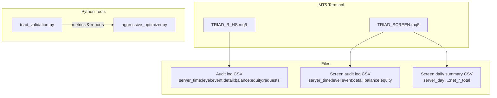
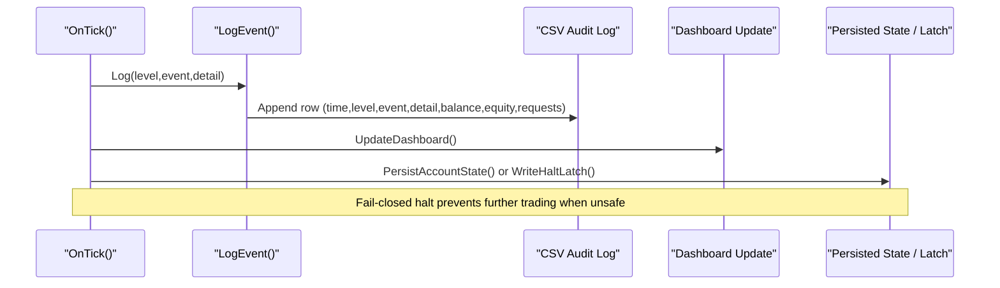
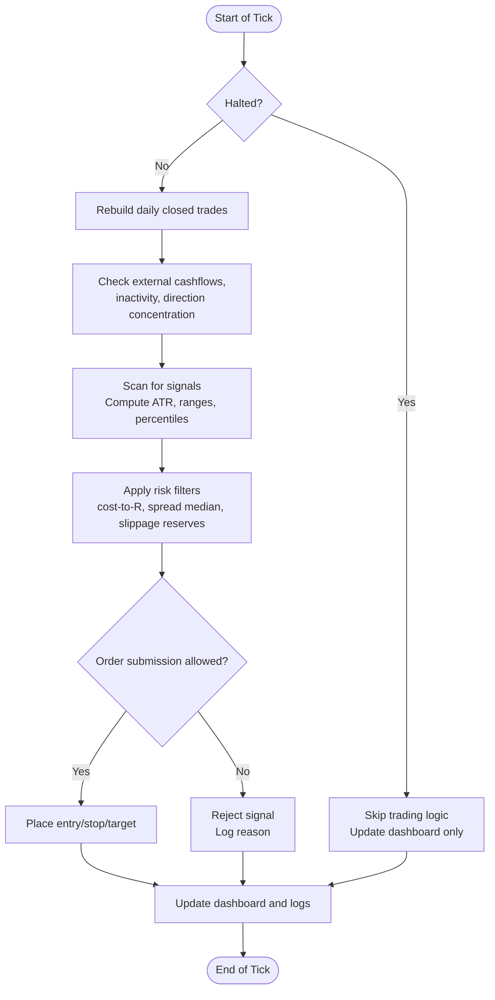
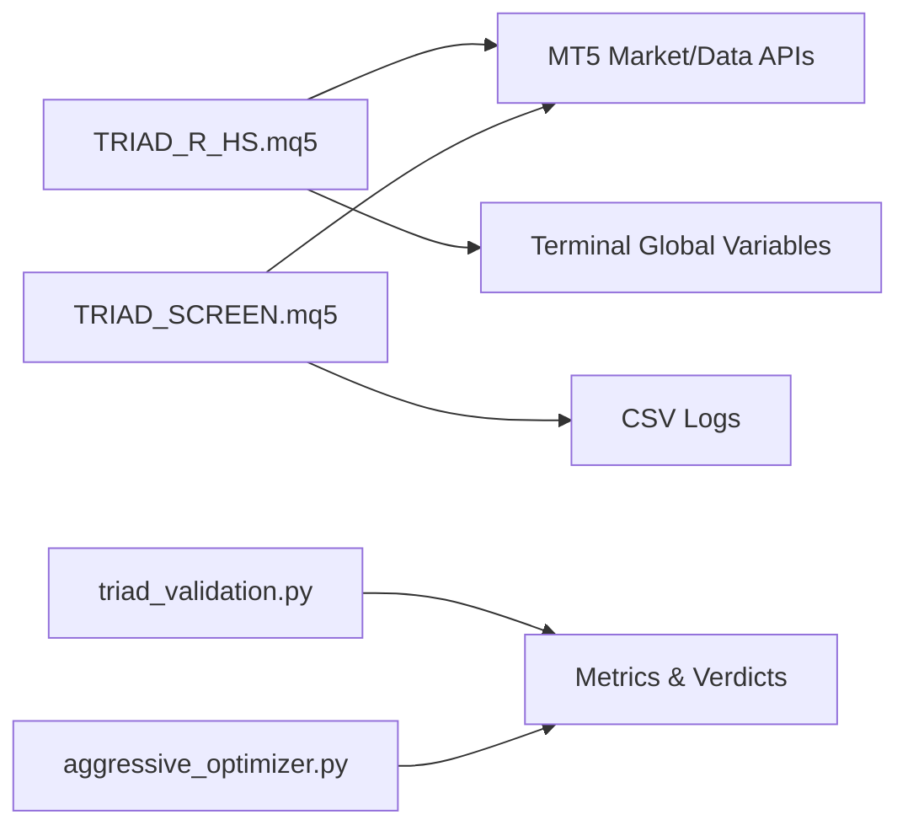

# Monitoring and Logging

<cite>
**Referenced Files in This Document**
- [TRIAD_R_HS.mq5](file://MQL5/Experts/TRIAD_R_HS/TRIAD_R_HS.mq5)
- [TRIAD_SCREEN.mq5](file://MQL5/Experts/TRIAD_SCREEN/TRIAD_SCREEN.mq5)
- [triad_validation.py](file://tools/triad_validation.py)
- [aggressive_optimizer.py](file://tools/aggressive_optimizer.py)
- [test_source_contract.py](file://tests/test_source_contract.py)
</cite>

## Table of Contents
1. Introduction
2. Project Structure
3. Core Components
4. Architecture Overview
5. Detailed Component Analysis
6. Dependency Analysis
7. Performance Considerations
8. Troubleshooting Guide
9. Conclusion
10. Appendices

## Introduction
This document explains the monitoring and logging capabilities of TRIAD-R, focusing on:
- Built-in dashboard functionality (on-chart panel for screening/demo use)
- Log file generation and structure
- Alert systems and operational guards
- Monitoring metrics: trade statistics, risk metrics, and performance indicators
- Logging levels, rotation policies, and log analysis tools
- Examples for dashboard setup, log interpretation, and alert configuration
- Integration with external monitoring systems and production best practices

The canonical live EA is TRIAD_R_HS.mq5; TRIAD_SCREEN.mq5 provides a demo-only screening tool with an on-chart dashboard that mirrors core logic without production safety machinery.

## Project Structure
Monitoring and logging are implemented primarily in two MQL5 Expert Advisors:
- TRIAD_R_HS.mq5: Production-grade logger, state persistence, alerts, and operational safeguards
- TRIAD_SCREEN.mq5: Demo screening EA with an on-chart dashboard and CSV logs

Supporting Python tools compute validation metrics and reports used to assess performance and risk characteristics.

**Diagram sources**
- [TRIAD_R_HS.mq5:299-327](file://MQL5/Experts/TRIAD_R_HS/TRIAD_R_HS.mq5#L299-L327)
- [TRIAD_SCREEN.mq5:314-354](file://MQL5/Experts/TRIAD_SCREEN/TRIAD_SCREEN.mq5#L314-L354)
- [TRIAD_SCREEN.mq5:547-578](file://MQL5/Experts/TRIAD_SCREEN/TRIAD_SCREEN.mq5#L547-L578)

**Section sources**
- [TRIAD_R_HS.mq5:299-327](file://MQL5/Experts/TRIAD_R_HS/TRIAD_R_HS.mq5#L299-L327)
- [TRIAD_SCREEN.mq5:314-354](file://MQL5/Experts/TRIAD_SCREEN/TRIAD_SCREEN.mq5#L314-L354)
- [TRIAD_SCREEN.mq5:547-578](file://MQL5/Experts/TRIAD_SCREEN/TRIAD_SCREEN.mq5#L547-L578)

## Core Components
- Centralized logging function writes structured CSV rows with timestamp, level, event name, detail, balance, equity, and request count. It also prints to the terminal based on verbosity and severity.
- On-chart dashboard (screening EA) renders status, progress, exposure, and settings fingerprint using MT5 chart objects.
- Alerts and halts: The live EA uses a fail-closed halt mechanism with persisted latches and signatures to stop trading under unsafe conditions.
- Metrics and reporting: Python tools compute trade statistics, risk metrics, and pass/fail verdicts against thresholds.

**Section sources**
- [TRIAD_R_HS.mq5:299-327](file://MQL5/Experts/TRIAD_R_HS/TRIAD_R_HS.mq5#L299-L327)
- [TRIAD_SCREEN.mq5:3206-3325](file://MQL5/Experts/TRIAD_SCREEN/TRIAD_SCREEN.mq5#L3206-L3325)
- [TRIAD_R_HS.mq5:329-350](file://MQL5/Experts/TRIAD_R_HS/TRIAD_R_HS.mq5#L329-L350)
- [triad_validation.py:521-544](file://tools/triad_validation.py#L521-L544)

## Architecture Overview
The monitoring architecture combines in-process logging, persistent state, and on-chart visualization:
- Live EA logs every significant event to a CSV and updates global variables for state and halt latches.
- Screening EA logs events and appends daily summaries to CSV files per combo/account.
- Dashboard updates periodically via timer to reflect current status and metrics.
- Python tools analyze historical data and produce metrics such as drawdown, win rate, expectancy, and phase pass probabilities.

**Diagram sources**
- [TRIAD_R_HS.mq5:299-327](file://MQL5/Experts/TRIAD_R_HS/TRIAD_R_HS.mq5#L299-L327)
- [TRIAD_R_HS.mq5:568-600](file://MQL5/Experts/TRIAD_R_HS/TRIAD_R_HS.mq5#L568-L600)
- [TRIAD_SCREEN.mq5:3237-3325](file://MQL5/Experts/TRIAD_SCREEN/TRIAD_SCREEN.mq5#L3237-L3325)

## Detailed Component Analysis

### Logging System
- Levels: INFO, WARN, ERROR, HALT. Verbose mode controls whether non-error/halt messages print to terminal.
- CSV schema: server_time, level, event, detail, balance, equity, requests (live); screen variant omits requests.
- Rotation policy: No built-in rotation; logs append indefinitely. Operators should rotate externally.
- Failure handling: If file open/write fails, errors are logged once per session and a failure flag is set.

Operational notes:
- Always enable InpVerboseLog during testing; keep it enabled in production to capture INFO-level diagnostics.
- Use event names to filter logs (e.g., NEWS_COVERAGE_INSUFFICIENT, STATISTICS_INSUFFICIENT).

**Section sources**
- [TRIAD_R_HS.mq5:143-149](file://MQL5/Experts/TRIAD_R_HS/TRIAD_R_HS.mq5#L143-L149)
- [TRIAD_R_HS.mq5:299-327](file://MQL5/Experts/TRIAD_R_HS/TRIAD_R_HS.mq5#L299-L327)
- [TRIAD_SCREEN.mq5:314-354](file://MQL5/Experts/TRIAD_SCREEN/TRIAD_SCREEN.mq5#L314-L354)

### Dashboard Functionality (Screening EA)
- Displays: account info, symbol/window, range/entry windows, status (ACTIVE/PASSED/FAILED/DRY_RUN), progress toward targets, qualifying days, floors, today’s signals/candidates/fills/rejects, last rejection, net R and cash ledger, profile/risk parameters, news calendar status, order submission warning.
- Controls: InpDashboardShow toggles visibility; InpDashboardRefreshSeconds sets update frequency.
- Persistence: Daily summary CSV appended each rollover with day key, balances, phase, status, counts, and net R.

Setup example:
- Enable InpDashboardShow = true
- Set InpDashboardRefreshSeconds = 2
- Choose symbol and window (London/New York)
- Configure challenge phase and targets to match your funding rules

Interpretation tips:
- STATUS lines indicate compliance with daily/overall floors and inactivity rules
- ConfigHash records exact settings used; record this value per account for traceability
- Ledger net_r reflects realized net R from closed trades recorded by the EA

**Section sources**
- [TRIAD_SCREEN.mq5:152-156](file://MQL5/Experts/TRIAD_SCREEN/TRIAD_SCREEN.mq5#L152-L156)
- [TRIAD_SCREEN.mq5:3206-3325](file://MQL5/Experts/TRIAD_SCREEN/TRIAD_SCREEN.mq5#L3206-L3325)
- [TRIAD_SCREEN.mq5:547-578](file://MQL5/Experts/TRIAD_SCREEN/TRIAD_SCREEN.mq5#L547-L578)

### Alert Systems and Halts
- Halt mechanism: When unsafe conditions are detected (e.g., unauthorized history, external cashflows, insufficient news coverage), the EA sets a halt latch with a reason hash and signature, persists it, and stops trading until explicitly reset through validated channels.
- Operational alerts:
  - INACTIVITY_ALERT: Warns after consecutive days without activity beyond configured thresholds
  - NEWS_* alerts: Report invalid/stale news calendar or insufficient coverage
  - INSTANCE_LOCK_* alerts: Detect duplicate live instances or storage failures
  - UNAUTHORIZED_* alerts: Flag foreign orders/deals or unexpected cashflows

Configuration examples:
- InpNewsBlockInactivityThreshold: Number of consecutive days blocked by news before raising an error-level alert
- InpRequireNewsCalendar: Enforce news blackout around high-impact events
- InpMaxNonEmergencyRequestsDay: Limit non-emergency requests per day

**Section sources**
- [TRIAD_R_HS.mq5:329-350](file://MQL5/Experts/TRIAD_R_HS/TRIAD_R_HS.mq5#L329-L350)
- [TRIAD_R_HS.mq5:473-492](file://MQL5/Experts/TRIAD_R_HS/TRIAD_R_HS.mq5#L473-L492)
- [TRIAD_R_HS.mq5:836-937](file://MQL5/Experts/TRIAD_R_HS/TRIAD_R_HS.mq5#L836-L937)
- [TRIAD_R_HS.mq5:1525-1591](file://MQL5/Experts/TRIAD_R_HS/TRIAD_R_HS.mq5#L1525-L1591)

### Monitoring Metrics: Trade Statistics, Risk Metrics, Performance Indicators
- Trade statistics: Win/loss/time exits, fill rates, activation checks, limit touch behavior, partial fills, and per-day sequences are captured and analyzed by validation tools.
- Risk metrics: Drawdown calculations (peak-to-trough), firm overall floor breaches, maximum overshoot beyond shutdown thresholds, and utilization fractions are computed.
- Performance indicators: Expectancy in R, Sharpe-like ratio (expectancy/stddev), profit factor, monthlyized returns, year-wise robustness (removing best year still positive), and phase pass probabilities under normal and stressed scenarios.

Analysis tools:
- triad_validation.py computes metric_report entries including year-wise net R, robustness checks, and pass probabilities
- aggressive_optimizer.py summarizes per-pair stats, drawdown, monthlyized return, and Sharpe-like metrics

**Section sources**
- [triad_validation.py:521-544](file://tools/triad_validation.py#L521-L544)
- [triad_validation.py:1380-1442](file://tools/triad_validation.py#L1380-L1442)
- [aggressive_optimizer.py:443-471](file://tools/aggressive_optimizer.py#L443-L471)

### Data Flow and Processing Logic

**Diagram sources**
- [TRIAD_R_HS.mq5:1274-1352](file://MQL5/Experts/TRIAD_R_HS/TRIAD_R_HS.mq5#L1274-L1352)
- [TRIAD_R_HS.mq5:1419-1523](file://MQL5/Experts/TRIAD_R_HS/TRIAD_R_HS.mq5#L1419-L1523)
- [TRIAD_R_HS.mq5:1525-1591](file://MQL5/Experts/TRIAD_R_HS/TRIAD_R_HS.mq5#L1525-L1591)

## Dependency Analysis
Key dependencies and relationships:
- TRIAD_R_HS.mq5 depends on MT5 market data functions (CopyRates, iATR), account/history APIs, and global variables for state persistence.
- TRIAD_SCREEN.mq5 depends on similar market data and indicator functions but omits production safety machinery.
- Python tools depend on replay exports and validation schemas to compute metrics and verdicts.

Potential coupling:
- News calendar parsing affects signal gating; stale or invalid calendars trigger alerts and can block trading.
- Global variable persistence ties state to configuration hashes; mismatches cause rebase requirements or halts.

External integrations:
- External monitoring systems can consume CSV logs via standard log collectors (e.g., syslog, file watchers) and parse structured fields for dashboards and alerts.

**Diagram sources**
- [TRIAD_R_HS.mq5:299-327](file://MQL5/Experts/TRIAD_R_HS/TRIAD_R_HS.mq5#L299-L327)
- [TRIAD_SCREEN.mq5:314-354](file://MQL5/Experts/TRIAD_SCREEN/TRIAD_SCREEN.mq5#L314-L354)
- [triad_validation.py:521-544](file://tools/triad_validation.py#L521-L544)

**Section sources**
- [TRIAD_R_HS.mq5:299-327](file://MQL5/Experts/TRIAD_R_HS/TRIAD_R_HS.mq5#L299-L327)
- [TRIAD_SCREEN.mq5:314-354](file://MQL5/Experts/TRIAD_SCREEN/TRIAD_SCREEN.mq5#L314-L354)
- [triad_validation.py:521-544](file://tools/triad_validation.py#L521-L544)

## Performance Considerations
- Logging overhead: Each LogEvent opens, seeks, and writes to CSV; ensure disk I/O capacity and consider external rotation to avoid large files.
- Dashboard refresh: Frequent updates increase CPU usage; tune InpDashboardRefreshSeconds for your environment.
- History scans: Rebuilding daily closed trades and scanning history can be expensive; run during low-traffic periods if needed.
- Indicator handles: Ensure sufficient indicator handles and memory; release unused handles on deinit.

[No sources needed since this section provides general guidance]

## Troubleshooting Guide
Common issues and resolutions:
- News calendar stale or insufficient:
  - Symptoms: NEWS_RUNTIME_COVERAGE_STALE or NEWS_COVERAGE_INSUFFICIENT
  - Action: Update triad_red_news.csv with verified coverage through required hours; verify COVERAGE row format
- Unauthorized trading history:
  - Symptoms: UNAUTHORIZED_ORDER_HISTORY or UNAUTHORIZED_TRADING_HISTORY
  - Action: Remove foreign orders/deals; ensure magic numbers and comments match strategy; allow rebase if necessary
- Duplicate live instance:
  - Symptoms: DUPLICATE_LIVE_INSTANCE
  - Action: Run only one live instance per account; check global variable ownership
- Insufficient statistics:
  - Symptoms: STATS_INSUFFICIENT
  - Action: Accumulate comparable sessions; wait until enough history is available
- Inactivity alerts:
  - Symptoms: INACTIVITY_ALERT
  - Action: Review news blackouts and market conditions; adjust thresholds if appropriate

Best practices:
- Keep InpVerboseLog enabled in production to capture INFO-level diagnostics
- Rotate logs externally (daily or size-based) and archive them for analysis
- Record ConfigHash per deployment to attribute results to specific settings
- Use the screening EA dashboard to validate behavior before enabling order submission

**Section sources**
- [TRIAD_R_HS.mq5:836-937](file://MQL5/Experts/TRIAD_R_HS/TRIAD_R_HS.mq5#L836-L937)
- [TRIAD_R_HS.mq5:1419-1523](file://MQL5/Experts/TRIAD_R_HS/TRIAD_R_HS.mq5#L1419-L1523)
- [TRIAD_R_HS.mq5:1525-1591](file://MQL5/Experts/TRIAD_R_HS/TRIAD_R_HS.mq5#L1525-L1591)
- [test_source_contract.py:421-447](file://tests/test_source_contract.py#L421-L447)

## Conclusion
TRIAD-R provides robust monitoring and logging:
- Structured CSV logs with clear schema and severity levels
- On-chart dashboard for real-time situational awareness in screening/demo
- Strong alerting and fail-closed halts to protect accounts under unsafe conditions
- Comprehensive metrics and validation tools to assess performance and risk

For production, combine these capabilities with external log aggregation, alerting pipelines, and periodic reviews of metrics and logs to maintain safe and effective operations.

[No sources needed since this section summarizes without analyzing specific files]

## Appendices

### Example: Dashboard Setup
- Enable InpDashboardShow = true
- Set InpDashboardRefreshSeconds = 2
- Select symbol and window (London/New York)
- Configure challenge phase and targets to match funding rules
- Observe STATUS, progress, floors, and ledger net_r on the chart

**Section sources**
- [TRIAD_SCREEN.mq5:152-156](file://MQL5/Experts/TRIAD_SCREEN/TRIAD_SCREEN.mq5#L152-L156)
- [TRIAD_SCREEN.mq5:3237-3325](file://MQL5/Experts/TRIAD_SCREEN/TRIAD_SCREEN.mq5#L3237-L3325)

### Example: Log Interpretation
- Filter by level (ERROR/WARN/INFO/HALT) to prioritize critical events
- Use event names to identify categories (NEWS_*, UNAUTHORIZED_*, INSTANCE_LOCK_*)
- Correlate balance/equity columns with timestamps to understand context
- Track request_count to detect throttling or excessive API usage

**Section sources**
- [TRIAD_R_HS.mq5:299-327](file://MQL5/Experts/TRIAD_R_HS/TRIAD_R_HS.mq5#L299-L327)
- [TRIAD_SCREEN.mq5:314-354](file://MQL5/Experts/TRIAD_SCREEN/TRIAD_SCREEN.mq5#L314-L354)

### Example: Alert Configuration
- InpNewsBlockInactivityThreshold: Set to raise alerts after consecutive news-blocked days without trades
- InpRequireNewsCalendar: Enforce blackout around high-impact events
- InpMaxNonEmergencyRequestsDay: Limit non-emergency requests per day to reduce load

**Section sources**
- [TRIAD_R_HS.mq5:143-149](file://MQL5/Experts/TRIAD_R_HS/TRIAD_R_HS.mq5#L143-L149)
- [TRIAD_R_HS.mq5:836-937](file://MQL5/Experts/TRIAD_R_HS/TRIAD_R_HS.mq5#L836-L937)

### Integration with External Monitoring
- Consume CSV logs via log collectors (file watchers, syslog) and parse structured fields
- Build dashboards to visualize alerts, status, and metrics over time
- Integrate alerting pipelines to notify operators on ERROR/HALT events
- Use Python tools to generate reports and feed into BI systems

[No sources needed since this section provides general guidance]