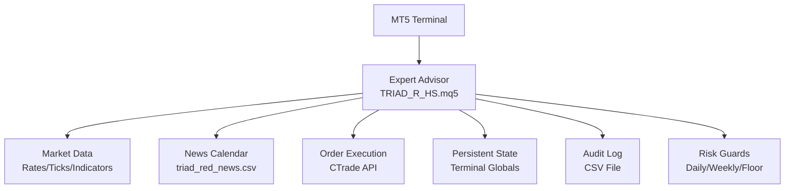
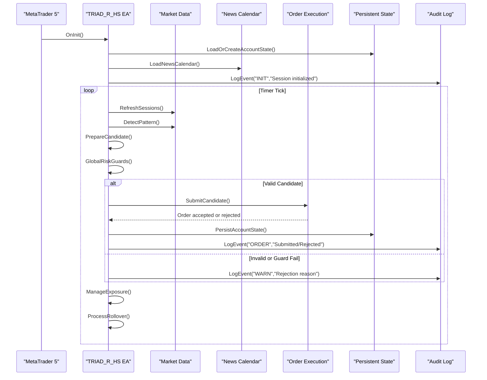
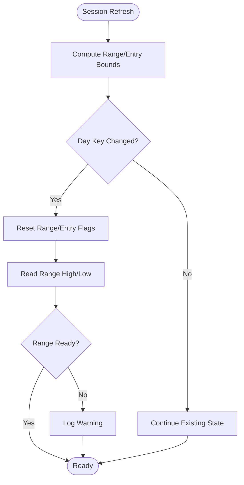
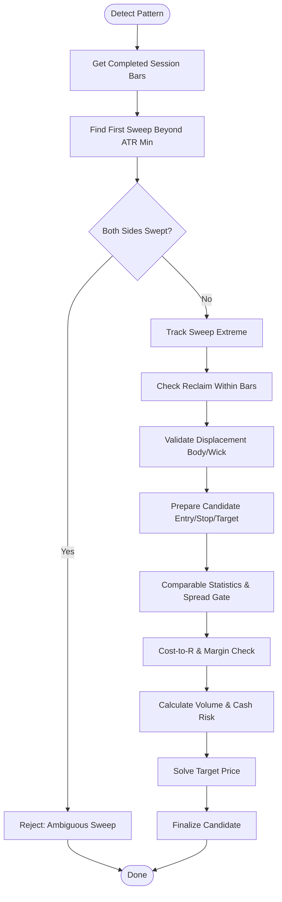
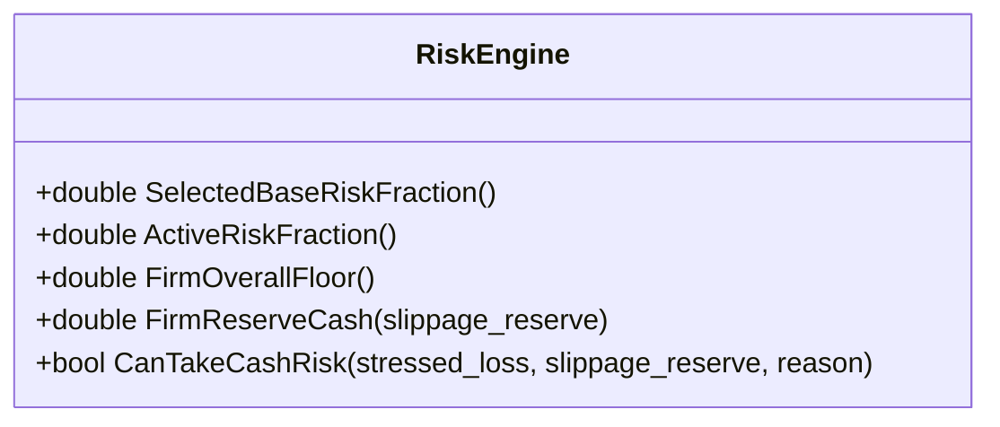
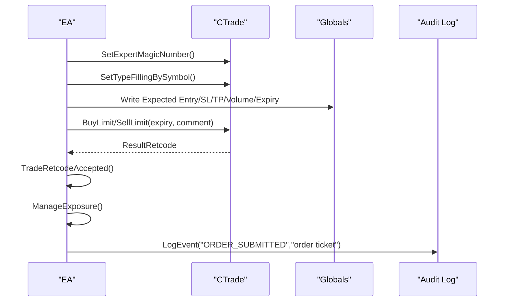
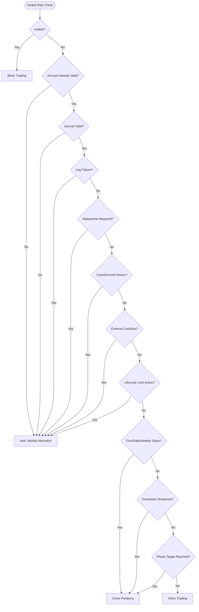
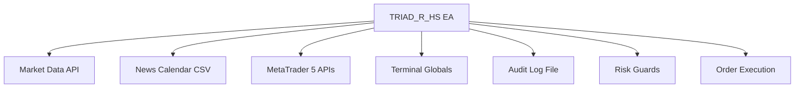

# Production Expert Advisor

<cite>
**Referenced Files in This Document**
- [TRIAD_R_HS.mq5](file://MQL5/Experts/TRIAD_R_HS/TRIAD_R_HS.mq5)
- [README.md](file://MQL5/Experts/TRIAD_R_HS/README.md)
</cite>

## Table of Contents
1. [Introduction](#introduction)
2. [Project Structure](#project-structure)
3. [Core Components](#core-components)
4. [Architecture Overview](#architecture-overview)
5. [Detailed Component Analysis](#detailed-component-analysis)
6. [Dependency Analysis](#dependency-analysis)
7. [Performance Considerations](#performance-considerations)
8. [Troubleshooting Guide](#troubleshooting-guide)
9. [Conclusion](#conclusion)
10. [Appendices](#appendices)

## Introduction
This document provides comprehensive production documentation for the TRIAD_R_HS Expert Advisor (EA), a fail-closed, research-grade MQL5 trading engine designed for one-position execution on specific sessions and instruments. It explains the complete trading engine architecture, configuration parameters, safety mechanisms, logging systems, MQL5-specific order execution logic, position management, risk calculation functions, and integration with MetaTrader 5 APIs. It also covers fail-closed design principles, emergency halt mechanisms, audit logging capabilities, parameter configuration examples, monitoring setup, troubleshooting procedures, performance optimization considerations, and best practices for live deployment scenarios.

The EA is intentionally conservative: order submission is disabled by default, release gates are locked by default, and any operational anomaly triggers fail-closed behavior to protect capital and ensure auditability.

**Section sources**
- [TRIAD_R_HS.mq5:1-15](file://MQL5/Experts/TRIAD_R_HS/TRIAD_R_HS.mq5#L1-L15)
- [TRIAD_R_HS.mq5:53-90](file://MQL5/Experts/TRIAD_R_HS/TRIAD_R_HS.mq5#L53-L90)
- [TRIAD_R_HS.mq5:142-150](file://MQL5/Experts/TRIAD_R_HS/TRIAD_R_HS.mq5#L142-L150)
- [README.md:1-26](file://MQL5/Experts/TRIAD_R_HS/README.md#L1-L26)

## Project Structure
The project centers around a single MQL5 Expert Advisor file implementing the full strategy lifecycle: initialization, session management, signal detection, risk checks, order submission, exposure management, rollover handling, and persistent state. Supporting documentation clarifies safe installation, news CSV contract, runtime configuration, persistence/log format, and required validation sequences.

**Diagram sources**
- [TRIAD_R_HS.mq5:213-262](file://MQL5/Experts/TRIAD_R_HS/TRIAD_R_HS.mq5#L213-L262)
- [TRIAD_R_HS.mq5:836-918](file://MQL5/Experts/TRIAD_R_HS/TRIAD_R_HS.mq5#L836-L918)
- [TRIAD_R_HS.mq5:2692-2900](file://MQL5/Experts/TRIAD_R_HS/TRIAD_R_HS.mq5#L2692-L2900)
- [TRIAD_R_HS.mq5:568-601](file://MQL5/Experts/TRIAD_R_HS/TRIAD_R_HS.mq5#L568-L601)
- [TRIAD_R_HS.mq5:299-327](file://MQL5/Experts/TRIAD_R_HS/TRIAD_R_HS.mq5#L299-L327)

**Section sources**
- [TRIAD_R_HS.mq5:213-262](file://MQL5/Experts/TRIAD_R_HS/TRIAD_R_HS.mq5#L213-L262)
- [TRIAD_R_HS.mq5:836-918](file://MQL5/Experts/TRIAD_R_HS/TRIAD_R_HS.mq5#L836-L918)
- [TRIAD_R_HS.mq5:2692-2900](file://MQL5/Experts/TRIAD_R_HS/TRIAD_R_HS.mq5#L2692-L2900)
- [TRIAD_R_HS.mq5:568-601](file://MQL5/Experts/TRIAD_R_HS/TRIAD_R_HS.mq5#L568-L601)
- [TRIAD_R_HS.mq5:299-327](file://MQL5/Experts/TRIAD_R_HS/TRIAD_R_HS.mq5#L299-L327)
- [README.md:15-26](file://MQL5/Experts/TRIAD_R_HS/README.md#L15-L26)

## Core Components
- Session Manager: Defines London and New York sessions, computes range and entry windows, tracks consumed days, and ensures valid historical data availability.
- Signal Detector: Identifies sweep/reclaim patterns within the entry window, validates displacement, and prepares candidate trades with stop/target/volume calculations.
- Risk Engine: Computes cost-to-R, spread gates, margin availability, cash risk budgets, drawdown controls, daily/weekly stops, firm floors, and phase targets.
- Order Execution: Submits limit orders with expiry, reconciles fills, enforces one-position invariant, and manages exits including breakeven moves and time stops.
- Safety & Halt System: Implements fail-closed design with global risk guards, instance locks, emergency halts, and persisted latches bound to configuration/account identity.
- Audit Logging: Writes structured CSV logs with server time, level, event, detail, balance/equity, and request counts; includes error handling for log failures.
- Rollover & State Persistence: Tracks day/week boundaries, high-water balance, profitable days estimation, external cashflow detection, and persists state with integrity signatures.

**Section sources**
- [TRIAD_R_HS.mq5:158-218](file://MQL5/Experts/TRIAD_R_HS/TRIAD_R_HS.mq5#L158-L218)
- [TRIAD_R_HS.mq5:1936-2116](file://MQL5/Experts/TRIAD_R_HS/TRIAD_R_HS.mq5#L1936-L2116)
- [TRIAD_R_HS.mq5:1621-1712](file://MQL5/Experts/TRIAD_R_HS/TRIAD_R_HS.mq5#L1621-L1712)
- [TRIAD_R_HS.mq5:2692-2900](file://MQL5/Experts/TRIAD_R_HS/TRIAD_R_HS.mq5#L2692-L2900)
- [TRIAD_R_HS.mq5:329-350](file://MQL5/Experts/TRIAD_R_HS/TRIAD_R_HS.mq5#L329-L350)
- [TRIAD_R_HS.mq5:299-327](file://MQL5/Experts/TRIAD_R_HS/TRIAD_R_HS.mq5#L299-L327)
- [TRIAD_R_HS.mq5:3379-3514](file://MQL5/Experts/TRIAD_R_HS/TRIAD_R_HS.mq5#L3379-L3514)

## Architecture Overview
The EA follows a timer-driven loop that scans configured symbols per session, detects signals, applies strict risk and safety gates, and submits only one-position trades with explicit plan persistence and reconciliation. All critical paths enforce fail-closed behavior through account identity validation, journal signature verification, and emergency halts.

**Diagram sources**
- [TRIAD_R_HS.mq5:3950-3999](file://MQL5/Experts/TRIAD_R_HS/TRIAD_R_HS.mq5#L3950-L3999)
- [TRIAD_R_HS.mq5:1936-2116](file://MQL5/Experts/TRIAD_R_HS/TRIAD_R_HS.mq5#L1936-L2116)
- [TRIAD_R_HS.mq5:2380-2522](file://MQL5/Experts/TRIAD_R_HS/TRIAD_R_HS.mq5#L2380-L2522)
- [TRIAD_R_HS.mq5:1772-1846](file://MQL5/Experts/TRIAD_R_HS/TRIAD_R_HS.mq5#L1772-L1846)
- [TRIAD_R_HS.mq5:2692-2900](file://MQL5/Experts/TRIAD_R_HS/TRIAD_R_HS.mq5#L2692-L2900)
- [TRIAD_R_HS.mq5:2942-3284](file://MQL5/Experts/TRIAD_R_HS/TRIAD_R_HS.mq5#L2942-L3284)
- [TRIAD_R_HS.mq5:3379-3514](file://MQL5/Experts/TRIAD_R_HS/TRIAD_R_HS.mq5#L3379-L3514)

## Detailed Component Analysis

### Session Management
- Computes London and New York session bounds using civil date conversion and DST-aware offsets.
- Tracks range high/low during the range window and resets at rollover.
- Enforces entry windows and skips mid-session starts if configured.
- Persists consumed session keys to avoid duplicate entries across restarts.

**Diagram sources**
- [TRIAD_R_HS.mq5:754-789](file://MQL5/Experts/TRIAD_R_HS/TRIAD_R_HS.mq5#L754-L789)
- [TRIAD_R_HS.mq5:1867-1909](file://MQL5/Experts/TRIAD_R_HS/TRIAD_R_HS.mq5#L1867-L1909)

**Section sources**
- [TRIAD_R_HS.mq5:754-789](file://MQL5/Experts/TRIAD_R_HS/TRIAD_R_HS.mq5#L754-L789)
- [TRIAD_R_HS.mq5:1867-1909](file://MQL5/Experts/TRIAD_R_HS/TRIAD_R_HS.mq5#L1867-L1909)

### Signal Detection and Candidate Preparation
- Scans completed M5 bars after the range window to detect sweep events beyond ATR thresholds.
- Validates reclaim wick strength and displacement body size.
- Freezes ATR at entry-window open to prevent regime drift.
- Computes entry (midpoint of displacement bar), stop (ATR-buffered extreme), target (R-based), volume (budget-constrained), and cost-to-R with spread/slippage/commission.

**Diagram sources**
- [TRIAD_R_HS.mq5:1936-2116](file://MQL5/Experts/TRIAD_R_HS/TRIAD_R_HS.mq5#L1936-L2116)
- [TRIAD_R_HS.mq5:2380-2522](file://MQL5/Experts/TRIAD_R_HS/TRIAD_R_HS.mq5#L2380-L2522)

**Section sources**
- [TRIAD_R_HS.mq5:1936-2116](file://MQL5/Experts/TRIAD_R_HS/TRIAD_R_HS.mq5#L1936-L2116)
- [TRIAD_R_HS.mq5:2380-2522](file://MQL5/Experts/TRIAD_R_HS/TRIAD_R_HS.mq5#L2380-L2522)

### Risk Calculation Functions
- Base risk fraction selected from profile (A–D).
- Active risk reduced under drawdown conditions.
- Firm floor and reserve cash computed from phase initial balance and slippage reserves.
- CanTakeCashRisk evaluates projected equity against daily/weekly stops, drawdown shutdown, and firm floor.

**Diagram sources**
- [TRIAD_R_HS.mq5:1628-1712](file://MQL5/Experts/TRIAD_R_HS/TRIAD_R_HS.mq5#L1628-L1712)

**Section sources**
- [TRIAD_R_HS.mq5:1628-1712](file://MQL5/Experts/TRIAD_R_HS/TRIAD_R_HS.mq5#L1628-L1712)

### Order Execution Logic and Position Management
- Submits BuyLimit/SellLimit with specified expiration and comments tagged with session/day key.
- Persists expected trade plan to terminal globals for reconciliation.
- Manages exposure by enforcing one-position invariant, validating visible SL/TP, repairing missing stops, moving to breakeven after confirmed 1R, and closing on news/rollover/session/time stops.
- Uses CTrade API with deviation points, filling mode, and retcode acceptance checks.

**Diagram sources**
- [TRIAD_R_HS.mq5:2692-2900](file://MQL5/Experts/TRIAD_R_HS/TRIAD_R_HS.mq5#L2692-L2900)
- [TRIAD_R_HS.mq5:2942-3284](file://MQL5/Experts/TRIAD_R_HS/TRIAD_R_HS.mq5#L2942-L3284)

**Section sources**
- [TRIAD_R_HS.mq5:2692-2900](file://MQL5/Experts/TRIAD_R_HS/TRIAD_R_HS.mq5#L2692-L2900)
- [TRIAD_R_HS.mq5:2942-3284](file://MQL5/Experts/TRIAD_R_HS/TRIAD_R_HS.mq5#L2942-L3284)

### Fail-Closed Design Principles and Emergency Halt Mechanisms
- Global risk guards check halted state, account identity, journal validity, log failure, rebaseline requirement, unauthorized history, external cashflow, lifecycle lock, firm floors, daily/weekly stops, drawdown shutdown, and phase targets.
- Persistent halt latch uses signed values bound to configuration and account identity; partial writes fail closed.
- Instance lock prevents concurrent live instances via owner/heartbeat globals; stale instances are fenced.
- Emergency actions cancel pending orders, close positions, and halt when critical failures occur.

**Diagram sources**
- [TRIAD_R_HS.mq5:1772-1846](file://MQL5/Experts/TRIAD_R_HS/TRIAD_R_HS.mq5#L1772-L1846)
- [TRIAD_R_HS.mq5:329-350](file://MQL5/Experts/TRIAD_R_HS/TRIAD_R_HS.mq5#L329-L350)
- [TRIAD_R_HS.mq5:494-566](file://MQL5/Experts/TRIAD_R_HS/TRIAD_R_HS.mq5#L494-L566)

**Section sources**
- [TRIAD_R_HS.mq5:1772-1846](file://MQL5/Experts/TRIAD_R_HS/TRIAD_R_HS.mq5#L1772-L1846)
- [TRIAD_R_HS.mq5:329-350](file://MQL5/Experts/TRIAD_R_HS/TRIAD_R_HS.mq5#L329-L350)
- [TRIAD_R_HS.mq5:494-566](file://MQL5/Experts/TRIAD_R_HS/TRIAD_R_HS.mq5#L494-L566)

### Audit Logging Capabilities
- Structured CSV log with columns: server_time, level, event, detail, balance, equity, requests.
- Header written once; appends each event with current server time and account metrics.
- Error handling for open/write failures; sets log failure flag which triggers halts before non-emergency requests.
- Verbose logging controlled by input; ERROR/HALT levels always logged.

**Section sources**
- [TRIAD_R_HS.mq5:299-327](file://MQL5/Experts/TRIAD_R_HS/TRIAD_R_HS.mq5#L299-L327)
- [TRIAD_R_HS.mq5:2538-2558](file://MQL5/Experts/TRIAD_R_HS/TRIAD_R_HS.mq5#L2538-L2558)

### MQL5-Specific Integrations
- Uses CTrade for order submission, modification, and closure with deviation and filling mode settings.
- Leverages iATR and iMA indicator handles for ATR and H1 EMA(50) bias filter.
- Integrates with MetaTrader 5 account info, symbol properties, history deals/orders, and terminal info for validation and state management.
- Employs terminal globals for instance locking, halt latches, and persistent state with integrity signatures.

**Section sources**
- [TRIAD_R_HS.mq5:213-218](file://MQL5/Experts/TRIAD_R_HS/TRIAD_R_HS.mq5#L213-L218)
- [TRIAD_R_HS.mq5:2692-2900](file://MQL5/Experts/TRIAD_R_HS/TRIAD_R_HS.mq5#L2692-L2900)
- [TRIAD_R_HS.mq5:3950-3999](file://MQL5/Experts/TRIAD_R_HS/TRIAD_R_HS.mq5#L3950-L3999)

## Dependency Analysis
The EA depends on:
- Market data for rates, ticks, and indicator values.
- News calendar CSV for blackout windows and coverage validation.
- MetaTrader 5 APIs for account/symbol/history queries and order execution.
- Terminal globals for persistent state, instance locks, and halt latches.
- Audit log file for structured event recording.

**Diagram sources**
- [TRIAD_R_HS.mq5:836-918](file://MQL5/Experts/TRIAD_R_HS/TRIAD_R_HS.mq5#L836-L918)
- [TRIAD_R_HS.mq5:2692-2900](file://MQL5/Experts/TRIAD_R_HS/TRIAD_R_HS.mq5#L2692-L2900)
- [TRIAD_R_HS.mq5:568-601](file://MQL5/Experts/TRIAD_R_HS/TRIAD_R_HS.mq5#L568-L601)
- [TRIAD_R_HS.mq5:299-327](file://MQL5/Experts/TRIAD_R_HS/TRIAD_R_HS.mq5#L299-L327)

**Section sources**
- [TRIAD_R_HS.mq5:836-918](file://MQL5/Experts/TRIAD_R_HS/TRIAD_R_HS.mq5#L836-L918)
- [TRIAD_R_HS.mq5:2692-2900](file://MQL5/Experts/TRIAD_R_HS/TRIAD_R_HS.mq5#L2692-L2900)
- [TRIAD_R_HS.mq5:568-601](file://MQL5/Experts/TRIAD_R_HS/TRIAD_R_HS.mq5#L568-L601)
- [TRIAD_R_HS.mq5:299-327](file://MQL5/Experts/TRIAD_R_HS/TRIAD_R_HS.mq5#L299-L327)

## Performance Considerations
- Use minimal indicator handles (iATR, iMA) and reuse them per session to reduce overhead.
- Limit history copies to necessary ranges and validate bar counts to avoid excessive memory usage.
- Throttle non-emergency requests to prevent broker overload and enforce latency limits.
- Avoid redundant quote checks by caching tick freshness and revalidating only when necessary.
- Optimize session scanning by skipping weekends and invalid ranges early.
- Ensure news calendar loading is efficient and validated once per rollover.

[No sources needed since this section provides general guidance]

## Troubleshooting Guide
Common issues and resolutions:
- News calendar stale or insufficient coverage: Verify triad_red_news.csv has valid COVERAGE row extending beyond required hours; reload at rollover.
- Quote staleness or invalid spreads: Check market connectivity and symbol properties; ensure quotes are fresh within configured seconds.
- Order submission failures: Review retcodes, filling modes, and deviation settings; ensure symbol supports limit orders with SL/TP and specified expiration.
- Missing visible SL/TP: Repair or close position; halt if repair fails repeatedly.
- External cashflow detected: Requires rebaseline migration; do not use ordinary halt reset.
- Unauthorized trading history: Halts and requires formal reconciliation; restore authorized context before resuming.
- Audit log failure: Halts before non-emergency requests; resolve file permissions and disk space.

**Section sources**
- [TRIAD_R_HS.mq5:836-918](file://MQL5/Experts/TRIAD_R_HS/TRIAD_R_HS.mq5#L836-L918)
- [TRIAD_R_HS.mq5:2942-3284](file://MQL5/Experts/TRIAD_R_HS/TRIAD_R_HS.mq5#L2942-L3284)
- [TRIAD_R_HS.mq5:1419-1523](file://MQL5/Experts/TRIAD_R_HS/TRIAD_R_HS.mq5#L1419-L1523)
- [TRIAD_R_HS.mq5:299-327](file://MQL5/Experts/TRIAD_R_HS/TRIAD_R_HS.mq5#L299-L327)

## Conclusion
The TRIAD_R_HS EA implements a robust, fail-closed trading engine with comprehensive risk controls, audit logging, and persistent state management. Its design prioritizes capital preservation, operational transparency, and regulatory compliance through strict validation gates, emergency halts, and detailed logging. For live deployment, operators must follow the documented validation sequence, configure parameters conservatively, monitor logs and alerts, and adhere to the fail-closed principles to ensure safe and reliable operation.

[No sources needed since this section summarizes without analyzing specific files]

## Appendices

### Configuration Parameters Summary
- Enable order submission: Disabled by default; requires explicit approval and all release gates passed.
- Account identity: Authorized login, server, currency, leverage, and product code must match verified values.
- Sessions: London EURUSD/GBPUSD and New York USDJPY with configurable priorities and collision resolution.
- Risk profiles: A–D with fixed risk/target pairs; drawdown reduces active risk.
- Entry geometry: Fixed sweep/reclaim/displacement parameters; ATR-based stops and targets.
- Operational safety: News blackout, quote freshness, deviation limits, request caps, and latency thresholds.
- Logging: Verbose logging enabled; CSV audit log with structured fields.

**Section sources**
- [TRIAD_R_HS.mq5:53-150](file://MQL5/Experts/TRIAD_R_HS/TRIAD_R_HS.mq5#L53-L150)
- [TRIAD_R_HS.mq5:107-141](file://MQL5/Experts/TRIAD_R_HS/TRIAD_R_HS.mq5#L107-L141)
- [TRIAD_R_HS.mq5:3536-3597](file://MQL5/Experts/TRIAD_R_HS/TRIAD_R_HS.mq5#L3536-L3597)

### Monitoring Setup
- Monitor Experts log for ERROR/HALT events and stale calendar warnings.
- Review audit log CSV for order submissions, rejections, and risk guard activations.
- Track profitable days estimation and inactivity alerts for maintenance needs.
- Validate news calendar coverage daily and refresh before declared coverage expires.

**Section sources**
- [TRIAD_R_HS.mq5:299-327](file://MQL5/Experts/TRIAD_R_HS/TRIAD_R_HS.mq5#L299-L327)
- [TRIAD_R_HS.mq5:1525-1551](file://MQL5/Experts/TRIAD_R_HS/TRIAD_R_HS.mq5#L1525-L1551)
- [TRIAD_R_HS.mq5:3379-3514](file://MQL5/Experts/TRIAD_R_HS/TRIAD_R_HS.mq5#L3379-L3514)

### Best Practices for Live Deployment
- Keep order submission disabled until all validation gates pass and explicit user approval is granted.
- Use frozen parameter sets from offline selection; avoid runtime discretion.
- Maintain accurate news calendar with verified coverage extending beyond required hours.
- Regularly reconcile dashboard confirmed days and phase targets.
- Preserve logs and state for audit and post-trade analysis.
- Follow fail-closed principles: never bypass safety mechanisms or ignore errors.

**Section sources**
- [TRIAD_R_HS.mq5:53-90](file://MQL5/Experts/TRIAD_R_HS/TRIAD_R_HS.mq5#L53-L90)
- [TRIAD_R_HS.mq5:3599-3614](file://MQL5/Experts/TRIAD_R_HS/TRIAD_R_HS.mq5#L3599-L3614)
- [README.md:227-247](file://MQL5/Experts/TRIAD_R_HS/README.md#L227-L247)