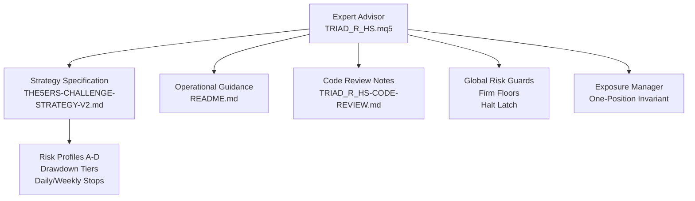
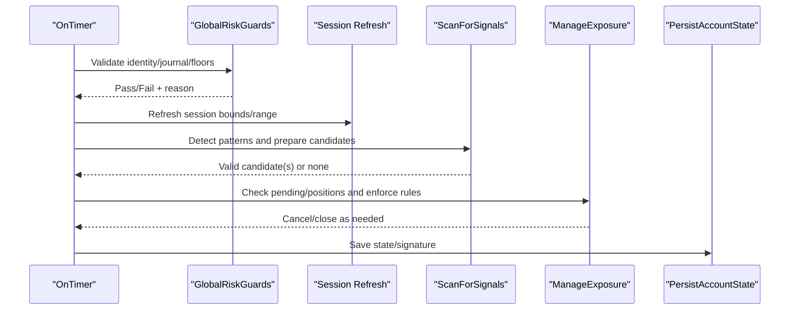
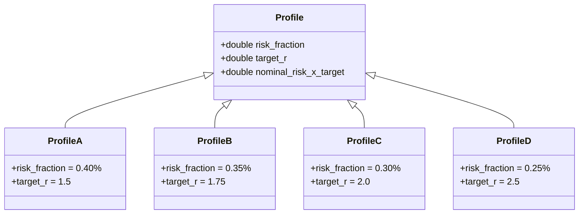
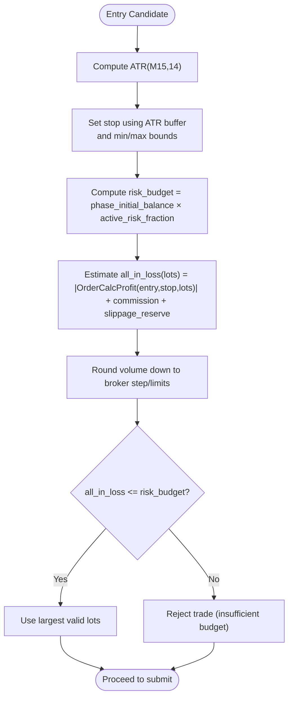
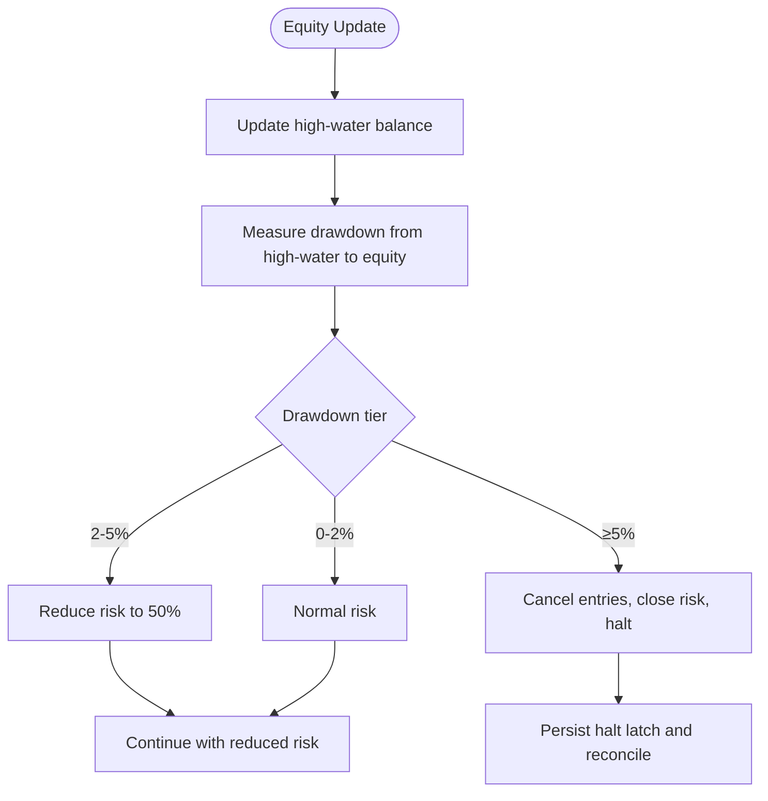
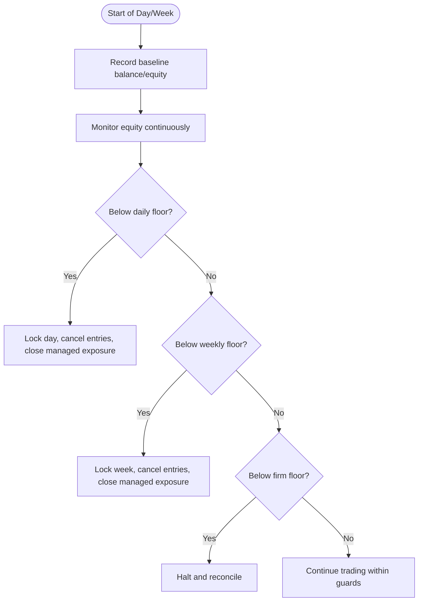
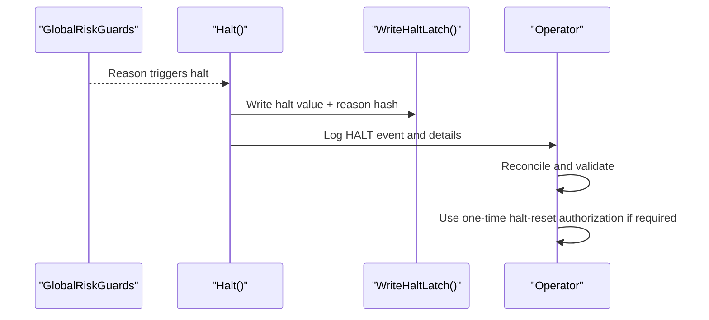
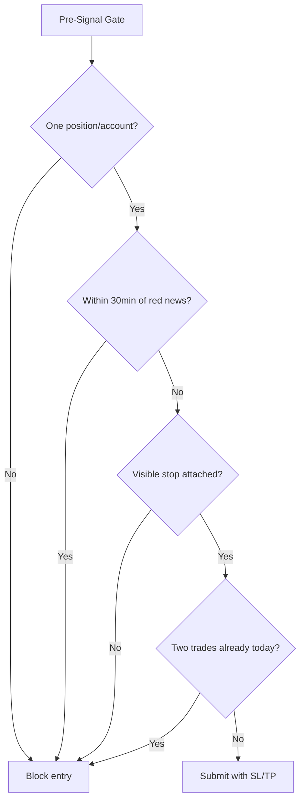
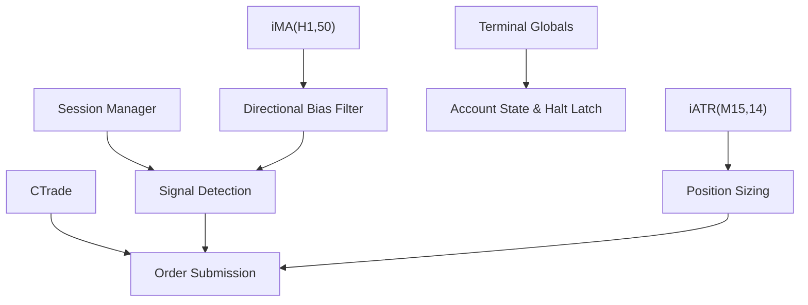

# Risk Management System

<cite>
**Referenced Files in This Document**
- [TRIAD_R_HS.mq5](file://MQL5/Experts/TRIAD_R_HS/TRIAD_R_HS.mq5)
- [README.md](file://MQL5/Experts/TRIAD_R_HS/README.md)
- [THE5ERS-CHALLENGE-STRATEGY-V2.md](file://THE5ERS-CHALLENGE-STRATEGY-V2.md)
- [TRIAD_R_HS-CODE-REVIEW.md](file://TRIAD_R_HS-CODE-REVIEW.md)
</cite>

## Table of Contents
1. [Introduction](#introduction)
2. [Project Structure](#project-structure)
3. [Core Components](#core-components)
4. [Architecture Overview](#architecture-overview)
5. [Detailed Component Analysis](#detailed-component-analysis)
6. [Dependency Analysis](#dependency-analysis)
7. [Performance Considerations](#performance-considerations)
8. [Troubleshooting Guide](#troubleshooting-guide)
9. [Conclusion](#conclusion)
10. [Appendices](#appendices)

## Introduction
This document explains the TRIAD-R risk management system implemented in the MQL5 Expert Advisor for The5ers High Stakes challenge. It focuses on:
- Position sizing based on ATR volatility, account balance, and risk profiles
- Drawdown controls with daily, weekly, and total account limits and automatic shutdown
- Multi-tier risk profile system (Profiles A–D) and their parameters
- Examples of risk calculation formulas, drawdown monitoring setup, and emergency halt procedures
- Compliance requirements for The5ers rules and best practices for live deployment

The EA is fail-closed by default, with order submission disabled until all validation gates pass.

**Section sources**
- [TRIAD_R_HS.mq5:1-15](file://MQL5/Experts/TRIAD_R_HS/TRIAD_R_HS.mq5#L1-L15)
- [TRIAD_R_HS.mq5:53-76](file://MQL5/Experts/TRIAD_R_HS/TRIAD_R_HS.mq5#L53-L76)
- [TRIAD_R_HS.mq5:107-140](file://MQL5/Experts/TRIAD_R_HS/TRIAD_R_HS.mq5#L107-L140)
- [TRIAD_R_HS.mq5:3536-3597](file://MQL5/Experts/TRIAD_R_HS/TRIAD_R_HS.mq5#L3536-L3597)
- [TRIAD_R_HS.mq5:3599-3614](file://MQL5/Experts/TRIAD_R_HS/TRIAD_R_HS.mq5#L3599-L3614)
- [TRIAD_R_HS.mq5:3674-3731](file://MQL5/Experts/TRIAD_R_HS/TRIAD_R_HS.mq5#L3674-L3731)
- [TRIAD_R_HS.mq5:4105-4216](file://MQL5/Experts/TRIAD_R_HS/TRIAD_R_HS.mq5#L4105-L4216)

## Project Structure
The risk system resides primarily in a single MQL5 Expert Advisor file with supporting documentation and code review artifacts:
- Core EA: TRIAD_R_HS.mq5 implements signal detection, position sizing, exposure management, and risk guards
- README: Installation, configuration, and operational guidance
- Strategy specification: THE5ERS-CHALLENGE-STRATEGY-V2.md defines canonical rules, profiles, and compliance constraints
- Code review: TRIAD_R_HS-CODE-REVIEW.md documents static/logic findings and safety controls

**Diagram sources**
- [TRIAD_R_HS.mq5:1772-1846](file://MQL5/Experts/TRIAD_R_HS/TRIAD_R_HS.mq5#L1772-L1846)
- [TRIAD_R_HS.mq5:2942-3200](file://MQL5/Experts/TRIAD_R_HS/TRIAD_R_HS.mq5#L2942-L3200)
- [THE5ERS-CHALLENGE-STRATEGY-V2.md:185-222](file://THE5ERS-CHALLENGE-STRATEGY-V2.md#L185-L222)

**Section sources**
- [TRIAD_R_HS.mq5:1-15](file://MQL5/Experts/TRIAD_R_HS/TRIAD_R_HS.mq5#L1-L15)
- [TRIAD_R_HS.mq5:158-207](file://MQL5/Experts/TRIAD_R_HS/TRIAD_R_HS.mq5#L158-L207)
- [TRIAD_R_HS.mq5:4105-4216](file://MQL5/Experts/TRIAD_R_HS/TRIAD_R_HS.mq5#L4105-L4216)

## Core Components
- Multi-tier risk profiles (A–D) define paired risk/target combinations used to size positions and target exits
- Position sizing uses live symbol economics, ATR-based stops, and cash-risk budgets derived from phase initial balance
- Drawdown controls include internal daily/weekly stops and strategy drawdown thresholds that reduce or halt trading
- Firm floors protect against The5ers termination levels; reserves prevent crossing firm floors under stress
- Emergency halt persists across restarts and requires formal reset procedures

Key implementation anchors:
- Profile enum and inputs: [TRIAD_R_HS.mq5:23-29](file://MQL5/Experts/TRIAD_R_HS/TRIAD_R_HS.mq5#L23-L29), [TRIAD_R_HS.mq5:107-140](file://MQL5/Experts/TRIAD_R_HS/TRIAD_R_HS.mq5#L107-L140)
- Risk guard checks: [TRIAD_R_HS.mq5:1772-1846](file://MQL5/Experts/TRIAD_R_HS/TRIAD_R_HS.mq5#L1772-L1846)
- Exposure management and one-position invariant: [TRIAD_R_HS.mq5:2942-3200](file://MQL5/Experts/TRIAD_R_HS/TRIAD_R_HS.mq5#L2942-L3200)
- Halt latch and state persistence: [TRIAD_R_HS.mq5:329-350](file://MQL5/Experts/TRIAD_R_HS/TRIAD_R_HS.mq5#L329-L350), [TRIAD_R_HS.mq5:568-601](file://MQL5/Experts/TRIAD_R_HS/TRIAD_R_HS.mq5#L568-L601)

**Section sources**
- [TRIAD_R_HS.mq5:23-29](file://MQL5/Experts/TRIAD_R_HS/TRIAD_R_HS.mq5#L23-L29)
- [TRIAD_R_HS.mq5:107-140](file://MQL5/Experts/TRIAD_R_HS/TRIAD_R_HS.mq5#L107-L140)
- [TRIAD_R_HS.mq5:1772-1846](file://MQL5/Experts/TRIAD_R_HS/TRIAD_R_HS.mq5#L1772-L1846)
- [TRIAD_R_HS.mq5:2942-3200](file://MQL5/Experts/TRIAD_R_HS/TRIAD_R_HS.mq5#L2942-L3200)
- [TRIAD_R_HS.mq5:329-350](file://MQL5/Experts/TRIAD_R_HS/TRIAD_R_HS.mq5#L329-L350)
- [TRIAD_R_HS.mq5:568-601](file://MQL5/Experts/TRIAD_R_HS/TRIAD_R_HS.mq5#L568-L601)

## Architecture Overview
The EA runs as a timer-driven process that:
- Validates environment, identity, and release gates
- Loads/persists account state including daily/weekly baselines and high-water mark
- Scans sessions for signals, prepares candidates, ranks collisions, and submits orders if safe
- Manages exposure with strict one-position invariant and visible stop/target enforcement
- Enforces global risk guards before any new entry and during exposure management

**Diagram sources**
- [TRIAD_R_HS.mq5:4294-4337](file://MQL5/Experts/TRIAD_R_HS/TRIAD_R_HS.mq5#L4294-L4337)
- [TRIAD_R_HS.mq5:1772-1846](file://MQL5/Experts/TRIAD_R_HS/TRIAD_R_HS.mq5#L1772-L1846)
- [TRIAD_R_HS.mq5:2942-3200](file://MQL5/Experts/TRIAD_R_HS/TRIAD_R_HS.mq5#L2942-L3200)
- [TRIAD_R_HS.mq5:4003-4099](file://MQL5/Experts/TRIAD_R_HS/TRIAD_R_HS.mq5#L4003-L4099)
- [TRIAD_R_HS.mq5:568-601](file://MQL5/Experts/TRIAD_R_HS/TRIAD_R_HS.mq5#L568-L601)

## Detailed Component Analysis

### Multi-Tier Risk Profiles (A–D)
Profiles are defined as paired risk/target combinations:
- Profile A: 0.40% max risk, +1.5R target
- Profile B: 0.35% max risk, +1.75R target
- Profile C: 0.30% max risk, +2.0R target
- Profile D: 0.25% max risk, +2.5R target

These are validated at runtime to ensure only supported values are used.

**Diagram sources**
- [TRIAD_R_HS.mq5:23-29](file://MQL5/Experts/TRIAD_R_HS/TRIAD_R_HS.mq5#L23-L29)
- [THE5ERS-CHALLENGE-STRATEGY-V2.md:187-198](file://THE5ERS-CHALLENGE-STRATEGY-V2.md#L187-L198)
- [TRIAD_R_HS.mq5:3536-3597](file://MQL5/Experts/TRIAD_R_HS/TRIAD_R_HS.mq5#L3536-L3597)

**Section sources**
- [TRIAD_R_HS.mq5:23-29](file://MQL5/Experts/TRIAD_R_HS/TRIAD_R_HS.mq5#L23-L29)
- [THE5ERS-CHALLENGE-STRATEGY-V2.md:187-198](file://THE5ERS-CHALLENGE-STRATEGY-V2.md#L187-L198)
- [TRIAD_R_HS.mq5:3536-3597](file://MQL5/Experts/TRIAD_R_HS/TRIAD_R_HS.mq5#L3536-L3597)

### Position Sizing Based on ATR Volatility, Account Balance, and Risk Profiles
Sizing logic:
- Stop distance is derived from ATR(M15,14) with buffer and min/max bounds
- Cash risk budget equals phase initial balance multiplied by active risk fraction (profile-specific)
- All-in loss includes commission and slippage reserve; volume is rounded down to broker lattice
- Target price solved so estimated net target profit equals profile’s target R after costs

**Diagram sources**
- [TRIAD_R_HS.mq5:1936-2000](file://MQL5/Experts/TRIAD_R_HS/TRIAD_R_HS.mq5#L1936-L2000)
- [TRIAD_R_HS.mq5:2800-2901](file://MQL5/Experts/TRIAD_R_HS/TRIAD_R_HS.mq5#L2800-L2901)
- [THE5ERS-CHALLENGE-STRATEGY-V2.md:117-147](file://THE5ERS-CHALLENGE-STRATEGY-V2.md#L117-L147)

**Section sources**
- [TRIAD_R_HS.mq5:1936-2000](file://MQL5/Experts/TRIAD_R_HS/TRIAD_R_HS.mq5#L1936-L2000)
- [TRIAD_R_HS.mq5:2800-2901](file://MQL5/Experts/TRIAD_R_HS/TRIAD_R_HS.mq5#L2800-L2901)
- [THE5ERS-CHALLENGE-STRATEGY-V2.md:117-147](file://THE5ERS-CHALLENGE-STRATEGY-V2.md#L117-L147)

### Drawdown Controls and Automatic Shutdown
Controls:
- Internal daily stop: -1.0% from day start balance/equity
- Internal weekly stop: -2.0% from week start balance
- Strategy drawdown tiers:
  - 0–2%: normal risk
  - 2–5%: reduced risk (50% of profile risk)
  - ≥5%: cancel entries, close open risk immediately, halt and require revalidation

**Diagram sources**
- [TRIAD_R_HS.mq5:1700-1712](file://MQL5/Experts/TRIAD_R_HS/TRIAD_R_HS.mq5#L1700-L1712)
- [TRIAD_R_HS.mq5:1814-1846](file://MQL5/Experts/TRIAD_R_HS/TRIAD_R_HS.mq5#L1814-L1846)
- [TRIAD_R_HS.mq5:3516-3529](file://MQL5/Experts/TRIAD_R_HS/TRIAD_R_HS.mq5#L3516-L3529)
- [THE5ERS-CHALLENGE-STRATEGY-V2.md:200-222](file://THE5ERS-CHALLENGE-STRATEGY-V2.md#L200-L222)

**Section sources**
- [TRIAD_R_HS.mq5:1700-1712](file://MQL5/Experts/TRIAD_R_HS/TRIAD_R_HS.mq5#L1700-L1712)
- [TRIAD_R_HS.mq5:1814-1846](file://MQL5/Experts/TRIAD_R_HS/TRIAD_R_HS.mq5#L1814-L1846)
- [TRIAD_R_HS.mq5:3516-3529](file://MQL5/Experts/TRIAD_R_HS/TRIAD_R_HS.mq5#L3516-L3529)
- [THE5ERS-CHALLENGE-STRATEGY-V2.md:200-222](file://THE5ERS-CHALLENGE-STRATEGY-V2.md#L200-L222)

### Daily, Weekly, and Total Account Limits
- Daily limit: measured from flat server-day starting balance; two full losses lock the day even if -1% not reached
- Weekly limit: measured from first server rollover of the week; protects against extended drawdowns
- Total account protection: firm overall floor at 90% of phase initial balance; firm daily floor at 95% of rollover balance/equity plus reserve

**Diagram sources**
- [TRIAD_R_HS.mq5:1814-1846](file://MQL5/Experts/TRIAD_R_HS/TRIAD_R_HS.mq5#L1814-L1846)
- [TRIAD_R_HS.mq5:3500-3514](file://MQL5/Experts/TRIAD_R_HS/TRIAD_R_HS.mq5#L3500-L3514)
- [THE5ERS-CHALLENGE-STRATEGY-V2.md:272-296](file://THE5ERS-CHALLENGE-STRATEGY-V2.md#L272-L296)

**Section sources**
- [TRIAD_R_HS.mq5:1814-1846](file://MQL5/Experts/TRIAD_R_HS/TRIAD_R_HS.mq5#L1814-L1846)
- [TRIAD_R_HS.mq5:3500-3514](file://MQL5/Experts/TRIAD_R_HS/TRIAD_R_HS.mq5#L3500-L3514)
- [THE5ERS-CHALLENGE-STRATEGY-V2.md:272-296](file://THE5ERS-CHALLENGE-STRATEGY-V2.md#L272-L296)

### Emergency Halt Procedures
- Persistent halt latch stores value and reason hash bound to configuration and account identity
- On halt: cancel pending orders, close managed exposure, persist state, and refuse new trades
- Reset requires one-time authorization input and formal reconciliation; ordinary reset cannot clear migration latches

**Diagram sources**
- [TRIAD_R_HS.mq5:329-350](file://MQL5/Experts/TRIAD_R_HS/TRIAD_R_HS.mq5#L329-L350)
- [TRIAD_R_HS.mq5:449-492](file://MQL5/Experts/TRIAD_R_HS/TRIAD_R_HS.mq5#L449-L492)
- [TRIAD_R_HS.mq5:3854-3894](file://MQL5/Experts/TRIAD_R_HS/TRIAD_R_HS.mq5#L3854-L3894)

**Section sources**
- [TRIAD_R_HS.mq5:329-350](file://MQL5/Experts/TRIAD_R_HS/TRIAD_R_HS.mq5#L329-L350)
- [TRIAD_R_HS.mq5:449-492](file://MQL5/Experts/TRIAD_R_HS/TRIAD_R_HS.mq5#L449-L492)
- [TRIAD_R_HS.mq5:3854-3894](file://MQL5/Experts/TRIAD_R_HS/TRIAD_R_HS.mq5#L3854-L3894)

### Compliance Requirements for The5ers Challenge Rules
Key compliance points enforced by the EA:
- One working entry or one open position account-wide
- No grid/martingale/hedge/recovery trades
- Broker-visible stop attached to every entry
- No new entry within 30 minutes of relevant red news
- Maximum two completed sequential trades per server day
- Volume always rounded down; never increase size to satisfy profitable-day threshold
- Rate limiting: no per-tick modifications, one retry after transient rejection, default cap of 20 non-emergency requests per server day

**Diagram sources**
- [THE5ERS-CHALLENGE-STRATEGY-V2.md:32-50](file://THE5ERS-CHALLENGE-STRATEGY-V2.md#L32-L50)
- [THE5ERS-CHALLENGE-STRATEGY-V2.md:74-91](file://THE5ERS-CHALLENGE-STRATEGY-V2.md#L74-L91)
- [TRIAD_R_HS.mq5:2942-3200](file://MQL5/Experts/TRIAD_R_HS/TRIAD_R_HS.mq5#L2942-L3200)

**Section sources**
- [THE5ERS-CHALLENGE-STRATEGY-V2.md:32-50](file://THE5ERS-CHALLENGE-STRATEGY-V2.md#L32-L50)
- [THE5ERS-CHALLENGE-STRATEGY-V2.md:74-91](file://THE5ERS-CHALLENGE-STRATEGY-V2.md#L74-L91)
- [TRIAD_R_HS.mq5:2942-3200](file://MQL5/Experts/TRIAD_R_HS/TRIAD_R_HS.mq5#L2942-L3200)

### Best Practices for Live Deployment Risk Management
- Keep order submission disabled until all validation gates pass
- Ensure authorized account context and instance lock ownership
- Maintain current news calendar with explicit coverage declaration
- Validate symbol contracts and server offset tolerance
- Preserve logs and audit trails; investigate any ERROR/HALT events
- Avoid manual interventions; rely on automated guards and one-position invariant

**Section sources**
- [TRIAD_R_HS.mq5:53-76](file://MQL5/Experts/TRIAD_R_HS/TRIAD_R_HS.mq5#L53-L76)
- [TRIAD_R_HS.mq5:3599-3614](file://MQL5/Experts/TRIAD_R_HS/TRIAD_R_HS.mq5#L3599-L3614)
- [TRIAD_R_HS.mq5:3674-3731](file://MQL5/Experts/TRIAD_R_HS/TRIAD_R_HS.mq5#L3674-L3731)
- [TRIAD_R_HS.mq5:4105-4216](file://MQL5/Experts/TRIAD_R_HS/TRIAD_R_HS.mq5#L4105-L4216)
- [README.md:15-26](file://MQL5/Experts/TRIAD_R_HS/README.md#L15-L26)

## Dependency Analysis
The risk system depends on:
- Session management for London/New York windows and reference ranges
- ATR indicator handles for volatility scaling
- H1 EMA(50) handle for optional directional bias filter
- Trade API via CTrade for order submission and modification
- Terminal globals for persistent state and halt latches

**Diagram sources**
- [TRIAD_R_HS.mq5:213-218](file://MQL5/Experts/TRIAD_R_HS/TRIAD_R_HS.mq5#L213-L218)
- [TRIAD_R_HS.mq5:3950-4001](file://MQL5/Experts/TRIAD_R_HS/TRIAD_R_HS.mq5#L3950-L4001)
- [TRIAD_R_HS.mq5:4105-4216](file://MQL5/Experts/TRIAD_R_HS/TRIAD_R_HS.mq5#L4105-L4216)

**Section sources**
- [TRIAD_R_HS.mq5:213-218](file://MQL5/Experts/TRIAD_R_HS/TRIAD_R_HS.mq5#L213-L218)
- [TRIAD_R_HS.mq5:3950-4001](file://MQL5/Experts/TRIAD_R_HS/TRIAD_R_HS.mq5#L3950-L4001)
- [TRIAD_R_HS.mq5:4105-4216](file://MQL5/Experts/TRIAD_R_HS/TRIAD_R_HS.mq5#L4105-L4216)

## Performance Considerations
- Timer cadence is one second; cross-symbol work is throttled to avoid excessive history loads
- Quote freshness and latency checks prevent stale data usage
- Request latency capped to prevent slow submissions from violating time boundaries
- Volume rounding and cost assumptions are conservative to avoid over-risking

[No sources needed since this section provides general guidance]

## Troubleshooting Guide
Common issues and resolutions:
- Audit log failure: Investigate file permissions and disk space; EA may halt to prevent unsafe operation
- Calendar staleness: Ensure triad_red_news.csv has explicit coverage declaration and is refreshed before expiry
- Duplicate instance: Only one live instance allowed; other instances will be fenced
- Missing stop/target: EA attempts repair once; if failed, closes position and halts
- External cashflow/unauthorized history: Requires rebaseline release; ordinary halt reset cannot clear

**Section sources**
- [TRIAD_R_HS.mq5:299-327](file://MQL5/Experts/TRIAD_R_HS/TRIAD_R_HS.mq5#L299-L327)
- [TRIAD_R_HS.mq5:3105-3130](file://MQL5/Experts/TRIAD_R_HS/TRIAD_R_HS.mq5#L3105-L3130)
- [TRIAD_R_HS.mq5:3765-3831](file://MQL5/Experts/TRIAD_R_HS/TRIAD_R_HS.mq5#L3765-L3831)
- [TRIAD_R_HS-CODE-REVIEW.md:18-45](file://TRIAD_R_HS-CODE-REVIEW.md#L18-L45)

## Conclusion
The TRIAD-R risk management system implements robust, fail-closed controls aligned with The5ers challenge rules. It uses ATR-based sizing, multi-tier risk profiles, and comprehensive drawdown protections to safeguard accounts. Emergency halts persist safely across restarts, and compliance gates ensure adherence to platform constraints. Proper installation, validation, and operational discipline are essential for successful deployment.

[No sources needed since this section summarizes without analyzing specific files]

## Appendices

### Example Risk Calculation Formulas
- Stop price:
  - Long: sweep_low - 0.10 × ATR(M15,14)
  - Short: sweep_high + 0.10 × ATR(M15,14)
- Cash risk budget: phase_initial_balance × active_risk_fraction
- All-in loss: |OrderCalcProfit(entry, stop, lots)| + commission + slippage_reserve
- Volume selection: largest valid lot where all_in_loss ≤ risk_budget

**Section sources**
- [THE5ERS-CHALLENGE-STRATEGY-V2.md:117-147](file://THE5ERS-CHALLENGE-STRATEGY-V2.md#L117-L147)
- [TRIAD_R_HS.mq5:1936-2000](file://MQL5/Experts/TRIAD_R_HS/TRIAD_R_HS.mq5#L1936-L2000)

### Drawdown Monitoring Setup
- Track high-water balance when flat
- Measure drawdown from high-water to current equity
- Apply 50% risk reduction at 2% drawdown
- Halt at 5% drawdown and require revalidation

**Section sources**
- [THE5ERS-CHALLENGE-STRATEGY-V2.md:200-222](file://THE5ERS-CHALLENGE-STRATEGY-V2.md#L200-L222)
- [TRIAD_R_HS.mq5:3516-3529](file://MQL5/Experts/TRIAD_R_HS/TRIAD_R_HS.mq5#L3516-L3529)

### Emergency Halt Procedures
- Halt persists with signed latch bound to configuration and account identity
- Cancel pending orders and close managed exposure
- Require one-time authorization for reset; do not delete terminal globals

**Section sources**
- [TRIAD_R_HS.mq5:329-350](file://MQL5/Experts/TRIAD_R_HS/TRIAD_R_HS.mq5#L329-L350)
- [TRIAD_R_HS.mq5:449-492](file://MQL5/Experts/TRIAD_R_HS/TRIAD_R_HS.mq5#L449-L492)
- [TRIAD_R_HS.mq5:3854-3894](file://MQL5/Experts/TRIAD_R_HS/TRIAD_R_HS.mq5#L3854-L3894)