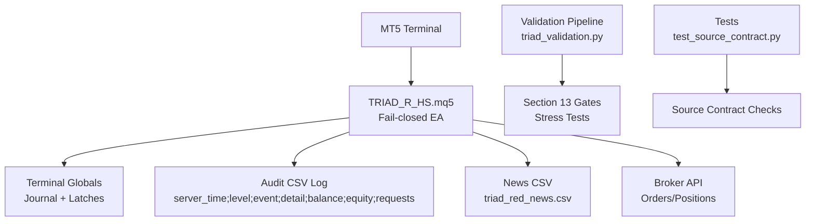
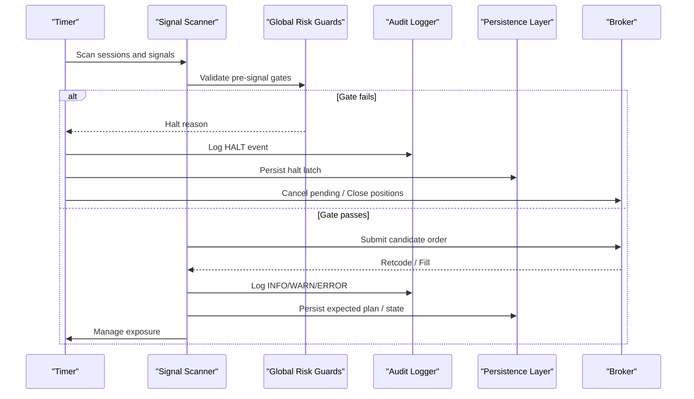
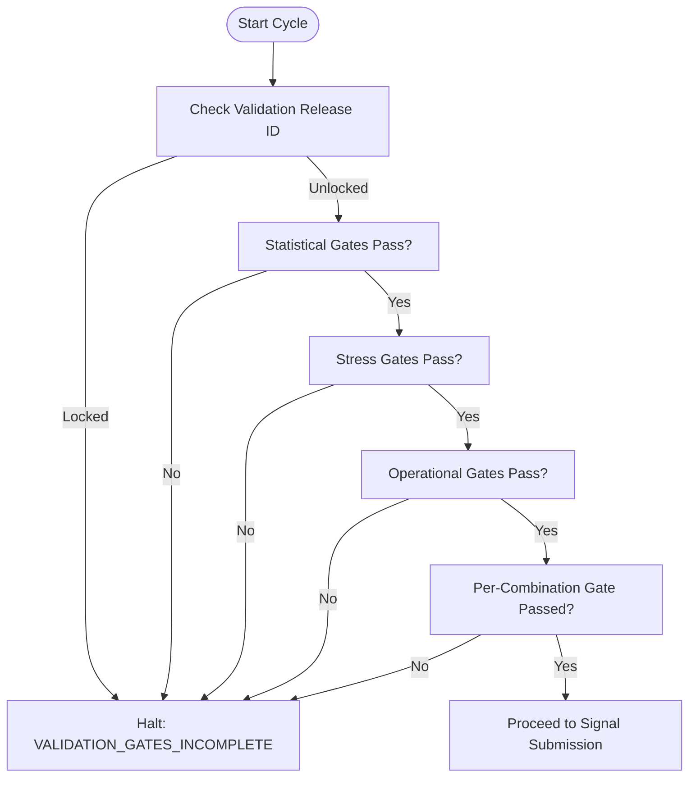
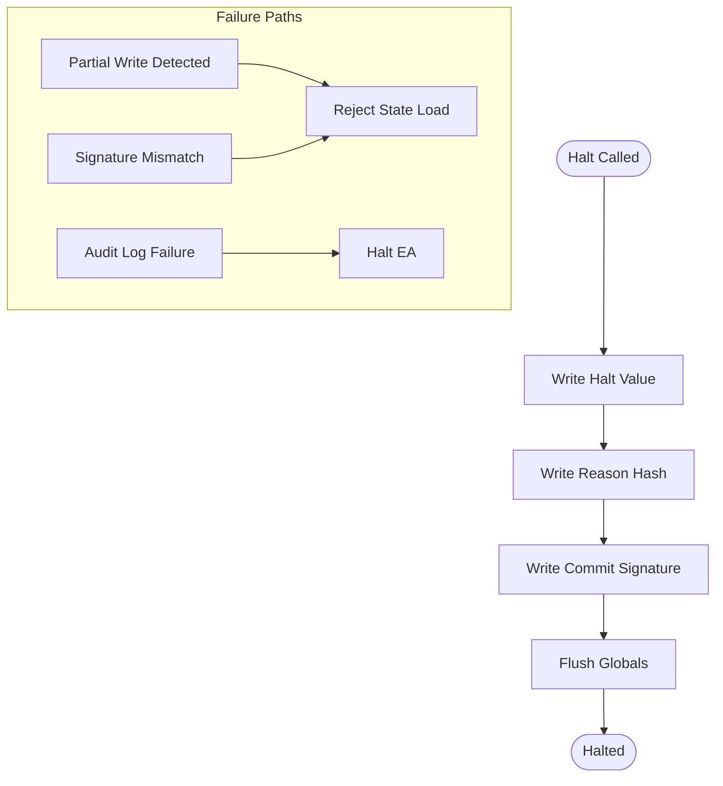
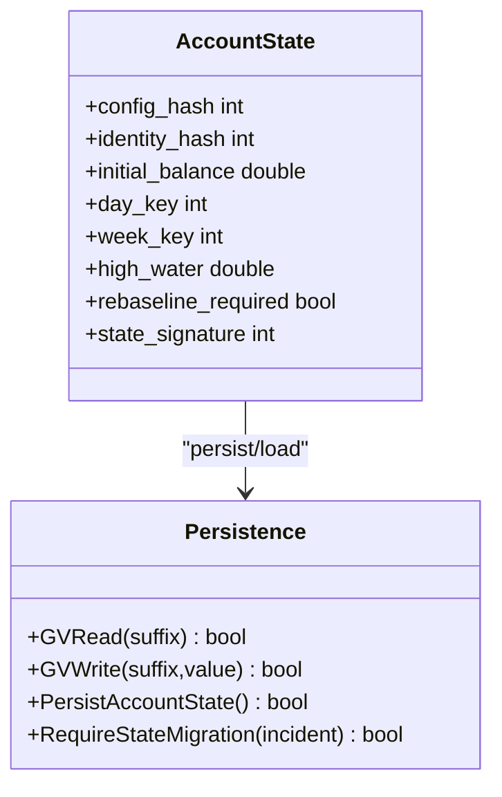
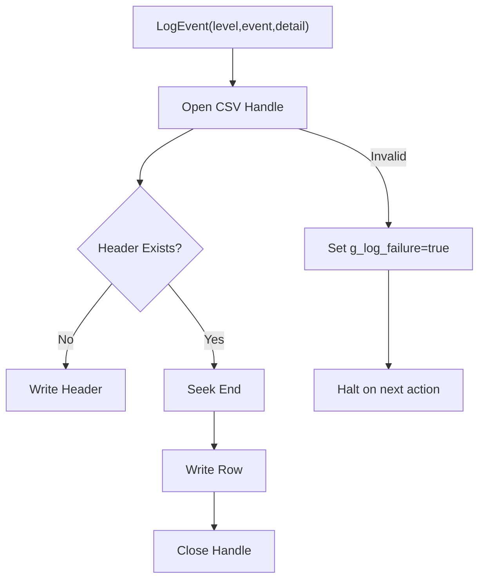
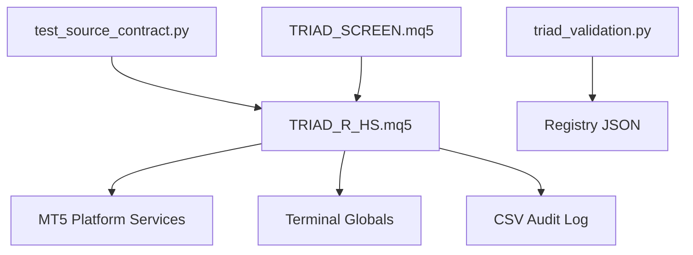

# Safety Mechanisms

<cite>
**Referenced Files in This Document**
- [TRIAD_R_HS.mq5](file://MQL5/Experts/TRIAD_R_HS/TRIAD_R_HS.mq5)
- [README.md](file://MQL5/Experts/TRIAD_R_HS/README.md)
- [THE5ERS-CHALLENGE-STRATEGY-V2.md](file://THE5ERS-CHALLENGE-STRATEGY-V2.md)
- [triad_validation.py](file://tools/triad_validation.py)
- [test_source_contract.py](file://tests/test_source_contract.py)
- [TRIAD_SCREEN.mq5](file://MQL5/Experts/TRIAD_SCREEN/TRIAD_SCREEN.mq5)
</cite>

## Table of Contents
1. [Introduction](#introduction)
2. [Project Structure](#project-structure)
3. [Core Components](#core-components)
4. [Architecture Overview](#architecture-overview)
5. [Detailed Component Analysis](#detailed-component-analysis)
6. [Dependency Analysis](#dependency-analysis)
7. [Performance Considerations](#performance-considerations)
8. [Troubleshooting Guide](#troubleshooting-guide)
9. [Conclusion](#conclusion)
10. [Appendices](#appendices)

## Introduction
This document explains the fail-closed safety architecture of TRIAD-R High Stakes (TRIAD_R_HS). It focuses on multi-layered safety gates, emergency halt mechanisms, account state validation, unauthorized access prevention, audit logging, error tracking, and recovery procedures. It also provides practical guidance for configuration, monitoring, incident response, compliance alignment, and production deployment best practices.

The design intentionally defaults to a locked, non-trading state. Execution is only enabled after explicit operator attestations and validated release artifacts pass all required checks. The EA enforces strict runtime identity, journal integrity, calendar coverage, and risk guard checks before any order submission or exposure change.

**Section sources**
- [TRIAD_R_HS.mq5:1-15](file://MQL5/Experts/TRIAD_R_HS/TRIAD_R_HS.mq5#L1-L15)
- [README.md:1-25](file://MQL5/Experts/TRIAD_R_HS/README.md#L1-L25)

## Project Structure
The safety system spans three primary areas:
- Production EA: TRIAD_R_HS.mq5 implements fail-closed execution with layered gates, persistent state, and emergency halts.
- Screening tool: TRIAD_SCREEN.mq5 mirrors strategy logic for demo screening without production safety machinery.
- Validation pipeline: tools/triad_validation.py enforces Section 13 gates and stress tests; tests validate source contracts.



**Diagram sources**
- [TRIAD_R_HS.mq5:299-327](file://MQL5/Experts/TRIAD_R_HS/TRIAD_R_HS.mq5#L299-L327)
- [TRIAD_R_HS.mq5:568-601](file://MQL5/Experts/TRIAD_R_HS/TRIAD_R_HS.mq5#L568-L601)
- [triad_validation.py:1380-1410](file://tools/triad_validation.py#L1380-L1410)
- [test_source_contract.py:44-59](file://tests/test_source_contract.py#L44-L59)

**Section sources**
- [TRIAD_R_HS.mq5:1-15](file://MQL5/Experts/TRIAD_R_HS/TRIAD_R_HS.mq5#L1-L15)
- [TRIAD_SCREEN.mq5:1-27](file://MQL5/Experts/TRIAD_SCREEN/TRIAD_SCREEN.mq5#L1-L27)
- [THE5ERS-CHALLENGE-STRATEGY-V2.md:74-93](file://THE5ERS-CHALLENGE-STRATEGY-V2.md#L74-L93)

## Core Components
- Multi-layered safety gates: validation release IDs, statistical gates, stress testing gates, operational gates, and per-combination enablement.
- Emergency halt mechanism: persistent latch with signature-bound reason, fail-closed on partial writes or mismatch.
- Account state validation: config hash, runtime identity, fresh-state authorization, rollover reconstruction, external cashflow detection.
- Unauthorized access prevention: authorized login/server checks, instance lock fencing, lifecycle locks, product code enforcement.
- Audit logging and error tracking: structured CSV log with balance/equity/request counters; errors escalate to halt.
- Recovery procedures: one-time reset inputs, migration latches, flat-only operations, formal reconciliation before resume.

**Section sources**
- [TRIAD_R_HS.mq5:53-76](file://MQL5/Experts/TRIAD_R_HS/TRIAD_R_HS.mq5#L53-L76)
- [TRIAD_R_HS.mq5:329-350](file://MQL5/Experts/TRIAD_R_HS/TRIAD_R_HS.mq5#L329-L350)
- [TRIAD_R_HS.mq5:449-492](file://MQL5/Experts/TRIAD_R_HS/TRIAD_R_HS.mq5#L449-L492)
- [TRIAD_R_HS.mq5:273-292](file://MQL5/Experts/TRIAD_R_HS/TRIAD_R_HS.mq5#L273-L292)
- [TRIAD_R_HS.mq5:494-566](file://MQL5/Experts/TRIAD_R_HS/TRIAD_R_HS.mq5#L494-L566)
- [TRIAD_R_HS.mq5:568-617](file://MQL5/Experts/TRIAD_R_HS/TRIAD_R_HS.mq5#L568-L617)
- [TRIAD_R_HS.mq5:1764-1806](file://MQL5/Experts/TRIAD_R_HS/TRIAD_R_HS.mq5#L1764-L1806)
- [README.md:53-117](file://MQL5/Experts/TRIAD_R_HS/README.md#L53-L117)

## Architecture Overview
The EA runs as a timer-driven process that continuously validates environment, news calendar, session bounds, signal candidates, and risk guards before submitting orders. All critical decisions are gated by fail-closed checks and logged to an audit file. Persistent terminal globals store configuration hashes, identity signatures, daily/weekly baselines, and halt latches. Any inconsistency triggers a halt and prevents further trading until formal reconciliation.



**Diagram sources**
- [TRIAD_R_HS.mq5:299-327](file://MQL5/Experts/TRIAD_R_HS/TRIAD_R_HS.mq5#L299-L327)
- [TRIAD_R_HS.mq5:329-350](file://MQL5/Experts/TRIAD_R_HS/TRIAD_R_HS.mq5#L329-L350)
- [TRIAD_R_HS.mq5:568-601](file://MQL5/Experts/TRIAD_R_HS/TRIAD_R_HS.mq5#L568-L601)
- [TRIAD_R_HS.mq5:1764-1806](file://MQL5/Experts/TRIAD_R_HS/TRIAD_R_HS.mq5#L1764-L1806)

## Detailed Component Analysis

### Multi-Layered Safety Gates
- Validation release ID: Defaults to LOCKED; must be replaced only after approved release artifacts and checksums are archived.
- Statistical gates: Aggregate fill count, expectancy, profit factor, per-combination eligibility enforced offline via Section 13 pipeline.
- Stress testing gates: Stressed replay with spread/slippage penalties and randomized profitable-fill removal; firm floor and shutdown overshoot checks.
- Operational gates: News blackout windows, quote freshness, latency limits, broker stop/freeze levels, Friday flat, rollover buffers, request rate caps.
- Per-combination gates: EURUSD London, GBPUSD London, USDJPY New York each require independent enablement attestation.



**Diagram sources**
- [test_source_contract.py:44-59](file://tests/test_source_contract.py#L44-L59)
- [triad_validation.py:899-915](file://tools/triad_validation.py#L899-L915)
- [triad_validation.py:1380-1410](file://tools/triad_validation.py#L1380-L1410)
- [THE5ERS-CHALLENGE-STRATEGY-V2.md:74-93](file://THE5ERS-CHALLENGE-STRATEGY-V2.md#L74-L93)

**Section sources**
- [README.md:53-73](file://MQL5/Experts/TRIAD_R_HS/README.md#L53-L73)
- [triad_validation.py:899-915](file://tools/triad_validation.py#L899-L915)
- [triad_validation.py:1380-1410](file://tools/triad_validation.py#L1380-L1410)
- [THE5ERS-CHALLENGE-STRATEGY-V2.md:74-93](file://THE5ERS-CHALLENGE-STRATEGY-V2.md#L74-L93)
- [test_source_contract.py:393-400](file://tests/test_source_contract.py#L393-L400)

### Emergency Halt Mechanisms
- Persistent halt latch: Writes halt value, reason hash, and commit signature atomically; missing or mismatched signature fails closed.
- Fail-closed behavior: On any persistence failure, audit log failure, or identity mismatch, the EA halts, cancels pending orders, and closes positions.
- One-time reset: Requires explicit authorization input; clears latch and intentionally returns initialization failure to force reattachment.



**Diagram sources**
- [TRIAD_R_HS.mq5:329-350](file://MQL5/Experts/TRIAD_R_HS/TRIAD_R_HS.mq5#L329-L350)
- [TRIAD_R_HS.mq5:449-492](file://MQL5/Experts/TRIAD_R_HS/TRIAD_R_HS.mq5#L449-L492)
- [TRIAD_R_HS.mq5:568-601](file://MQL5/Experts/TRIAD_R_HS/TRIAD_R_HS.mq5#L568-L601)

**Section sources**
- [TRIAD_R_HS.mq5:329-350](file://MQL5/Experts/TRIAD_R_HS/TRIAD_R_HS.mq5#L329-L350)
- [TRIAD_R_HS.mq5:449-492](file://MQL5/Experts/TRIAD_R_HS/TRIAD_R_HS.mq5#L449-L492)
- [README.md:99-108](file://MQL5/Experts/TRIAD_R_HS/README.md#L99-L108)

### Account State Validation
- Config hash: Includes build ID, inputs, symbols, profiles, risk parameters, news settings, and magic number; stored and verified at startup.
- Runtime identity: Hashes account login, server, currency, product code, and phase; mismatches halt immediately.
- Fresh-state authorization: One-time flag creates initial journal only when account is clean and matches configured initial balance; consumes flag and forces reattach.
- Rollover reconstruction: Detects missed or unexpected exposure across rollover; requires migration or halt.
- External cashflow detection: Baseline history timestamp used to detect deposits/withdrawals; triggers migration requirement.



**Diagram sources**
- [TRIAD_R_HS.mq5:364-428](file://MQL5/Experts/TRIAD_R_HS/TRIAD_R_HS.mq5#L364-L428)
- [TRIAD_R_HS.mq5:568-617](file://MQL5/Experts/TRIAD_R_HS/TRIAD_R_HS.mq5#L568-L617)
- [TRIAD_R_HS.mq5:3765-3860](file://MQL5/Experts/TRIAD_R_HS/TRIAD_R_HS.mq5#L3765-L3860)

**Section sources**
- [TRIAD_R_HS.mq5:364-428](file://MQL5/Experts/TRIAD_R_HS/TRIAD_R_HS.mq5#L364-L428)
- [TRIAD_R_HS.mq5:568-617](file://MQL5/Experts/TRIAD_R_HS/TRIAD_R_HS.mq5#L568-L617)
- [TRIAD_R_HS.mq5:3765-3860](file://MQL5/Experts/TRIAD_R_HS/TRIAD_R_HS.mq5#L3765-L3860)
- [README.md:75-117](file://MQL5/Experts/TRIAD_R_HS/README.md#L75-L117)

### Unauthorized Access Prevention
- Authorized account context: Requires matching login and server; tester mode bypasses for research.
- Instance lock: Owner/heartbeat global variables prevent concurrent live instances; stale instances fenced and halted.
- Lifecycle locks: Payout, phase transition, and scale transition modes cancel pending orders, close positions, and refuse new trades.
- Product code enforcement: Required product code must match; changes halt operation.

```mermaid
sequenceDiagram
participant EA as "EA"
participant GV as "Globals"
EA->>GV : Acquire owner/beat
alt Owner exists and beat recent
GV-->>EA : Duplicate instance detected
EA->>EA : Halt("duplicate_live_instance")
else No owner or stale beat
EA->>GV : Set owner=ChartID()
EA->>EA : OwnsLiveInstanceLock=true
end
Note over EA,GV : Beat refreshed periodically; loss fences stale instance
```

**Diagram sources**
- [TRIAD_R_HS.mq5:273-292](file://MQL5/Experts/TRIAD_R_HS/TRIAD_R_HS.mq5#L273-L292)
- [TRIAD_R_HS.mq5:494-566](file://MQL5/Experts/TRIAD_R_HS/TRIAD_R_HS.mq5#L494-L566)

**Section sources**
- [TRIAD_R_HS.mq5:273-292](file://MQL5/Experts/TRIAD_R_HS/TRIAD_R_HS.mq5#L273-L292)
- [TRIAD_R_HS.mq5:494-566](file://MQL5/Experts/TRIAD_R_HS/TRIAD_R_HS.mq5#L494-L566)
- [README.md:75-87](file://MQL5/Experts/TRIAD_R_HS/README.md#L75-L87)

### Audit Logging System
- Structured CSV: Columns include server_time, level, event, detail, balance, equity, requests.
- Error escalation: Log open/write failures set g_log_failure; subsequent actions halt and flatten exposure.
- Verbose control: InpVerboseLog toggles console output; ERROR/HALT always printed.
- Request counting: Each cycle increments g_request_count; caps trigger entry blocks and halts.



**Diagram sources**
- [TRIAD_R_HS.mq5:299-327](file://MQL5/Experts/TRIAD_R_HS/TRIAD_R_HS.mq5#L299-L327)

**Section sources**
- [TRIAD_R_HS.mq5:299-327](file://MQL5/Experts/TRIAD_R_HS/TRIAD_R_HS.mq5#L299-L327)
- [TRIAD_R_HS.mq5:4168-4207](file://MQL5/Experts/TRIAD_R_HS/TRIAD_R_HS.mq5#L4168-L4207)

### Recovery Procedures
- One-time fresh-state authorization: Creates initial journal only on clean accounts; consumes flag and forces reattach.
- One-time halt reset: Clears persisted halt latch only when account is flat; consumes flag and forces reattach.
- Migration latch: External cashflow, unauthorized history, or missed rollover exposure sets rebaseline_required; ordinary halt reset cannot clear it.
- Formal reconciliation: Logs preserve exact state; operator must review logs, restore authorized context, and approve migration release before resuming.

**Section sources**
- [TRIAD_R_HS.mq5:3765-3860](file://MQL5/Experts/TRIAD_R_HS/TRIAD_R_HS.mq5#L3765-L3860)
- [README.md:89-117](file://MQL5/Experts/TRIAD_R_HS/README.md#L89-L117)

## Dependency Analysis
- EA depends on MT5 platform services: TimeTradeServer, AccountInfo, Order functions, GlobalVariables.
- Validation pipeline depends on replay exports and registry schemas; tests enforce source contract compliance.
- Screening tool depends on same strategy rules but omits production safety machinery for demo use.



**Diagram sources**
- [TRIAD_R_HS.mq5:299-327](file://MQL5/Experts/TRIAD_R_HS/TRIAD_R_HS.mq5#L299-L327)
- [triad_validation.py:1380-1410](file://tools/triad_validation.py#L1380-L1410)
- [test_source_contract.py:270-312](file://tests/test_source_contract.py#L270-L312)
- [TRIAD_SCREEN.mq5:1-27](file://MQL5/Experts/TRIAD_SCREEN/TRIAD_SCREEN.mq5#L1-L27)

**Section sources**
- [TRIAD_R_HS.mq5:299-327](file://MQL5/Experts/TRIAD_R_HS/TRIAD_R_HS.mq5#L299-L327)
- [triad_validation.py:1380-1410](file://tools/triad_validation.py#L1380-L1410)
- [test_source_contract.py:270-312](file://tests/test_source_contract.py#L270-L312)
- [TRIAD_SCREEN.mq5:1-27](file://MQL5/Experts/TRIAD_SCREEN/TRIAD_SCREEN.mq5#L1-L27)

## Performance Considerations
- Timer cadence: One-second timer ensures timely checks while respecting latency and request caps.
- Quote freshness: Tick snapshot reuse avoids stale quotes; early cutoffs prevent boundary races.
- Request rate limiting: Non-emergency request cap prevents overload; breaches halt entries and may halt strategy.
- News calendar efficiency: Reload at rollover; runtime checks ensure coverage remains current without excessive IO.

[No sources needed since this section provides general guidance]

## Troubleshooting Guide
Common issues and responses:
- Audit log failure: Immediate halt; cancel pending orders; close positions; investigate file permissions and disk space.
- Identity mismatch: Restore authorized login/server; do not delete globals; reconcile logs and restart.
- Fresh state not authorized: Ensure account is clean and matches initial balance; set one-time flag once; reattach.
- Migration required: External cashflow or unauthorized history detected; formal rebaseline release required; do not use ordinary halt reset.
- Duplicate instance: Only one live instance allowed; terminate extra charts; verify heartbeat and owner globals.

**Section sources**
- [TRIAD_R_HS.mq5:299-327](file://MQL5/Experts/TRIAD_R_HS/TRIAD_R_HS.mq5#L299-L327)
- [TRIAD_R_HS.mq5:3765-3860](file://MQL5/Experts/TRIAD_R_HS/TRIAD_R_HS.mq5#L3765-L3860)
- [TRIAD_R_HS.mq5:494-566](file://MQL5/Experts/TRIAD_R_HS/TRIAD_R_HS.mq5#L494-L566)
- [README.md:75-117](file://MQL5/Experts/TRIAD_R_HS/README.md#L75-L117)

## Conclusion
TRIAD-R’s fail-closed design ensures that trading can proceed only when every safety gate passes and all state validations succeed. The system combines strict runtime checks, persistent latches with cryptographic signatures, comprehensive audit logging, and formal recovery procedures. Production deployment requires adherence to the validation sequence, explicit operator approvals, and continuous monitoring of logs and alerts. Compliance with challenge rules and firm policies is enforced through immutable constraints and offline Section 13 validation.

[No sources needed since this section summarizes without analyzing specific files]

## Appendices

### Practical Examples

#### Safety Gate Configuration
- Default locked state: Order submission disabled; all release gates false; release ID LOCKED.
- Enablement checklist: Compile with zero errors; run Python tests; Strategy Tester runs; Section 13 validation; forward demo; explicit approval.
- Per-combination enablement: EURUSD London, GBPUSD London, USDJPY New York each require independent attestation.

**Section sources**
- [README.md:53-73](file://MQL5/Experts/TRIAD_R_HS/README.md#L53-L73)
- [test_source_contract.py:44-59](file://tests/test_source_contract.py#L44-L59)
- [test_source_contract.py:393-400](file://tests/test_source_contract.py#L393-L400)

#### Monitoring Setup
- Watch for ERROR and HALT events in Experts log and CSV audit file.
- Monitor request count against daily cap; breaches block entries and may halt strategy.
- Verify news calendar coverage extends beyond required hours; stale coverage fails closed.

**Section sources**
- [TRIAD_R_HS.mq5:299-327](file://MQL5/Experts/TRIAD_R_HS/TRIAD_R_HS.mq5#L299-L327)
- [TRIAD_R_HS.mq5:1764-1806](file://MQL5/Experts/TRIAD_R_HS/TRIAD_R_HS.mq5#L1764-L1806)
- [README.md:27-49](file://MQL5/Experts/TRIAD_R_HS/README.md#L27-L49)

#### Incident Response Procedures
- Audit log failure: Halt immediately; cancel pending orders; close positions; fix file system; reattach.
- Identity mismatch: Restore authorized context; do not delete globals; reconcile logs; reinitialize.
- Migration required: Investigate external cashflow or unauthorized history; prepare rebaseline release; formal review before resume.
- Duplicate instance: Terminate extra charts; ensure single owner; verify heartbeat; reattach if necessary.

**Section sources**
- [TRIAD_R_HS.mq5:299-327](file://MQL5/Experts/TRIAD_R_HS/TRIAD_R_HS.mq5#L299-L327)
- [TRIAD_R_HS.mq5:3765-3860](file://MQL5/Experts/TRIAD_R_HS/TRIAD_R_HS.mq5#L3765-L3860)
- [TRIAD_R_HS.mq5:494-566](file://MQL5/Experts/TRIAD_R_HS/TRIAD_R_HS.mq5#L494-L566)
- [README.md:75-117](file://MQL5/Experts/TRIAD_R_HS/README.md#L75-L117)

### Compliance Requirements and Best Practices
- Immutable profile: One position, no grids/martingale, broker-visible stops, news blackout, rate limits, fixed base-risk process.
- Pre-signal gates: Instrument/session enabled, no exposure, range/ATR/spread/cost valid, news clear, quote freshness, latency within bounds, stop/target valid, volume within tier, target fits range, stressed loss above floors.
- Production best practices: Keep order submission disabled until full validation; archive source/build/checksums; preserve logs/state; use one-time authorizations carefully; never leave flags true.

**Section sources**
- [THE5ERS-CHALLENGE-STRATEGY-V2.md:11-50](file://THE5ERS-CHALLENGE-STRATEGY-V2.md#L11-L50)
- [THE5ERS-CHALLENGE-STRATEGY-V2.md:74-93](file://THE5ERS-CHALLENGE-STRATEGY-V2.md#L74-L93)
- [README.md:227-247](file://MQL5/Experts/TRIAD_R_HS/README.md#L227-L247)