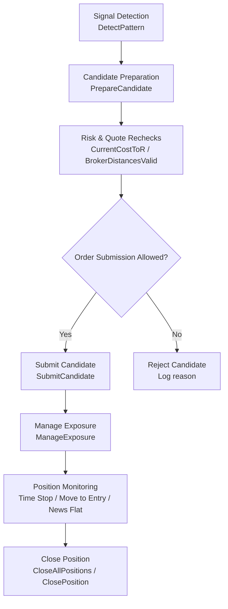
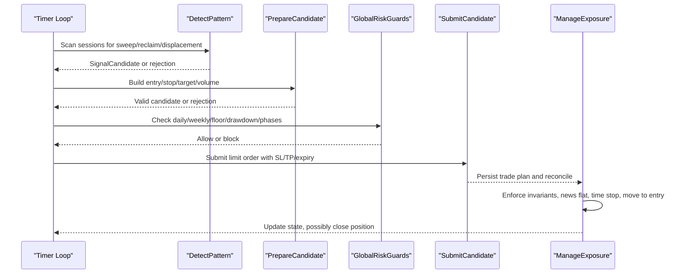
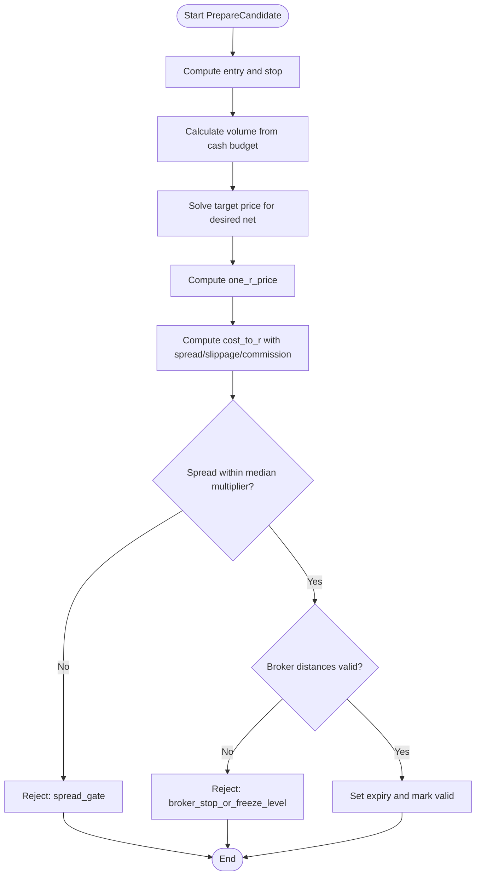
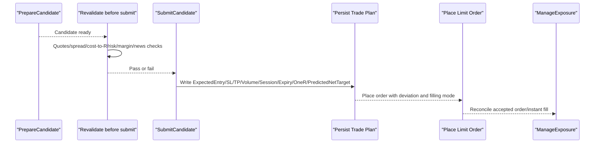
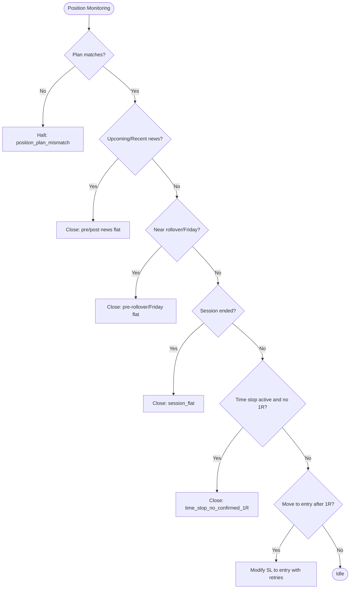
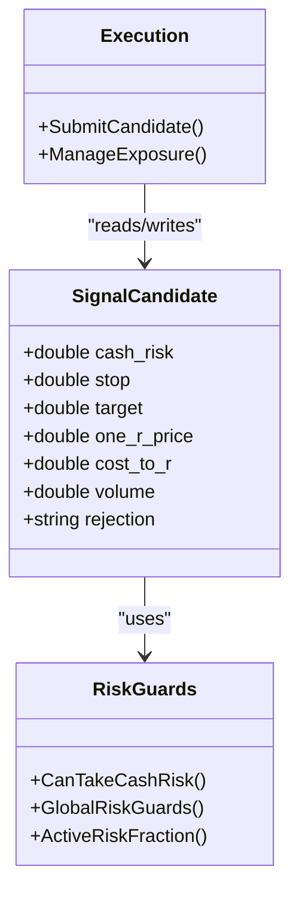
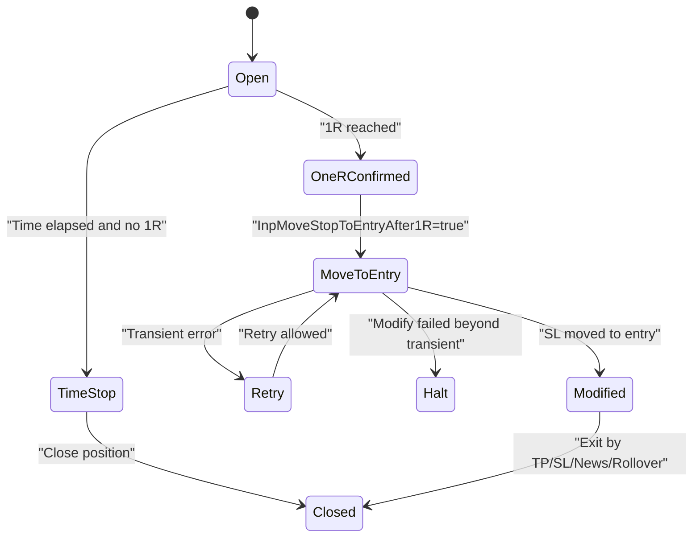
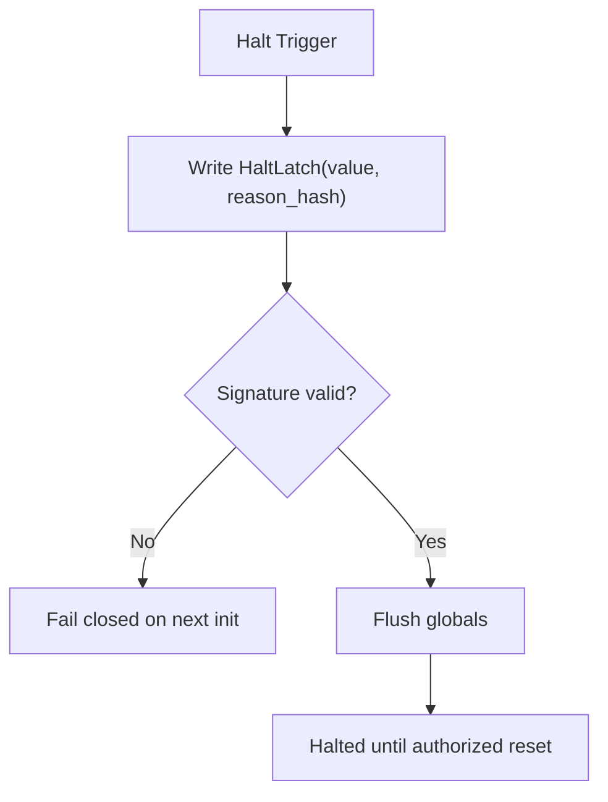
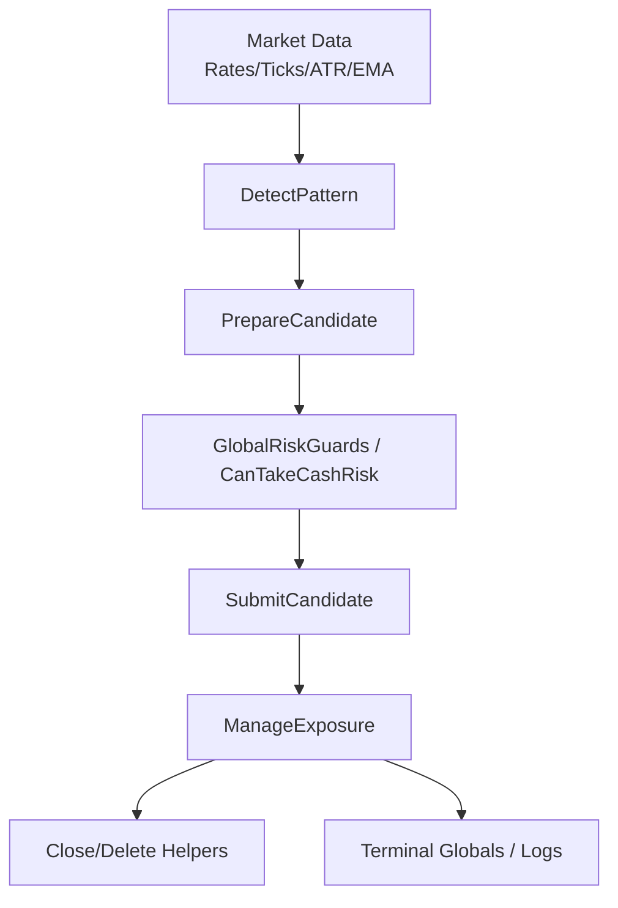

# Position Lifecycle Management

<cite>
**Referenced Files in This Document**
- [TRIAD_R_HS.mq5](file://MQL5/Experts/TRIAD_R_HS/TRIAD_R_HS.mq5)
- [README.md](file://MQL5/Experts/TRIAD_R_HS/README.md)
</cite>

## Table of Contents
1. [Introduction](#introduction)
2. [Project Structure](#project-structure)
3. [Core Components](#core-components)
4. [Architecture Overview](#architecture-overview)
5. [Detailed Component Analysis](#detailed-component-analysis)
6. [Dependency Analysis](#dependency-analysis)
7. [Performance Considerations](#performance-considerations)
8. [Troubleshooting Guide](#troubleshooting-guide)
9. [Conclusion](#conclusion)

## Introduction
This document explains the TRIAD-R position lifecycle management system implemented in the MQL5 Expert Advisor. It covers the end-to-end flow from signal detection through order submission, position monitoring, and closure. It also documents risk controls including cash-based position sizing, stop loss placement, target calculation, one-R price computation, cost-to-R evaluation, time stops, move-stop-to-entry after 1R confirmation, emergency halts, position cancellation procedures, and recovery protocols. Practical examples illustrate state transitions and workflows for safe operation.

## Project Structure
The implementation is a single MQL5 Expert Advisor with embedded enums, structs, global state, and functions that implement:
- Session and calendar management
- Signal detection (sweep/reclaim/displacement)
- Risk calculations (cash risk, volume, target, one-R, cost-to-R)
- Order submission and exposure management
- Time stops and post-entry modifications
- Emergency halt and recovery logic
- Persistence and audit logging

**Diagram sources**
- [TRIAD_R_HS.mq5:1936-2116](file://MQL5/Experts/TRIAD_R_HS/TRIAD_R_HS.mq5#L1936-L2116)
- [TRIAD_R_HS.mq5:2380-2522](file://MQL5/Experts/TRIAD_R_HS/TRIAD_R_HS.mq5#L2380-L2522)
- [TRIAD_R_HS.mq5:2692-2901](file://MQL5/Experts/TRIAD_R_HS/TRIAD_R_HS.mq5#L2692-L2901)
- [TRIAD_R_HS.mq5:2942-3284](file://MQL5/Experts/TRIAD_R_HS/TRIAD_R_HS.mq5#L2942-L3284)

**Section sources**
- [TRIAD_R_HS.mq5:16-50](file://MQL5/Experts/TRIAD_R_HS/TRIAD_R_HS.mq5#L16-L50)
- [TRIAD_R_HS.mq5:158-207](file://MQL5/Experts/TRIAD_R_HS/TRIAD_R_HS.mq5#L158-L207)
- [TRIAD_R_HS.mq5:213-262](file://MQL5/Experts/TRIAD_R_HS/TRIAD_R_HS.mq5#L213-L262)

## Core Components
- Signal candidate structure holds session metadata, geometry, risk metrics, and rejection reasons.
- Session runtime tracks London and New York windows, range bounds, and consumption flags.
- Global state includes halt latches, daily/weekly floors, high-water balance, request counters, and news blackout tracking.
- Risk guards enforce firm floor, internal daily/weekly stops, drawdown shutdown, phase targets, and lifecycle locks.
- Trade execution uses limit orders with explicit expiry, SL/TP, and plan persistence to terminal globals for reconciliation.

Key fields used across the lifecycle:
- cash_risk: actual worst-case cash loss at stop plus commission and slippage reserve
- stop: computed from sweep extreme with ATR buffer and normalized to tick size
- target: solved to achieve desired net profit equal to cash_risk × target R
- one_r_price: entry ± stop distance, normalized; used for 1R confirmation and pre-entry guard
- cost_to_r: spread + adverse slippage + commission divided by price risk; must be below threshold

**Section sources**
- [TRIAD_R_HS.mq5:180-207](file://MQL5/Experts/TRIAD_R_HS/TRIAD_R_HS.mq5#L180-L207)
- [TRIAD_R_HS.mq5:158-178](file://MQL5/Experts/TRIAD_R_HS/TRIAD_R_HS.mq5#L158-L178)
- [TRIAD_R_HS.mq5:2217-2271](file://MQL5/Experts/TRIAD_R_HS/TRIAD_R_HS.mq5#L2217-L2271)
- [TRIAD_R_HS.mq5:2273-2309](file://MQL5/Experts/TRIAD_R_HS/TRIAD_R_HS.mq5#L2273-L2309)
- [TRIAD_R_HS.mq5:2172-2204](file://MQL5/Experts/TRIAD_R_HS/TRIAD_R_HS.mq5#L2172-L2204)

## Architecture Overview
The EA runs a timer-driven loop that:
- Refreshes session bounds and ranges
- Detects patterns on completed bars
- Prepares candidates with strict quote, spread, and cost gates
- Submits a single-position limit order with SL/TP and expiry
- Monitors pending orders and positions, enforcing invariants and safety rules
- Applies time stops and optional move-to-entry after 1R confirmation
- Flattens around news events, rollover, Friday close, and risk guard triggers

**Diagram sources**
- [TRIAD_R_HS.mq5:1867-1909](file://MQL5/Experts/TRIAD_R_HS/TRIAD_R_HS.mq5#L1867-L1909)
- [TRIAD_R_HS.mq5:1936-2116](file://MQL5/Experts/TRIAD_R_HS/TRIAD_R_HS.mq5#L1936-L2116)
- [TRIAD_R_HS.mq5:2380-2522](file://MQL5/Experts/TRIAD_R_HS/TRIAD_R_HS.mq5#L2380-L2522)
- [TRIAD_R_HS.mq5:2692-2901](file://MQL5/Experts/TRIAD_R_HS/TRIAD_R_HS.mq5#L2692-L2901)
- [TRIAD_R_HS.mq5:2942-3284](file://MQL5/Experts/TRIAD_R_HS/TRIAD_R_HS.mq5#L2942-L3284)

## Detailed Component Analysis

### Signal Detection and Candidate Preparation
- Pattern detection scans the first qualifying sweep within the entry window, validates reclaim wick strength, and requires displacement confirming direction and body size.
- Candidate preparation computes:
  - Entry as midpoint of displacement bar
  - Stop based on sweep extreme minus ATR buffer, normalized down/up
  - Volume from cash budget using worst-case loss including slippage reserve and commission
  - Target via binary search to meet desired net profit = cash_risk × target R
  - One-R price as entry ± stop distance, normalized
  - Cost-to-R using current spread, configured slippage reserves, and commission

**Diagram sources**
- [TRIAD_R_HS.mq5:2380-2522](file://MQL5/Experts/TRIAD_R_HS/TRIAD_R_HS.mq5#L2380-L2522)
- [TRIAD_R_HS.mq5:2217-2309](file://MQL5/Experts/TRIAD_R_HS/TRIAD_R_HS.mq5#L2217-L2309)
- [TRIAD_R_HS.mq5:2172-2204](file://MQL5/Experts/TRIAD_R_HS/TRIAD_R_HS.mq5#L2172-L2204)

**Section sources**
- [TRIAD_R_HS.mq5:1936-2116](file://MQL5/Experts/TRIAD_R_HS/TRIAD_R_HS.mq5#L1936-L2116)
- [TRIAD_R_HS.mq5:2217-2309](file://MQL5/Experts/TRIAD_R_HS/TRIAD_R_HS.mq5#L2217-L2309)
- [TRIAD_R_HS.mq5:2380-2522](file://MQL5/Experts/TRIAD_R_HS/TRIAD_R_HS.mq5#L2380-L2522)

### Order Submission Workflow
- Before submission, the EA revalidates quotes, spread, cost-to-R, cash risk budget, margin availability, news blackout, daily state, global risk guards, and session expiry.
- On success, it persists the trade plan into terminal globals (entry, SL, TP, one-R, volume, session, expiry, predicted net target), then submits a BuyLimit or SellLimit with specified expiration.
- Post-submission, ManageExposure reconciles immediately to handle partial fills, missing exits, or unexpected exposures.

**Diagram sources**
- [TRIAD_R_HS.mq5:2692-2901](file://MQL5/Experts/TRIAD_R_HS/TRIAD_R_HS.mq5#L2692-L2901)
- [TRIAD_R_HS.mq5:2942-3284](file://MQL5/Experts/TRIAD_R_HS/TRIAD_R_HS.mq5#L2942-L3284)

**Section sources**
- [TRIAD_R_HS.mq5:2692-2901](file://MQL5/Experts/TRIAD_R_HS/TRIAD_R_HS.mq5#L2692-L2901)

### Position Monitoring and Exit Controls
- Pending order controls:
  - Delete if expired, stale quote, symbol not full trade mode, missing visible SL/TP, theoretical 1R without fill, or session end.
- Position controls:
  - Validate against expected plan; repair missing SL/TP once; otherwise close and halt.
  - Flatten before upcoming news and after recent news.
  - Flatten near server midnight rollover and on Friday late afternoon.
  - Close at session end.
  - Apply time stop if InpTimeStopMinutes > 0 and no 1R confirmation yet.
  - Move stop to entry after 1R confirmation if enabled, with retry limits and persistence safeguards.

**Diagram sources**
- [TRIAD_R_HS.mq5:2942-3284](file://MQL5/Experts/TRIAD_R_HS/TRIAD_R_HS.mq5#L2942-L3284)

**Section sources**
- [TRIAD_R_HS.mq5:2942-3284](file://MQL5/Experts/TRIAD_R_HS/TRIAD_R_HS.mq5#L2942-L3284)

### Risk Management Integration
- Cash risk and position sizing:
  - Budget = PhaseInitialBalance × ActiveRiskFraction (halved under drawdown).
  - Worst-case loss per lot includes adverse stop slippage and round-trip commission.
  - Volume is grid-aligned to SYMBOL_VOLUME_MIN and step, capped by maximum and directional limit.
- Stop loss:
  - Computed from sweep extreme with ATR buffer; validated against ATR min/max and broker freeze/stops levels.
- Target:
  - Solved to deliver net profit equal to cash_risk × target R, accounting for commission and target slippage reserve.
- One-R price:
  - Entry ± stop distance, normalized; used for confirmation and pre-entry guard.
- Cost-to-R:
  - Includes spread, adverse slippage, and commission relative to price risk; must be below threshold.

**Diagram sources**
- [TRIAD_R_HS.mq5:180-207](file://MQL5/Experts/TRIAD_R_HS/TRIAD_R_HS.mq5#L180-L207)
- [TRIAD_R_HS.mq5:1628-1712](file://MQL5/Experts/TRIAD_R_HS/TRIAD_R_HS.mq5#L1628-L1712)
- [TRIAD_R_HS.mq5:2692-2901](file://MQL5/Experts/TRIAD_R_HS/TRIAD_R_HS.mq5#L2692-L2901)
- [TRIAD_R_HS.mq5:2942-3284](file://MQL5/Experts/TRIAD_R_HS/TRIAD_R_HS.mq5#L2942-L3284)

**Section sources**
- [TRIAD_R_HS.mq5:1628-1712](file://MQL5/Experts/TRIAD_R_HS/TRIAD_R_HS.mq5#L1628-L1712)
- [TRIAD_R_HS.mq5:2217-2309](file://MQL5/Experts/TRIAD_R_HS/TRIAD_R_HS.mq5#L2217-L2309)
- [TRIAD_R_HS.mq5:2380-2522](file://MQL5/Experts/TRIAD_R_HS/TRIAD_R_HS.mq5#L2380-L2522)

### Time Stop and Move Stop to Entry After 1R
- Time stop:
  - If InpTimeStopMinutes > 0 and the position has been open longer than the configured minutes without confirmed 1R, the position is closed with reason “time_stop_no_confirmed_1R”.
- Move stop to entry after 1R:
  - When enabled and 1R is confirmed, the EA attempts to move SL to entry with up to two attempts, persisting attempt count and throttling modifications. Failures beyond transient errors trigger a halt.

**Diagram sources**
- [TRIAD_R_HS.mq5:3202-3284](file://MQL5/Experts/TRIAD_R_HS/TRIAD_R_HS.mq5#L3202-L3284)

**Section sources**
- [TRIAD_R_HS.mq5:3202-3284](file://MQL5/Experts/TRIAD_R_HS/TRIAD_R_HS.mq5#L3202-L3284)

### Emergency Halt Mechanisms and Recovery Protocols
- Halt triggers include:
  - Audit log failures, account identity mismatch, external cashflows, unauthorized history, missed rollover exposure, latency breaches, missing visible exits, and persistent state mismatches.
- Latch persistence:
  - Halt value and reason hash are persisted with a signature bound to configuration and identity; partial writes fail closed.
- Recovery:
  - Ordinary halt reset requires one-time authorization input and a flat account; migration latches require a separately reviewed rebaseline release.
- Instance lock:
  - Live instance ownership via terminal globals prevents concurrent instances; stale instances are fenced and halted.

**Diagram sources**
- [TRIAD_R_HS.mq5:329-350](file://MQL5/Experts/TRIAD_R_HS/TRIAD_R_HS.mq5#L329-L350)
- [TRIAD_R_HS.mq5:449-492](file://MQL5/Experts/TRIAD_R_HS/TRIAD_R_HS.mq5#L449-L492)
- [TRIAD_R_HS.mq5:494-566](file://MQL5/Experts/TRIAD_R_HS/TRIAD_R_HS.mq5#L494-L566)

**Section sources**
- [TRIAD_R_HS.mq5:329-350](file://MQL5/Experts/TRIAD_R_HS/TRIAD_R_HS.mq5#L329-L350)
- [TRIAD_R_HS.mq5:449-492](file://MQL5/Experts/TRIAD_R_HS/TRIAD_R_HS.mq5#L449-L492)
- [TRIAD_R_HS.mq5:494-566](file://MQL5/Experts/TRIAD_R_HS/TRIAD_R_HS.mq5#L494-L566)

### Position Cancellation Procedures
- Cancel all pending orders:
  - Iterates orders with strategy magic and deletes each, handling incomplete deletions and persisting absence via terminal globals.
- Close all positions:
  - Iterates positions with strategy magic and closes each, validating filling mode and handling incomplete closures.

**Section sources**
- [TRIAD_R_HS.mq5:2672-2690](file://MQL5/Experts/TRIAD_R_HS/TRIAD_R_HS.mq5#L2672-L2690)

### Practical Examples of Position State Transitions
- Example 1: Valid signal to filled position
  - DetectPattern finds sweep/reclaim/displacement → PrepareCandidate passes spread/cost-to-R/broker checks → SubmitCandidate places limit with SL/TP/expiry → ManageExposure confirms plan and monitors.
- Example 2: Time stop exit
  - Position opened → no 1R confirmation within InpTimeStopMinutes → ManageExposure closes with reason “time_stop_no_confirmed_1R”.
- Example 3: Move stop to entry after 1R
  - 1R confirmed → OneRConfirmed set → Move SL to entry with retries → If successful, SL equals entry; otherwise halt on persistent failure.

[No sources needed since this section summarizes workflows already sourced above]

## Dependency Analysis
- The EA depends on:
  - Market data (rates, ticks, ATR, EMA handles)
  - Symbol properties (points, volumes, trade modes)
  - Account state (balance, equity, leverage, margin)
  - Terminal globals for persistence and instance locking
  - News calendar CSV for blackout and flat rules
- Coupling:
  - Signal detection feeds candidate preparation which drives risk and execution paths.
  - ManageExposure centralizes position and pending order governance, calling close/delete helpers.
- External integrations:
  - MT5 Trade API for order submission and modification
  - File system for news CSV and audit logs

**Diagram sources**
- [TRIAD_R_HS.mq5:1006-1063](file://MQL5/Experts/TRIAD_R_HS/TRIAD_R_HS.mq5#L1006-L1063)
- [TRIAD_R_HS.mq5:1936-2116](file://MQL5/Experts/TRIAD_R_HS/TRIAD_R_HS.mq5#L1936-L2116)
- [TRIAD_R_HS.mq5:2380-2522](file://MQL5/Experts/TRIAD_R_HS/TRIAD_R_HS.mq5#L2380-L2522)
- [TRIAD_R_HS.mq5:2692-2901](file://MQL5/Experts/TRIAD_R_HS/TRIAD_R_HS.mq5#L2692-L2901)
- [TRIAD_R_HS.mq5:2942-3284](file://MQL5/Experts/TRIAD_R_HS/TRIAD_R_HS.mq5#L2942-L3284)

**Section sources**
- [TRIAD_R_HS.mq5:1006-1063](file://MQL5/Experts/TRIAD_R_HS/TRIAD_R_HS.mq5#L1006-L1063)
- [TRIAD_R_HS.mq5:1936-2116](file://MQL5/Experts/TRIAD_R_HS/TRIAD_R_HS.mq5#L1936-L2116)
- [TRIAD_R_HS.mq5:2380-2522](file://MQL5/Experts/TRIAD_R_HS/TRIAD_R_HS.mq5#L2380-L2522)
- [TRIAD_R_HS.mq5:2692-2901](file://MQL5/Experts/TRIAD_R_HS/TRIAD_R_HS.mq5#L2692-L2901)
- [TRIAD_R_HS.mq5:2942-3284](file://MQL5/Experts/TRIAD_R_HS/TRIAD_R_HS.mq5#L2942-L3284)

## Performance Considerations
- Quote freshness and spread gates prevent trading during illiquid or volatile conditions.
- Cost-to-R limits ensure transaction costs do not erode edge.
- Request throttling and latency caps protect against overload and slow servers.
- History-based statistics use fixed lookback windows to maintain regime consistency.
- One-second synchronous request ceiling and ten-second safety lead reduce timing risks.

[No sources needed since this section provides general guidance]

## Troubleshooting Guide
Common issues and resolutions:
- Order rejections:
  - Causes: stale quotes, spread gate, broker freeze/stops, insufficient margin, cost-to-R exceeded, news blackout, daily state or global risk guard failures.
  - Resolution: verify symbol properties, news calendar coverage, account permissions, and risk parameters; check Experts log for specific rejection reason.
- Slippage handling:
  - Adverse slippage reserves are included in cost-to-R and cash loss calculations; if realized slippage exceeds expectations, consider adjusting slippage reserves or tightening cost-to-R thresholds.
- Account state validation failures:
  - Causes: config hash mismatch, identity mismatch, persisted state signature mismatch, external cashflows, unauthorized history, missed rollover exposure.
  - Resolution: restore authorized account context, reconcile history, complete formal rebaseline/migration process when required, and avoid deleting terminal globals.

Operational checks:
- Ensure news CSV coverage extends beyond required hours and contains explicit COVERAGE declaration.
- Confirm server offset matches expected UTC offset within tolerance.
- Verify symbol base/profit currencies and trade capabilities.
- Keep order submission disabled unless all validation gates pass.

**Section sources**
- [TRIAD_R_HS.mq5:2380-2522](file://MQL5/Experts/TRIAD_R_HS/TRIAD_R_HS.mq5#L2380-L2522)
- [TRIAD_R_HS.mq5:2692-2901](file://MQL5/Experts/TRIAD_R_HS/TRIAD_R_HS.mq5#L2692-L2901)
- [TRIAD_R_HS.mq5:3536-3597](file://MQL5/Experts/TRIAD_R_HS/TRIAD_R_HS.mq5#L3536-L3597)
- [TRIAD_R_HS.mq5:3654-3731](file://MQL5/Experts/TRIAD_R_HS/TRIAD_R_HS.mq5#L3654-L3731)
- [TRIAD_R_HS.mq5:3765-3948](file://MQL5/Experts/TRIAD_R_HS/TRIAD_R_HS.mq5#L3765-L3948)

## Conclusion
The TRIAD-R position lifecycle management system implements a rigorous, fail-closed workflow from signal detection to position closure. It integrates robust risk controls centered on cash risk, precise stop and target calculations, one-R confirmation, and cost-to-R evaluation. Operational safeguards include time stops, move-to-entry after 1R, news and rollover flattening, emergency halts with persistent latches, and comprehensive recovery protocols. Proper setup, validation, and monitoring are essential to ensure safe and compliant operation.