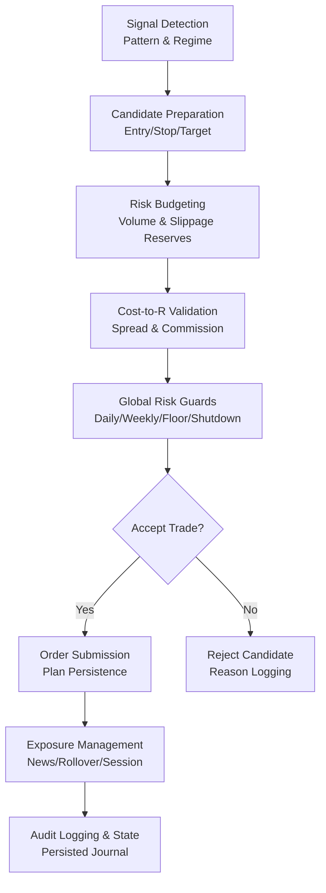
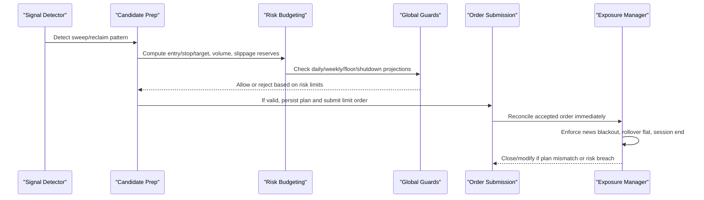
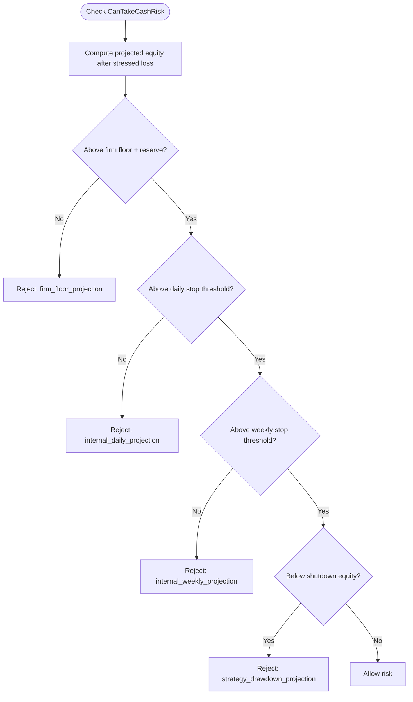
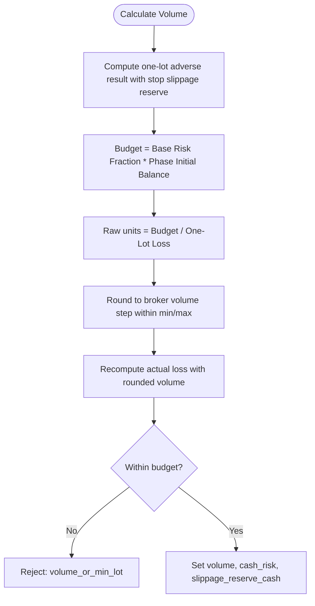
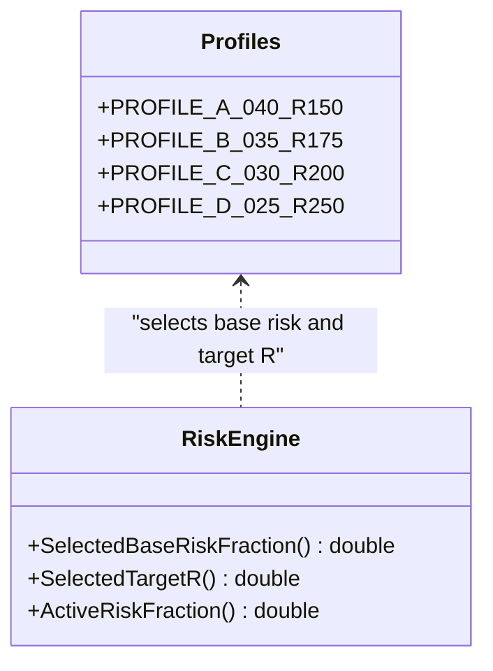
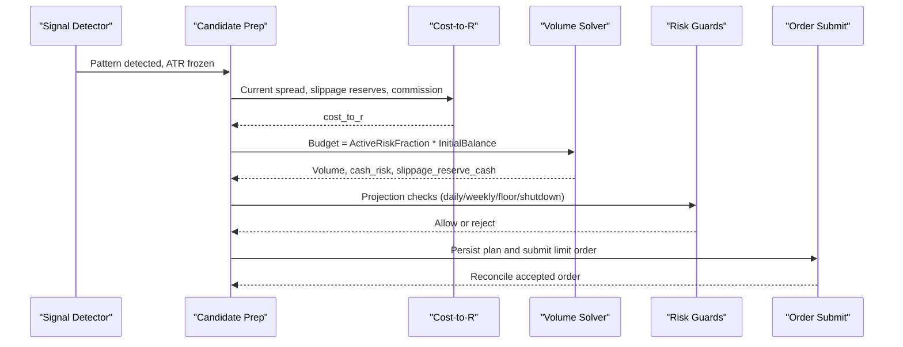
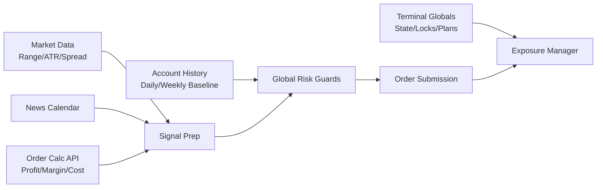

# Risk Engine and Controls

<cite>
**Referenced Files in This Document**
- [TRIAD_R_HS.mq5](file://MQL5/Experts/TRIAD_R_HS/TRIAD_R_HS.mq5)
- [README.md](file://MQL5/Experts/TRIAD_R_HS/README.md)
</cite>

## Table of Contents
1. [Introduction](#introduction)
2. [Project Structure](#project-structure)
3. [Core Components](#core-components)
4. [Architecture Overview](#architecture-overview)
5. [Detailed Component Analysis](#detailed-component-analysis)
6. [Dependency Analysis](#dependency-analysis)
7. [Performance Considerations](#performance-considerations)
8. [Troubleshooting Guide](#troubleshooting-guide)
9. [Conclusion](#conclusion)

## Introduction
This document explains the TRIAD-R risk engine and control systems implemented in the High Stakes Expert Advisor. It focuses on multi-tier drawdown controls, position sizing with spread median multiplier, commission handling, and slippage reserves; the risk profile system and parameter mappings; practical risk calculation workflows; drawdown reduction triggers and shutdown conditions; maximum cost-to-R validation for trade acceptance; emergency halt mechanisms; instance locking for live trading safety; and audit logging for compliance.

## Project Structure
The risk engine is implemented as a single MQL5 Expert Advisor that integrates signal detection, market statistics, risk guards, order preparation, submission, and exposure management. Supporting documentation clarifies safe installation, news calendar contract, and operational constraints.

**Diagram sources**
- [TRIAD_R_HS.mq5:1936-2521](file://MQL5/Experts/TRIAD_R_HS/TRIAD_R_HS.mq5#L1936-L2521)
- [TRIAD_R_HS.mq5:2692-2900](file://MQL5/Experts/TRIAD_R_HS/TRIAD_R_HS.mq5#L2692-L2900)
- [TRIAD_R_HS.mq5:2942-3199](file://MQL5/Experts/TRIAD_R_HS/TRIAD_R_HS.mq5#L2942-L3199)

**Section sources**
- [TRIAD_R_HS.mq5:16-149](file://MQL5/Experts/TRIAD_R_HS/TRIAD_R_HS.mq5#L16-L149)
- [TRIAD_R_HS.mq5:268-600](file://MQL5/Experts/TRIAD_R_HS/TRIAD_R_HS.mq5#L268-L600)
- [README.md:15-146](file://MQL5/Experts/TRIAD_R_HS/README.md#L15-L146)

## Core Components
- Multi-tier drawdown controls: internal daily stop, internal weekly stop, firm floor reserve, strategy drawdown thresholds.
- Position sizing algorithm: spread median multiplier, commission round-trip per lot, slippage reserves at stop and target.
- Risk profiles: four paired risk/target profiles mapping base risk fraction and target R.
- Cost-to-R validation: current spread, slippage, and commission converted to cost per unit risk.
- Emergency halts and instance locking: fail-closed safeguards with persisted latches and heartbeat fencing.
- Audit logging: CSV-based event log with headers and error tracking.

Key input parameters used by these components are defined near the top of the EA and referenced throughout risk checks and candidate preparation.

**Section sources**
- [TRIAD_R_HS.mq5:121-149](file://MQL5/Experts/TRIAD_R_HS/TRIAD_R_HS.mq5#L121-L149)
- [TRIAD_R_HS.mq5:1621-1712](file://MQL5/Experts/TRIAD_R_HS/TRIAD_R_HS.mq5#L1621-L1712)
- [TRIAD_R_HS.mq5:2172-2309](file://MQL5/Experts/TRIAD_R_HS/TRIAD_R_HS.mq5#L2172-L2309)
- [TRIAD_R_HS.mq5:294-350](file://MQL5/Experts/TRIAD_R_HS/TRIAD_R_HS.mq5#L294-L350)

## Architecture Overview
The risk engine operates as a pipeline from signal detection through candidate preparation, risk budgeting, cost validation, global guard checks, and order submission or rejection. Exposure management enforces session boundaries, news buffers, rollover flat rules, and plan reconciliation.

**Diagram sources**
- [TRIAD_R_HS.mq5:1936-2521](file://MQL5/Experts/TRIAD_R_HS/TRIAD_R_HS.mq5#L1936-L2521)
- [TRIAD_R_HS.mq5:2692-2900](file://MQL5/Experts/TRIAD_R_HS/TRIAD_R_HS.mq5#L2692-L2900)
- [TRIAD_R_HS.mq5:2942-3199](file://MQL5/Experts/TRIAD_R_HS/TRIAD_R_HS.mq5#L2942-L3199)

## Detailed Component Analysis

### Multi-Tier Drawdown Controls
- Internal daily stop: prevents new entries when projected equity would fall below day-start balance minus a percentage of phase initial balance.
- Internal weekly stop: same logic applied to week-start balance.
- Firm floor reserve: ensures projected equity stays above a combined firm overall floor plus a reserve derived from the configured firm floor percent and one-trade slippage reserve.
- Strategy drawdown shutdown: shuts down trading when current drawdown from high-water reaches the configured shutdown percent.

These checks occur both before taking cash risk (projection-based) and as runtime guards (equity-based), ensuring fail-closed behavior.

**Diagram sources**
- [TRIAD_R_HS.mq5:1679-1712](file://MQL5/Experts/TRIAD_R_HS/TRIAD_R_HS.mq5#L1679-L1712)

**Section sources**
- [TRIAD_R_HS.mq5:1679-1712](file://MQL5/Experts/TRIAD_R_HS/TRIAD_R_HS.mq5#L1679-L1712)
- [TRIAD_R_HS.mq5:1814-1845](file://MQL5/Experts/TRIAD_R_HS/TRIAD_R_HS.mq5#L1814-L1845)

### Position Sizing Algorithm
- Spread median multiplier: compares current spread against historical minute-of-session median spread; rejects candidates if spread widens beyond the configured multiplier.
- Commission handling: includes round-trip commission per lot in cost-to-R and net target calculations.
- Slippage reserves: adds configured points to adverse stop and reduces effective target price to account for expected slippage during risk budgeting and target solving.

Volume is computed by dividing the risk budget by one-lot adverse cash loss (including slippage reserve), then rounding to broker step within min/max limits. Target price is solved via binary search to achieve desired net target after commission and slippage adjustments.

**Diagram sources**
- [TRIAD_R_HS.mq5:2217-2271](file://MQL5/Experts/TRIAD_R_HS/TRIAD_R_HS.mq5#L2217-L2271)

**Section sources**
- [TRIAD_R_HS.mq5:2172-2309](file://MQL5/Experts/TRIAD_R_HS/TRIAD_R_HS.mq5#L2172-L2309)
- [TRIAD_R_HS.mq5:2217-2271](file://MQL5/Experts/TRIAD_R_HS/TRIAD_R_HS.mq5#L2217-L2271)

### Risk Profile System and Parameter Mappings
Four profiles map to base risk fraction and target R:
- PROFILE_A_040_R150: base risk 0.40%, target 1.5R
- PROFILE_B_035_R175: base risk 0.35%, target 1.75R
- PROFILE_C_030_R200: base risk 0.30%, target 2.0R
- PROFILE_D_025_R250: base risk 0.25%, target 2.5R

Active risk fraction halves when strategy drawdown reaches the configured reduction percent, reducing exposure under stress.

**Diagram sources**
- [TRIAD_R_HS.mq5:23-29](file://MQL5/Experts/TRIAD_R_HS/TRIAD_R_HS.mq5#L23-L29)
- [TRIAD_R_HS.mq5:1628-1658](file://MQL5/Experts/TRIAD_R_HS/TRIAD_R_HS.mq5#L1628-L1658)

**Section sources**
- [TRIAD_R_HS.mq5:1628-1658](file://MQL5/Experts/TRIAD_R_HS/TRIAD_R_HS.mq5#L1628-L1658)

### Practical Risk Calculation Workflow
End-to-end workflow for a candidate:
1. Detect sweep/reclaim pattern and compute ATR regime.
2. Prepare entry (midpoint of displacement bar), stop (buffered beyond sweep extreme), and target (binary search to meet target R).
3. Compute spread median and validate current spread against multiplier.
4. Calculate cost-to-R including spread, slippage reserves, and commission; reject if above maximum allowed.
5. Compute volume using risk budget and one-lot adverse loss; ensure margin availability.
6. Validate final quote state and broker distances; check daily/weekly/floor/shutdown projections.
7. Persist trade plan and submit limit order with expiry; reconcile immediately.

**Diagram sources**
- [TRIAD_R_HS.mq5:1936-2521](file://MQL5/Experts/TRIAD_R_HS/TRIAD_R_HS.mq5#L1936-L2521)
- [TRIAD_R_HS.mq5:2692-2900](file://MQL5/Experts/TRIAD_R_HS/TRIAD_R_HS.mq5#L2692-L2900)

**Section sources**
- [TRIAD_R_HS.mq5:2380-2521](file://MQL5/Experts/TRIAD_R_HS/TRIAD_R_HS.mq5#L2380-L2521)
- [TRIAD_R_HS.mq5:2692-2900](file://MQL5/Experts/TRIAD_R_HS/TRIAD_R_HS.mq5#L2692-L2900)

### Drawdown Reduction Triggers and Shutdown Conditions
- Drawdown reduction: when current strategy drawdown reaches the configured reduce percent, active risk fraction halves, lowering subsequent risk budgets.
- Shutdown: when current strategy drawdown reaches the shutdown percent, trading is halted globally until reset via formal procedures.

These thresholds are enforced both as pre-trade projection checks and as runtime guards.

**Section sources**
- [TRIAD_R_HS.mq5:1652-1658](file://MQL5/Experts/TRIAD_R_HS/TRIAD_R_HS.mq5#L1652-L1658)
- [TRIAD_R_HS.mq5:1835-1845](file://MQL5/Experts/TRIAD_R_HS/TRIAD_R_HS.mq5#L1835-L1845)

### Maximum Cost-to-R Validation
Cost-to-R includes:
- Current spread impact via OrderCalcProfit
- Adverse slippage reserve at stop and target
- Round-trip commission per lot

If cost-to-R exceeds the configured maximum, the candidate is rejected. The same validation is rechecked immediately before submission to ensure market conditions have not worsened.

**Section sources**
- [TRIAD_R_HS.mq5:2172-2204](file://MQL5/Experts/TRIAD_R_HS/TRIAD_R_HS.mq5#L2172-L2204)
- [TRIAD_R_HS.mq5:2470-2478](file://MQL5/Experts/TRIAD_R_HS/TRIAD_R_HS.mq5#L2470-L2478)
- [TRIAD_R_HS.mq5:2757-2759](file://MQL5/Experts/TRIAD_R_HS/TRIAD_R_HS.mq5#L2757-L2759)

### Emergency Halt Mechanisms and Instance Locking
- Emergency halt: sets a persistent latch with reason hash bound to configuration and identity; fails closed on mismatch or missing fields.
- Instance locking: uses terminal globals to acquire an owner/heartbeat lease; stale instances are fenced and halted; heartbeat failures trigger cleanup and close-all positions.
- Lifecycle locks: prevent new trades during payout requests, phase transitions, or scale transitions.

These mechanisms ensure only one live instance can trade per account and that any anomaly results in immediate flattening or halting.

**Section sources**
- [TRIAD_R_HS.mq5:283-350](file://MQL5/Experts/TRIAD_R_HS/TRIAD_R_HS.mq5#L283-L350)
- [TRIAD_R_HS.mq5:449-566](file://MQL5/Experts/TRIAD_R_HS/TRIAD_R_HS.mq5#L449-L566)
- [TRIAD_R_HS.mq5:1806-1813](file://MQL5/Experts/TRIAD_R_HS/TRIAD_R_HS.mq5#L1806-L1813)

### Audit Logging for Compliance
- Event logging writes server time, level, event name, detail, balance, equity, and request count to a CSV file with header row.
- Errors and halts are logged at appropriate levels; failures to open/write log cause halt or warnings.
- Request counts and state signatures are persisted to maintain integrity across restarts.

**Section sources**
- [TRIAD_R_HS.mq5:294-350](file://MQL5/Experts/TRIAD_R_HS/TRIAD_R_HS.mq5#L294-L350)
- [TRIAD_R_HS.mq5:568-600](file://MQL5/Experts/TRIAD_R_HS/TRIAD_R_HS.mq5#L568-L600)

## Dependency Analysis
The risk engine depends on:
- Market data functions for range, ATR, and spread history
- News calendar loader and relevance windows
- Account state and history reconstruction for daily/weekly baselines
- Order calculation APIs for profit, margin, and cost-to-R
- Terminal globals for persistence, instance lock, and plan state

**Diagram sources**
- [TRIAD_R_HS.mq5:1006-1223](file://MQL5/Experts/TRIAD_R_HS/TRIAD_R_HS.mq5#L1006-L1223)
- [TRIAD_R_HS.mq5:836-1000](file://MQL5/Experts/TRIAD_R_HS/TRIAD_R_HS.mq5#L836-L1000)
- [TRIAD_R_HS.mq5:1274-1523](file://MQL5/Experts/TRIAD_R_HS/TRIAD_R_HS.mq5#L1274-L1523)
- [TRIAD_R_HS.mq5:2172-2309](file://MQL5/Experts/TRIAD_R_HS/TRIAD_R_HS.mq5#L2172-L2309)

**Section sources**
- [TRIAD_R_HS.mq5:1006-1223](file://MQL5/Experts/TRIAD_R_HS/TRIAD_R_HS.mq5#L1006-L1223)
- [TRIAD_R_HS.mq5:836-1000](file://MQL5/Experts/TRIAD_R_HS/TRIAD_R_HS.mq5#L836-L1000)
- [TRIAD_R_HS.mq5:1274-1523](file://MQL5/Experts/TRIAD_R_HS/TRIAD_R_HS.mq5#L1274-L1523)
- [TRIAD_R_HS.mq5:2172-2309](file://MQL5/Experts/TRIAD_R_HS/TRIAD_R_HS.mq5#L2172-L2309)

## Performance Considerations
- Historical statistics collection uses bounded lookback windows and skips weekends to minimize overhead while ensuring sufficient comparable sessions.
- Quote freshness checks and safety lead times reduce latency-related risks without excessive polling.
- Binary search for target price converges quickly with fixed iterations; spread and cost validations are lightweight but must be rechecked before submission.
- Global variable persistence is batched and flushed to avoid partial states; however, frequent writes should be balanced against terminal performance.

[No sources needed since this section provides general guidance]

## Troubleshooting Guide
Common issues and their indicators:
- Stats insufficient: insufficient comparable sessions loaded; requires more history or correct session bounds.
- Spread gate: current spread exceeds configured multiplier relative to median; wait for normal spreads or adjust inputs cautiously.
- Cost-to-R exceeded: spread, slippage, or commission too high relative to risk; may require tighter parameters or different instruments.
- News blackout: relevant events within configured window; no entries until clear.
- Daily/weekly stops triggered: equity projections breach thresholds; manage exposure and await rollover reset.
- Strategy drawdown shutdown: halt persists until formal reset; review logs and reconcile.
- Instance lock lost: stale instance fenced; ensure single live instance per account.
- Audit log failure: write errors cause halt; verify file permissions and disk space.

**Section sources**
- [TRIAD_R_HS.mq5:1211-1218](file://MQL5/Experts/TRIAD_R_HS/TRIAD_R_HS.mq5#L1211-L1218)
- [TRIAD_R_HS.mq5:2428-2435](file://MQL5/Experts/TRIAD_R_HS/TRIAD_R_HS.mq5#L2428-L2435)
- [TRIAD_R_HS.mq5:1695-1712](file://MQL5/Experts/TRIAD_R_HS/TRIAD_R_HS.mq5#L1695-L1712)
- [TRIAD_R_HS.mq5:1835-1845](file://MQL5/Experts/TRIAD_R_HS/TRIAD_R_HS.mq5#L1835-L1845)
- [TRIAD_R_HS.mq5:534-566](file://MQL5/Experts/TRIAD_R_HS/TRIAD_R_HS.mq5#L534-L566)
- [TRIAD_R_HS.mq5:305-327](file://MQL5/Experts/TRIAD_R_HS/TRIAD_R_HS.mq5#L305-L327)

## Conclusion
The TRIAD-R risk engine implements robust, fail-closed controls across multiple tiers: daily and weekly stops, firm floor reserves, and strategy drawdown shutdowns. Position sizing incorporates spread median multipliers, commission handling, and slippage reserves to ensure realistic risk budgets. The profile system maps clear risk/target pairs, while cost-to-R validation protects against adverse execution conditions. Emergency halts and instance locking safeguard live trading, and comprehensive audit logging supports compliance and post-trade analysis. Together, these components provide a disciplined framework for managing risk in live environments.

[No sources needed since this section summarizes without analyzing specific files]