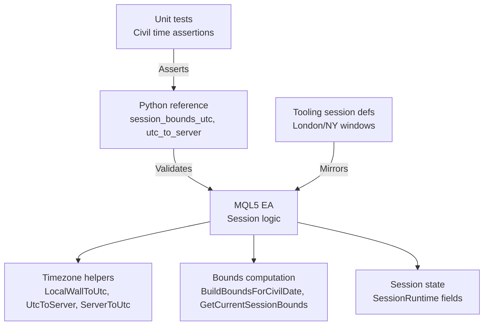
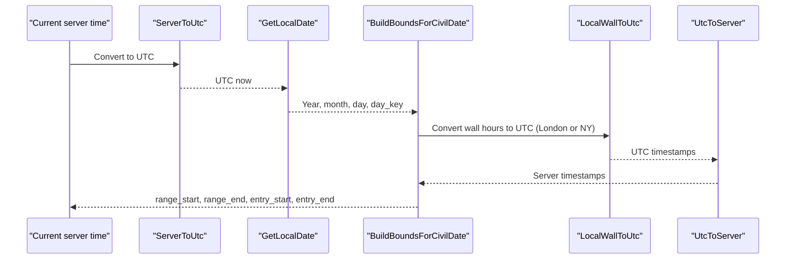
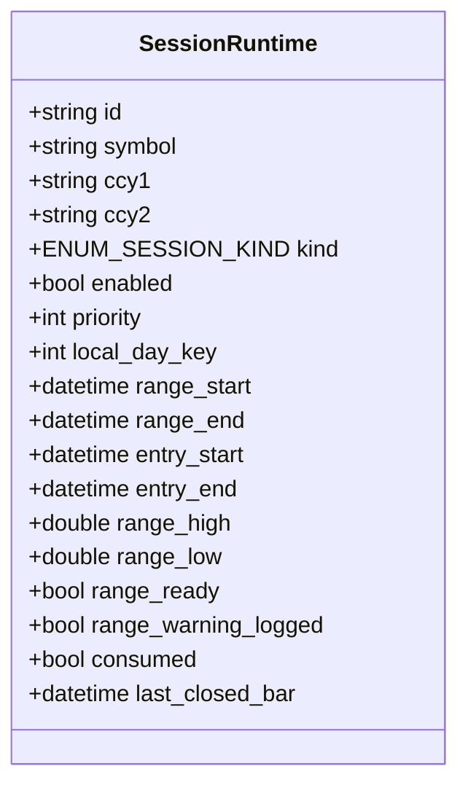
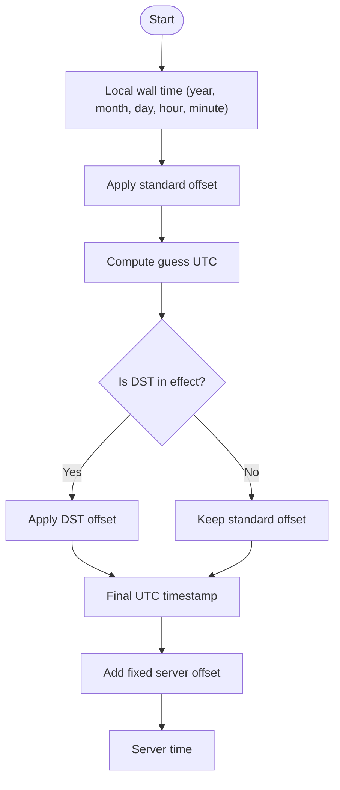
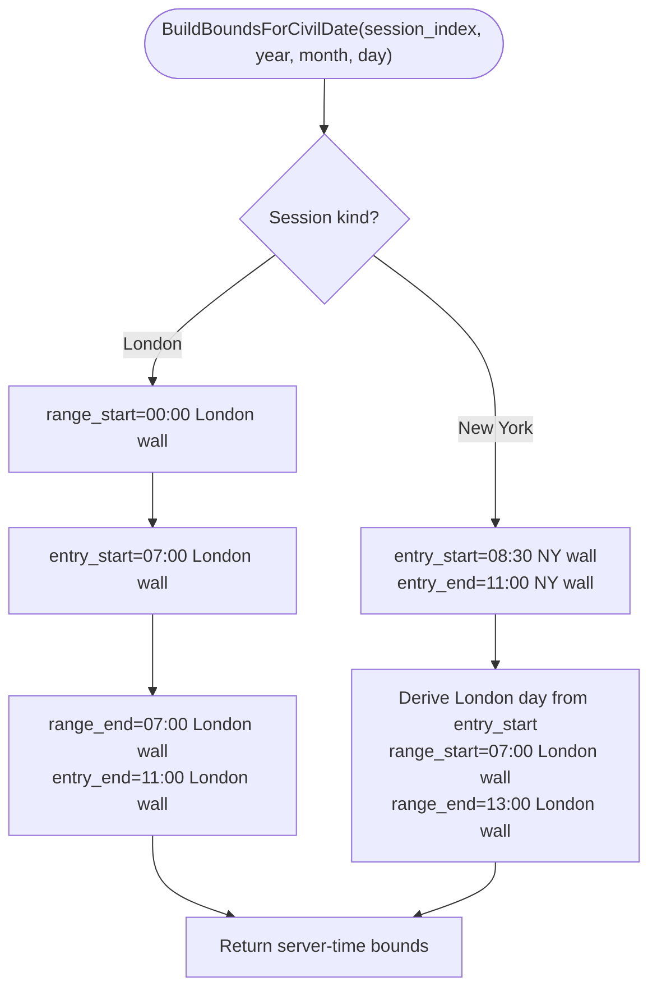
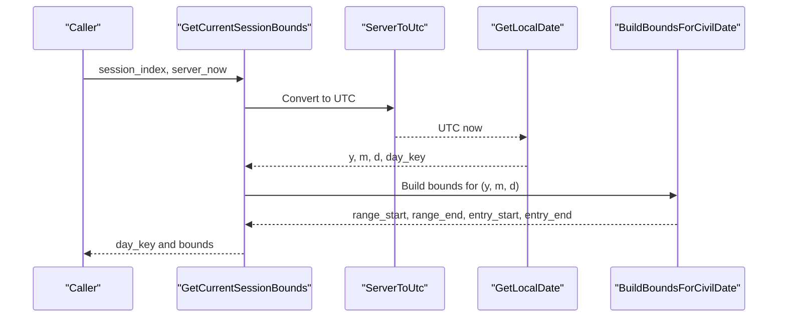
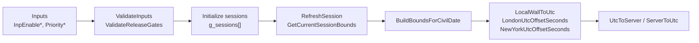

# Session Management System

<cite>
**Referenced Files in This Document**
- [TRIAD_R_HS.mq5](file://MQL5/Experts/TRIAD_R_HS/TRIAD_R_HS.mq5)
- [triad_reference.py](file://tests/triad_reference.py)
- [test_reference.py](file://tests/test_reference.py)
- [multi_pair_grid_search.py](file://tools/multi_pair_grid_search.py)
</cite>

## Table of Contents
1. [Introduction](#introduction)
2. [Project Structure](#project-structure)
3. [Core Components](#core-components)
4. [Architecture Overview](#architecture-overview)
5. [Detailed Component Analysis](#detailed-component-analysis)
6. [Dependency Analysis](#dependency-analysis)
7. [Performance Considerations](#performance-considerations)
8. [Troubleshooting Guide](#troubleshooting-guide)
9. [Conclusion](#conclusion)

## Introduction
This document explains the TRIAD-R session management system with a focus on London and New York sessions, time zone handling, Daylight Saving Time (DST) awareness, and session boundary calculations. It details how the EA computes session windows for each symbol, how the SessionRuntime structure is used to track ranges and entry windows, and how timezone conversion functions maintain consistent timing across server configurations. Practical configuration guidance is provided for enabling and prioritizing EURUSD London, GBPUSD London, and USDJPY New York sessions.

## Project Structure
The session logic lives primarily in the MQL5 Expert Advisor file, while Python reference code and tests validate the civil-time behavior and server offset assumptions. Supporting tools define canonical session definitions that mirror the EA’s intent.

**Diagram sources**
- [TRIAD_R_HS.mq5:624-789](file://MQL5/Experts/TRIAD_R_HS/TRIAD_R_HS.mq5#L624-L789)
- [triad_reference.py:134-167](file://tests/triad_reference.py#L134-L167)
- [test_reference.py:131-156](file://tests/test_reference.py#L131-L156)
- [multi_pair_grid_search.py:45-84](file://tools/multi_pair_grid_search.py#L45-L84)

**Section sources**
- [TRIAD_R_HS.mq5:158-178](file://MQL5/Experts/TRIAD_R_HS/TRIAD_R_HS.mq5#L158-L178)
- [TRIAD_R_HS.mq5:624-789](file://MQL5/Experts/TRIAD_R_HS/TRIAD_R_HS.mq5#L624-L789)
- [triad_reference.py:134-167](file://tests/triad_reference.py#L134-L167)
- [test_reference.py:131-156](file://tests/test_reference.py#L131-L156)
- [multi_pair_grid_search.py:45-84](file://tools/multi_pair_grid_search.py#L45-L84)

## Core Components
- Session kinds: London and New York are modeled as distinct session types.
- SessionRuntime: Holds per-session metadata including range and entry boundaries, readiness flags, and consumption state.
- Timezone utilities: Convert between local wall times, UTC, and server time while respecting DST rules for London and New York.
- Bounds calculators: Compute session windows for a given civil date and current server time.

Key responsibilities:
- Determine the correct London or New York offsets based on UTC timestamps and DST transitions.
- Build session windows in server time for both reference ranges and trading entry windows.
- Maintain per-day session state and reset it when the day key changes.

**Section sources**
- [TRIAD_R_HS.mq5:31-35](file://MQL5/Experts/TRIAD_R_HS/TRIAD_R_HS.mq5#L31-L35)
- [TRIAD_R_HS.mq5:158-178](file://MQL5/Experts/TRIAD_R_HS/TRIAD_R_HS.mq5#L158-L178)
- [TRIAD_R_HS.mq5:663-701](file://MQL5/Experts/TRIAD_R_HS/TRIAD_R_HS.mq5#L663-L701)
- [TRIAD_R_HS.mq5:754-789](file://MQL5/Experts/TRIAD_R_HS/TRIAD_R_HS.mq5#L754-L789)

## Architecture Overview
The session management pipeline converts local wall times to UTC using DST-aware offsets, then maps those UTC times into server time using a fixed server offset. For London sessions, the reference range and entry window are defined in London wall hours. For New York sessions, the entry window is defined in New York wall hours, while the reference range is anchored to London wall hours derived from the New York entry start.

**Diagram sources**
- [TRIAD_R_HS.mq5:698-701](file://MQL5/Experts/TRIAD_R_HS/TRIAD_R_HS.mq5#L698-L701)
- [TRIAD_R_HS.mq5:703-712](file://MQL5/Experts/TRIAD_R_HS/TRIAD_R_HS.mq5#L703-L712)
- [TRIAD_R_HS.mq5:754-789](file://MQL5/Experts/TRIAD_R_HS/TRIAD_R_HS.mq5#L754-L789)

## Detailed Component Analysis

### SessionRuntime structure and usage patterns
The SessionRuntime structure stores per-session context and computed boundaries:
- id, symbol, ccy1, ccy2: Identify the instrument and currency components.
- kind: Session type (London or New York).
- enabled, priority: Whether the session is active and its collision priority among concurrent candidates.
- local_day_key: The local calendar day key for the session’s timezone.
- range_start, range_end: Reference range boundaries in server time.
- entry_start, entry_end: Trading entry window boundaries in server time.
- range_high, range_low, range_ready: Range statistics and readiness flag.
- consumed, last_closed_bar: Consumption tracking and bar state.

Usage pattern:
- On each refresh, the EA computes the current day key and recalculates boundaries if the day changed.
- Range statistics are reset when the day rolls over; consumption flags are cleared.
- Entry windows are enforced relative to the reference range to avoid leakage.

**Diagram sources**
- [TRIAD_R_HS.mq5:158-178](file://MQL5/Experts/TRIAD_R_HS/TRIAD_R_HS.mq5#L158-L178)

**Section sources**
- [TRIAD_R_HS.mq5:158-178](file://MQL5/Experts/TRIAD_R_HS/TRIAD_R_HS.mq5#L158-L178)
- [TRIAD_R_HS.mq5:1867-1885](file://MQL5/Experts/TRIAD_R_HS/TRIAD_R_HS.mq5#L1867-L1885)

### Time zone conversions and DST awareness
The system uses explicit DST rules for London and New York:
- London DST: Starts on the last Sunday of March at 01:00 GMT, ends on the last Sunday of October at 01:00 BST.
- New York DST: Starts on the second Sunday of March at 02:00 EST, ends on the first Sunday of November at 02:00 EDT.

Conversion functions:
- LocalWallToUtc: Converts a local wall time to UTC by applying standard and DST offsets iteratively to resolve edge cases around transitions.
- UtcToServer: Adds a fixed server offset (default UTC+3) to UTC timestamps to produce server time.
- ServerToUtc: Subtracts the fixed server offset to convert server time back to UTC.
- GetLocalDate: Derives the local year/month/day and day key for a session’s timezone from UTC.

Behavioral notes:
- London sessions use Europe/London wall hours for reference and entry windows.
- New York sessions use America/New_York wall hours for entry windows; the reference range is anchored to London wall hours derived from the New York entry start.

**Diagram sources**
- [TRIAD_R_HS.mq5:637-691](file://MQL5/Experts/TRIAD_R_HS/TRIAD_R_HS.mq5#L637-L691)
- [TRIAD_R_HS.mq5:693-701](file://MQL5/Experts/TRIAD_R_HS/TRIAD_R_HS.mq5#L693-L701)

**Section sources**
- [TRIAD_R_HS.mq5:637-691](file://MQL5/Experts/TRIAD_R_HS/TRIAD_R_HS.mq5#L637-L691)
- [TRIAD_R_HS.mq5:693-701](file://MQL5/Experts/TRIAD_R_HS/TRIAD_R_HS.mq5#L693-L701)
- [triad_reference.py:134-167](file://tests/triad_reference.py#L134-L167)
- [test_reference.py:131-156](file://tests/test_reference.py#L131-L156)

### BuildBoundsForCivilDate logic
This function calculates session windows for a given civil date and session index:
- For London sessions:
  - Reference range: 00:00–07:00 London wall.
  - Entry window: 07:00–11:00 London wall.
- For New York sessions:
  - Entry window: 08:30–11:00 New York wall.
  - Reference range: Derived from London wall hours corresponding to the New York entry start; typically 07:00–13:00 London wall.

The function ensures all returned timestamps are in server time via UtcToServer.

**Diagram sources**
- [TRIAD_R_HS.mq5:754-779](file://MQL5/Experts/TRIAD_R_HS/TRIAD_R_HS.mq5#L754-L779)

**Section sources**
- [TRIAD_R_HS.mq5:754-779](file://MQL5/Experts/TRIAD_R_HS/TRIAD_R_HS.mq5#L754-L779)
- [triad_reference.py:139-158](file://tests/triad_reference.py#L139-L158)

### GetCurrentSessionBounds implementation
This function determines the current session boundaries based on the live server time:
- Converts server time to UTC.
- Derives the local date and day key for the session’s timezone.
- Delegates to BuildBoundsForCivilDate to compute the final bounds.

It ensures that session windows are always aligned with the correct local day and updated as server time advances.

**Diagram sources**
- [TRIAD_R_HS.mq5:781-789](file://MQL5/Experts/TRIAD_R_HS/TRIAD_R_HS.mq5#L781-L789)

**Section sources**
- [TRIAD_R_HS.mq5:781-789](file://MQL5/Experts/TRIAD_R_HS/TRIAD_R_HS.mq5#L781-L789)

### Session configuration parameters and priorities
Configuration inputs control which sessions are active and their priority:
- InpEnableEURUSDLondon: Enables EURUSD London session.
- InpEnableGBPUSDLondon: Enables GBPUSD London session.
- InpEnableUSDJPYNewYork: Enables USDJPY New York session.
- InpEURUSDLondonPriority, InpGBPUSDLondonPriority, InpUSDJPYNewYorkPriority: Collision priorities from 1 (highest) to 3 (lowest). Ties are broken by lower cost/R, earlier completed signal, and stable session index.

Validation rules:
- Symbols must be unique and at least one sleeve enabled.
- Priorities must be within 1..3.
- Each enabled symbol/session requires an independent approval gate before execution.

These parameters are included in the configuration hash to ensure reproducibility and auditability.

**Section sources**
- [TRIAD_R_HS.mq5:93-104](file://MQL5/Experts/TRIAD_R_HS/TRIAD_R_HS.mq5#L93-L104)
- [TRIAD_R_HS.mq5:3586-3596](file://MQL5/Experts/TRIAD_R_HS/TRIAD_R_HS.mq5#L3586-L3596)
- [TRIAD_R_HS.mq5:3599-3613](file://MQL5/Experts/TRIAD_R_HS/TRIAD_R_HS.mq5#L3599-L3613)
- [TRIAD_R_HS.mq5:3957-3974](file://MQL5/Experts/TRIAD_R_HS/TRIAD_R_HS.mq5#L3957-L3974)

### Practical examples of session windows
Reference examples validated by tests:
- London winter vs summer:
  - Winter: Reference range starts at 00:00 London wall; entry starts at 07:00 London wall.
  - Summer: Due to BST, the same London wall times map to different UTC values; the EA handles this via LocalWallToUtc.
- New York with US/UK DST mismatch:
  - When US DST begins before UK DST, the New York entry window shifts independently of the London reference range.
- Fixed server offset:
  - UtcToServer adds a fixed +3 hours to UTC to produce server time.

These behaviors ensure consistent session boundaries regardless of DST transitions and server configuration.

**Section sources**
- [test_reference.py:131-156](file://tests/test_reference.py#L131-L156)
- [triad_reference.py:134-167](file://tests/triad_reference.py#L134-L167)

## Dependency Analysis
The session system depends on:
- Timezone helpers for DST-aware conversions.
- Bounds calculators to derive session windows.
- Configuration validation to enforce symbol uniqueness and priority constraints.
- Reference implementations and tests to validate civil-time behavior.

**Diagram sources**
- [TRIAD_R_HS.mq5:3586-3613](file://MQL5/Experts/TRIAD_R_HS/TRIAD_R_HS.mq5#L3586-L3613)
- [TRIAD_R_HS.mq5:1867-1885](file://MQL5/Experts/TRIAD_R_HS/TRIAD_R_HS.mq5#L1867-L1885)
- [TRIAD_R_HS.mq5:754-789](file://MQL5/Experts/TRIAD_R_HS/TRIAD_R_HS.mq5#L754-L789)
- [TRIAD_R_HS.mq5:663-701](file://MQL5/Experts/TRIAD_R_HS/TRIAD_R_HS.mq5#L663-L701)

**Section sources**
- [TRIAD_R_HS.mq5:3586-3613](file://MQL5/Experts/TRIAD_R_HS/TRIAD_R_HS.mq5#L3586-L3613)
- [TRIAD_R_HS.mq5:1867-1885](file://MQL5/Experts/TRIAD_R_HS/TRIAD_R_HS.mq5#L1867-L1885)
- [TRIAD_R_HS.mq5:754-789](file://MQL5/Experts/TRIAD_R_HS/TRIAD_R_HS.mq5#L754-L789)
- [TRIAD_R_HS.mq5:663-701](file://MQL5/Experts/TRIAD_R_HS/TRIAD_R_HS.mq5#L663-L701)

## Performance Considerations
- Session bounds are recomputed only when the local day key changes, minimizing redundant work.
- Range statistics are reset on day rollover to avoid stale data affecting signals.
- Timezone conversions use efficient integer arithmetic and minimal allocations.
- Validation gates prevent unnecessary initialization when required approvals are missing.

[No sources needed since this section provides general guidance]

## Troubleshooting Guide
Common issues and checks:
- Symbol uniqueness and at least one session enabled: Ensure symbols do not collide and at least one sleeve is enabled.
- Priority range: Confirm priorities are within 1..3.
- News calendar requirement: Live order mode requires the news calendar to be enabled.
- Independent approval gates: Each enabled symbol/session must have its corresponding gate passed.
- Server offset tolerance: The observed trade-server offset must match UTC+3 within a small tolerance.

If these validations fail, the EA will halt or reject initialization with specific error events.

**Section sources**
- [TRIAD_R_HS.mq5:3586-3596](file://MQL5/Experts/TRIAD_R_HS/TRIAD_R_HS.mq5#L3586-L3596)
- [TRIAD_R_HS.mq5:3599-3613](file://MQL5/Experts/TRIAD_R_HS/TRIAD_R_HS.mq5#L3599-L3613)

## Conclusion
The TRIAD-R session management system robustly handles London and New York sessions with DST-aware timezone conversions and precise session boundary calculations. The SessionRuntime structure maintains per-session state, while BuildBoundsForCivilDate and GetCurrentSessionBounds ensure accurate windows for both reference ranges and entry periods. Configuration parameters enable fine-grained control over which sessions are active and their priorities, with validation gates ensuring safe operation. The combination of MQL5 logic and Python reference tests provides confidence in the correctness of session timing across different server configurations and DST transitions.