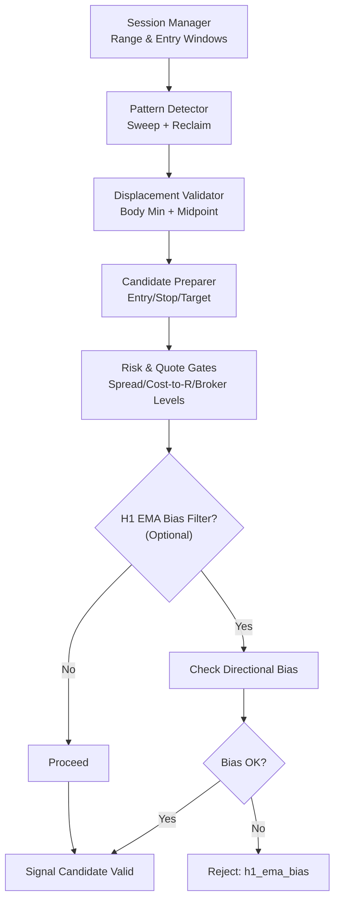
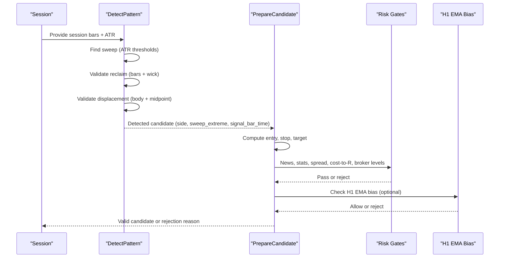
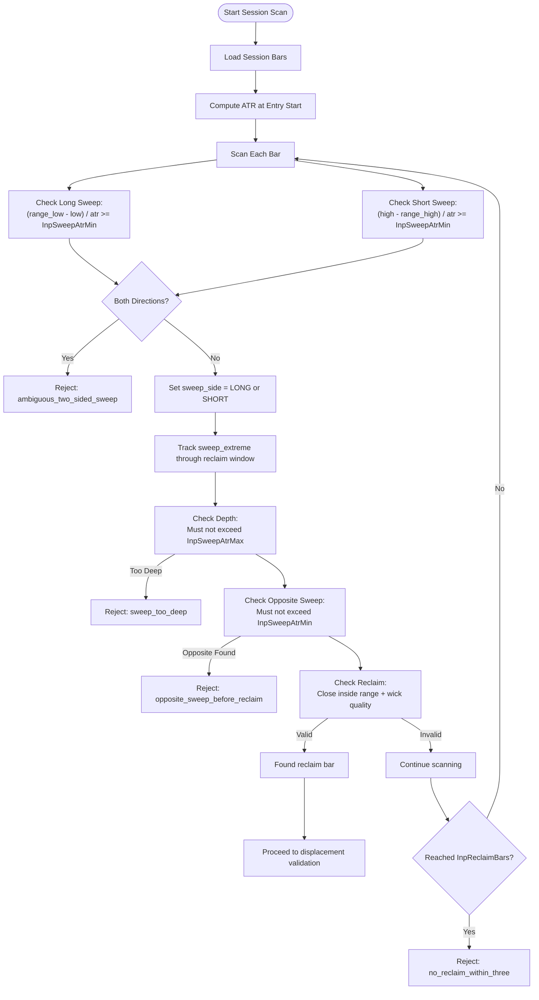
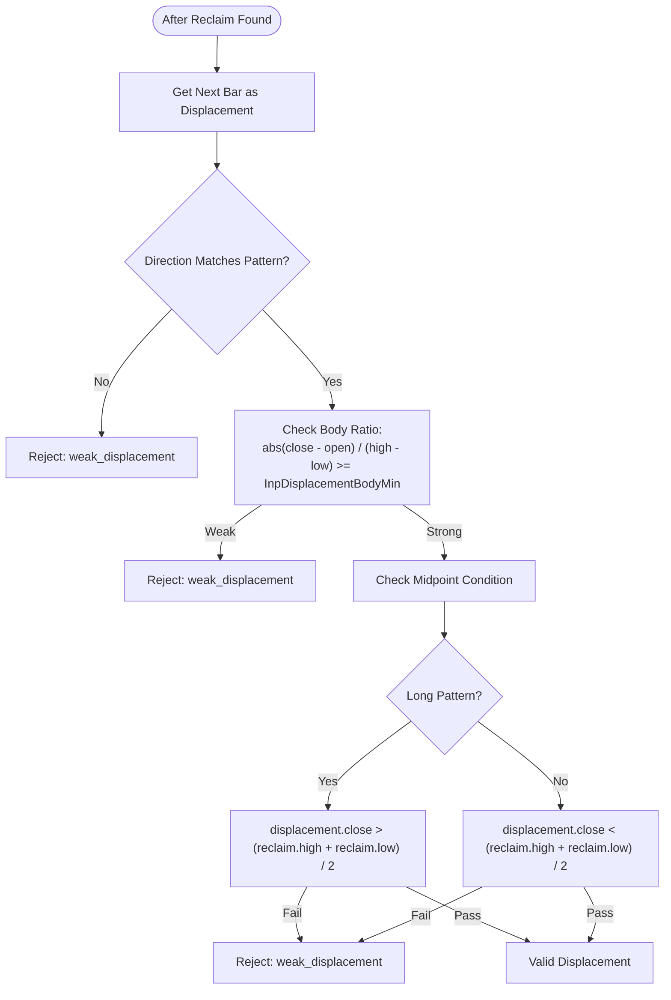
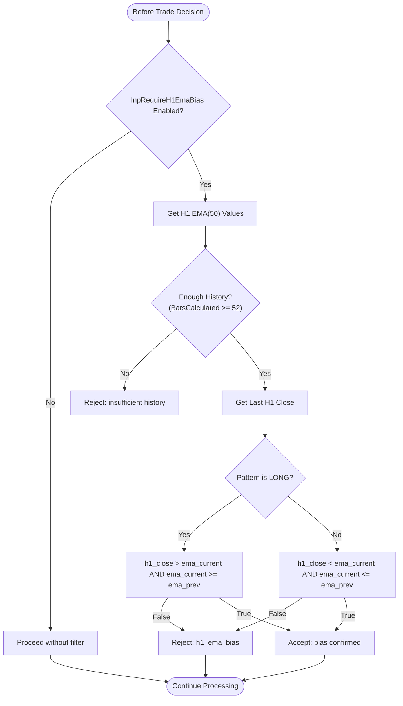

# Signal Detection Engine

<cite>
**Referenced Files in This Document**
- [TRIAD_R_HS.mq5](file://MQL5/Experts/TRIAD_R_HS/TRIAD_R_HS.mq5)
- [TRIAD_SCREEN.mq5](file://MQL5/Experts/TRIAD_SCREEN/TRIAD_SCREEN.mq5)
</cite>

## Table of Contents
1. [Introduction](#introduction)
2. [Project Structure](#project-structure)
3. [Core Components](#core-components)
4. [Architecture Overview](#architecture-overview)
5. [Detailed Component Analysis](#detailed-component-analysis)
6. [Dependency Analysis](#dependency-analysis)
7. [Performance Considerations](#performance-considerations)
8. [Troubleshooting Guide](#troubleshooting-guide)
9. [Conclusion](#conclusion)

## Introduction
This document explains the TRIAD-R signal detection engine that implements a sweep/reclaim pattern recognition system for M5 price data within defined trading sessions. It focuses on how signals are detected, validated, and prepared for execution, with emphasis on:
- The SignalCandidate structure and its fields
- Sweep detection using ATR-based thresholds
- Reclaim validation criteria
- Displacement body minimum check
- Limit expiry bars behavior
- Pattern side determination (PATTERN_LONG, PATTERN_SHORT)
- H1 EMA directional bias filter
- Practical examples and rejection criteria
- Performance considerations for real-time processing

## Project Structure
The implementation is primarily contained in two MQL5 Expert Advisors:
- TRIAD_R_HS.mq5: Canonical production-style EA implementing the full signal pipeline, risk controls, and optional H1 EMA bias filter
- TRIAD_SCREEN.mq5: A simplified screening tool that mirrors core logic for demo testing and visualization

**Diagram sources**
- [TRIAD_R_HS.mq5:1936-2115](file://MQL5/Experts/TRIAD_R_HS/TRIAD_R_HS.mq5#L1936-L2115)
- [TRIAD_R_HS.mq5:2380-2500](file://MQL5/Experts/TRIAD_R_HS/TRIAD_R_HS.mq5#L2380-L2500)
- [TRIAD_R_HS.mq5:2353-2378](file://MQL5/Experts/TRIAD_R_HS/TRIAD_R_HS.mq5#L2353-L2378)

**Section sources**
- [TRIAD_R_HS.mq5:16-42](file://MQL5/Experts/TRIAD_R_HS/TRIAD_R_HS.mq5#L16-L42)
- [TRIAD_R_HS.mq5:180-207](file://MQL5/Experts/TRIAD_R_HS/TRIAD_R_HS.mq5#L180-L207)
- [TRIAD_SCREEN.mq5:59-64](file://MQL5/Experts/TRIAD_SCREEN/TRIAD_SCREEN.mq5#L59-L64)
- [TRIAD_SCREEN.mq5:167-193](file://MQL5/Experts/TRIAD_SCREEN/TRIAD_SCREEN.mq5#L167-L193)

## Core Components
- SignalCandidate: Holds all state for a potential signal, including detection flags, pattern side, key prices, risk metrics, and rejection reasons
- DetectPattern: Scans session bars to find the first qualifying sweep event and validates reclaim conditions
- PrepareCandidate: Computes entry, stop, target, volume, and applies multiple gates (news, stats, spread, cost-to-R, broker levels, H1 EMA bias)
- CheckH1EmaBias: Optional directional bias filter based on H1 EMA(50) slope and price position

Key inputs controlling behavior:
- InpSweepAtrMin, InpSweepAtrMax: ATR-based thresholds for sweep detection and depth limits
- InpReclaimBars, InpReclaimWickMin: Reclaim window length and wick quality threshold
- InpDisplacementBodyMin: Minimum displacement body ratio relative to bar range
- InpLimitExpiryBars: Controls limit order expiry behavior via candidate.expiry_time usage downstream
- InpRequireH1EmaBias: Enables H1 EMA directional bias filter

**Section sources**
- [TRIAD_R_HS.mq5:122-127](file://MQL5/Experts/TRIAD_R_HS/TRIAD_R_HS.mq5#L122-L127)
- [TRIAD_R_HS.mq5:115-119](file://MQL5/Experts/TRIAD_R_HS/TRIAD_R_HS.mq5#L115-L119)
- [TRIAD_R_HS.mq5:180-207](file://MQL5/Experts/TRIAD_R_HS/TRIAD_R_HS.mq5#L180-L207)

## Architecture Overview
The engine processes each enabled symbol/session combination during its entry window:
1. Load completed session bars and compute ATR at entry start
2. Scan for first sweep event using ATR thresholds
3. Validate reclaim within configured bars with wick requirements
4. Confirm displacement bar direction, body strength, and midpoint condition
5. Compute entry (midpoint of displacement), stop (ATR-buffered beyond sweep extreme), target (R-multiple solver)
6. Apply risk gates: news blackout, comparable statistics percentiles, spread gate, cost-to-R, broker distance checks
7. Optionally apply H1 EMA bias filter
8. If all checks pass, candidate is valid for submission

**Diagram sources**
- [TRIAD_R_HS.mq5:1936-2115](file://MQL5/Experts/TRIAD_R_HS/TRIAD_R_HS.mq5#L1936-L2115)
- [TRIAD_R_HS.mq5:2380-2500](file://MQL5/Experts/TRIAD_R_HS/TRIAD_R_HS.mq5#L2380-L2500)
- [TRIAD_R_HS.mq5:2353-2378](file://MQL5/Experts/TRIAD_R_HS/TRIAD_R_HS.mq5#L2353-L2378)

## Detailed Component Analysis

### SignalCandidate Structure
The SignalCandidate structure encapsulates all information needed to evaluate and potentially execute a signal:
- detected: Whether a pattern was found (even if invalid)
- valid: Final approval after all gates
- session_index: Which symbol/session this applies to
- side: PATTERN_NONE, PATTERN_LONG, or PATTERN_SHORT
- symbol: Trading instrument
- signal_bar_time: Bar where displacement occurred
- expiry_time: When limit order expires (used by downstream logic)
- atr: Volatility measure used for thresholds
- range_high/range_low: Previous session reference range
- sweep_extreme: Extreme price reached during sweep
- entry: Calculated entry price (displacement midpoint)
- stop: Risk-managed stop loss
- target: Profit target derived from R-multiple
- one_r_price: Price level for 1R profit
- volume: Position size
- cash_risk/slippage_reserve_cash: Monetary risk accounting
- target_net: Net profit after commissions
- cost_to_r: Total transaction costs normalized to risk
- range_percentile/atr_percentile: Regime filters
- spread_points/spread_median_points: Spread monitoring
- rejection: Human-readable reason for failure

**Section sources**
- [TRIAD_R_HS.mq5:180-207](file://MQL5/Experts/TRIAD_R_HS/TRIAD_R_HS.mq5#L180-L207)

### Sweep Detection Algorithm
The algorithm scans session bars to identify sweep events using ATR-based thresholds:

**Diagram sources**
- [TRIAD_R_HS.mq5:1978-2093](file://MQL5/Experts/TRIAD_R_HS/TRIAD_R_HS.mq5#L1978-L2093)

Key parameters:
- InpSweepAtrMin: Minimum sweep depth in ATR units to qualify as a sweep
- InpSweepAtrMax: Maximum allowed sweep depth to prevent breakouts
- InpReclaimBars: Number of bars to search for reclaim (typically 3)
- InpReclaimWickMin: Minimum wick ratio required for valid reclaim

**Section sources**
- [TRIAD_R_HS.mq5:1978-2093](file://MQL5/Experts/TRIAD_R_HS/TRIAD_R_HS.mq5#L1978-L2093)

### Displacement Body Minimum Check
After finding a valid reclaim, the next bar must be a strong displacement in the pattern direction:

**Diagram sources**
- [TRIAD_R_HS.mq5:2094-2115](file://MQL5/Experts/TRIAD_R_HS/TRIAD_R_HS.mq5#L2094-L2115)

Parameters:
- InpDisplacementBodyMin: Minimum body ratio (e.g., 0.60 means body must be at least 60% of bar range)
- Ensures displacement has both direction and momentum

**Section sources**
- [TRIAD_R_HS.mq5:2094-2115](file://MQL5/Experts/TRIAD_R_HS/TRIAD_R_HS.mq5#L2094-L2115)

### Limit Expiry Bars Behavior
The InpLimitExpiryBars parameter controls how long a signal remains valid after detection:
- Used to determine when a limit order should expire if not filled
- Prevents stale signals from triggering late entries
- Works with the candidate.expiry_time field to manage order lifecycle

**Section sources**
- [TRIAD_R_HS.mq5:127](file://MQL5/Experts/TRIAD_R_HS/TRIAD_R_HS.mq5#L127)
- [TRIAD_R_HS.mq5:188](file://MQL5/Experts/TRIAD_R_HS/TRIAD_R_HS.mq5#L188)

### Pattern Side Determination
Pattern sides are determined by which direction the sweep occurs:
- PATTERN_LONG: Price sweeps below range_low, then reclaims above range_low
- PATTERN_SHORT: Price sweeps above range_high, then reclaims below range_high
- PATTERN_NONE: No valid pattern found
- PATTERN ambiguity rejected when both directions occur simultaneously

**Section sources**
- [TRIAD_R_HS.mq5:37-42](file://MQL5/Experts/TRIAD_R_HS/TRIAD_R_HS.mq5#L37-L42)
- [TRIAD_R_HS.mq5:1978-1996](file://MQL5/Experts/TRIAD_R_HS/TRIAD_R_HS.mq5#L1978-L1996)

### H1 EMA Directional Bias Filter
When InpRequireH1EmaBias is enabled, the system adds a higher-timeframe confirmation:

**Diagram sources**
- [TRIAD_R_HS.mq5:2353-2378](file://MQL5/Experts/TRIAD_R_HS/TRIAD_R_HS.mq5#L2353-L2378)

Impact:
- Filters out counter-trend setups that go against H1 momentum
- Reduces false signals during strong trending markets
- Fail-closed: missing data results in rejection rather than silent bypass

**Section sources**
- [TRIAD_R_HS.mq5:115-119](file://MQL5/Experts/TRIAD_R_HS/TRIAD_R_HS.mq5#L115-L119)
- [TRIAD_R_HS.mq5:2353-2378](file://MQL5/Experts/TRIAD_R_HS/TRIAD_R_HS.mq5#L2353-L2378)

### Practical Examples and Rejection Criteria

#### Example 1: Valid Long Signal
- Range: EURUSD previous session high/low established
- Sweep: Price drops 0.3 ATR below range_low (meets InpSweepAtrMin)
- Reclaim: Within 3 bars, price closes back above range_low with strong lower wick (meets InpReclaimWickMin)
- Displacement: Next bar closes strongly bullish with body ratio > 0.60 and close above reclaim midpoint
- Result: Valid PATTERN_LONG signal generated

#### Example 2: Invalid Signal - Too Deep Sweep
- Sweep extends 0.8 ATR below range_long (exceeds InpSweepAtrMax)
- Rejected as "sweep_too_deep" - indicates breakout rather than liquidity grab

#### Example 3: Invalid Signal - Weak Reclaim Wick
- Price reclaims but wick ratio below InpReclaimWickMin threshold
- Rejected as "reclaim_wick" - insufficient buying pressure

#### Example 4: Invalid Signal - Counter Trend
- Pattern suggests LONG but H1 EMA shows downtrend (close below EMA with negative slope)
- Rejected as "h1_ema_bias" when filter is enabled

Common rejection reasons:
- no_sweep_event: No qualifying sweep found
- ambiguous_two_sided_sweep: Both directions swept simultaneously
- sweep_too_deep: Breakout rather than liquidity grab
- opposite_sweep_before_reclaim: Conflicting signal direction
- reclaim_wick: Insufficient wick strength
- no_reclaim_within_three: No reclaim found in time window
- weak_displacement: Displacement lacks momentum
- h1_ema_bias: Higher timeframe trend conflict

**Section sources**
- [TRIAD_R_HS.mq5:1978-2115](file://MQL5/Experts/TRIAD_R_HS/TRIAD_R_HS.mq5#L1978-L2115)
- [TRIAD_R_HS.mq5:2353-2378](file://MQL5/Experts/TRIAD_R_HS/TRIAD_R_HS.mq5#L2353-L2378)

## Dependency Analysis
The signal detection engine has clear dependencies between components:

**Diagram sources**
- [TRIAD_R_HS.mq5:1936-2500](file://MQL5/Experts/TRIAD_R_HS/TRIAD_R_HS.mq5#L1936-L2500)

Key dependencies:
- Session management provides range boundaries and timing
- ATR calculation normalizes volatility across different instruments
- Pattern detection depends on accurate bar data and proper session boundaries
- Risk gates depend on current market conditions and broker specifications
- H1 EMA bias requires sufficient historical data and indicator stability

**Section sources**
- [TRIAD_R_HS.mq5:1936-2500](file://MQL5/Experts/TRIAD_R_HS/TRIAD_R_HS.mq5#L1936-L2500)

## Performance Considerations
For real-time signal processing efficiency:

1. **Data Access Optimization**:
   - Use ArraySetAsSeries(true) for efficient recent-bar access
   - Cache indicator handles (ATR, EMA) to avoid repeated creation
   - Minimize CopyRates calls by batching data retrieval

2. **Early Exit Logic**:
   - Reject invalid patterns early to save computation
   - Use simple checks before expensive operations
   - Leverage boolean short-circuit evaluation

3. **Memory Management**:
   - Reuse arrays where possible
   - Avoid unnecessary array allocations in tight loops
   - Clear structures properly between iterations

4. **Indicator Efficiency**:
   - Initialize indicators once per symbol/session
   - Use appropriate periods to balance responsiveness vs noise
   - Handle insufficient history gracefully

5. **Real-Time Constraints**:
   - Process only completed bars to avoid repainting
   - Implement quote freshness checks to avoid stale data
   - Use efficient tick comparison methods

Optimization techniques:
- Batch process multiple symbols efficiently
- Use pre-computed ranges and statistics where possible
- Implement proper error handling to prevent cascading failures
- Log performance metrics for bottleneck identification

[No sources needed since this section provides general guidance]

## Troubleshooting Guide

### Common Issues and Solutions

**No Signals Generated**:
- Check if InpSweepAtrMin is too high for current volatility
- Verify session boundaries are correctly calculated
- Ensure adequate historical data for ATR calculation
- Confirm news calendar is not blocking all signals

**Too Many False Signals**:
- Increase InpReclaimWickMin to require stronger reclaim wicks
- Enable InpRequireH1EmaBias to filter counter-trend setups
- Adjust InpDisplacementBodyMin to require stronger displacement
- Review InpSweepAtrMax to prevent breakout misclassification

**Signal Rejections**:
- Monitor rejection reasons in logs to identify patterns
- Check spread conditions during volatile periods
- Verify broker stop/freeze level compliance
- Ensure sufficient margin availability

**Performance Issues**:
- Reduce number of monitored symbols
- Optimize indicator periods for faster calculation
- Implement proper resource cleanup in OnDeinit
- Monitor memory usage during extended runs

**H1 EMA Filter Problems**:
- Ensure sufficient H1 history is available
- Check indicator handle initialization
- Verify EMA period and price type settings
- Test with different market regimes

**Section sources**
- [TRIAD_R_HS.mq5:2311-2341](file://MQL5/Experts/TRIAD_R_HS/TRIAD_R_HS.mq5#L2311-L2341)
- [TRIAD_R_HS.mq5:2353-2378](file://MQL5/Experts/TRIAD_R_HS/TRIAD_R_HS.mq5#L2353-L2378)

## Conclusion
The TRIAD-R signal detection engine implements a sophisticated sweep/reclaim pattern recognition system designed for institutional-grade trading environments. Key strengths include:

- Robust pattern detection using ATR-normalized thresholds
- Multi-stage validation with comprehensive risk management
- Optional higher-timeframe confirmation through H1 EMA bias filtering
- Extensive rejection criteria to maintain signal quality
- Real-time processing capabilities with performance optimizations

The system successfully balances sensitivity to genuine opportunities while filtering out low-probability setups through multiple layers of validation. The modular architecture allows for easy parameter tuning and future enhancements while maintaining strict risk controls essential for live trading environments.

For optimal results, traders should carefully calibrate parameters based on their specific market conditions and risk tolerance, particularly focusing on ATR thresholds, reclaim validation criteria, and the optional H1 EMA bias filter for additional trend confirmation.

[No sources needed since this section summarizes without analyzing specific files]