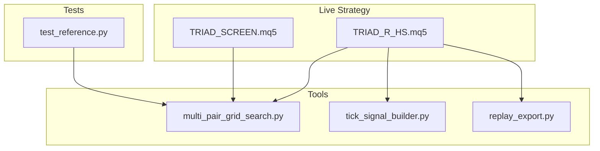
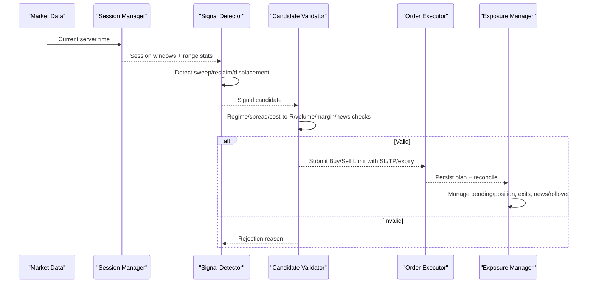
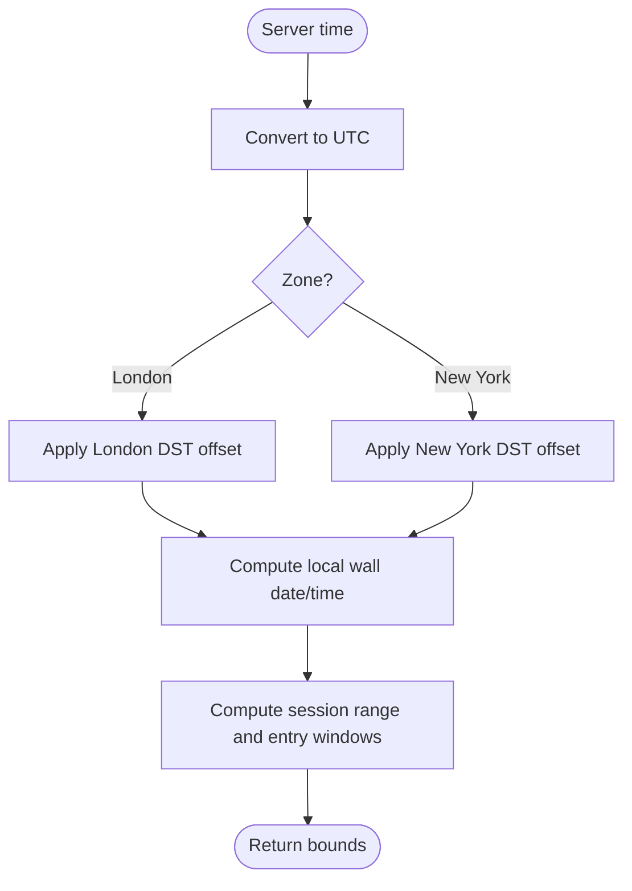
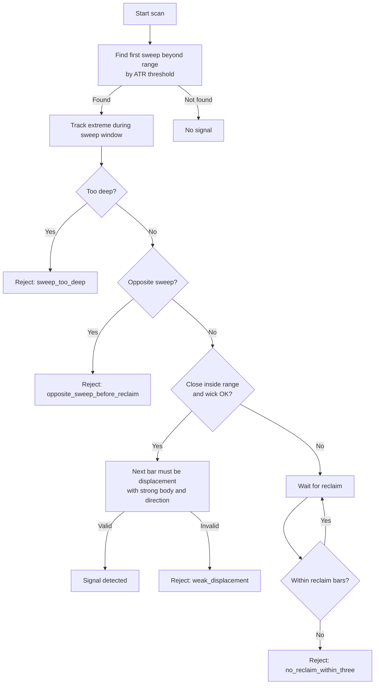
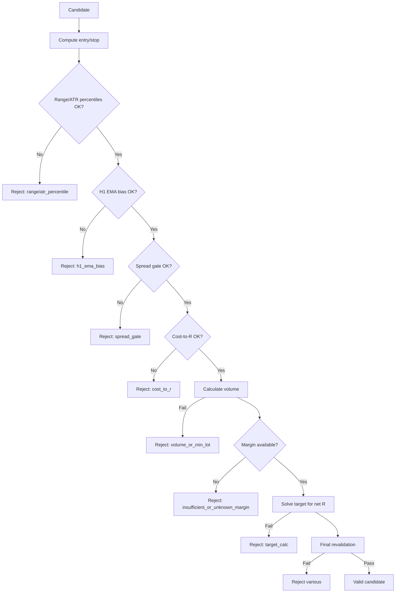
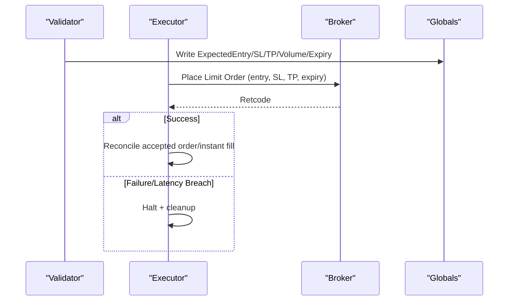
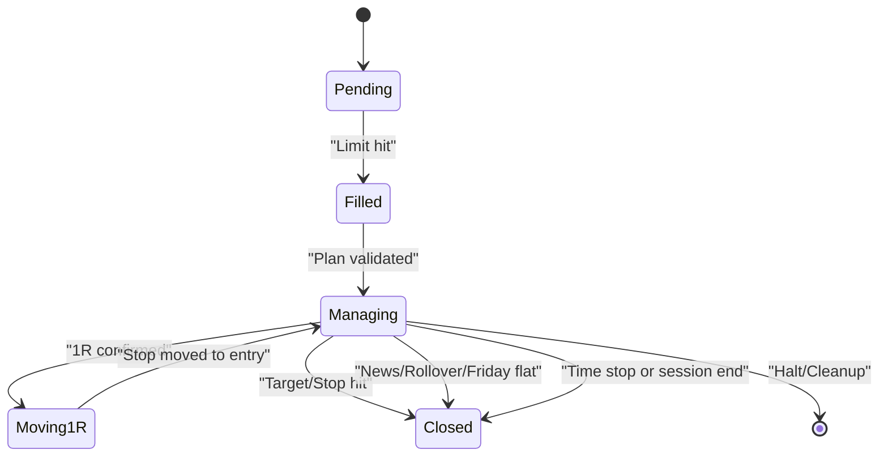
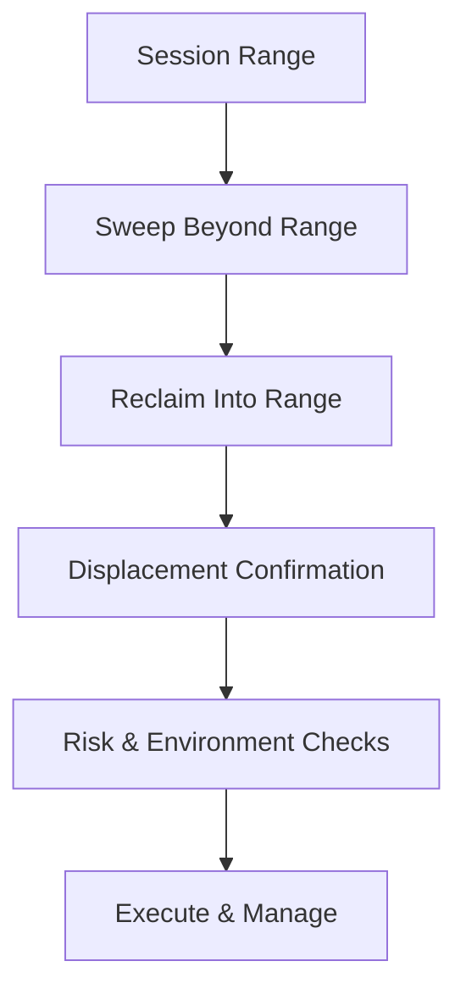
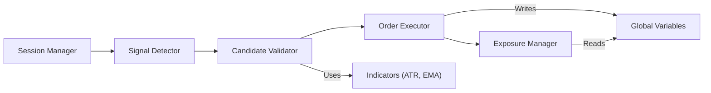

# Trading Engine Core

<cite>
**Referenced Files in This Document**
- [TRIAD_R_HS.mq5](file://MQL5/Experts/TRIAD_R_HS/TRIAD_R_HS.mq5)
- [TRIAD_SCREEN.mq5](file://MQL5/Experts/TRIAD_SCREEN/TRIAD_SCREEN.mq5)
- [multi_pair_grid_search.py](file://tools/multi_pair_grid_search.py)
- [tick_signal_builder.py](file://tools/tick_signal_builder.py)
- [replay_export.py](file://tools/replay_export.py)
- [test_reference.py](file://tests/test_reference.py)
</cite>

## Table of Contents
1. [Introduction](#introduction)
2. [Project Structure](#project-structure)
3. [Core Components](#core-components)
4. [Architecture Overview](#architecture-overview)
5. [Detailed Component Analysis](#detailed-component-analysis)
6. [Dependency Analysis](#dependency-analysis)
7. [Performance Considerations](#performance-considerations)
8. [Troubleshooting Guide](#troubleshooting-guide)
9. [Conclusion](#conclusion)
10. [Appendices](#appendices)

## Introduction
This document explains the TRIAD-R trading engine core as implemented in the MQL5 Expert Advisors and supporting tools. It focuses on:
- Session management for London and New York sessions, including time zone conversions and DST awareness
- Sweep/reclaim pattern detection and signal generation logic
- Entry criteria validation and risk controls
- Position lifecycle from signal detection through order execution to position closure
- Practical configuration examples and troubleshooting guidance
- Performance considerations for real-time market data processing

The canonical production EA is TRIAD_R_HS.mq5; TRIAD_SCREEN.mq5 is a research/screening counterpart that mirrors strategy behavior without full production safety machinery.

## Project Structure
At a high level:
- MQL5 Experts implement live strategy logic (signal detection, risk checks, order submission, exposure management)
- Tools support backtesting, replay, and parameter exploration
- Tests validate session bounds and time conversion correctness

**Diagram sources**
- [TRIAD_R_HS.mq5:1-120](file://MQL5/Experts/TRIAD_R_HS/TRIAD_R_HS.mq5#L1-L120)
- [TRIAD_SCREEN.mq5:1-160](file://MQL5/Experts/TRIAD_SCREEN/TRIAD_SCREEN.mq5#L1-L160)
- [multi_pair_grid_search.py:45-84](file://tools/multi_pair_grid_search.py#L45-L84)
- [tick_signal_builder.py:436-467](file://tools/tick_signal_builder.py#L436-L467)
- [replay_export.py:549-575](file://tools/replay_export.py#L549-L575)
- [test_reference.py:145-160](file://tests/test_reference.py#L145-L160)

**Section sources**
- [TRIAD_R_HS.mq5:1-120](file://MQL5/Experts/TRIAD_R_HS/TRIAD_R_HS.mq5#L1-L120)
- [TRIAD_SCREEN.mq5:1-160](file://MQL5/Experts/TRIAD_SCREEN/TRIAD_SCREEN.mq5#L1-L160)

## Core Components
- Session manager: Computes London and New York session windows with DST-aware offsets and converts between UTC, local wall time, and server time.
- Signal detector: Scans recent bars to detect sweep/reclaim patterns and validates displacement strength.
- Candidate validator: Applies regime filters (range/ATR percentiles), H1 EMA bias (optional), spread gates, cost-to-R limits, volume sizing, margin checks, target solving, and news blackout checks.
- Order executor: Submits Buy/Sell Limit orders with stop/target and expiry, persists trade plan state, and reconciles results.
- Exposure manager: Enforces one-position invariant, repairs missing stops/targets, moves stop to entry after confirmed 1R, enforces news/rollover/Friday flat rules, and closes positions at session end or when invalid.
- Risk governors: Daily/weekly drawdown guards, firm floor, request throttling, instance lock, halt latches, and audit logging.

**Section sources**
- [TRIAD_R_HS.mq5:158-218](file://MQL5/Experts/TRIAD_R_HS/TRIAD_R_HS.mq5#L158-L218)
- [TRIAD_R_HS.mq5:624-779](file://MQL5/Experts/TRIAD_R_HS/TRIAD_R_HS.mq5#L624-L779)
- [TRIAD_R_HS.mq5:1978-2116](file://MQL5/Experts/TRIAD_R_HS/TRIAD_R_HS.mq5#L1978-L2116)
- [TRIAD_R_HS.mq5:2380-2522](file://MQL5/Experts/TRIAD_R_HS/TRIAD_R_HS.mq5#L2380-L2522)
- [TRIAD_R_HS.mq5:2692-2900](file://MQL5/Experts/TRIAD_R_HS/TRIAD_R_HS.mq5#L2692-L2900)
- [TRIAD_R_HS.mq5:2942-3284](file://MQL5/Experts/TRIAD_R_HS/TRIAD_R_HS.mq5#L2942-L3284)

## Architecture Overview
The engine runs per symbol/session combination. Each tick it:
- Refreshes session bounds and range statistics
- Scans bars for sweep/reclaim signals
- Validates candidates against regime, spread, cost-to-R, volume, margin, and news rules
- Persists a trade plan and submits a limit order if valid
- Manages pending orders and open positions, enforcing strict invariants and exits

**Diagram sources**
- [TRIAD_R_HS.mq5:624-779](file://MQL5/Experts/TRIAD_R_HS/TRIAD_R_HS.mq5#L624-L779)
- [TRIAD_R_HS.mq5:1978-2116](file://MQL5/Experts/TRIAD_R_HS/TRIAD_R_HS.mq5#L1978-L2116)
- [TRIAD_R_HS.mq5:2380-2522](file://MQL5/Experts/TRIAD_R_HS/TRIAD_R_HS.mq5#L2380-L2522)
- [TRIAD_R_HS.mq5:2692-2900](file://MQL5/Experts/TRIAD_R_HS/TRIAD_R_HS.mq5#L2692-L2900)
- [TRIAD_R_HS.mq5:2942-3284](file://MQL5/Experts/TRIAD_R_HS/TRIAD_R_HS.mq5#L2942-L3284)

## Detailed Component Analysis

### Session Management: London and New York with DST
- DST-aware offsets:
  - London: switches between GMT and BST using last Sunday of March/October
  - New York: switches between EST and EDT using specific Sundays in March/November
- Time conversions:
  - Local wall time to UTC using zone-specific offsets
  - UTC to server time via configured offset
  - Server day/week keys derived from server time
- Session windows:
  - London: reference range 00:00–07:00 London wall; entry window 07:00–11:00 London wall
  - New York: entry window 08:30–11:00 New York wall; reference range uses prior London session hours mapped to NY entry context

**Diagram sources**
- [TRIAD_R_HS.mq5:637-701](file://MQL5/Experts/TRIAD_R_HS/TRIAD_R_HS.mq5#L637-L701)
- [TRIAD_R_HS.mq5:754-779](file://MQL5/Experts/TRIAD_R_HS/TRIAD_R_HS.mq5#L754-L779)
- [test_reference.py:145-160](file://tests/test_reference.py#L145-L160)

**Section sources**
- [TRIAD_R_HS.mq5:624-779](file://MQL5/Experts/TRIAD_R_HS/TRIAD_R_HS.mq5#L624-L779)
- [multi_pair_grid_search.py:45-84](file://tools/multi_pair_grid_search.py#L45-L84)
- [test_reference.py:145-160](file://tests/test_reference.py#L145-L160)

### Sweep/Reclaim Pattern Detection
- Scans recent bars within the session window
- Identifies a sweep beyond the session range by ATR thresholds
- Tracks reclaim bar where price returns into range with sufficient wick
- Requires a subsequent displacement bar with strong body and direction confirmation
- Rejects ambiguous two-sided sweeps, too-deep sweeps, opposite sweeps before reclaim, weak displacement, and stale events

**Diagram sources**
- [TRIAD_R_HS.mq5:1978-2116](file://MQL5/Experts/TRIAD_R_HS/TRIAD_R_HS.mq5#L1978-L2116)

**Section sources**
- [TRIAD_R_HS.mq5:1978-2116](file://MQL5/Experts/TRIAD_R_HS/TRIAD_R_HS.mq5#L1978-L2116)

### Signal Generation and Entry Criteria Validation
After a sweep/reclaim/displacement is detected:
- Entry: midpoint of displacement bar’s open/close
- Stop: beyond sweep extreme with ATR buffer
- Target: solved to achieve desired net R after costs and slippage reserves
- Filters:
  - Range percentile and ATR percentile regimes
  - Optional H1 EMA(50) directional bias filter
  - Spread gate vs median spread
  - Cost-to-R limit including spread, slippage reserve, and commission
  - Volume sizing based on cash risk budget and broker lot constraints
  - Margin availability check
  - News blackout windows around relevant events
  - Final revalidation just before submission (quote freshness, broker distances, spread, cost-to-R, cash risk, margin, news)

**Diagram sources**
- [TRIAD_R_HS.mq5:2380-2522](file://MQL5/Experts/TRIAD_R_HS/TRIAD_R_HS.mq5#L2380-L2522)

**Section sources**
- [TRIAD_R_HS.mq5:2380-2522](file://MQL5/Experts/TRIAD_R_HS/TRIAD_R_HS.mq5#L2380-L2522)

### Order Execution and Trade Plan Persistence
- On valid candidate:
  - Persist expected entry, stop, target, volume, session, expiry, and 1R state to terminal globals
  - Submit Buy/Sell Limit with stop/target and time expiration
  - Log request latency and reconcile result
  - If submission fails or latency exceeds limit, halt and clean up any uncertain orders/positions
- Pending order management:
  - Verify plan match (type, prices, volume, comment)
  - Delete expired, mismatched, or stale quotes orders
  - Remove theoretical 1R levels without fill near session end

**Diagram sources**
- [TRIAD_R_HS.mq5:2692-2900](file://MQL5/Experts/TRIAD_R_HS/TRIAD_R_HS.mq5#L2692-L2900)

**Section sources**
- [TRIAD_R_HS.mq5:2692-2900](file://MQL5/Experts/TRIAD_R_HS/TRIAD_R_HS.mq5#L2692-L2900)

### Position Lifecycle Management
- One-position invariant enforced; multiple exposures trigger halt and cleanup
- Post-fill management:
  - Repair missing visible stop/target from persisted plan
  - Validate visible exit plan matches expectations
  - Move stop to entry after confirmed 1R (with retry limits and persistence)
  - Close before upcoming news, post-news recovery, rollover, Friday flat, or session end
  - Time-stop if configured and 1R not confirmed
- Reconciliation:
  - Recovers missed confirmations across restarts/disconnects
  - Ensures consistent state via global variables and flushes

**Diagram sources**
- [TRIAD_R_HS.mq5:2942-3284](file://MQL5/Experts/TRIAD_R_HS/TRIAD_R_HS.mq5#L2942-L3284)

**Section sources**
- [TRIAD_R_HS.mq5:2942-3284](file://MQL5/Experts/TRIAD_R_HS/TRIAD_R_HS.mq5#L2942-L3284)

### Conceptual Overview
Conceptually, the engine isolates a narrow, high-probability setup:
- A liquidity sweep beyond the session range
- A reclaim back into range with a strong follow-through
- Strict risk controls and environment checks ensure only robust trades are taken

[No sources needed since this diagram shows conceptual workflow, not actual code structure]

## Dependency Analysis
Key dependencies and relationships:
- Session manager depends on DST functions and server time utilities
- Signal detector depends on session ranges and ATR
- Validator depends on indicator handles (ATR, optional H1 EMA), symbol info, and account info
- Executor depends on trade API, global variable persistence, and safety throttling
- Exposure manager depends on order/position enumeration and global plan state

**Diagram sources**
- [TRIAD_R_HS.mq5:624-779](file://MQL5/Experts/TRIAD_R_HS/TRIAD_R_HS.mq5#L624-L779)
- [TRIAD_R_HS.mq5:1978-2116](file://MQL5/Experts/TRIAD_R_HS/TRIAD_R_HS.mq5#L1978-L2116)
- [TRIAD_R_HS.mq5:2380-2522](file://MQL5/Experts/TRIAD_R_HS/TRIAD_R_HS.mq5#L2380-L2522)
- [TRIAD_R_HS.mq5:2692-2900](file://MQL5/Experts/TRIAD_R_HS/TRIAD_R_HS.mq5#L2692-L2900)
- [TRIAD_R_HS.mq5:2942-3284](file://MQL5/Experts/TRIAD_R_HS/TRIAD_R_HS.mq5#L2942-L3284)

**Section sources**
- [TRIAD_R_HS.mq5:624-779](file://MQL5/Experts/TRIAD_R_HS/TRIAD_R_HS.mq5#L624-L779)
- [TRIAD_R_HS.mq5:1978-2116](file://MQL5/Experts/TRIAD_R_HS/TRIAD_R_HS.mq5#L1978-L2116)
- [TRIAD_R_HS.mq5:2380-2522](file://MQL5/Experts/TRIAD_R_HS/TRIAD_R_HS.mq5#L2380-L2522)
- [TRIAD_R_HS.mq5:2692-2900](file://MQL5/Experts/TRIAD_R_HS/TRIAD_R_HS.mq5#L2692-L2900)
- [TRIAD_R_HS.mq5:2942-3284](file://MQL5/Experts/TRIAD_R_HS/TRIAD_R_HS.mq5#L2942-L3284)

## Performance Considerations
- Minimize redundant indicator calls: reuse handles and cache computed values per session
- Avoid heavy history scans on every tick; perform expensive operations only at bar close or session boundaries
- Use efficient bar scanning windows limited to the current session range
- Throttle non-emergency requests to prevent overload and enforce caps
- Prefer batch operations where possible (e.g., reading rates in series)
- Keep global variable writes minimal and grouped with flushes to reduce I/O
- Monitor quote freshness and reject stale ticks early to avoid unnecessary computation

[No sources needed since this section provides general guidance]

## Troubleshooting Guide
Common issues and resolutions:
- No signals generated:
  - Check range/ATR percentile filters and H1 EMA bias settings
  - Verify news blackout windows and calendar coverage
  - Confirm spread gate and cost-to-R thresholds are not overly restrictive
- Orders not submitted:
  - Ensure order submission is enabled and authorized account context holds
  - Check live instance lock ownership and terminal connectivity
  - Review final revalidation failures (quote staleness, spread spikes, broker freeze levels)
- Positions closed unexpectedly:
  - Inspect news flat rules, rollover flat, Friday flat, and session end closures
  - Validate visible exit plan mismatches and missing stop/target repairs
  - Confirm 1R confirmation and breakeven move attempts did not fail
- High latency or rejected requests:
  - Reduce request frequency and review non-emergency request cap
  - Investigate network conditions and broker responsiveness
  - Examine audit logs for error events and halts

**Section sources**
- [TRIAD_R_HS.mq5:2380-2522](file://MQL5/Experts/TRIAD_R_HS/TRIAD_R_HS.mq5#L2380-L2522)
- [TRIAD_R_HS.mq5:2692-2900](file://MQL5/Experts/TRIAD_R_HS/TRIAD_R_HS.mq5#L2692-L2900)
- [TRIAD_R_HS.mq5:2942-3284](file://MQL5/Experts/TRIAD_R_HS/TRIAD_R_HS.mq5#L2942-L3284)

## Conclusion
The TRIAD-R engine implements a disciplined, risk-first approach to trading sweep/reclaim setups within defined sessions. It combines precise session timing with DST-aware conversions, robust signal detection, stringent entry validation, and rigorous position lifecycle management. The design emphasizes fail-closed behavior, persistent state reconciliation, and comprehensive auditing to ensure reliability in live environments.

[No sources needed since this section summarizes without analyzing specific files]

## Appendices

### Practical Configuration Examples
- Session configuration:
  - Enable EURUSD London and GBPUSD London sessions; enable USDJPY New York session
  - Set priorities per session to control which instrument gets attention first
- Signal parameters:
  - Adjust sweep ATR min/max, reclaim bars, reclaim wick minimum, and displacement body minimum
  - Tune range and ATR percentile bands to fit market regimes
- Risk parameters:
  - Configure stop buffer ATR, stop ATR min/max, max cost-to-R, spread median multiplier, and commission assumptions
  - Set internal daily/weekly stops and drawdown reduction/shutdown percentages
- Operational gates:
  - Require news calendar coverage and set blackout/flat minutes
  - Enforce maximum quote age, deviation points, and trade request latency limits

**Section sources**
- [TRIAD_R_HS.mq5:92-149](file://MQL5/Experts/TRIAD_R_HS/TRIAD_R_HS.mq5#L92-L149)
- [TRIAD_SCREEN.mq5:86-150](file://MQL5/Experts/TRIAD_SCREEN/TRIAD_SCREEN.mq5#L86-L150)

### Reference Implementations and Tests
- Multi-pair grid search defines session definitions for EURUSD/GBPUSD London and USDJPY New York, mapping London wall hours and NY entry times
- Tick signal builder constructs signal events with entry/stop/target and metadata for replay
- Replay export models entry modes and exit reasons consistent with engine behavior
- Tests assert correct session bounds and UTC-to-server conversion behavior

**Section sources**
- [multi_pair_grid_search.py:45-84](file://tools/multi_pair_grid_search.py#L45-L84)
- [tick_signal_builder.py:436-467](file://tools/tick_signal_builder.py#L436-L467)
- [replay_export.py:549-575](file://tools/replay_export.py#L549-L575)
- [test_reference.py:145-160](file://tests/test_reference.py#L145-L160)