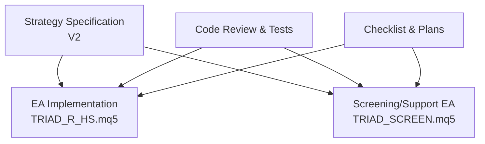
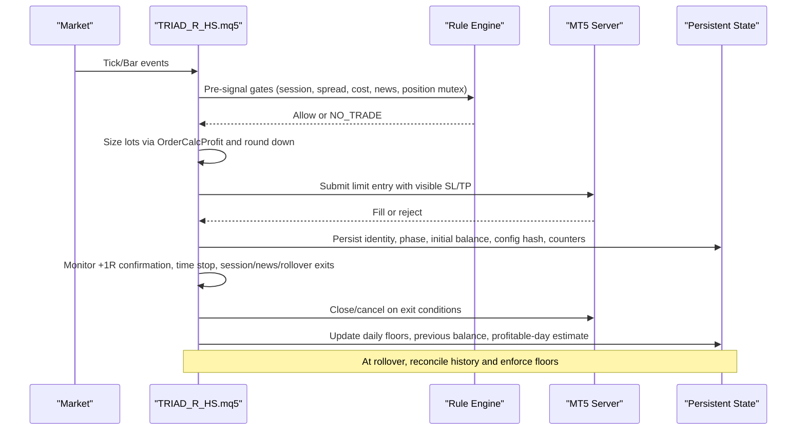
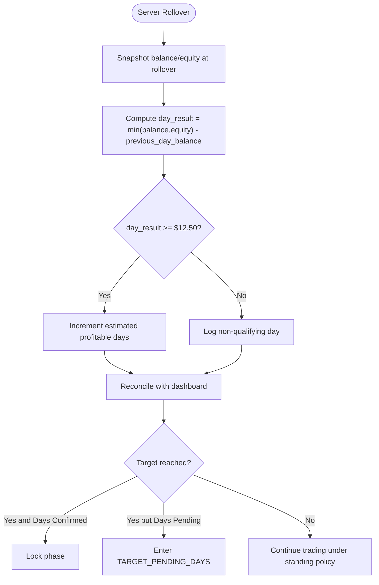
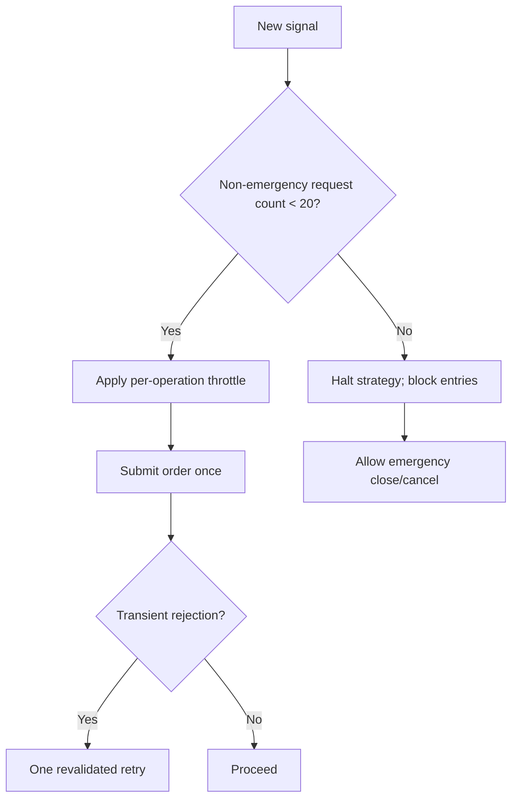
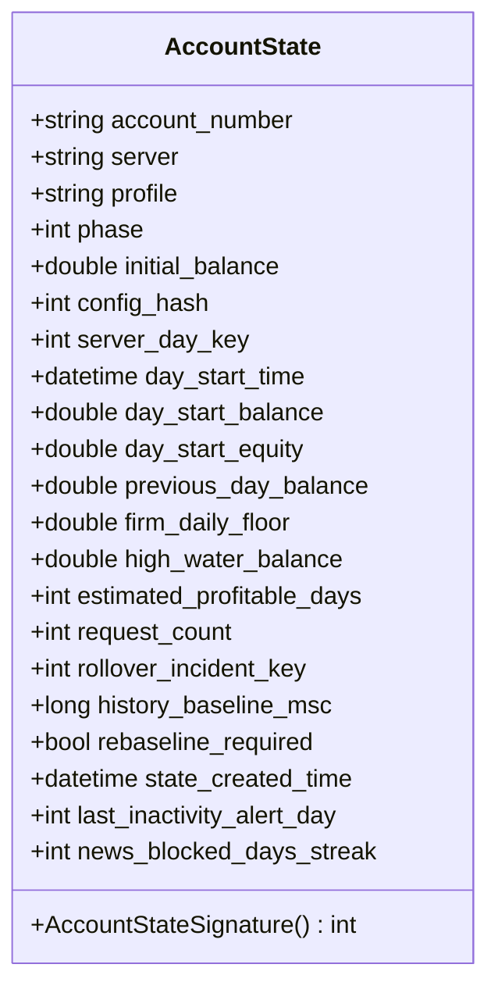
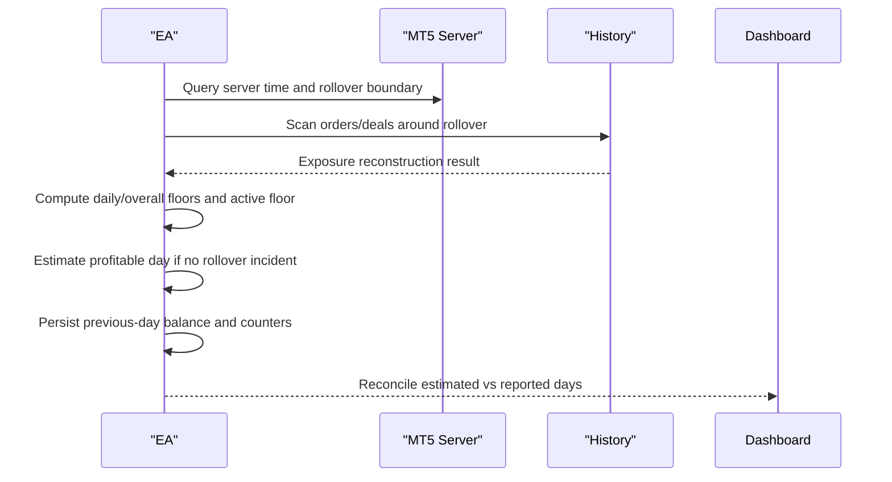
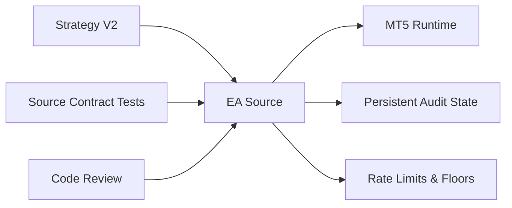

# Compliance Framework

<cite>
**Referenced Files in This Document**
- [THE5ERS-CHALLENGE-STRATEGY-V2.md](file://THE5ERS-CHALLENGE-STRATEGY-V2.md)
- [THE5ERS-2.5K-CHALLENGE-PLAN.md](file://THE5ERS-2.5K-CHALLENGE-PLAN.md)
- [THE5ERS-END-TO-END-PRECODE-CHECKLIST.md](file://THE5ERS-END-TO-END-PRECODE-CHECKLIST.md)
- [TRIAD_R_HS-CODE-REVIEW.md](file://TRIAD_R_HS-CODE-REVIEW.md)
- [TRIAD_R_HS.mq5](file://MQL5/Experts/TRIAD_R_HS/TRIAD_R_HS.mq5)
- [TRIAD_SCREEN.mq5](file://MQL5/Experts/TRIAD_SCREEN/TRIAD_SCREEN.mq5)
- [test_source_contract.py](file://tests/test_source_contract.py)
</cite>

## Table of Contents
1. Introduction
2. Project Structure
3. Core Components
4. Architecture Overview
5. Detailed Component Analysis
6. Dependency Analysis
7. Performance Considerations
8. Troubleshooting Guide
9. Conclusion
10. Appendices

## Introduction
This document defines the compliance framework for The5ers proprietary trading firm requirements as implemented and validated by the repository’s TRIAD-R strategy and supporting documentation. It consolidates immutable rules, challenge-specific targets, rate limiting, audit trail persistence, rollover reconciliation, emergency protocols, and operational checklists into a single reference for engineers and operators.

## Project Structure
The compliance framework is defined primarily through:
- Strategy specification and validation documents that codify immutable rules, phase targets, risk controls, and lifecycle transitions.
- MQL5 expert advisors implementing MT5 execution, safety guards, rollover handling, and request throttling.
- Tests and code reviews verifying required tokens, behaviors, and structural constraints.

**Diagram sources**
- [THE5ERS-CHALLENGE-STRATEGY-V2.md:1-52](file://THE5ERS-CHALLENGE-STRATEGY-V2.md#L1-L52)
- [TRIAD_R_HS.mq5:1-90](file://MQL5/Experts/TRIAD_R_HS/TRIAD_R_HS.mq5#L1-L90)
- [TRIAD_SCREEN.mq5:2014-2068](file://MQL5/Experts/TRIAD_SCREEN/TRIAD_SCREEN.mq5#L2014-L2068)
- [test_source_contract.py:418-478](file://tests/test_source_contract.py#L418-L478)

**Section sources**
- [THE5ERS-CHALLENGE-STRATEGY-V2.md:1-52](file://THE5ERS-CHALLENGE-STRATEGY-V2.md#L1-L52)
- [TRIAD_R_HS.mq5:1-90](file://MQL5/Experts/TRIAD_R_HS/TRIAD_R_HS.mq5#L1-L90)

## Core Components
- Immutable rule set: one-position-only, prohibited practices, broker-visible stops, news blackout, session/time boundaries, volume rounding, and rate limits.
- Challenge targets: Phase 1 (+10% target with three qualifying days), Phase 2 (+5% target with three qualifying days).
- Risk engine: cash-risk sizing using live symbol economics, drawdown throttle, daily/weekly internal stops.
- Rollover and profitable-day accounting: server-time-based day boundaries, floor calculations, and dashboard reconciliation.
- Audit trail: persistent identity, phase, initial balance, configuration checksums, state signatures, and counters.
- Emergency protocols: missing stops, partial fills, duplicate positions, disconnections, and rollover incidents.

**Section sources**
- [THE5ERS-CHALLENGE-STRATEGY-V2.md:32-52](file://THE5ERS-CHALLENGE-STRATEGY-V2.md#L32-L52)
- [THE5ERS-CHALLENGE-STRATEGY-V2.md:243-269](file://THE5ERS-CHALLENGE-STRATEGY-V2.md#L243-L269)
- [THE5ERS-CHALLENGE-STRATEGY-V2.md:272-311](file://THE5ERS-CHALLENGE-STRATEGY-V2.md#L272-L311)
- [TRIAD_R_HS.mq5:2527-2558](file://MQL5/Experts/TRIAD_R_HS/TRIAD_R_HS.mq5#L2527-L2558)
- [TRIAD_R_HS.mq5:3284-3499](file://MQL5/Experts/TRIAD_R_HS/TRIAD_R_HS.mq5#L3284-L3499)

## Architecture Overview
The system enforces compliance via layered checks before any order submission, continuous monitoring during exposure, and strict post-trade reconciliation at rollover.

**Diagram sources**
- [THE5ERS-CHALLENGE-STRATEGY-V2.md:74-95](file://THE5ERS-CHALLENGE-STRATEGY-V2.md#L74-L95)
- [THE5ERS-CHALLENGE-STRATEGY-V2.md:117-148](file://THE5ERS-CHALLENGE-STRATEGY-V2.md#L117-L148)
- [THE5ERS-CHALLENGE-STRATEGY-V2.md:150-183](file://THE5ERS-CHALLENGE-STRATEGY-V2.md#L150-L183)
- [TRIAD_R_HS.mq5:3284-3499](file://MQL5/Experts/TRIAD_R_HS/TRIAD_R_HS.mq5#L3284-L3499)

## Detailed Component Analysis

### Immutable Rules and Prohibited Practices
- One working entry or one open position account-wide; no simultaneous positions or separate target tickets.
- No grid, martingale, averaging, hedge, recovery trade, HFT, tick scalping, arbitrage, emulator, or stealth stop.
- Broker-visible stop attached to every entry; no market chase after expired limits.
- Maximum two completed sequential trades per server day.
- Volume always rounded down; never increase size to satisfy profitable-day threshold.
- Long/short symmetry; no forced alternation.
- Runtime optimization disabled; trader owns source code.
- Rate limiting: no per-tick modifications, one revalidated retry after transient rejection, default cap of 20 non-emergency trade requests per server day; reaching the cap blocks entries and halts strategy while preserving emergency actions.

**Section sources**
- [THE5ERS-CHALLENGE-STRATEGY-V2.md:32-52](file://THE5ERS-CHALLENGE-STRATEGY-V2.md#L32-L52)
- [THE5ERS-HIGH-STAKES-RESEARCH.md:100-157](file://THE5ERS-HIGH-STAKES-RESEARCH.md#L100-L157)
- [TRIAD_R_HS.mq5:2527-2558](file://MQL5/Experts/TRIAD_R_HS/TRIAD_R_HS.mq5#L2527-L2558)

### Challenge-Specific Requirements and Profit Calculation
- Phase 1: target +10% ($250) with minimum three qualifying days.
- Phase 2: target +5% ($125) with minimum three qualifying days.
- Qualifying day formula: min(midnight balance, midnight equity) - previous-day balance >= $12.50.
- Dashboard is authoritative; EA estimates are reconciled against it.
- If balance target reached without confirmed days, enter TARGET_PENDING_DAYS and remain flat pending review.

**Diagram sources**
- [THE5ERS-CHALLENGE-STRATEGY-V2.md:243-269](file://THE5ERS-CHALLENGE-STRATEGY-V2.md#L243-L269)
- [TRIAD_R_HS.mq5:3379-3499](file://MQL5/Experts/TRIAD_R_HS/TRIAD_R_HS.mq5#L3379-L3499)

**Section sources**
- [THE5ERS-CHALLENGE-STRATEGY-V2.md:243-269](file://THE5ERS-CHALLENGE-STRATEGY-V2.md#L243-L269)
- [THE5ERS-2.5K-CHALLENGE-PLAN.md:12-35](file://THE5ERS-2.5K-CHALLENGE-PLAN.md#L12-L35)

### Rate Limiting Mechanisms
- No per-tick order modification; only necessary safety operations allowed.
- One revalidated retry after transient technical rejection.
- Default cap of 20 non-emergency trade requests per server day; reaching the cap blocks new entries and halts strategy.
- Safety cancels/closes remain permitted even when the cap is reached.
- Additional per-operation throttles prevent repeated cancel/modify/request bursts.

**Diagram sources**
- [THE5ERS-CHALLENGE-STRATEGY-V2.md:32-52](file://THE5ERS-CHALLENGE-STRATEGY-V2.md#L32-L52)
- [TRIAD_R_HS.mq5:2527-2558](file://MQL5/Experts/TRIAD_R_HS/TRIAD_R_HS.mq5#L2527-L2558)

**Section sources**
- [THE5ERS-CHALLENGE-STRATEGY-V2.md:32-52](file://THE5ERS-CHALLENGE-STRATEGY-V2.md#L32-L52)
- [TRIAD_R_HS.mq5:2527-2558](file://MQL5/Experts/TRIAD_R_HS/TRIAD_R_HS.mq5#L2527-L2558)

### Audit Trail and Persistent Storage
- On first authorized initialization, persist:
  - Account number/server, program/profile, phase, initial balance, selected base risk and exit configuration, configuration/build checksum, prior rollover balance/equity, and day counters.
- Fail closed on mismatch; do not infer phase from current balance.
- Maintain an account state signature including identity, config hash, day keys, balances, floors, high-water mark, estimated profitable days, request count, rollover incident key, history baseline, rebaseline flag, state creation time, inactivity alert day, and news-block streak.
- Persist daily start balance/equity, previous-day balance, daily floor, high-water balance, and estimated profitable days across rollovers.

**Diagram sources**
- [TRIAD_R_HS.mq5:403-428](file://MQL5/Experts/TRIAD_R_HS/TRIAD_R_HS.mq5#L403-L428)
- [TRIAD_R_HS.mq5:568-588](file://MQL5/Experts/TRIAD_R_HS/TRIAD_R_HS.mq5#L568-L588)

**Section sources**
- [THE5ERS-CHALLENGE-STRATEGY-V2.md:272-311](file://THE5ERS-CHALLENGE-STRATEGY-V2.md#L272-L311)
- [TRIAD_R_HS.mq5:403-428](file://MQL5/Experts/TRIAD_R_HS/TRIAD_R_HS.mq5#L403-L428)
- [TRIAD_R_HS.mq5:568-588](file://MQL5/Experts/TRIAD_R_HS/TRIAD_R_HS.mq5#L568-L588)

### Rollover Reconciliation and Profitable-Day Verification
- Use confirmed MT5 server rollover boundary; do not rely on local/session time.
- At rollover:
  - Compute firm daily floor as max(rollover balance, rollover equity) × 0.95.
  - Compute firm overall floor as phase initial balance × 0.90.
  - Active firm floor is the more restrictive of the two plus an internal reserve.
- Reconstruct missed rollover exposure from history; if found, suppress profitable-day estimate and require human review.
- Compare EA’s estimated profitable days with dashboard; dashboard is authoritative.

**Diagram sources**
- [THE5ERS-CHALLENGE-STRATEGY-V2.md:272-311](file://THE5ERS-CHALLENGE-STRATEGY-V2.md#L272-L311)
- [TRIAD_R_HS.mq5:3284-3499](file://MQL5/Experts/TRIAD_R_HS/TRIAD_R_HS.mq5#L3284-L3499)

**Section sources**
- [THE5ERS-CHALLENGE-STRATEGY-V2.md:272-311](file://THE5ERS-CHALLENGE-STRATEGY-V2.md#L272-L311)
- [TRIAD_R_HS.mq5:3284-3499](file://MQL5/Experts/TRIAD_R_HS/TRIAD_R_HS.mq5#L3284-L3499)

### Emergency Protocols
- Missing visible stop: attempt one immediate protective correction; if unsuccessful, close position and halt.
- Partial/unexpected fills: reconcile actual risk and position count; multiple positions trigger flatten/halt.
- Duplicate/multiple positions: cancel all entry orders, reduce to zero exposure as safely executable, halt.
- Platform disconnection/reconnect: reconstruct state from broker history; fail closed until safe.
- Request cap reached: block entries; never block safety cancel/close.
- Firm-floor danger: no new order; emergency exposure reduction.
- Calendar failure: no new orders; fail closed.

**Section sources**
- [THE5ERS-END-TO-END-PRECODE-CHECKLIST.md:319-338](file://THE5ERS-END-TO-END-PRECODE-CHECKLIST.md#L319-L338)
- [TRIAD_R_HS-CODE-REVIEW.md:18-77](file://TRIAD_R_HS-CODE-REVIEW.md#L18-L77)

### Checklists

#### Pre-deployment Compliance Verification
- Confirm product is $2,500 New High Stakes with correct targets and rules.
- Persist and verify account identity, phase, initial balance, and configuration/build checksum.
- Verify symbol specs, commission, volume step/minimum, stop/freeze levels, and server rollover boundary.
- Load and verify red-folder calendar coverage declaration.
- Test emergency close, rejected order, reconnect, and restart recovery.
- Ensure order submission is disabled until all validation gates pass.

**Section sources**
- [THE5ERS-END-TO-END-PRECODE-CHECKLIST.md:31-48](file://THE5ERS-END-TO-END-PRECODE-CHECKLIST.md#L31-L48)
- [THE5ERS-END-TO-END-PRECODE-CHECKLIST.md:78-98](file://THE5ERS-END-TO-END-PRECODE-CHECKLIST.md#L78-L98)
- [TRIAD_R_HS.mq5:53-76](file://MQL5/Experts/TRIAD_R_HS/TRIAD_R_HS.mq5#L53-L76)

#### Ongoing Operational Monitoring
- Before every order: confirm session, hard gates, news clearance, spread/cost, no correlated position, lot rounding, visible SL, safety floors, daily/weekly limits.
- After every trading day: flat before rollover, reconcile MT5 and dashboard, record P&L and metrics, confirm whether day qualified.
- Inactivity alerts: warn at 20 inactive days, escalate at 25; no fake trades.
- News-block inactivity streak: alert when consecutive news-blocked days occur without trades.

**Section sources**
- [THE5ERS-END-TO-END-PRECODE-CHECKLIST.md:121-145](file://THE5ERS-END-TO-END-PRECODE-CHECKLIST.md#L121-L145)
- [THE5ERS-END-TO-END-PRECODE-CHECKLIST.md:201-215](file://THE5ERS-END-TO-END-PRECODE-CHECKLIST.md#L201-L215)
- [TRIAD_R_HS.mq5:3469-3490](file://MQL5/Experts/TRIAD_R_HS/TRIAD_R_HS.mq5#L3469-L3490)

## Dependency Analysis
- Strategy specification drives EA behavior and must be frozen before validation.
- EA depends on MT5 runtime APIs for quotes, history, and order execution.
- Tests assert presence of required tokens and guard logic in source.
- Code review validates initialization, lease fencing, persistence, rollover reconstruction, calendar coverage, collision ranking, volume rounding, timing, cleanup lifecycle, and governor states.

**Diagram sources**
- [THE5ERS-CHALLENGE-STRATEGY-V2.md:1-52](file://THE5ERS-CHALLENGE-STRATEGY-V2.md#L1-L52)
- [test_source_contract.py:418-478](file://tests/test_source_contract.py#L418-L478)
- [TRIAD_R_HS-CODE-REVIEW.md:18-77](file://TRIAD_R_HS-CODE-REVIEW.md#L18-L77)

**Section sources**
- [test_source_contract.py:418-478](file://tests/test_source_contract.py#L418-L478)
- [TRIAD_R_HS-CODE-REVIEW.md:18-77](file://TRIAD_R_HS-CODE-REVIEW.md#L18-L77)

## Performance Considerations
- Keep server requests minimal: no per-tick modifications, one retry, and a conservative daily cap.
- Use session and news filters to avoid costly volatility spikes.
- Avoid unnecessary order retries and redundant cancellations.
- Prefer fixed exits and simple management to reduce server interactions.
- Validate latency and slippage bounds; reject signals outside tested execution health.

[No sources needed since this section provides general guidance]

## Troubleshooting Guide
Common issues and responses:
- Unknown account/profile/phase or configuration hash mismatch: no new orders.
- Stale quote/bar or calendar missing/stale: no new orders.
- Server rollover mismatch: no new orders; reconcile.
- Order rejected: one delayed, fully revalidated retry maximum.
- Visible stop missing: one correction attempt; otherwise close and halt.
- Duplicate/multiple positions: cancel entries, flatten as safely executable, halt.
- Partial fill: reconcile actual risk/position count immediately.
- Request cap reached: block entries; never block safety cancel/close.
- Daily/weekly/strategy floor breach: cancel entries and lock relevant period.
- Firm-floor danger: no new order; emergency exposure reduction.
- EA/VPS restart: reconstruct from broker state before action.
- Manual trade detected: halt and require reconciliation.
- Gap/slippage overrun: log actual, halt, do not claim guaranteed cap.

**Section sources**
- [THE5ERS-END-TO-END-PRECODE-CHECKLIST.md:319-338](file://THE5ERS-END-TO-END-PRECODE-CHECKLIST.md#L319-L338)
- [TRIAD_R_HS-CODE-REVIEW.md:18-77](file://TRIAD_R_HS-CODE-REVIEW.md#L18-L77)

## Conclusion
The compliance framework enforces a strict, fail-closed design aligned with The5ers’ immutable rules and challenge requirements. It prioritizes zero violations, robust audit trails, conservative rate limiting, and precise rollover reconciliation. The EA implements these safeguards with explicit checks, persisted state, and emergency protocols, while the documentation provides clear pre-deployment and ongoing operational checklists to ensure consistent, compliant operation through both evaluation phases and into funded stages.

## Appendices

### Appendix A: Phase Targets and Qualifying Days Summary
- Phase 1: target +10% ($250), three qualifying days of at least $12.50 each.
- Phase 2: target +5% ($125), three qualifying days of at least $12.50 each.
- Formula: min(midnight balance, midnight equity) - previous-day balance.
- Dashboard authoritative; EA estimates reconciled daily.

**Section sources**
- [THE5ERS-CHALLENGE-STRATEGY-V2.md:243-269](file://THE5ERS-CHALLENGE-STRATEGY-V2.md#L243-L269)
- [THE5ERS-2.5K-CHALLENGE-PLAN.md:12-35](file://THE5ERS-2.5K-CHALLENGE-PLAN.md#L12-L35)

### Appendix B: Rate Limiting Constants and Guards
- Max non-emergency requests per server day: 20.
- Per-operation throttle prevents rapid cancel/modify bursts.
- Emergency actions exempt from caps.

**Section sources**
- [THE5ERS-CHALLENGE-STRATEGY-V2.md:32-52](file://THE5ERS-CHALLENGE-STRATEGY-V2.md#L32-L52)
- [TRIAD_R_HS.mq5:2527-2558](file://MQL5/Experts/TRIAD_R_HS/TRIAD_R_HS.mq5#L2527-L2558)
- [test_source_contract.py:418-478](file://tests/test_source_contract.py#L418-L478)