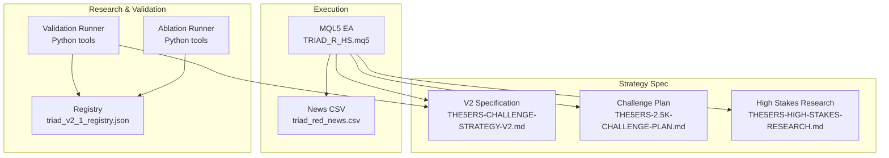
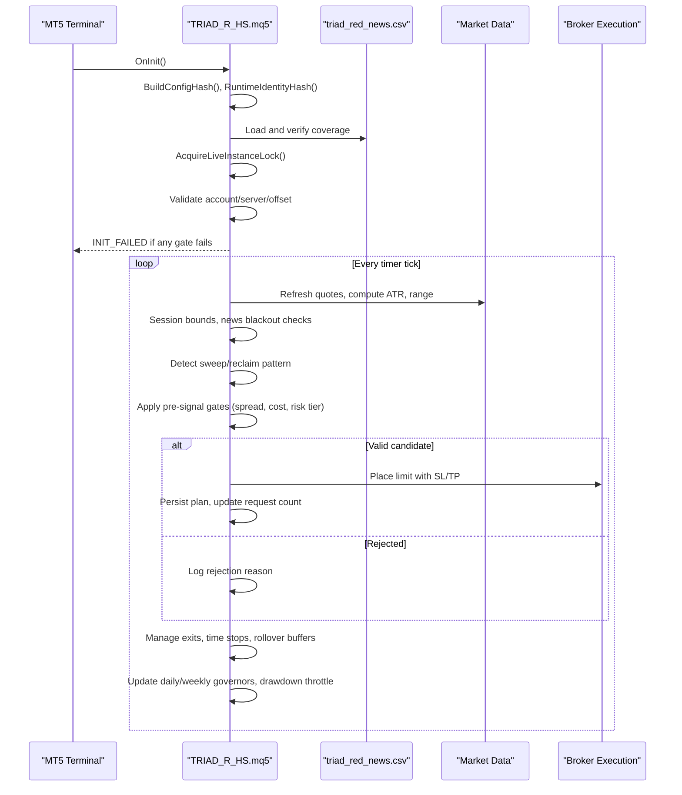
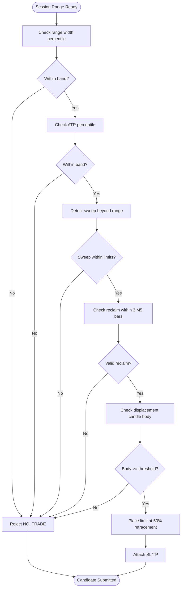
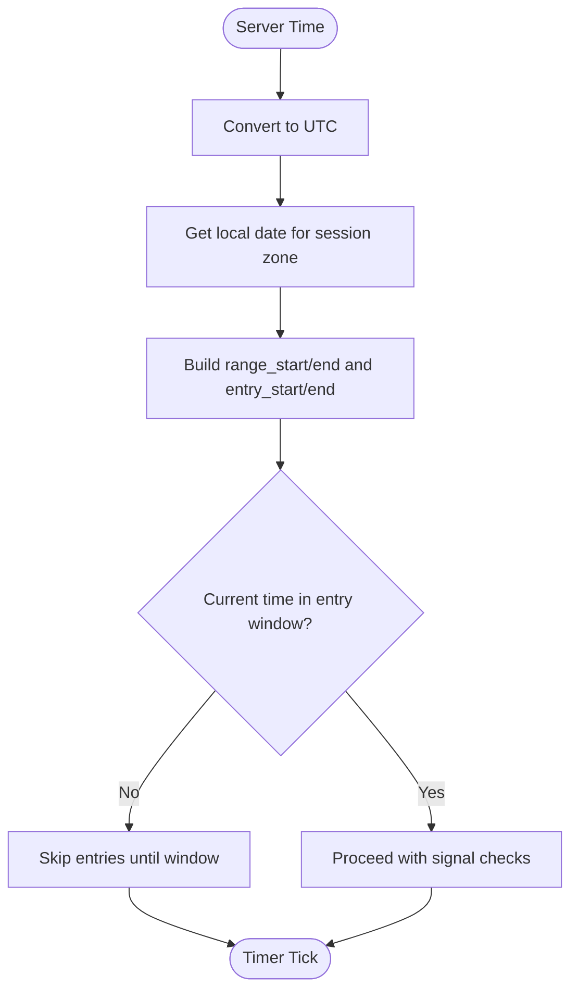
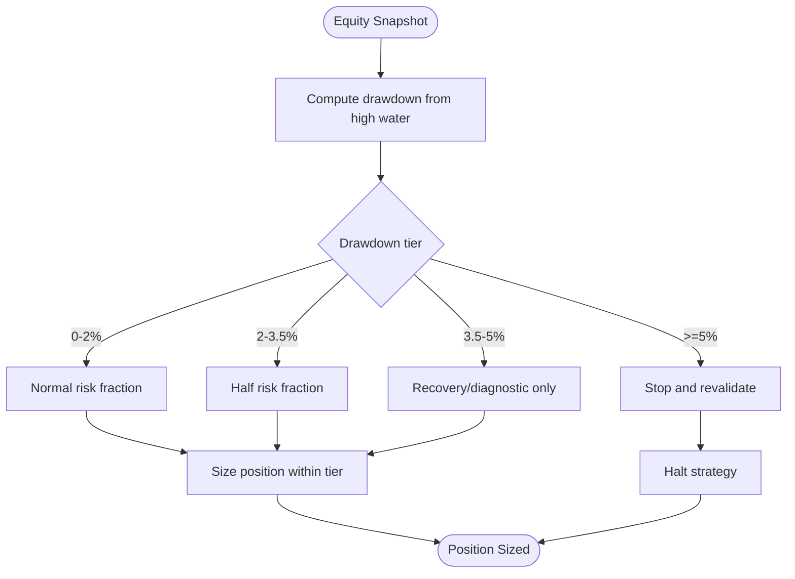
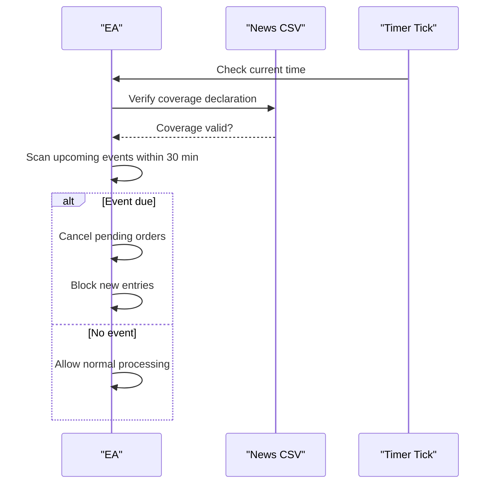
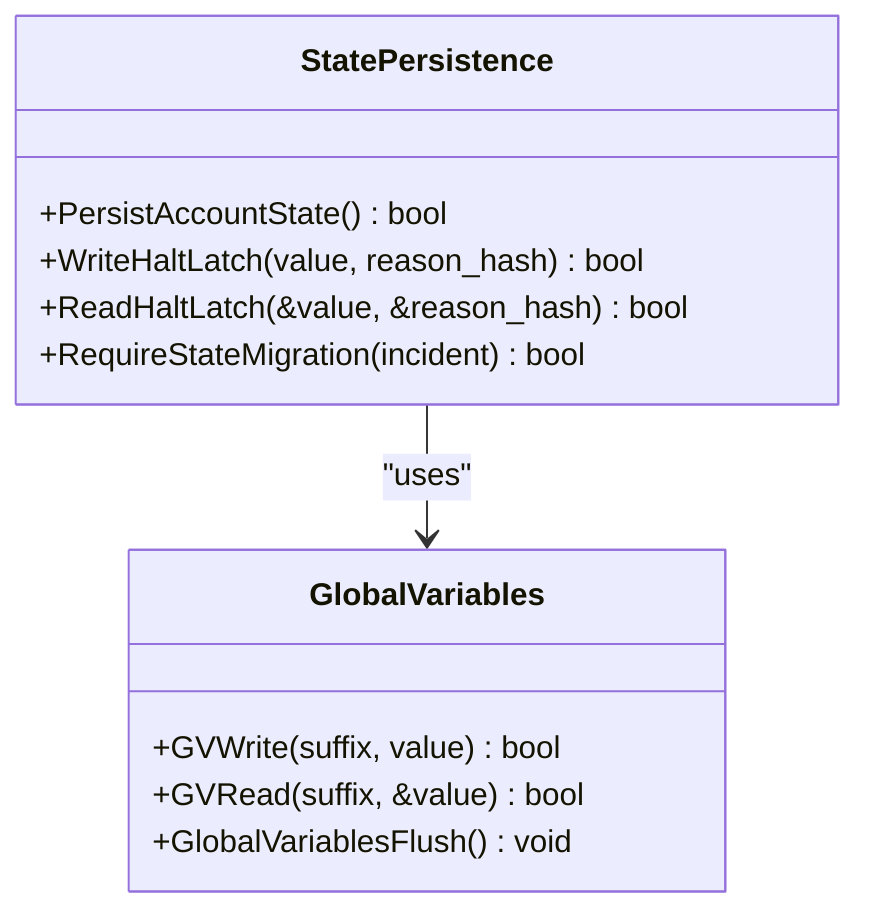
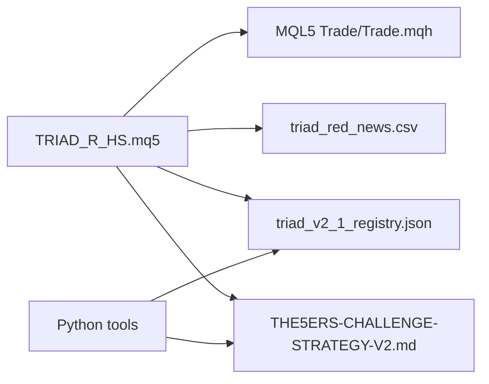

# Project Overview

<cite>
**Referenced Files in This Document**
- [TRIAD_R_HS.mq5](file://MQL5/Experts/TRIAD_R_HS/TRIAD_R_HS.mq5)
- [README.md](file://MQL5/Experts/TRIAD_R_HS/README.md)
- [THE5ERS-CHALLENGE-STRATEGY-V2.md](file://THE5ERS-CHALLENGE-STRATEGY-V2.md)
- [THE5ERS-2.5K-CHALLENGE-PLAN.md](file://THE5ERS-2.5K-CHALLENGE-PLAN.md)
- [THE5ERS-HIGH-STAKES-RESEARCH.md](file://THE5ERS-HIGH-STAKES-RESEARCH.md)
- [triad_v2_1_registry.json](file://validation/triad_v2_1_registry.json)
- [triad_red_news.csv.example](file://MQL5/Files/triad_red_news.csv.example)
</cite>

## Table of Contents
1. [Introduction](#introduction)
2. [Project Structure](#project-structure)
3. [Core Components](#core-components)
4. [Architecture Overview](#architecture-overview)
5. [Detailed Component Analysis](#detailed-component-analysis)
6. [Dependency Analysis](#dependency-analysis)
7. [Performance Considerations](#performance-considerations)
8. [Troubleshooting Guide](#troubleshooting-guide)
9. [Conclusion](#conclusion)
10. [Appendices](#appendices)

## Introduction
TRIAD-R is a specialized algorithmic trading system designed to pass The5ers $2,500 High Stakes challenge evaluations with strict compliance and risk controls. It focuses on a single-position M5 sweep/reclaim reversal strategy during London and New York sessions, using a hybrid architecture:
- MQL5 Expert Advisor (EA) for live execution, session management, news blackout enforcement, and firm-rule guardrails.
- Python research tools for validation, replay export, ablation studies, and frozen configuration registries.

The system targets proprietary trading firm challenges by enforcing one-position topology, explicit risk tiers, drawdown throttling, and robust state persistence. It is fail-closed by default and requires operator attestations before enabling order submission.

## Project Structure
The repository separates live execution code from research and validation tooling:
- MQL5 Experts: TRIAD-R High Stakes EA and screen EA.
- Tools: Python scripts for replay export, validation, ablation, and optimization scaffolding.
- Validation: Frozen registries defining the 160 V2.1 configurations and ablation registry.
- Documentation: Challenge plans, research notes, and code review reports.

**Diagram sources**
- [TRIAD_R_HS.mq5:1-150](file://MQL5/Experts/TRIAD_R_HS/TRIAD_R_HS.mq5#L1-L150)
- [triad_v2_1_registry.json:1-200](file://validation/triad_v2_1_registry.json#L1-L200)
- [THE5ERS-CHALLENGE-STRATEGY-V2.md:1-120](file://THE5ERS-CHALLENGE-STRATEGY-V2.md#L1-L120)
- [THE5ERS-2.5K-CHALLENGE-PLAN.md:1-120](file://THE5ERS-2.5K-CHALLENGE-PLAN.md#L1-L120)
- [THE5ERS-HIGH-STAKES-RESEARCH.md:1-120](file://THE5ERS-HIGH-STAKES-RESEARCH.md#L1-L120)

**Section sources**
- [TRIAD_R_HS.mq5:1-150](file://MQL5/Experts/TRIAD_R_HS/TRIAD_R_HS.mq5#L1-L150)
- [README.md:1-120](file://MQL5/Experts/TRIAD_R_HS/README.md#L1-L120)
- [triad_v2_1_registry.json:1-200](file://validation/triad_v2_1_registry.json#L1-L200)

## Core Components
- Session-based sweep/reclaim strategy: Detects false breakouts at session boundaries and trades reclaims with defined stop/target geometry.
- Session management: London and New York windows with civil-time DST-aware conversion and entry windows.
- Risk tiers: Paired profiles A–D with risk fractions and fixed R targets; drawdown throttle reduces risk as equity declines.
- Firm-rule guard: Daily/overall floors, internal stops, rate limiting, and one-position topology enforced at runtime.
- News blackout: Explicit calendar coverage declaration and 30-minute pre/post event buffer.
- State persistence: Terminal globals with signatures, halt latches, migration latches, and audit logs.

Key implementation anchors:
- Enums and inputs define phases, profiles, sessions, patterns, lifecycle locks, and safety gates.
- Structures encapsulate session runtime state and signal candidates with full metadata for logging and validation.
- Utility functions handle time conversions, server offsets, and day/week keys.

**Section sources**
- [TRIAD_R_HS.mq5:16-210](file://MQL5/Experts/TRIAD_R_HS/TRIAD_R_HS.mq5#L16-L210)
- [TRIAD_R_HS.mq5:213-263](file://MQL5/Experts/TRIAD_R_HS/TRIAD_R_HS.mq5#L213-L263)
- [THE5ERS-CHALLENGE-STRATEGY-V2.md:54-115](file://THE5ERS-CHALLENGE-STRATEGY-V2.md#L54-L115)
- [THE5ERS-2.5K-CHALLENGE-PLAN.md:66-162](file://THE5ERS-2.5K-CHALLENGE-PLAN.md#L66-L162)

## Architecture Overview
The system combines an MQL5 EA with Python research tools under a canonical specification. The EA enforces session rules, news blackouts, risk tiers, and firm floors while persisting state and auditing decisions. Python tools validate configurations, run ablations, and produce evidence for selection and holdout evaluation.

**Diagram sources**
- [TRIAD_R_HS.mq5:268-330](file://MQL5/Experts/TRIAD_R_HS/TRIAD_R_HS.mq5#L268-L330)
- [TRIAD_R_HS.mq5:754-790](file://MQL5/Experts/TRIAD_R_HS/TRIAD_R_HS.mq5#L754-L790)
- [THE5ERS-CHALLENGE-STRATEGY-V2.md:74-115](file://THE5ERS-CHALLENGE-STRATEGY-V2.md#L74-L115)

## Detailed Component Analysis

### Sweep/Reclaim Pattern Detection
The EA detects false breakouts by measuring session ranges and identifying sweeps beyond reference levels followed by reclaim candles within a bounded window. Entry is placed via a limit order at a retracement level of the displacement candle body, with broker-visible stop and target attached at submission.

**Diagram sources**
- [THE5ERS-CHALLENGE-STRATEGY-V2.md:98-115](file://THE5ERS-CHALLENGE-STRATEGY-V2.md#L98-L115)
- [TRIAD_R_HS.mq5:180-210](file://MQL5/Experts/TRIAD_R_HS/TRIAD_R_HS.mq5#L180-L210)

**Section sources**
- [THE5ERS-CHALLENGE-STRATEGY-V2.md:98-115](file://THE5ERS-CHALLENGE-STRATEGY-V2.md#L98-L115)
- [TRIAD_R_HS.mq5:180-210](file://MQL5/Experts/TRIAD_R_HS/TRIAD_R_HS.mq5#L180-L210)

### Session Management
The EA computes London and New York session windows using civil-time DST-aware conversion and maps them to MT5 server timestamps. Entry windows are constrained to specific hours post-range construction, and rollover buffers ensure flat positions before daily snapshots.

**Diagram sources**
- [TRIAD_R_HS.mq5:663-712](file://MQL5/Experts/TRIAD_R_HS/TRIAD_R_HS.mq5#L663-L712)
- [TRIAD_R_HS.mq5:754-790](file://MQL5/Experts/TRIAD_R_HS/TRIAD_R_HS.mq5#L754-L790)

**Section sources**
- [TRIAD_R_HS.mq5:663-712](file://MQL5/Experts/TRIAD_R_HS/TRIAD_R_HS.mq5#L663-L712)
- [TRIAD_R_HS.mq5:754-790](file://MQL5/Experts/TRIAD_R_HS/TRIAD_R_HS.mq5#L754-L790)

### Risk Tiers and Drawdown Throttle
Risk is expressed as paired profiles with fixed R targets and risk fractions. Drawdown throttle reduces risk as equity declines, with a hard shutdown at 5%. Position sizing uses OrderCalcProfit and symbol properties to ensure cash risk stays within tier limits.

**Diagram sources**
- [THE5ERS-2.5K-CHALLENGE-PLAN.md:189-204](file://THE5ERS-2.5K-CHALLENGE-PLAN.md#L189-L204)
- [THE5ERS-CHALLENGE-STRATEGY-V2.md:185-200](file://THE5ERS-CHALLENGE-STRATEGY-V2.md#L185-L200)

**Section sources**
- [THE5ERS-2.5K-CHALLENGE-PLAN.md:189-204](file://THE5ERS-2.5K-CHALLENGE-PLAN.md#L189-L204)
- [THE5ERS-CHALLENGE-STRATEGY-V2.md:185-200](file://THE5ERS-CHALLENGE-STRATEGY-V2.md#L185-L200)

### News Blackout and Calendar Coverage
The EA loads a CSV of red/high events and requires an explicit coverage declaration through a verified UTC timestamp. Entries are blocked within a 30-minute buffer around events, and pending orders are cancelled before blackouts.

**Diagram sources**
- [TRIAD_R_HS.mq5:791-800](file://MQL5/Experts/TRIAD_R_HS/TRIAD_R_HS.mq5#L791-L800)
- [README.md:27-49](file://MQL5/Experts/TRIAD_R_HS/README.md#L27-L49)

**Section sources**
- [README.md:27-49](file://MQL5/Experts/TRIAD_R_HS/README.md#L27-L49)
- [triad_red_news.csv.example:1-10](file://MQL5/Files/triad_red_news.csv.example#L1-L10)

### State Persistence and Safety Latches
The EA persists configuration hashes, identity hashes, halt latches, migration latches, and accounting state with signatures. On mismatch or partial writes, it fails closed and halts to prevent unsafe operation.

**Diagram sources**
- [TRIAD_R_HS.mq5:568-617](file://MQL5/Experts/TRIAD_R_HS/TRIAD_R_HS.mq5#L568-L617)
- [TRIAD_R_HS.mq5:449-492](file://MQL5/Experts/TRIAD_R_HS/TRIAD_R_HS.mq5#L449-L492)

**Section sources**
- [TRIAD_R_HS.mq5:568-617](file://MQL5/Experts/TRIAD_R_HS/TRIAD_R_HS.mq5#L568-L617)
- [TRIAD_R_HS.mq5:449-492](file://MQL5/Experts/TRIAD_R_HS/TRIAD_R_HS.mq5#L449-L492)

## Dependency Analysis
The EA depends on:
- MQL5 standard library for trading and indicators.
- News CSV for event-driven blackout logic.
- Frozen registries for configuration selection and validation.
- Python tools for ablation and replay analysis.

**Diagram sources**
- [TRIAD_R_HS.mq5:7](file://MQL5/Experts/TRIAD_R_HS/TRIAD_R_HS.mq5#L7)
- [triad_v2_1_registry.json:1-200](file://validation/triad_v2_1_registry.json#L1-L200)
- [THE5ERS-CHALLENGE-STRATEGY-V2.md:1-120](file://THE5ERS-CHALLENGE-STRATEGY-V2.md#L1-L120)

**Section sources**
- [TRIAD_R_HS.mq5:7](file://MQL5/Experts/TRIAD_R_HS/TRIAD_R_HS.mq5#L7)
- [triad_v2_1_registry.json:1-200](file://validation/triad_v2_1_registry.json#L1-L200)

## Performance Considerations
- One-position topology minimizes correlation and complexity.
- Session-based entries reduce noise and focus on liquid periods.
- Risk tiers and drawdown throttle protect capital during adverse regimes.
- News blackout prevents slippage and rule violations during volatile releases.
- Rate limiting and latency checks avoid excessive server requests and stale data usage.

[No sources needed since this section provides general guidance]

## Troubleshooting Guide
Common issues and resolutions:
- Initialization failure: Check account/server/offset match, release gates, and news coverage validity.
- Duplicate instance lock: Ensure only one terminal instance owns the account lock; stale instances are fenced.
- News blackout inactivity: If no trades occur due to news blocks, monitor inactivity alerts and ensure calendar coverage is current.
- State migration latch: External cashflows or unauthorized history require a separately reviewed rebaseline process.
- Emergency halt: Review halt latch signature and reason hash; resolve incident before resetting with authorized workflow.

**Section sources**
- [TRIAD_R_HS.mq5:273-330](file://MQL5/Experts/TRIAD_R_HS/TRIAD_R_HS.mq5#L273-L330)
- [TRIAD_R_HS.mq5:494-566](file://MQL5/Experts/TRIAD_R_HS/TRIAD_R_HS.mq5#L494-L566)
- [README.md:89-117](file://MQL5/Experts/TRIAD_R_HS/README.md#L89-L117)

## Conclusion
TRIAD-R provides a disciplined, compliant approach to The5ers $2,500 High Stakes challenges. Its hybrid architecture combines a robust MQL5 EA with rigorous Python-based validation, ensuring that session-based sweep/reclaim strategies operate within strict risk and compliance boundaries. By enforcing one-position topology, explicit risk tiers, and comprehensive state persistence, the system prioritizes survival and steady progress toward phase targets without compromising integrity.

[No sources needed since this section summarizes without analyzing specific files]

## Appendices

### Practical Examples for Proprietary Trading Firm Challenges
- Example scenario: During London session, EURUSD sweeps below the reference low by 0.10 × ATR(M15,14), then reclaims within three M5 bars with a strong displacement candle. The EA places a limit order at the 50% retracement with a broker-visible stop and target, adhering to spread/cost gates and news blackout rules.
- Compliance example: Before a CPI release, the EA cancels all pending orders and blocks new entries for 30 minutes, ensuring no rule violations even if existing positions remain open.
- Risk management example: As drawdown reaches 2%, the EA halves risk per trade, reducing exposure while maintaining the same strategy logic. At 5%, it halts and requires formal review before resuming.

[No sources needed since this section provides conceptual examples]