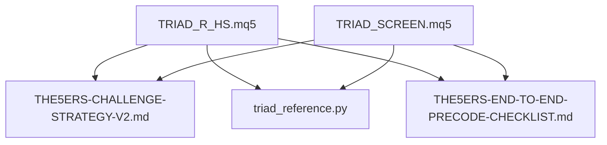
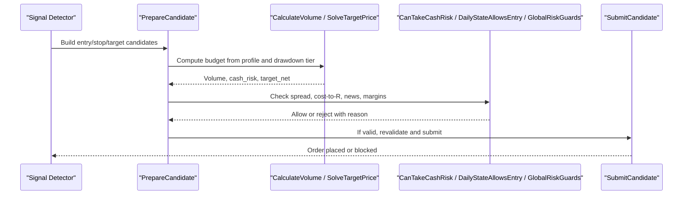
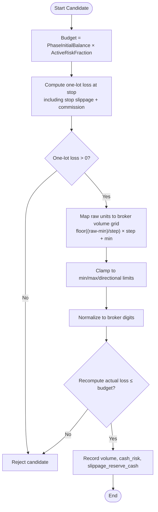
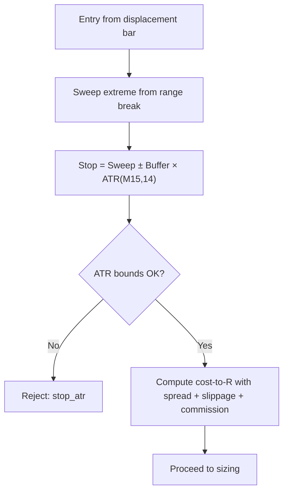
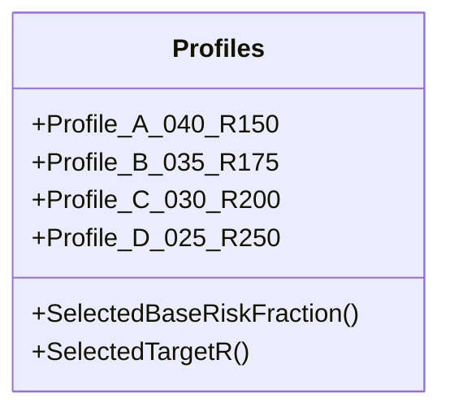
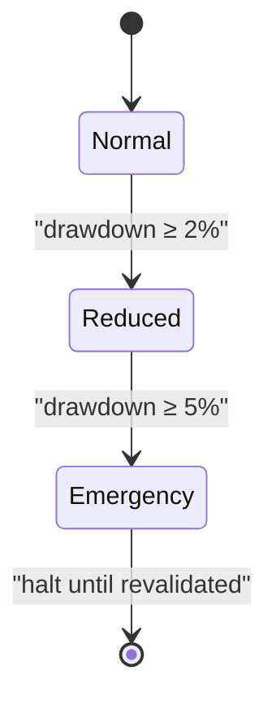
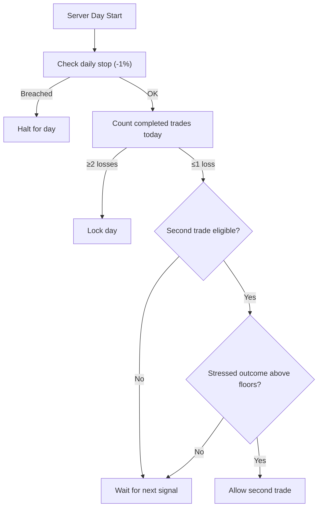
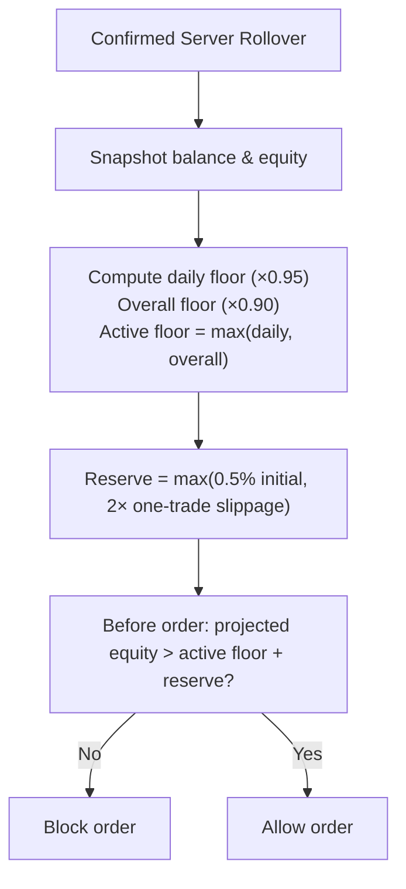
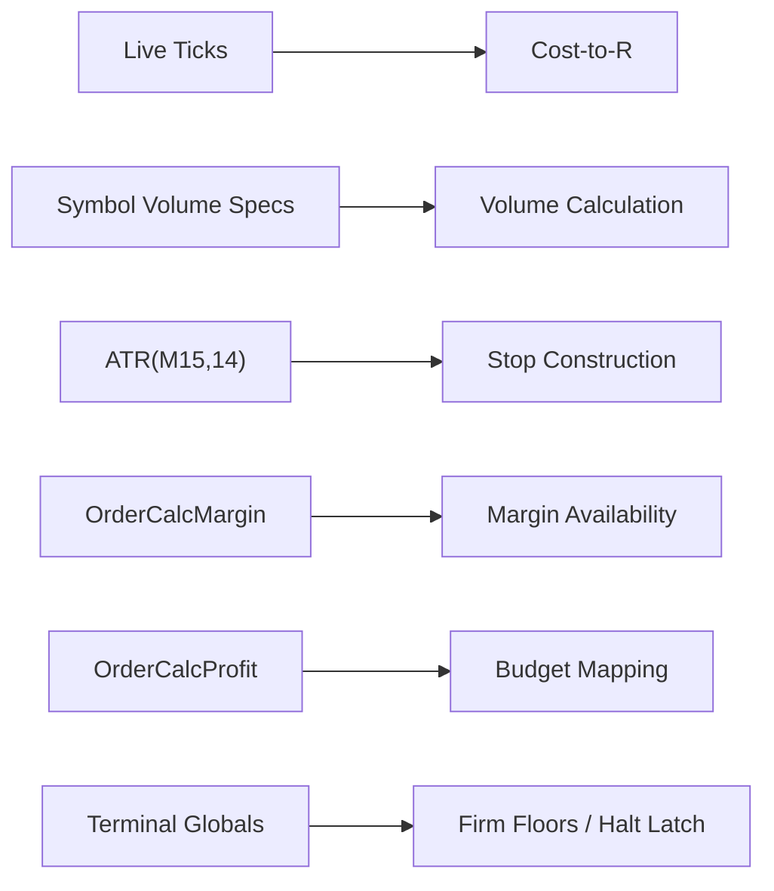

# Risk Management Framework

<cite>
**Referenced Files in This Document**
- [TRIAD_R_HS.mq5](file://MQL5/Experts/TRIAD_R_HS/TRIAD_R_HS.mq5)
- [TRIAD_SCREEN.mq5](file://MQL5/Experts/TRIAD_SCREEN/TRIAD_SCREEN.mq5)
- [THE5ERS-CHALLENGE-STRATEGY-V2.md](file://THE5ERS-CHALLENGE-STRATEGY-V2.md)
- [THE5ERS-END-TO-END-PRECODE-CHECKLIST.md](file://THE5ERS-END-TO-END-PRECODE-CHECKLIST.md)
- [triad_reference.py](file://tests/triad_reference.py)
</cite>

## Table of Contents
1. [Introduction](#introduction)
2. [Project Structure](#project-structure)
3. [Core Components](#core-components)
4. [Architecture Overview](#architecture-overview)
5. [Detailed Component Analysis](#detailed-component-analysis)
6. [Dependency Analysis](#dependency-analysis)
7. [Performance Considerations](#performance-considerations)
8. [Troubleshooting Guide](#troubleshooting-guide)
9. [Conclusion](#conclusion)
10. [Appendices](#appendices)

## Introduction
This document specifies the risk management framework used by the TRIAD-R High Stakes strategy and its screening counterpart. It explains how position sizing is derived from cash risk using live symbol economics, how stop distances are computed with ATR(M15,14), and how volume is rounded to broker constraints. It also documents the four paired risk/target profiles (A–D), why they are tested as pairs, the three-tier drawdown throttle, loss governors, and firm-rule protection mechanisms that calculate active floors from rollover balances and equity. Concrete examples illustrate risk calculations under different market conditions and account states.

## Project Structure
The risk logic is implemented primarily in the production expert advisor and mirrored in a screening tool:
- Production EA: TRIAD_R_HS.mq5
- Screening EA: TRIAD_SCREEN.mq5
- Strategy specification and rules: THE5ERS-CHALLENGE-STRATEGY-V2.md
- Precode checklist for rollover/firm floors: THE5ERS-END-TO-END-PRECODE-CHECKLIST.md
- Reference simulation utilities: triad_reference.py

**Diagram sources**
- [TRIAD_R_HS.mq5:1-150](file://MQL5/Experts/TRIAD_R_HS/TRIAD_R_HS.mq5#L1-L150)
- [TRIAD_SCREEN.mq5:1-150](file://MQL5/Experts/TRIAD_SCREEN/TRIAD_SCREEN.mq5#L1-L150)
- [THE5ERS-CHALLENGE-STRATEGY-V2.md:200-302](file://THE5ERS-CHALLENGE-STRATEGY-V2.md#L200-L302)
- [THE5ERS-END-TO-END-PRECODE-CHECKLIST.md:101-120](file://THE5ERS-END-TO-END-PRECODE-CHECKLIST.md#L101-L120)
- [triad_reference.py:72-106](file://tests/triad_reference.py#L72-L106)

**Section sources**
- [TRIAD_R_HS.mq5:1-150](file://MQL5/Experts/TRIAD_R_HS/TRIAD_R_HS.mq5#L1-L150)
- [TRIAD_SCREEN.mq5:1-150](file://MQL5/Experts/TRIAD_SCREEN/TRIAD_SCREEN.mq5#L1-L150)

## Core Components
- Cash-risk-based position sizing with live MT5 symbol economics.
- Stop distance based on ATR(M15,14) with configurable buffer and bounds.
- Volume rounding to broker step and limits.
- Four paired risk/target profiles (A–D).
- Three-tier drawdown throttle.
- Loss governors: daily -1%, weekly -2%, two-loss daily limit.
- Firm-rule protection: active floors from rollover balance/equity plus reserve.

Key implementation anchors:
- Profile selection and target R mapping: [SelectedBaseRiskFraction:1628-1638](file://MQL5/Experts/TRIAD_R_HS/TRIAD_R_HS.mq5#L1628-L1638), [SelectedTargetR:1640-1650](file://MQL5/Experts/TRIAD_R_HS/TRIAD_R_HS.mq5#L1640-L1650)
- Active risk fraction with drawdown throttle: [ActiveRiskFraction:1652-1658](file://MQL5/Experts/TRIAD_R_HS/TRIAD_R_HS.mq5#L1652-L1658)
- Stop construction and ATR bounds: [PrepareCandidate:2380-2402](file://MQL5/Experts/TRIAD_R_HS/TRIAD_R_HS.mq5#L2380-L2402)
- Volume calculation with broker constraints: [CalculateVolume:2236-2271](file://MQL5/Experts/TRIAD_R_HS/TRIAD_R_HS.mq5#L2236-L2271)
- Cash loss including slippage and commission: [CashLossForVolume:2217-2234](file://MQL5/Experts/TRIAD_R_HS/TRIAD_R_HS.mq5#L2217-L2234)
- Target solving for net R: [SolveTargetPrice:2273-2309](file://MQL5/Experts/TRIAD_R_HS/TRIAD_R_HS.mq5#L2273-L2309)
- Drawdown computation and thresholds: [CurrentStrategyDrawdownPercent:1621-1626](file://MQL5/Experts/TRIAD_R_HS/TRIAD_R_HS.mq5#L1621-L1626), [CanTakeCashRisk:1685-1712](file://MQL5/Experts/TRIAD_R_HS/TRIAD_R_HS.mq5#L1685-L1712)
- Daily/weekly stops and two-loss rule: [DailyStateAllowsEntry:1593-1619](file://MQL5/Experts/TRIAD_R_HS/TRIAD_R_HS.mq5#L1593-L1619)
- Firm floors and reserves: [FirmOverallFloor:1674-1677](file://MQL5/Experts/TRIAD_R_HS/TRIAD_R_HS.mq5#L1674-L1677), [FirmReserveCash:1679-1683](file://MQL5/Experts/TRIAD_R_HS/TRIAD_R_HS.mq5#L1679-L1683), [rollover floor update:3419-3439](file://MQL5/Experts/TRIAD_R_HS/TRIAD_R_HS.mq5#L3419-L3439)

**Section sources**
- [TRIAD_R_HS.mq5:1593-1712](file://MQL5/Experts/TRIAD_R_HS/TRIAD_R_HS.mq5#L1593-L1712)
- [TRIAD_R_HS.mq5:2217-2309](file://MQL5/Experts/TRIAD_R_HS/TRIAD_R_HS.mq5#L2217-L2309)
- [TRIAD_R_HS.mq5:2380-2402](file://MQL5/Experts/TRIAD_R_HS/TRIAD_R_HS.mq5#L2380-L2402)
- [TRIAD_R_HS.mq5:3419-3439](file://MQL5/Experts/TRIAD_R_HS/TRIAD_R_HS.mq5#L3419-L3439)

## Architecture Overview
The risk engine integrates signal detection, sizing, and safety checks before order submission. The flow ensures that every candidate is validated against live spreads, costs, broker constraints, news blackouts, and all risk guards.

**Diagram sources**
- [TRIAD_R_HS.mq5:2380-2521](file://MQL5/Experts/TRIAD_R_HS/TRIAD_R_HS.mq5#L2380-L2521)
- [TRIAD_R_HS.mq5:2692-2780](file://MQL5/Experts/TRIAD_R_HS/TRIAD_R_HS.mq5#L2692-L2780)

## Detailed Component Analysis

### Position Sizing: Cash Risk Methodology with Live Symbol Economics
- Budget per trade equals phase initial balance multiplied by the active risk fraction. The active risk fraction is the base profile risk reduced by 50% when strategy drawdown reaches or exceeds the reduce threshold.
- For each candidate, the system computes the one-lot adverse PnL at stop including configured stop slippage reserve and round-trip commission via MT5’s profit calculator.
- Raw budget divided by one-lot loss yields raw units; these are then mapped onto the broker’s volume grid anchored at SYMBOL_VOLUME_MIN and stepped by SYMBOL_VOLUME_STEP, clamped to SYMBOL_VOLUME_MAX and directional limits.
- The final volume is normalized to the broker’s digit precision and verified to stay within minimum/maximum and not exceed the budget after recomputation.
- Slippage reserve cash is tracked separately to ensure projected equity remains above firm floors even after worst-case gap/slippage.

**Diagram sources**
- [TRIAD_R_HS.mq5:2217-2271](file://MQL5/Experts/TRIAD_R_HS/TRIAD_R_HS.mq5#L2217-L2271)
- [TRIAD_R_HS.mq5:2480-2485](file://MQL5/Experts/TRIAD_R_HS/TRIAD_R_HS.mq5#L2480-L2485)

**Section sources**
- [TRIAD_R_HS.mq5:2217-2271](file://MQL5/Experts/TRIAD_R_HS/TRIAD_R_HS.mq5#L2217-L2271)
- [TRIAD_R_HS.mq5:2480-2485](file://MQL5/Experts/TRIAD_R_HS/TRIAD_R_HS.mq5#L2480-L2485)

### Stop Distance Calculations Based on ATR(M15,14)
- Entry is derived from the displacement bar midpoint; stop is placed beyond the sweep extreme adjusted by a buffer proportional to ATR(M15,14).
- The resulting stop distance must fall within configured ATR bounds; otherwise the candidate is rejected to avoid overly tight or oversized stops.
- Cost-to-R includes current spread, configured slippage reserves, and commission, ensuring realistic execution assumptions.

**Diagram sources**
- [TRIAD_R_HS.mq5:2380-2402](file://MQL5/Experts/TRIAD_R_HS/TRIAD_R_HS.mq5#L2380-L2402)
- [TRIAD_R_HS.mq5:2172-2204](file://MQL5/Experts/TRIAD_R_HS/TRIAD_R_HS.mq5#L2172-L2204)

**Section sources**
- [TRIAD_R_HS.mq5:2172-2204](file://MQL5/Experts/TRIAD_R_HS/TRIAD_R_HS.mq5#L2172-L2204)
- [TRIAD_R_HS.mq5:2380-2402](file://MQL5/Experts/TRIAD_R_HS/TRIAD_R_HS.mq5#L2380-L2402)

### Volume Rounding Rules
- Volume is calculated on the broker’s volume grid anchored at SYMBOL_VOLUME_MIN and stepped by SYMBOL_VOLUME_STEP.
- Final volume is normalized to the broker’s digit precision and checked against SYMBOL_VOLUME_MIN/MAX and any directional limit.
- After rounding, the system recomputes actual loss to confirm it does not exceed the budget.

**Section sources**
- [TRIAD_R_HS.mq5:2236-2271](file://MQL5/Experts/TRIAD_R_HS/TRIAD_R_HS.mq5#L2236-L2271)

### Paired Risk/Target Profiles (A–D) and Why They Are Tested as Pairs
- Profiles define both risk percentage and target multiplier as a pair:
  - Profile A: base risk 0.40% with target 1.50R
  - Profile B: base risk 0.35% with target 1.75R
  - Profile C: base risk 0.30% with target 2.00R
  - Profile D: base risk 0.25% with target 2.50R
- These pairs are selected together because risk and reward expectations are interdependent; changing one without the other alters expectancy and drawdown behavior. Testing them as pairs preserves consistent risk-reward structure across regimes.

**Diagram sources**
- [TRIAD_R_HS.mq5:23-29](file://MQL5/Experts/TRIAD_R_HS/TRIAD_R_HS.mq5#L23-L29)
- [TRIAD_R_HS.mq5:1628-1650](file://MQL5/Experts/TRIAD_R_HS/TRIAD_R_HS.mq5#L1628-L1650)

**Section sources**
- [TRIAD_R_HS.mq5:23-29](file://MQL5/Experts/TRIAD_R_HS/TRIAD_R_HS.mq5#L23-L29)
- [TRIAD_R_HS.mq5:1628-1650](file://MQL5/Experts/TRIAD_R_HS/TRIAD_R_HS.mq5#L1628-L1650)

### Drawdown Throttle Mechanism (Three Tiers)
- Strategy drawdown is measured from the highest flat balance high-water mark to current equity, including open losses.
- Tiers:
  - 0–2% drawdown: full risk (100% of profile risk)
  - 2–5% drawdown: reduced risk (50% of profile risk)
  - 5%+ drawdown: emergency halt; entries canceled, open risk closed if executable, state reconciled, and formal revalidation required
- The 5% boundary is the absolute internal emergency limit.

**Diagram sources**
- [THE5ERS-CHALLENGE-STRATEGY-V2.md:200-211](file://THE5ERS-CHALLENGE-STRATEGY-V2.md#L200-L211)
- [TRIAD_R_HS.mq5:1621-1658](file://MQL5/Experts/TRIAD_R_HS/TRIAD_R_HS.mq5#L1621-L1658)
- [TRIAD_R_HS.mq5:1685-1712](file://MQL5/Experts/TRIAD_R_HS/TRIAD_R_HS.mq5#L1685-L1712)

**Section sources**
- [THE5ERS-CHALLENGE-STRATEGY-V2.md:200-211](file://THE5ERS-CHALLENGE-STRATEGY-V2.md#L200-L211)
- [TRIAD_R_HS.mq5:1621-1658](file://MQL5/Experts/TRIAD_R_HS/TRIAD_R_HS.mq5#L1621-L1658)
- [TRIAD_R_HS.mq5:1685-1712](file://MQL5/Experts/TRIAD_R_HS/TRIAD_R_HS.mq5#L1685-L1712)

### Loss Governors
- Internal daily stop: -1.0% measured from the flat server-day starting balance, including closed/floating P&L and costs.
- Internal weekly stop: -2.0% measured from the flat balance at the first server rollover of the trading week, including closed/floating P&L and costs.
- Two-loss daily limit: only one additional trade is permitted if its stressed outcome would still keep the account above all floors; two completed losses lock the day.
- No risk increase after losses, wins, profitable weeks, or approaching targets.

**Diagram sources**
- [TRIAD_R_HS.mq5:1593-1619](file://MQL5/Experts/TRIAD_R_HS/TRIAD_R_HS.mq5#L1593-L1619)
- [TRIAD_R_HS.mq5:1685-1712](file://MQL5/Experts/TRIAD_R_HS/TRIAD_R_HS.mq5#L1685-L1712)

**Section sources**
- [TRIAD_R_HS.mq5:1593-1619](file://MQL5/Experts/TRIAD_R_HS/TRIAD_R_HS.mq5#L1593-L1619)
- [TRIAD_R_HS.mq5:1685-1712](file://MQL5/Experts/TRIAD_R_HS/TRIAD_R_HS.mq5#L1685-L1712)

### Firm-Rule Protection Mechanisms
- At confirmed server rollover, compute:
  - Daily snapshot = max(rollover balance, rollover equity)
  - Firm daily floor = daily snapshot × 0.95
  - Firm overall floor = phase initial balance × 0.90
  - Active firm floor = max(firm daily floor, firm overall floor)
- Before any order, project equity after stressed loss (including slippage and commission) and block if it would cross active_firm_floor + reserve.
- Reserve is the greater of 0.5% of phase initial balance or twice the one-trade slippage reserve.

**Diagram sources**
- [THE5ERS-END-TO-END-PRECODE-CHECKLIST.md:101-120](file://THE5ERS-END-TO-END-PRECODE-CHECKLIST.md#L101-L120)
- [THE5ERS-CHALLENGE-STRATEGY-V2.md:283-296](file://THE5ERS-CHALLENGE-STRATEGY-V2.md#L283-L296)
- [TRIAD_R_HS.mq5:1674-1683](file://MQL5/Experts/TRIAD_R_HS/TRIAD_R_HS.mq5#L1674-L1683)
- [TRIAD_R_HS.mq5:3419-3439](file://MQL5/Experts/TRIAD_R_HS/TRIAD_R_HS.mq5#L3419-L3439)

**Section sources**
- [THE5ERS-END-TO-END-PRECODE-CHECKLIST.md:101-120](file://THE5ERS-END-TO-END-PRECODE-CHECKLIST.md#L101-L120)
- [THE5ERS-CHALLENGE-STRATEGY-V2.md:283-296](file://THE5ERS-CHALLENGE-STRATEGY-V2.md#L283-L296)
- [TRIAD_R_HS.mq5:1674-1683](file://MQL5/Experts/TRIAD_R_HS/TRIAD_R_HS.mq5#L1674-L1683)
- [TRIAD_R_HS.mq5:3419-3439](file://MQL5/Experts/TRIAD_R_HS/TRIAD_R_HS.mq5#L3419-L3439)

### Concrete Examples of Risk Calculations
Example 1: Normal operation, low volatility
- Account: $2,500 initial balance, phase 1
- Profile: A (0.40% base risk, 1.50R target)
- Current drawdown: 0.5% → active risk fraction = 0.40%
- Budget per trade: $2,500 × 0.0040 = $10.00
- ATR(M15,14): 0.8 pips; stop buffer 0.10 ATR → stop offset = 0.08 pips
- Stop distance: ~0.88 pips
- One-lot loss at stop (with slippage + commission): e.g., $2.00 per lot
- Raw lots: $10.00 / $2.00 = 5.0 lots
- Broker step/grid: map to nearest allowed lot (e.g., 0.01 step → 5.00 lots)
- Recompute actual loss: $10.00 (within budget)
- Target solving: solve for net R = 1.50 × $10.00 = $15.00 after commission and slippage

Example 2: Reduced risk during drawdown
- Same account/profile but drawdown at 3.0% → active risk fraction = 0.20%
- Budget per trade: $2,500 × 0.0020 = $5.00
- With same stop economics, volume halves accordingly; target net becomes 1.50 × $5.00 = $7.50

Example 3: Tight spread and higher cost-to-R
- Spread spikes → cost-to-R increases; candidate may be rejected before sizing if cost-to-R exceeds configured maximum
- If accepted, sizing uses updated tick and recalculated one-lot loss

Example 4: Near firm floor
- Projected equity after stressed loss would cross active firm floor + reserve → order blocked regardless of signal quality

These examples reflect the code paths:
- Budget and active risk fraction: [ActiveRiskFraction:1652-1658](file://MQL5/Experts/TRIAD_R_HS/TRIAD_R_HS.mq5#L1652-L1658)
- Stop and ATR bounds: [PrepareCandidate:2380-2402](file://MQL5/Experts/TRIAD_R_HS/TRIAD_R_HS.mq5#L2380-L2402)
- Volume and slippage reserve: [CalculateVolume:2236-2271](file://MQL5/Experts/TRIAD_R_HS/TRIAD_R_HS.mq5#L2236-L2271), [CashLossForVolume:2217-2234](file://MQL5/Experts/TRIAD_R_HS/TRIAD_R_HS.mq5#L2217-L2234)
- Target solving: [SolveTargetPrice:2273-2309](file://MQL5/Experts/TRIAD_R_HS/TRIAD_R_HS.mq5#L2273-L2309)
- Firm floor guard: [CanTakeCashRisk:1685-1712](file://MQL5/Experts/TRIAD_R_HS/TRIAD_R_HS.mq5#L1685-L1712)

**Section sources**
- [TRIAD_R_HS.mq5:1652-1658](file://MQL5/Experts/TRIAD_R_HS/TRIAD_R_HS.mq5#L1652-L1658)
- [TRIAD_R_HS.mq5:2217-2309](file://MQL5/Experts/TRIAD_R_HS/TRIAD_R_HS.mq5#L2217-L2309)
- [TRIAD_R_HS.mq5:2380-2402](file://MQL5/Experts/TRIAD_R_HS/TRIAD_R_HS.mq5#L2380-L2402)
- [TRIAD_R_HS.mq5:1685-1712](file://MQL5/Experts/TRIAD_R_HS/TRIAD_R_HS.mq5#L1685-L1712)

## Dependency Analysis
- The risk engine depends on live MT5 symbol data (ticks, points, volumes) and indicator handles for ATR and optional H1 EMA bias.
- It relies on MT5 functions for margin and profit calculations to ensure accurate economics per symbol/account.
- State persistence uses terminal globals to maintain rollover floors, halt latches, and accounting signatures.

**Diagram sources**
- [TRIAD_R_HS.mq5:2172-2204](file://MQL5/Experts/TRIAD_R_HS/TRIAD_R_HS.mq5#L2172-L2204)
- [TRIAD_R_HS.mq5:2206-2215](file://MQL5/Experts/TRIAD_R_HS/TRIAD_R_HS.mq5#L2206-L2215)
- [TRIAD_R_HS.mq5:2236-2271](file://MQL5/Experts/TRIAD_R_HS/TRIAD_R_HS.mq5#L2236-L2271)
- [TRIAD_R_HS.mq5:1674-1683](file://MQL5/Experts/TRIAD_R_HS/TRIAD_R_HS.mq5#L1674-L1683)

**Section sources**
- [TRIAD_R_HS.mq5:2172-2215](file://MQL5/Experts/TRIAD_R_HS/TRIAD_R_HS.mq5#L2172-L2215)
- [TRIAD_R_HS.mq5:2236-2271](file://MQL5/Experts/TRIAD_R_HS/TRIAD_R_HS.mq5#L2236-L2271)
- [TRIAD_R_HS.mq5:1674-1683](file://MQL5/Experts/TRIAD_R_HS/TRIAD_R_HS.mq5#L1674-L1683)

## Performance Considerations
- Indicator handle management: ATR and optional H1 EMA handles are reused per session to minimize overhead.
- Quote freshness checks prevent stale pricing from invalidating sizing and cost-to-R.
- Rechecks before submission ensure last-mile validity while avoiding excessive network calls.
- Volume grid mapping is O(1) arithmetic; target solving uses a bounded binary search over price distance.

[No sources needed since this section provides general guidance]

## Troubleshooting Guide
Common rejection reasons and where to inspect:
- News blackout: check news calendar coverage and event windows around entry.
- Spread gate: verify spread median and current spread vs. configured multiplier.
- Cost-to-R exceeded: review spread, slippage reserves, and commission settings.
- Stop ATR out of bounds: adjust sweep depth or ATR parameters; validate M15 history availability.
- Insufficient margin: ensure free margin covers required margin for computed volume.
- Firm floor projection: examine rollover snapshots and active firm floor; consider reducing risk or waiting for rollover.
- Daily/weekly stops: check daily start balance and weekly start balance; review completed trade counts and nets.

**Section sources**
- [TRIAD_R_HS.mq5:2428-2478](file://MQL5/Experts/TRIAD_R_HS/TRIAD_R_HS.mq5#L2428-L2478)
- [TRIAD_R_HS.mq5:1593-1619](file://MQL5/Experts/TRIAD_R_HS/TRIAD_R_HS.mq5#L1593-L1619)
- [TRIAD_R_HS.mq5:1685-1712](file://MQL5/Experts/TRIAD_R_HS/TRIAD_R_HS.mq5#L1685-L1712)

## Conclusion
The risk management framework enforces strict, auditable controls grounded in live symbol economics and robust safeguards. Cash-risk sizing with ATR-based stops and broker-compliant volume rounding ensures predictable exposure. Paired profiles preserve consistent risk-reward structure, while the drawdown throttle and loss governors protect capital across varying market conditions. Firm-rule protections anchored to rollover balances and equity provide hard boundaries aligned with challenge requirements. Together, these components form a resilient, fail-closed system suitable for high-stakes environments.

[No sources needed since this section summarizes without analyzing specific files]

## Appendices

### Appendix A: Profile Summary
- Profile A: 0.40% risk, 1.50R target
- Profile B: 0.35% risk, 1.75R target
- Profile C: 0.30% risk, 2.00R target
- Profile D: 0.25% risk, 2.50R target

**Section sources**
- [TRIAD_R_HS.mq5:23-29](file://MQL5/Experts/TRIAD_R_HS/TRIAD_R_HS.mq5#L23-L29)
- [TRIAD_R_HS.mq5:1628-1650](file://MQL5/Experts/TRIAD_R_HS/TRIAD_R_HS.mq5#L1628-L1650)

### Appendix B: Key Functions and Locations
- SelectedBaseRiskFraction: [1628-1638:1628-1638](file://MQL5/Experts/TRIAD_R_HS/TRIAD_R_HS.mq5#L1628-L1638)
- SelectedTargetR: [1640-1650:1640-1650](file://MQL5/Experts/TRIAD_R_HS/TRIAD_R_HS.mq5#L1640-L1650)
- ActiveRiskFraction: [1652-1658:1652-1658](file://MQL5/Experts/TRIAD_R_HS/TRIAD_R_HS.mq5#L1652-L1658)
- CurrentStrategyDrawdownPercent: [1621-1626:1621-1626](file://MQL5/Experts/TRIAD_R_HS/TRIAD_R_HS.mq5#L1621-L1626)
- CanTakeCashRisk: [1685-1712:1685-1712](file://MQL5/Experts/TRIAD_R_HS/TRIAD_R_HS.mq5#L1685-L1712)
- PrepareCandidate (stop/ATR): [2380-2402:2380-2402](file://MQL5/Experts/TRIAD_R_HS/TRIAD_R_HS.mq5#L2380-L2402)
- CalculateVolume: [2236-2271:2236-2271](file://MQL5/Experts/TRIAD_R_HS/TRIAD_R_HS.mq5#L2236-L2271)
- CashLossForVolume: [2217-2234:2217-2234](file://MQL5/Experts/TRIAD_R_HS/TRIAD_R_HS.mq5#L2217-L2234)
- SolveTargetPrice: [2273-2309:2273-2309](file://MQL5/Experts/TRIAD_R_HS/TRIAD_R_HS.mq5#L2273-L2309)
- Firm floors and rollover: [1674-1683:1674-1683](file://MQL5/Experts/TRIAD_R_HS/TRIAD_R_HS.mq5#L1674-L1683), [3419-3439:3419-3439](file://MQL5/Experts/TRIAD_R_HS/TRIAD_R_HS.mq5#L3419-L3439)

**Section sources**
- [TRIAD_R_HS.mq5:1621-1712](file://MQL5/Experts/TRIAD_R_HS/TRIAD_R_HS.mq5#L1621-L1712)
- [TRIAD_R_HS.mq5:2217-2309](file://MQL5/Experts/TRIAD_R_HS/TRIAD_R_HS.mq5#L2217-L2309)
- [TRIAD_R_HS.mq5:2380-2402](file://MQL5/Experts/TRIAD_R_HS/TRIAD_R_HS.mq5#L2380-L2402)
- [TRIAD_R_HS.mq5:3419-3439](file://MQL5/Experts/TRIAD_R_HS/TRIAD_R_HS.mq5#L3419-L3439)