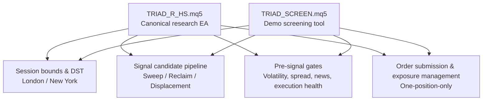
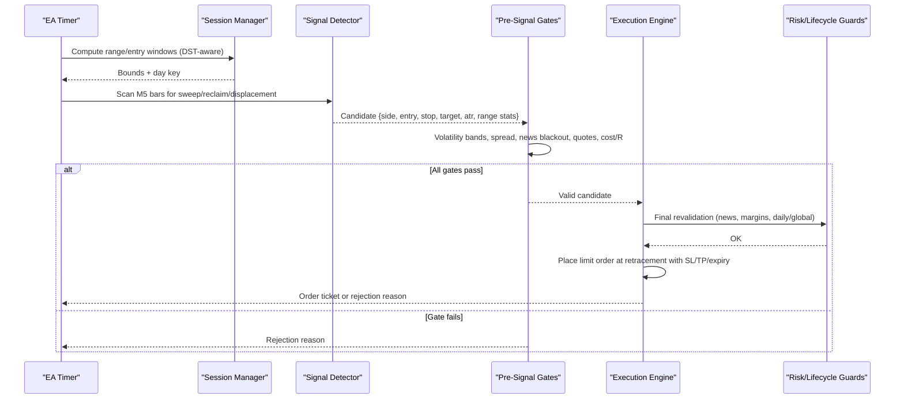
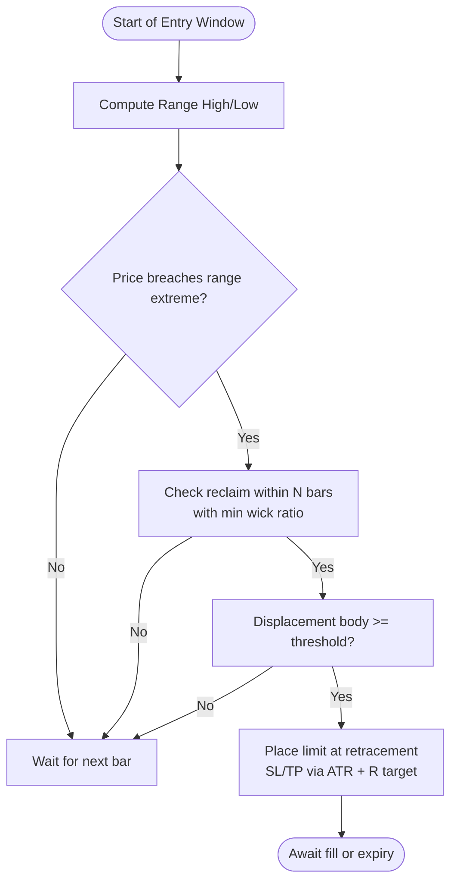
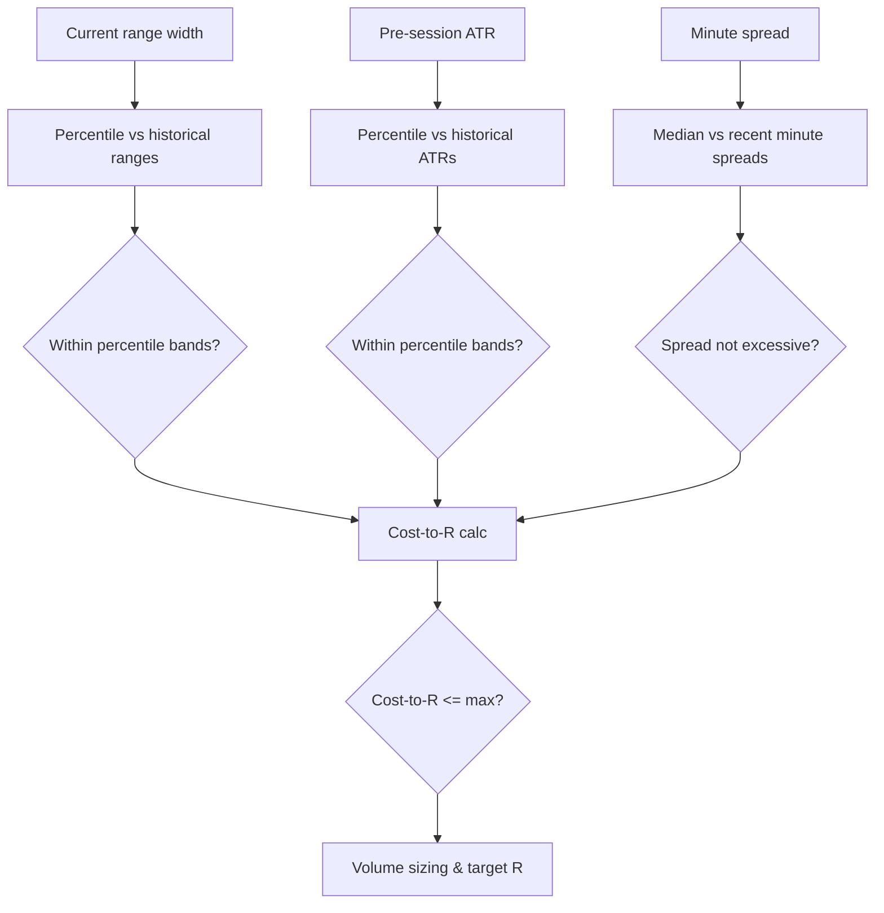
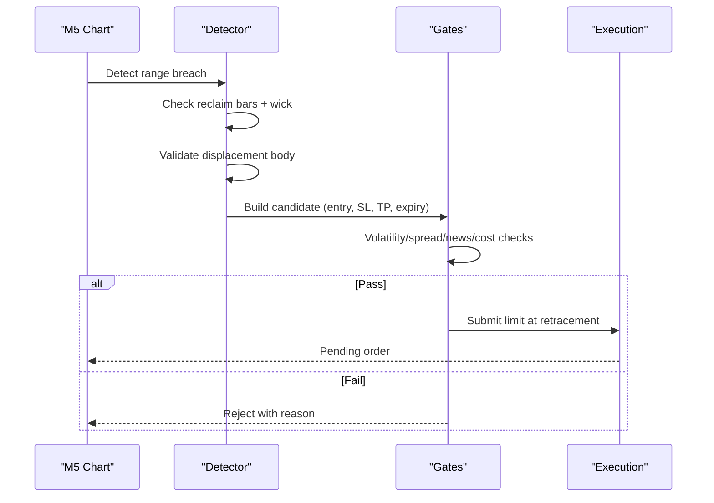
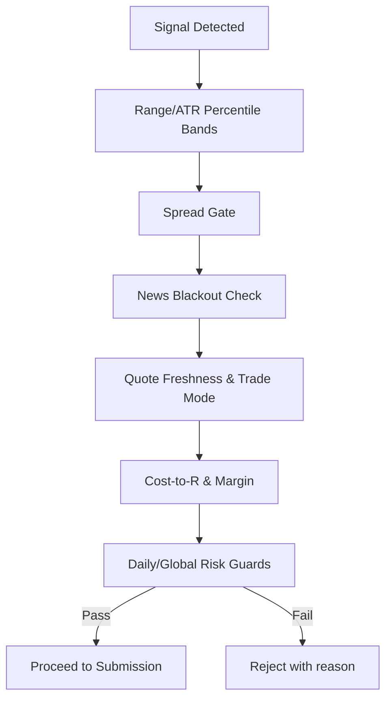
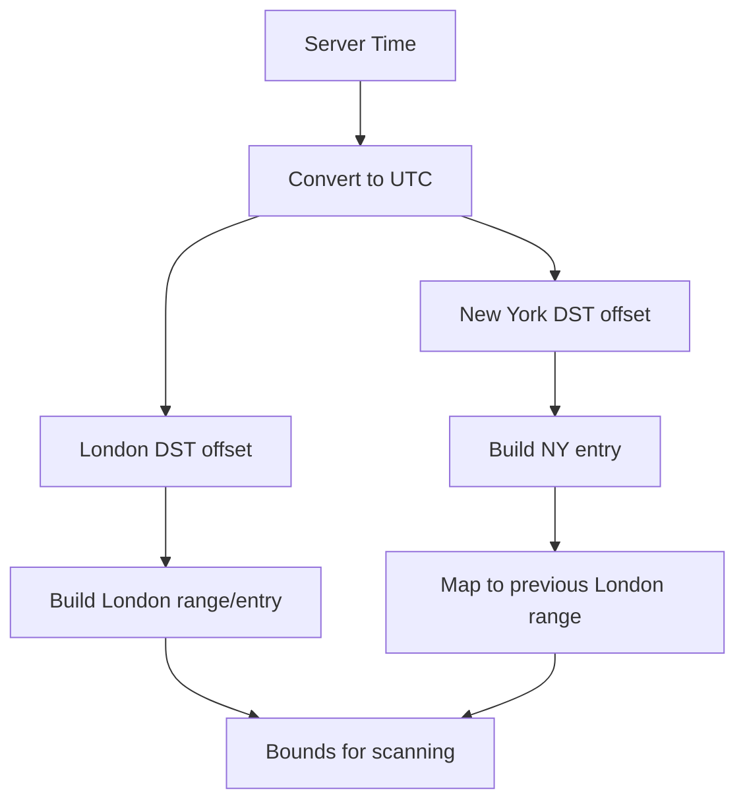
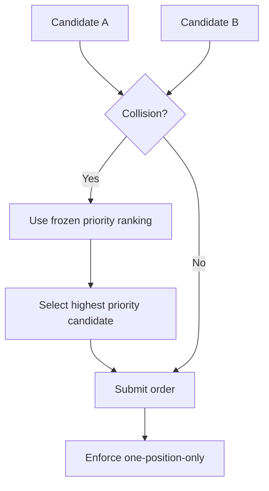
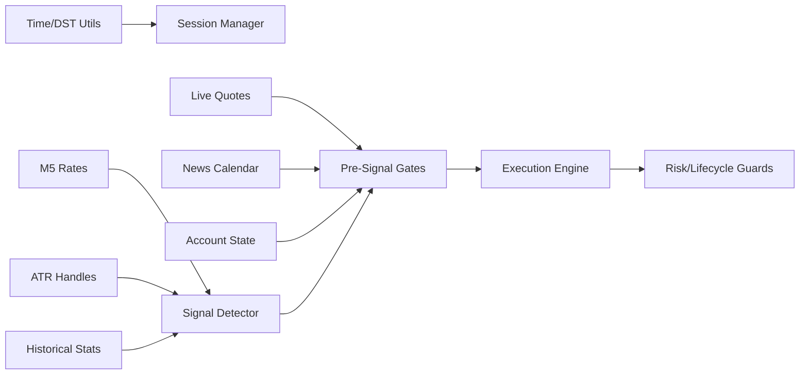

# Strategy Fundamentals

<cite>
**Referenced Files in This Document**
- [TRIAD_R_HS.mq5](file://MQL5/Experts/TRIAD_R_HS/TRIAD_R_HS.mq5)
- [TRIAD_SCREEN.mq5](file://MQL5/Experts/TRIAD_SCREEN/TRIAD_SCREEN.mq5)
- [README.md (TRIAD_R_HS)](file://MQL5/Experts/TRIAD_R_HS/README.md)
</cite>

## Table of Contents
1. Introduction
2. Project Structure
3. Core Components
4. Architecture Overview
5. Detailed Component Analysis
6. Dependency Analysis
7. Performance Considerations
8. Troubleshooting Guide
9. Conclusion

## Introduction
This section documents the TRIAD-R strategy fundamentals: the sweep/reclaim pattern recognition, session-based trading for London and New York sessions, signal detection math, entry sequence requirements, mandatory pre-signal gates, timezone-aware session definitions, and one-position-only rules with collision handling. The content is derived from the canonical research EA and its screening counterpart.

## Project Structure
The strategy is implemented as an MQL5 Expert Advisor with a companion demo-screening tool. Both share the same core logic for session windows, signal detection, and risk controls.

**Diagram sources**
- [TRIAD_R_HS.mq5:754-789](file://MQL5/Experts/TRIAD_R_HS/TRIAD_R_HS.mq5#L754-L789)
- [TRIAD_SCREEN.mq5:717-749](file://MQL5/Experts/TRIAD_SCREEN/TRIAD_SCREEN.mq5#L717-L749)
- [TRIAD_R_HS.mq5:2400-2521](file://MQL5/Experts/TRIAD_R_HS/TRIAD_R_HS.mq5#L2400-L2521)
- [TRIAD_R_HS.mq5:2692-2900](file://MQL5/Experts/TRIAD_R_HS/TRIAD_R_HS.mq5#L2692-L2900)

**Section sources**
- [TRIAD_R_HS.mq5:754-789](file://MQL5/Experts/TRIAD_R_HS/TRIAD_R_HS.mq5#L754-L789)
- [TRIAD_SCREEN.mq5:717-749](file://MQL5/Experts/TRIAD_SCREEN/TRIAD_SCREEN.mq5#L717-L749)

## Core Components
- Session manager: defines reference range and entry windows for London and New York with DST-aware time conversion.
- Signal detector: identifies sweep/reclaim/displacement on M5 bars and computes ATR/range percentiles and spread statistics.
- Pre-signal gatekeeper: enforces volatility bands, spread conditions, news blackout windows, quote freshness, cost-to-R, volume, margin, target room, and daily/global risk guards.
- Execution engine: places limit orders at retracement levels with expiry, validates plan persistence, and manages exposure under a strict one-position rule.
- Risk and lifecycle guards: internal daily/weekly stops, drawdown shutdowns, rollover/news flat rules, Friday flat, and phase/payout locks.

**Section sources**
- [TRIAD_R_HS.mq5:754-789](file://MQL5/Experts/TRIAD_R_HS/TRIAD_R_HS.mq5#L754-L789)
- [TRIAD_R_HS.mq5:1014-1084](file://MQL5/Experts/TRIAD_R_HS/TRIAD_R_HS.mq5#L1014-L1084)
- [TRIAD_R_HS.mq5:1160-1223](file://MQL5/Experts/TRIAD_R_HS/TRIAD_R_HS.mq5#L1160-L1223)
- [TRIAD_R_HS.mq5:2400-2521](file://MQL5/Experts/TRIAD_R_HS/TRIAD_R_HS.mq5#L2400-L2521)
- [TRIAD_R_HS.mq5:2692-2900](file://MQL5/Experts/TRIAD_R_HS/TRIAD_R_HS.mq5#L2692-L2900)

## Architecture Overview
The EA runs a timer-driven scan across configured symbols/sessions. For each active session:
- It builds the reference range and entry window using DST-aware civil time.
- It scans completed M5 bars to detect a sweep beyond the range followed by a reclaim candle with displacement.
- It computes regime filters (range percentile, ATR percentile), spread median, and cost-to-R.
- If all gates pass, it submits a limit order at the retracement level with SL/TP and expiry.
- Exposure management enforces one-position-only, visible exits, news/rollover flats, and session-end exits.

**Diagram sources**
- [TRIAD_R_HS.mq5:754-789](file://MQL5/Experts/TRIAD_R_HS/TRIAD_R_HS.mq5#L754-L789)
- [TRIAD_R_HS.mq5:1160-1223](file://MQL5/Experts/TRIAD_R_HS/TRIAD_R_HS.mq5#L1160-L1223)
- [TRIAD_R_HS.mq5:2400-2521](file://MQL5/Experts/TRIAD_R_HS/TRIAD_R_HS.mq5#L2400-L2521)
- [TRIAD_R_HS.mq5:2692-2900](file://MQL5/Experts/TRIAD_R_HS/TRIAD_R_HS.mq5#L2692-L2900)

## Detailed Component Analysis

### Sweep/Reclaim Pattern Recognition Logic
- Reference range: High/Low over the defined range window per session.
- Sweep: Price breaches the range extreme within the entry window.
- Reclaim: Within a fixed number of M5 bars after the sweep, price closes back inside the range with a minimum wick ratio relative to the bar.
- Displacement: The reclaim bar must have a body size threshold confirming momentum back into the range.
- Entry placement: Limit order placed at a retracement level derived from the reclaim geometry; SL and TP are computed with ATR buffers and R targets.

**Diagram sources**
- [TRIAD_R_HS.mq5:1014-1084](file://MQL5/Experts/TRIAD_R_HS/TRIAD_R_HS.mq5#L1014-L1084)
- [TRIAD_R_HS.mq5:2400-2521](file://MQL5/Experts/TRIAD_R_HS/TRIAD_R_HS.mq5#L2400-L2521)

**Section sources**
- [TRIAD_R_HS.mq5:1014-1084](file://MQL5/Experts/TRIAD_R_HS/TRIAD_R_HS.mq5#L1014-L1084)
- [TRIAD_R_HS.mq5:2400-2521](file://MQL5/Experts/TRIAD_R_HS/TRIAD_R_HS.mq5#L2400-L2521)

### Mathematical Foundation of Signal Detection
- Range percentile: Current session range width compared to a rolling history of comparable sessions to ensure typical volatility context.
- ATR percentile: Pre-session ATR compared to historical ATR values to confirm regime suitability.
- Spread median: Minute-of-session spread median used to reject wide spreads relative to recent norms.
- Cost-to-R: Includes spread, slippage reserves, and commission converted to R units to cap total transaction costs.
- Volume sizing: Full-all-in sizing based on cash risk budget and symbol tick value, rounded to lot step constraints.

**Diagram sources**
- [TRIAD_R_HS.mq5:1160-1223](file://MQL5/Experts/TRIAD_R_HS/TRIAD_R_HS.mq5#L1160-L1223)
- [TRIAD_R_HS.mq5:2400-2521](file://MQL5/Experts/TRIAD_R_HS/TRIAD_R_HS.mq5#L2400-L2521)

**Section sources**
- [TRIAD_R_HS.mq5:1160-1223](file://MQL5/Experts/TRIAD_R_HS/TRIAD_R_HS.mq5#L1160-L1223)
- [TRIAD_R_HS.mq5:2400-2521](file://MQL5/Experts/TRIAD_R_HS/TRIAD_R_HS.mq5#L2400-L2521)

### Entry Sequence Requirements
- Reference range breach: Must occur during the session’s entry window.
- Reclaim candle criteria: Must close back inside the range within a fixed number of bars with a minimum wick proportion.
- Displacement validation: Body size must meet the configured minimum to confirm directional follow-through.
- Limit order placement: Placed at a retracement level derived from the reclaim structure, with explicit SL/TP and time expiry.

**Diagram sources**
- [TRIAD_R_HS.mq5:2400-2521](file://MQL5/Experts/TRIAD_R_HS/TRIAD_R_HS.mq5#L2400-L2521)
- [TRIAD_R_HS.mq5:2692-2900](file://MQL5/Experts/TRIAD_R_HS/TRIAD_R_HS.mq5#L2692-L2900)

**Section sources**
- [TRIAD_R_HS.mq5:2400-2521](file://MQL5/Experts/TRIAD_R_HS/TRIAD_R_HS.mq5#L2400-L2521)
- [TRIAD_R_HS.mq5:2692-2900](file://MQL5/Experts/TRIAD_R_HS/TRIAD_R_HS.mq5#L2692-L2900)

### Mandatory Pre-Signal Gates
- Volatility filters: Range and ATR percentile bands must be within allowed thresholds.
- Spread conditions: Current spread must not exceed a multiple of the minute-of-session median spread.
- News blackout: No entries within a configured window before/after relevant high-impact events for the pair’s currencies.
- Execution health: Fresh quotes, full trade mode, broker distances valid, cost-to-R within limits, sufficient margin, target room available, and daily/global risk guards allow entry.

**Diagram sources**
- [TRIAD_R_HS.mq5:2400-2521](file://MQL5/Experts/TRIAD_R_HS/TRIAD_R_HS.mq5#L2400-L2521)

**Section sources**
- [TRIAD_R_HS.mq5:2400-2521](file://MQL5/Experts/TRIAD_R_HS/TRIAD_R_HS.mq5#L2400-L2521)

### Session Definitions and Timezone Awareness
- London sessions (EURUSD/GBPUSD):
  - Reference range: 00:00–07:00 Europe/London
  - Entry window: 07:00–11:00 Europe/London
- New York sessions (USDJPY):
  - Entry window: 08:30–11:00 America/New_York
  - Reference range: Previous London day 07:00–13:00 Europe/London
- DST awareness: Offsets are computed using UK and US DST rules against UTC, then converted to server time using the configured expected server offset.

**Diagram sources**
- [TRIAD_R_HS.mq5:663-701](file://MQL5/Experts/TRIAD_R_HS/TRIAD_R_HS.mq5#L663-L701)
- [TRIAD_R_HS.mq5:754-789](file://MQL5/Experts/TRIAD_R_HS/TRIAD_R_HS.mq5#L754-L789)
- [TRIAD_SCREEN.mq5:621-651](file://MQL5/Experts/TRIAD_SCREEN/TRIAD_SCREEN.mq5#L621-L651)
- [TRIAD_SCREEN.mq5:717-749](file://MQL5/Experts/TRIAD_SCREEN/TRIAD_SCREEN.mq5#L717-L749)

**Section sources**
- [TRIAD_R_HS.mq5:663-701](file://MQL5/Experts/TRIAD_R_HS/TRIAD_R_HS.mq5#L663-L701)
- [TRIAD_R_HS.mq5:754-789](file://MQL5/Experts/TRIAD_R_HS/TRIAD_R_HS.mq5#L754-L789)
- [TRIAD_SCREEN.mq5:621-651](file://MQL5/Experts/TRIAD_SCREEN/TRIAD_SCREEN.mq5#L621-L651)
- [TRIAD_SCREEN.mq5:717-749](file://MQL5/Experts/TRIAD_SCREEN/TRIAD_SCREEN.mq5#L717-L749)

### One-Position-Only Rule and Collision Handling
- One-position-only: At most one own pending order or one own position at any time. Violations trigger immediate cleanup (cancel/close).
- Collision handling: When multiple sessions produce candidates, the system uses predefined combination priorities to select which candidate proceeds; others are routed away. Priorities are frozen and included in the configuration hash.

**Diagram sources**
- [TRIAD_R_HS.mq5:2692-2900](file://MQL5/Experts/TRIAD_R_HS/TRIAD_R_HS.mq5#L2692-L2900)
- [TRIAD_R_HS.mq5:2970-2976](file://MQL5/Experts/TRIAD_R_HS/TRIAD_R_HS.mq5#L2970-L2976)

**Section sources**
- [TRIAD_R_HS.mq5:2692-2900](file://MQL5/Experts/TRIAD_R_HS/TRIAD_R_HS.mq5#L2692-L2900)
- [TRIAD_R_HS.mq5:2970-2976](file://MQL5/Experts/TRIAD_R_HS/TRIAD_R_HS.mq5#L2970-L2976)

### Practical Examples of Valid and Invalid Signals
- Valid long example:
  - During London entry window, price sweeps below the range low, then closes back above the low within three bars with a strong lower wick and a bullish body exceeding the displacement threshold. Range and ATR percentiles are within bands, spread is normal, no news event within blackout, cost-to-R acceptable, and risk guards allow entry. A buy limit is placed at the retracement level with SL below the swing low and TP at the configured R target.
- Invalid short example:
  - Price briefly breaks the range high but fails to reclaim within the allowed bars, or the reclaim bar lacks sufficient wick/body, or spread spikes above the median threshold, or a RED/HIGH USD/JPY event falls within the blackout window, or cost-to-R exceeds the maximum. The candidate is rejected with the corresponding reason.

[No sources needed since this section provides conceptual examples grounded in documented rules]

## Dependency Analysis
Key dependencies and interactions:
- Session manager depends on DST-aware time utilities to compute range/entry windows.
- Signal detector depends on M5 rates, ATR handles, and historical statistics to validate regime.
- Pre-signal gates depend on live quotes, news calendar, and account state.
- Execution engine depends on validated candidates and risk/lifecycle guards to place and manage orders.

**Diagram sources**
- [TRIAD_R_HS.mq5:663-701](file://MQL5/Experts/TRIAD_R_HS/TRIAD_R_HS.mq5#L663-L701)
- [TRIAD_R_HS.mq5:1014-1084](file://MQL5/Experts/TRIAD_R_HS/TRIAD_R_HS.mq5#L1014-L1084)
- [TRIAD_R_HS.mq5:1160-1223](file://MQL5/Experts/TRIAD_R_HS/TRIAD_R_HS.mq5#L1160-L1223)
- [TRIAD_R_HS.mq5:2400-2521](file://MQL5/Experts/TRIAD_R_HS/TRIAD_R_HS.mq5#L2400-L2521)
- [TRIAD_R_HS.mq5:2692-2900](file://MQL5/Experts/TRIAD_R_HS/TRIAD_R_HS.mq5#L2692-L2900)

**Section sources**
- [TRIAD_R_HS.mq5:1014-1084](file://MQL5/Experts/TRIAD_R_HS/TRIAD_R_HS.mq5#L1014-L1084)
- [TRIAD_R_HS.mq5:1160-1223](file://MQL5/Experts/TRIAD_R_HS/TRIAD_R_HS.mq5#L1160-L1223)
- [TRIAD_R_HS.mq5:2400-2521](file://MQL5/Experts/TRIAD_R_HS/TRIAD_R_HS.mq5#L2400-L2521)
- [TRIAD_R_HS.mq5:2692-2900](file://MQL5/Experts/TRIAD_R_HS/TRIAD_R_HS.mq5#L2692-L2900)

## Performance Considerations
- Use completed M5 bars only for range and signal detection to avoid repainting.
- Cache ATR handles per session and reuse them to minimize indicator overhead.
- Restrict spread sampling to minute-of-session matches to reduce noise and improve percentile accuracy.
- Limit history scans to the configured number of comparable sessions to keep runtime bounded.
- Throttle non-emergency requests and enforce latency caps to prevent overload.

[No sources needed since this section provides general guidance]

## Troubleshooting Guide
Common rejection reasons and their implications:
- news_blackout: A relevant RED/HIGH event is too close; wait until the blackout window passes.
- spread_gate: Current spread exceeds the median threshold; avoid trading during illiquid periods.
- range_percentile / atr_percentile: Regime outside acceptable bands; skip until volatility aligns.
- cost_to_r: Transaction costs exceed the maximum; consider wider stops or different sessions.
- quote_stale / symbol_not_full_trade_mode: Market data or trading mode issues; verify connectivity and symbol capabilities.
- target_room: Insufficient space between entry and range extremes to fit the target; adjust expectations or skip.
- daily_state_recheck / global_risk_recheck: Daily or firm-level risk guards blocked entry; review drawdown and floor status.

Operational safeguards:
- One-position-only enforcement ensures no overlapping exposure.
- News blackout and rollover flats protect against unpredictable liquidity shifts.
- Persisted trade plans and visible exit verification prevent drift and unauthorized modifications.

**Section sources**
- [TRIAD_R_HS.mq5:2400-2521](file://MQL5/Experts/TRIAD_R_HS/TRIAD_R_HS.mq5#L2400-L2521)
- [TRIAD_R_HS.mq5:2970-2976](file://MQL5/Experts/TRIAD_R_HS/TRIAD_R_HS.mq5#L2970-L2976)
- [TRIAD_R_HS.mq5:2996-3064](file://MQL5/Experts/TRIAD_R_HS/TRIAD_R_HS.mq5#L2996-L3064)

## Conclusion
The TRIAD-R strategy centers on a disciplined sweep/reclaim pattern within well-defined London and New York sessions, backed by statistical regime filters and robust pre-signal gates. Entries are executed as timed limit orders at retracement levels with strict risk controls, visibility checks, and a one-position-only invariant. Timezone-aware session boundaries and DST handling ensure consistent behavior across markets. The framework emphasizes fail-closed operation, auditability, and resilience to market and operational anomalies.

[No sources needed since this section summarizes without analyzing specific files]