# System Architecture

<cite>
**Referenced Files in This Document**
- [TRIAD_R_HS.mq5](file://MQL5/Experts/TRIAD_R_HS/TRIAD_R_HS.mq5)
- [TRIAD_SCREEN.mq5](file://MQL5/Experts/TRIAD_SCREEN/TRIAD_SCREEN.mq5)
- [triad_v2_1_registry.json](file://validation/triad_v2_1_registry.json)
- [triad_v2_2_ablation_registry.json](file://validation/triad_v2_2_ablation_registry.json)
- [triad_validation.py](file://tools/triad_validation.py)
- [THE5ERS-CHALLENGE-STRATEGY-V2.md](file://THE5ERS-CHALLENGE-STRATEGY-V2.md)
</cite>

## Table of Contents
1. [Introduction](#introduction)
2. [Project Structure](#project-structure)
3. [Core Components](#core-components)
4. [Architecture Overview](#architecture-overview)
5. [Detailed Component Analysis](#detailed-component-analysis)
6. [Dependency Analysis](#dependency-analysis)
7. [Performance Considerations](#performance-considerations)
8. [Troubleshooting Guide](#troubleshooting-guide)
9. [Conclusion](#conclusion)

## Introduction
This document describes the TRIAD-R system architecture, a hybrid design that pairs MQL5 Expert Advisors for production execution with Python-based research tools for optimization and validation. The production EA enforces a fail-closed safety model with mandatory gates, emergency halt mechanisms, and audit logging. A Python validation framework consumes replay exports, validates them against frozen JSON registries, and selects configurations using statistically sound procedures. The system separates concerns into session management, signal detection, risk assessment, order execution, and compliance monitoring, while sharing validated rules across both environments.

## Project Structure
The repository is organized into:
- MQL5 Experts: Production EAs for live trading and demo screening.
- Validation: JSON registries defining candidate configurations and ablation study plans.
- Tools: Python scripts for registry generation, replay validation, and ablation evaluation.
- Strategy specification: Canonical rule set governing entry, risk, exits, and compliance.

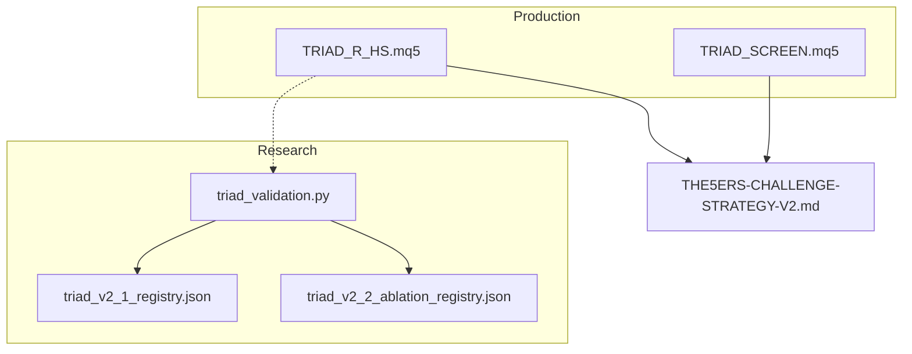

**Diagram sources**
- [TRIAD_R_HS.mq5:1-100](file://MQL5/Experts/TRIAD_R_HS/TRIAD_R_HS.mq5#L1-L100)
- [TRIAD_SCREEN.mq5:1-100](file://MQL5/Experts/TRIAD_SCREEN/TRIAD_SCREEN.mq5#L1-L100)
- [triad_v2_1_registry.json:1-120](file://validation/triad_v2_1_registry.json#L1-L120)
- [triad_v2_2_ablation_registry.json:1-120](file://validation/triad_v2_2_ablation_registry.json#L1-L120)
- [triad_validation.py:1-120](file://tools/triad_validation.py#L1-L120)
- [THE5ERS-CHALLENGE-STRATEGY-V2.md:1-120](file://THE5ERS-CHALLENGE-STRATEGY-V2.md#L1-L120)

**Section sources**
- [TRIAD_R_HS.mq5:1-120](file://MQL5/Experts/TRIAD_R_HS/TRIAD_R_HS.mq5#L1-L120)
- [TRIAD_SCREEN.mq5:1-120](file://MQL5/Experts/TRIAD_SCREEN/TRIAD_SCREEN.mq5#L1-L120)
- [triad_v2_1_registry.json:1-120](file://validation/triad_v2_1_registry.json#L1-L120)
- [triad_v2_2_ablation_registry.json:1-120](file://validation/triad_v2_2_ablation_registry.json#L1-L120)
- [triad_validation.py:1-120](file://tools/triad_validation.py#L1-L120)
- [THE5ERS-CHALLENGE-STRATEGY-V2.md:1-120](file://THE5ERS-CHALLENGE-STRATEGY-V2.md#L1-L120)

## Core Components
- Session Management: Computes London and New York session windows, range boundaries, and entry windows with DST-aware civil time conversion.
- Signal Detection: Implements sweep/reclaim/displacement pattern recognition on M5 bars with strict rejection reasons.
- Risk Engine: Calculates stop distance, cash risk, all-in costs, and applies drawdown and daily/weekly limits.
- Order Execution: Places one-position limit orders with visible stops/targets, enforces plan reconciliation, and cancels expired or invalid orders.
- Compliance Monitoring: Enforces news blackout, quote freshness, spread/cost thresholds, request rate caps, and account identity checks.
- State Machine: Governs daily operating states to constrain number and profitability of trades per day.
- Configuration Management: Uses JSON registries with hashing to freeze and validate configuration sets; runtime hashes detect changes.

**Section sources**
- [TRIAD_R_HS.mq5:150-260](file://MQL5/Experts/TRIAD_R_HS/TRIAD_R_HS.mq5#L150-L260)
- [TRIAD_SCREEN.mq5:150-260](file://MQL5/Experts/TRIAD_SCREEN/TRIAD_SCREEN.mq5#L150-L260)
- [triad_v2_1_registry.json:1-120](file://validation/triad_v2_1_registry.json#L1-L120)
- [triad_v2_2_ablation_registry.json:1-120](file://validation/triad_v2_2_ablation_registry.json#L1-L120)
- [triad_validation.py:230-340](file://tools/triad_validation.py#L230-L340)
- [THE5ERS-CHALLENGE-STRATEGY-V2.md:54-183](file://THE5ERS-CHALLENGE-STRATEGY-V2.md#L54-L183)

## Architecture Overview
The system integrates market data ingestion, signal processing, risk assessment, and order execution within the MQL5 environment, while Python tools perform offline validation and selection.

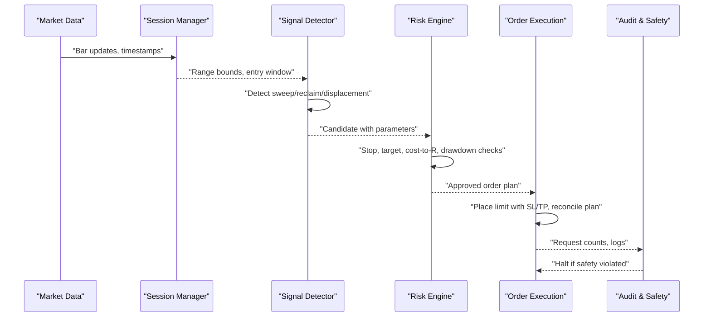

**Diagram sources**
- [TRIAD_R_HS.mq5:1980-2120](file://MQL5/Experts/TRIAD_R_HS/TRIAD_R_HS.mq5#L1980-L2120)
- [TRIAD_R_HS.mq5:3000-3200](file://MQL5/Experts/TRIAD_R_HS/TRIAD_R_HS.mq5#L3000-L3200)
- [TRIAD_R_HS.mq5:2520-2560](file://MQL5/Experts/TRIAD_R_HS/TRIAD_R_HS.mq5#L2520-L2560)

## Detailed Component Analysis

### Session Management
- Computes UTC-aware London and New York sessions, including DST transitions.
- Derives reference range start/end and entry windows per symbol/session.
- Tracks completed ranges and consumption flags to avoid mid-session reconstruction.

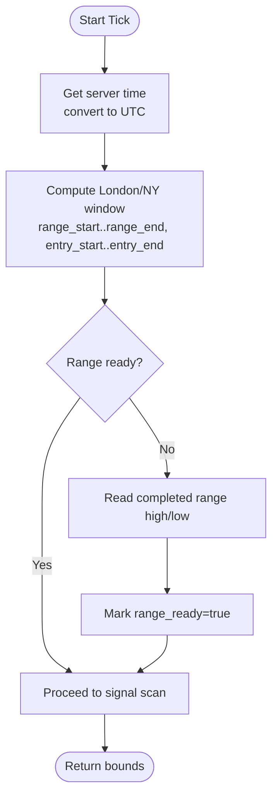

**Diagram sources**
- [TRIAD_R_HS.mq5:624-789](file://MQL5/Experts/TRIAD_R_HS/TRIAD_R_HS.mq5#L624-L789)
- [TRIAD_SCREEN.mq5:583-749](file://MQL5/Experts/TRIAD_SCREEN/TRIAD_SCREEN.mq5#L583-L749)

**Section sources**
- [TRIAD_R_HS.mq5:624-789](file://MQL5/Experts/TRIAD_R_HS/TRIAD_R_HS.mq5#L624-L789)
- [TRIAD_SCREEN.mq5:583-749](file://MQL5/Experts/TRIAD_SCREEN/TRIAD_SCREEN.mq5#L583-L749)

### Signal Detection
- Detects sweep beyond reference low/high within ATR bands.
- Validates reclaim within three bars with minimum wick ratio.
- Confirms displacement body size and direction relative to midpoint.
- Produces structured candidates with explicit rejection reasons.

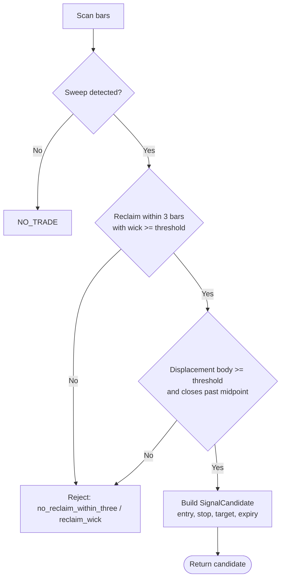

**Diagram sources**
- [TRIAD_R_HS.mq5:1980-2120](file://MQL5/Experts/TRIAD_R_HS/TRIAD_R_HS.mq5#L1980-L2120)

**Section sources**
- [TRIAD_R_HS.mq5:1980-2120](file://MQL5/Experts/TRIAD_R_HS/TRIAD_R_HS.mq5#L1980-L2120)

### Risk Engine
- Stop distance computed from ATR with min/max bounds.
- Cash risk derived from all-in loss including commission and slippage reserves.
- Applies internal daily/weekly stops and drawdown tiers.
- Validates broker distances (stops/freeze levels) and cost-to-R thresholds.

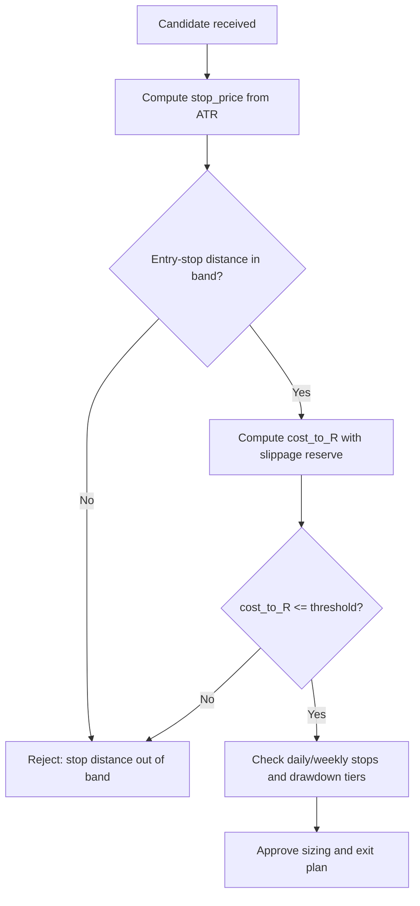

**Diagram sources**
- [TRIAD_R_HS.mq5:2154-2200](file://MQL5/Experts/TRIAD_R_HS/TRIAD_R_HS.mq5#L2154-L2200)
- [THE5ERS-CHALLENGE-STRATEGY-V2.md:117-183](file://THE5ERS-CHALLENGE-STRATEGY-V2.md#L117-L183)

**Section sources**
- [TRIAD_R_HS.mq5:2154-2200](file://MQL5/Experts/TRIAD_R_HS/TRIAD_R_HS.mq5#L2154-L2200)
- [THE5ERS-CHALLENGE-STRATEGY-V2.md:117-183](file://THE5ERS-CHALLENGE-STRATEGY-V2.md#L117-L183)

### Order Execution and Plan Reconciliation
- Places one-position limit orders with visible stop and target.
- On restart, reconciles pending orders and positions against expected trade plans.
- Deletes mismatched or expired orders; halts strategy on critical mismatches.
- Enforces pre-news flat, rollover flat, Friday flat, and session-end flat.

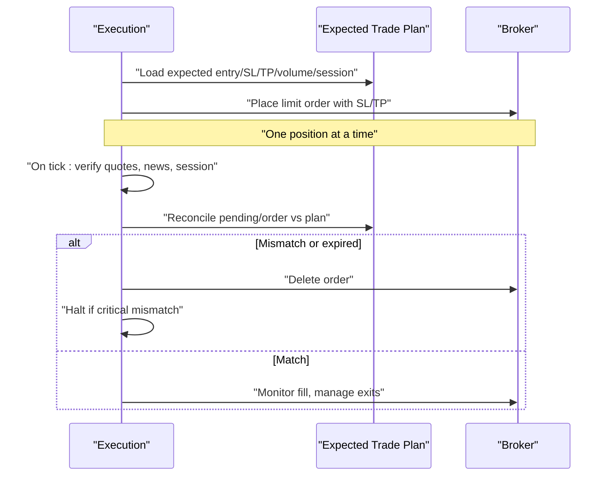

**Diagram sources**
- [TRIAD_R_HS.mq5:3000-3200](file://MQL5/Experts/TRIAD_R_HS/TRIAD_R_HS.mq5#L3000-L3200)

**Section sources**
- [TRIAD_R_HS.mq5:3000-3200](file://MQL5/Experts/TRIAD_R_HS/TRIAD_R_HS.mq5#L3000-L3200)

### Daily Operating States (State Machine)
The daily state machine constrains how many trades can occur and under what conditions:
- DAY_READY: Start-of-day state allowing first trade.
- FIRST_TRADE: After first trade completes; if net positive, day locks.
- NET_POSITIVE: First trade profit triggers day lock; no second trade.
- SECOND_ELIGIBLE_IF_SAFE: If first trade non-positive, second trade allowed subject to safety checks.
- SECOND_TRADE: Second trade executed; after completion, day locks.
- DAY_LOCKED: No further entries until next day rollover.

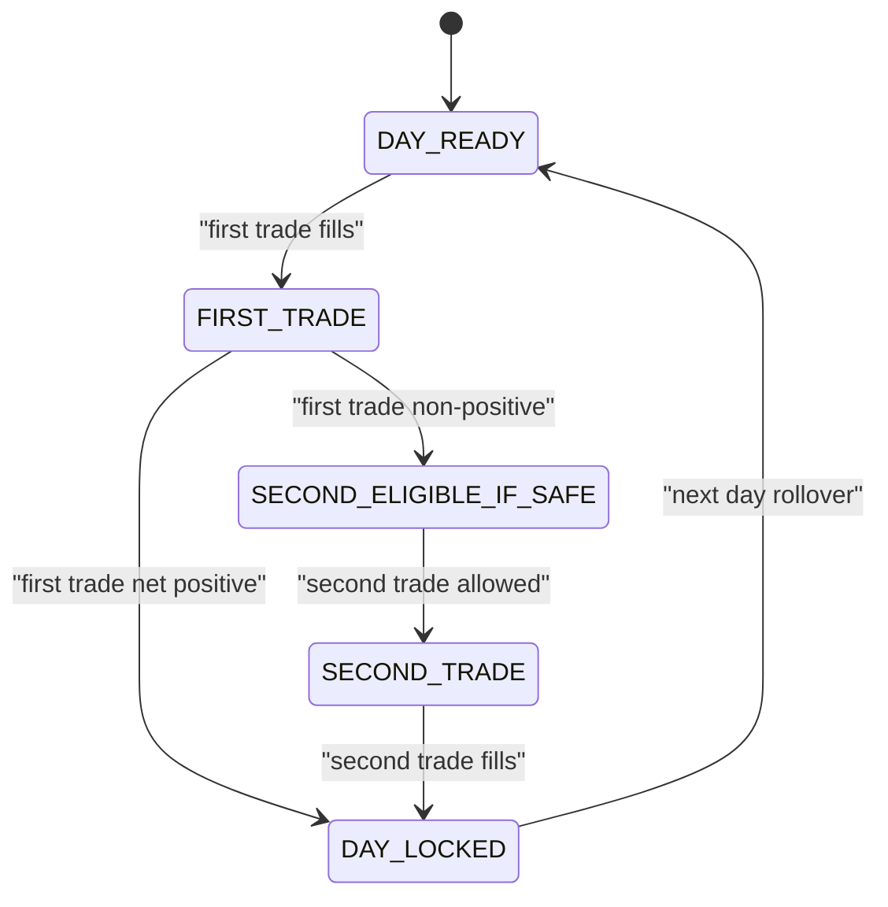

**Diagram sources**
- [TRIAD_SCREEN.mq5:1949-1976](file://MQL5/Experts/TRIAD_SCREEN/TRIAD_SCREEN.mq5#L1949-L1976)
- [test_reference.py:85-100](file://tests/test_reference.py#L85-L100)

**Section sources**
- [TRIAD_SCREEN.mq5:1949-1976](file://MQL5/Experts/TRIAD_SCREEN/TRIAD_SCREEN.mq5#L1949-L1976)
- [test_reference.py:85-100](file://tests/test_reference.py#L85-L100)

### Fail-Closed Safety Design
- Mandatory Gates: Pre-signal checks include enabled combination, no exposure, range/ATR percentiles, spread/cost limits, news blackout, quote freshness, execution health, stop/target validity, volume tier, target fit, and projected stressed loss above floors.
- Emergency Halt Mechanisms: Persistent halt latches with signatures bind configuration and identity; any mismatch fails closed. Instance locks prevent duplicate live instances; heartbeat failures fence stale instances.
- Audit Logging: Every event logged to CSV with balance/equity/request counters; log failures trigger halts.

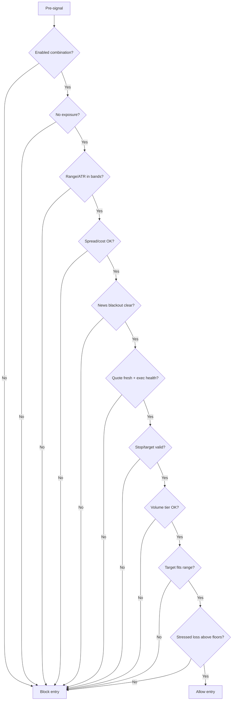

**Diagram sources**
- [THE5ERS-CHALLENGE-STRATEGY-V2.md:74-92](file://THE5ERS-CHALLENGE-STRATEGY-V2.md#L74-L92)
- [TRIAD_R_HS.mq5:1772-1805](file://MQL5/Experts/TRIAD_R_HS/TRIAD_R_HS.mq5#L1772-L1805)

**Section sources**
- [THE5ERS-CHALLENGE-STRATEGY-V2.md:74-92](file://THE5ERS-CHALLENGE-STRATEGY-V2.md#L74-L92)
- [TRIAD_R_HS.mq5:1772-1805](file://MQL5/Experts/TRIAD_R_HS/TRIAD_R_HS.mq5#L1772-L1805)

### Configuration Management with JSON Registries and Hashing
- Frozen registries define candidate configurations and ablation studies with SHA-256 checksums to detect changes.
- Runtime config hash binds behavior to configuration; identity hash binds to account/server/product/phase.
- State persistence includes signature verification; partial writes are rejected.

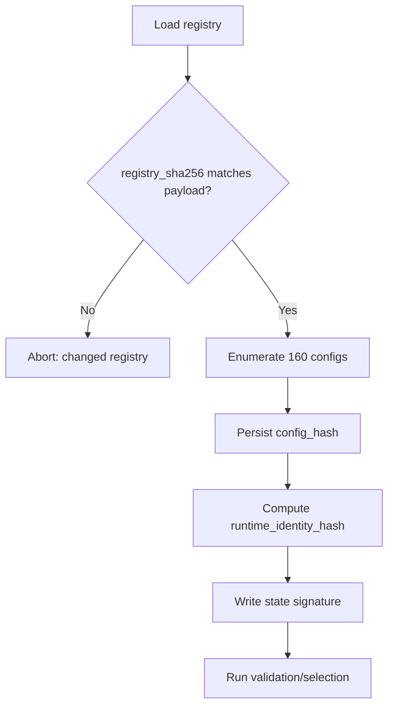

**Diagram sources**
- [triad_validation.py:270-331](file://tools/triad_validation.py#L270-L331)
- [triad_v2_1_registry.json:1-120](file://validation/triad_v2_1_registry.json#L1-L120)
- [triad_v2_2_ablation_registry.json:1-120](file://validation/triad_v2_2_ablation_registry.json#L1-L120)
- [TRIAD_R_HS.mq5:364-428](file://MQL5/Experts/TRIAD_R_HS/TRIAD_R_HS.mq5#L364-L428)

**Section sources**
- [triad_validation.py:270-331](file://tools/triad_validation.py#L270-L331)
- [triad_v2_1_registry.json:1-120](file://validation/triad_v2_1_registry.json#L1-L120)
- [triad_v2_2_ablation_registry.json:1-120](file://validation/triad_v2_2_ablation_registry.json#L1-L120)
- [TRIAD_R_HS.mq5:364-428](file://MQL5/Experts/TRIAD_R_HS/TRIAD_R_HS.mq5#L364-L428)

### Integration Patterns Between Production EAs and Research Tools
- Shared validation frameworks: Python validator enforces schema, coverage, and selection rules; EAs implement identical logic for signals, risk, and exits.
- Replay exports: Event-level CSV rows produced by tick/bid-ask replay feed the validator; EAs produce comparable events during live/demo runs.
- Registry-driven configuration: Both environments use frozen registries to ensure consistency between research and production.

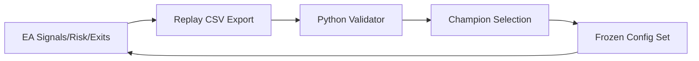

**Diagram sources**
- [triad_validation.py:1-120](file://tools/triad_validation.py#L1-L120)
- [triad_v2_1_registry.json:1-120](file://validation/triad_v2_1_registry.json#L1-L120)
- [triad_v2_2_ablation_registry.json:1-120](file://validation/triad_v2_2_ablation_registry.json#L1-L120)

**Section sources**
- [triad_validation.py:1-120](file://tools/triad_validation.py#L1-L120)
- [triad_v2_1_registry.json:1-120](file://validation/triad_v2_1_registry.json#L1-L120)
- [triad_v2_2_ablation_registry.json:1-120](file://validation/triad_v2_2_ablation_registry.json#L1-L120)

## Dependency Analysis
- MQL5 EAs depend on MT5 market data, calendar, and account APIs; they also depend on global variables for state persistence and instance locking.
- Python validation depends on CSV replay exports and JSON registries; it does not submit orders.
- Specification drives both environments; deviations require re-validation.

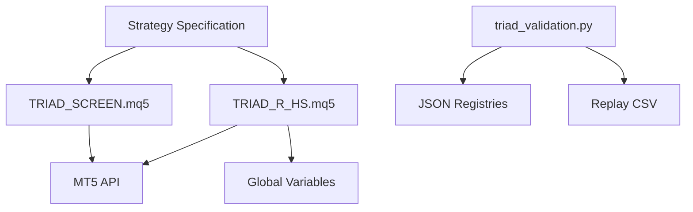

**Diagram sources**
- [TRIAD_R_HS.mq5:1-120](file://MQL5/Experts/TRIAD_R_HS/TRIAD_R_HS.mq5#L1-L120)
- [TRIAD_SCREEN.mq5:1-120](file://MQL5/Experts/TRIAD_SCREEN/TRIAD_SCREEN.mq5#L1-L120)
- [triad_validation.py:1-120](file://tools/triad_validation.py#L1-L120)
- [triad_v2_1_registry.json:1-120](file://validation/triad_v2_1_registry.json#L1-L120)
- [triad_v2_2_ablation_registry.json:1-120](file://validation/triad_v2_2_ablation_registry.json#L1-L120)
- [THE5ERS-CHALLENGE-STRATEGY-V2.md:1-120](file://THE5ERS-CHALLENGE-STRATEGY-V2.md#L1-L120)

**Section sources**
- [TRIAD_R_HS.mq5:1-120](file://MQL5/Experts/TRIAD_R_HS/TRIAD_R_HS.mq5#L1-L120)
- [TRIAD_SCREEN.mq5:1-120](file://MQL5/Experts/TRIAD_SCREEN/TRIAD_SCREEN.mq5#L1-L120)
- [triad_validation.py:1-120](file://tools/triad_validation.py#L1-L120)
- [triad_v2_1_registry.json:1-120](file://validation/triad_v2_1_registry.json#L1-L120)
- [triad_v2_2_ablation_registry.json:1-120](file://validation/triad_v2_2_ablation_registry.json#L1-L120)
- [THE5ERS-CHALLENGE-STRATEGY-V2.md:1-120](file://THE5ERS-CHALLENGE-STRATEGY-V2.md#L1-L120)

## Performance Considerations
- Request throttling: Non-emergency trade requests capped per day; exceeding cap halts new entries but never suppresses emergency actions.
- Quote freshness and latency bounds: Prevent stale data usage; enforce maximum quote age and deviation thresholds.
- Efficient session/window computation: Cached range readiness avoids repeated reads; only read completed ranges after session end.
- Minimal logging overhead: Audit logs append-only with failure handling; verbose logging configurable.

[No sources needed since this section provides general guidance]

## Troubleshooting Guide
Common issues and resolutions:
- Audit log open/write failures: Strategy halts to prevent unmonitored operation; resolve file permissions and disk space.
- Duplicate live instance detected: Another chart holds the instance lock; stop redundant instances or recover stale lock.
- Pending order plan mismatch: Delete mismatched orders; investigate external modifications or terminal crashes.
- Missing visible stop/target: Repair via safety request; if unrepaired, close position and halt.
- News blackout inactivity streak: Monitor consecutive blocked days; adjust calendar coverage or alert thresholds.

**Section sources**
- [TRIAD_R_HS.mq5:299-327](file://MQL5/Experts/TRIAD_R_HS/TRIAD_R_HS.mq5#L299-L327)
- [TRIAD_R_HS.mq5:494-554](file://MQL5/Experts/TRIAD_R_HS/TRIAD_R_HS.mq5#L494-L554)
- [TRIAD_R_HS.mq5:3000-3200](file://MQL5/Experts/TRIAD_R_HS/TRIAD_R_HS.mq5#L3000-L3200)

## Conclusion
TRIAD-R combines robust production-grade MQL5 EAs with rigorous Python-based validation to ensure safe, auditable, and statistically sound trading operations. Its modular architecture isolates session management, signal detection, risk assessment, execution, and compliance, while its fail-closed design and persistent state protect against misconfiguration and operational anomalies. The shared validation framework ensures alignment between research and production, enabling confident deployment and continuous improvement through ablation studies and champion selection.

[No sources needed since this section summarizes without analyzing specific files]