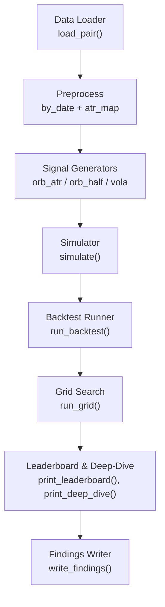
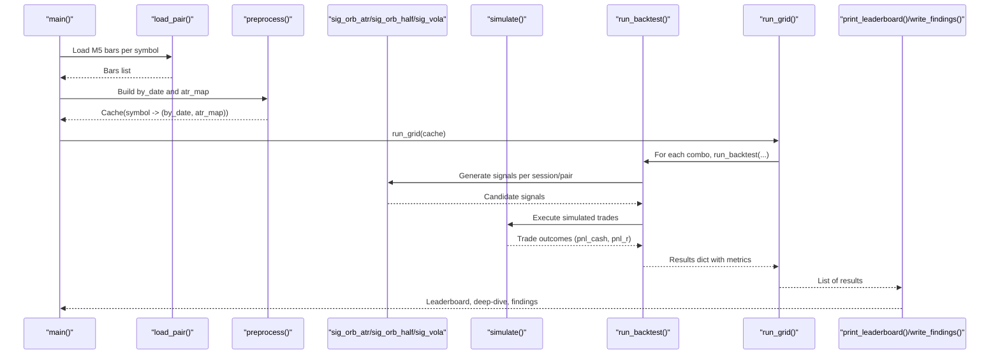
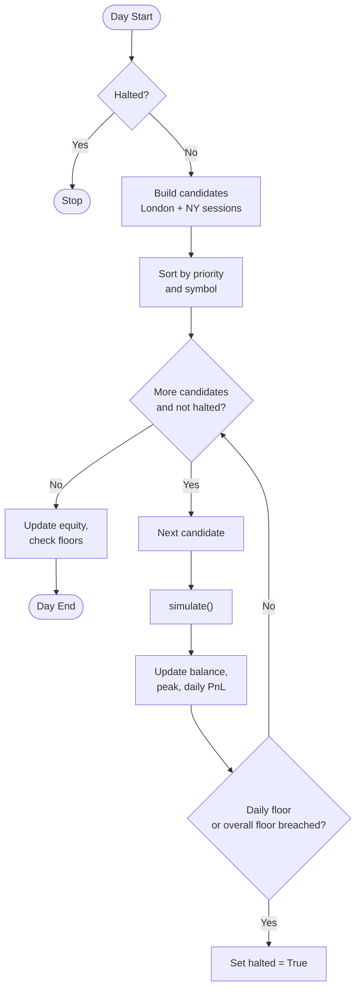
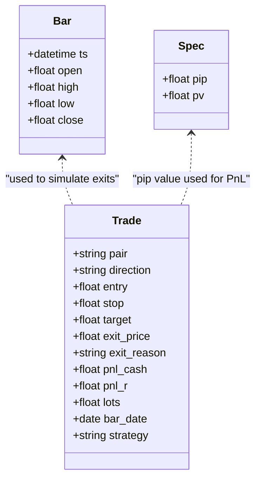
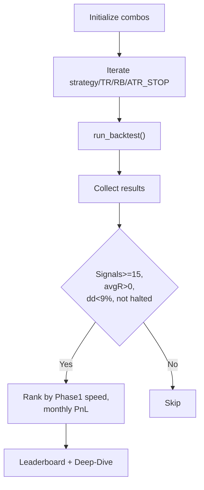
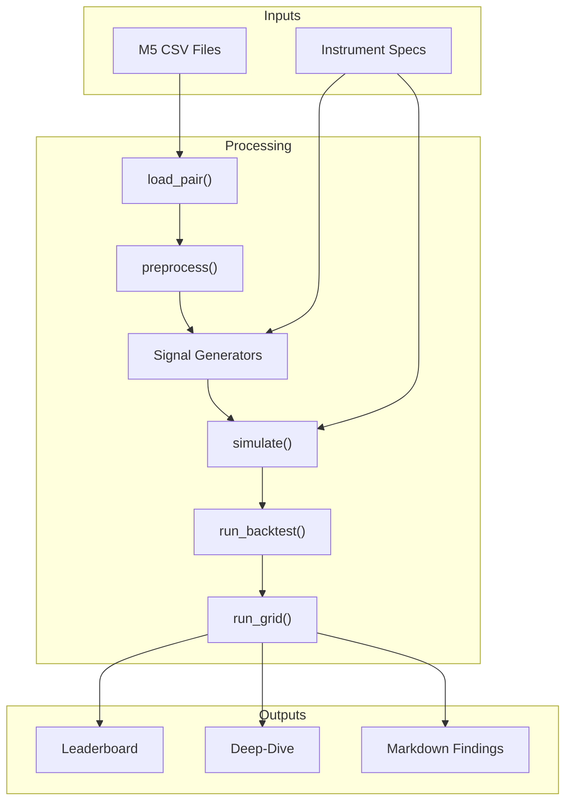

# Aggressive Optimizer

<cite>
**Referenced Files in This Document**
- [aggressive_optimizer.py](file://tools/aggressive_optimizer.py)
- [strategy_optimizer.py](file://tools/strategy_optimizer.py)
- [multi_pair_grid_search.py](file://tools/multi_pair_grid_search.py)
- [extended_grid_search.py](file://tools/extended_grid_search.py)
- [parameter_grid_search.py](file://tools/parameter_grid_search.py)
- [findings_aggressive_optimizer.md](file://findings_aggressive_optimizer.md)
</cite>

## Table of Contents
1. [Introduction](#introduction)
2. [Project Structure](#project-structure)
3. [Core Components](#core-components)
4. [Architecture Overview](#architecture-overview)
5. [Detailed Component Analysis](#detailed-component-analysis)
6. [Dependency Analysis](#dependency-analysis)
7. [Performance Considerations](#performance-considerations)
8. [Troubleshooting Guide](#troubleshooting-guide)
9. [Conclusion](#conclusion)
10. [Appendices](#appendices)

## Introduction
This document explains the aggressive optimization tool designed for high-risk trading scenarios, specifically targeting The5ers $2,500 New High Stakes challenge rules. It focuses on enhanced parameter search capabilities, aggressive risk-taking approaches, and advanced optimization algorithms that differ from the standard optimizer in risk parameters, position sizing, session coverage, and performance targets. It also provides configuration options for aggressive trading modes, enhanced drawdown tolerance, accelerated parameter exploration, usage examples to decide when to use aggressive versus standard optimization, guidance on interpreting results under high-risk contexts, and a discussion of trade-offs between aggressive optimization and risk management.

## Project Structure
The aggressive optimizer is implemented as a standalone Python script that:
- Loads multi-pair M5 OHLCV data across London and New York sessions
- Preprocesses bars into daily windows and computes rolling ATR
- Generates signals using three strategies (ORB with ATR stop, ORB with midpoint stop, volatility expansion)
- Simulates trades bar-by-bar with fixed lot sizing based on a constant base balance
- Runs a grid search over strategy-specific parameters
- Produces leaderboards, deep-dive analysis, and auto-generated findings

**Diagram sources**
- [aggressive_optimizer.py:149-168](file://tools/aggressive_optimizer.py#L149-L168)
- [aggressive_optimizer.py:174-207](file://tools/aggressive_optimizer.py#L174-L207)
- [aggressive_optimizer.py:226-288](file://tools/aggressive_optimizer.py#L226-L288)
- [aggressive_optimizer.py:294-328](file://tools/aggressive_optimizer.py#L294-L328)
- [aggressive_optimizer.py:334-485](file://tools/aggressive_optimizer.py#L334-L485)
- [aggressive_optimizer.py:491-509](file://tools/aggressive_optimizer.py#L491-L509)
- [aggressive_optimizer.py:515-552](file://tools/aggressive_optimizer.py#L515-L552)
- [aggressive_optimizer.py:558-598](file://tools/aggressive_optimizer.py#L558-L598)
- [aggressive_optimizer.py:603-761](file://tools/aggressive_optimizer.py#L603-L761)

**Section sources**
- [aggressive_optimizer.py:1-795](file://tools/aggressive_optimizer.py#L1-L795)

## Core Components
- Challenge constants and risk model: Fixed account balance ($2,500), per-trade risk fraction (0.40%), daily loss limit (5%), total floor (10% below starting balance), safety buffer before hard limits, target thresholds for Phase 1 completion.
- Parameter grids: Target R multiples, opening range bars, ATR stop fractions, and strategy selection.
- Instrument specs: Pip values and pip sizes for FX and XAUUSD to compute dollar value per pip per lot.
- Data structures: Bar and Trade dataclasses encapsulate time series and trade outcomes.
- Signal generators: Three strategies tailored for session breakouts and volatility expansions.
- Simulator: Bar-level exit scanning to determine target or stop hits within session windows.
- Backtester: Daily loop enforcing max trades per day, session boundaries, drawdown checks, equity tracking, and statistics computation.
- Grid search: Iterates combinations and prints progress; filters viable results by signal count, average R, drawdown, and halt status.
- Reporting: Leaderboard ranking by fastest Phase 1 completion and monthly P&L; deep-dive metrics and ASCII equity curve; auto-generated markdown findings.

Key differences from standard optimizer:
- Multi-pair coverage across London and New York sessions with dedicated pair lists.
- Fixed lot sizing based on initial balance to prevent compounding blow-up during drawdowns.
- Explicit Phase 1 target and qualifying days logic integrated into backtesting.
- Enhanced drawdown controls including daily floor and overall floor with safety buffer.
- Accelerated exploration via smaller, focused grids and deterministic ordering for reproducibility.

**Section sources**
- [aggressive_optimizer.py:34-85](file://tools/aggressive_optimizer.py#L34-L85)
- [aggressive_optimizer.py:122-144](file://tools/aggressive_optimizer.py#L122-L144)
- [aggressive_optimizer.py:213-220](file://tools/aggressive_optimizer.py#L213-L220)
- [aggressive_optimizer.py:226-288](file://tools/aggressive_optimizer.py#L226-L288)
- [aggressive_optimizer.py:294-328](file://tools/aggressive_optimizer.py#L294-L328)
- [aggressive_optimizer.py:334-485](file://tools/aggressive_optimizer.py#L334-L485)
- [aggressive_optimizer.py:491-509](file://tools/aggressive_optimizer.py#L491-L509)
- [aggressive_optimizer.py:515-552](file://tools/aggressive_optimizer.py#L515-L552)
- [aggressive_optimizer.py:558-598](file://tools/aggressive_optimizer.py#L558-L598)
- [aggressive_optimizer.py:603-761](file://tools/aggressive_optimizer.py#L603-L761)

## Architecture Overview
The system follows a modular pipeline:
- Data ingestion and preprocessing create date-indexed bars and ATR maps for each symbol.
- Strategy-specific signal generation produces candidate trades filtered by minimum ranges and ATR constraints.
- Simulation executes trades against future bars within session windows, computing net P&L after commissions.
- Backtesting aggregates daily results, enforces risk limits, tracks equity curves, and computes performance metrics.
- Grid search evaluates multiple configurations and ranks them by challenge-relevant criteria.
- Reporting outputs leaderboards, deep-dive summaries, and markdown findings for further analysis.

**Diagram sources**
- [aggressive_optimizer.py:767-790](file://tools/aggressive_optimizer.py#L767-L790)
- [aggressive_optimizer.py:149-168](file://tools/aggressive_optimizer.py#L149-L168)
- [aggressive_optimizer.py:174-207](file://tools/aggressive_optimizer.py#L174-L207)
- [aggressive_optimizer.py:226-288](file://tools/aggressive_optimizer.py#L226-L288)
- [aggressive_optimizer.py:294-328](file://tools/aggressive_optimizer.py#L294-L328)
- [aggressive_optimizer.py:334-485](file://tools/aggressive_optimizer.py#L334-L485)
- [aggressive_optimizer.py:491-509](file://tools/aggressive_optimizer.py#L491-L509)
- [aggressive_optimizer.py:515-552](file://tools/aggressive_optimizer.py#L515-L552)
- [aggressive_optimizer.py:603-761](file://tools/aggressive_optimizer.py#L603-L761)

## Detailed Component Analysis

### Aggressive Multi-Pair Backtester
- Session handling: London (07:00–11:00 Europe/London) and New York (08:30–11:00 America/New_York) with DST-aware conversions.
- Pair grouping: Dedicated lists for London and NY pairs to diversify exposure while limiting correlated risk.
- Daily limits: Max two trades per day to avoid overexposure on correlated pairs; enforced per-symbol per-day cap.
- Risk controls: Daily floor at 5% below start-of-day balance plus safety buffer; overall floor at 10% below starting balance triggers halt.
- Equity tracking: Running peak and true peak-to-trough drawdown computed from sequential equity points.
- Metrics: Win rate, average R, profit factor, monthly P&L estimate, Sharpe-like ratio, Phase 1 completion status, qualifying days.

**Diagram sources**
- [aggressive_optimizer.py:334-485](file://tools/aggressive_optimizer.py#L334-L485)

**Section sources**
- [aggressive_optimizer.py:334-485](file://tools/aggressive_optimizer.py#L334-L485)

### Signal Generators and Lot Sizing
- ORB with ATR stop: Entry beyond opening range; stop set as a fixed ATR fraction from entry; target at R multiple; lot size derived from fixed risk budget.
- ORB with midpoint stop: Stop placed near opening range midpoint; tighter stops increase R but may raise false-stop frequency.
- Volatility expansion: Entry on bars with range exceeding 1.5×ATR; stop at bar midpoint; target at R multiple.
- Lot sizing: Always sized off initial $2,500 balance to prevent compounding blow-ups; uses pip value and commission per lot to compute lots.

**Diagram sources**
- [aggressive_optimizer.py:122-144](file://tools/aggressive_optimizer.py#L122-L144)
- [aggressive_optimizer.py:66-78](file://tools/aggressive_optimizer.py#L66-L78)

**Section sources**
- [aggressive_optimizer.py:213-220](file://tools/aggressive_optimizer.py#L213-L220)
- [aggressive_optimizer.py:226-288](file://tools/aggressive_optimizer.py#L226-L288)

### Grid Search and Leaderboard
- Grid dimensions: Strategy × Target R × Opening Range Bars × ATR Stop (conditional).
- Filtering: Only viable combos with sufficient signals, positive average R, acceptable drawdown, and no halt are ranked.
- Ranking: Prioritizes fastest Phase 1 completion, then monthly P&L.
- Output: Top 20 leaderboard with key metrics; deep-dive includes equity curve and per-pair breakdown.

**Diagram sources**
- [aggressive_optimizer.py:491-509](file://tools/aggressive_optimizer.py#L491-L509)
- [aggressive_optimizer.py:515-552](file://tools/aggressive_optimizer.py#L515-L552)

**Section sources**
- [aggressive_optimizer.py:491-509](file://tools/aggressive_optimizer.py#L491-L509)
- [aggressive_optimizer.py:515-552](file://tools/aggressive_optimizer.py#L515-L552)

### Findings and Interpretation
- Auto-generated markdown summarizes approach, strategy comparison, top results, best configuration, expected challenge timeline, and per-pair contributions.
- Best configuration highlights include win rate, average R, profit factor, drawdown, total P&L, estimated monthly P&L, final balance, Phase 1 result, and qualifying days.
- Per-pair contribution shows which instruments drive performance under the best configuration.

**Section sources**
- [findings_aggressive_optimizer.md:1-141](file://findings_aggressive_optimizer.md#L1-L141)
- [aggressive_optimizer.py:603-761](file://tools/aggressive_optimizer.py#L603-L761)

## Dependency Analysis
- Data dependencies: M5 OHLCV CSV files per symbol under validation/HistoryData; file naming supports both legacy and new formats.
- Timezone dependencies: DST-aware conversion functions ensure correct session boundaries across years.
- Instrument dependencies: Pip values and pip sizes define dollar-per-pip calculations for accurate PnL and lot sizing.
- Internal dependencies: Functions are cohesive and layered—loader → preprocess → signals → simulator → backtester → grid → reporting.

**Diagram sources**
- [aggressive_optimizer.py:149-168](file://tools/aggressive_optimizer.py#L149-L168)
- [aggressive_optimizer.py:174-207](file://tools/aggressive_optimizer.py#L174-L207)
- [aggressive_optimizer.py:226-288](file://tools/aggressive_optimizer.py#L226-L288)
- [aggressive_optimizer.py:294-328](file://tools/aggressive_optimizer.py#L294-L328)
- [aggressive_optimizer.py:334-485](file://tools/aggressive_optimizer.py#L334-L485)
- [aggressive_optimizer.py:491-509](file://tools/aggressive_optimizer.py#L491-L509)
- [aggressive_optimizer.py:515-552](file://tools/aggressive_optimizer.py#L515-L552)
- [aggressive_optimizer.py:603-761](file://tools/aggressive_optimizer.py#L603-L761)

**Section sources**
- [aggressive_optimizer.py:66-85](file://tools/aggressive_optimizer.py#L66-L85)
- [aggressive_optimizer.py:91-117](file://tools/aggressive_optimizer.py#L91-L117)

## Performance Considerations
- Computational efficiency: Preprocessing builds by_date caches and rolling ATR once per symbol; session filtering reduces candidate signals; deterministic sorting ensures reproducible runs.
- Memory usage: Loading all symbols’ bars into memory; consider streaming if dataset grows significantly.
- I/O bottlenecks: CSV parsing per symbol; large datasets can slow initialization.
- Optimization opportunities:
  - Parallelize symbol loading and preprocessing.
  - Vectorize bar scans where possible.
  - Reduce grid size incrementally based on early results.
  - Use caching for repeated runs with same data.

[No sources needed since this section provides general guidance]

## Troubleshooting Guide
Common issues and resolutions:
- No data loaded: Ensure M5 CSV files exist under validation/HistoryData with expected naming patterns; verify file paths and permissions.
- Zero ATR: If pre-London ATR cannot be computed due to insufficient bars, signals will be skipped; check data coverage before 07:00 London time.
- Low signal count: Adjust minimum range filters or session windows; verify pair lists and session definitions match available data.
- Halting too early: Review daily floor and overall floor settings; consider adjusting safety buffer or risk fraction if overly conservative.
- Overfitting concerns: Validate best configurations on out-of-sample data; forward-test on demo for several weeks before live deployment.

**Section sources**
- [aggressive_optimizer.py:149-168](file://tools/aggressive_optimizer.py#L149-L168)
- [aggressive_optimizer.py:174-207](file://tools/aggressive_optimizer.py#L174-L207)
- [aggressive_optimizer.py:334-485](file://tools/aggressive_optimizer.py#L334-L485)

## Conclusion
The aggressive optimizer provides a robust framework for high-risk trading scenarios aligned with The5ers challenge rules. It emphasizes fixed lot sizing, strict drawdown controls, multi-pair session coverage, and accelerated parameter exploration. Compared to the standard optimizer, it integrates Phase 1 targets, qualifying days, and explicit daily/overall floors to simulate realistic challenge conditions. Results should be interpreted with caution, focusing on sustainable expectancy, drawdown resilience, and forward-testing outcomes.

[No sources needed since this section summarizes without analyzing specific files]

## Appendices

### Configuration Options for Aggressive Trading Modes
- Risk parameters:
  - Per-trade risk fraction: 0.40% of fixed $2,500 base
  - Daily loss limit: 5% of start-of-day balance
  - Overall floor: 10% below starting balance
  - Safety buffer: Additional margin before hard limits
- Position sizing:
  - Fixed base balance prevents compounding blow-ups
  - Lots calculated from pip value and commission per lot
- Performance targets:
  - Phase 1 target: +10% ($2,750)
  - Qualifying days: Minimum 3 days with net >= $12.50
- Accelerated exploration:
  - Smaller, focused grids for Target R, ORB bars, ATR stops
  - Deterministic ordering for reproducibility

**Section sources**
- [aggressive_optimizer.py:34-85](file://tools/aggressive_optimizer.py#L34-L85)
- [aggressive_optimizer.py:213-220](file://tools/aggressive_optimizer.py#L213-L220)
- [aggressive_optimizer.py:334-485](file://tools/aggressive_optimizer.py#L334-L485)
- [aggressive_optimizer.py:491-509](file://tools/aggressive_optimizer.py#L491-L509)

### Usage Examples: When to Use Aggressive vs Standard Optimization
- Use aggressive optimization when:
  - Targeting fast Phase 1 completion under tight drawdown constraints
  - Exploring multi-pair session strategies with fixed risk and strict floors
  - Validating robustness across diverse instruments and sessions
- Use standard optimization when:
  - Focusing on single-pair or limited-session strategies
  - Emphasizing broader parameter spaces without challenge-specific constraints
  - Conducting preliminary research before committing to aggressive mode

**Section sources**
- [aggressive_optimizer.py:491-509](file://tools/aggressive_optimizer.py#L491-L509)
- [strategy_optimizer.py:1-800](file://tools/strategy_optimizer.py#L1-L800)

### Interpreting Results in High-Risk Contexts
- Focus on:
  - Average R and profit factor as primary expectancy indicators
  - Maximum drawdown and halt status for risk control
  - Monthly P&L estimates for realistic income expectations
  - Phase 1 completion and qualifying days for challenge viability
- Caution:
  - Avoid overfitting to short windows; validate on longer datasets
  - Forward-test on demo to confirm execution costs and slippage assumptions
  - Monitor per-pair contributions to identify concentration risks

**Section sources**
- [aggressive_optimizer.py:515-552](file://tools/aggressive_optimizer.py#L515-L552)
- [aggressive_optimizer.py:558-598](file://tools/aggressive_optimizer.py#L558-L598)
- [findings_aggressive_optimizer.md:1-141](file://findings_aggressive_optimizer.md#L1-L141)

### Trade-Offs Between Aggressive Optimization and Risk Management
- Benefits:
  - Faster Phase 1 completion potential
  - Diversified exposure across sessions and pairs
  - Strict drawdown controls to protect capital
- Risks:
  - Higher transaction costs and slippage impact
  - Potential overfitting to historical data
  - Correlated pair exposure despite limits
- Mitigation:
  - Forward-testing and out-of-sample validation
  - Gradual scaling of risk after proven consistency
  - News filters and execution safeguards

**Section sources**
- [aggressive_optimizer.py:334-485](file://tools/aggressive_optimizer.py#L334-L485)
- [aggressive_optimizer.py:603-761](file://tools/aggressive_optimizer.py#L603-L761)